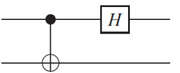
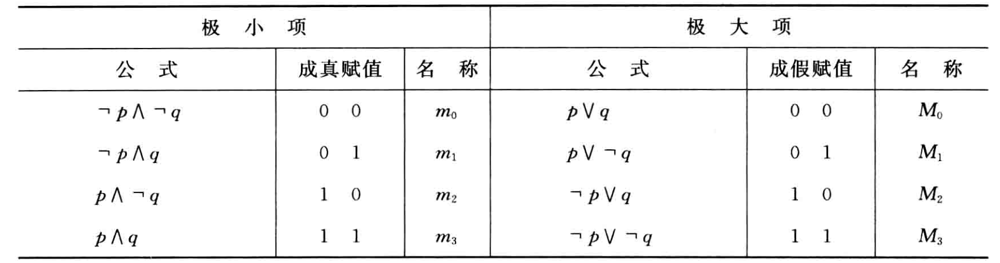
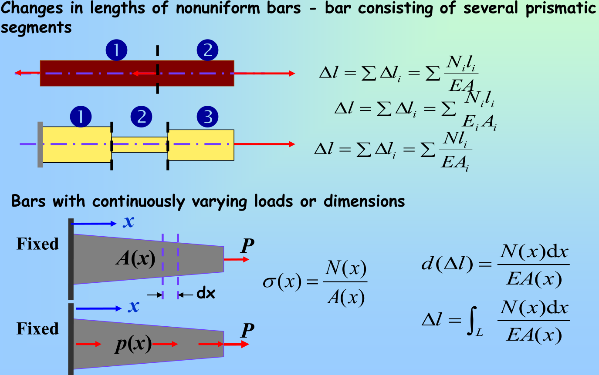
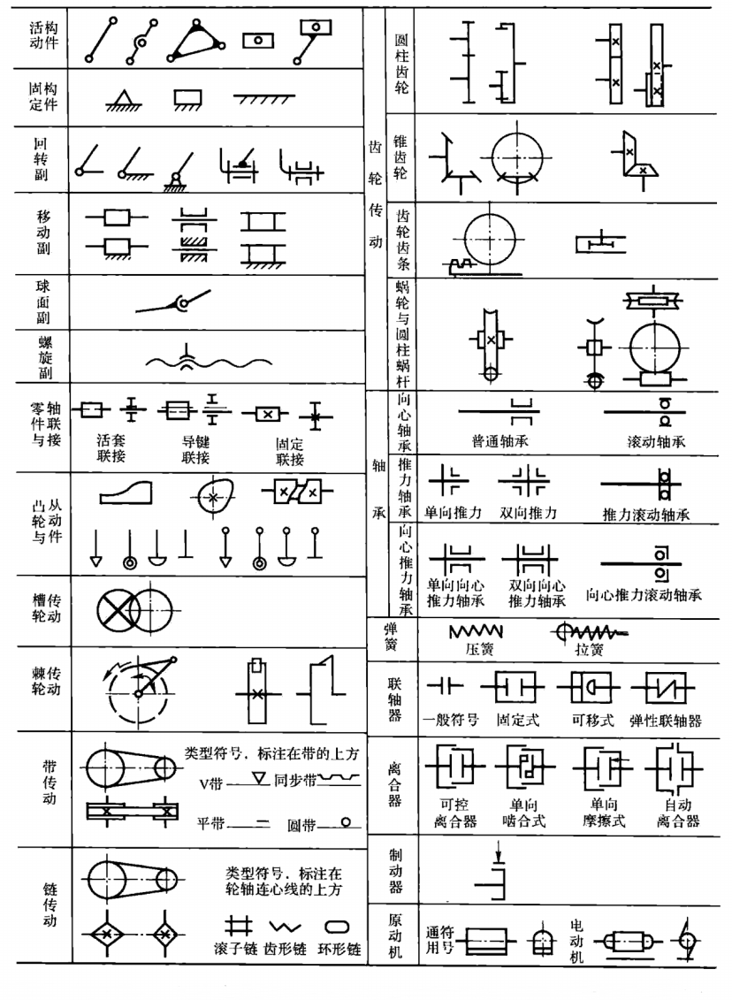

---

---

## 高宽比

- 高宽比低
- 高宽均衡
- 高宽比高

## 信息密度

- 信息密度低
- 信息密度高

## 缩放

- 不变
- 缩小
- 更小

## 处理

高宽比低，信息密度低 -> 缩小
高宽均衡，信息密度低 -> 更小
高宽比高，信息密度低 -> 更小
高宽比低，信息密度高 -> 不变
高宽均衡，信息密度高 -> 不变
高宽比高，信息密度高 -> 不变

高宽比低，信息密度低

高宽均衡，信息密度低

高宽比高，信息密度低

高宽比低，信息密度高

高宽均衡，信息密度高

高宽比高，信息密度高

@import "style.js"