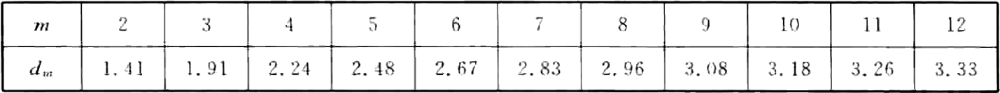
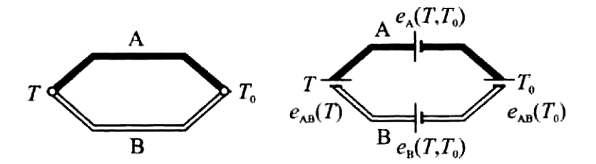
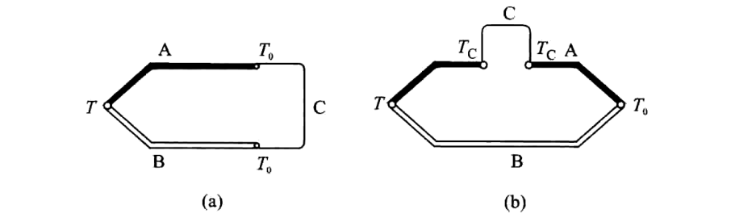
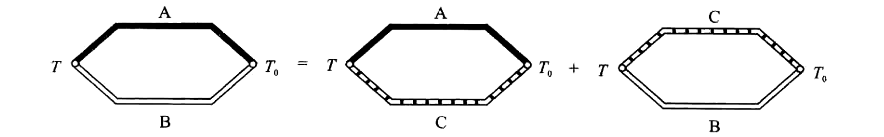
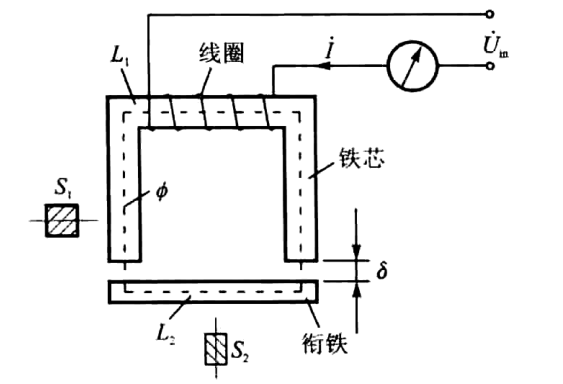
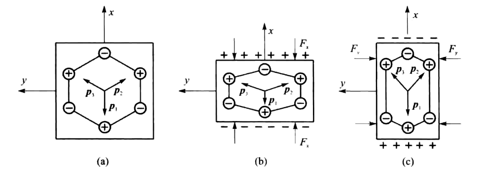
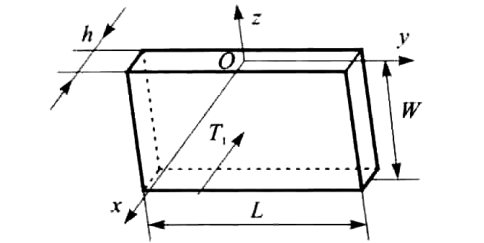
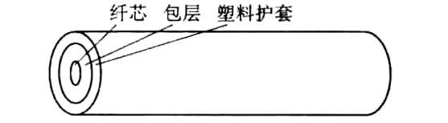

#! https://zhuanlan.zhihu.com/p/704154810

# 传感器技术考前补天😭

## 绪论

传感器的基本结构一般包含敏感元件、转换元件和测量电路(调理电路)，其中敏感元件是传感器技术的核心，决定了传感器的工作机理。

传感器的三要素是测量、敏感元件、电信号

现代信息技术的三大技术基础是信息的获取、传输与处理，也就是传感器技术、通信技术和计算机技术。

传感器不是一个相对独立的技术，它是测量技术中的一个重要环节，通常与其他测量技术和设备一起使用，以实现对各种物理量或化学量的测量。

在信息技术中，传感器技术的发展速度相对较慢，远不及计算机技术和通信技术的发展速度。

## 传感器的特性

### 传感器静态特性的一般描述

传感器的静态特性就是指当被测量 $x$ 不随时间变化，或随时间的变化程度远缓慢于传感器固有的最低阶运动模式的变化程度时，传感器的输出量 $y$ 与输入量 $x$ 之间的函数关系。通常可以将其描述为

$$
y=f(x)=\sum_{i=0}^na_ix^i
$$

式中 $a_i$——传感器的标定系数，反映了传感器静态特性曲线的形态。

$$
y\:=\:a_0\:+\:a_1\:x
$$

时，传感器的静态特性为一条直线，称$a_i$为零位输出，$a_1$为静态传递系数(或静态增益)。通常传感器的零位是可以补偿的，使传感器的静态特性变为

$$
y=a_{1}x
$$

这时称传感器为线性的。

### 传感器的静态标定

传感器的静态特性是通过静态标定(calibration)或静态校准的过程获得的。

**对标定环境的要求**

1. 无加速度，无振动，无冲击；
2. 温度在 15~25°C ;
3. 相对湿度不大于 85 %;
4. 大气压力为0.1 MPa。

**对所用的标定设备的要求**

当标定设备和被标定的传感器的确定性系统误差较小或可以补偿，而只考虑它们的随机误差时，应满足如下条件：

$$
\sigma_s\leqslant\frac13\sigma_m
$$

式中 $\sigma_s$一标定设备的随机误差；
$\sigma_m$一被标定的传感器的随机误差。

若标定设备和被标定的传感器的随机误差比较小，只考虑它们的系统误差时，应满足如下条件：

$$
\varepsilon_{s}\leqslant\frac{1}{10}\varepsilon_{m}
$$

式中 $\varepsilon_{s}$一标定设备的系统误差；
$\varepsilon_m$一被标定的传感器的系统误差。

对于高性能传感器或测量装置的标定,有时很难有合适的标定设备，这时可以通过间接评估，如根据传感器被测量的单位所包含的基本量的不确定度进行评估。

**标定过程的要求**

在上述条件下，在标定的范围(即被测量的输入范围)内，选择 $n$ 个测量点 $x_i,i=1,2,...,n;$ 共进行 $m$ 个循环，于是可以得到 $2mn$ 个测试数据。

正行程的第 $j$ 个循环，第 $i$ 个测点为 $(x_i,y_{uij})$；
反行程的第 $j$ 个循环，第 $i$ 个测点为 $(x_i,y_{dij})$；
$j=1,2,...,m$ 为循环数。

**传感器的静态特性**

对于第 $i$ 个测点，基于上述标定值，所对应的平均输出为

$$
\bar{y}_i=\frac{1}{2m}\sum_{j=1}^m\left(y_{uij}+y_{dij}\right),\quad i=1,2,\cdots,n
$$

得到了传感器 $n$ 个测点对应的输入/输出关系 $(x_i,\bar{y}_i)(i=1,2,...,n)$，这就是传感器的静态特性。

### 传感器的主要静态性能指标及其计算

**测量范围**：用测量上限和测量下限表示的测量区间。**量程**：测量上限和测量下限的代数差。

测量上限：传感器所能测量的最大被测量；测量下限：传感器所能测量的最小被测量。

**静态灵敏度**：传感器输出变化量与输入变化量之比。

对线性传感器灵敏度是直线的斜率，对非线性传感器灵敏度为一变量。

灵敏度与测量范围有矛盾关系。

**分辨力** $\Delta x_{i, \mathrm{min}}$ 反映了传感器检测输入微小变化的能力。

**分辨率** $r_i=\dfrac{\Delta x_{i,\min}}{x_{\max}-x_{\min}}$

针对全测量范围辨率 $\max\lvert\Delta x_{i,\min}\rvert\quad r=\dfrac{\max\lvert\Delta x_{i,\min}\rvert}{x_{\max}-x_{\min}}$

**时漂**：输出量随时间变化的现象。

反映传感器的稳定性指标；时间范围有1 小时、1 天、1 个月、半年或1 年等。

**温漂**：由外界环境温度变化引起的输出量变化的现象。

零点漂移 $\nu=\dfrac{\overline{y}_0\left(t_2\right)-\overline{y}_0\left(t_1\right)}{\overline{y}_{\mathrm{FS}}\left(t_1\right)\left(t_2-t_1\right)}\times100\%$

满量程漂移 $\beta=\dfrac{\overline{y}_\mathrm{FS}\left(t_2\right)-\overline{y}_\mathrm{FS}\left(t_1\right)}{\overline{y}_\mathrm{FS}\left(t_1\right)\left(t_2-t_1\right)}\times100\%$

- $\bar{y}_0(t_2)$一一在规定的温度(高温或低温)$t_2$保温一小时后，传感器零点输出的平均值；
- $\bar{y}_0(t_1)$一一在室温$t_1$时，传感器零点输出的平均值；
- $\bar{y}_{\mathrm{FS}}(t_1)$一一在室温$t_1$时，传感器满量程输出的平均值；
- $\bar{y}_{\mathrm{FS}}(t_2)$一一在规定的温度(高温或低温)$t_{2}$ 保温一小时后时，传感器满量程输出的平均值。

**传感器的测量误差**

绝对误差 $\Delta y=y_{\mathrm{a}}-y_{\mathrm{t}}$

相对误差 $\dfrac{\Delta y}{y_\mathrm{FS}}=\dfrac{y_\mathrm{a}-y_\mathrm{t}}{y_{\mathrm{FS}}}$

针对被测量值误差 $\Delta x =x_{\mathrm{a}}-x_{\mathrm{t}}$

**线性度**：传感器实际的静态特性的校准特性曲线与某一参考直线不吻合程度的最大值。选取不同的参考直线所计算出的线性度不同。

$$
\xi_{\mathrm{L}}\:=\:\frac{\mid(\:\Delta y_{\mathrm{L}}\:)_{\mathrm{max}}\mid}{y_{\mathrm{FS}}}\times100\%
$$

$$
(\Delta y_{\mathrm{L}})_{\mathrm{max}}=\max\:|\:\Delta y_{i,\mathrm{L}}\:|\:,\quad i=1,2,\cdots,n
$$

$$
\Delta y_{i,\mathrm{L}}\:=\:\bar{y}_{i}\:-\:y_{i}
$$

- $y_{\mathrm{FS}}$ 满量程输出，$y_{\mathrm{FS}}=|B(x_{\max}-x_{\min})|$，$B$ 为所选定的参考直线的斜率。
- $\Delta y_\mathrm{i,L}$ 是第 $i$ 个校准点平均输出值与所选定的参考直线的偏差，称为非线性偏差；$(\Delta y_\mathrm{L})_\mathrm{max}$ 则是 $n$ 个测点中的最大偏差。

**绝对线性度**：又称理论线性度。其参考直线是事先规定好的，与实际标定过程和标定结果无关。

**端基线性度**：标定过程获得的两个端点的连线，称端基直线，作为参考直线。

**平移端基线性度**：将端基直线平移，以使最大正、负偏差绝对值相等，从而得到平移端基直线，作为参考直线。

**最小二乘线性度**：基于所得到的 $n$ 个标定点，利用偏差平方和最小来确定最小二乘直线，作为参考直线。

对于静态特性具有明显的非线性的传感器，就必须用非线性曲线，而不是用直线来拟合传感器的静态特性。这样实际标定得到的测点相对于某一非线性参考曲线的偏差程度就是**符合度**。

在考虑参考曲线时应当考虑以下原则

- 应满足所需要的拟合误差要求；
- 函数的形式尽可能简单；
- 选用多项式时，其阶次尽可能低。

**迟滞**：传感器同一个输入量对应的正、反行程的输出不一致。

$\displaystyle \bar{y}_{ui}=\dfrac{1}{m}\sum_{j=1}^{m}y_{uij} \quad \bar{y}_{di}=\dfrac{1}{m}\sum_{j=1}^{m}y_{\text{d}ij}$

$\Delta y_{i,\mathrm{H}}=\mid\bar{y}_{ui}-\bar{y}_{di}\mid$

迟滞指标 $\left(\Delta y_{\mathrm{H}}\right)_{\max}=\max\left(\Delta y_{i,\mathrm{H}}\right),\quad i=1,2,\cdots,n$

迟滞误差 $\xi_{\mathrm{H}}=\dfrac{(\Delta y_{\mathrm{H}})_{\mathrm{max}}}{2 y_{\mathrm{FS}}}\times100\%$

同一个测点传感器按同一方向作全量程的多次重复测量时，每一次的输出值都不一样，其大小是随机的。为反映这一现象，引入**重复性**指标。

**极差法**

$$
s_{ui}=\frac{W_{ui}}{d_{m}}
$$

$$
W_{ui}=\max\left(y_{uij}\right)-\min\left(y_{uij}\right),\quad j=1,2,\cdots,m
$$

$W_{ui}$ 极差，即第$i$ 个测点正行程的$m$ 个标定值中的最大值与最小值之差；$d_m$ 极差系数，取决于测量循环次数，即样本容量 $m$。极差系数与 $m$ 的关系见表

**贝赛尔(Bessel)公式**

$$
s_{ui}^{2}=\frac{1}{m-1}\sum_{j=1}^{m}(\Delta y_{uij})^{2}=\frac{1}{m-1}\sum_{j=1}^{m}(y_{uij}-\bar{y}_{ui})^{2}
$$

类似地可以给出第$i$ 个测点反行程的子样标准偏差 $s_{di}$。

第$i$ 个测点的**子样标准偏差**

$$
s_{i}=\sqrt{0.5(s_{ui}^{2}+s_{di}^{2})}
$$

当认为是等精密性测量时，整个测试过程的**标准偏差**

$$
s=\sqrt{\frac{1}{n}\sum_{i=1}^{n}s_{i}^{2}}
$$

也可以利正、反行程子样标准偏差中的最大值来计算整个测试过程的标准偏差

$$
s=\max\left(s_{ui},s_{di}\right),\quad i=,1,2,\cdots,n
$$

整个测试过程的标准偏差就可以描述传感器的随机误差，则传感器的重复性指标为

$$
\xi_{\mathrm{R}}=\frac{3s}{y_{\mathrm{FS}}}\times100\%
$$

式中，3为置信概率系数，$3s$为置信限或随机不确定度。

## 基本弹性敏感元件

**材料的弹性模量和泊松比的物理意义**

弹性模量是一种描述物质弹性特性的物理量，它表示在弹性形变范围内，物体应力与应变之间的比值。

泊松比是指材料在单向受拉或受压时，横向应变与轴向应变的比值，是反映材料横向变形的弹性常数。泊松比的大小反映了材料在受力时内部结构的稳定性，以及材料在多个方向上变形的协调性。

**在物理量传感器中，可以利用弹性敏感元件的哪些物理特性？**

利用应力应变特性，固有频率特性，刚度特性，热特性，电阻电容变化。

利用弹性敏感元件在外界载荷作用下引起的位移，应变，应力的变化规律进行测量；
利用在外界载荷作用下引起的等效刚度，等效质量或者等效阻尼的变化规律进行测量。

**弹性敏感元件的刚度、弹性滞后、弹性后效、蠕变的物理意义**

刚度：单位输出变化量（位移，应变）所需要的输入变化量（外界载荷）即为刚度，某一点的刚度可以表示为dF/dx。

弹性滞后：在弹性变形范围内，加载特性与卸载特性不重合的现象称为弹性滞后。

弹性后效：弹性元件在阶跃载荷作用下，所产生的变形不能立刻完成，需要经过一段时间间隔才能完成的过程称为弹性元件的弹性后效。

蠕变：当外力保持恒值时，弹性元件在一个较长时间范围内仍然缓慢变形的现象。

## 应变片

**灵敏系数**

$$
K=\frac{-\frac{\Delta R}{R}}{\varepsilon}
$$

应变片的灵敏系数 K 小于同种材料金属丝的灵敏系数 K0 ，其主要原因就是应变片的横向效应和粘贴胶带来的应变传递失真。

**什么是电阻应变片的横向效应？它是如何产生的？如何减小电阻应变片的横向效应（写出一种方法即可）？**

定义：应变片由于圆弧处感受横向应变而使电阻变化率减小并使应变片灵敏系数降低的现象称为应变片的横向效应。

横向效应产生原因：在于圆弧段感受到的应变从$\varepsilon_x$变到$\varepsilon_y$ (单向拉伸时，$\varepsilon_y=-\mu_0\varepsilon_x)$。

采用短接措施或采用箔式应变片，可以减小横向效应。

**应变片在使用时，为什么会出现温度误差？如何减小它（分别从应变片和测量电路两个方面进行阐述）？**

温度误差产生原因：

1) 电阻的热效应：敏感栅本身存在温度系数，当温度改变时，应变片的标称阻值发生变化；
2) 试件与应变丝的材料线膨胀系数不一致，使应变丝产生附加变形，从而造成电阻变化。

应变片自补偿法：

1) 单丝自补偿法：合理选择应变片和使用试件，使 $\alpha+K{\left(\beta_{\mathrm{g}}-\beta_{\mathrm{s}}\right)}=0$ ；
2) 双丝自补偿法：由两种不同电阻温度系数（一种为正值，一种为负值）的材料串联组成敏感栅，以达到一定温度范围内在一定材料的试件上实现温度补偿。

为了达到温度补偿又使工作应变片的灵敏系数损失少一些，补偿栅材料通常选用电阻温度系数大而电阻率小的材料，工作应变片必须使用电阻率大、电阻温度系数小的材料。

电路补偿法：

1) 测量应变时，使用两个应变片，一片贴在被测试件的表面,称为工作应变片R1。另一片贴在与被测试件材料相同的补偿块上，称为补偿应变片R2。在工作过程中补偿块不承受应变，仅随温度发生变形。
2) 根据被测试件承受应变的情况，可以不另加专门的补偿块，而是将补偿片贴在被测试件上，这样既能起到温度补偿作用，又能提高输出的灵敏度。
3) 采用热敏电阻进行补偿。

**单臂受感电桥的非线性误差**

$$
\xi_\mathrm{L}\approx\frac{-\frac{\Delta R_1}{R_1}}{2}
$$

减少非线性误差：差动电桥、采用恒流源供电电桥。

## 压阻式传感器

半导体材料的应变灵敏系数

$$
K=\frac{\Delta R/R}{\varepsilon_\mathrm{L}}\approx\pi_\mathrm{L}E
$$

## 热电阻测温传感器

$$
R_{t} = R_{0}\Big[ 1 + \alpha( t - t_{0} ) \Big]
$$

电阻灵敏度

$$
K=\frac1{R_0}\cdot\frac{\mathrm{d}R_t}{\mathrm{d}t}=\alpha
$$

## 热电偶测温

热电偶回路的热电势 $E_{\mathrm{AB}}(T,T_{0})$ 只与两导体材料及两结点温度 $T,T_{0}$ 有关

$$
E_{\mathrm{AB}}( T,T_{0} ) = f( T ) - f( T_{0} )
$$

**中间温度定律**

$$
E_{\mathrm{AB}}(T,T_{0}) = E_{\mathrm{AB}}(T,T_{\mathrm{C}}) + E_{\mathrm{AB}}( T_{\mathrm{C}},T_{0})
$$

**中间导体定律**

(a) $E_{\mathrm{ABC}}(T,T_{0})=E_{\mathrm{AB}}(T,T_{0})$

(b) $E_{\mathrm{ABC}}(T,T_{0},T_{\mathrm{C}}) = E_{\mathrm{AB}}(T,T_{0})$

**标准电极定律**

$$
E_{\mathrm{AB}}(T,T_0)=E_{\mathrm{AC}}(T,T_0)+E_{\mathrm{CB}}(T,T_0)=E_{\mathrm{AC}}(T,T_0)-E_{\mathrm{BC}}(T,T_0)
$$

## 电容式传感器

电容式敏感元件的特点主要有：非接触式测量、结构简单、灵敏度高、分辨率高、动态响应好、可在恶劣环境下工作等；其缺点主要有：受干扰影响大、特性稳定性稍差、易受电磁干扰、高阻输出状态、介电常数受温度影响大、有静电吸力等。

平行极板电容式传感器

$$
C=\frac{\varepsilon_r\varepsilon_0S}{\delta}
$$

串联 $C=\dfrac{C_1C_2}{C_1+C_2}$ ，并联 $C=C_1+C_2$

## 变磁路式传感器

- 结构简单、工作中没有活动电接触点、工作可靠、寿命长。
- 灵敏度高、分辨力高。
- 重复性比较好，在较大的范围内具有良好的线性度
- 不足：如存在较大的交流零位输出信号，不适于高频动态测量等，易受外界电磁场干扰。

$$
L=\frac{W\Phi}{I}
$$

$$
\Phi=\frac{IW}{R_{M}}=\frac{IW}{R_{F}+R_{\delta}}
$$

$$
R_{F}=\frac{L_{1}}{\mu_{1}S_{1}}+\frac{L_{2}}{\mu_{2}S_{2}}
$$

$$
R_{\delta}=\frac{2\delta}{\mu_{0}S}
$$

$$
L\approx\frac{W^2}{R_\delta}=\frac{W^2\mu_0S}{2\delta}
$$

差动式与单线圈电感式传感器相比，具有下列优点:

- 线性好；
- 灵敏度提高一倍，即衔铁位移相同时，输出信号大一倍；
- 温度变化、电源波动、外界干扰等对传感器精度的影响由于能互相抵消而减小。

自感式传感器的特点及应用

- 分辨率高
- 测量范围比较小，适用于测量较小位移
- 存在非线性
- 消耗功率较大，尤其是单极式电感传感器
- 需要磁屏蔽
- 限制在磁性材料的居里温度范围

## 霍尔效应

$$
U_\text{H}=\frac{R_\text{H}IB}{d}
$$

## 压电式传感器

**石英晶体**

- x 轴：电轴，b 纵向压电效应
- y 轴：机械轴，c 横向压电效应
- z 轴(光轴，中性轴)

石英晶体平行六面体切片

$$
\sigma_{11} = d_{11} T_{1} = d_{11} \frac{F_1}{LW}
$$

- $\sigma_{11}$ 垂直于z轴表面上产生的电荷密度
- $d_{11}$ 压电常数，表示晶片在上方向承受正应力时，单位压缩正应力在垂直于 $x$ 轴的晶面上所产生的电荷密度
- $F_1$ 沿晶轴 $x$ 方向施加的压缩力

**压电陶瓷**

由无数细微的电畴组成。这些电畴实际上是自发极化的小区域。自发极化的方向完全是任意排列的。在无外电场作用时，从整体上看，这些电畴的极化效应被相互抵消了，使原始的压电陶瓷呈电中性，不具有压电性质。为了使压电陶瓷具有压电效应，必须进行极化处理。所谓极化处理，就是在一定温度下对压电陶瓷施加强电场(例如20〜30kV/cm的直流电场)，经过2〜3h以后，压电陶瓷就具备了压电性能。这是因为陶瓷内部的电畴的极化方向在外电场作用下都趋向于电场的方向，这个方向就是压电陶瓷的极化方向。经过极化处理的压电陶瓷，在外电场去掉后，其内部仍存在着很强的剩余极化强度。当压电陶瓷受到外力作用时，电畴的界限发生移动，因此剩余极化强度将发生变化，压电陶瓷就呈现出压电效应。

## 光纤传感器

$$
n_1 \sin \varphi_1 = n_2\sin \varphi_2
$$

光纤的数值孔径表征光纤的集光能力。在一定的条件下，NA 值大，则由光源输入光纤的光功率大，光纤集光能力强。

$$
NA = \frac{\sqrt{n_{1}^{2}-n_{2}^{2}}}{n_0}
$$

光纤的传输损耗

$$
\alpha_{\mathrm{dB}}=-\frac1L10\log\left(\frac{P_{\mathrm{out}}}{P_{\mathrm{in}}}\right)\quad(\mathrm{~dB/km~})
$$

相位差

$$
\phi=\frac{2\pi Ln}{\lambda}
$$
