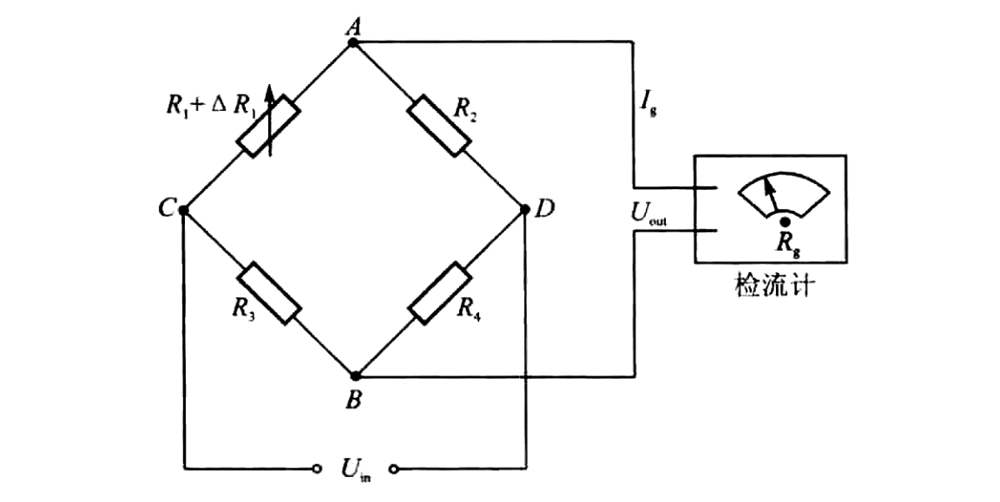

# 电桥原理

通过电桥(bridge circuit)将电阻的变化转变成电压或电流信号。

## 单臂受感全桥电路

**电桥平衡** $U_{out}=0$

$$
\frac{R_1}{R_2}=\frac{R_3}{R_4}
$$

**电桥的不平衡输出**

$$
U_{out}=\left(\frac{R_1+\Delta R_1}{R_1+R_2+\Delta R_1}-\frac{R_3}{R_3+R_i}\right)U_{in}=\frac{\frac{R_4}{R_3}\cdot\frac{\Delta R_1}{R_1}\cdot U_{in}}{\left(1+\frac{R_2}{R_1}+\frac{\Delta R_1}{R_1}\right)\cdot\left(1+\frac{R_4}{R_3}\right)}
$$
