#! https://zhuanlan.zhihu.com/p/676552295
# 信号与系统总结

## 六种变换归纳

$$
\displaystyle a_{k}=\frac{1}{T} \int_{T} x(t) \mathrm{e}^{-\mathrm{j} k \omega_{0} t} \mathrm{~d} t \qquad x(t)=\sum_{k=-\infty}^{+\infty} a_{k} \mathrm{e}^{\mathrm{j} k \omega_{0} t}
$$

$$
\displaystyle X(\mathrm{j} \omega)=\int_{-\infty}^{+\infty} x(t) \mathrm{e}^{-\mathrm{j} \omega t} \mathrm{~d} t \qquad x(t)=\frac{1}{2 \pi} \int_{-\infty}^{+\infty} X(\mathrm{j} \omega) \mathrm{e}^{\mathrm{j} \omega t} \mathrm{~d} \omega
$$

$$
\displaystyle X(s)=\int_{-\infty}^{+\infty} x(t) \mathrm{e}^{-s t} \mathrm{~d} t \qquad x(t)=\frac{1}{2 \pi \mathrm{j}} \int_{\sigma-\mathrm{j} \infty}^{\sigma+\mathrm{j} \infty} X(s) \mathrm{e}^{s t} \mathrm{~d} s
$$

$$
\displaystyle a_{k}=\frac{1}{N} \sum_{n=\langle N\rangle} x[n] \mathrm{e}^{-\mathrm{j} k \omega_{0} n} \qquad x[n]=\sum_{k=\langle N\rangle} a_{k} \mathrm{e}^{\mathrm{j} k \omega_{0} n}
$$

$$
\displaystyle X\left(\mathrm{e}^{\mathrm{j} \omega}\right) =\sum_{n=-\infty}^{+\infty} x[n] \mathrm{e}^{-\mathrm{j} \omega n} \qquad x[n] =\frac{1}{2 \pi} \int_{2 \pi} X\left(\mathrm{e}^{\mathrm{j} \omega}\right) \mathrm{e}^{\mathrm{j} \omega n} \mathrm{~d} \omega
$$

$$
\displaystyle X(z)=\sum_{n=-\infty}^{+\infty} x[n] z^{-n} \qquad x[n]=\frac{1}{2 \pi \mathrm{j}} \oint X(z) z^{n-1} \mathrm{~d} z
$$

### 常见信号的变换

常见信号：常信号、单位脉冲、单位阶跃、复指数(sin, cos)、幂函数、方波、sinc

**单位脉冲**

$\delta(t) \stackrel{F}{\longleftrightarrow} 1$

$\delta(t) \stackrel{L}{\longleftrightarrow} 1$

$\delta[t] \stackrel{F}{\longleftrightarrow} 1$

$\delta[t] \stackrel{Z}{\longleftrightarrow} 1$

**单位阶跃**

$u(t) \stackrel{F}{\longleftrightarrow} \dfrac{1}{\mathrm{j} \omega}+\pi \delta(\omega)$

$u(t) \stackrel{L}{\longleftrightarrow} \dfrac{1}{s}$

$\displaystyle u[t] \stackrel{F}{\longleftrightarrow} \frac{1}{1-\mathrm{e}^{-j \omega}}+\pi \delta(\omega) , 周期为 2 \pi$

$\displaystyle u[t] \stackrel{Z}{\longleftrightarrow} \frac{1}{1-z^{-1}}$

**复指数**

$\mathrm{e}^{\mathrm{j} \omega_{0} t} \stackrel{F}{\longleftrightarrow} 2 \pi \delta\left(\omega-\omega_{0}\right)$

$\mathrm{e}^{\mathrm{j} \omega_{0} n} \stackrel{F}{\longleftrightarrow} 2 \pi \delta\left(\omega-\omega_{0}\right) , 周期为 2 \pi$

联系傅里叶变换和傅里叶级数

$$
\displaystyle \sum_{k=-\infty}^{+\infty} a_{k} \mathrm{e}^{j k \omega_{0} t} \stackrel{F}{\longleftrightarrow} 2 \pi \sum_{k=-\infty}^{+\infty} a_{k} \delta\left(\omega-k \omega_{0}\right)
$$

$$
\displaystyle \sum_{k=\langle N\rangle} a_{k} \mathrm{e}^{j k \omega_{0} n} \stackrel{F}{\longleftrightarrow} 2 \pi \sum_{k=-\infty}^{+\infty} a_{k} \delta\left(\omega-k \omega_{0}\right)
$$

$\mathrm{e}^{-a t} u(t), \mathcal{R} \mathrm{e}\{a\}>0 \stackrel{F}{\longleftrightarrow} \dfrac{1}{a+\mathrm{j} \omega}$

$\mathrm{e}^{-a t} u(t), \mathcal{R} \mathrm{e}\{a\}>0 \stackrel{L}{\longleftrightarrow} \dfrac{1}{s+a}$

$a^{n} u[n], |a|<1 \stackrel{F}{\longleftrightarrow} \dfrac{1}{1-a \mathrm{e}^{-\mathrm{j} \omega}}$

$a^{n} u[n] \stackrel{Z}{\longleftrightarrow} \dfrac{1}{1-a z^{-1}}$

$n a^{n} u[n] \stackrel{Z}{\longleftrightarrow} \dfrac{a z^{-1}}{\left(1-a z^{-1}\right)^{2}}$

**幂函数**

$\displaystyle \frac{t^{n-1}}{(n-1) !} \mathrm{e}^{-a t} u(t), \operatorname{Re}\{a\}>0 \stackrel{F}{\longleftrightarrow} \frac{1}{(a+\mathrm{j} \omega)^{n}}$

$\displaystyle \frac{t^{n-1}}{(n-1) !} \mathrm{e}^{-a t} u(t), \operatorname{Re}\{a\}>0 \stackrel{L}{\longleftrightarrow} \frac{1}{(s+a)^{n}}$

**方波**

$x(t)=\left\{\begin{array}{ll}
1, & |t|<T_{1} \\
0, & |t|>T_{1}
\end{array} \stackrel{F}{\longleftrightarrow} \dfrac{2 \sin \omega T_{1}}{\omega}\right.$

$x[n]=\left\{\begin{array}{ll}
1, & |n| \leqslant N_{1} \\
0, & |n|>N_{1}
\end{array} \stackrel{F}{\longleftrightarrow} \dfrac{\sin \left[\omega\left(N_{1}+1/2\right)\right]}{\sin (\omega / 2)}\right.$

$\dfrac{\sin W t}{\pi t} \stackrel{F}{\longleftrightarrow} X(\mathrm{j} \omega)=\left\{\begin{array}{ll}
1, & |\omega|<W \\
0, & |\omega|>W
\end{array}\right.$

$\displaystyle \frac{\sin W n}{\pi n} \stackrel{F}{\longleftrightarrow} X\left(\mathrm{e}^{\mathrm{j} \omega}\right)=\left\{\begin{array}{ll}
1, & |\omega| \leqslant W \\
0, & W<|\omega| \leqslant \pi
\end{array}\right. ,周期为 2 \pi$

### 常用变换性质

常用性质：线性、时移、频移、时间反转、尺度变换、共轭、卷积、相乘、时域微分(差分)、时域积分(累加)、频域微分、实奇偶信号(对称性, 奇偶分解)、帕斯瓦尔定理、初值终值

**时移**

$x\left(t-t_{0}\right)$

- 傅里叶变换 $\mathrm{e}^{-j \omega t_{0}} X(\mathrm{j} \omega)$
- (单边)拉氏变换 $\mathrm{e}^{-s t_{0}} X(s)$

$x\left[n-n_{0}\right]$

- 傅里叶变换 $\mathrm{e}^{-\mathrm{j} \omega n_{0}} X\left(\mathrm{e}^{\mathrm{j} \omega}\right)$
- Z变换 $z^{-n_{0}} X(z)$

对单边Z变换

$$
x[n-1] \stackrel{UZ}{\longleftrightarrow} z^{-1} X(z)+x[-1]
$$

$$
x[n+1] \stackrel{UZ}{\longleftrightarrow} z X(z)-z x[0]
$$

**频移**

$\mathrm{e}^{\mathrm{j} \omega_{0} t} x(t), \mathrm{e}^{s_{0} t} x(t)$

- 傅里叶变换 $X\left(\mathrm{j}\left(\omega-\omega_{0}\right)\right)$
- (单边)拉氏变换 $X\left(s-s_{0}\right)$

$\mathrm{e}^{\mathrm{j} \omega_{0} n} x[n], a^{n} x[n]$

- 傅里叶变换  $X\left(\mathrm{e}^{\mathrm{j}\left(\omega-\omega_{0}\right)}\right)$
- (单边)Z变换 $X\left(a^{-1} z\right)$

**尺度变换**

$x(a t)$

傅里叶变换 $\dfrac{1}{|a|} X\left(\dfrac{j \omega}{a}\right)$ ，(单边)拉氏变换 $\dfrac{1}{|a|} X\left(\dfrac{s}{a}\right)$，单边拉氏变换要求  $a>0$

内插  $x_{k}[n]=\left\{\begin{array}{ll}
x[m], & n=m k \\
0, & n \neq m k
\end{array}\right.$

傅里叶变换  $X\left(\mathrm{e}^{\mathrm{j} k \omega}\right)$ ，(单边)Z变换 $X\left(z^{k}\right)$

**共轭**

$x^{*}(t)$

傅里叶变换 $X^{*}(-\mathrm{j} \omega)$ ，(单边)拉氏变换 $X^{*}(s^{*})$

$x^{*}[n]$

傅里叶变换 $X^{*}\left(\mathrm{e}^{-\mathrm{j} \omega}\right)$，(单边)Z变换 $X^{*}\left(z^{*}\right)$

**卷积**

单边拉氏变换要求 $t<0$， $x_{1}(t)$  和  $x_{2}(t)$  均为零

**相乘**

$x(t) y(t)$

$\displaystyle \frac{1}{2 \pi} \int_{-\infty}^{+\infty} X(\mathrm{j} \theta) Y(\mathrm{j}(\omega-\theta)) \mathrm{d} \theta$

$x[n] y[n]$

$\displaystyle \frac{1}{2 \pi} \int_{2 \pi} X\left(\mathrm{e}^{\mathrm{j} \theta}\right) Y\left(\mathrm{e}^{\mathrm{j}(\omega-\theta)}\right) \mathrm{d} \theta$

**时域微分(差分)**

$\dfrac{\mathrm{d}}{\mathrm{d} t} x(t)$

- 傅里叶变换 $\mathrm{j} \omega X(\mathrm{j} \omega)$
- 拉氏变换 $s X(s)$
- 单边拉氏变换 $s X(s)-x\left(0^{-}\right)$

$x[n]-x[n-1]$

- 傅里叶变换 $\left(1-\mathrm{e}^{-\mathrm{j} \omega}\right) X\left(\mathrm{e}^{\mathrm{j} \omega}\right)$
- Z变换 $\left(1-z^{-1}\right) X(z)$
- 单边Z变换 $\left(1-z^{-1}\right) X(z)-x[-1]$

**时域积分(累加)**

$\displaystyle \int_{-\infty}^{t} x(\tau) \mathrm{d} \tau$

傅里叶变换 $\displaystyle \frac{1}{\mathrm{j} \omega} X(\mathrm{j} \omega)+\pi X(\mathrm{j} 0) \delta(\omega)$

拉氏变换 $\dfrac{1}{s} X(s)$

单边拉氏变换：

$$
\displaystyle \int_{0^{-}}^{t} x(\tau) \mathrm{d} \tau \stackrel{UL}{\longleftrightarrow} \dfrac{1}{s} X(s)
$$

$\displaystyle \sum_{k=-\infty}^{n} x[k]$

傅里叶变换 $\displaystyle \frac{1}{1-\mathrm{e}^{-\mathrm{j} \omega}} X\left(\mathrm{e}^{\mathrm{j} \omega}\right)+\pi X\left(\mathrm{e}^{\mathrm{j} 0}\right) \sum_{k=-\infty}^{+\infty} \delta(\omega-2 \pi k)$

Z变换 $\dfrac{1}{1-z^{-1}} X(z)$

单边Z变换：

$$
\displaystyle \sum_{k=0}^{n} x[k] \stackrel{UZ}{\longleftrightarrow} \frac{1}{1-z^{-1}} X(z)
$$

**频域微分**

$t x(t)$

傅里叶变换 $\mathrm{j} \dfrac{\mathrm{d}}{\mathrm{d} \omega} X(\mathrm{j} \omega)$ ，(单边)拉氏变换  $-\dfrac{\mathrm{d}}{\mathrm{d} s} X(s)$

$n x[n]$

傅里叶变换 $\mathrm{j} \dfrac{\mathrm{d} X\left(\mathrm{e}^{\mathrm{j} \omega}\right)}{\mathrm{d} \omega}$，(单边)Z变换 $-z \dfrac{\mathrm{d} X(z)}{\mathrm{d} z}$

**实奇偶信号：实偶虚奇**

$x(t)$  为实偶信号， $X(\mathrm{j} \omega)$  为实偶；$x(t)$  为实奇信号， $X(\mathrm{j} \omega)$  为纯虚奇

实信号奇偶分解

$$
x_{e}(t)=\operatorname{Ev}\{x(t)\} \stackrel{F}{\longleftrightarrow} \operatorname{Re}\{X(\mathrm{j} \omega)\}
$$

$$
x_{o}(t)=\operatorname{Od}\{x(t)\} \stackrel{F}{\longleftrightarrow} \mathrm{j} \operatorname{Im}\{X(\mathrm{j} \omega)\}
$$

$x[n]$ 为实偶信号， $X\left(\mathrm{e}^{\mathrm{j} \omega}\right)$ 为实偶；$x[n]$ 为实奇信号， $X\left(\mathrm{e}^{\mathrm{j} \omega}\right)$ 纯虚且为奇

实信号奇偶分解

$$
x_{e}[n]=\operatorname{Ev}\{x[n]\} \stackrel{F}{\longleftrightarrow} \operatorname{Re}\left\{X\left(\mathrm{e}^{\mathrm{j} \omega}\right)\right\}
$$

$$
x_{o}[n]=\operatorname{Od}\{x[n]\} \stackrel{F}{\longleftrightarrow} \mathrm{j} \operatorname{Im}\left\{X\left(\mathrm{e}^{\mathrm{j} \omega}\right)\right\}
$$

**帕斯瓦尔定理**

$$
\displaystyle \frac{1}{T} \int_{T}|x(t)|^{2} \mathrm{~d} t=\sum_{k=-\infty}^{+\infty}\left|a_{k}\right|^{2}
$$

$$
\displaystyle \int_{-\infty}^{+\infty}|x(t)|^{2} \mathrm{~d} t=\frac{1}{2 \pi} \int_{-\infty}^{+\infty}|X(j \omega)|^{2} \mathrm{~d} \omega
$$

$$
\displaystyle \frac{1}{N}\sum_{n=\langle N\rangle}|x[n]|^{2}=\sum_{k=\langle N\rangle}\left|a_{k}\right|^{2}
$$

$$
\displaystyle \sum_{n=-\infty}^{+\infty}|x[n]|^{2}=\frac{1}{2 \pi} \int_{2 \pi}\left|X\left(\mathrm{e}^{\mathrm{j} \omega}\right)\right|^{2} \mathrm{~d} \omega
$$

**初值终值**

若  $t<0$， $x(t)=0$  且在  $t=0$  不包括任何冲激或高阶奇异函数，则

$$
\displaystyle x\left(0^{+}\right)=\lim _{s \rightarrow \infty} s X(s)
$$

$$
\displaystyle \lim_{t \rightarrow \infty} x(t)=\lim _{s \rightarrow 0} s X(s)
$$

若  $n<0$  时  $x[n]=0$ ， 则

$$
\displaystyle x[0]=\lim _{z \rightarrow \infty} X(z)
$$

$$
\displaystyle \lim_{n \rightarrow \infty} x[n]=\lim_{z \rightarrow 1}\left[\left(1-z^{-1}\right) X(z)\right]
$$

## 绪论

### 基本概念

**信号**是随时间和空间变化的某种物理量，是信息的载体。(声、光、电等信号)

信号的特性可从两个方面来描述

- 时域，自变量为: $t$
- 频域，自变量为: $\omega$

能够对信号完成某种变换或运算的集合体称为**系统**

**能量**

$$
\displaystyle \int_{t_{1}}^{t_{2}}|x(t)|^{2} \mathrm{~d} t \qquad \sum_{n=n_{1}}^{n_{2}}|x[n]|^{2}
$$

**功率**等于能量除以区间

在无限区间中

$$
\displaystyle E_{\infty} \triangleq \int_{-\infty}^{+\infty}|x(t)|^{2} \mathrm{~d} t \qquad P_{\infty} \triangleq \lim _{T \rightarrow \infty} \frac{1}{2 T} \int_{-T}^{T}|x(t)|^{2} \mathrm{~d} t
$$

$$
\displaystyle E_{\infty} \triangleq \sum_{n=-\infty}^{+\infty}|x[n]|^{2} \qquad P_{\infty} \triangleq \lim _{N \rightarrow \infty} \frac{1}{2 N+1} \sum_{n=-N}^{+N}|x[n]|^{2}
$$

- 能量信号: $0<E_{\infty}<\infty$ ,  $P_{\infty}=0$
- 功率信号: $0<P_{\infty}<\infty$ ,  $E_{\infty}=\infty$

自变量的简单变换(即时间轴的变换)：实现信号**时移**、**反转**、**展缩**。

任何信号均可分解为奇(odd)、偶信号(even)之和

$$
\displaystyle x_{o}(t)=\mathcal{Od}\{x(t)\}=\frac{1}{2}[x(t)-x(-t)]
$$

$$
\displaystyle x_{e}(t)=\mathcal{Ev}\{x(t)\}=\frac{1}{2}[x(t)+x(-t)]
$$

$$
\displaystyle \sum_{n=-\infty}^{\infty} x^{2}[n]=\sum_{n=-\infty}^{\infty} x_{e}^{2}[n]+\sum_{n=-\infty}^{\infty} x_{o}^{2}[n]
$$

### 指数信号

连续时间复指数信号具有如下形式:

$$
x(t)=C \mathrm{e}^{a t}
$$

其中  $C$  和  $a$  一般为复数

一个**成谐波关系**的复指数信号的集合就是一组其基波频率是某一正频率  $\omega_{0}$  的整倍数的周期复指数信号，即

$$
\phi_{k}(t)=\mathrm{e}^{\mathrm{j} k \omega_{0} t}, \quad k=0, \pm 1, \pm 2, \cdots
$$

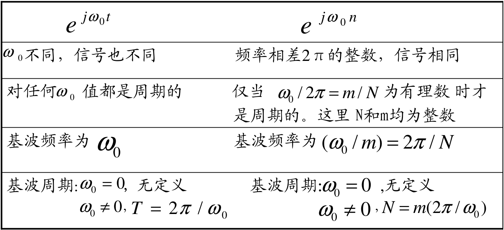

### 单位冲激与单位阶跃函数

单位冲激函数

$$
\displaystyle \delta(t)=\frac{\mathrm{d} u(t)}{\mathrm{d} t}
$$

单位阶跃函数

$$
\displaystyle u(t)=\int_{-\infty}^{t} \delta(\tau) \mathrm{d} \tau=\left\{\begin{array}{ll}
0, & t<0 \\
1, & t\geqslant0
\end{array}\right.
$$

单位脉冲

$$
\displaystyle \delta[n]=\left\{\begin{array}{ll}
0, & n \neq 0 \\
1, & n=0
\end{array}\right.
$$

单位阶跃

$$
\displaystyle u[n]=\left\{\begin{array}{ll}
0, & n<0 \\
1, & n \geqslant 0
\end{array}\right.
$$

### 连续时间和离散时间系统

连续时间系统(continuous-time system)：输入该系统的信号是连续时间信号，系统产生的输出也是连续时间信号

$$
x(t) \rightarrow y(t)
$$

离散时间系统(discrete-time system)：将离散时间输入信号变换为离散时间输出信号

$$
x[n] \rightarrow y[n]
$$

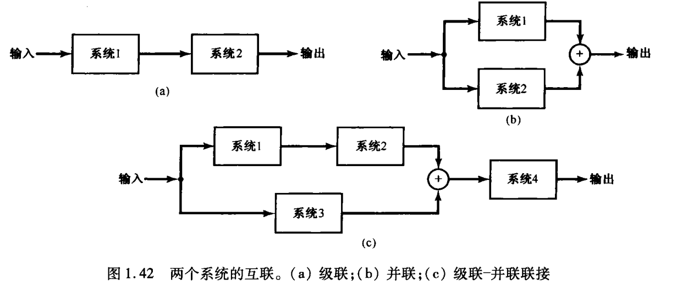

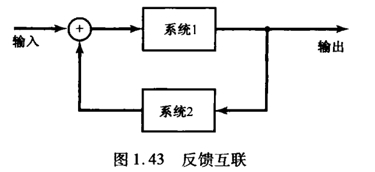

### 基本系统性质

如果对自变量的每一个值，一个系统的输出仅仅取决于该时刻的输入，这个系统就称为**无记忆系统**，否则是**记忆系统**。

个系统如果在不同的输入下，导致不同的输出，就称该系统是**可逆**的。如果一个系统是可逆的，那么就有一个**逆系统**存在。

如果一个系统在任何时刻的输出只取决于现在的输入及过去的输入（系统响应  $y(t)$  对于所有  $t$  只依赖于  $x(\tau)$  对于所有  $\tau \le t$  的值），该系统就称为**因果系统**。

如果对于任何有界输入  $|x(t)| < M < \infty$，输出也有界  $|y(t)| < N < \infty$，则系统是**稳定**的。

若系统的特性和行为不随时间而变，即对于系统的任意输入  $x(t)$  和任意时间移动  $\tau$  ，系统的输出  $y(t)$  满足  $x(t-\tau) \rightarrow y(t-\tau)$，该系统就是**时不变**的。

**线性**: 略

### 有理代数分式

$$
F(s)=\dfrac{B(s)}{A(s)}=\dfrac{b_{0} s^{m}+b_{1} s^{m-1}+\cdots+b_{m-1} s+b_{m}}{s^{n}+a_{1} s^{n-1}+\cdots+a_{n-1} s+a_{n}}
$$

式中，系数  $a_{1}, a_{2}, \cdots, a_{n}$，$b_{0}, b_{1}, \cdots, b_{m}$  都是实常数。$m$、$n$ 是正整数，通常  $m<n$。为了将  $F(s)$  写为部分分式形式，首先把  $F(s)$  的分母因式分解

$$
F(s)=\dfrac{B(s)}{A(s)}=\dfrac{b_{0} s^{m}+b_{1} s^{m-1}+\cdots+b_{m-1} s+b_{m}}{\left(s-s_{1}\right)\left(s-s_{2}\right) \cdots\left(s-s_{n}\right)}
$$

式中，$s_{1}, s_{2}, \cdots, s_{n}$  是  $A(s)=0$  的根，称为  $F(s)$  的**极点**。按照这些根的性质，分以下两种情况研究。

**无重根**

$A(s)=0$  无重根

这时，  $F(s)$  可展开为  $n$  个简单的部分分式之和，每个部分分式都以  $A(s)$  的一个因式作为其分母

$$
\displaystyle F(s)=\dfrac{c_{1}}{s-s_{1}}+\dfrac{c_{2}}{s-s_{2}}+\cdots+\dfrac{c_{i}}{s-s_{i}}+\cdots+\dfrac{c_{n}}{s-s_{n}}=\sum_{i=1}^{n} \dfrac{c_{i}}{s-s_{i}}
$$

式中， $c_{i}$  为待定常数，称为  $F(s)$  在极点  $s_{i}$  处的**留数**，可按下式计算:

$$
c_{i}=\lim _{s \rightarrow s_{i}}\left[\left(s-s_{i}\right) F(s)\right]
$$

或

$$
c_{i}=\left.\dfrac{B(s)}{\dot{A}(s)}\right|_{s=s_{i}}
$$

式中， $\dot{A}(s)$  为  $A(s)$  对  $s$  求一阶导数。

**有重根**

$A(s)=0$  有重根

设  $A(s)=0$  有  $r$  个重根  $s_{1}$，则  $F(s)$  可写为

$$
\begin{aligned}
F(s) & =\dfrac{B(s)}{\left(s-s_{1}\right)^{r}\left(s-s_{r+1}\right) \cdots\left(s-s_{n}\right)} \\
& =\dfrac{c_{r}}{\left(s-s_{1}\right)^{r}}+\dfrac{c_{r-1}}{\left(s-s_{1}\right)^{r-1}}+\cdots+\dfrac{c_{1}}{s-s_{1}}+\dfrac{c_{r+1}}{s-s_{r+1}}+\cdots+\dfrac{c_{n}}{s-s_{n}}
\end{aligned}
$$

式中,  $s_{1}$  为  $F(s)$  的重极点， $s_{r+1}, \cdots, s_{n}$  为  $F(s)$  的  $n-r$  个非重极点， $c_{r}, c_{r-1}, \cdots, c_{1}, c_{r+1}, \cdots ,  c_{n}$  为待定常数。其中,  $c_{r+1}, \cdots, c_{n}$  按无重根计算，但  $c_{r}, c_{r-1}, \cdots, c_{1}$  应按下式计算:

$$
\begin{aligned}
c_{r} & =\lim _{s \rightarrow s_{1}}\left(s-s_{1}\right)^{r} F(s) \\
c_{r-1} & =\lim _{s \rightarrow s_{1}} \dfrac{\mathrm{d}}{\mathrm{d} s}\left[\left(s-s_{1}\right)^{r} F(s)\right] \\
& \vdots \\
c_{r-j} & =\dfrac{1}{j !} \lim _{s \rightarrow s_{1}} \dfrac{\mathrm{d}^{(j)}}{\mathrm{d} s^{j}}\left[\left(s-s_{1}\right)^{r} F(s)\right] \\
& \vdots \\
c_{1} & =\dfrac{1}{(r-1) !} \lim _{s \rightarrow s_{1}} \dfrac{\mathrm{d}^{(r-1)}}{\mathrm{d} s^{r-1}}\left[\left(s-s_{1}\right)^{r} F(s)\right]
\end{aligned}
$$

### 其它

$$
\displaystyle \operatorname{Sa}(x)=\frac{\sin x}{x} ,\quad \operatorname{sinc}(x)=\frac{\sin \pi x}{\pi x}
$$

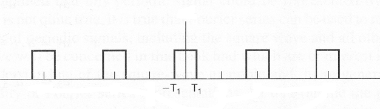

占空比  $\dfrac{2 T_{1}}{T_{0}}$

## 线性时不变系统

LTI 系统

### 离散时间线性时不变系统

用脉冲表示离散时间信号，离散时间单位脉冲序列的**筛选性质**

$$
\displaystyle x[n]=\sum_{k=-\infty}^{+\infty} x[k] \delta[n-k]
$$

令  $h_{k}[n]$  为线性系统对移位单位脉冲  $\delta[n-k]$  的响应，那么该线性系统输出

$$
\displaystyle y[n]=\sum_{k=-\infty}^{+\infty} x[k] h_{k}[n]
$$

若该线性系统时不变

$$
h_{k}[n]=h_{0}[n-k]
$$

定义**系统单位脉冲 (样本) 序列响应** [ unit impulse (sample) response] 为

$$
h[n]=h_{0}[n]
$$

$$
\displaystyle y[n]=\sum_{k=-\infty}^{+\infty} x[k] h[n-k]
$$

这个结果称为**卷积和** (convolution sum) 或叠加和 (superposition sum), 并且式右边的运算称为  $x[n]$  和  $h[n]$  的卷积, 并用符号记为

$$
y[n]=x[n] * h[n]
$$

卷积和常用公式

$$
\displaystyle V_{1}^{n} u[n] * V_{2}^{n} u[n]=\frac{V_{1}^{n+1}-V_{2}^{n+1}}{V_{1}-V_{2}} u[n]
$$

$$
\displaystyle V^{n} u[n] * V^{n} u[n]=(n+1) V^{n} u[n]
$$

一个线性时不变系统对任意输入的响应可以用系统对单位脉冲的响应来表示，线性时不变系统的单位脉冲响应完全刻画了系统的特征。

### 连续时间线性时不变系统

连续时间冲激函数的筛选性质

$$
\displaystyle x(t)=\int_{-\infty}^{+\infty} x(\tau) \delta(t-\tau) \mathrm{d} \tau
$$

令  $h_{\tau}(t)$  表示系统在时间  $t$  对发生于时间  $\tau$  的单位冲激  $\delta(t-\tau)$  的响应

$$
\displaystyle y(t)=\int_{-\infty}^{+\infty} x(\tau) h_{\tau}(t) \mathrm{d} \tau
$$

如果系统时不变的，$h_{\tau}(t)=h_{0}(t-\tau)$

定义**单位冲激响应** (unit impulse response )

$$
h(t)=h_{0}(t)
$$

$$
\displaystyle y(t)=\int_{-\infty}^{+\infty} x(\tau) h(t-\tau) \mathrm{d} \tau
$$

式称为**卷积积分** (convolution integral)。它表明一个连续时间线性时不变系统的特性可以用它的单位冲激响应来刻画。两个信号  $x(t)$  和  $h(t)$  的卷积，以后就表示成

$$
y(t)=x(t) * h(t)
$$

常用卷积积分公式

$$
\displaystyle e^{\lambda_{1} t} u(t) * e^{\lambda_{2} t} u(t) =\frac{e^{\lambda_{1} t}-e^{\lambda_{2} t}}{\lambda_{1}-\lambda_{2}} u(t)
$$

$$
\displaystyle e^{\lambda t} u(t) * e^{\lambda t} u(t) =t e^{\lambda t} u(t)
$$

### 系统性质

所有涉及到的卷积运算必须收敛

**交换律性质**

$$
x(t) * h(t)=h(t) * x(t)
$$

$$
x[n] * h[n]=h[n] * x[n]
$$

**分配律性质**

$$
x(t) *\left[h_{1}(t)+h_{2}(t)\right]=x(t) * h_{1}(t)+x(t) * h_{2}(t)
$$

$$
x[n] *\left(h_{1}[n]+h_{2}[n]\right)=x[n] * h_{1}[n]+x[n] * h_{2}[n]
$$

**结合律性质**

$$
x(t) *\left[h_{1}(t) * h_{2}(t)\right]=\left[x(t) * h_{1}(t)\right] * h_{2}(t)
$$

$$
x[n] *\left(h_{1}[n] * h_{2}[n]\right)=\left(x[n] * h_{1}[n]\right) * h_{2}[n]
$$

**微分差分特性**

$$
x^{\prime}(t) * h(t)=x(t) * h^{\prime}(t)=y^{\prime}(t)
$$

$$
(x[n]-x[n-1]) * h[n]=x[n] * (h[n]-h[n-1])=y[n]-y[n-1]
$$

**积分求和特性**

$$
\displaystyle \left[\int_{-\infty}^{t} x(T) \mathrm{d} T\right] * h(t)=x(t) *\left[\int_{-\infty}^{t} h(T) \mathrm{d} T\right]=\left[\int_{-\infty}^{t} y(T) \mathrm{d} T\right]
$$

$$
\displaystyle \left[\sum_{k=-\infty}^{n} x[k]\right] * h[n]=x[n] *\left[\sum_{k=-\infty}^{n} h[k]\right]=\sum_{k=-\infty}^{n} y[k]
$$

**时移特性**

$$
x\left(t-t_{0}\right) * h(t)=x(t) * h\left(t-t_{0}\right)=y\left(t-t_{0}\right)
$$

$$
x\left[n-n_{0}\right] * h[n]=x[n] * h\left[n-n_{0}\right]=y\left[n-n_{0}\right]
$$

**记忆性**

无记忆 $\Leftrightarrow$ $h[n]=K \delta[n] ,\quad h(t)=K \delta(t)$

**可逆性**

给定一个系统，其冲激响应为  $h(t)$ ，逆系统的冲激响应是  $h_{1}(t)$

$$
h(t) * h_{1}(t)=\delta(t)
$$

$$
h[n] * h_{1}[n]=\delta[n]
$$

**因果性**

一个线性系统的因果性就等效于**初始松弛**(initialrest)的条件：如果一个因果系统的输入在某个时刻点以前是零，那么其输出在那个时刻以前也必须是零。

**稳定性**

线性时不变系统的稳定性，等价于单位脉冲响应是绝对可和 (absolutely summable) 的

$$
\displaystyle \sum_{k=-\infty}^{+\infty}|h[k]|<\infty
$$

单位冲激响应是绝对可积 (absolutely integrable) 的

$$
\displaystyle \int_{-\infty}^{+\infty}|h(\tau)| \mathrm{d} \tau<\infty
$$

**单位阶跃响应**

单位阶跃响应 (unit step response)  $s[n]$  或  $s(t)$  也常用来描述一个线性时不变系统的特性， $s[n]$  或  $s(t)$  是当  $x[n]=u[n]$  或  $x(t)=u(t)$  时的系统输出响应。

$$
\displaystyle s[n]=\sum_{k=-\infty}^{n} h[k]
$$

$$
h[n]=s[n]-s[n-1]
$$

$$
\displaystyle s(t)=\int_{-\infty}^{t} h(\tau) \mathrm{d} \tau
$$

$$
\displaystyle h(t)=\frac{\mathrm{d} s(t)}{\mathrm{d} t}=s^{\prime}(t)
$$

### 用微分和差分方程描述的因果线性时不变系统

**线性常系数微分方程**

$N$  阶线性常系数微分方程

$$
\displaystyle \sum_{k=0}^{N} a_{k} \frac{\mathrm{d}^{k} y(t)}{\mathrm{d} t^{k}}=\sum_{k=0}^{M} b_{k} \frac{\mathrm{d}^{k} x(t)}{\mathrm{d} t^{k}}
$$

$y(t)$  的解由两部分组成: **特解**加上如下齐次微分方程的解

$$
\displaystyle \sum_{k=0}^{N} a_{k} \frac{\mathrm{d}^{k} y(t)}{\mathrm{d} t^{k}}=0
$$

齐次微分方程的解称为该系统的**自然响应** (natural response)。

大多数情况在处理由微分方程描述的系统时都用**初始松驰条件**：若  $t \leqslant t_{0}$  时  $x(t)=0$ ，则假设  $t \leqslant t_{0}$  时  $y(t)=0$  。因此，对  $t>t_{0}$  的响应可以用初始条件

$$
\displaystyle y\left(t_{0}\right)=\frac{\mathrm{d} y\left(t_{0}\right)}{\mathrm{d} t}=\ldots=\frac{\mathrm{d}^{N-1} y\left(t_{0}\right)}{\mathrm{d} t^{N-1}}=0
$$

- **零状态响应**：因果线性时不变系统在初始松弛条件下的响应，考虑输入
- **零输入响应**：输入为零时系统对初始条件的响应
- **全响应**：零状态响应和零输入响应之和

**线性常系数差分方程**

$N$  阶线性常系数差分方程

$$
\displaystyle \sum_{k=0}^{N} a_{k} y[n-k]=\sum_{k=0}^{M} b_{k} x[n-k]
$$

$y[n]$  的 解可以写成一个特解和一个齐次方程

$$
\displaystyle \sum_{k=0}^{N} a_{k} y[n-k]=0
$$

解的和。对该齐次方程的解往往称为系统的自然响应。

附加条件在大多数情况下都用初始松驰条件给出，即若  $n<n_{0}$  时  $x[n]=0$ ，那么  $n<n_{0}$  时  $y[n]=0$  。

**递归方程**(recursive equation)形式：表明利用输入和以前的输出来求输出的过程是一个递归过程

$$
\displaystyle y[n]=\frac{1}{a_{0}}\left\{\sum_{k=0}^{M} b_{k} x[n-k]-\sum_{k=1}^{N} a_{k} y[n-k]\right\}
$$

- **有限脉冲响应**：单位脉冲响应是有限长
- 无限脉冲响应：单位脉冲响应是无限长

**用微分和差分方程描述的一阶系统的方框图表示**

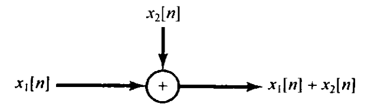
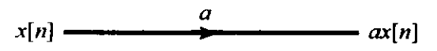
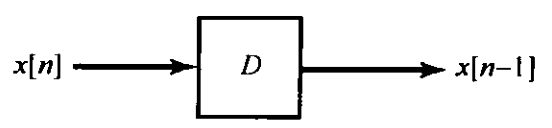
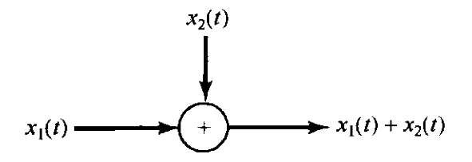
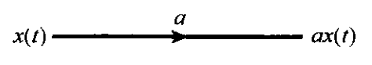
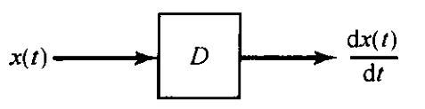
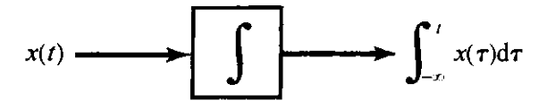

## 周期信号的傅里叶级数表示

- CFS ( The Continuous-Time Fourier Series ): 连续时间傅立叶级数
- DFS ( The Discrete-Time Fourier Series ): 离散时间傅立叶级数
- CTFT ( The Continuous-Time Fourier Transform ): 连续时间傅立叶变换
- DTFT ( The Discrete-Time Fourier Transform ): 离散时间傅立叶变换

### 线性时不变系统对复指数信号的响应

一个线性时不变系统对复指数信号的响应也是同样一个复指数信号

连续时间

$$
\mathrm{e}^{s t} \longrightarrow H(s) \mathrm{e}^{s t}
$$

$$
\displaystyle H(s)=\int_{-\infty}^{+\infty} h(\tau) \mathrm{e}^{-s \tau} \mathrm{d} \tau
$$

离散时间

$$
z^{n} \longrightarrow H(z) z^{n}
$$

$$
\displaystyle H(z)=\sum_{k=-\infty}^{+\infty} h[k] z^{-k}
$$

其中  $H(s)$  或  $H(z)$  是一个复振幅因子，一般来说是复变量  $s$  或  $z$  的函数。一个信号，若系统对该信号的输出响应仅是一个常数(可能是复数)乘以输入，则称该信号为系统的**特征函数**(eigenfunction)，而幅度因子称为系统的**特征值**(eigenvalue)

称  $H(s)$、$H(z)$  为系统的**系统函数**。$H(\mathrm{j} \omega)$  为连续时间 LTI 系统的**频率响应**，$H(\mathrm{e}^{\mathrm{j} \omega})$  为离散时间 LTI 系统的频率响应。

### 连续时间周期信号的傅里叶级数

**傅里叶级数表示**

周期信号

$$
x(t)=x(t+T)
$$

**基波周期**就是满足上式的最小非零正值  $T$ ，而  $\omega_{0}=2 \pi / T$  称为**基波频率**

周期复指数信号

$$
x(t)=\mathrm{e}^{\mathrm{j} \omega_{0} t}
$$

与其有关的**成谐波关系** (harmonically related) 的复指数信号集就是

$$
\phi_{k}(t)=\mathrm{e}^{\mathrm{j} k \omega_{0} t}=\mathrm{e}^{\mathrm{j} k(2 \pi / T) t}, \quad k=0, \pm 1, \pm 2, \cdots
$$

一个由成谐波关系的复指数线性组合形成的信号

$$
\displaystyle x(t)=\sum_{k=-\infty}^{+\infty} a_{k} \mathrm{e}^{\mathrm{j} k \omega_{0} t}=\sum_{k=-\infty}^{+\infty} a_{k} \mathrm{e}^{\mathrm{j} k(2 \pi / T) t}
$$

该级数就是指数型傅里叶级数， $a_{k}$  为指数型傅立叶级数的系数或称为  $k$  次谐波分量。

$$
\displaystyle a_{k}=\frac{1}{T} \int_{T} x(t) \mathrm{e}^{-\mathrm{j} k \omega_{0} t} \mathrm{~d} t
$$

$a_{0}$  是信号在一个周期的平均值，通常称直流分量

频谱图 = 振幅谱 + 相位谱

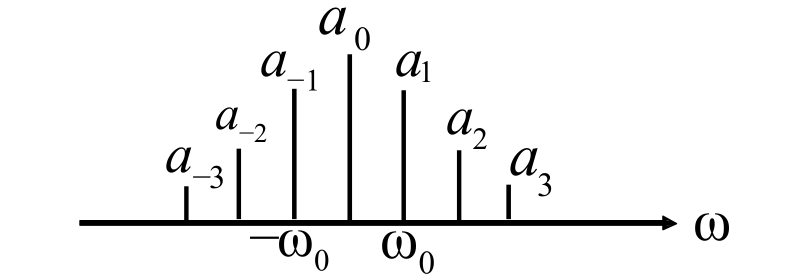

**傅里叶级数的收敛**

绝对可积

$$
\displaystyle \int_{T}|x(t)| \mathrm{d} t<\infty
$$

**连续时间傅里叶级数性质**

$$
\displaystyle x(t)=\sum_{k=-\infty}^{+\infty} a_{k} \mathrm{e}^{\mathrm{j} k \omega_{0} t} ,\quad a_{k}=\frac{1}{T} \int_{T} x(t) \mathrm{e}^{-\mathrm{j} k \omega_{0} t} \mathrm{~d} t
$$

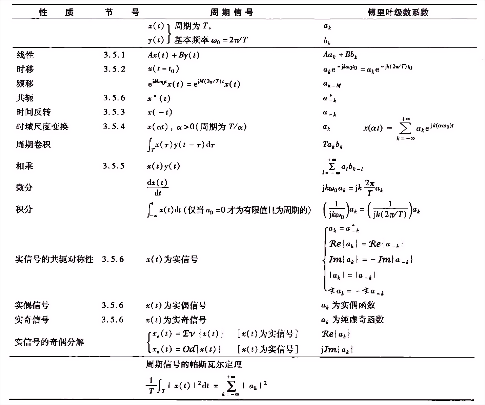

### 离散时间周期信号的傅里叶级数

考察成谐波关系的复指数信号集

$$
\phi_{k}[n]=\mathrm{e}^{j k \omega_{0} n}=\mathrm{e}^{\mathrm{j} k(2 \pi / N) n}, \quad k=0, \pm 1, \pm 2, \cdots
$$

该信号集中每一个信号都以  $N$  为周期，且该集合中只有  $N$  个信号是彼此独立的。

$$
\phi_{k}[n]=\phi_{k+r N}[n]
$$

**傅里叶级数表示**

$$
\displaystyle x[n]=\sum_{k=\langle N\rangle} a_{k} \mathrm{e}^{\mathrm{j} k \omega_{0} n}=\sum_{k=\langle N\rangle} a_{k} \mathrm{e}^{\mathrm{j} k(2 \pi / N) n}
$$

$$
\displaystyle a_{k}=\frac{1}{N} \sum_{n=\langle N\rangle} x[n] \mathrm{e}^{-\mathrm{j} k \omega_{0} n}
$$

$$
a_{k}=a_{k+N}
$$

不存在收敛问题

**离散时间傅里叶级数性质**

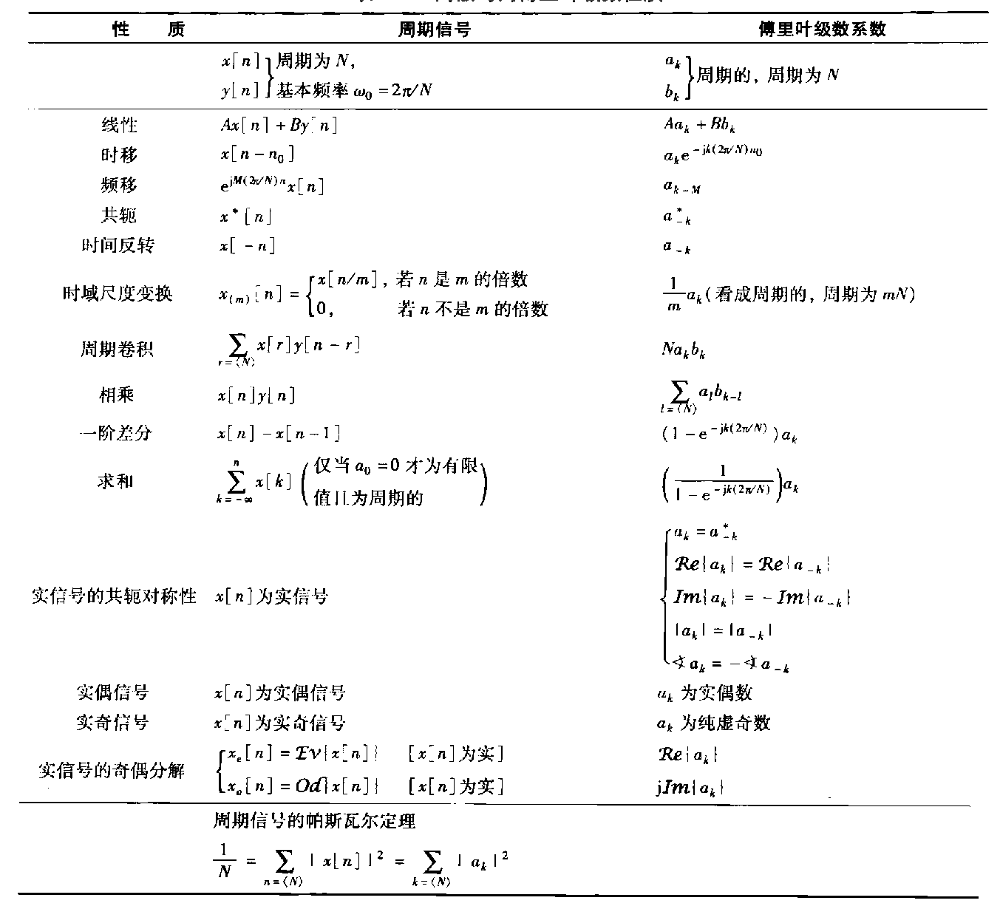

### 滤波

改变一个信号中各频率分量的相对大小，或者全部消除某些频率分量，这样一种过程称为滤波(filter)。

用于改变频谱形状的线性时不变系统往往称为频率成形滤波器。专门设计成基本上无失真地通过某些频率，而显著地衰减掉或消除掉另一些频率的系统称为频率选择性滤波器。

## 连续时间傅里叶变换

### 公式

若  $x(t)$  能量有限，有

$$
\displaystyle x(t)=\frac{1}{2 \pi} \int_{-\infty}^{+\infty} X(\mathrm{j} \omega) \mathrm{e}^{\mathrm{j} \omega t} \mathrm{~d} \omega
$$

$$
\displaystyle X(\mathrm{j} \omega)=\int_{-\infty}^{+\infty} x(t) \mathrm{e}^{-\mathrm{j} \omega t} \mathrm{~d} t
$$

$X(\mathrm{j} \omega)$  通常称为  $x(t)$  的**频谱**

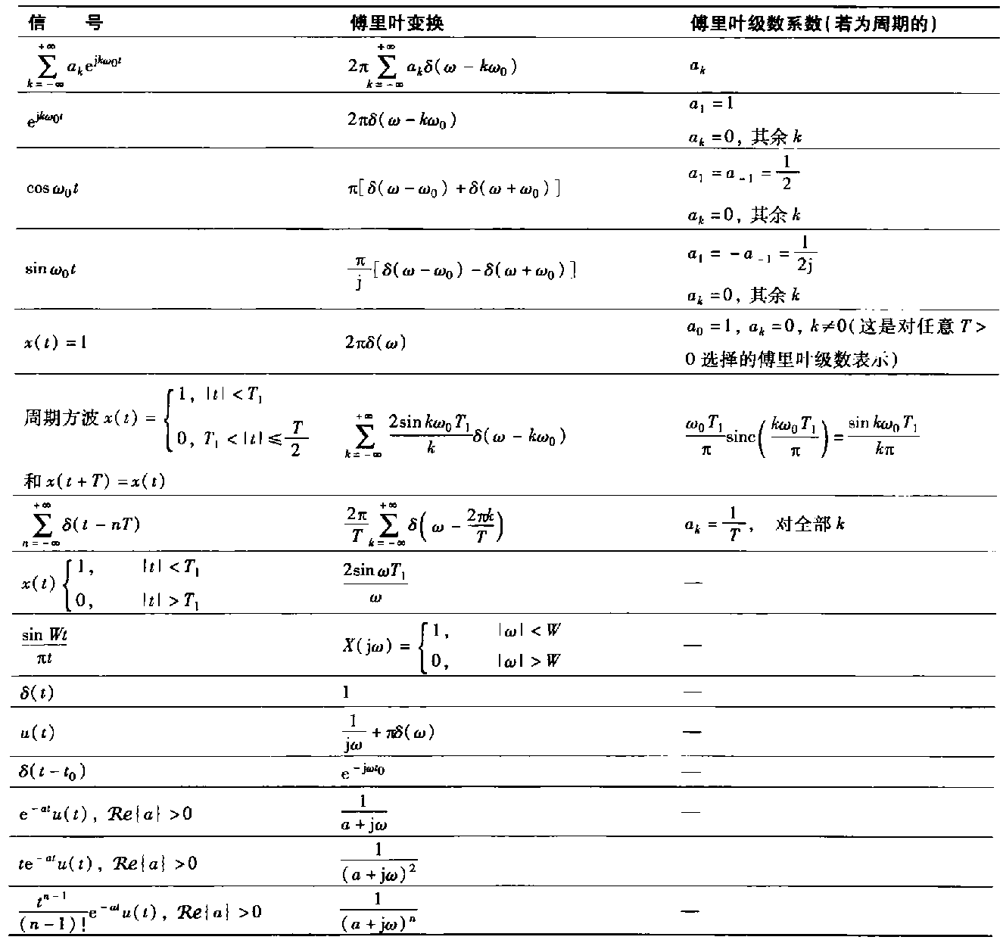

### 性质

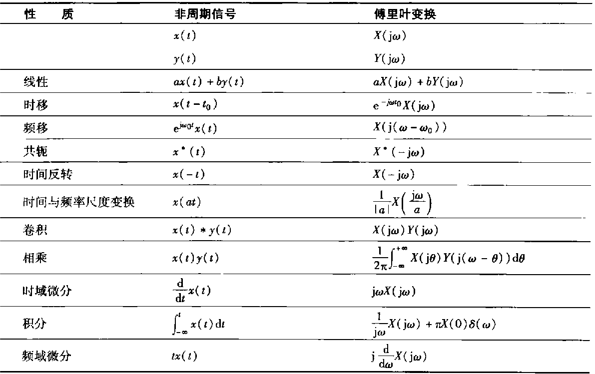
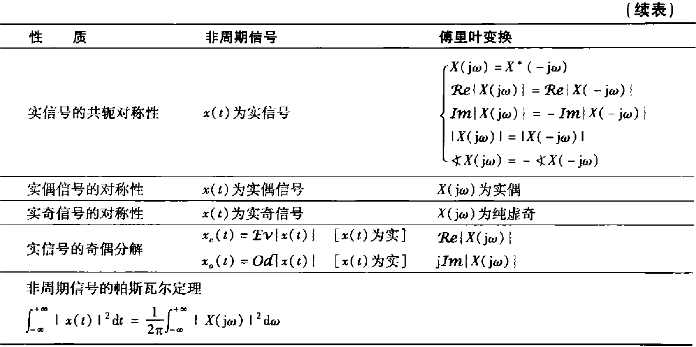

## 离散时间傅里叶变换

### 公式

$$
\displaystyle x[n] =\frac{1}{2 \pi} \int_{2 \pi} X\left(\mathrm{e}^{\mathrm{j} \omega}\right) \mathrm{e}^{\mathrm{j} \omega n} \mathrm{~d} \omega
$$

$$
\displaystyle X\left(\mathrm{e}^{\mathrm{j} \omega}\right) =\sum_{n=-\infty}^{+\infty} x[n] \mathrm{e}^{-\mathrm{j} \omega n}
$$

$X\left(\mathrm{e}^{\mathrm{j} \omega}\right)$  往往称为  $x[n]$  的**频谱**。

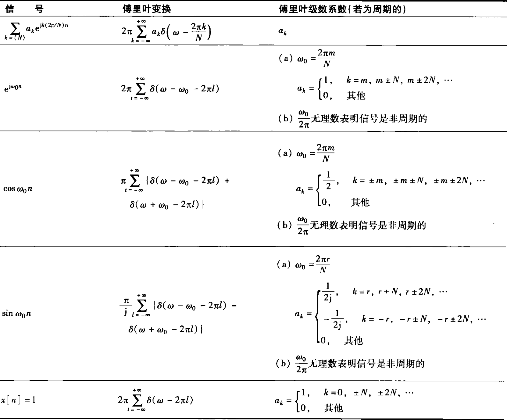
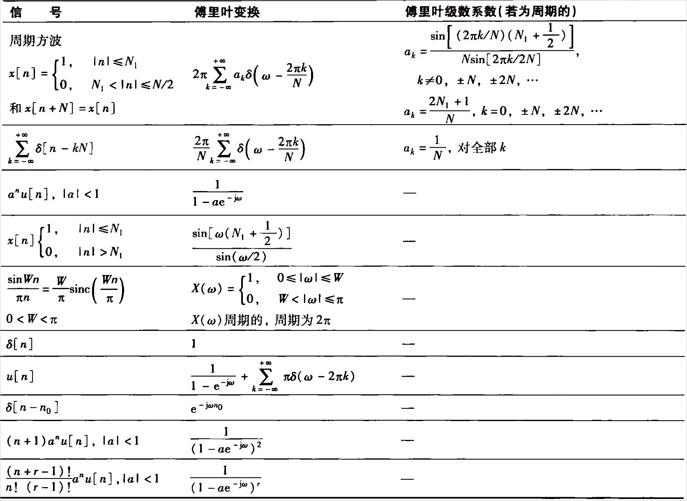

### 性质

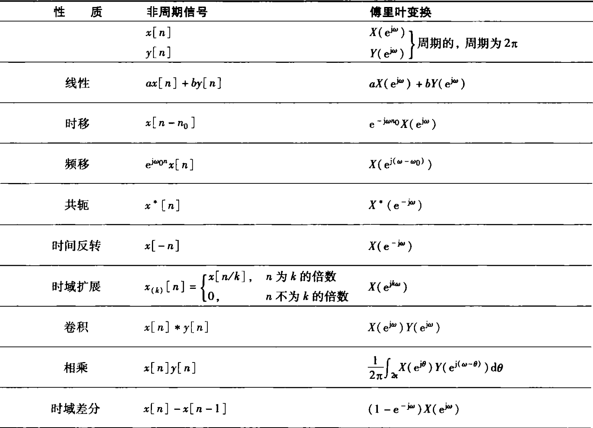
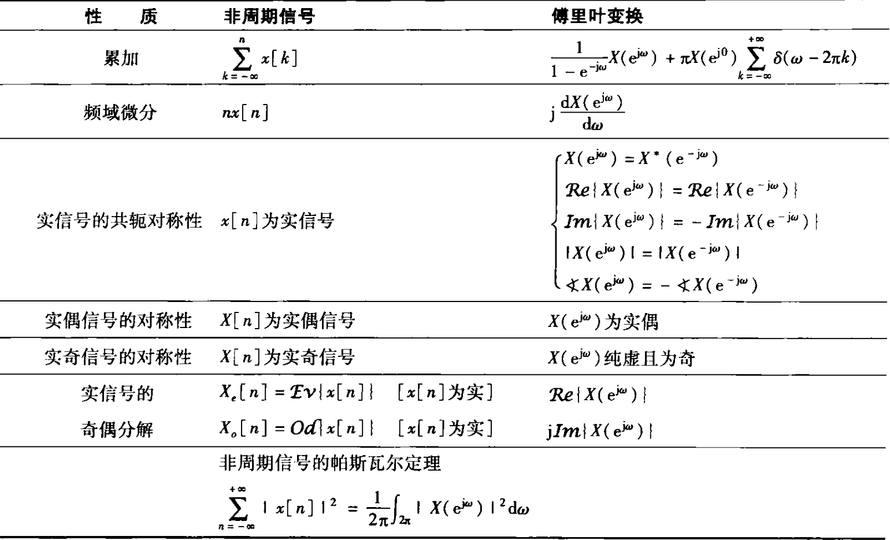

### 对偶性

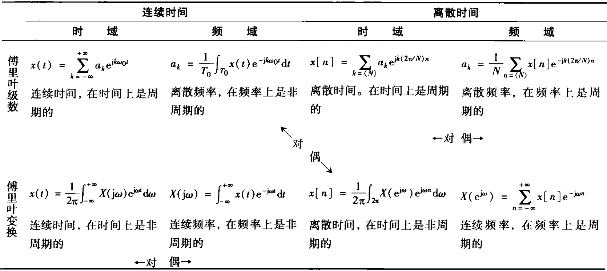

## 采样

### 采样定理

**冲激串采样**

$$
x_{p}(t)=x(t) p(t)
$$

$p(t)$  为采样函数

$$
\displaystyle p(t)=\sum_{n=-\infty}^{+\infty} \delta(t-n T)
$$

$T$  为采样周期，$\omega_{s}=2 \pi / T$  为采样频率

$$
\displaystyle X_{p}(\mathrm{j} \omega)=\frac{1}{T} \sum_{k=-\infty}^{+\infty} X\left(\mathrm{j}\left(\omega-k \omega_{s}\right)\right)
$$

设  $x(t)$  是某一个**带限信号**， 在  $|\omega|>\omega_{M}$  时，  $X(\mathrm{j} \omega)=0$  。如果  $\omega_{s}>2 \omega_{M}$ ，那么  $x(t)$  就唯一地由其样本  $x(n T), n=0, \pm 1, \pm 2, \cdots$  所确定。频率  $2 \omega_{M}$  一般称为**奈奎斯特率**。

已知这些样本值，我们能用如下办法重建  $x(t)$  ：一个周期冲激串，其冲激幅度就是这些依次而来的样本值；然后将该冲激串通过一个增益为  $T$ ，截止频率大于  $\omega_{M}$  而小于  $\omega_{s}-\omega_{M}$  的理想低通滤波器，该滤波器的输出就是  $x(t)$  。

**理想低通滤波器**

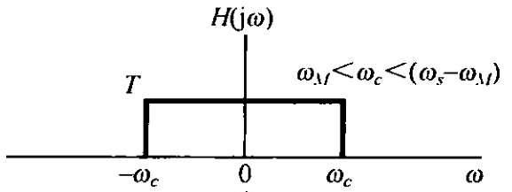

### 利用内插由样本重建信号

**带限内插**

利用理想低通滤波器的单位冲激响应的内插

**零阶保持内插**

$$
\displaystyle H_{0}(\mathrm{j} \omega)=\frac{1-\mathrm{e}^{-\mathrm{j} \omega T}}{\mathrm{j} \omega}=\mathrm{e}^{-\mathrm{j} \omega T / 2}\left[T \frac{\sin (\omega T / 2)}{\omega T / 2}\right]
$$

**线性内插（一阶保持）**

$$
\displaystyle H(\mathrm{j} \omega)=\frac{1}{T}\left[\frac{\sin (\omega T / 2)}{\omega / 2}\right]^{2}
$$

### 欠采样的效果：混叠现象

频率降低，相位倒置

采样定理明确要求采样频率大于信号中最高频率的 2 倍，而不是大于或等于最高频率的 2 倍。

### 连续时间信号的离散时间处理

连续时间到离散时间的转换(continuous-to-discrete time conversion, C/D)

$$
x_{d}[n]=x_{c}(n T)
$$

$$
X_{d}\left(\mathrm{e}^{\mathrm{j} \Omega}\right)=X_{p}(\mathrm{j} \Omega / T)
$$

离散时间到连续时间的转换(discrete-to-continuous time conversion, D/C)

$$
y_{d}[n]=y_{c}(n T)
$$

用于实现 C/D 转换的器件就称为模拟-数字(analog-to-digital, A/D)转换器，而实现 D/C 转换的就称为数字-模拟(digital-to-analog, D/A)转换器。

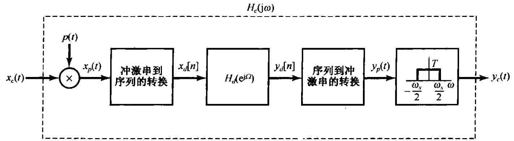

$$
H_{c}(\mathrm{j} \omega)=\left\{\begin{array}{ll}
H_{d}\left(\mathrm{e}^{\mathrm{j} \omega T}\right), & |\omega|<\omega_{s} / 2 \\
0, & |\omega|>\omega_{s} / 2
\end{array}\right.
$$

**对于一个带限输入信号（band-limited input signal）来说，若采样率足够高，从而避免了混叠发生，那么图所示系统就等效为一个连续时间线性时不变系统。**

**数字微分器**

$$
\displaystyle y_{c}(t)=\frac{\mathrm{d}}{\mathrm{d} t} x_{c}(t)
$$

$$
\displaystyle H_{c}(\mathrm{j} \omega)=\left\{\begin{array}{ll}
\mathrm{j} \omega, & |\omega|<\omega_{c} \\
0, & |\omega|>\omega_{c}
\end{array}\right.
$$

$$
\displaystyle H_{d}\left(\mathrm{e}^{\mathrm{j} \Omega}\right)=\mathrm{j}\left(\frac{\Omega}{T}\right), \quad|\Omega|<\pi
$$

**半采样间隔延时**

$$
y_{c}(t)=x_{c}(t-\Delta)
$$

$$
H_{c}(\mathrm{j} \omega)=\left\{\begin{array}{ll}
\mathrm{e}^{-\mathrm{j} \omega \Delta}, & |\omega|<\omega_{c} \\
0, & \text { else }
\end{array}\right.
$$

$$
H_{d}\left(\mathrm{e}^{\mathrm{j} \Omega}\right)=\mathrm{e}^{-\mathrm{j} \Omega \Delta / T}, \quad|\Omega|<\pi
$$

### 离散时间信号采样

**脉冲串采样**

$$
\displaystyle x_{p}[n]=\left\{\begin{array}{ll}
x[n], & \text { 若 } n \text { 为 } N \text { 的整倍数 } \\
0, & \text { 其他 }
\end{array}\right.
$$

$$
\displaystyle x_{p}[n]=x[n] p[n]=\sum_{k=-\infty}^{+\infty} x[k N] \delta[n-k N]
$$

采样频率 $\omega_{s}=2 \pi / N$

避免混叠： $\omega_{s}>2 \omega_{M}$

$$
\displaystyle X_{p}\left(\mathrm{e}^{\mathrm{j} \omega}\right)=\frac{1}{N} \sum_{k=0}^{N-1} X\left(\mathrm{e}^{\mathrm{j}\left(\omega-k \omega_{s}\right)}\right)
$$

重建

$$
\displaystyle h[n]=\frac{N \omega_{c}}{\pi} \frac{\sin \omega_{c} n}{\omega_{c} n}
$$

$$
x_{r}[n]=x_{p}[n] * h[n]
$$

**离散时间抽取与内插**

**抽取** $x_{b}[n]$ 来传输，又叫减采样

$$
x_{b}[n]=x_{p}[n N]
$$

$$
\displaystyle X_{b}\left(\mathrm{e}^{\mathrm{j} \omega}\right)=\sum_{k=-\infty}^{+\infty} x_{p}[k N] \mathrm{e}^{-\mathrm{j} \omega k}=\sum_{n=-\infty}^{+\infty} x_{p}[n] \mathrm{e}^{-\mathrm{j} \omega n / N}=X_{p}\left(\mathrm{e}^{\mathrm{j} \omega / N}\right)
$$

**内插**，增采样

在  $x_{b}[n]$  的每一个序列值之间插人  $(N-1)$ 个幅度为零的序列值，然后就利用低通滤波从 $x_{p}[n]$  中得到这个已被内插了的序列  $x[n]$ 。

## 拉普拉斯变换

### 定义

$$
\displaystyle X(s) \triangleq \int_{-\infty}^{+\infty} x(t) \mathrm{e}^{-s t} \mathrm{~d} t
$$

$$
\displaystyle x(t)=\frac{1}{2 \pi \mathrm{j}} \int_{\sigma-\mathrm{j} \infty}^{\sigma+\mathrm{j} \infty} X(s) \mathrm{e}^{s t} \mathrm{~d} s
$$

$$
x(t) \stackrel{\mathcal{L}}{\longleftrightarrow} X(s)
$$

$$
\left.X(s)\right|_{s=\mathrm{j} \omega}=\mathcal{F}\{x(t)\}
$$

使积分式收敛的  $s$  值的范围称为拉普拉斯变换的**收敛域**(region of convergence)，特简记为ROC。

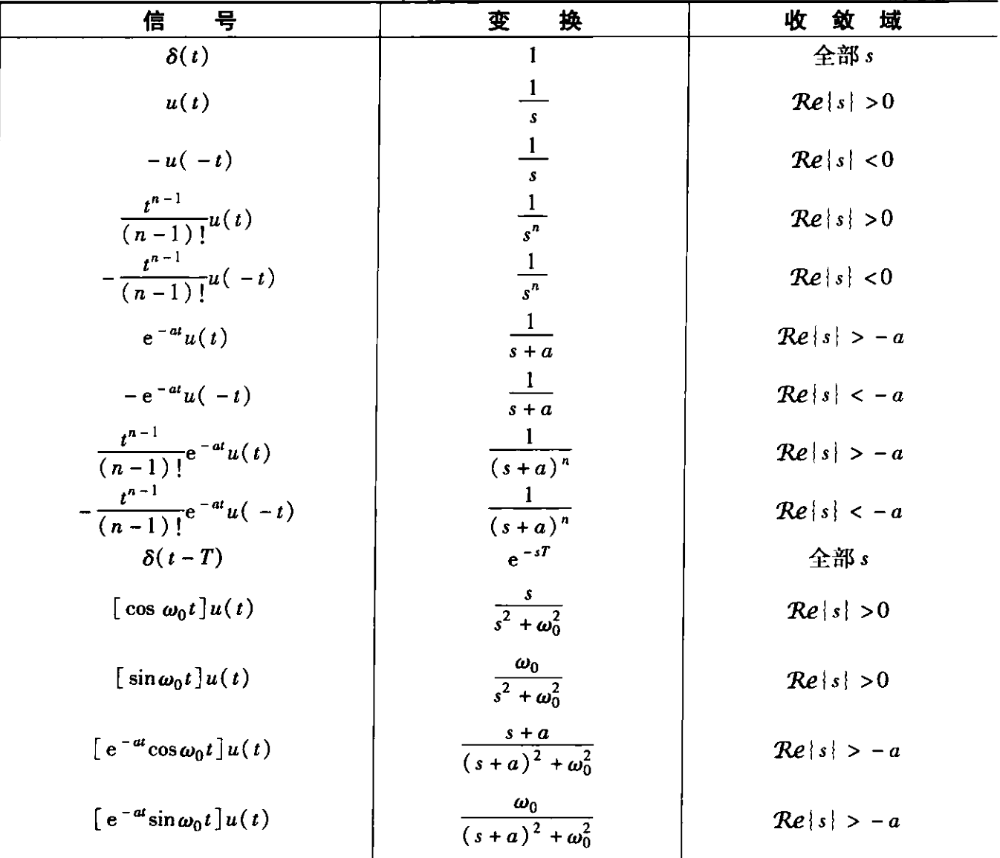

只要  $x(t)$  是实指数或复指数信号的线性组合， $X(s)$  就一定是有理的

$$
\displaystyle X(s)=\frac{N(s)}{D(s)}
$$

对于**有理拉普拉斯变换**来说，因为在分子多项式的那些根上  $X(s)=0$ ，故称其为  $X(s)$  的**零点** (zero) ；而在分母多项式的那些根上  $X(s)$  变成无界的，故称分母多项式的根为  $X(s)$  的**极点** (pole)。

除了一个常数因子外，一个有理拉普拉斯变换的完全表征是由该变换的零-极点图与它的收敛域一起组成的

### 收敛域

- 对有理拉普拉斯变换来说, 收敛域内不包括任何极点。
- 如果  $x(t)$  是有限持续信号, 并且是绝对可积的, 那么收敛域就是整个  $s$  平面。
- 如果  $x(t)$  是右边信号, 并且  $\mathcal{R} e\{s\}=\sigma_{0}$  这条线位于收敛域内, 那么  $\mathcal{R} e\{s\}>\sigma_{0}$  的全部  $s$  值都一定在收敛域内。
- 如果  $x(t)$  是左边信号, 并且  $\operatorname{Re}\{s\}=\sigma_{0}$  这条线位于收敛域内, 那么  $\mathcal{R e}\{s\}<\sigma_{0}$  的全部  $s$  值也一定在收敛域内。
- 如果  $x(t)$  是双边信号, 并且  $\operatorname{Re}\{s\}=\sigma_{0}$  这条线位于收敛域内, 那么收敛域就一定由  $s$  平面的一条带状区域组成, 直线  $\mathcal{R e}\{s\}=\sigma_{0}$  位于带中。

### 性质

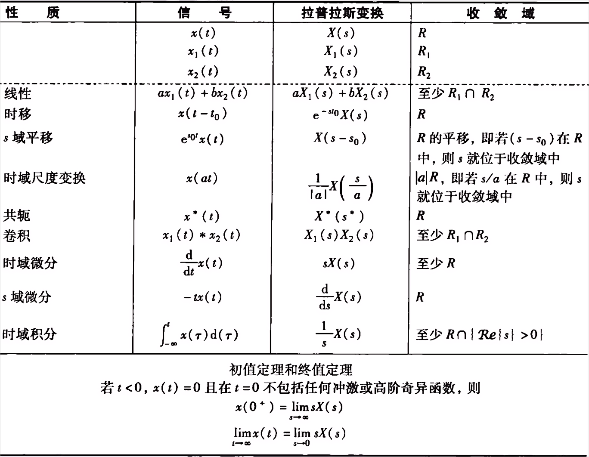

### 线性时不变系统

一个因果系统的系统函数的收敛域是某个右半平面。对于一个具有有理系统函数的系统来说，系统的因果性就等效于收敛域位于最右边极点的右边的右半平面。

当且仅当系统函数  $H(s)$  的收敛域包括  $\mathrm{j} \omega$  轴，即  $\mathcal{Re}\{s\}=0$  时，一个线性时不变系统就是稳定的。

当且仅当  $H(s)$  的全部极点都位于  $s$  平面的左半平面时，也即全部极点都有负实部时，一个具有有理系统函数  $H(s)$  的因果系统才是稳定的。

### 单边拉普拉斯变换

$$
\displaystyle X(s) \triangleq \int_{0^{-}}^{\infty} x(t) \mathrm{e}^{-s t} \mathrm{~d} t
$$

$$
x(t) \stackrel{\mathcal{UL}}{\longleftrightarrow} X(s)
$$

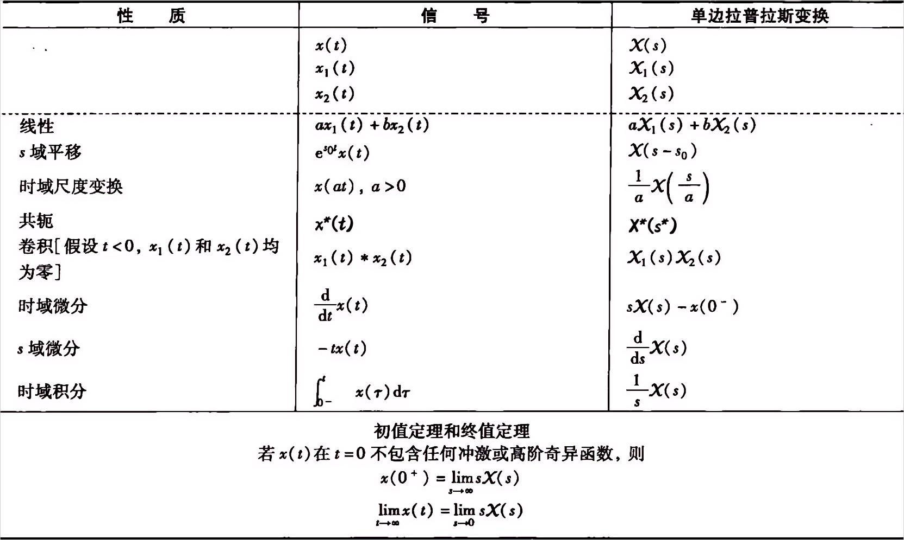

## Z变换

### 定义

$$
\displaystyle X(z) \triangleq \sum_{n=-\infty}^{+\infty} x[n] z^{-n}
$$

$$
\displaystyle x[n]=\frac{1}{2 \pi \mathrm{j}} \oint X(z) z^{n-1} \mathrm{~d} z
$$

$$
x[n] \stackrel{Z}{\longleftrightarrow} X(z)
$$

$$
\left.X(z)\right|_{z=\mathrm{e}^{\mathrm{j} \omega}}=X\left(\mathrm{e}^{\mathrm{j} \omega}\right)=\mathcal{F}\{x[n]\}
$$

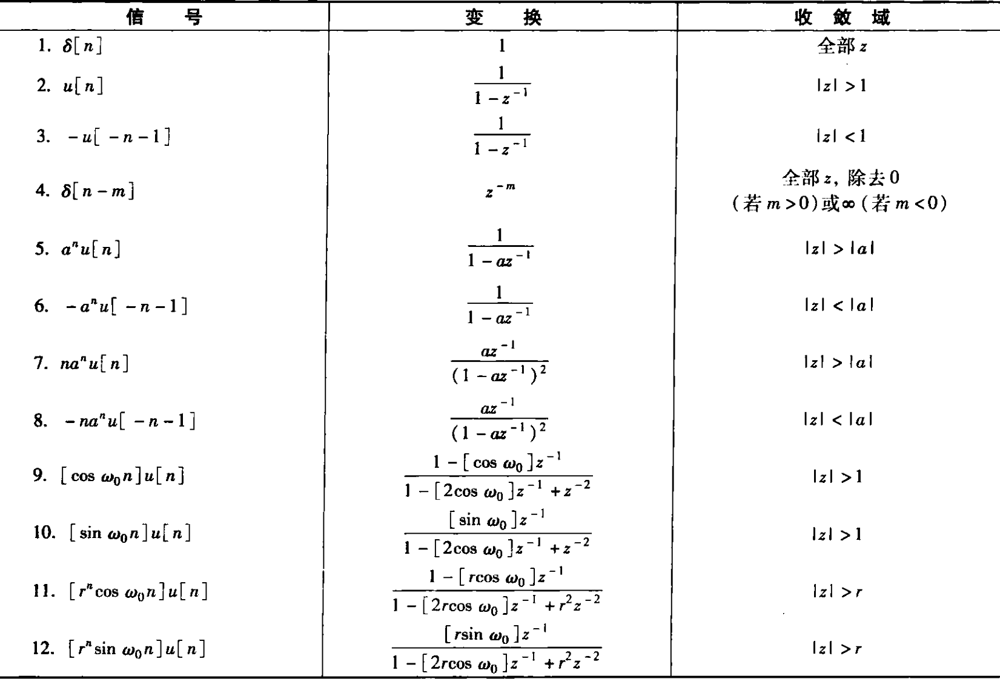

### 收敛域

收敛域是在  $z$  平面内以原点为中心的圆环，收敛域内不包含任何极点。

- 如果  $x[n]$  是有限长序列，那么收敛域就是整个  $z$  平面，可能除去  $z=0$  和/或  $z=\infty$
- 如果  $x[n]$  是一个右边序列，并且  $|z|=r_{0}$  的圆位于收敛域内，那么  $|z|>r_{0}$  的全部有限  $z$  值都一定在这个收敛域内
- 如果  $x[n]$  是一个左边序列，而且  $|z|=r_{0}$  的圆位于收敛域内，那么满足  $0<|z|<r_{0}$  的全部  $z$  值都一定在这个收敛域内
- 如果  $x[n]$  是双边序列，而且  $|z|=r_{0}$  的圆位于收敛域内，那么该收敛域在  $z$  域中一定是包含  $|z|=r_{0}$  这一圆环的环状区域
- 如果  $x[n]$  的  $z$  变换  $X(z)$  是有理的，那么它的收敛域就被极点所界定，或者延伸至无穷远

### 性质

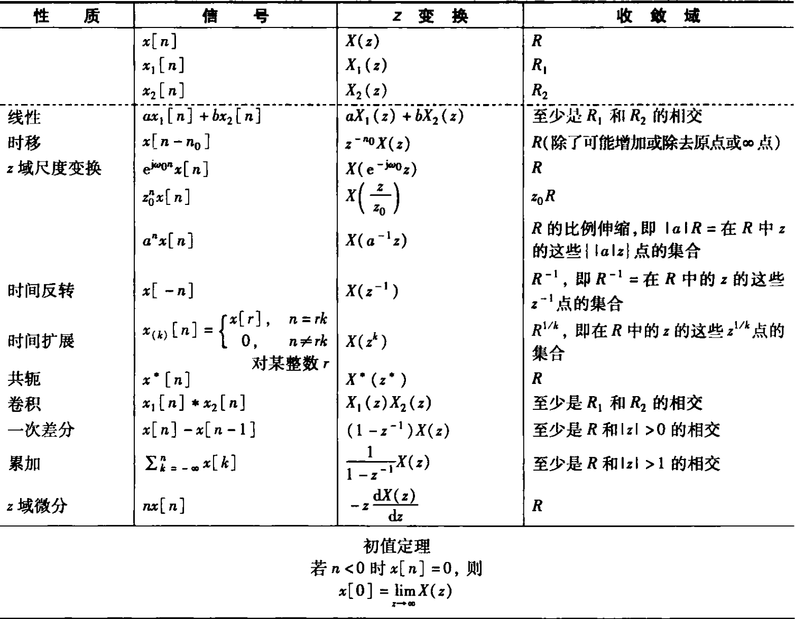

### 线性时不变系统

一个离散时间线性时不变系统，当且仅当它的系统函数的收敛域在某个圆的外边，且包括无限远点时，该系统就是因果的。

一个线性时不变系统，当且仅当它的系统函数的收敛域包括单位圆时，该系统就是稳定的。

### 单边Z变换

$$
\displaystyle X(z)=\sum_{n=0}^{\infty} x[n] z^{-n}
$$

$$
x[n] \stackrel{\mathcal{UZ}}{\longleftrightarrow} X(z)
$$

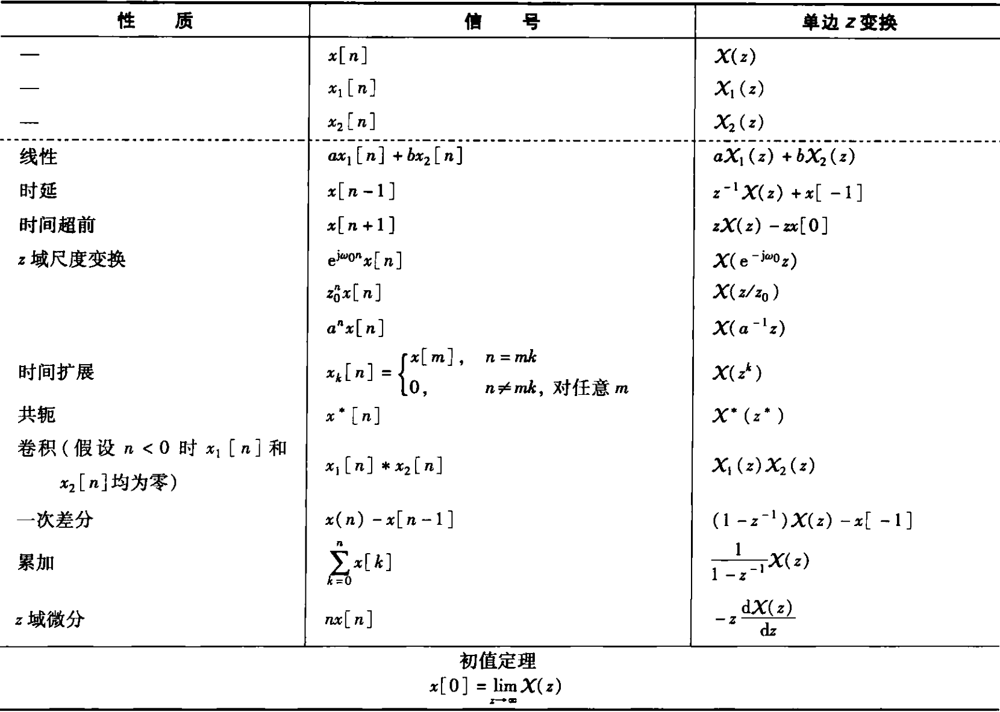
