<!-- #! https://zhuanlan.zhihu.com/p/696259136

# 塑性力学期末总结 -->

## 基本概念

### 弹性和塑性

**弹性**：若外力不大，则外力除去后变形可以全部恢复。这种性质称为材料的弹性，这种可以全部恢复的变形是弹性变形。这时称物体处于弹性状态。
**塑性**：当外力超过一定限度，则物体将产生不可恢复的变形。这种变形不可恢复的性质称为塑性，不随应力消失而恢复的那部分变形称为塑性变形。

**弹性与塑性的差别**不在于是否是线性，是大变形还是小变形，在于是否是可以恢复，是否具有一一对应关系。塑性应变和应力之间不再有一一对应的关系。塑性变形不仅与当前的应力状态有关，还和加载的历史有关。应力与应变（或应变率）之间不再保持线性关系，而呈非线性关系。

**塑性理论和弹性理论的差别**

- 不同：本构关系
- 相同：几何关系和平衡方程

### 塑性力学的基本假设

- 材料是均匀连续的；
- 在进入塑性状态前为各向同性(特别说明时除外)；
- 物体承受荷载之前处于没有初应力的自然状态。

通常不考虑时间因素对变形的影响(如弹性后效、蠕变等)，而且只限于考虑在常温下和缓慢变形的情形，所以也忽略温度和应变速度对材料性质的影响。

### 应力和应变

名义应变(Nominal Strain) 或工程应变(Engineering Strain)

$$
\varepsilon=\frac{l-l_0}{l_0} ,\qquad \mathrm{d}\varepsilon=\frac{\mathrm{d}l}{l_0}
$$

名义应力(Nominal Stress) 或工程应力(Engineering Stress)

$$
\sigma=\frac F{A_0}
$$

真实应力(True Stress)

$$
\tilde{\sigma}=\frac FA
$$

真实应变(True Strain) 或自然应变(Natural Strain) 或对数应变(Logarithmic Strain)

$$
\tilde{\varepsilon}=\ln\frac{l}{l_0} ,\qquad \mathrm{d}\tilde{\varepsilon}=\frac{\mathrm{d}l}l
$$

假设材料是不可压缩的，$Al=A_0l_0$

$$
\tilde{\sigma}=\sigma(1+\varepsilon)
$$

$$
\tilde{\varepsilon}=\ln(1+\varepsilon)
$$

## 几种简单的塑性本构关系

### 简单拉伸试验

(1) **弹性阶段**：比例极限、弹性极限。当超过弹性极限以后，如果卸除载荷，试件内仍保留塑性变形 $\varepsilon^\mathrm{p}$ 。

(2) **约束塑性变形阶段**：弹性极限之后，应力基本保持不变而应变显著增加，这种现象称为材料的屈服(yielding)，对应的应力称做屈服应力 $\sigma_\mathrm{Y}$ 。经过屈服阶段后，材料又恢复了抵抗变形的能力，这时必须增加载荷才能继续产生变形，这种现象称为材料的强化或硬化。

(3) **自由塑性变形阶段**：结构的全部或足够大的部分进入塑性状态，致使弹性部分丧失了对塑性区的约束，变形显著增加。强度极限，极限荷载。

材料在塑性阶段的一个重要特点是在加载和卸载的过程中应力和应变服从不同的规律。

Bauschinger 效应：拉伸塑性变形后使压缩屈服极限降低的现象。即正向强化时反向弱化。

一般金属材料，用简单拉伸试验代替简单压缩试验进行塑性分析是偏于安全的。

伸长率

$$
\delta_k=\frac{\Delta l_k}{l_0}\times100\%
$$

截面收缩率

$$
\varphi_k=\frac{F_0-F_k}{F_0}\times100\%
$$

$\delta_k\geq5\%$：塑性材料，低碳钢 $\delta_k=20\% \sim 30\%$；
$\delta_k<5\%$：脆性材料。

**塑性拉伸失稳**：当拉力超过一定值，截面的颈缩效应逐渐明显，当它足以与强化效应相互抵消时，外载即到达最大值。

$$
\frac{\mathrm{d}\widetilde{\sigma}}{\mathrm{d}\widetilde{\varepsilon}}=\widetilde{\sigma}
$$

### 静水压力(各向均匀受压)试验

静水压力增加材料的延性。

静水压力对金属的应力应变曲线影响很小，对屈服应力影响很小。

由于静水压力引起的材料体积变化是可以恢复的，也就是说静水压力只产生弹性变形而不会发生塑性变形。

对于一些非金属材料，如土、岩石等静水压力对塑性变形有很大影响，必须考虑。

### 应力应变简化模型

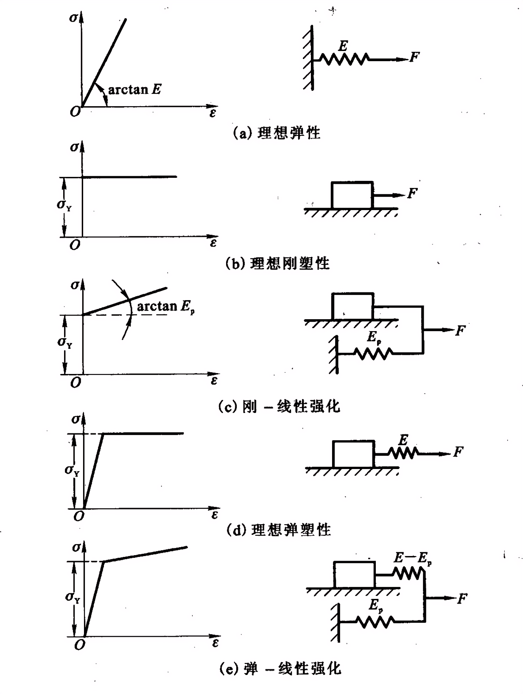

线性强化情形下的三种强化模型及几何表示

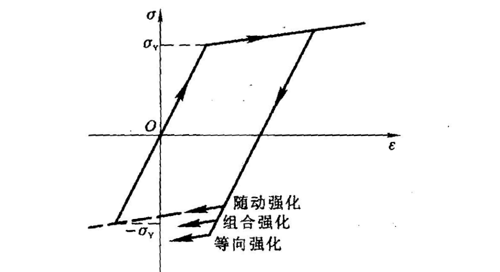

## 应力和应变分析

### 应力分析

在 $x_{j}$ 坐标系中，应力张量 $\sigma_{ij}$ 。

考虑一个法线为单位向量 $N$ 的斜面，其方向余弦为$l_1,l_2,l_3$，则这个斜面上的应力向量 $S_n$ 的三个分量与应力张量 $\sigma_{ij}$ 之间的关系

$$
S_{Ni}=\sigma_{ij}l_{j}
$$

斜截面上的正应力

$$
\sigma_N=S_{Ni}l_i
$$

斜截面上的剪应力

$$
\tau_N=\sqrt{S_{N1}^2+S_{N2}^2+S_{N3}^2-\sigma_N^2}
$$

**应力张量分解**

$$
\sigma_{ij}=\sigma_{m}\delta_{ij}+s_{ij}
$$

$\sigma_{m}=\dfrac{1}{3}\sigma_{kk}$ 为平均正应力，$\delta_{ij}$ 称为单位球张量。$\sigma_{m}\delta_{ij}$ 称为**应力球张量**，它表示各向承受相同拉(压)应力而没有剪应力的状态。$s_{ij}$ 称为**应力偏张量**。

材料进入塑性状态后，单元体的体积变形是弹性的，只与应力球张量有关；而与形状改变有关的塑性变形则是由应力偏张量引起的。

通过一点总可以找到三个互相垂直的主平面，在这些面上剪应力为零。主平面上的正应力称为**主应力**，主平面的法线方向称为**主方向**或**应力主轴**。

求主应力方程

$$
(\sigma_{ij}-\lambda\delta_{ij})l_{j}=0
$$

$$
\lambda^{3}-J_{1}\lambda^{2}-J_{2}\lambda-J_{3}=0
$$

三个实根，即三个主应力 $\sigma_{i}$ ，$\sigma_1\geq\sigma_2\geq\sigma_3$ 。

**最大最小剪应力**

$$
\begin{array}{c}\tau_{\max}\\\tau_{\min}\end{array}=\pm\frac{\sigma_{1}-\sigma_{3}}2
$$

**应力张量的三个不变量**

$$
J_1=\sigma_{kk}=\sigma_{i}
$$

$$
J_2=-\frac12(\sigma_{ii}\sigma_{kk}-\sigma_{ik}\sigma_{ki})=-(\sigma_{1}\sigma_{2}+\sigma_{2}\sigma_{3}+\sigma_{3}\sigma_{1})
$$

$$
J_3=|\sigma_{ij}|=\sigma_1\sigma_2\sigma_3
$$

应力偏张量 $s_{ij}$ 显然也是一种应力状态，只是它的三个正应力之和为零。它的主轴方向与应力主轴方向一致，且**主偏应力**为

$$
s_{j}=\sigma_{j}-\sigma_{m}\quad(j=1,2,3)
$$

应力偏张量也有三个不变量

$$
J_{1}'=s_{ii}=s_{i}=\sigma_{i}-3\sigma_{\mathrm{m}}=0
$$

$$
\begin{aligned}
J_{2}'&=-\left(s_{1}s_{2}+s_{2}s_{3}+s_{3}s_{1}\right)=\frac{1}{2}(s_{1}^{2}+s_{2}^{2}+s_{3}^{2}) \\
&=\frac{1}{2}(s_{11}^{2}+s_{22}^{2}+s_{33}^{2}+2s_{12}^{2}+2s_{23}^{2}+2s_{31}^{2})=\frac{1}{2}s_{ij}s_{ij} \\
&=\frac{1}{6}[(\sigma_{1}-\sigma_{2})^{2}+(\sigma_{2}-\sigma_{3})^{2}+(\sigma_{3}-\sigma_{1})^{2}] \\
&=\frac{1}{3}[\sigma_{1}^{2}+\sigma_{2}^{2}+\sigma_{3}^{2}-\sigma_{1}\sigma_{2}-\sigma_{2}\sigma_{3}-\sigma_{3}\sigma_{1}]
\end{aligned}
$$

$$
J_{3}'=|s_{ij}|=s_{1}s_{2}s_{3}
$$

$$
\frac{\partial J_2'}{\partial \sigma_{ij}}=\frac{\partial J_2'}{\partial s_{ij}}=s_{ij}
$$

**等斜面(八面体)上的应力**

已知物体内某点的主应力和应力主轴，通过该点作某平面，使该平面的法线与三个应力主轴夹角相等，这种平面叫**等斜面**。等斜面也常被叫做**八面体面**。

$$
\sigma_8=\sigma_{\mathrm{m}}
$$

$$
\tau_8=\sqrt{\frac{2}{3}J_2'}
$$

**等效应力**

$$
\bar{\sigma}=\sqrt{3J_{2}^{\prime}}
$$

**等效剪应力**

$$
\bar{\tau}=\sqrt{J_{2}^{\prime}}
$$

**应力莫尔圆**

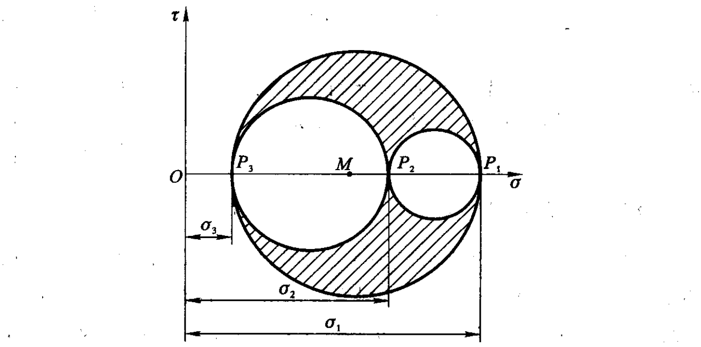

**Lode 应力参数**

$$
\mu_{\sigma}=\frac{2\sigma_{2}-\sigma_{1}-\sigma_{3}}{\sigma_{1}-\sigma_{3}}=\frac{2s_{2}-s_{1}-s_{3}}{s_{1}-s_{3}}
$$

(1) 单向拉伸，$\sigma_{2}=\sigma_{3}=0,\sigma_{1}>0$，则 $\mu_{\sigma}=-1$；
(2) 纯剪切，$\sigma_{2}=0,\sigma_{1}>0,\sigma_{3}=-\sigma_{1}<0$，则 $\mu_{\sigma}=0$；
(3) 单向压缩，$\sigma_1=\sigma_2=0,\sigma_3<0$，则 $\mu_{\sigma}=1$。

**平衡方程**

$$
\sigma_{ij,i}+F_{j}=0
$$

### 应变分析

**应变张量** $\varepsilon_{ij}$

工程剪应变 $\gamma_{ij}$

$$
\varepsilon_{ij}=\frac{1}{2}\gamma_{ij}
$$

**主应变**

$$
\varepsilon_i^3-I_1\varepsilon_i^2-I_2\varepsilon_i-I_3=0
$$

**偏量应变张量**

$$
e_{ij}=\varepsilon_{ij}-\varepsilon_m\delta_{ij}
$$

主值

$$
e_i^3-I_1^{\prime}e_i^2-I_2^{\prime}e_i-I_3^{\prime}=0
$$

**等效应变**

$$
\bar{\varepsilon}=\sqrt{\frac{4}{3} I_2'}
$$

**等效剪应变**

$$
\bar{\gamma}=2\sqrt{I_{2}^{\prime}}
$$

**Lode 应变参数**

$$
\mu_{\varepsilon}=\frac{2\varepsilon_{2}-\varepsilon_{1}-\varepsilon_{3}}{\varepsilon_{1}-\varepsilon_{3}}
$$

**变形协调方程**

$$
\varepsilon_{ij,kl}+\varepsilon_{kl,ij}-\varepsilon_{ik,jl}-\varepsilon_{jl,ik}=0
$$

## 屈服条件

### 基本概念

**基本假设**

- 忽略时间因素的影响(蠕变、应力松弛等)；
- 连续性假设；
- 静水压力部分只产生弹性的体积变化 ( 不影响塑性变形规律)；
- 在初次加载时，单向拉伸和压缩的应力- 应变特性一致；
- 材料特性符合Drucker 公设 ( 只考虑稳定材料)；
- 变形规律符合均匀应力应变的实验结果。

应力空间、应变空间：分别以应力分量和应变分量为坐标轴组成的空间，空间内的任一点代表一个应力状态或应变状态。

应力路径、应变路径：应力和应变的变化在相应空间绘出的曲线。

屈服面：应力空间内各屈服点连接成的，区分弹性和塑性状态的分界面。

单向拉压应力状态的屈服条件：$F(\sigma)=\sigma-\sigma_s=0$

**复杂应力状态的屈服函数**(描述屈服面的数学表达式)

- $F(\sigma_{ij})<0$：材料处于弹性状态
- $F(\sigma_{ij})=0$：材料开始屈服进入塑性状态

各向同性材料，屈服条件应与方向无关，故屈服条件可用三个主应力或应力不变量表示。静水压力部分对塑性变形的影响可忽略，故屈服条件也可用主偏量应力或其不变量表示。

**主应力空间**：以主应力 $\sigma_1,\sigma_2,\sigma_3$ 为坐标轴而构成的应力空间。

L 直线：在主应力空间内，过原点且和三个坐标轴夹角相等的直线。

$\pi$ 平面：主应力空间内过原点且和 L 直线垂直的平面。

屈服曲面：为一平行 L 直线的柱面。

屈服曲线：屈服曲面与 $\pi$ 平面的交线，对应无静水压力部分的情况。

### 两种常用的屈服条件

**Tresca 屈服条件**：当最大剪应力达到一定的数值时，材料就开始屈服。

$$
\tau_{\max}=k
$$

$$
F(\sigma_{ij})=\left[\left(\sigma_1-\sigma_2\right)^2-4k^2\right]\left[\left(\sigma_2-\sigma_3\right)^2-4k^2\right]\left[\left(\sigma_3-\sigma_1\right)^2-4k^2\right]
$$

简单拉伸实验，$k=\sigma_s/2$

纯剪实验，$k=\tau_s$

屈服曲线为六边形。六个顶点由实验得到，但顶点间的直线是假设的。忽略中间主应力的影响。

**Mises 屈服条件**：最大弹性形变能条件。

$$
J_2^{\prime}=\frac{1}{3}\bar{\sigma}^2=\frac16\left[(\sigma_1-\sigma_2)^2+(\sigma_2-\sigma_3)^2+(\sigma_3-\sigma_1)^2\right]=C
$$

$$
F(\sigma_{ij})=J_2^{\prime}-C
$$

简单拉伸实验，$C=\sigma_s^2/3$

纯剪实验，$C=\tau_s^2$

屈服曲线为圆，屈服曲面为圆柱。静水压力状态并不影响材料屈服，而且满足互换原则，因此与实验相符。

若规定简单拉伸时两种屈服条件重合，则Tresca六边形内接于Mises圆。若规定纯剪时两种屈服条件重合，则Tresca六边形外接于Mises圆。

### 加载条件和加载曲面

应力强化：在简单拉压时，经过塑性变形后，屈服应力提高的现象。

交叉效应：拉伸塑性变形，使压缩屈服应力降低 (Bauschinger 效应)，并且还影响剪切屈服应力等的现象。

加载条件：材料经过初次屈服后，后继的屈服条件将与初始条件不同。这种发生变化了的后继屈服条件称为加载条件。

加载曲面：应力空间内与加载条件对应的曲面。

一般加载面还依赖于塑性应变的过程，此刻的 $\varepsilon_{ij}^{\mathrm{p}}$ 状态，整个应变历史 $h_a$

$$
\phi(\sigma_{ij},\varepsilon_{ij}^{\mathrm{p}},h_a)=0
$$

**等向强化模型**：假定加载面就是屈服面做相似扩大

$$
\phi=F(\sigma_{ij})-K(h_a)=0
$$

在塑性加载的过程中 $K$ 逐渐加大，可取为等效塑性应变增量的函数

$$
K=\psi\left(\int\overline{\mathrm{d}\varepsilon^{\mathrm{p}}}\right)
$$

$$
\overline{\mathrm{d}\varepsilon^{\mathrm{p}}}=\sqrt{\frac23\mathrm{d}\varepsilon_{ij}^{\mathrm{p}}\mathrm{d}\varepsilon_{ij}^{\mathrm{p}}}
$$

也可取为塑性功的函数

$$
K=\psi\left(\int\mathrm{d}W^{\mathrm{p}}\right)
$$

$$
\mathrm{d}W^{\mathrm{p}}=\sigma_{ij}\mathrm{d}\varepsilon_{ij}^{\mathrm{p}}
$$

**随动强化模型**

$$
\phi=F(\sigma_{ij}-\hat{\sigma}_{ij})=0
$$

$\hat{\sigma}_{ij}$ (背应力)是后继屈服曲面的中心在应力空间中的位置，当然也是 $h_a$ 的函数。

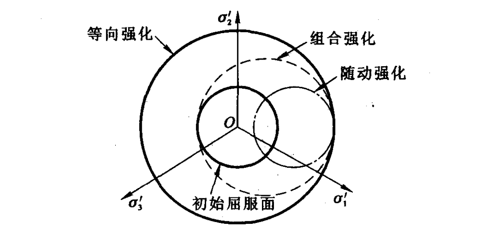

## 塑性本构关系

### 弹性本构关系

广义 Hooke 定律

形式1

$$
\varepsilon_{ij}=\frac{\sigma_{ij}}{2G}-\frac{3\nu}{E}\sigma_{_m}\delta_{ij}
$$

形式2

$$
\sigma_{m}=3K\varepsilon_{m} \quad\text{(体积变化规律)}
$$

$$
s_{ij}=2Ge_{ij}
$$

$E$ 是弹性模量，$\nu$ 是 Poisson 比，$G=E/2(1+\nu)$ 是剪切弹性模量，$K=E/[3(1-2\nu)]$ 是体积弹性模量。

**弹性应变比能**可以分解为体积应变比能和形状应变比能

$$
W^{\mathbf{e}} =\frac{1}{2}\sigma_{ij}\varepsilon_{ij}=\frac{3}{2}\sigma_{m}\varepsilon_{m}+\frac{1}{2}s_{ij}e_{ij}=W_{V}^{\mathrm{e}}+W_{\phi}^{\mathrm{e}}
$$

(1) 在弹性变形中应力主轴与应变主轴是重合的；
(2) 平均应力与平均变形(或称体积变形)成比例；
(3) 应力偏量分量与应变偏量分量成比例；
(4) 等效正应力与等效正应变成比例。

### Dnicker 公设

描述连续介质的质点或物体的力学量有两类：一类是能直接从外部观测得到的量，如应变或变形、应力或载荷、温度等，称为**外变量**；另一类力学量是不能直接测量的量，它们表征材料内部的变化，如塑性应变、在塑性变形过程中消耗的塑性功等，称为**内变量**。内变量既然不能直接观测得到，就只能根据一定的假设计算出来。

**假设**

(1) 材料的塑性行为与时间、温度无关，因此塑性功与应变率无关，在计算
中没有惯性力，也没有温度变量出现；

(2) 应变可以分解为弹性应变和塑性应变，即 $\varepsilon_{ij}=\varepsilon_{ij}^{\mathrm{e}}+\varepsilon_{ij}^{\mathrm{p}}$；

(3) 材料的弹性变形规律不因塑性变形而改变，弹塑性不耦合。

于是可以计算内变量

$$
\varepsilon_{ij}^{\mathrm{p}} = \varepsilon_{ij} - \varepsilon_{ij}^{\mathrm{e}}=\varepsilon_{ij}-\left(\frac{1}{2G}\sigma_{ij}-\frac{3\nu}{E}\sigma_{m}\delta_{ij}\right)
$$

$$
W^{\mathrm{p}}=W-W^{\mathrm{e}}=W-\frac{1}{2}\sigma_{ij}\varepsilon_{ij}^{\mathrm{e}}
$$

**Dnicker 公设**：对于处在某一状态下的材料质点（或物体），借助一个外部作用，在其原有的应为状态之上慢慢施加并卸载一组附加应力，在循环内，外部作用所作的功是非负的。

$$
\oint_{\sigma_{ij}^0}\sigma_{ij}\mathrm{d}\varepsilon_{ij}\geq0
$$

推论：

(1) 屈服曲面一定是外凸的；
(2) 塑性应变增量向量沿着加载面的外法线方向，也就是沿着加载面的梯度方向，这一点常被称为正交性法则。

$$
\mathrm{d}\varepsilon_{ij}^{\mathrm{p}}=\mathrm{d}\lambda\cdot\frac{\partial\phi}{\partial\sigma_{ij}}
$$

(3) 只有当应力增量指向屈服面外侧才可能产生塑性性变形。

### 加载、卸载准则

复杂应力状态下的硬化材料，当应力状态处在当前加载面上，再施加应力增量会出现3种可能性并由此产生3种不同的变形情形

$$
\phi(\sigma_{ij},\varepsilon_{ij}^{\mathrm{p}},h_a)=0
$$

(1) 加载 $\dfrac{\partial \phi}{\partial\sigma_{ij}}\mathrm{d}\sigma_{ij}>0$ ：应力增量指向加载面外，推动加载面变化，应力状态到达新的加载面上，会产生新的塑性变形，内变量 $h_a$ 随之增加。

(2) 中性变载 $\dfrac{\partial \phi}{\partial\sigma_{ij}}\mathrm{d}\sigma_{ij}=0$ ：应力增量沿着加载面，即与加载面相切。因应力在同一个加载面上变化，内变量 $h_a$ 将保持不变，不会产生新的塑性变形，但因为应力改变，会产生弹性应变。

(3) 卸载 $\dfrac{\partial \phi}{\partial\sigma_{ij}}\mathrm{d}\sigma_{ij}<0$ ：应力增量指向加载面内，变形从塑性状态回到弹性状态。材料响应是纯弹性的，因没有新的塑性变形产生，内变量 $h_a$ 保持不变。

对于理想弹塑性材料，加载时 $\dfrac{\partial \phi}{\partial\sigma_{ij}}\mathrm{d}\sigma_{ij}=0$ 。

### 增量理论(流动理论)

在塑性变形阶段，**增量形式的本构关系**

$$
\mathrm{d}\varepsilon_{ij} = \mathrm{d}\varepsilon_{ij}^{\mathrm{e}}+\mathrm{d}\varepsilon_{ij}^{\mathrm{p}}=\frac{1}{2G}\mathrm{d}\sigma_{ij} - \frac{3\nu}{E}\mathrm{d}\sigma_{m}\delta_{ij} + \mathrm{d}\lambda \cdot \frac{\partial\phi}{\partial\sigma_{ij}}
$$

塑性加载时，$\mathrm{d}\lambda>0$，中性变载和卸载时 $\mathrm{d}\lambda= 0$ 。

**理想塑性材料，Mises 屈服条件**

$$
\mathrm{d}\varepsilon_{ij}^{\mathrm{p}}=\mathrm{d}\lambda\cdot s_{ij}
$$

理想弹塑性材料，Prandtal-Reuss关系

$$
\mathrm{d}\lambda=\frac{\mathrm{d}W^{\mathrm{p}}}{2J_{2}^{\prime}}=\frac{s_{ij}\mathrm{d}e_{ij}}{2J_{2}^{\prime}}
$$

理想刚塑性材料，Levy-Mises 关系

$$
\mathrm{d}\varepsilon_{ij}=\mathrm{d}\lambda\cdot s_{ij}
$$

**强化材料**

$$
\mathrm{d}\lambda=h\frac{\partial\phi}{\partial\sigma_{ij}}\mathrm{d}\sigma_{ij}
$$

其中 $h>0$ 称为强化模量，一般并不要求它为常数，它依赖于加载面的变化规律。

线性增量理论，Mises 等向强化

$$
\phi=\bar{\sigma}-\psi\left(\int \overline{{{\mathrm{d}\varepsilon^{p}}}}\right)=0
$$

$$
\mathrm{d}\phi=\mathrm{d}\bar{\sigma}-\psi^{\prime}\overline{\mathrm{d}\varepsilon^{p}}=0
$$

其中，$\psi^{\prime}$ 是函数 $\psi$ 对其自变量 $\displaystyle\int\overline{\mathrm{d}\varepsilon^p}$ 的导数。

可得 $h\psi^{\prime}=1$

$$
\mathrm{d}\varepsilon_{ij}^{\mathrm{p}}=\frac{3}{2\psi^{\prime}}\cdot\frac{\mathrm{d}\bar{\sigma}}{\bar{\sigma}}s_{ij}
$$

### 全量理论(形变理论)

全量理论在本质上与非线性弹性理论相似，都是Hooke定律的一个自然推广。

<!-- 
应力主方向与应变主方向重合，在整个加载过程中主方向保持不变。平均应力与平均应变成比例。应力偏量分量与应变偏量分量成比例。等效正应力是等效正应变的函数，对每个具体材料都应通过实验来确定。

$$
\bar{\sigma}=E^{\prime}\bar{\varepsilon}
$$
 -->

体积改变服从弹性规律 $\sigma_{m}=3K\varepsilon_{m}$

应力偏量与应变偏量成正比

$$
e_{ij}=\frac{1}{2G_{s}}s_{ij}=\frac{1}{2G}s_{ij}+\Phi s_{ij}
$$

$G_{s}$ 可以认为是弹塑性变形时的折算剪切模量。

**简单加载**是指单元体的应力张量各分量之间的比值保持不变，按同一参量单调增加。不满足这一条件的情形叫做**复杂加载**。

在简单加载条件下增量理论同全量理论是等价的。

**简单加载定理**

如果满足下面一组充分条件，物体内部每个单元体都处于简单加载之中

(1) 小变形；

(2) 材料不可压缩，即 $\nu=1/2$ ；

(3) 载荷按比例单调增长；如果有位移边界条件，则只能是零位移边界条件；

(4) 材料的 $\bar{\sigma}-\bar{\varepsilon}$ 曲线具有幂函数的形式 $\bar{\sigma}=A\bar{\varepsilon}^n$ ，其中 $A$ 和 $n$ 是材料常数。

**单一曲线假定**：只要是简单加载或偏离简单加载不大，尽管在主应力空间中射线方向不同，$\bar{\sigma}-\bar{\varepsilon}$ 曲线都可近似地用单向拉伸曲线表示。

## 几种简单力学模型

### 三杆桁架

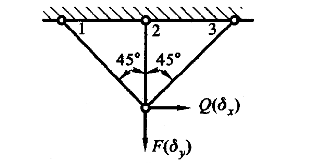

节点平衡

$$
\begin{cases}
\Delta\sigma_{2}+(\Delta\sigma_{1}+\Delta\sigma_{3})/\sqrt{2}=\Delta F/A_{0} \\
(\Delta\sigma_{1}-\Delta\sigma_{3})/\sqrt{2}=\Delta Q/A_{0}
\end{cases}
$$

变形协调关系

$$
\begin{cases}
\Delta\varepsilon_{1}=(\Delta\delta_{y}+\Delta\delta_{x})/2l_{0} \\
\Delta\varepsilon_2=\Delta\delta_y/l_0 \\
\Delta\varepsilon_3=(\Delta\delta_y-\Delta\delta_x)/2l_0
\end{cases}
$$

$$
\Delta\varepsilon_{2}=\Delta\varepsilon_{1}+\Delta\varepsilon_{3}
$$

弹性阶段

$$
\sigma=E\varepsilon
$$

### 薄壁圆管

一薄壁圆管，半径为 $R$，壁厚为 $h$，承受内压 $p$ 作用

$$
\tau_{r\theta}=\tau_{\theta z}=\tau_{rz}=0
$$

(1) 管的两端是自由的

$$
\sigma_{r\max}=p ,\quad \sigma_{r\min}=0 ,\quad \sigma_{\theta}=\frac{pR}{h} ,\quad \sigma_z=0
$$

(2) 管的两端是固定的

$$
\varepsilon_{z}=\frac{1}{E}[\sigma_z-\nu(\sigma_r+\sigma_{\theta})]=0
$$

$$
\sigma_r=0 ,\quad \sigma_{\theta}=\frac{pR}{h} ,\quad \sigma_z=\nu \frac{pR}{h}
$$

(3) 管的两端是封闭的

压强产生拉力

$$
\sigma_r=0 ,\quad \sigma_{\theta}=\frac{pR}{h} ,\quad \sigma_z=\frac{pR}{2h}
$$

## 理想刚塑性平面应变问题

平面应变问题的变形特点是沿长度（z轴）方向的应变为零，横截面（xy平面）内的应变与z无关。

$$
\sigma_{ij}=\begin{pmatrix}\sigma_{x}&\tau_{xy}&0\\\tau_{xy}&\sigma_{y}&0\\0&0&\dfrac{\sigma_{x}+\sigma_{y}}{2}\end{pmatrix}
$$

$$
\dot{\varepsilon}_{ij}=\begin{pmatrix}\dfrac{\partial v_x}{\partial x}&\dfrac{1}{2}\left(\dfrac{\partial v_x}{\partial y}+\dfrac{\partial v_y}{\partial x}\right)&0\\\dfrac{1}{2}\left(\dfrac{\partial v_x}{\partial y}+\dfrac{\partial v_y}{\partial x}\right)&\dfrac{\partial v_y}{\partial y}&0\\0&0&0\end{pmatrix}
$$

直观理解主应力方向的方法是，想象一个小元素受到周围环境的压力和拉力作用，当我们将元素旋转到某个特定角度时，元素的两个主面（通常垂直）上将只受到纯拉或压，而没有切向分力。这些面上的应力即为主应力。最大切应力将出现在这两个应力方向的中间方向，即将元素旋转45度至主应力方向之间的方向。

### 基本方程

**平衡方程**

$$
\left.\begin{aligned}
\frac{\partial\sigma_{x}}{\partial x}+\frac{\partial\tau_{xy}}{\partial y}=0& \\
\frac{\partial\tau_{xy}}{\partial x}+\frac{\partial\sigma_{y}}{\partial y}=0&
\end{aligned}\;\right\}
$$

**屈服条件**

在刚性区内：$(\sigma_x-\sigma_y)^2+4\tau_{xy}^2\leqslant4k^2$

在塑性区内：$(\sigma_x-\sigma_y)^2+4\tau_{xy}^2=4k^2$

**本构关系**

刚塑性情况的 Levy-Mises 关系

$$
\dot{\varepsilon}_{ij}=\dot{\lambda}s_{ij}
$$

$$
\frac{\dfrac{\partial v_{x}}{\partial x} - \dfrac{\partial v_{y}}{\partial y}}{\sigma_x-\sigma_y} = \frac{\dfrac{\partial v_{x}}{\partial y} + \dfrac{\partial v_{y}}{\partial x}}{2\tau_{xy}}
$$

**体积不可压缩条件**

$$
\dot{\varepsilon}_{kk}=0
$$

$$
\frac{\partial v_x}{\partial x}+\frac{\partial v_y}{\partial y}=0
$$

<!-- **交界处**

在刚塑性交界处，应力和速度应满足连续条件。

交界线两侧都是塑性区的情形 -->

### 滑移线

塑性区内，取

$$
\left.\begin{aligned}
\sigma_{x}=\sigma-k\sin2\theta& \\
\sigma_{y}=\sigma+k\sin2\theta& \\
\tau_{xy}=k\sin2\theta&
\end{aligned}\;\right\}
$$

$$
\left.\begin{aligned}
v_{x}=v_{\alpha}\cos\theta-v_{\beta}\sin\theta& \\
v_{y}=v_{\alpha}\sin\theta+v_{\beta}\cos\theta&
\end{aligned}\;\right\}
$$

有双曲线方程

$$
\left.\begin{aligned}
\frac{\partial\sigma}{\partial x}-2k(\cos2\theta\frac{\partial\theta}{\partial x}+\sin2\theta\frac{\partial\theta}{\partial y})=&0 \\
\frac{\partial\sigma}{\partial y}-2k(\sin2\theta\frac{\partial\theta}{\partial x}-\cos2\theta\frac{\partial\theta}{\partial y})=&0
\end{aligned}\;\right\}
$$

对于理想刚塑性体而言，一旦塑性区形成，就会产生无限制的塑性流动，试验表明塑性流动破坏往往是沿着最大剪应力的方向。将各点最大剪应力方向作为切线而连接起来的线，称之为**滑移线**。由于平面问题中任一点有两个相互垂直方向上的剪应力达到最大，因此，滑移线将有两簇 $\alpha$、$\beta$ ，且相互正交。最大剪应力方向与主应力夹角为±45°。规定从 $\sigma_1$ 顺时针转过45°转到的最大剪应力方向为$\alpha$方向，另一个则是$\beta$方向。确定 $\alpha$、$\beta$ 线时需记住从 $\alpha$ 方向逆时针旋转时一定是经过最大主应力 $\sigma_{1}$ 方向而到达 $\beta$ 方向的。

**滑移线（特征线）的性质**

(1) Hencky 第一定理，$\alpha_{1}$ 与 $\alpha_{2}$ 滑移线之间，沿任何 $\beta$ 线，$\theta$、$\alpha$ 的改变值保持为常数；同样，$\beta_{1}$ 与 $\beta_{2}$ 滑移线之间，沿任何 $\alpha$ 线，$\theta$、$\sigma$ 的改变值也保持为常数。
(2) 若$\alpha_{1}$、$\alpha_{2}$之间的某条 $\beta$ 线为直线，则 $a_{1}$、$\alpha_{2}$ 之间的所有 $\beta$ 线都为直线。
有一族直滑移线的场叫简单应力场，其中最常见的情形是这族直滑移线都汇交在一点，该场叫做中心场。若在一区域内，两族滑移线都是直线，则整个区域为均匀应力状态，这样的场简称均匀场。
(3) 滑移线已知，只要知道任一点的 $\sigma$ 值，滑移场其他各点的应力值均为已知。
(4) Hencky 第二定理，沿一族滑移线移动，则另一组滑移线在交点处的曲率半径的改变量在数值上等于所移动过的距离。同族的滑移线必向同一方向凹，并且曲率半径逐渐变为零。
(5) 在滑移线两侧，应力不会发生间断。沿滑移线曲率半径发生间断时，应力导数也同时发生间断。沿任何线的法向速度一定连续，而切向速度的间断线一定是滑移线，并且间断值沿滑移线不变。
(6) 滑移线具有刚性性质，沿特征线的正应变率等于零，也就是滑移线没有伸缩。

沿 $\alpha$ 线，$\mathrm{d}\sigma-2k\mathrm{d}\theta=0$ ，$\mathrm{d}v_{\alpha}-v_{\beta}\mathrm{d}\theta=0$ ，$\mathrm{d}R_{\beta}+R_{\alpha}\mathrm{d}\theta=0$ ；
沿 $\beta$ 线，$\mathrm{d}\sigma+2k\mathrm{d}\theta=0$ ，$\mathrm{d}v_{\beta}+v_{\alpha}\mathrm{d}\theta=0$ ，$\mathrm{d}R_{\alpha}-R_{\beta}\mathrm{d}\theta=0$ 。

### 塑性区的边界条件

<!-- 使用 $\mathbf{n}$ 表示边界的法线方向，$\mathbf{n}$ 与$x$ 轴的夹角为 $\psi$(从 $x$ 轴逆时针转到 $\mathbf{n}$ 为正)。对于力边界的任意一点，$\sigma_n$、$\tau_{nt}$ 和$\psi$ 是给定的。

$$
2(\theta-\psi)=\pm\arccos\left(\frac{\tau_{nt}}k\right),\quad\sigma=\sigma_n\pm k\sin\left[\arccos\left(\frac{\tau_{nt}}k\right)\right]
$$ -->

若已知塑性区应力边界 $S_T$ 上的法向正应力 $\sigma_n$ 和剪应力 $\tau_n$ ，有两个可能的Mohr圆，$\sigma$ 的取值有两种可能，需要从整体运动状态来进行判断：

(1) 如果能判断最大主应力 $\sigma_1$ ，则 $\sigma=\sigma_1-k$ ；
(2) 如果微元体受压，则应有 $\sigma+k\le 0$ 。

如果不计整体的刚体位移，可认为在刚性区内速度 $v_{\alpha}=v_{\beta}=0$ ，而在塑性区内 $v_{\alpha}$ 和 $v_{\beta}$ 不能全为零(否则也成为刚性区)，故在它们的交界线 $\Gamma$ 上必有速度间断，这只有当 $\Gamma$ 为滑移线或滑移线的包络线时才有可能。

<!-- **间断条件**

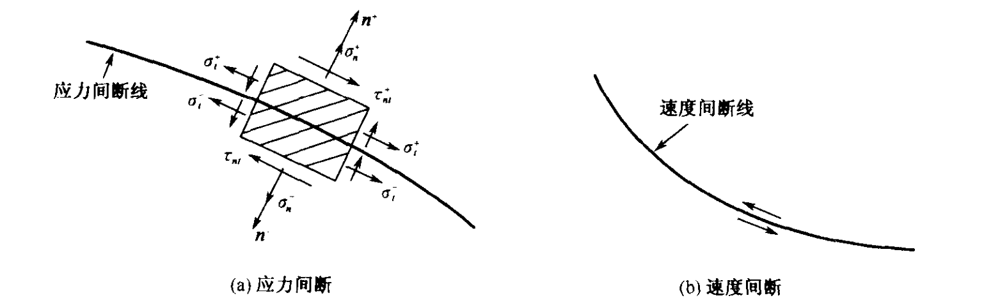 -->

塑性区内可能发生应力间断，实际上是Mohr圆的切换。

### 典型的滑移线场

**单边受压的楔**

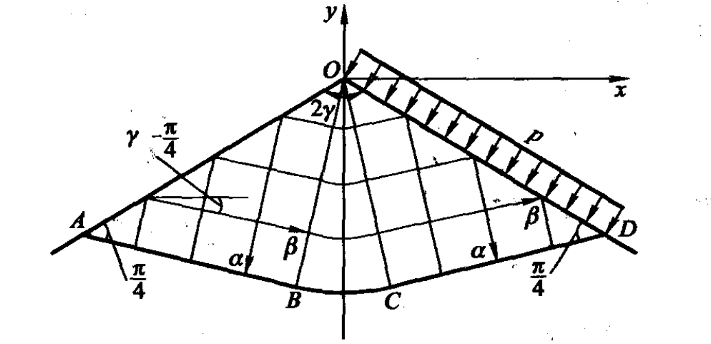

由 OA、OB 出发 45°滑移线，AOB、COD都是均匀应力区，其中 $\alpha$、$\beta$ 线都是直线。区域 BOC 是一个中心场。区域OABCD是塑性区，ABCD是一条滑移线，也是刚塑性区域分界线。

塑性极限载荷 $\displaystyle p_{\mathrm{Y}}=2k\left(2\gamma+1-\frac{\pi}{2}\right)$

<!-- 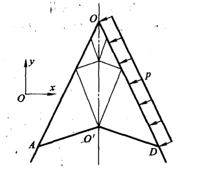 -->
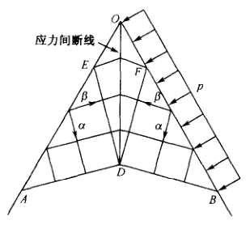

对于 $2\gamma<\dfrac\pi2$ 的锐角楔，作不出分区塑性应力场。这时由 OA 和 OD 两边作出的均匀应力场要发生重叠，其结果是在楔的角平分线上形成应力间断线。楔体的左半部分和右半部分将被分成逐步缩小的三角形无限序列。在间断线 OO' 上，法向应力 $\sigma_n$ 应连续，而切向正应力 $\sigma_t$ 发生间断。

$\alpha$ 线方向角间断值 $\left[\theta\right]=\frac{\pi}{2}-2\gamma$

$$
[\sigma]=2k\sin[\theta]=2k\mathrm{cos}2\gamma
$$

$$
p_{\mathrm{Y}}=2k(1-\cos2\gamma)
$$

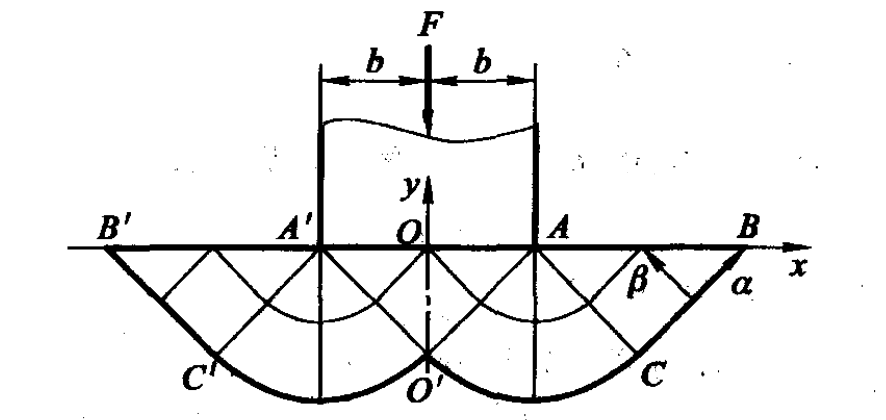

假定刚性基础底部的压力是均匀分布的，于是模底 AA' 以下是均匀应力区A'O'A，由于 AB 和 A'B' 是自由的直线边界，所以 A'B'C' 和 ABC 都是均匀应力区，而 A'C'O' 和 ACO' 是中心场。

$$
p_{\mathrm{Y}}=2k\left(1+\frac\pi2\right)
$$

## 塑性极限分析

**极限状态**是荷载增加到某一数值不再继续增加，而结构的变形仍会继续产生的状态。

**极限荷载**是极限状态相应的荷载。

极限状态下应变率的弹性部分恒为零，即塑性流动时的应变率是纯塑性应变率。极限状态有唯一性，即极限状态与加载历史无关，也与初始状态无关。

### 梁的弹塑性分析

两个基本假定：平截面假定，即梁的横截面变形之后仍然保持平面；只有截面上的正应力是主要的，其它应力分量都可忽略，问题就转化为简单应力状态。

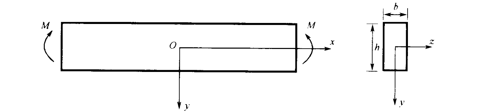
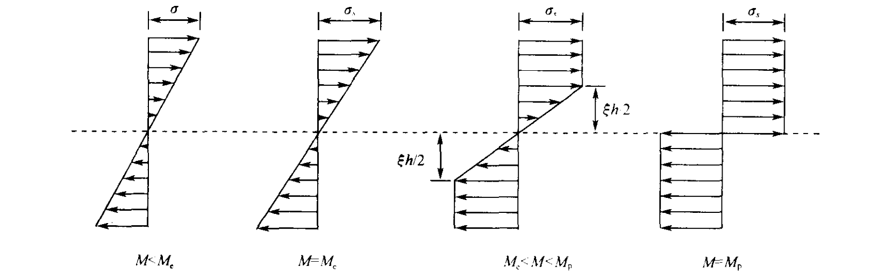

截面先处于弹性阶段

$$
M=EJK
$$

- $J=\dfrac{bh^3}{12}$ 截面惯性矩
- $K=-\dfrac{d^2 w}{dx^2}$ 曲率

$\sigma=\dfrac{My}{J}$

上下最外层的应力最先达到屈服

弹性极限弯矩 $M_e=\dfrac{\sigma_sJ}{h/2}=\sigma_s\dfrac{bh^2}6$

截面全部进入塑性状态

$$
M_s=\sigma_s\dfrac{bh^2}4
$$

截面形状系数 $\eta=\dfrac{M_s}{M_e}$

当截面全部进入塑性状态后，曲率可以任意增长。这时可将截面看作一个铰，称为**塑性铰**。

### 梁和刚架的极限分析

对于一个 $n$ 次的超静定梁，当梁内出现 $n+1$ 个塑性铰时，就可成为一个几何可变机构，对应的荷载即是极限荷载。

**机动法**

假设可能破损的机构，令外载在这个机构运动过程中所做的功与塑性铰在同一过程中所做的内力功相等，可以求得要形成这个机构所需的外载。

**静力法**

在弯矩可能是最大的一些截面处，使弯矩达到屈服条件，使结构成为一个机构，然后利用平衡方程求得整个结构的弯距分布。

### 应用机动法的例子

**例1**

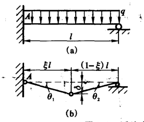

$$
q^*\cdot\frac12\delta l=M_p(2\theta_1+\theta_2)
$$

$$
q^*=\frac{2M_\mathrm{p}}{l^2}\cdot\frac{2-\xi}{\xi(1-\xi)}
$$

为了使 $q^*$ 取极小值，令 $\dfrac{\partial q^*}{\partial\xi}=0$

梁的极限载荷

$$
q_{\mathrm{Y}}=q_{\mathrm{min}}^{*}=2(3+2\sqrt{2})M_{\mathrm{p}}/l^{2}
$$

**例2**

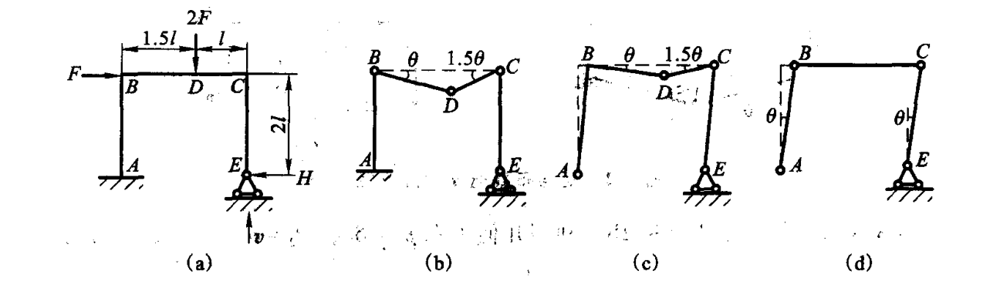

根据结构静不定次数和受载特点可知，只要形成三个塑性铰，刚架就会变成单自由度机构。而可能成铰的截面有ABCD四点。搭配起来有b、c、d三种可能的机构。

b)

$$
2F_{B}^{*}\cdot1.5\theta l=M_{p}\left(\theta+2.5\theta+1.5\theta\right)
$$

$$
F_{B}^{*}=\frac{5}{3}\cdot\frac{M_{p}}{L}
$$

c)

$$
2F_{C}^{*}\cdot1.5\theta l+F_{C}^{*}\cdot\theta\cdot2l=M_{p}\left(\theta+2.5\theta+2.5\theta\right)
$$

$$
F_{C}^{*}=\frac{6}{5}\frac{M_{p}}{L}
$$

d)

$$
F_D^*\cdot\theta\cdot2l=M_p(\theta+\theta+\theta)
$$

$$
F_D^*=\frac32\cdot\frac{M_p}l
$$

刚架的极限载荷

$$
F_{\mathrm{Y}}=F_{\mathrm{min}}=1.2M_{\mathrm{p}}^{\prime}/l
$$

