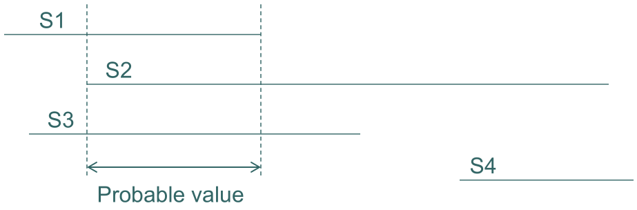
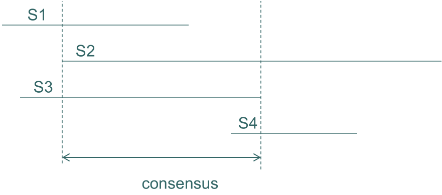
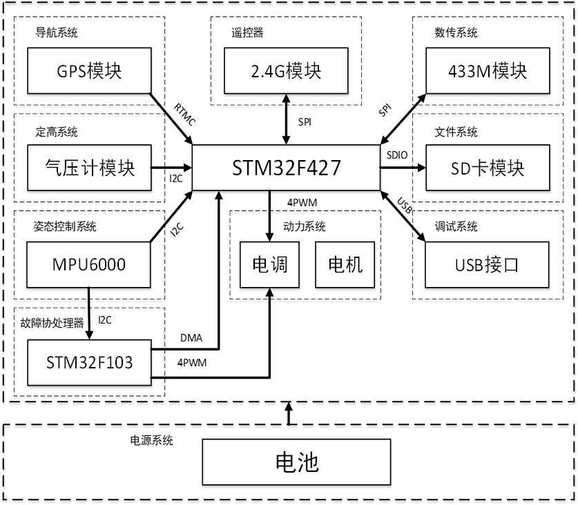
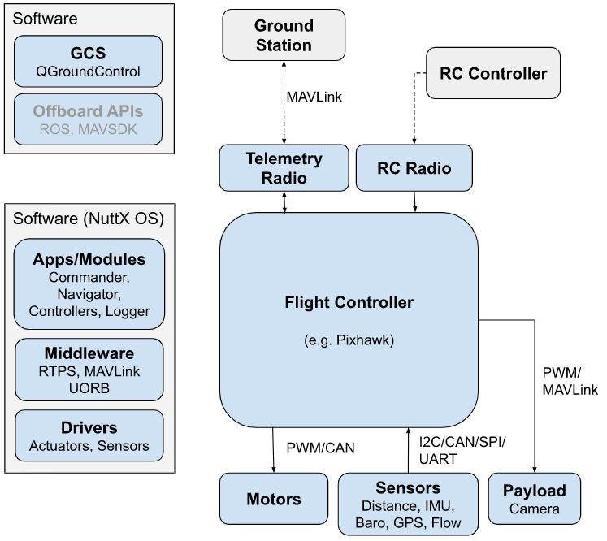
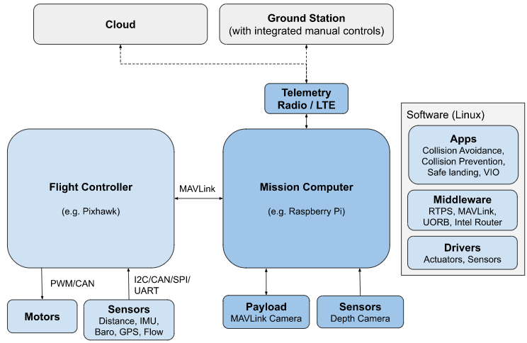
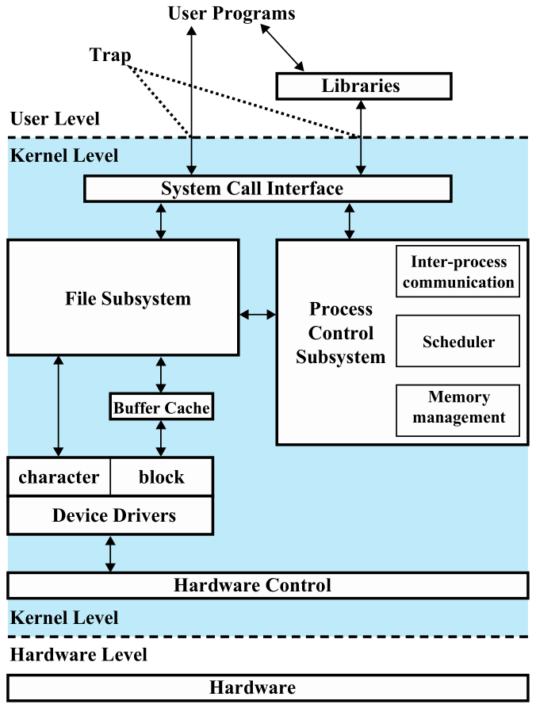
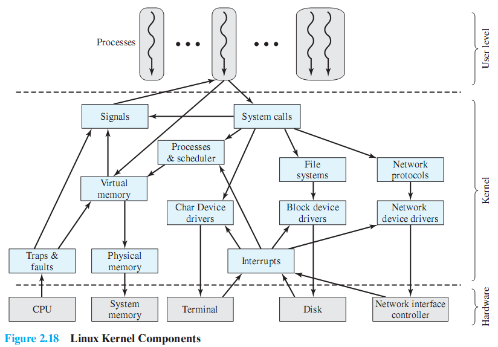

<!-- #! https://zhuanlan.zhihu.com/p/668919802

# 嵌入式计算技术复习 -->

## 嵌入式系统基本概述

### 定义

从**应用角度**来看，嵌入式系统是为了特定任务而设计的专用计算机系统，这些任务可以包括控制、监视或者辅助操作机器和设备。从**系统构成角度**来说，嵌入式系统通常是包含微处理器、存储器、输入/输出(I/O)设备、以及可能还有一个或多个专用设备的计算机系统。

嵌入式系统也被称为**cyber-physical system**，因为它们融合了物理世界和网络世界，通过嵌入式设备收集和处理数据，然后通过网络进行通信。

**特点**
**面向应用**：嵌入式系统是为特定任务设计的，因此它们非常专注于应用。**性能要求**：对执行速度、可靠性和功耗有很高的要求。**成本敏感**：由于通常是大规模生产，因此成本是一个非常关键的因素。**设计周期短**：为了适应市场变化，设计周期需要尽量缩短。

**组成**
**基本系统**：包括微处理器、存储器和基本的外围设备。**I/O模块**：用于与外部环境交互。**传感器**：用于收集环境或设备的状态信息。**执行机构**：根据嵌入式系统的指令进行实际操作。**电源**：为系统提供所需电能。**通信模块**：用于与其他设备或网络进行通信。

**技术发展趋势**
**多核**：为了提高性能和可靠性，多核处理器越来越常见。**网络化**：嵌入式设备越来越多地连接到互联网上。**智能化**：利用人工智能和机器学习技术，使嵌入式设备能够自主决策。

### 设计方法

**宿主机/目标机开发方式：交叉编译**
在**宿主机**（开发机）上进行开发，然后通过**交叉编译**生成目标机上的可执行代码。

**软硬件协同设计基本思想**
同时考虑硬件和软件的设计，确保两者能够高效地协同工作。

### 软件测试

**方法**
**白盒测试**：结构化的测试方法，需要对代码内部逻辑有清晰的了解。**黑盒测试**：基于功能的测试，只关心输入和输出，不关心内部逻辑。

**策略**
**单元测试**：针对代码的最小单元进行测试，例如函数或模块。**集成测试**：测试不同组件组合后的工作情况。**系统测试**：对整个系统进行全面的测试，确保所有组件都能够协同工作。

### 矛盾

**三个融合：**
**Cyber + Physical（网络+物理）**：这指的是网络世界与物理世界的融合。在嵌入式系统中，这意味着设备既要在物理环境中运行（例如，机器人、传感器等），又要能够与网络进行交互（例如，发送和接收数据）。**Computation + Dynamics（计算+动力学）**：这指的是计算能力和系统动力学的融合。嵌入式系统需要足够的计算能力来执行任务，同时也需能够适应和响应动态的环境变化。**Security + Safety（安全+可靠）**：这指的是信息安全和系统安全性的融合。在确保系统正常运行的同时，也需要保护系统中的数据和信息不受外部威胁。

**九大矛盾：**
**Adaptability vs. Repeatability（适应性与重复性）**：系统需要能够适应不断变化的环境，同时又要保证在相同条件下的重复性。**High connectivity vs. Security and Privacy（高连接性与安全和隐私）**：系统需要有良好的网络连接，但又不能牺牲安全和隐私。**High performance vs. Low Energy（高性能与低能耗）**：系统需要有高性能，但同时也要有低的能耗。**Asynchrony vs. Coordination/Cooperation（异步与协调/合作）**：系统中可能存在异步操作，但也需要协调和合作以确保整体运行。**Scalability vs. Reliability and Predictability（可扩展性与可靠性和可预测性）**：系统需要易于扩展，但也不能牺牲可靠性和可预测性。**Laws and Regulations vs. Technical Possibilities（法律法规与技术可能性）**：技术实现需要遵守法律法规，同时也要考虑技术可能性。**Economies of scale (cloud) vs. Locality (fog)（规模经济（云）与本地性（雾））**：云计算带来规模经济，但边缘计算（雾计算）强调了本地处理的重要性。**Open vs. Proprietary（开放与专有）**：开放系统易于集成和扩展，但专有系统可能提供更高的安全性和性能。**Algorithms vs. Dynamics（算法与动力学）**：算法是嵌入式系统的核心，但真实世界的动力学行为常常挑战算法的适应性

**创新：**
为了解决上述矛盾， Cyber-physical systems需要引入新的工程方法和模型。例如，可以研究更高效的算法来平衡性能与能耗；设计新的安全机制来保护隐私，同时维持高连接性；或者开发新的架构，以同时满足可扩展性和可靠性的需求。

## 嵌入式系统处理器

### 概述

嵌入式系统是一个专门为特定任务设计的计算机系统，而不是像通用计算机那样，可以执行多种任务。这些系统通常被嵌入到其他设备中，以提供智能化和控制功能。处理器是嵌入式系统的核心，它负责执行系统的指令。

**嵌入式处理器分类**
**MCU (微控制器单元)**: MCU内部集成了CPU、内存、I/O端口等，适用于简单的控制和监测任务。**MPU (微处理器单元)**: MPU通常是较为强大的处理器，它的内部结构和功能与通用CPU类似，但它通常是专门为某一特定任务或某一特定行业设计的。**DSP (数字信号处理器)**: DSP是专门用于处理数字信号的处理器，它内部集成了多种数字信号处理的算法和硬件加速器。**SOC (系统芯片)**: SOC是一个集成了多个组件（如CPU、内存、接口等）的芯片，它相当于一个完整的系统，只是外部接口较少。

**举例**
**Arduino的MCU**：ATMEGA328是一款8位MCU，常用于Arduino Uno等开发板。**Raspberry的MPU**：BCM2837和BCM2711是Raspberry Pi的处理器，它们都是ARM架构的MPU。**Pixhawk的MCU**：STM32F427和STM32F765是Pixhawk飞行控制器使用的MCU，具有强大的处理和控制能力。

**嵌入式处理器技术指标**
**功能**: 处理器能执行的任务和指令集。**字长**: 处理器一次操作的数据位数（如8位、16位、32位等）。**工作温度**: 处理器正常工作的温度范围。**功耗**: 处理器工作时的电能消耗。**寻址能力**: 处理器能访问的内存大小。**电磁兼容性**: 处理器在工作时不会产生过多的电磁干扰，也能抵抗一定程度的外部电磁干扰。**平均故障间隔时间MTBF**: 表示处理器的可靠性，即两次故障之间的平均时间。

**评估处理器速度的几个关键指标**
**主频(Clock Speed)**: 处理器的时钟频率，通常以MHz或GHz为单位。**CPI(Clock Cycles per Instruction)**: 执行一条指令所需的时钟周期数。**MIPS(Million Instructions Per Second)**: 每秒可以执行多少百万条指令。**FLOPS(Floating-Point Instructions per Second)**: 每秒可以执行多少浮点运算。

### 嵌入式微控制器（MCU）

也被称为单片机，这是一个完整的计算机系统，集成了处理器、内存和外设接口到一个芯片中。它的设计目的是为特定应用提供低成本、低功耗、小体积的解决方案。

**核心组成**：嵌入式微控制器以某一种**微处理器内核**为核心。这是MCU的“大脑”，负责执行指令。

**芯片内部集成**：
**ROM/EPROM**：用于存储程序或数据的非易失性存储器。**RAM**：临时存储数据的地方。**总线**：在芯片内部，用于数据传输。**总线逻辑**：管理总线上的数据流。**定时/计数器**：用于计时或计数。**WatchDog**：用于系统复位或监控系统的运行状态。**I/O**：输入/输出接口，与外部世界连接。**串行口**：用于串行通信。**脉宽调制输出**：用于产生PWM信号。**A/D、D/A**：模拟到数字、数字到模拟转换器，用于处理模拟信号。**Flash RAM、EEPROM**：非易失性存储器，用于存储数据或程序。

**特点**：
**单片化**：整个计算机系统集成在一个芯片中。**体积减小**：由于单片化，体积大大减小。**成本、功耗下降，可靠性提高**：集成了众多组件，使得成本下降，功耗降低，并且由于集成度高，可靠性也得到提高。

代表性的通用系列如Intel的8051系列、Motorola的MC68系列、MicroChip的PIC系列等。这些都是业界知名的MCU系列，广泛应用于各种嵌入式系统中。

嵌入式微控制器占嵌入式系统的约70%的市场份额，显示出其在嵌入式计算领域的重要地位。

荷兰AMT公司的ECU使用了MicroChip公司的PIC18F252-I/SO作为CPU，展示了MCU在实际应用中的使用。* 国产航天7304厂的ECU使用了Freescale公司的MC9S12DG256作为CPU，这进一步证明了MCU在嵌入式系统中的广泛应用和重要性。

### 指令架构（ISA: Instruction Set Architecture）

指令架构定义了一个处理器可以执行的一组基本指令。这些指令是处理器硬件和编译器之间的接口。

**RISC (精简指令集计算机)**:

代表: ARM、MIPS、PowerPC、ARC等。

**优点**:
简单的指令集，易于流水线化，从而提高处理器速度。更少的指令意味着CPU芯片可以更小，功耗更低。

**缺点**:
需要的内存周期可能比CISC多，因为有些任务需要更多的指令来完成。编译器可能更复杂。

**CISC (复杂指令集计算机)**:

代表: Intel的X86。

**优点**:
丰富的指令集使得某些任务可以用更少的指令完成，减少了内存访问次数。现有的x86生态系统提供了广泛的软件兼容性。

**缺点**:
复杂的指令集使得处理器难以设计和实现高速度。由于指令的复杂性，功耗可能更高。

**RISC 之ARM架构**

ARM是一家1991年成立于英国剑桥的公司，名为Advanced RISC Machine。它设计处理器核并出售芯片知识产权（IP核）给芯片厂家。值得注意的是，ARM已被Nvidia以400亿美元收购。ARM架构已经到了v9(2021)。从v8开始，它使用了64位总线。v9则加入了machine learning部件。

ARM Cortex系列基于ARMv7结构的处理器被冠以Cortex的代号。例如，基于v7A的称为Cortex-A系列（用于应用程序），基于v7R的则是Cortex-R系列（用于实时系统），基于v7M的则是Cortex-M3（用于微控制器）。

具体产品实例：华为Kirin 9000/Kunpeng 920使用v8指令集，苹果A15/A16使用v9指令集。

### 处理器的存储格式：小端模式与大端模式

处理器在存储多字节数据（int,float）时，有两种主要的存储格式：大端模式与小端模式。这两种模式决定了多字节数据的字节在内存中的排列方式。
**小端模式 (Little-Endian)**: 低有效字节在低地址，高有效字节在高地址。例如，数字0x12345678在内存中表示为78 56 34 12。**大端模式 (Big-Endian)**: 高有效字节在低地址，低有效字节在高地址。数字0x12345678在内存中表示为12 34 56 78。

例子：X86是小端模式。C51单片机是大端模式。ARM可以是小端或大端，具体取决于配置。

在通信或网络数据传输时，必须确保两端使用相同的模式，否则数据可能会被错误地解释。

**用C语言判断处理器是大端模式还是小端模式**

```c
int main(){
    union{
        int i;
        char c[sizeof(int)];
    } x;
    x.i = 1;
    if (x.c[0] == 1)
        printf("小端模式\n");
    else
        printf("大端模式\n");
    return 0;
}
```

```c
int main(){
    int x = 1;
    char *c = (char *)&x;
    if (*c)
        printf("小端模式\n");
    else
        printf("大端模式\n");
    return 0;
}
```

**32位ARM处理器的寻址空间**

ARM处理器使用一个32位的地址来访问内存，因此它的寻址空间是2^32，等于4GB。这意味着ARM处理器可以直接访问高达4GB的内存地址范围。

**Bytes 0 to 3 和 bytes 4 to 7**

在ARM处理器中，连续的四个字节（bytes 0 to 3）被用来存储第一个32位的word，而接下来的四个字节（bytes 4 to 7）被用来存储第二个32位的word。这种连续的存储方式有助于处理器高效地访问和读取数据。

**ARM的端模式设置**

ARM处理器支持大端模式和小端模式。处理器通常通过硬件设置来确定使用哪种模式，这通常在处理器加电时通过设置相应引脚的高电平或低电平来完成。另外，一些处理器也允许通过软件设置控制寄存器来确定端模式。

默认情况下，ARM处理器使用小端模式。而Intel处理器也默认使用小端模式，PowerPC处理器则默认使用大端模式。

### 处理器架构

**冯诺依曼结构 (von Neumann Architecture)**:

**程序和数据存储在相同的存储空间**：在冯诺依曼结构中，使用一个单一的内存空间来存储程序指令和数据。这意味着取指令和取数据都是从同一内存空间中完成的。代码和数据共享相同的总线，因此CPU在同一时间只能访问代码或数据。这种结构设计简单，成本效益高，因为它只需要一个内存空间。但它也可能导致性能瓶颈，因为指令和数据访问可能会相互冲突。**自修改程序难度**：在冯诺依曼结构的机器上编写自修改程序（即那些写入数据值然后将其作为指令使用的程序）相对困难。因为指令和数据存储在相同的空间中，对数据的修改可能会意外地改变指令，导致程序出错。

**哈佛结构 (Harvard Architecture)**:

**程序和数据存储在不同的存储空间**:与冯诺依曼结构不同，哈佛结构的处理器使用两个独立的内存空间：一个专门用于存储指令，另一个专门用于存储数据。代码和数据有独立的总线，所以CPU可以同时访问代码和数据。这种架构通常用于高性能嵌入式系统。这种分离允许同时取指令和取数据，从而增加存取带宽，提高并行性。**数字信号处理的性能提升**:哈佛结构中的程序和数据内存的分离为数字信号处理提供了更高的性能。这是因为独立的数据端口可以具有更大的吞吐量，并更易于进行流水线操作。流水线操作是一种处理技术，它允许在处理前一个指令的同时，取下一个指令，从而提高处理速度。这种结构对于需要大量数据吞吐和处理的数字信号处理任务非常有利。

冯诺依曼结构和哈佛结构各有优缺点。冯诺依曼结构简单且成本效益高，但可能在性能上受限；而哈佛结构提供了更高的性能和并行性，但设计复杂且成本较高。

### ARM处理器的应用选型

当涉及到ARM处理器的应用选型时，多个因素会影响最终的决定。这些因素通常包括处理器内核的选择、系统工作频率、芯片内存储器容量、片内外围电路的选择等。
**ARM处理器内核的选择**：ARM提供了多种不同的内核设计，例如Cortex-A、Cortex-M和Cortex-R系列。每个系列针对特定的应用进行了优化。选择哪一个内核取决于你的需求，比如你需要的是高性能还是低功耗。**系统的工作频率**：系统的工作频率通常指的是处理器的时钟速度，它决定了处理器执行指令的速度。一般来说，更高的时钟速度意味着更高的性能，但也意味着更高的功耗。**芯片内存储器的容量**：芯片内存储器的容量也是一个重要的考虑因素。更大的内存容量可以支持更复杂的应用，但也会增加成本和功耗。**片内外围电路的选择**：片内外围电路指的是除了处理器核心之外的其他电路，例如GPIO、UART、I2C等。选择哪些外围电路取决于你的应用需求。

实例：
树莓派4使用的是Broadcom BCM2711芯片，这是一款基于ARM v8架构的四核Cortex-A72处理器，工作频率为1.5GHz。Pixhawk使用的是STM32F427VIT6 rev.3芯片，这是一款基于ARM Cortex-M4内核的处理器，工作频率为180MHz。它配备了单精度FPU、256KB RAM、2MB Flash以及SRAM (L1)。iPhone 11使用的是A13 Bionic芯片，这是一款由Apple自家设计的处理器，其性能非常强大，每秒可以执行1万亿次操作，采用第二代7nm工艺。iPhone 12使用的是A14芯片，这款处理器采用了更先进的5nm工艺，相比前代速度提升了约20%。iPhone 15使用A17芯片，采用3nm工艺。工艺的提升通常意味着更高的性能和/或更低的功耗。


### 指令级并行

为了让嵌入式系统的性能更高，指令级并行（Instruction-level Parallelism）是一种常用的方法。
**Superscalar（超标量）**：超标量处理器可以同时执行多条指令。在处理器内部，有多个执行单元，如ALU（算术逻辑单元）、移位器、乘法器等。这些执行单元能够同时工作，从而加速指令的执行。通过这种并行处理，超标量处理器可以实现更高的指令吞吐量，进而提高处理器的整体性能。**Subword parallelism（子字并行）**：子字并行是一种特殊的并行技术，其中宽ALU（算术逻辑单元）被分成较窄的片段，使得在小字上能同时进行算术或逻辑操作。例如，Intel Pentium的MMX技术采用这种方法，将一个具有64位数据处理能力的CPU拆分成多个处理8位数据的单元，使它们能够同时工作。这也是向量处理的一种形式。**VLIW (Very Long Instruction Word，超长指令字)**：VLIW是一种指令集设计，它依赖编译器将多个指令合并成一个超长的指令字，然后这些指令同时执行相应的操作。与超标量相比，VLIW更易于预测执行时间，因为指令的执行顺序在编译时就已经确定。**Multicore（多核）**：多核处理器在一个芯片上集成了多个处理器。这些处理器可以是同构的（相同类型）或异构的（不同类型），它们可以并行执行代码。每个核心都有自己的资源（如寄存器、缓存等），但共享某些资源（如内存、外部接口等）。在多核处理器中，任务可以被划分为多个线程，并在不同的核心上并行执行。通过在一个芯片上集成多个处理器，多核处理器能够显著提高处理性能，同时保持较低的功耗。**桌面CPU超线程（hyper-threading）**：超线程是一种技术，用于提高处理器的整体性能。它允许处理器同时执行多个线程，从而更有效地利用处理器的资源。虽然超线程技术最初是为桌面CPU设计的，但在某些高性能嵌入式系统中也可能采用这种技术。

## 嵌入式系统的内存

**存储系统层次结构**：
存储系统通常呈现一个层次结构，这是为了平衡速度、成本和容量。从最快到最慢，这个层次通常包括：寄存器、高速缓存（Cache）、主存（RAM）、辅助存储器（如磁盘、固态驱动器）。越往上，存储速度越快，但容量越小，成本也越高。

**存储系统的主要性能指标**：
**存储容量**：表示存储器可以存储的数据量，通常以位、字节或字来表示。**访问时间**：从发出读取/写入命令到数据可用所需的时间。**带宽**：单位时间内可以从存储器中读取或写入的数据量。**成本**：每单位容量的价格。**可靠性**：数据的保持能力和存储器的寿命

**各种存储器的主要特点**：

1. **RAM**：**DRAM (动态RAM)**：需要定期刷新以保持数据，成本低，用于主存。**SRAM (静态RAM)**：速度快，不需要刷新，成本高，常用于Cache。
2. **ROM (只读存储器)**：**PROM (可编程ROM)**：数据只能被编程一次。**EPROM (可擦除可编程ROM)**：可以被紫外线擦除并重新编程。**EEPROM (电可擦除可编程ROM)**：可以通过电子方式擦除和编程，常用于存储配置数据或固件。
3. **FLASH**：**NAND Flash**：用于大容量存储，如USB驱动器、SSD，写入和擦除速度快，但读取速度较慢。**NOR Flash**：用于小容量存储，如BIOS芯片，读取速度快，但写入和擦除速度较慢。
4. **磁盘、磁带、光盘**：这些都属于辅助存储器，存储容量大，但访问速度慢。

**Cache技术**
Cache是一种高速的小容量存储器，用于存放经常访问的数据和指令，以减少对主存的访问次数，从而提高性能。
**直接映射**：每个主存块只能被放到Cache中的一个特定位置。这种方法实现简单，但可能不是最有效的利用Cache。**组相联映射**：Cache被分为多个组，每个主存块可以映射到组中的一个特定位置。提供了比直接映射更高的灵活性，通常有较好的性能和较低的复杂性。

### Flash存储器

Flash存储器是嵌入式系统中广泛使用的非易失性存储器。它的主要特点是可以按整块擦除和按字节编程。与RAM不同，RAM是易失性的，意味着当电源关闭时，RAM中的数据会丢失，而Flash存储器中的数据会保留。

主要特点：按整块擦除、按字节编程、非易失性、低功耗、高密度、小体积

**NOR Flash**

NOR Flash允许直接读取芯片内的数据，这使得它的读取速度相对较快。因此，应用程序可以直接在Flash内运行，无需先将代码读取到系统的RAM中。但是，NOR Flash的擦除和写入速度相对较慢，并且与NAND Flash相比，它更昂贵。

主要特点：可以直接读取芯片内储存的数据、应用程序可以直接在Flash内运行、擦除和写入速度慢、昂贵

**NAND Flash**

与NOR Flash不同，NAND Flash不能直接在Flash内运行应用程序。它需要先将数据复制到RAM中再运行。NAND Flash通常具有更大的存储容量，这就是为什么它经常用于大容量存储设备，如USB闪存盘和固态硬盘（SSD）。

主要特点：不能直接在Flash内运行应用程序、容量大、常用于大容量外存设备（如优盘、固态硬盘等）

### 易失性存储器（Volatile Memory）

易失性存储器在断电时会丢失内容。

**SRAM：静态随机存取存储器**
**优点**：快速、确定的访问时间。**缺点**：相较于DRAM，更加耗电且存储密度较低。**用途**：用于缓存、暂存区和小型嵌入式存储器。

**DRAM：动态随机存取存储器**
**特性**：比SRAM速度慢。**访问时间**：取决于地址序列。**优点**：存储密度高于SRAM（容量更大）。**缺点**：需要定期刷新（通常每64毫秒一次）。**用途**：通常用于主存储器。

**引导加载器（Boot Loader）**
**功能**：在电源开启时，将数据从非易失性存储器转移到易失性存储器。

### 程序内存组织

程序的内存组织是指程序运行时在内存中的布局方式。

**静态分配内存（Statically-allocated memory）**

静态分配内存是指在编译时就确定并分配内存的方式。在程序中，静态变量和全局变量通常存储在静态分配内存中。它们的内存需求在编译时就能确定，因此不需要在运行时动态分配。

当我们谈论静态分配内存时，编译器负责决定每个变量存储的具体内存地址。这一决策基于语言的规则和程序员的代码组织。

**动态分配内存（Dynamically allocated memory）**

动态分配内存是在运行时分配内存的过程，这与静态分配内存不同，静态分配内存在编译时就已经确定。动态内存分配给了程序员更大的灵活性，但也需要更多的注意，以避免内存泄漏和其他错误。

**栈（Stack）**

栈是用于动态内存分配的一种数据结构。它的操作遵循“后进先出”（LIFO）原则。当函数被调用时，局部变量和返回地址会被推送到栈上。当函数返回时，这些数据会被从栈上弹出。

**堆（Heap）**

堆是用于动态内存分配的另一种区域。与栈不同，堆上的内存分配和释放不遵循LIFO原则。相反，它通常是由程序员显式地管理，或者通过垃圾回收机制来自动管理。在C语言中，程序员使用`malloc()`和`free()`函数来在堆上分配和释放内存。

### 内存层次结构（Memory Hierarchy）

在现代计算机系统中，内存被组织成一个层次结构。这是为了平衡不同类型的内存之间的成本、速度和容量。在这个层次中，更快的内存（如缓存或划痕内存）比主内存更小，而更慢的内存（如磁盘或闪存）则更大。所有这些内存都共享相同的地址空间。

**直接映射缓存（Direct-Mapped Cache）**

直接映射是一种缓存策略，其中每个主内存块只能被放置到一个特定的缓存行中。缓存被组织成多个集合（Set），每个集合包含多个行（Line）。

**有效标签块（Valid Tag Block）**: 表示缓存行是否有效。**集合索引（Set Index）**: 用于确定数据应存放在哪个集合中。**块偏移（Block Offset）**: 在集合内部用于定位数据。**标签（Tag）**: 用于识别一个特定的内存块。

当CPU尝试从内存中读取数据时，首先检查缓存。如果请求的地址的标签与缓存行中的标签匹配，则称为“缓存命中”，数据直接从缓存中读取。如果不匹配，则发生“缓存未命中”，需要从主内存中获取数据，并更新缓存行。

**组相联缓存（Set-Associative Cache）**

组相联缓存是直接映射缓存和全相联缓存之间的折衷。在组相联缓存中，每个集合可以包含多个行，每个行都可以存储一个块。当查找一个块时，会在一个集合内的多个行中进行查找。这需要使用“关联存储器”或“内容可寻址存储器”来完成。

如果在一个集合中没有找到所需的块（即“缓存未命中”），则需要从主内存中获取该块，并替换集合中的某个行。这时就需要一个替换策略，如最近最少使用（LRU）或先进先出（FIFO）。

**总结**：
内存层次结构是为了平衡成本、速度和容量而设计的。直接映射缓存是一种简单的策略，其中每个块只能放在一个特定的位置。组相联缓存提供了更高的灵活性，但也需要更复杂的查找和替换策略。

## I/O 和中断

### 外围设备与I/O接口

在计算机硬件体系中，外围设备是指与计算机主体（通常指CPU、内存等核心部件）相连的辅助设备。I/O接口则是这些外围设备与计算机主体之间进行数据交互的桥梁。

**常见输入输出及扩充设备**
**触摸屏**：一种输入输出设备，用户可以直接在屏幕上触摸操作，既有输入功能，也有显示输出的功能。**LCD**：液晶显示屏，主要用于输出，显示图像和文字。**LED**：发光二极管，既可以用于显示输出（如LED显示屏），也可以用于指示状态（如电源指示灯）。**PCMCIA, CF, SD**：都是存储卡标准，用于数据的存储和读取。

**串行总线与并行总线**
**串行总线**：数据在一位宽的线上按位进行传输，每次一位。**并行总线**：数据在多位宽的线上同时进行传输。

**串行异步通信与串行同步通信**
**串行异步通信**：在异步通信中，发送方和接收方没有共同的时钟信号。为了确保双方能够正确地传输和接收数据，发送方会在每个字节的数据前加上起始位，后加上停止位，用来标识数据的开始和结束。接收方则依靠检测起始位和停止位来同步数据。异步通信的优点是实现简单，成本低。缺点是由于每个字节都要加上起始位、停止位等额外信息，所以数据传输效率相对较低，且在两个字节之间可能会有空闲时间。**串行同步通信**：在同步通信中，发送方和接收方使用同一个时钟信号来同步数据。这个时钟信号可以是外部分配的，也可以是嵌入在数据流中的。由于使用了共同的时钟信号，同步通信可以更高速度地传输数据，且数据传输效率较高。同步通信的缺点是实现相对复杂，成本较高，但由于其高效的数据传输率，常用于高速数据传输场合。

**常见I/O接口类型**

**总线接口**：
**I2C, SPI**：都是串行通信协议，用于连接微控制器和各种外围设备。**CAN**：控制器局域网，用于汽车和工业应用。**以太网**：局域网的标准。**串口**：通常指RS-232接口，用于串行通信。**USB**：通用串行总线，用于连接各种外围设备。**PWM**：脉冲宽度调制，一种模拟信号控制方法。**IEEE1394**：一种高速串行总线接口。

**无线接口技术**：
**红外**：利用波长在750nm至1mm之间红外线进行数据传输。**蓝牙**：短距离无线通信技术。**WLAN**：无线局域网。

**软件中的I/O机制**
**查询**：CPU定期检查I/O设备的状态，看其是否准备好进行数据传输。**中断**：当I/O设备准备好后，它会发送一个中断信号给CPU，通知CPU进行数据传输。

### SPI-串行同步通信

SPI（串行外设接口），是一种高速的，全双工，同步的通信总线，高效、简单。常见的应用是一个嵌入式微控制器做主机，主机发起并控制数据的传送和流向，只有在主机发出通知后，从属设备才能从主机读取数据或向主机发送数据。

1. **MOSI (Master Out/ Slave In)**: 这是主机发出的数据信号，从机接收这个信号。
2. **MISO (Master In/ Slave Out)**: 与MOSI相反，MISO是从机发出的数据信号，主机接收这个信号。
3. **SCLK (串行时钟信号)**: 这是由主机产生的时钟信号，用于同步数据传输。数据传输的时序和速度都由这个时钟信号控制。
4. **从器件使能信号**: 这个信号也由主机控制，用于使能从机设备，让它知道现在正在进行数据传输。

主机和从机都包含一个串行移位寄存器，主机通过向它的SPI串行寄存器写入一个字节来发起一次传输。寄存器是通过MOSI信号线将字节传送给从机，从机也将自己移位寄存器中的内容通过MISO信号线返回给主机。

### USB接口

USB是一种通用的串行总线标准，设计初衷是为了取代各种不同的外设接口。USB接口可以连接鼠标、键盘、打印机、摄像头、存储设备等多种设备。USB接口具有热插拔、即插即用、传输速度快等优点。

USB接口的针脚定义

| 针脚 | 功能 |
|---|---|
| 1 | +5伏电压(VCC) |
| 2 | 数据信道(-DATA) |
| 3 | 数据信道(+DATA) |
| 4 | 地线(GND) |

### I2C总线接口

I2C，全称为Inter-Integrated Circuit，是一种串行通信总线，它被设计用于连接微控制器和各种外围设备。I2C总线的主要优点是它的简洁性和灵活性。

**总线结构**：I2C总线由两条线构成：数据线SDA和时钟线SCL。它是串行的，意味着数据是一位一位地传输的。它的最高传输速度为100kbps。

**并联电路与地址**：多个电路或模块可以并联在这条总线上。每个电路和模块都有一个唯一的地址。这样，数据可以在多个设备之间传输，而不会混淆。因为每个模块都有唯一地址，所以它们可以作为主控器或被控器，也可以是发送器或接收器，这取决于它们要完成的功能。

**CPU的控制信号**：当CPU想要与某个模块通信时，它会发送一个控制信号。这个信号有两部分：地址码和控制量。地址码用于选中总线上的特定模块。控制量则决定了要执行的操作类型及参数。

尽管所有控制电路都连接在同一条总线上，但它们彼此独立工作，互不干扰。

**信号类型**：

* **开始信号**：当SCL为高电平时，SDA从高电平跳到低电平，这表示数据传输的开始。
* **结束信号**：当SCL为高电平时，SDA从低电平跳到高电平，表示数据传输的结束。
* **应答信号**：当接收数据的IC收到8bit数据后，它会向发送数据的IC发送一个特定的低电平脉冲，这表示它已经成功接收到数据。这种应答机制确保数据的完整性和准确性。


### CAN总线（Controller Area Network）

CAN，被称为控制器局域网，是现场总线中的一种，广泛应用于各种环境，尤其是在汽车环境中。它最初被设计用于汽车内的微控制器通信，允许车载的电子控制装置ECU（电子控制单元）之间交换信息，从而构建了一个汽车电子控制网络。

**CAN收发器的作用**：CAN收发器是CAN控制器和其他ECU之间的桥梁。它将CAN控制器传来的数据转化为电信号，并将其送入数据传输线。这样，数据就可以在CAN总线上被所有连接的ECU接收。除此之外，CAN收发器还为CAN控制器接收来自数据传输线上的数据，并将其转发给相应的ECU。

### IEEE 802.11

IEEE802.11是第一代无线局域网标准之一。该标准定义了物理层和媒体访问控制(MAC)协议的规范，允许无线局域网及无线设备制造商在一定范围内建立互操作网络设备。在IEEE 802.11系列中，IEEE 802.11b标准的产品在目前的嵌入式系统中比较广泛。此标准又称为Wi-Fi标准，之后的IEEE 802.11i标准是结合IEEE 802.1x中的用户端口身份验证和设备验证，对无线局域网MAC层进行修改与整合，定义了严格的加密格式和鉴权机制，以改善无线局域网的安全性。

### 其它有线连接

**并行接口 (一根线对应一位)**

* **PCI (Peripheral Component Interface)**：PCI是一种用于连接外围设备与主机的局部总线标准。它允许外围设备直接访问主机的内存空间，从而提高了数据传输效率。PCI总线被广泛用于连接显卡、声卡、网卡等设备。
* **SCSI (Small Computer System Interface)**：SCSI是一种用于连接计算机和外围设备的接口标准，特别常见于硬盘、光驱、扫描仪等设备。SCSI接口通常用于需要高速数据传输的专业设备。
* **ATA (Advanced Technology Attachment)**：ATA是一种并行接口标准，主要用于连接硬盘驱动器。

**串行接口 (每个方向一根线)**

* **RS-232**：RS-232是一种串行通信接口标准，通常用于计算机与串行设备之间的点对点通信。它被广泛用于连接鼠标、调制解调器、串口服务器等设备。
* **SATA (Serial ATA)**：SATA是一种用于连接存储设备的串行总线接口，替代了老式的并行ATA接口。它提供了更高的数据传输速率和更远的传输距离。

**混合接口 (一个或多个“通道”)**

* **PCIe (PCI Express)**：PCIe是一种高速串行计算机扩展总线标准，用于连接计算机内部的各种设备。与传统的PCI总线相比，PCIe具有更高的传输速度和更低的功耗。
* **GPIO (General Purpose I/O)**：GPIO是一种通用输入输出接口，用于在微控制器或计算机与其他数字逻辑电路之间进行通信。GPIO引脚可以配置为输入或输出模式，用于读取或设置数字信号。
* **PWM (Pulse Width Modulation)**：PWM是一种模拟控制方式，它通过调节脉冲的宽度来控制模拟电路。PWM可以用于控制电机的速度、LED的亮度等。输出电压=(接通时间/脉冲时间)×最大电压值

### 软件中的输入/输出机制

在软件工程中，输入/输出机制是处理与外部设备的数据交互的方式。这里涉及两种常见的机制：轮询（Polling）和中断（Interrupts）。

**轮询（Polling）**

* **主循环定期使用每个I/O设备**：这意味着软件会定期检查每个I/O设备，看其是否有数据需要读取或写入。
* **如果要产生输出，则产生它**：当某个I/O设备准备好接收数据时，轮询机制会确保数据被发送到该设备。
* **如果输入准备就绪，则读取它**：这意味着，如果软件检测到某个I/O设备有数据可以读取，它会立即读取这些数据。轮询适用于那些需要快速响应的情况，或者当大量数据预计在特定的间隔内到达时，例如在实时数据采集中。

**中断（Interrupts）**

* **外部硬件提醒处理器输入已准备就绪**：与轮询不同，中断不是由软件发起的。而是当外部硬件准备好进行输入或输出时，它会发送一个信号给处理器。
* **处理器暂停当前操作**：当接收到中断信号时，处理器会暂停执行当前的指令，转而处理中断。
* **处理器调用一个中断服务例程（ISR）**：这是一个预先设定的程序，用来处理中断产生的事件。
* **ISR与应用程序并发交互**：这意味着当ISR运行时，它可能与主应用程序同时进行操作。中断在效率至关重要或必须同时监控多个设备时使用。

轮询和中断是两种处理I/O操作的方法。轮询是由软件定期发起的，而中断是由外部硬件事件触发的。每种方法都有其适用的场景。轮询适用于快速响应或定期接收大量数据的情况。而中断则适用于需要高效处理或多设备监控的情况。

为了使中断正常工作，处理器需要一些初始化或设置代码。这部分代码的主要工作是“注册中断服务例程”。这意味着告诉处理器：当某个中断事件发生时，应该执行哪一个中断服务例程。

## 嵌入式操作系统

嵌入式操作系统是专为嵌入式系统设计的操作系统，它与通用操作系统的主要区别在于嵌入式操作系统通常要满足特定的应用需求，并且对资源有限的环境进行优化。

### OS的基本结构

**CPU状态**
* **核心态**：也叫特权模式。在这种模式下，CPU可以执行所有指令，访问所有寄存器和存储区。
* **用户态**：也叫非特权模式。在这种模式下，CPU只能执行一部分指令，访问特定的寄存器和存储区。

**操作系统内核**
操作系统内核是操作系统中最关键、最基础的部分，它通常紧密关联于硬件。内核通常包括以下模块：
* **中断处理程序**：处理硬件产生的中断。
* **设备驱动程序**：控制和管理硬件设备。
* **时钟管理**：管理和控制系统的时钟。
* **进程调度**：决定哪个进程何时使用CPU。

**单块（整体）结构与微内核结构**：这是操作系统的两种主要结构。
* **单块（整体）结构**：所有的系统服务都集成在一个内核中，例如Linux。这种结构的优点是性能较高，但缺点是如果一个服务出错，可能导致整个系统崩溃。
* **微内核结构**：在这种结构中，操作系统的大部分功能都被移出内核，例如Windows NT。这种结构更为模块化，更加安全，但性能开销通常更大。

**多用户与多任务**：多用户意味着多个用户可以同时使用系统资源。多任务则意味着系统可以同时执行多个任务。

**进程与线程的概念、区别**：
* **进程**：是程序的一次执行过程，是系统进行资源分配和调度的基本单位。
* **线程**：是进程的一个执行流，是CPU调度和分派的基本单位。一个进程可以由多个线程组成，它们共享进程的资源。

**并发控制**：当多个进程或线程同时访问某一共享资源时，为确保数据的完整性和一致性，必须进行并发控制。
* **互斥量**：用于确保同一时刻只有一个线程访问某一共享资源。
* **信号量**：是一个整数值，用于控制对共享资源的访问。
* **生产者/消费者问题**：是一个经典的并发问题，描述的是两个或多个进程共享一个固定大小的缓冲区的问题。生产者的任务是生成数据放入缓冲区，消费者的任务是从缓冲区取出数据。

**嵌入式OS的基本特点**：嵌入式操作系统通常具有小巧、高效、实时性强等特点。它们通常是为特定的硬件和应用定制的。

**实时嵌入式OS的基本概念**：实时嵌入式操作系统（RTOS）是一种在特定时间内提供响应的操作系统。它与分时系统的主要区别在于，RTOS以满足应用的时间约束为目标。
* **与分时系统的区别**：分时系统追求的是多个任务在用户可接受的时间内得到响应，而实时系统则追求在确定的时间内响应。
* **实时操作系统评价体系**：任务调度机制、内存管理、最小内存开销、最大中断禁止时间、任务切换时间
* **典型实时EOS大致了解**：如VxWorks, QNX, uCOS等都是实时嵌入式操作系统的代表。它们具有快速响应、确定性强等特点，常用于航空航天、军事、工业自动化等领域。

### 进程与线程

**进程的基本状态**：
**就绪状态**：当进程已分配到除 除CPU 以外 的所有必要的资源后，只要再 获得CPU便可立即执行，这时进程的状态称为就绪状态。**执行状态**：执行状态是指进程已获得CPU、其程序正在执行的状态。**阻塞状态**：正在执行的进程因发生某事件而暂时无法继续执行时，便放弃CPU而处于暂停状态，这种暂停状态被称为阻塞状态。

**进程的实体**：进程控制块（PCB）、程序段、数据段

PCB中记录了操作系统所需的用于描述进程进展情况及控制进程运行所需的全部信息。PCB 是进程存在的唯一标志。一般把PCB存放在操作系统专门开辟的PCB区内。

PCB涵盖了四个主要方面的信息。首先，进程描述信息包括进程标识符、用户名或用户标识号以及家族关系，用于识别不同进程、确定资源归属及保护。其次，处理机状态信息存储了通用寄存器、指令计数器、程序状态字以及用户栈指针等处理器的现场信息。第三，进程调度信息记录着进程状态、优先级、调度所需的其他信息（如CPU等待时间和已执行时间总和）以及阻塞原因，为进程调度和进程对换提供依据。最后，进程控制信息包含程序和数据的地址、进程同步和通信机制、资源清单以及链接指针等，以实现进程间的协调、通信及资源的有效管理。为高效管理众多PCB，系统通常采用链接方式或索引方式来组织PCB。

Linux下创建进程：fork系统调用

```c
#include <stdio.h>
#include <unistd.h>
int main(){
    int pid;
    pid = fork(); // system call
    if (pid < 0){
        // error occurred
        return -1;
    } else if (pid == 0){
        // child process
        printf("child process executing…\n");
        return 0;
    } else {
        // parent process
        wait(); // system call, wait for children completion
        printf("parent process executing…\n");
        return 0;
    }
}
```

Linux下创建线程

```c
#include <pthread.h>  
void* threadFunction(void* arg) {
    ...
    // 线程函数返回时，可以返回一个指向某个对象的指针，或者返回NULL
    return pointerToSomething or NULL;
}
int main(void) {  
    pthread_t threadID;
    void* exitStatus; // 存储线程结束时的返回状态。
    int value = something;
    // 使用pthread_create函数创建一个新线程。
    // 第二个参数用来设置线程属性，这里传递NULL表示使用默认属性。
    // 第四个参数是传递给线程函数的参数，这里我们传递了&value。
    pthread_create(&threadID, NULL, threadFunction, &value);  
    // 使用pthread_join函数等待线程结束。这个函数会阻塞当前线程，直到指定的线程结束。
    // 第二个参数是一个指向void指针的指针，用来存储线程函数的返回值。
    pthread_join(threadID, &exitStatus);  
    return 0;
}
```


### 信号量

信号量是操作系统提供的一种装置，主要用于进程或线程之间的同步与互斥。

一个信号量包括:

* `value`：表示可用资源的数量。
当 `value` >= 0 时，其数值表示可用资源的数量。
当 `value` < 0 时，其绝对值表示阻塞的进程数。在初始化时，这个值是非负的。
* 一个等待队列，里面存放的是正在等待这类资源的进程。

**信号量的原语操作**

信号量的操作主要有两个：`wait` 和 `signal`，有时也被称为 `P` 和 `V` 操作。

**wait原语(P操作)**：

1. `S.value` 减1。
2. 如果 `S.value` 减1后仍然大于或等于零，进程继续执行。
3. 如果 `S.value` 减1后小于零，该进程被阻塞，并被放入与该信号量相对应的等待队列 `L` 中，然后进行进程调度。

**signal原语(V操作)**：

1. `S.value` 加1。
2. 如果 `S.value` 加1后的结果大于零，进程继续执行。
3. 如果 `S.value` 加1后的结果小于或等于零，从该信号量的等待队列 `L` 中唤醒一个等待的进程，然后返回原进程继续执行或进行进程调度。

**其他说明**

* **原子操作 (atomic operation)**：这是一个不可分割的操作，即它一旦开始，就会完整地执行完，不会被其他操作中断。在信号量操作中，为了确保同步与互斥的准确性，wait和signal操作都需要是原子操作。
* 不同的操作系统对于wait和signal的实现可能会有所不同。例如，Linux使用`sem_init, sem_wait, sem_post`来实现，而Windows使用`CreateSemaphore, WaitForSingleObject, ReleaseSemaphore`来实现。

**生产者-消费者问题**

用于描述两个或多个进程共享有限缓冲区的场景。生产者向缓冲区添加数据，而消费者从缓冲区中移除数据。主要的挑战是同步和互斥，以确保当生产者向缓冲区添加数据时，消费者不会从中移除数据，反之亦然。

1. **生产者进程结构**:

```c
do {
    ...
    /* produce an item in next_produced */
    ...
    wait(empty); // 等待缓冲区有空位
    wait(mutex); // 等待获得互斥访问权，以修改缓冲区
    ...
    /* add next_produced to the buffer */
    ...
    signal(mutex); // 释放互斥访问权
    signal(full); // 指示缓冲区已满（或增加一个项目）
} while (true);
```

2. **消费者进程结构**:

```c
do {
    wait(full); // 等待缓冲区有数据
    wait(mutex); // 等待获得互斥访问权，以修改缓冲区
    ...
    /* remove an item from buffer to next_consumed */
    ...
    signal(mutex); // 释放互斥访问权
    signal(empty); // 指示缓冲区已空（或减少一个项目）
    ...
    /* consume the item in next_consumed */
    ...
} while (true);
```

### 进程通信

通信（Communication）意味着在进程间传送数据。也把进程间控制信息的交换称为低级通信，而把进程间大批量数据的交换称为高级通信。

**共享存储器系统**

* 进程通过读写共享存储区进行数据交换。
* Linux下的相关API：shmget, shmat, shmdt。
* Windows下的相关API：CreateFileMapping, MapViewOfFile, UnmapViewOfFile。

**消息传递系统**

* 直接通信方式：发送进程直接发送消息给接收进程。
* 间接通信方式：发送进程将消息发送到指定的信箱，接收进程从信箱中取消息。

**管道通信系统**

* 在UNIX系统中，通过文件和文件系统实现通信。
* 管道（pipe文件）连接一个读进程和一个写进程。

**消息缓冲队列通信机制**

* 使用公用缓冲区进行数据交换。
* 满足条件：发送/接收时禁止其他进程访问，确保缓冲区有消息才接收。
* 数据结构包括：消息缓冲区（包含发送者ID、消息长度、消息正文、下一个消息缓冲区的指针）和PCB中有关进程通信的数据项（消息队列队首指针、消息队列互斥信号量、消息队列资源信号量）。

### 实时调度（Real-time scheduling）

**Non-preemptive scheduling（非抢占式调度）**

* 非剥夺、非抢占的调度：一旦任务开始执行，它不会被中断直到完成。这种调度方式简单，但在多任务环境中可能导致某些任务等待时间过长。

**Preemptive scheduling（抢占式调度）**

* 基于优先级的调度：任务根据优先级进行调度。优先级高的任务会打断优先级低的任务。
静态优先级：优先级在编译时确定，不随时间改变。
动态优先级：优先级在运行时可以改变。
* 优先级设置：基于截止期、任务周期等，决定任务的优先级。
* 优先级倒置：高优先级的任务等待低优先级的任务释放资源，但由于低优先级任务被中优先级任务抢占，导致高优先级任务长时间等待。
Bounded waiting：只有两个线程参与。
Unbounded Waiting：第三个线程参与，导致优先级倒置无限期延长。
* 优先级继承：为解决优先级倒置问题，可以让拥有资源的低优先级任务继承等待它的高优先级任务的优先级。

**Assigning Priorities（优先级分配）**

* 为了满足实时性能标准，优先级分配是一个关键策略。它的目标是分配优先级，以便在所有输出的计算截止日期之前计算输出。
* Deadline-Driven Assignment：根据任务的截止期限来分配优先级，截止期短的任务优先级高。
* Rate Monotonic Assignment：根据任务的频率分配优先级，不考虑截止日期。运行频率高的任务获得高优先级。

### 死锁

死锁，是指多个进程因竞争资源而形成一种僵局，若无外力作用，这些进程都将永远不能再向前推进。

**产生死锁的必要条件**
* **互斥条件**：互斥条件指的是一个资源在一段时间内只能被一个进程所使用，具有排它性。这意味着当一个进程正在使用某个资源时，其他进程必须等待该资源被释放后才能使用。
* **请求和保持条件**：请求和保持条件指的是一个进程在请求新资源而阻塞时，对已获得的资源保持不放。这意味着进程在请求更多资源的同时，不释放它已经获得的资源。
* **不剥夺条件**：不剥夺条件是指进程已获得的资源，在未使用完之前不能被剥夺，只能在使用完时由自己释放。这意味着一旦进程获得了某个资源，系统不能强制夺走这个资源，只能由进程自己在使用完毕后释放。
* **环路等待条件**：环路等待条件是指在发生死锁时，必然存在一个进程——资源的环形链。即进程集合{P1，P2，…，Pn}中的P1正在等待P2占用的资源，P2正在等待P3占用的资源，…，Pn正在等待P1占用的资源。这就形成了一个“环路”，每个进程都在等待下一个进程释放资源。

**预防死锁**
* **资源有序申请**，对资源编号，按小到大（或大到小）有序申请，则不会产生环路等待现象。
* **预先静态分配法**：进程运行中所要求的所有资源在进程开始运行之前，一次性地分配给进程，只要有一种资源不能满足，该进程就必须等待。
* 打破“不剥夺”条件，即强迫那些请求新资源而没有立即得到满足的进程释放它已保持的其他资源。

### 看门狗（Watchdog Timers）

看门狗定时器是一种硬件机制，用于检测和恢复软件系统故障。它的核心原理是：在正常情况下，软件会定期重启这个定时器，以防止它到达零；但如果因为某种原因软件没有这样做，那么看门狗定时器将超时，并触发系统重新初始化，以确保系统的稳定性和安全性。

**监视任务的期限**

任务触发器，可以是一个中断服务例程（ISR）或其他线程

```c
// 为任务设置一个期限，当前时间加上一个限制时间
deadline[TASK] = current time + LIMIT;
// 标记任务为忙碌状态
busy[TASK] = true;
// 发送信号量以通知其他任务
SemaphorePost(...);
```

计算输出响应的任务

```c
while (true){
    // 等待信号量，被其他任务释放
    SemaphorePend(...);

    ... // 计算输出响应

    // 如果当前时间超过了任务的期限，标记任务为失败
    if (current_time() > deadline[TASK])
        failed[TASK] = true;
    busy[TASK] = false;
}
```

**看门狗任务重启硬件计数器**

```c
while (true){
    int now, task;
    sleep(...); // 休眠一段时间，这段时间应该小于计数器的周期
    now = current time(); // 获取当前时间

    for (task = 0; task < tasks; task++){
        // 如果任务失败，跳出循环
        if (failed[task]) break;
        // 如果任务处于忙碌状态且当前时间超过了期限，跳出循环
        if (busy[task] && now > deadline[task]) break;
    }

    // 如果检查了所有的任务并且都没有失败或超时，重启计数器
    if (task == tasks)
        restart counter();
}
```

## 传感器

### 传感器设计问题

**1. Calibration-标定/校准**

* **与物理现象的关联**: 传感器的读数必须与实际物理现象相对应。例如，温度传感器读数为25℃时，实际的温度应该在25℃左右。
* **制造成本的增加**: 校准过程需要确保每个传感器都是准确的，这可能会增加制造过程中的时间和成本。

**2. Nonlinearity-非线性**

* **测量与物理现象的不成比例**: 传感器的读数可能与物理现象不是线性关系。例如，随着温度的升高，传感器的读数可能不是均匀地增加。
* **校正可能需要**: 对于非线性传感器，可能需要通过软件或硬件进行校正，使其输出与物理现象成线性关系。
* **反馈的应用**: 通过反馈机制，可以确保传感器在其线性工作区域内操作。

**3. Sampling-采样**

* **混叠**: 当采样频率低于信号的最高频率的两倍时，会导致混叠现象，即高频信号被错误地表现为低频信号。
* **错过事件**: 如果采样频率过低，可能会错过某些重要的短暂事件。

**4. Noise-噪声**

* **模拟信号调节**: 传感器输出的模拟信号可能包含噪声，需要通过信号调节技术来减少这些噪声。
* **数字滤波**: 在数字域，可以通过数字滤波器进一步降低噪声。
* **引入延迟**: 去除噪声的过程可能会引入处理延迟。

**5. Failures-错误**

* **冗余**: 为确保系统可靠性，可能需要多个传感器。但这也带来了传感器融合问题，即如何整合多个传感器的数据。

737MAX飞机上至少设有3个迎角传感器，MCAS系统的逻辑是只要主迎角传感器认为飞机迎角过高（即机头抬得过高），就认定飞机有失速危险，MCAS系统就会被激活。而空客飞机在类似系统设计中规定：只要三个迎角传感器的读数存在逻辑上的偏差，不管主次，都选择不相信，直接报错给飞行员，从而避免主迎角传感器出错，导致整个系统出错的风险。

### 传感器融合技术

处理传感器错误的一个可能的方法是使用智能传感器来传达一个区间，而不是一个点值。区间的宽度可以表示传感器的置信度和健康状况。

**Marzullo's Algorithm**是一种传感器融合算法，其基本原则和观察是：如果传感器是无故障的，其区间包含真实值；真实值必须在非故障区间的重叠部分。对于容忍 f 个故障在 n 个传感器中的共识（融合）区间：选择包含 n-f 个重叠的所有区间；即从 n-f 个区间中的最小值到 n-f 个区间中的最大值。



然而，Marzullo's Algorithm会产生大的不连续性。为了解决这个问题，**Schmid and Schossmaier's Method**被提出。这种方法回顾了 n 个传感器，最多有 f 个故障的情况，它选择的区间是从 (f+1) 个最大的下界到 (f+1) 个最小的上界，这个选择在满足连续性条件的情况下是最优的。



## Pixhawk ：飞控硬件

Flight Management Unit Standards

* FMUv1: No product name (2012, 168 MHz M4)
* FMUv2: Pixhawk 1 (2013, 168 MHz M4)
* FMUv3: Pixhawk 2 (2015, 168 MHz M4, redundant sensors)
* FMUv4: Pixracer (2015, 168 MHz M4)
* FMUv4X: Pixhawk 3 Pro (2017, 168 MHz M4, redundant sensors)
* FMUv5: Pixhawk 4 (2018, 200 MHz M7)
* FMUv5X: Pixhawk 5X (2019, 200 MHz M7, temp-calibrated, redund. sensors)
* FMUv6: Pixhawk 6 (2019, 400-600 MHz H7)
* FMUv6X: Pixhawk 6X (2020, 400-600 MHz H7, calibrated, redund. sensors)
* FMUv6U: Pixhawk 6X (2021, 400-600 MHz H7, calibrated, redund. sensors)

Pixhawk ： FMUv3



PX4 系统架构：飞控系统软件



PX4 系统架构：飞控系统+载荷系统



## Arduino 例程

### 按键中断

按键产生中断，使led灯翻转

```cpp
const int pbIn = 2;             // 中断输入引脚号
const int ledOut = 13;          // LED连接引脚号
volatile bool ledState = false; // LED状态

void setup(){
    pinMode(ledOut, OUTPUT);
    // 在输入引脚的FALLING边缘触发中断，调用toggleLED函数
    // CHANGE 表示电平发生任何变化时触发中断。LOW 表示引脚处于低电平时触发中断。HIGH 表示引脚处于高电平时触发中断。RISING 表示电平由低到高变化时触发中断。FALLING 表示电平由高到低变化时触发中断。
    attachInterrupt(digitalPinToInterrupt(pbIn), toggleLED, FALLING);
}

void toggleLED(){
    ledState = !ledState;
    digitalWrite(ledOut, ledState);
}
```

### 定时器中断

```cpp
volatile unsigned long timerCount = 0;
void myDelay(int ms){
    // 配置定时器 1
    TCCR1A = 0;             // 设置定时器 1 的控制寄存器 A 为 0
    TCCR1B = 0;             // 设置定时器 1 的控制寄存器 B 为 0
    TCCR1B |= (1 << WGM12); // 开启定时器 1 的 CTC 模式
    TCCR1B |= (1 << CS12);  // 设置定时器 1 的预分频为 256
    // 比较值
    OCR1A = 66;
    // 启用定时器 1 的比较匹配 A 中断
    TIMSK1 |= (1 << OCIE1A);
    // 启用全局中断
    sei();
    timerCount = 0;
    while (timerCount < ms){
        // 等待，直到经过指定的延迟时间
    }
}
// 定时器 1 比较匹配 A 中断服务程序
ISR(TIMER1_COMPA_vect){
    timerCount++; // 定时器中断发生时，增加计数值
}
const int ledPin = 13;

void setup(){
    pinMode(ledPin, OUTPUT);
}

void loop(){
    digitalWrite(ledPin, 1);
    myDelay(1000);
    digitalWrite(ledPin, 0);
    myDelay(1000);
}
```

比较匹配中断是指，定时器会通过比较计数器的值与一个预设的比较值（通常是比较寄存器的值）来确定是否触发中断。在 CTC 模式下，定时器的计数器从零开始计数，当计数器的值与预设的比较值相等时，定时器会自动清零。

$$
计数器频率 = \frac{\text{CPU 频率(16MHz)}}{预分频}
$$

$$
中断的触发频率 = 计数器频率 \times 比较值
$$


| CS12 | CS11 | CS10 | 分频数 |
|---|---|---|---|
|0|1|0|8|
|0|1|1|64|
|1|0|0|256|
|1|1|0|1024|

### 超声波实验

```cpp
const int Trig = 3; // 设定SR04连接的Arduino引脚
const int Echo = 4;
double distance, time;
void setup(){
    Serial.begin(9600); // 初始化串口通信及连接SR04的引脚
    pinMode(Trig, OUTPUT);
    pinMode(Echo, INPUT); // 要检测引脚上输入的脉冲宽度，需要先设置为输入状态
}
void loop(){
    digitalWrite(Trig, LOW);
    delayMicroseconds(2);
    digitalWrite(Trig, HIGH);
    delayMicroseconds(10); // 产生一个10us的高脉冲去触发SR04，为了内部时钟协调
    digitalWrite(Trig, LOW);

    time = pulseIn(Echo, HIGH); // 检测脉冲宽度，注意返回值是微秒us
    distance = time / 58;       // 计算出距离,输出的距离的单位是厘米cm

    Serial.print(distance); // 把得到的距离值通过串口通信返回给电脑，通过串口监视器显示出来
    Serial.println("cm");
    delay(1000);
}
```

### PWM 调光实验

```cpp
int potpin = 0;  // 定义模拟接口0
int pwmpin = 11; // 定义数字接口11（PWM 输出）
int val = 0;     // 暂存来自传感器的变量数值

void setup(){
    pinMode(pwmpin, OUTPUT); // 定义数字接口11 为输出
    Serial.begin(9600);      // 设置波特率为9600
    // 注意：模拟接口自动设置为输入
}

void loop(){
    val = analogRead(potpin);     // 读取传感器的模拟值并赋值给val
    Serial.println(val);          // 显示val 变量
    analogWrite(pwmpin, val / 4); // 打开LED 并设置亮度（PWM 输出,最大值255）
    delay(100);                   // 延时100ms
}
```

### 蓝牙模块

```cpp
#include <SoftwareSerial.h>

void setup(){
    Serial.begin(9600);          // 初始化USB串口通信
    bluetoothSerial.begin(9600); // 初始化蓝牙串口通信
}

void loop(){
    if (bluetoothSerial.available()) // 检查蓝牙串口是否有可用数据
    {
        char data = bluetoothSerial.read(); // 读取蓝牙串口数据
        Serial.print("Received data: ");
        Serial.println(data);
        delay(100); // 延迟一段时间，避免数据读取过快
    }
}
```

## Linux 基础知识

### 内核



Linux in a nutshell



### Linux用户、启动与登录

**多用户系统**：Linux是一个多用户操作系统，可以同时有多个用户登录并使用系统。
* `root`用户：是Linux系统的超级用户，具有系统的最高权限，其主目录为`/root`。
* `pi`用户：通常是Raspberry Pi的默认用户，其主目录为`/home/pi`。

**系统运行级别(runlevel)**：指的是系统的操作模式，如单用户模式、多用户模式、图形界面模式等。

### 用户环境

**环境变量**：如`PATH`, `HOME`等，`PATH`决定了shell在哪些目录中查找命令，`HOME`指向用户的主目录。**Shell**：是用户与Linux系统交互的界面，常见的shell有`bash`, `csh`等。启动时，会执行相应的初始化脚本。

### Linux命令、工具与shell脚本

**sudo**：代表“superuser do”。它允许普通用户执行超级用户（或root）权限的命令。**su**：代表“switch user”。用于切换用户，通常用于切换到root用户。**uname**：显示系统信息，如操作系统名称、主机名、内核版本等。**free**：显示系统的内存使用情况，包括物理内存、交换内存等。**df**：代表“disk filesystem”。显示文件系统的磁盘空间占用情况。**top**：动态显示当前系统中进程的状态，包括CPU、内存使用情况等。**passwd**：用于更改用户的密码。**ls**：列出目录中的文件和子目录。**more**：用于查看文本文件的内容，一页一页地显示。**cat**：用于连接并打印文件的内容到标准输出。**cp**：代表“copy”。用于复制文件和目录。**mv**：代表“move”。用于移动或重命名文件和目录。**rm**：代表“remove”。用于删除文件和目录。**mkdir**：代表“make directory”。用于创建新目录。**vi**：一种流行的文本编辑器，可用于创建和编辑文本文件。**nano**：一个简单易用的文本编辑器，通常用于终端中的快速编辑。**ping**：用于测试与目标主机的网络连接。**ifconfig**（已被`ip`命令替代）：用于配置和显示Linux内核中网络接口的参数。**reboot**：重新启动系统。**shutdown**：关闭系统。**halt**：关闭系统，与shutdown相似。**man**：查看命令的手册页，获取详细的使用说明。**mount**：用于挂载文件系统。

**Shell脚本**是用shell编程语言（如bash）编写的脚本，用于自动化任务和系统管理。

### 文件的符号链接与硬链接

**硬链接**：`ln a b`，不对文件内容进行拷贝，而是创建一个新的文件引用，两个文件指向同一个inode。**符号链接**：`ln a b -s`，类似于Windows的快捷方式，是一个指向另一个文件或目录的特殊文件。

### I/O重定向、管道

**I/O重定向**：如`echo "hello world!" > mygreetings`，将命令的输出保存到文件中，而不是显示在屏幕上。**管道**：使用`|`符号，如`ls –l | more`，将前一个命令的输出作为后一个命令的输入。

### 应用程序开发用到的头文件和库文件

**头文件**：通常存放在`/usr/include`目录中，用于存放C/C++等程序语言的函数声明和宏定义。**库文件**：存放在`/usr/lib`或`/lib`中，包含了程序执行所需的预编译代码。

### gcc的使用

`gcc`：GNU编译器套件，用于编译C、C++等语言的程序。主要选项如`-c`（编译源文件但不链接）、`-o`（指定输出文件名）、`-l`（链接指定的库）等。

## 树莓派

### 允许串口通信

`/boot/config.txt` 最后加上 `enable_uart=1`

### 连接 WiFi、VNC

`sudo raspi-config`

### 查看 ip 地址

`ip adress`
`ifconfig`
`ping raspberrypi.local`

### wiringPi库的安装与升级

`wiringPi`：是专为Raspberry Pi设计的GPIO控制库。

使用`sudo apt-get install wiringpi`进行安装，可能会有兼容性问题。

使用`wget`下载最新的`.deb`安装包，然后使用`sudo dpkg –i wiringpi-latest.deb`进行安装或升级。

源代码编译安装

```bash
git clone https://github.com/WiringPi/WiringPi
cd WiringPi
./build
```

编译 `gcc main.c -o main -lpthread -lwiringPi`

### 摄像头

显示 USB 设备列表 `lsusb`

```python
import numpy as np
import cv2

# 0表示默认摄像头，如果有多个摄像头可以尝试使用1、2、3...
cap = cv2.VideoCapture(0)
while(1):
    ret,frame = cap.read()
    gray = cv2.cvtColor(frame,cv2.COLOR_BGR2GRAY)
    cv2.imshow('frame',gray)
    if cv2.waitKey(1)&0xFF == ord('q'):
        break
cap.release()
cv2.destroyAllWindows()
```

### 蓝牙发送

连接：`sudo rfcomm connect 0 98:D3:21:F7:E2:BC` 或 `hciconfig`

```python
import serial
ser = serial.Serial("/dev/rfcomm0", 9600)
ser.write("1".encode())  # 传输字符串数据
```

### OpenCV 人脸识别

**训练人脸识别模型**

```python
import numpy as np
import cv2
import matplotlib.pyplot as plt
from PIL import Image
import os

expected_shape = (240, 240)
faces = []
ids = []

def addData(img_path, id):
    PIL_img = Image.open(img_path).convert("L")
    img_numpy = np.array(PIL_img, "uint8")
    img_numpy = np.array(PIL_img, "uint8")
    if img_numpy.shape != expected_shape:
        img_numpy = cv2.resize(img_numpy, expected_shape)
    faces.append(img_numpy)
    ids.append(id)

recognizer = cv2.face.LBPHFaceRecognizer_create()
recognizer.train(faces, np.array(ids))

def predictByCVImg(img_face):
    if img_face.shape != expected_shape:
        img_face = cv2.resize(img_face, expected_shape)
    id, confidence = recognizer.predict(img_face)
    return id, confidence
```

首先指定人脸图片大小为 `expected_shape`，然后读取本地用于训练的图片并进行一定的预处理，最后得到图片数组列表和标签列表 `faces` 和 `ids`。

之后调用 `LBPH` 接口进行训练，其中可以调整 `radius`、`neighbors` 等参数从而提升成功率。

```python
recognizer = cv2.face.LBPHFaceRecognizer_create(
    radius=1,
    neighbors=12,
    grid_x=12,
    grid_y=12,
)
```

模型训练完成后可以进行预测

```python
id, confidence = recognizer.predict(img_face)
```

`id` 是识别的标签，`confidence` 越低表示可信度越高。

**人脸识别**

```python
import numpy as np
import cv2
from train import predictByCVImg
import time

name = ["tcw", "ylh", "cjy"]

cascadePath = "haarcascade_frontalface_default.xml"
faceCascade = cv2.CascadeClassifier(cascadePath)

cap = cv2.VideoCapture(0)

while 1:
    ret, frame = cap.read()
    frame_gray = cv2.cvtColor(frame, cv2.COLOR_BGR2GRAY)
    faces = faceCascade.detectMultiScale(frame_gray, 1.3, 5)
    if len(faces) != 0:
        x = faces[0][0]
        y = faces[0][1]
        w = faces[0][2]
        h = faces[0][3]
        cv2.rectangle(frame, (x, y), (x + w, y + h), (255, 0, 0), 2)
        # 提取人脸区域的图片
        face_frame_gray = frame_gray[y : y + h, x : x + w]
        id, confidence = predictByCVImg(face_frame_gray)
        if confidence > 222:
            fail()
        else:
            print("识别成功, name = ", name[id])
            success()
    else:
        fail()
    cv2.imshow("fle", frame)
cap.release()
cv2.destroyAllWindows()
```

使用 OpenCV 的 Haar 分类器进行面部检测，框选并分割画面中的人脸图像，然后进行人脸识别。


