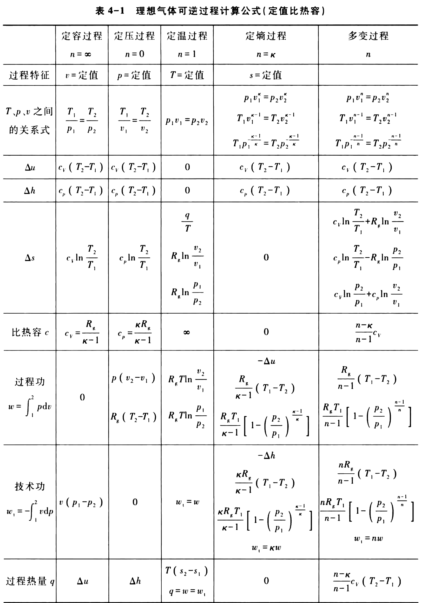

# 基本热力过程

热力设备中, 为了实施热能与机械能间的相互转换, 或使工质达到预期的状
态 ,通常总是通过工质的吸热、膨胀、放热、压缩等一些热力状态变化过程实现。为使问题简化, 暂不考虑实际过程中不可逆的耗损而作为可逆过程。

**多变过程**: 过程中的气体的基本状态参数间满足

$$
p v^{n}=\text { 常数 }
$$

- $n$  为多变指数

$$
n=\frac{\ln \left(p_{2} / p_{1}\right)}{\ln \left(v_{1} / v_{2}\right)}
$$

必须指出, 工质热力状态变化的规律及能量转换状况常与是否流动无关, 对于确定的工质它只取决于过程特征, 故重点讨论闭口系基本热力过程。

过程功的定义 $w=\int_{1}^{2} p \mathrm{~d} v$,  技术功的定义 $w_{\mathrm{t}}=-\int_{1}^{2} v \mathrm{~d} p$.  在多变过程中,  有

$$
w = - \frac{1}{n-1} \Delta(p v)
$$

$$
w_{\mathrm{t}}=n w
$$

热力学第一定律

$$
\delta q=\mathrm{d} u+\delta w
$$

热力学能的性质

$$
\mathrm{d} u=c_{V} \mathrm{d} T
$$

$c_{V}$ 是温度的复杂函数。且有$c_{p}-c_{V}=R_{\mathrm{g}}$,  定义比热容比 $\gamma=\dfrac{c_{p}}{c_{V}}$,  有

$$
c_{p}=\frac{\gamma}{\gamma-1} R_{\mathrm{g}}, \quad c_{V}=\frac{1}{\gamma-1} R_{\mathrm{g}}
$$

多变过程比热容的概念

$$
\delta q=c_{n} \mathrm{~d} T
$$

可以推得

$$
c_{n}=\frac{n-\kappa}{n-1} c_{V}
$$

$\kappa$  称为绝热指数。理想气体绝热指数等于比热容比, 即  $\gamma=\kappa$  。

熵的定义

$$
\delta q=T \mathrm{~d} s
$$

则有

$$
\frac{\partial p}{\partial v}=-n \frac{p}{v}
$$

$$
\frac{\partial T}{\partial s}=\frac{T}{c_{n}}
$$

