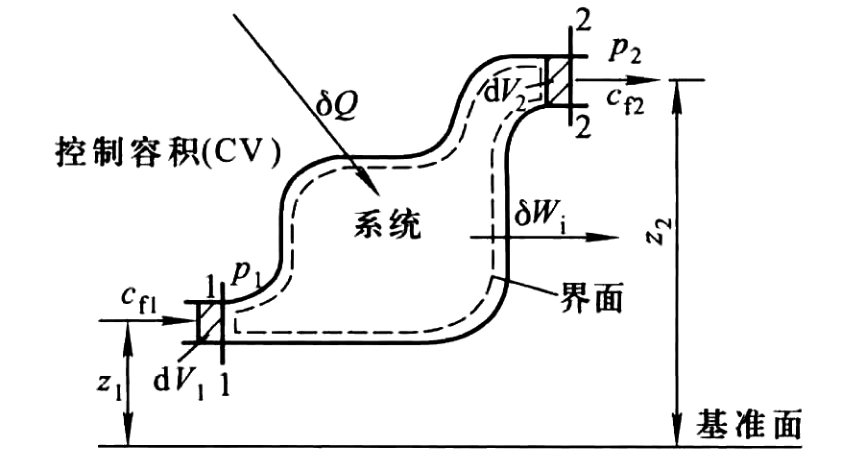

# 热力学第一定律

热是能的一种，机械能变热能，或热能变机械能时，它们间的比值是一定的。热可以变为功，功也可变为热，一定量的热消失时必产生相应量的功，消耗一定量的功时必出现与之对应的一定量的热。

## 热力学能与焓

### 热力学能

热力学能是热力状态的单值函数，是状态参数。

气体的热力学状态可由两个独立状态参数决定，其热力学能是两个独立状态参数的函数。

### 总能量

工质的总能量除热力学能外，还包含工质在参考坐标系中作为一个整体，因
有宏观运动速度而具有动能及因有不同高度而具有位能。前一种能量称为内部储存能，后两种能量则称为外部储存能。

热力学能和机械能是不同形式的能量, 但是可以同时储存在热力系统内。 内部储存能和外部储存能的总和, 即热力学能与宏观运动动能及位能的总和, 称为工质的总储存能,简称总能。若总能用  $E$  表示, 动能和位能分别用  $E_{\mathrm{k}}$  和  $E_{\mathrm{p}}$  表示, 则

$$
E=U+E_{\mathrm{k}}+E_{\mathrm{p}}
$$

若工质的质量为  $m$ , 速度为  $c_{\mathrm{f}}$ , 在重力场中的高度为  $z$ , 则宏观动能和重力位能分别为

$$
E_{\mathrm{k}}=\frac{1}{2} m c_{\mathrm{f}}^{2}, \quad E_{\mathrm{p}}=m g z
$$

式中,  $c_{\mathrm{f}}, z$  只取决于工质在参考系中的速度和位置。这样, 工质的总能可写成

$$
E=U+\frac{1}{2} m c_{\mathrm{f}}^{2}+m g z
$$

$1 \mathrm{~kg}$  工质的总能, 即比总能  $e$ , 可写为

$$
e=u+\frac{1}{2} c_{f}^{2}+g z
$$

### 推动功和流动功

系统与外界交换功的形式除了前已提及的膨胀功或压缩功这类与系统的界面移动有关的功外，还有因工质在开口系统中流动而传递的功，这种功称为推动功。对开口系统进行功的计算时需要考虑这种功。

### 焓

系统中因引进 (或排除) 工质而获得 (或输出) 的总能量是热力学能与推动功之和  ($U+p V$) , 定义为焓, 用符号  $H$  表示, 即

$$
H=U+p V
$$

$1 \mathrm{~kg}$  工质的焓称为比焓, 用  $h$  表示, 即

$$
h=u+p v
$$

## 热力学第一定律的基本能量方程式

进人系统的能量 - 离开系统的能量 = 系统中储存能量的增加

对于闭口系统，进人和离开系统的能量只包括热量和作功两项；对于开口系统，因有物质进出分界面，所以进入系统的能量和离开系统的能量除以上两项外，还有随同物质带进带出系统的能量。

**闭口系能量方程式**

$$
Q-W=\Delta U=U_{2}-U_{1}
$$

$$
Q=\Delta U+W
$$

$$
\delta Q=\mathrm{d} U+\delta W
$$

$$
q=\Delta u+w 
$$

$$
\delta q=\mathrm{d} u+\delta w
$$

式中热量  $Q$  、热力学能变量  $\Delta U$  和功  $W$  都是代数值, 可正可负。系统吸热  $Q$  为正, 系统对外作功  $W$  为正; 反之则为负。系统的热力学能增大时,  $\Delta U$  为正, 反之为负。

闭口系完成一个循环后, 它在循环中与外界交换的净热量等于与外界交换 的净功量。用  $Q_{\text {net }}$  和  $W_{\text {net }}$  分别表示循环净热量和净功量, 则有

$$
Q_{\text {net }} =W_{\text {net }}
$$

$$
q_{\text {net }} =w_{\text {net }}
$$

## 开口系统能量方程式

为简便起见，常取截面上各点流速的平均值为该截面的流速，即认为同一截面上各点有相同的流速。

### 开口系能量方程

图中是一开口系统示意图。在  $\mathrm{d} \tau$  时间内进行一个微元过程: 质量为  $\delta m_{1}$  (体积为  $\mathrm{d} V_{1}$)  的微元工质流人进口截面  1-1 , 质量为  $\delta m_{2}$  (体积为  $\mathrm{d} V_{2}$)  的微元工质流出出口截面 2-2, 同时系统从外界接受热量  $\delta Q$ , 对机器设备作功  $\delta W_{\text{i}}$。  $W_{\text{i}}$ 表示工质在机器内部对机器所作的功, 称为内部功, 以别于机器的轴上向外传出的轴功  $W_{\text{s}}$  。两者的差额是机器各部分摩擦引起的损失, 忽略摩擦损失时两者相等。完成该微元过程后系统内工质质量增加了  $\mathrm{d} m$ , 系统的总能量增加了  $\mathrm{d} E_{\mathrm{cv}}$  。 考察该微过程中的能量平衡, 应有

$$
\mathrm{d} E_{1}+p_{1} \mathrm{~d} V_{1}+\delta Q-\left(\mathrm{d} E_{2}+p_{2} \mathrm{~d} V_{2}+\delta W_{\mathrm{i}}\right)=\mathrm{d} E_{\mathrm{cv}}
$$

式中:  $\mathrm{d} E_{1}=\mathrm{d}\left(U_{1}+E_{\mathrm{k} 1}+E_{\mathrm{p} 1}\right)$ 、 $\mathrm{~d} E_{2}=\mathrm{d}\left(U_{2}+E_{\mathrm{k} 2}+E_{\mathrm{p} 2}\right)$  分别是微元过程中工质带进和带出系统的总能;  $\mathrm{d} E_{\mathrm{cv}}=\mathrm{d}\left(U+E_{\mathrm{k}}+E_{\mathrm{p}}\right)_{\mathrm{cv}}$  是控制容积内总能的增量。  $p_{1} \mathrm{~d} V_{1}  和  p_{2} \mathrm{~d} V_{2}$  分别是微元工质流入流出系统的推动功。

考虑到  $E=m e$  和  $V=m v$ , 且  $h=u+p v$ , 则上式可改写成

$$
\delta Q=\mathrm{d} E_{\mathrm{CV}}+\left(h_{2}+\frac{c_{\mathrm{f}, 2}^{2}}{2}+g z_{2}\right) \delta m_{2}-\left(h_{1}+\frac{c_{\mathrm{f}, 1}^{2}}{2}+g z_{1}\right) \delta m_{1}+\delta W_{\mathrm{i}}
$$

如果流进流出控制容积的工质各有若干股, 则可写成

$$
\delta Q=\mathrm{d} E_{C V}+\sum_{j}\left(h+\frac{c_{\mathrm{f}}^{2}}{2}+g z\right)_{j} \delta m_{j}-\sum_{i}\left(h+\frac{c_{\mathrm{f}}^{2}}{2}+g z\right)_{i} \delta m_{i}+\delta W_{\mathrm{i}}
$$

上式两边均除以  $\mathrm{d} \tau$  即得单位时间内系统能量关系

$$
\Phi=\frac{\mathrm{d} E_{\mathrm{CV}}}{\mathrm{d} \tau}+\sum_{j}\left(h+\frac{c_{\mathrm{f}}^{2}}{2}+g z\right)_{j} q_{m, j}-\sum_{i}\left(h+\frac{c_{\mathrm{f}}^{2}}{2}+g z\right)_{i} q_{m, i}+P_{\mathrm{i}}
$$

式中:  $\Phi=\dfrac{\delta Q}{\mathrm{~d} \tau}, q_{m, j}=\dfrac{\delta m_{j}}{\mathrm{~d} \tau}, q_{m, i}=\dfrac{\delta m_{i}}{\mathrm{~d} \tau}$ ; $P_{\mathrm{i}}=\dfrac{\delta W_{\mathrm{i}}}{\mathrm{d} \tau}$ 。 $\Phi$ 、 $q_{m}$  和  $P_{\mathrm{i}}$  分别表示单位时间内的热流量、质量流量及内部功量, 分别称为热流率、质量流率和内部功率。上式为开口系能量方程的一般表达式。

### 稳定流动能量方程

若流动过程中,开口系统内部及其边界上各点工质的热力参数及运动参数都不随时间而变,则这种流动过程称为稳定流动过程。反之,则为不稳定流动或瞬变流动过程。当热力设备在不变的工况下工作时,工质的流动可视为稳定流动过程;当其在启动、加速等变工况下工作时,工质的流动属于不稳定流动过程。一般,设计热力设备时均按稳定流动过程计算。

稳定流动的必要条件可表示为

$$
\frac{\mathrm{d} E_{\mathrm{CV}}}{\mathrm{d} \tau}=0, \quad \sum q_{m, \mathrm{in}}=\sum q_{m, \text { out }}
$$

只有单股流体进出时, 有

$$
q_{m 1}=q_{m 2}=q_{m}
$$

可得

$$
q=\Delta h+\frac{1}{2} \Delta c_{\mathrm{f}}^{2}+g \Delta z+w_{t}
$$

或写成微量形式

$$
\delta q=\mathrm{d} h+\frac{1}{2} \mathrm{~d} c_{\mathrm{f}}^{2}+g \mathrm{~d} z+\delta w_{\mathrm{i}}
$$

式中,  $q$  和  $w_{\mathrm{i}}$  分别是  $1 \mathrm{~kg}$  工质进入系统后, 系统从外界吸入的热量和在机器内部作的功。当流入质量为  $m$  的流体时,  稳定流动能量方程可写作

$$
Q=\Delta H+\frac{1}{2} m \Delta c_{\mathrm{f}}^{2}+m g \Delta z+W_{\mathrm{i}}
$$

或写成微量形式

$$
\delta Q=\mathrm{d} H+\frac{1}{2} m \mathrm{~d} c_{\mathrm{f}}^{2}+m g \mathrm{~d} z+\delta W_{\mathrm{i}}
$$

技术功

$$
w_{t}=w_{\mathrm{i}}+\frac{1}{2}\left(c_{\mathrm{f} 2}^{2}-c_{\mathrm{f} 1}^{2}\right)+g\left(z_{2}-z_{1}\right)
$$

$$
w_{t}=w-\Delta(p v)=w-\left(p_{2} v_{2}-p_{1} v_{1}\right)
$$

引进技术功概念后, 稳定流动能量方程可写为

$$
q=h_{2}-h_{1}+w_{t}=\Delta h+w_{t}, \delta q=\mathrm{d} h+\delta w_{t}
$$

对于质量为  $m$  的工质, 则

$$
Q=\Delta H+W_{t}, \delta Q=\mathrm{d} H+\delta W_{t}
$$

若过程可逆,则

$$
q=\Delta h-\int_{1}^{2} v \mathrm{~d} p, \delta q=\mathrm{d} h-v \mathrm{~d} p
$$
$$
Q=\Delta H-\int_{1}^{2} V \mathrm{~d} p, \delta Q=\mathrm{d} H-V \mathrm{~d} p
$$

