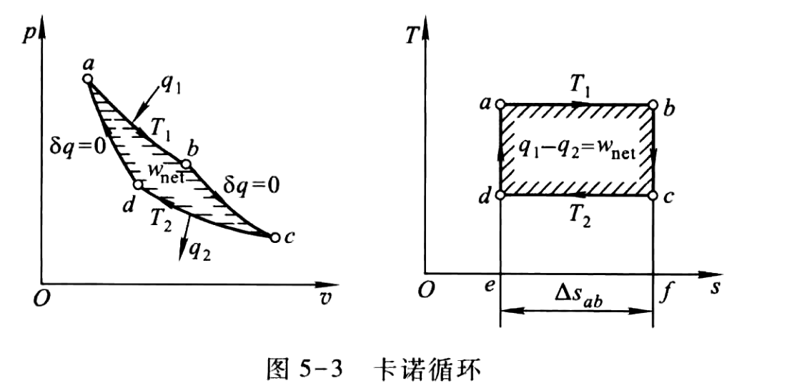
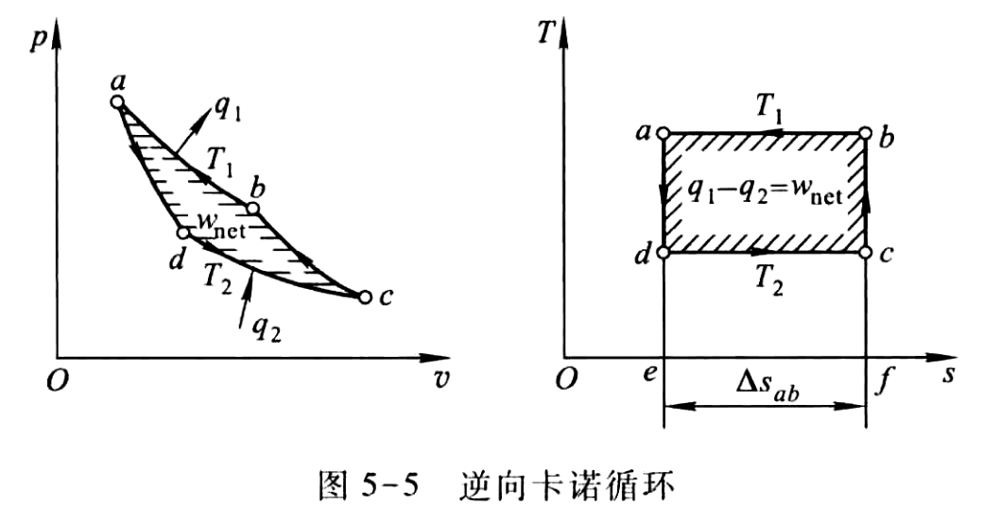
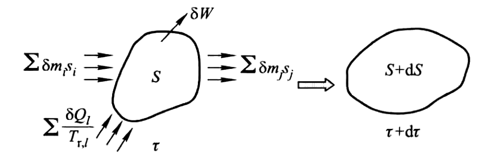

# 热力学第二定律

不可逆过程的因素

- 耗散效应：摩擦、电阻
- 非准平衡过程：温差传热、自由膨胀、混合

自然过程中凡是能够独立、无条件地自动进行的过程, 称为**自发过程**。不能独立地自动进行而需要外界帮助作为补充条件的过程, 称为**非自发过程**。自发过程的反向过程是非自发过程。

不可逆是自发过程的重要特征和属性。

热力学第二定律：非自发过程的实现,  必须有一个自发过程作为补充条件。

## 卡诺循环和多热源可逆循环分析

任何不可逆因素都会引起功损失，因而，设想工质在与热源同样温度下定温吸热,  在与冷源同样温度下定温放热，就可以避免损失,  最为理想。

卡诺循环是工作于温度分别为  $T_{1}$  和  $T_{2}$  的两个热源之间的正向循环, 由两个可逆定温过程和两个可逆绝热过程组成。

卡诺循环的热效率

$$
\eta_{\mathrm{c}}=\frac{w_{\mathrm {net }}}{q_{1}}=1-\frac{T_{2}}{T_{1}}
$$

按与卡诺循环相同的路线而反方向进行的循环即逆向卡诺循环。

逆向卡诺制冷循环的制冷系数为

$$
\varepsilon_{\mathrm{c}}=\frac{q_{2}}{w_{\mathrm {net }}}=\frac{T_{2}}{T_{1}-T_{2}}
$$

逆向卡诺热泉循环的供暖系数为

$$
\varepsilon_{c}^{\prime}=\frac{q_{1}}{w_{\mathrm {net }}}=\frac{T_{1}}{T_{1}-T_{2}}
$$

## 卡诺定理

定理一：在相同温度的高温热源和相同温度的低温热源之间工作的一切可
逆循环,  其热效率都相等,  与可逆循环的种类无关，与采用哪一种工质也无关。

定理二：在温度同为  $T_{1}$  的热源和同为  $T_{2}$  的冷源间工作的一切不可逆循环,  其热效率必小于可逆循环。

## 熵、热力学第二定律的数学表达式

对于任意可逆循环，有

$$
\oint \frac{\delta Q_{\mathrm{rev}}}{T_{\mathrm{r}}}=0
$$

工质经过任意不可逆循环，熵变小于零。

初、终态是平衡态的不可逆过程, 熵变量大于不可逆过程中工质与热源交换的热量与热源温度比值的积分。

$$
S_{2}-S_{1} \geqslant \int_{1}^{2} \frac{\delta Q}{T_{\mathrm{r}}} ,\quad s_{2}-s_{1} \geqslant \int_{1}^{2} \frac{\delta q}{T_{\mathrm{r}}}
$$

$$
\mathrm{d} S \geqslant \frac{\delta Q}{T_{\mathrm{r}}} ,\quad \mathrm{d} s \geqslant \frac{\delta q}{T_{\mathrm{r}}}
$$

## 熵方程

### 闭口系(控制质量)熵方程

闭口系统的熵变可归结为换热和过程不可逆

$$
\mathrm{d} S=\frac{\delta Q}{T_{\mathrm{r}}}+\delta S_{\mathrm{g}}=\delta S_{\mathrm{f}, Q}+\delta S_{\mathrm{g}}
$$

- $\delta S_{\mathrm{r}, \mathrm{Q}}=\dfrac{\delta Q}{T_{\mathrm{r}}}$：热熵流 (简称熵流), 表明系统与外界换热 (无论可逆与否) 引起的系统熵变, 系统吸热为正, 系统放热为负, 过程绝热为零。
- $\delta S_{\mathrm{g}}$：熵产, 是不可逆因素造成的系统熵增加, 熵产只可能是正值, 极限情况 (可逆过程) 为零。

### 开口系(控制体积)熵方程

$$
\mathrm{d} S_{\mathrm{CV}}=\sum_{i} s_{i} \delta m_{i}-\sum_{j} s_{j} \delta m_{j}+\sum_{l} \frac{\delta Q_{l}}{T_{\mathrm{r}, l}}+\delta S_{\mathrm{g}}
$$

## 㶲

热力学中定义: 在环境条件下, 能量中可转化为有用功的最高份额称为该能量的㶲。或者,热力系只与环境相互作用, 从任意状态可逆地变化到与环境相平衡的状态时, 作出的最大有用功称为该热力系的拥。在环境条件下不可能转化为有用功的那部分能量称为㷻。

$$
E=E_{\mathrm{x}}+A_{\mathrm{n}}
$$

### 热量㶲

在温度为  $T_{0}$  的环境条件下, 系统  $\left(T>T_{0}\right)$  所提供的热量中可转化为有用功的最大值是热量㶲, 用  $E_{\mathrm{x}, Q}$  表示。

$$
E_{\mathrm{x}, Q}=\left(1-\frac{T_{0}}{T}\right) Q=Q-T_{0} \Delta \mathrm{S}
$$

### 冷量㶲

工程上把与温度低于环境温度  $T_{0}$  的物体  $\left(T<T_{0}\right)$  交换的热量叫做冷量, 温度低于环境温度的系统, 吸入热量  $Q_{c}$  (即冷量) 时作出的最大有用功称为冷量㶲, 用  $E_{\mathrm{x}, Q_{\mathrm{c}}}$  表示。

$$
E_{\mathrm{x}, Q_{\mathrm{c}}}=\left(\frac{T_{0}}{T}-1\right) Q_{\mathrm{c}}=T_{0} \Delta S-Q_{\mathrm{c}}
$$