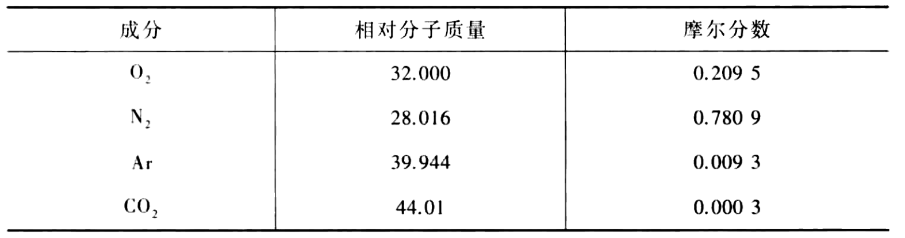

# 理想气体混合物及湿空气

## 理想气体混合物

混合气体可作为某种假想气体，其质量和分子数与组分气体质量之和及分子数之和相同。

- 平均气体常数  $R_{\mathrm{g}, \mathrm{eq}}$
- 平均摩尔质量  $M_{\mathrm{eq}}$

$$
R_{\mathrm{g}, \mathrm{eq}}=\frac{R}{M_{\mathrm{eq}}}
$$

分压力定律

$$
p=\sum p_{i}
$$

分容积定律

$$
V=\sum V_{i}
$$

混合气体成分

质量分数

$$
w_{i}=\frac{m_{i}}{m}
$$

体积分数

$$
\varphi_{i}=\frac{V_{i}}{V}
$$

摩尔分数

$$
x_{i}=\frac{n_{i}}{n}
$$

各成分之间的关系

$$
x_{i}=\varphi_{i}
$$

$$
p_{i}=x_{i} p
$$

$$
w_{i}=\frac{M_{i}}{M_{\mathrm{eq}}} x_{i}
$$

$$
R_{\mathrm{g}, \mathrm{eq}}=\sum w_{i} R_{\mathrm{g}, i}
$$

## 湿空气

大气是**干空气**与水蒸气组成的混合气体

标准化干空气的组成表

湿空气 = 干空气 + 水蒸气

湿空气是理想气体混合物

- 绝对湿度  $\rho_{\mathrm{v}}$：每立方米湿空气中所含水蒸气的质量
- 相对湿度  (饱和度)  $\varphi$：湿空气中水蒸气含量与同温度下最大可能含量之比
- 含湿量  $d$  (比湿度)：$1 \mathrm{~kg}$  干空气中所含水蒸气的质量

