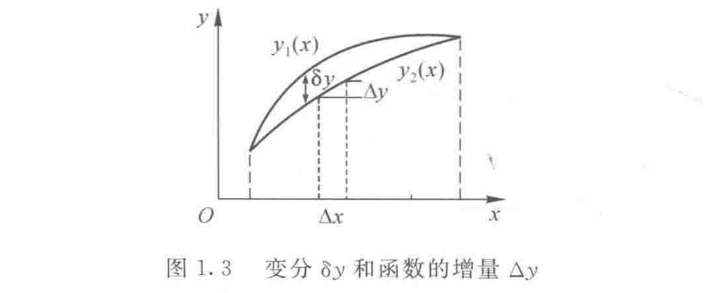

## 常用的数学记号

**集合**

$\mathbf{C}(a,b)$：在区间$(a,b)$上的连续函数集合；

$\mathbf{C}^{k}(a,b)$：在区间$(a,b)$上有$k$阶连续导数函数的集合；

$\partial\Omega$：表示区域$\Omega$的边界。

**无穷小**

$o(x)$：表示是$x$的高阶无穷小量，即 $\lim\dfrac{o(x)}{x}=0$；

$O(x)$：表示是不低于$x$的无穷小量，即 $\lim\dfrac{O(x)}{x}<C$。

**导数**

$f=\frac{\partial f}{\partial t}(\frac{df}{dt})$ 表示对时间变量$t$的导数（偏导数）;

$f'=\frac{\partial f}{\partial x}(\frac{df}{dx})$ 假定函数只有一个空间变量$x$, $f'$表示对 x 的导数；
$f_{.x}=\frac{\partial f}{\partial x}$ 假定函数有多个变量，$f_{.x}$表示对$x$的偏导数，注意与$f_{x}$的区分。

在直角坐标系统中定义哈密尔顿算子$\nabla$为

$$\nabla = i \frac{\partial}{\partial x} + j \frac{\partial}{\partial y} + k \frac{\partial}{\partial z} = \left( \frac{\partial}{\partial x}, \frac{\partial}{\partial y}, \frac{\partial}{\partial z} \right)^{\mathrm{T}}$$

拉普拉斯算子为

$$\Delta=\nabla\cdot\nabla=\frac{\partial^2}{\partial x^2}+\frac{\partial^2}{\partial y^2}+\frac{\partial^2}{\partial z^2}$$

所有两阶偏导数构成的矩阵，称为雅可比 (Jacobi) 矩阵

$$
\mathbf{D}f = f''(\boldsymbol{x}) = \begin{bmatrix}
\frac{\partial^2 f}{\partial x_1^2} & \frac{\partial^2 f}{\partial x_1 \partial x_2} & \cdots & \frac{\partial^2 f}{\partial x_1 \partial x_n} \\
\frac{\partial^2 f}{\partial x_2 \partial x_1} & \frac{\partial^2 f}{\partial x_2^2} & \cdots & \frac{\partial^2 f}{\partial x_2 \partial x_n} \\
\vdots & \vdots & \ddots & \vdots \\
\frac{\partial^2 f}{\partial x_n \partial x_1} & \frac{\partial^2 f}{\partial x_n \partial x_2} & \cdots & \frac{\partial^2 f}{\partial x_n^2}
\end{bmatrix}
$$

$$\mathrm{d}f=\mathrm{d}\boldsymbol{x}^\mathrm{T}\nabla f(x_0)$$

$$\mathrm{d}^2f=\mathrm{d}\boldsymbol{x}^\mathrm{T}\mathbf{D}f(x_0)\mathrm{d}\boldsymbol{x}$$

**常用公式**

高斯(Gauss)定理

$$
\iint_{S} \nabla \cdot \mathbf{A} \, dx \, dy = \oint_{\partial S} \mathbf{n} \cdot \mathbf{A} \, ds
$$

$$
\iiint_{\Omega} \nabla \cdot \mathbf{A} \, dV = \oiint_{\partial \Omega} \mathbf{n} \cdot \mathbf{A} \, dS
$$

格林(Green)公式

$$
\iint_S \nabla \cdot \mathbf{A} \, dx \, dy = \oint_{\partial S} (A_x \, dy - A_y \, dx)
$$

斯托克斯(Stokes)公式

$$
\oint_{\partial S} \mathbf{A} \cdot d\mathbf{s} = \iint_S \nabla \times \mathbf{A} \cdot \mathbf{n} \, dS
$$

## 泛函

记$C=\left\{y(x)\right\}$是给定的函数集合，如果对于该集合中的任何一个函数$y(x)$，都有一个数与之相对应，我们记为$J[y(x)]$或者$J[y]$。这样， 我们说$J[y]$是定义在函数集合$C=\left\langle y(x)\right\rangle$上的一个泛函，$C$为泛函的定义域，$y(x)$称为自变函数。

简单地讲，泛函就是以函数集合为定义域的实值映射。

## 变分

在同一泛函定义域上的两个函数 $y_1(x),y_2(x)$，若彼此任意接近，那么$y_1(x)$与$y_2(x)$之差 $\delta y(x)=y_1(x)-y_2(x)$ 称为（自变）函数的变分。

求变分和求导数可以交换次序

$$(\delta y)'=[y_{1}(x)-y_{2}(x)]'=y_{1}'(x)-y_{2}'(x)=\delta(y')$$

$$\frac{\partial}{\partial x}(\delta w)=\delta(w_{.x})$$

$$\delta(\Delta w)=\Delta\delta w$$

$$\delta(\nabla\phi)=\nabla\delta\phi$$

**泛函的变分**

$$J[y] = \int_{a}^{b} F(x, y, y') \, \mathrm{d}x$$

$$\delta J = \int_a^b [F_{.y} \delta y + F_{.y'} \delta y'] \, dx$$
$$
\delta^2 J = \int_a^b [F_{.yy} (\delta y)^2 + 2F_{.yy'} \delta y \delta y' + F_{.y'y'} (\delta y')^2] \, dx$$

**常用的泛函变分的性质**

(1) $\delta(F_{1}+F_{2})=\delta F_{1}+\delta F_{2}$

(2) $\delta(F_{1}F_{2})=F_{1}\delta F_{2}+F_{2}\delta F_{1}$

(3) $\delta(F^{n})=nF^{n-1}\delta F$

(4) $\displaystyle \delta(\frac{F_{1}}{F_{2}})=\frac{\delta F_{1}}{F_{2}}-\frac{F_{1}\delta F_{2}}{F_{2}^{2}}$

(5) $\delta(F^{(n)})=\delta F^{(n)}$

(6) $\delta\int_{a}^{b}F(x,y,y')dx=\int_{a}^{b}\delta F(x,y,y')dx$

$\displaystyle \delta\int_{a}^{b}F(x,y_{1},y_{2},\cdots,y_{n},y'_{1},y'_{2},\cdots,y'_{n})dx=\int_{a}^{b}\sum_{i=1}^{n}\left[\frac{\partial F}{\partial y_{i}}\delta y_{i}+\frac{\partial F}{\partial y'_{i}}\delta y'_{i}\right]dx$

## 泛函的极值

**变分引理**

函数 $f(x) \in C^0[a,b]$，对于在 $[a,b]$ 上满足 $\eta(a) = \eta(b) = 0$ 且足够光滑的任意函数 $\eta(x)$，如果总是成立

$$
\int_a^b f(x)\eta(x)\,\mathrm{d}x = 0
$$

那么在 $\forall x \in (a,b)$ 必有

$$
f(x) \equiv 0
$$

下面从下列简单泛函入手，来讨论使泛函

$$
J[y] = \int_a^b F(x, y, y') \, dx, \quad y(a) = y_0, \quad y(b) = y_1
$$

取到极值的必要条件。

$$
\begin{aligned}
\delta J &= \int_a^b \left[ \frac{\partial F}{\partial y} \delta y + \frac{\partial F}{\partial y'} \delta y' \right] dx \\
&= \int_a^b \left[ \frac{\partial F}{\partial y} \delta y - \frac{d}{dx} \left( \frac{\partial F}{\partial y'} \right) \delta y + \frac{d}{dx} \left( \frac{\partial F}{\partial y'} \delta y \right) \right] dx \\
&= \int_a^b \left[ \frac{\partial F}{\partial y} - \frac{d}{dx} \left( \frac{\partial F}{\partial y'} \right) \right] \delta y \, dx + \left. \frac{\partial F}{\partial y'} \delta y \right|_a^b \\
&= 0
\end{aligned}
$$

因为 $y(a) = y_0$, $y(b) = y_1$，所以 $\delta y(a) = \delta y(b) = 0$, 从而

$$
\int_a^b \left[ \frac{\partial F}{\partial y} - \frac{d}{dx} \left( \frac{\partial F}{\partial y'} \right) \right] \delta y \, dx = 0
$$

考虑到 $\delta y$ 在 $(a, b)$ 上的任意性，由变分引理可得

$$
\frac{\partial F}{\partial y} - \frac{d}{dx} \left( \frac{\partial F}{\partial y'} \right) = 0, \quad x \in (a, b)
$$

一个二阶常微分方程的边值问题。

由 $\delta J = 0$ 所得到的微分方程及可能的边界条件称为泛函的欧拉方程，有时单独把微分方程称为相应的变分问题的控制方程。

求积分表示的泛函极值时，基本按下列步骤：

1. 先求泛函的一阶变分。如果被积函数中包含有（自变）函数变分的导数，由于自变函数变分的导数和自变函数的变分并非独立，需要通过分部积分（一维问题）或者高斯积分公式，把自变函数变分的导数转化为自变函数的变分。
2. 引用变分引理进一步得到控制方程和可能的边界条件，从而把一个求泛函极值问题化为求解一个微分方程的边值问题。

**泛函的条件极值问题**

## 变分问题中的边界条件

## 哈密尔顿 (Hamilton) 原理

定义拉格朗日函数为

$$
L(q_1, q_2, \cdots, q_n; \dot{q}_1, \dot{q}_2, \cdots, \dot{q}_n) = T - V
$$

以及哈密尔顿泛函（也称为哈密尔顿量）为

$$
H = \int_{t_0}^{t_f} L(q_1, q_2, \cdots, q_n; \dot{q}_1, \dot{q}_2, \cdots, \dot{q}_n) \, dt
$$

**哈密尔顿原理**：给定了初始时刻 $t = t_0$ 以及终止时刻 $t = t_f$ 的状态（这里指广义坐标的值），在所有可能的运动轨迹中，真实的运动应该使得哈密尔顿泛函取极小值。也就是说

$$
H = \int_{t_0}^{t_f} L(q_1, q_2, \cdots, q_n; \dot{q}_1, \dot{q}_2, \cdots, \dot{q}_n) \, \mathrm{d}t \to \min
$$

其对应的一阶变分满足

$$
\delta H = 0
$$

## 里兹法（Ritz）

核心思想：与其直接求解一个复杂的微分方程，不如去寻找一个等效的积分泛函（通常代表系统的总能量）的最小值。我们通过构造一个满足边界条件的、包含待定系数的近似函数（称为“试函数”），将其代入泛函，然后通过调整这些系数，使得泛函的值达到最小，从而得到原问题的近似解。

在弹性力学中，这个泛函通常就是系统的总势能 $\Pi$

$$
\Pi[u] = U - W_{ext}
$$

- $U$ 应变能
- $W_{ext}$ 外力做功

最小势能原理 $\delta\Pi = 0$ 就等价于系统的平衡方程。

$$
\tilde{u}(x, y, ...) = \sum_{i=1}^{n} c_i \phi_i(x, y, ...)
$$

- $c_i$ 是待定常数，这是我们最终要求解的未知量。
- $\phi_i$ 是一组基函数（或称形函数）。

对基函数 $\phi_i$ 的选择有严格要求：
1.  满足本质边界条件：试函数 $\tilde{u}$ 必须精确满足问题给定的所有本质边界条件（也叫几何边界条件，如位移、转角固定等）。这是里兹法能够成功的先决条件。
2.  完备性：理论上，当项数 $n \to \infty$ 时，这个级数能够收敛于精确解。这意味着基函数集合 $\phi_i$ 应该是“完备的”。
3.  线性无关：每个基函数 $\phi_i$ 都应该是独立的。

将构造的试函数 $\tilde{u}$ 代入泛函 $\Pi[u]$ 中。泛函 $\Pi[\tilde{u}]$ 变成了这些系数的普通多元函数：$\Pi(c_1, c_2, ..., c_n)$。

为了找到泛函的最小值，我们利用多元函数求极值的必要条件：泛函对每一个待定系数的偏导数都必须为零。

$$
\frac{\partial \Pi}{\partial c_s} = 0 \qquad s = 1,2,\cdots,n
$$

**与伽辽金法 (Galerkin Method) 的关系**：
- 伽辽金法是一种加权余量法，它不需要构造泛函，而是直接从原始微分方程出发。它要求近似解代入方程后产生的“余量”（误差）与所有基函数正交。
- 对于许多问题（自伴随问题），里兹法和伽辽金法会得到完全相同的代数方程组。
- 伽辽金法更具普适性，因为它不依赖于泛函的存在。

**与有限元法 (Finite Element Method, FEM) 的关系**：
- 有限元法可以看作是里兹法（或伽辽金法）的“分段应用”。
- 里兹法试图用一个复杂的函数来逼近整个区域的解，这在几何形状复杂时非常困难。
- 有限元法将复杂的求解域划分为许多简单的、小的子域（“单元”），在每个单元内使用非常简单的基函数（如线性或二次多项式）来构造试函数。
- 通过这种“分而治之”的策略，有限元法完美地克服了里兹法在处理复杂几何形状上的困难，成为了当今计算力学和工程分析中最主流的数值方法。

## 弹性力学变分原理

### 基础

应变能密度

$$
U = \int \boldsymbol{\sigma}^{\mathrm{T}} \, \mathrm{d} \boldsymbol{\varepsilon}
$$

余应变能密度

$$
V = \boldsymbol{\sigma}^{\mathrm{T}} \boldsymbol{\varepsilon} - U
$$

对于线弹性变形

$$
U = V = \frac{1}{2} \boldsymbol{\sigma}^\mathrm{T} \boldsymbol{\varepsilon}
$$

### 最小势能原理

总势能表达式

$$
\Pi = \iiint_\Omega U \mathrm{d}\Omega + \Pi_2
$$

对于位移场 $u$，如果在弹性体整个区域内满足连续可微条件（从而可以得到相应的应变），同时在位移边界 $B_u$ 上满足 $u = \bar{u}$ 的位移边界条件，这样的位移场称为几何可能位移，一般用 $u^k$ 来表示。在所有的几何可能位移中，弹性力学的精确解应使上述的总势能最小。

### 最小余能定理

一个应力场如果满足：
1. 平衡方程（在物体内部处处满足）
2. 应力边界条件（在给定外力的边界上，面力等于外力）

那么它就是一个静力可能应力场。

最小余能定理指出：**在所有静力可能应力场中，真实的应力场是使体系的总余能为最小值的那一个。**

总余能由两部分组成：
- 余应变能: 储存在物体内部的能量。
- 外力余功: 由指定位移的边界上的反力所做的功。

### 杆的自由扭转

余应变能

$$
\Gamma_1 = \int_0^l \mathrm{d}z \iint_S \frac{\tau^2}{2G} \mathrm{d}x\mathrm{d}y
$$

$\frac{\tau^2}{2G}$ 是余应变能密度，即单位体积内储存的余应变能。
- $G$ 是材料的剪切模量。
- $\tau$ 是总的剪应力。在纯扭转问题中，只有剪应力分量 $\tau_{xz}$ 和 $\tau_{yz}$，所以 $\tau^2 = \tau_{xz}^2 + \tau_{yz}^2$。

普朗特应力函数 $\Psi$ 与剪应力的关系

$$
\tau_{xz} = \frac{\partial\Psi}{\partial y}, \quad \tau_{yz} = -\frac{\partial\Psi}{\partial x}
$$

满足泊松方程

$$
\nabla^2\Psi = -2G\alpha
$$

其中 $\alpha$ 是单位长度扭转角。

无量纲的应力函数 $\Phi$

$$
\Psi = G\alpha\Phi
$$

则有：

$$
\nabla^2\Phi = -2
$$

$$
\tau_{xz} = G\alpha \frac{\partial\Phi}{\partial y} ,\quad \tau_{yz} = -G\alpha \frac{\partial\Phi}{\partial x}
$$

$$
\Gamma_1 = \frac{l\alpha^2G}{2} \iint_S \left[ \left( \frac{\partial\Phi}{\partial x} \right)^2 + \left( \frac{\partial\Phi}{\partial y} \right)^2 \right] \mathrm{d}S
$$

余功

$$
\Gamma_2 = -T\alpha l
$$

对于横截面是单连通区域

$$
T = 2\iint_S \Psi \mathrm{d}S = J \alpha
$$

$$
\Psi \mid_{C} = 0
$$

其中 $J$ 是扭转刚度。

$$
\Gamma_2 = -2G\alpha^2 l \iint_S \Phi \mathrm{d}S
$$

用应力函数 $\Phi$ 表示的总余能

$$
\Pi_c = \Gamma_1 + \Gamma_2 = \frac{l\alpha^2G}{2} \iint_S \left[ \left( \frac{\partial\Phi}{\partial x} \right)^2 + \left( \frac{\partial\Phi}{\partial y} \right)^2 \right] \mathrm{d}S -2G\alpha^2 l \iint_S \Phi \mathrm{d}S
$$

$$
\delta\Pi_c =- G \alpha ^ { 2 } l \iint_ { S } ( \Delta \Phi + 2 ) \delta \Phi \mathrm{d}S
$$

## 广义变分原理

$$
\boldsymbol{u} = (u, v, w)^{\mathrm{T}}
$$

$$
\boldsymbol{\varepsilon} = (\varepsilon_{x}, \varepsilon_{y}, \varepsilon_{z}, \gamma_{yz}, \gamma_{zx}, \gamma_{xy})^{\mathrm{T}}
$$

$$
\boldsymbol{E}(\nabla) = \boldsymbol{E}\left(\frac{\partial}{\partial x}, \frac{\partial}{\partial y}, \frac{\partial}{\partial z}\right) =
\begin{bmatrix}
\frac{\partial}{\partial x} & 0 & 0 & 0 & \frac{\partial}{\partial z} & \frac{\partial}{\partial y} \\
0 & \frac{\partial}{\partial y} & 0 & \frac{\partial}{\partial z} & 0 & \frac{\partial}{\partial x} \\
0 & 0 & \frac{\partial}{\partial z} & \frac{\partial}{\partial y} & \frac{\partial}{\partial x} & 0
\end{bmatrix}
$$

$$
\boldsymbol{\sigma} = (\sigma_{x}, \sigma_{y}, \sigma_{z}, \tau_{yz}, \tau_{zx}, \tau_{xy})^{\mathrm{T}}
$$

$$
\boldsymbol E(\boldsymbol n) = \begin{bmatrix}
n_x & 0 & 0 & 0 & n_z & n_y \\
0 & n_y & 0 & n_z & 0 & n_x \\
0 & 0 & n_z & n_y & n_x & 0
\end{bmatrix}
$$

**H-Z 泛函**

$$
\Pi_3(\boldsymbol u,\boldsymbol \varepsilon,\boldsymbol \sigma) = \iiint\limits_{\Omega} \left\{ U(\boldsymbol \varepsilon) - \boldsymbol f^\mathrm{T} \boldsymbol u - \boldsymbol \sigma^\mathrm{T} \left[ \boldsymbol \varepsilon - \boldsymbol E^\mathrm{T}(\nabla)\boldsymbol u \right] \right\} \mathrm{d}\Omega \\
-\iint\limits_{B_\sigma} \boldsymbol{\overline{p}}^\mathrm{T} \boldsymbol u \mathrm{d}S - \iint\limits_{B_u} \left[\boldsymbol E(\boldsymbol n) \boldsymbol \sigma \right]^\mathrm{T} (\boldsymbol u - \boldsymbol{\overline{u}}) \mathrm{d}S
$$

取驻值可以得到

$$
\boldsymbol E(\nabla)\boldsymbol \sigma + \boldsymbol f = 0, \quad \Omega \text{ 内}
$$
$$
\boldsymbol \varepsilon - \boldsymbol E^\mathrm{T}(\nabla)\boldsymbol u = 0, \quad \Omega \text{ 内}
$$
$$
\boldsymbol \sigma^\mathrm{T} = \frac{\partial U(\boldsymbol \varepsilon)}{\partial \boldsymbol \varepsilon}, \quad \Omega \text{ 内}
$$
$$
\boldsymbol E(\boldsymbol n)\boldsymbol \sigma - \boldsymbol{\overline{p}} = 0, \quad B_\sigma \text{ 上}
$$
$$
\boldsymbol u - \boldsymbol{\overline{u}} = 0, \quad B_u \text{ 上}
$$

其中本质边界条件是 $\boldsymbol{\overline{u}}$，$B_\sigma$ 和 $B_u$ 没有覆盖的地方就是自然边界条件 $\boldsymbol E(\boldsymbol n)\boldsymbol \sigma =0$。

在构造泛函时，能量函数的数学形式不能随便写，它的自变量必须与它在变分原理中的“角色”相匹配。在进行数值计算（尤其是有限元编程）时，这个原则至关重要。构建单元刚度矩阵等的过程，本质上就是对泛函进行离散和求导。如果一开始泛函中的能量形式就用错了，那么后面所有的计算推导都是建立在错误的根基之上，结果自然是错误的。

## 梁理论

### 欧拉——伯努利梁

**平面假定**：梁的横裁面在变形后仍保持平面。

- $\theta_z$ 横截面（绕形心的）相对转动
- $u$ 横截面上与中心轴距离为 $y$ 处的轴向位移
- $\rho_z = \mathrm{d}x/\mathrm{d}\theta_z$ 梁轴线在 $xy$ 坐标面内弯曲的曲率半径
- $\varepsilon_x$ 沿轴向的正应变

$$
u = -y\theta_z
$$

$$
\varepsilon_x = \frac{\partial u}{\partial x} = -\frac{y}{\rho_z}
$$

**横向挤压应力为零假定**：假定 $\sigma_y$ 和 $\sigma_z$ 可以忽略。

这个假定使得我们可以利用单向拉伸（压缩）的胡克定律

$$
\sigma_x = E\varepsilon_x = -\frac{E}{\rho_z}y
$$

由此可以计算相关的内力

$$
F_{Nx} = \iint_A \sigma_x \, \mathrm{d}S = -ES_z \, \frac{1}{\rho_z}
$$

$$
M_y = \iint_A \sigma_x z \, \mathrm{d}S = -EI_{yz} \, \frac{1}{\rho_z}
$$

$$
M_z = -\iint_A \sigma_x y \, \mathrm{d}S = EI_z \, \frac{1}{\rho_z}
$$

$$
S_{z} = \iint_{A} y \, \mathrm{d}S, \quad I_{z} = \iint_{A} y^{2} \, \mathrm{d}S, \quad I_{yz} = \iint_{A} yz \, \mathrm{d}S
$$

分别是横截面 $A$ 对 $z$ 轴的静矩，对 $z$ 轴的惯性矩和对 $y$、$z$ 轴的惯性积。对于确定的截面，这些量均为已知。

上述各式中的 $EI_z$ 称为梁在 $xy$ 平面内的抗弯刚度。

**直法线假定**：梁的轴线上任一法线，在变形后仍是变形后轴线的法线，而且法线不产生任何的伸缩。

$$
v(x, y)=v(x, 0)=v_{0}(x)
$$

$$
\theta_{z} \approx \frac{\mathrm{d} v_{0}}{\mathrm{d} x}
$$

梁上任意一点的位移可以写成

$$
u(x, y, z)=-y \frac{\mathrm{d} v_{0}}{\mathrm{~d} x}, \quad v(x, y, z)=v_{0}(x)
$$

这样，引入直法线假定后，我们可以把整个梁内的位移问题（从而求应变、应力问题）归结为求轴线上的函数 $v_0(x)$。这里函数只与横向位移有关，称为梁的**挠度**，梁的挠度是由弯曲变形引起的。

应变能

$$
U_b = \frac{1}{2} \int_0^l EI_z \left( \frac{\mathrm{d}^2 v}{\mathrm{d}x^2} \right)^2 \mathrm{d}x
$$

外力势能

$$
\Pi_3 = -\int_0^l qv\,dx - \overline{M}_l \frac{\mathrm{d}v(l)}{\mathrm{d}x}
$$

横向弯曲造成拉伸也会产生作用到横向的外力势能

$$
U_N = -\frac{1}{2} \int_0^l N \left( \frac{\mathrm{d}v}{\mathrm{d}x} \right)^2 \mathrm{d}x
$$

### 铁摩辛柯(Timoshenko)梁

将直法线假定改为直线的假定（即梁在轴线上任一法线，变形后仍保持直线但不一定是法线），这样弯曲平面上将有2个独立变量。

$$
\sigma_y = \sigma_z = 0
$$

$$
u(x, y, z) = -y\psi_z(x), \quad v(x, y, z) = v_0(x), \quad w(x, y, z) = 0
$$

- $\psi_z(x)$ 横截面在弯曲平面内的转角。

$$
\sigma_{x} = -Ey \frac{\mathrm{d}\psi_{z}}{\mathrm{d}x}, \quad \tau_{xy} = G\left(\frac{\mathrm{d}v_{0}}{\mathrm{d}x} - \psi_{z}\right), \quad \tau_{yz} = \tau_{zx} = 0
$$

铁摩辛柯梁的直线假定意味着在横截面上切应变(从而切应力)处处相等,也就只给出了截面上平均切应力而不是真实的切应力分布,由于实际上往往梁的上下表面切应力为零,而中心处切应力最大,所以对于中心位置对称的截面,我们可以假定切应变(力)沿着坐标轴呈地物线分布。

## 补充

### 从强形式到弱形式的推导

以降载荷为 $q(x)$ 的欧拉-伯努利梁为例，它的强形式控制微分方程为：

$$
\frac{d^2}{dx^2} \left( EI \frac{d^2v}{dx^2} \right) = q(x) \quad \text{在区间 } [0, L] \text{ 上}
$$

强形式要求解 $v(x)$ 必须四阶可导，并且在定义域内的每一点都满足该方程。这是一种非常“苛刻”的要求。

弱形式的目标是放宽这个要求，不要求点点满足，而是要求在某种“积分平均”的意义下满足。

构造残差并加权积分

$$
R(x) = \frac{d^2}{dx^2} \left( EI \frac{d^2v}{dx^2} \right) - q(x) = 0
$$

引入一个任意的、表现良好的函数 $w(x)$，称为权函数或检验函数。在力学中，它通常被看作是虚位移 $\delta v$。

加权余量法

$$
\int_0^L R(x) \cdot w(x) \,dx = 0
$$

分部积分以“降低”导数阶数

目标是把作用在待求函数 $v(x)$ 上的高阶导数“转移”一部分到已知的权函数 $w(x)$ 上去。使用分部积分公式：$\int u \,dv = uv - \int v \,du$。

$$
\int_0^L \frac{d^2}{dx^2} \left( EI \frac{d^2v}{dx^2} \right) w(x) \,dx = \int_0^L q(x) w(x) \,dx
$$
对左边的积分项进行**第一次分部积分**：
令 $u = w(x)$ 并且 $dv = \frac{d^2}{dx^2} \left( EI \frac{d^2v}{dx^2} \right) dx = (EIv'')'' dx$。
则 $du = w'(x) dx$ 并且 $v = \frac{d}{dx} \left( EI \frac{d^2v}{dx^2} \right) = (EIv'')'$。

$$
\int_0^L (EIv'')'' w \,dx = \left[ w \cdot (EIv'')' \right]_0^L - \int_0^L (EIv'')' w' \,dx
$$

现在，我们得到了一个边界项 $\left[ w \cdot (EIv'')' \right]_0^L$ 和一个新的积分项。注意，待求函数 $v$ 的最高阶导数已经从四阶降到了三阶。我们继续对新的积分项进行**第二次分部积分**：
令 $u = w'(x)$ 并且 $dv = (EIv'')' dx$。
则 $du = w''(x) dx$ 并且 $v = EIv''$。

$$

- \int_0^L (EIv'')' w' \,dx = - \left( \left[ w' \cdot (EIv'') \right]_0^L - \int_0^L (EIv'') w'' \,dx \right)

$$
$$
= \int_0^L (EIv'') w'' \,dx - \left[ w' \cdot (EIv'') \right]_0^L
$$

将两次分部积分的结果代回原方程，我们得到：

$$
\int_0^L (EIv'') w'' \,dx + \left[ w \cdot (EIv'')' \right]_0^L - \left[ w' \cdot (EIv'') \right]_0^L = \int_0^L q(x) w(x) \,dx
$$

整理一下，这就是梁问题的**弱形式**或**虚功方程**：

$$
\int_0^L EI v'' w'' \,dx = \int_0^L q w \,dx - \left[ w \cdot (EIv'')' \right]_0^L + \left[ w' \cdot EIv'' \right]_0^L
$$

**弱形式的优势**：
1.  **要求更低**：强形式要求 $v(x)$ 四阶可导，而弱形式中 $v(x)$ 和 $w(x)$ 都只要求二阶可导即可（保证积分有意义）。这极大地扩展了可接受的解的函数空间。
2.  **数值方法基础**：有限元法 (FEM) 等数值方法正是建立在弱形式之上的。它们构造简单的分段多项式函数（如线性或二次函数）来近似 $v(x)$，这些函数通常不满足高阶导数要求，但满足弱形式的要求。

### 本质边界条件与自然边界条件

在推导弱形式的过程中，我们自然地引出了边界项。边界条件的分类正是基于这些项如何处理。

回顾一下弱形式中的边界项：
$$
\text{Boundary Terms} = \left[ w' \cdot EIv'' \right]_0^L - \left[ w \cdot (EIv'')' \right]_0^L
$$
我们知道，在梁理论中，弯矩 $M = EIv''$，剪力 $Q = -(EIv'')'$。所以边界项可以写成物理量：
$$
\text{Boundary Terms} = \left[ w' \cdot M \right]_0^L + \left[ w \cdot Q \right]_0^L
$$
在梁的两个端点 $x=0$ 和 $x=L$ 处，我们需要规定边界条件。这些条件成对出现：
*   规定位移 $v$ 或规定剪力 $Q$
*   规定转角 $v'$ 或规定弯矩 $M$

**本质边界条件**

*   **定义**：对问题的主要变量（在这里是**位移 $v$** 和**转角 $v'$**）直接进行约束的边界条件。它们也常被称为**几何边界条件**或**狄利克雷 (Dirichlet) 型边界条件**。
*   **例子**：
    *   **固定端 (Clamped/Fixed end)**: 位移和转角都为零。
        $v = 0, \quad v' = 0$
    *   **铰支座 (Pinned/Hinged support)**: 位移为零，但可以自由转动。
        $v = 0$
*   **为何“本质”？**：在使用Ritz法或有限元法等近似方法时，我们所选择的**近似函数（试函数）必须预先严格满足**这些边界条件。它们是定义求解函数空间的“基本”或“必要”约束。如果你不满足它们，你的解在物理上就是错误的（比如固定端“飞”起来了）。
*   **在弱形式中的体现**：如果在一个边界上（比如 $x=0$）规定了 $v=v_0$ 或 $v'=v'_0$，为了保证解的唯一性，我们要求对应的权函数（虚位移）在该点为零，即 $w(0)=0$ 或 $w'(0)=0$。这样一来，对应的边界项 $w \cdot Q$ 或 $w' \cdot M$ 就自然消失了。

**自然边界条件**

*   **定义**：对主要变量的**导数**（在这里是**弯矩 $M$** 和**剪力 $Q$**）进行约束的边界条件。它们也常被称为**力边界条件**或**诺伊曼 (Neumann) 型边界条件**。
*   **例子**：
    *   **自由端 (Free end)**: 弯矩和剪力都为零。
        $M = EIv'' = 0, \quad Q = -(EIv'')' = 0$
    *   **端点受集中力 F 和集中力偶 C 作用**:
        $Q = -F, \quad M = C$
*   **为何“自然”？**：这些条件是作为**变分过程的必然结果**而“自然”出现的。在使用近似方法时，我们**不需要**让试函数预先满足这些条件。相反，它们是通过求解过程（例如，最小化势能泛函）而被近似满足的。
*   **在弱形式中的体现**：如果在一个边界上（比如 $x=L$）是自由端，我们没有对 $v$ 或 $v'$ 做任何约束，因此对应的权函数 $w(L)$ 和 $w'(L)$ 是**任意的**。为了让边界项 $\left[ w' M + w Q \right]_{x=L}$ 恒等于零，必须有 $M(L)=0$ 和 $Q(L)=0$。你看，力边界条件就这样“自然”地从弱形式中浮现出来了。

#### **总结对比**

| 特性             | 本质边界条件 (Essential B.C.)          | 自然边界条件 (Natural B.C.)         |
| :--------------- | :--------------------------------------- | :------------------------------------ |
| **约束对象**     | 位移、转角 (主要变量 $v, v'$)            | 剪力、弯矩 (主要变量的导数 $M, Q$)  |
| **别名**         | 几何边界条件 (Geometric B.C.)            | 力边界条件 (Force B.C.)               |
| **物理意义**     | 约束了结构的几何变形                     | 规定了结构边界上的受力情况            |
| **在近似方法中** | **必须**由试函数 (Trial Function) 预先满足 | **不必**由试函数预先满足，是求解的结果 |
| **例子**         | 固定端、铰支座                           | 自由端、承受外力和外力偶的端点        |

## 电、磁、热弹性材料的变分原理

### 勒让德变换和内能

内能密度 $U$ 是物质状态的特征函数。这意味着一旦 $U$ 作为某个变量（比如应变）的函数被确定，材料的其他物理性质（比如应力）就可以从这个函数中推导出来。

电、磁和热效应的弹性材料

$$
\mathrm{d}U = T\mathrm{d}S + \boldsymbol{\sigma}^{\mathrm{T}} \mathrm{d}\boldsymbol{\varepsilon} + \boldsymbol{E}^{\mathrm{T}} \mathrm{d}\boldsymbol{D} + \boldsymbol{H}^{\mathrm{T}} \mathrm{d}\boldsymbol{B}
$$

式中 $T$、$S$ 为温度和熵，$\boldsymbol\sigma$、$\boldsymbol\varepsilon$ 为应力和应变，$\boldsymbol E$、$\boldsymbol D$ 为电场强度和电位移矢量，$\boldsymbol H$、$\boldsymbol B$ 为磁场强度和磁感应强度。

$S$、$\boldsymbol \varepsilon$、$\boldsymbol D$、$\boldsymbol B$ 相当于广义位移，$T$、$\boldsymbol \sigma$、$\boldsymbol E$、$\boldsymbol H$ 相当于对偶的广义力，广义力和相应广义位移增量相乘后等于广义力所做的（元）功。

通过勒让德变换，我们可以从内能 $U$ 出发，定义出新的热力学势，如亥姆霍兹自由能、吉布斯自由能、焓等，这些新的能量函数以不同的物理量作为其自然自变量，从而方便在不同物理条件下分析问题。

由于自变量更习惯用温度 $T$ 而不是熵 $S$，所以选择用亥姆霍兹 (Helmholtz) 自由能 $H$ 作为热力学函数（注意：它是内能通过勒让德变换得到对偶函数的负值），有

$$
H = H(T, \varepsilon, D, B) = U - TS
$$

$$
\mathrm{d}H = \sigma^\mathrm{T} \mathrm{d}\varepsilon + E^\mathrm{T} \mathrm{d}D + H^\mathrm{T} \mathrm{d}B - S \mathrm{d}T
$$

在不考虑温度影响的电磁弹性材料中，习惯于用 $\varepsilon$、$\Phi(E)$、$B$ 作为自变函数，所以选择用电焓 $H_2$ 作为热力学函数，即

$$
H_2 = H_2(\varepsilon, \Phi, B) = U - E^\mathrm{T} D
$$

$$
\mathrm{d}H_2 = \sigma^\mathrm{T} \mathrm{d}\varepsilon - D^\mathrm{T} \mathrm{d}E + H^\mathrm{T} \mathrm{d}B
$$

其中 $\Phi$ 是电势，满足

$$
E = -\nabla \Phi
$$
