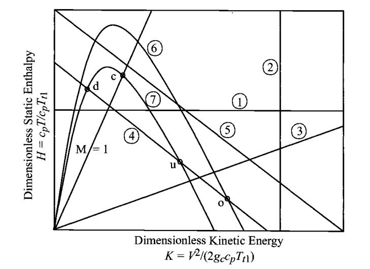
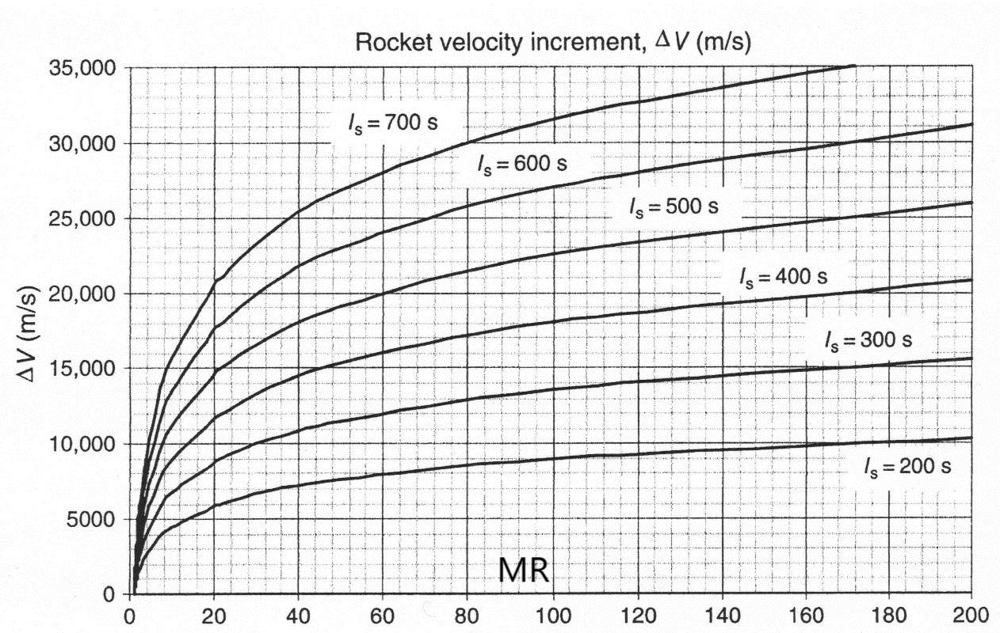
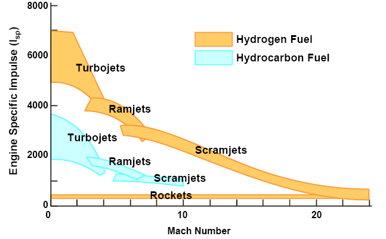
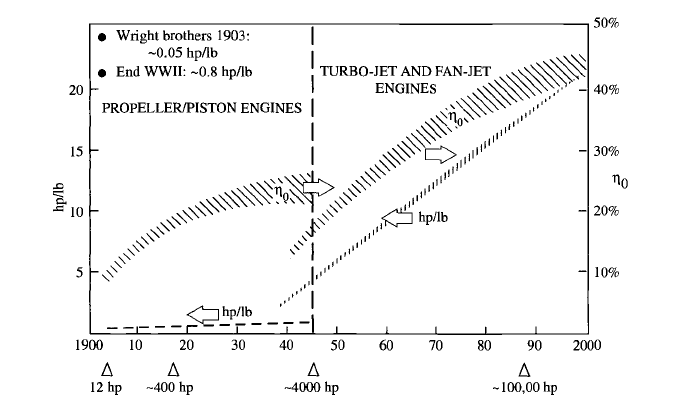
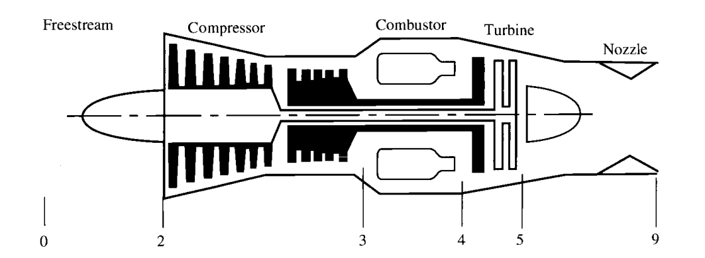
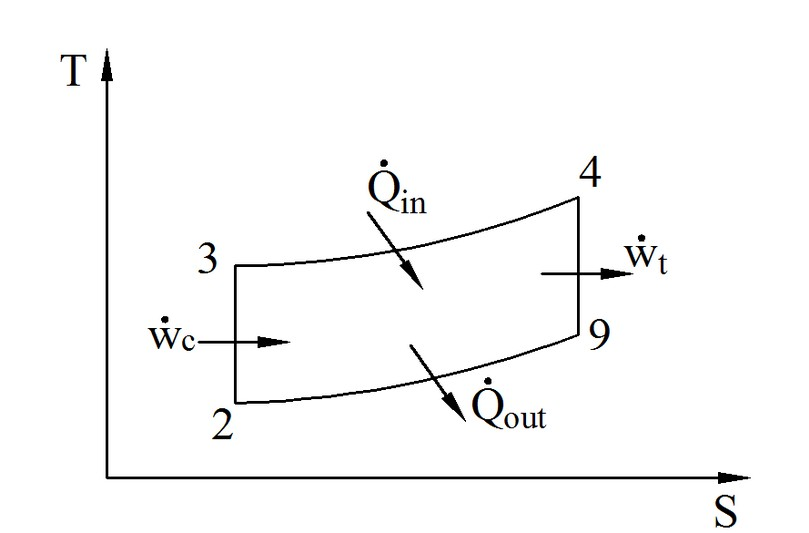
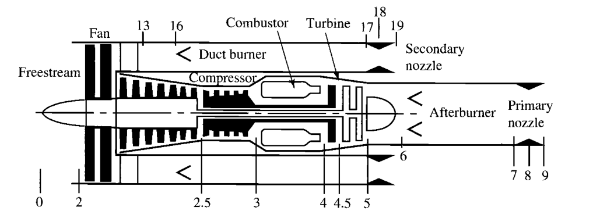
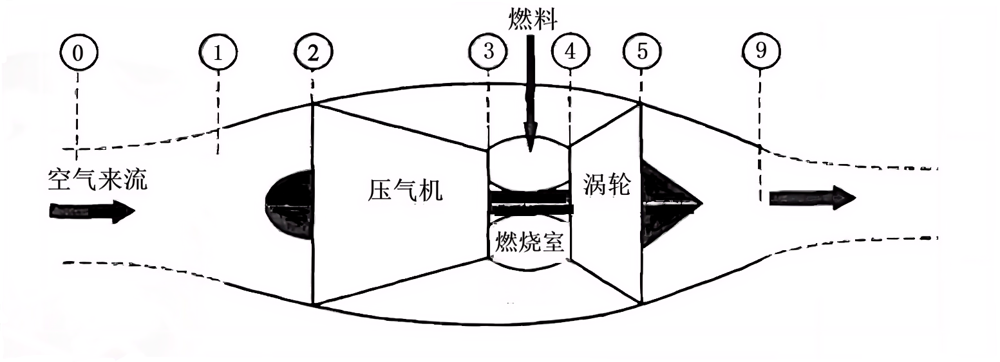

# 推进系统原理总结

## 热力学基础

### 理想气体

状态方程

$$
p=\rho R T
$$

- 标准大气压：101325 Pa = 1 atm
- 海平面大气密度：1.225 Kg/m3
- 标准情况下的大气，理想气体常数 $R$ = 287 J/(kg·K)
- 0 ℃ = 273.16 K

内能 $e=e(T)$

焓 $h=e+p / \rho=e+RT=h(T)$

定容比热容 $C_V=\Big(\dfrac{\partial Q}{\partial T}\Big)_{V}$

定压比热容 $C_P=\Big(\dfrac{\partial h}{\partial T}\Big)_{p}$

比热比 $\gamma=C_P/C_V$

$\mathrm{d}e=C_V\mathrm{d}T$，$\mathrm{d}h=C_P\mathrm{d}T$

$$
C_P=\frac{\gamma R}{\gamma-1} ,\quad C_V=\frac{R}{\gamma-1}
$$

对于标准情况下的大气，$\gamma$  =1.4

对量热完全气体，$C_P$ $C_V$ 为常数

声速

$$
a=\sqrt{\left(\frac{\partial p}{\partial \rho}\right)_{s}}=\sqrt{\gamma R T}
$$

标准海平面大气的声速  $a$ =340.9 m/s

马赫数 $M = \dfrac{u}{a}$

### 热力学定律

热力学第一定律

$$
\delta q+\delta w=\mathrm{d} e
$$

熵的定义

$$
\mathrm{d} s=\frac{\delta q_{\mathrm{rev}}}{T}
$$

- $s$ 熵
- $\delta q_{\mathrm{rev}}$ 可逆地加于系统的热增量

实际上

$$
\mathrm{d} s=\frac{\delta q}{T}+\mathrm{d} s_{\mathrm{irrev}}
$$

- $\delta q$ 不可逆过程中实际加在系统上的热增量
- $\mathrm{d} s_{\mathrm{irrev}}$ 不可逆过程中，系统由于黏性消耗，热传导和质量耗散而产生的熵增

热力学第二定律

$$
\mathrm{d} s \geqslant \frac{\delta q}{T}
$$

熵的实际计算：

可逆过程中

$$
T \mathrm{~d} s=\mathrm{d} e+p \mathrm{~d} v
$$

$$
T \mathrm{~d} s=\mathrm{d} h-v \mathrm{~d} p
$$

对量热完全气体

$$
s_{2}-s_{1}=C_P \ln \frac{T_{2}}{T_{1}}-R \ln \frac{p_{2}}{p_{1}}=C_V \ln \frac{T_{2}}{T_{1}}+R \ln \frac{v_{2}}{v_{1}}
$$

定义既绝热又可逆的过程叫做等熵过程。对量热完全气体，有**等熵关系式**

$$
\frac{p_{2}}{p_{1}}=\left(\frac{\rho_{2}}{\rho_{1}}\right)^{\gamma}=\left(\frac{T_{2}}{T_{1}}\right)^{\gamma /(\gamma-1)}
$$

### 滞止参数

**流动定常、绝热、无黏、不做功**

由热力学第一定理，沿流线

$$
h+\frac{u^{2}}{2}=h_{t}
$$

对于量热完全气体  $h_{t}=C_P T_{t}$ ，称**总温**  $T_{t}$， **总焓**  $h_{t}$  。

如果所有的流线都来自均匀自由来流，那么总焓在不同流线也是相等的，在整个流场中为常数，等于自由来流对应的总焓。

**满足上面条件且等熵**

沿流线总焓相同，则量热完全气体有

$$
\frac{\gamma}{\gamma-1} \frac{p}{\rho}+\frac{1}{2} u^{2}=\frac{\gamma}{\gamma-1} \frac{p_{t}}{\rho_{t}}
$$

$$
p_{t}=\rho_{t} R T_{t}
$$

称**总压**  $p_{t}$，**总密度**  $\rho_{t}$

如果整个流动区域都是等熵的，则总压和总密度分别为常数。

可以定义滞止声速

$$
a_{t} = \sqrt{\gamma R T_{t}}
$$

对理想气体

$$
a^{2}+\frac{\gamma-1}{2} u^{2}=a_{t}^{2}
$$

**等熵关系式**

$$
T=T_{t}\left(1+\frac{\gamma-1}{2} M^{2}\right)^{-1}
$$

$$
p=p_{t}\left(1+\frac{\gamma-1}{2} M^{2}\right)^{-\gamma/(\gamma-1)}
$$

$$
\rho=\rho_{t}\left(1+\frac{\gamma-1}{2} M^{2}\right)^{-1/(\gamma-1)}
$$

### 临界参数

亚声速流或者超声速流中，考虑流场中一点，流体微团**等熵**加速或减速至声速，对应的参数称为**临界参数**，用 “  $*$  ” 标记。

$$
a^{*}=\sqrt{\gamma R T^{*}}
$$

$$
\left(\frac{a^{*}}{a_{0}}\right)^{2}=\frac{T^{*}}{T_{0}}=\frac{2}{\gamma+1}
$$

$$
\frac{p^{*}}{p_{0}}=\left(\frac{2}{\gamma+1}\right)^{\gamma/(\gamma-1)}
$$

$$
\frac{\rho^{*}}{\rho_{0}}=\left(\frac{2}{\gamma+1}\right)^{1/(\gamma-1)}
$$

特征马赫数  $M^{*}=\dfrac{u}{a^*}$

$$
{M^{*}}^{2}=\frac{(\gamma+1) M^{2}}{2+(\gamma-1) M^{2}}
$$

## 准一维流动

### 控制方程

质量守恒

$$
\frac{\mathrm{d} m_{cv}}{\mathrm{d}t}=\dot{m}_{i}-\dot{m}_{o}
$$

$$
\dot{m}=\rho u A
$$

动量守恒

$$
\frac{\mathrm{d} M_{cv}}{\mathrm{d}t}=\sum F+\dot{M}_{i}-\dot{M}_{o}
$$

$$
\dot{M}=\dot{m} u=\rho A u^2
$$

能量守恒

$$
\frac{\mathrm{d} E_{cv}}{\mathrm{d}t}=\dot{Q}-\dot{W}+\dot{E}_{i}-\dot{E}_{o}
$$

$$
\dot{E}=\dot{m} \left(h+\frac{u^2}{2}+g z\right)
$$

### 关系式

定义质量流动参数 [kg/(m^2·s)]

$$
\mathrm{MFP}=\frac{\dot{m}}{A}\frac{\sqrt{T_{t}}}{p_{t}}=\sqrt{\frac{\gamma}{R}} M \left(1+\frac{\gamma-1}{2} M^{2}\right)^{-(\gamma+1)/2(\gamma-1)}
$$

当 $M_{t}=1$ ，则  $A_{t}=A^{*}$ 最小，MFP 达到最大值，此时为临界参数。

$$
\frac T{T^*}=\frac{\frac{\gamma+1}2}{1+(\frac{\gamma-1}2)M^2}
$$

$$
\frac p{p^*}=\left[\frac{\frac{\gamma+1}2}{1+\left(\frac{\gamma-1}2\right)M^2}\right]^{1/(\gamma-1)}
$$

$$
\frac{\rho}{\rho^{*}}=\left[\frac{\frac{\gamma+1}{2}}{1+\left(\frac{\gamma-1}{2}\right)M^{2}}\right]^{\gamma/(\gamma-1)}
$$

$$
\frac{A}{A^*}=\frac{1}{M}\Bigg[\frac{1+\frac{\gamma-1}{2}M^2}{\frac{\gamma+1}{2}}\Bigg]^{(\gamma+1)/2(\gamma-1)}
$$

### 无量纲数

无量纲的焓

$$
H=\frac{C_PT}{C_P T_{ti}}
$$

无量纲的动能

$$
K=\frac{u^{2}}{2C_P T_{ti}}
$$

H-K 图，显示了代表性常量特性的等值线。

关键点：

- 点 o ：表示自由流参考状态，通常对应于流体的初始状态。
- 点 c ：表示在恒定冲量下的阻塞状态，这通常是指流体在特定条件下无法进一步通过的状态。
- 点 u 和 d ：表示法向冲击（normal shock）的终态，这两个点表示流体在通过冲击波前后的状态变化。

圈中的数字表示图中不同的常量特性的等值线，它们分别代表：

1) 静焓和静温。
2) 动能、速度和压力（仅适用于无摩擦加热或冷却的情况）。
3) 马赫数，表示流体速度与当地声速的比值。
4) 总焓和总温（在绝热条件下，即没有热传递的情况下）。
5) 加热后释放的绝热线，这条线表示流体在加热后释放热量的路径。
6) 冲量函数/流推力，和面积（仅适用于无摩擦加热或冷却的流动）。
7) 冲量函数，这个函数通常用来描述流动中的冲量变化。

### 推力

定义冲量函数

$$
I=p A+\dot{m} u=p A (1+\gamma M^2)
$$

流体对管道的作用力

$$
F=I_i-I_o
$$

等熵流关系式

$$
\frac{I}{I^*}=\frac{p}{p^*} \frac{A}{A^*} \frac{1+\gamma Ma^2}{1+\gamma}
$$

## 化学热力学

### 理想气体混合物

$$
p_iV=N_i R_u T
$$

$$
R=\frac{R_u}{M_w}
$$

$R_u$ = 8.314 KJ/(Kmol·K)

摩尔分数 $X_i=\dfrac{N_i}{N}$

质量分数 $Y_i=\dfrac{m_i}{m}=X_i \dfrac{M_{wi}}{M_{w}}$

混合物的分子质量 $\displaystyle M_w=\sum_{i} X_{i} M_{wi}$

每个组分 $T$ $V$ 相同，分压 $p_i=X_i p$

混合物的

内能 $\displaystyle e=\sum_{i} Y_i e_i$

焓 $\displaystyle h=\sum_{i} Y_i h_i$

熵 $\displaystyle s=\sum_{i} Y_i s_i$

定压比热容 $\displaystyle C_P=\sum_{i} Y_i C_{P,i}$

定容比热容 $\displaystyle C_V=\sum_{i} Y_i C_{V,i}$

### 燃烧

**形成焓**(enthalpy of formation, J/mol)

$$
\bar{h}_{k}(T)\approx \underbrace{\bar{h}_{f,k}^{\circ}}_{\text{标准形成焓}}+\underbrace{C_{P,k}(T-T_{ref})}_{\text{显焓}}
$$

- h 上加一横表示平均。
- 右上角的 $\circ$ 表示在标准状态(1atm，298K)其自然存在形式下。对于单质在其标准状态下，生成焓为0。

**热值** (J/mol)

$$
\Delta H_C=\sum_{\text{reactant}}N_i \bar{h}_{i}(T)-\sum_{\text{product}}N_i \bar{h}_{i}(T)
$$

**绝热燃烧温度** $T_{ad}$

定压情况下总焓守恒

$$
\sum_{\text{reactant}}N_i \bar{h}_{i}(T)=\sum_{\text{product}}N_i \bar{h}_{i}(T_{ad})
$$

## 火箭发动机

### 主要参数

火箭推进系统的推力

$$
F=\dot{m}_pu_e+(p_e-p_a)A_e
$$

- $\dot{m}_p$ 质量流率，单位时间内流经系统的质量。
- $u_e$ 喷气速度，从火箭喷口排出的气体相对于火箭的速度。
- $p_e$ 喷口压力。
- $p_a$ 周围环境的大气压力。
- $A_e$ 喷口面积。

有效速度

$$
C=u_e+\frac{(p_e-p_a)A_e}{\dot{m}_p}
$$

$$
F=\dot{m}_pC
$$

总冲量

$$
I_t=\int_0^tFdt\simeq Ft
$$

比冲：单位推进剂重量所产生的总冲量

$$
I_s=\frac{I_t}{m_pg_0}\simeq\frac{C}{g_0}
$$

火箭系统的总质量

$$
m_0=m_{pl}+m_p+m_{dw}
$$

- $m_{pl}$：有效载荷质量，即火箭需要运输的货物或设备的质量。
- $m_p$：推进剂质量，火箭为了产生推力而消耗的燃料和氧化剂的总质量。
- $m_{dw}$：干重，火箭本身的结构、发动机、导航和控制系统等的总质量。

推进剂完全消耗后的质量

$$
m_f=m_0-m_p=m_{pl}+m_{dw}
$$

有效载荷质量比

$$
\lambda=\frac{m_{pl}}{m_{0}}
$$

其他质量比

$$
\delta=\frac{m_{dw}}{m_0}
$$

火箭系统的质量比：火箭系统的初始质量与推进剂完全消耗后的质量之比

$$
MR=\frac{m_0}{m_f}=\frac1{\lambda+\delta}
$$

冲量重量比

$$
\frac{I_t}{w_0}=\frac{I_t}{m_0g_0}=\frac{I_s}{m_f/m_p+1}
$$

推力重量比

$$
\frac F{w_0}=\frac F{m_0g_0}
$$

喷射功率

$$
P_{jet}=\frac12\dot{m}_pu_e^2\simeq\frac{1}{2}Fu_e
$$

化学反应能

$$
P_{\text {chem }}=\dot{m}_{F} \dot{Q}_{F}=\dot{m}_{F}\left(\Delta h_{c}\right)_{F}
$$

实际化学反应能

$$
P_{\text {chem }}^{\prime}=\eta_{\text {comb }} P_{\text {chem }}=\eta_{\text {comb }} \dot{m}_{F}\left(\Delta h_{c}\right)_{F}
$$

飞行器的功率

$$
P_{\text {vehicle }}=F u_{\text {vehicle }}
$$

火箭发动机的内部效率：喷射功率/实际化学反应能 （化学能 → 喷射动能）

$$
\eta_{\text {int }}=\frac{1 / 2 \dot{m}_{p} u_{e}^{2}}{\eta_{\text {comb }} \dot{m}_{F}\left(\Delta h_{c}\right)_{F}}
$$

推进效率：（喷射动能 → 飞行器功率）

$$
\eta_p=\frac{P_\text{vehicle}}{P_\text{vehicle}+1/2 \dot{m}_p(C-u_\text{vehicle})^2}=\frac{2 u_\text{vehicle}/C}{1+(u_\text{vehicle}/C)^2}
$$

### 火箭方程

$$
\mathrm{d}u=-C\frac{\mathrm{d}m}{m}
$$

$$
\frac{\Delta u}{C}=\ln(MR)
$$

**宇宙速度**

低地轨道，$\Delta u_{eff}$

- 不考虑重力和空气阻力 7800 m/s
- 考虑重力，不考虑空气阻力 8000 m/s
- 考虑重力和空气阻力 9140 m/s

**多级火箭系统**

$$
(m_{pl})_i=(m_0)_{i+1}
$$

$$
\lambda_i=\frac{(m_{pl})_i}{(m_{pl})_{i-1}}
$$

$$
\Delta u_{i}=C_{i}\ln(\frac{1}{\lambda_{i}+\delta_{i}})
$$

$$
\Delta u_{tot}=\sum_{i}\Delta u_{i}=\sum_{i}C_{i}\ln(\frac{1}{\lambda_{i}+\delta_{i}})
$$

### 喷管计算

燃烧室总温 $T_c$ ，总压 $p_c$ ，速度为 0 。经过收缩-扩张喷管。等熵流。

喉部马赫数为 1，质量流率最大。

$$
u_{e}=\sqrt{2C_P T_{c}\Big[1-\Big(\frac{p_e}{p_c}\Big)^{(\gamma-1)/\gamma}\Big]}
$$

定义 $\displaystyle\Gamma=\sqrt{\frac{\gamma}{\Big(\dfrac{\gamma+1}{2}\Big)^{(\gamma+1)/(\gamma-1)}}}$

$$
\dot{m}_p=\dot{m}_{\max}=\frac{\Gamma}{\sqrt{R}}\frac{p_c A_{th}}{\sqrt{T_c}}
$$

$$
\frac{A_e}{A_{th}}=\frac{\Gamma}{\displaystyle \sqrt{\frac{2\gamma}{\gamma-1} \left[\left(\frac{p_e}{p_c}\right)^{2/\gamma}-\left(\frac{p_e}{p_c}\right)^{(\gamma+1)/\gamma}\right]}}
$$

$$
\frac{u_e}{u_{th}}=\sqrt{\frac{\gamma+1}{\gamma-1}\left[1-\left(\frac{p_e}{p_c}\right)^{(\gamma-1)/\gamma}\right]}
$$

理论推力(ideal)

$$
\begin{aligned}
F_i&=\dot{m}_p u_e+(p_e-p_{a})A_e \\
&=p_cA_{th}\left[\Gamma\sqrt{\frac{2\gamma}{\gamma-1}\left[1-\left(\frac{p_e}{p_c}\right)^{(\gamma-1)/\gamma}\right]}+\frac{p_e-p_a}{p_c}\frac{A_e}{A_t}\right]
\end{aligned}
$$

最佳推力(opt)，最佳膨胀，$p_e=p_a$

最大推力(max)，$p_e=p_a=0$ ，喷管出口无穷大

理论特征速度

$$
C_i^*=\frac{\sqrt{RT_c}}{\Gamma}=\frac{p_c A_{th}}{\dot{m}_p}
$$

推力系数，0.6~2.2，无量纲，比较不同大小的发动机

$$
C_F=\frac{F}{p_c A_{th}}
$$

有效速度

$$
C=C_{Fi}C_x^{*}
$$

混合质量比

$$
r=\frac{\dot{m}_{ox}}{\dot{m}_F}
$$

## 涡轮发动机

## 引言

涡喷发动机：单位推力大，推进效率低，噪声大，高速飞行

涡轮螺旋桨发动机：低速下推进效率高、飞行速度较低、噪声较大

涡扇发动机：推进效率较高、噪声较小、单位推力较大、大多数飞机

吸气式发动机发展方向

- RAMJET（冲压发动机）：飞行速度更高
- TBCC (涡轮基组合循环发动机)：从低速到高速
- PDE （爆震发动机）：定容燃烧，效率更高

### 理想 Brayton 循环

- 等熵压缩(2-3)(绝热可逆)
- 等压加热(燃烧)(3-4)
- 等熵膨胀(4-9)，动能包括在 $\dot{W}_{t}$ 中
- 等压放热(9-2)，发动机外

热效率

$$
\eta_T=\frac{\dot{W}_{out}}{\dot{Q}_{in}}=\frac{\dot{W}_{t}-\dot{W}_{c}}{\dot{Q}_{in}}=1-\frac{T_2}{T_3}=1-\frac{T_9}{T_4}
$$

单位流量的净输出功

$$
\frac{\dot{W}_{out}}{\dot{m}}=C_P[(T_4-T_9)-(T_3-T_2)]
$$

### 真实涡扇发动机循环参数分析

**符号含义**

- $\tau_r$ 环境流体的滞止温度和热力学温度之比
- $\pi_r$ 环境流体的滞止压力和热力学压力之比
- $\tau_\lambda$ 涡轮前燃烧室出口的滞止焓与环境流体的焓之比

d 进气道，c 压气机，b 燃烧室，t 涡轮，n 喷管，f 风扇，fn 风扇喷管。

- $\tau_a$ 表示部件 a 的出口总温和入口总温之比
- $\pi_a$ 表示部件 a 的出口总压和入口总压之比

**环境和设计参数**

飞行马赫数 $M_0$ ，环境温度 $T_0$ 。

涵道比 $\alpha=\dfrac{\dot{m}_{fn}}{\dot{m}_c}$ 。

压气机、风扇、燃烧室各自的压缩比 $\pi_{c}, \pi_{f}, \pi_{b}$ 。

涡轮材料和冷却技术的限制温度 $T_{t4}$ ，燃料热值 $\Delta h_c$ 。

**性能参数**

进气道、喷管绝热不等熵，$\tau_d=\tau_n=\tau_{fn}=1$ ，$\pi_{d}, \pi_n, \pi_{fn}$ 受摩擦力影响。

风扇、压气机、涡轮多变效率分别为 $e_f$、$e_c$、$e_t$ 。

燃烧效率 $\eta_b$ ，机械效率 $\eta_m$ 。

燃烧前气体性质 $\gamma_c, C_{Pc}$ ，燃烧后气体性质 $\gamma_t, C_{Pt}$ 。

环境压力与喷管压力之比 $\dfrac{p_0}{p_9}, \dfrac{p_0}{p_{19}}$ 。

**待求参数**

单位推力 $\dfrac{F}{\dot{m}_0}$

单位燃油消耗率 $S=\dfrac{\dot{m}_f}{F}$

$TSFC=\dfrac{\dot{m}_f}T$

油气比 $f=\dfrac{\dot{m}_f}{\dot{m}_c}$

推进效率 $\eta_p=\dfrac{Fu_{0}}{\dot{W}_{out}}$

热效率 $\eta_T=\dfrac{\dot{W}_{out}}{(Q_{in})_{ideal}}$

总效率 $\eta_{0}=\eta_{c}\eta_{p}$

**可直接求**

$$
R_{c}=\frac{\gamma_{c}-1}{\gamma_{c}}C_{Pc}
$$

$$
R_{t}=\frac{\gamma_{t}-1}{\gamma_{t}}C_{Pt}
$$

$$
a_{0}=\sqrt{\gamma_{c}R_{c}T_{0}}
$$

$$
u_{0}=a_{0}M_{0}
$$

$$
\tau_\lambda=\frac{C_{Pt}T_{t4}}{C_{Pc}T_0}
$$

$$
T_{t0}=T_{0}\left(1+\frac{\gamma_{c}-1}{2}M_{0}^{2}\right)
$$

$$
\tau_{r}=\frac{T_{t0}}{T_{0}}=1+\frac{\gamma_{c}-1}{2}M_{0}^{2}
$$

$$
\pi_{r}=\tau_{r}^{\gamma_{c}/(\gamma_{c}-1)}
$$

$$
\tau_{f}=\pi_{f}^{(\gamma_{c}-1)/\gamma_{c}e_{f}} \quad \tau_{c}=\pi_{c}^{(\gamma_{c}-1)/\gamma_{c}e_{c}}
$$

**第1步**

发动机推力

$$
F=(\dot{m}_{9}u_{9}-\dot{m}_{c}u_{0})+\dot{m}_{fn}(u_{19}-u_{0})+A_{9}(p_{9}-p_{0})+A_{19}(p_{19}-p_{0})
$$

其中 $\dot{m}_{9}=\dot{m}_c+\dot{m}_f$ 。考虑 $\alpha=\dfrac{\dot{m}_{fn}}{\dot{m}_c}$ ，$f=\dfrac{\dot{m}_f}{\dot{m}_c}$ ，则单位推力

$$
\begin{aligned}
\frac{F}{\dot{m}_{0}}=\frac{a_{0}}{1+\alpha}\left[(1+f)\frac{u_{9}}{a_{0}}+\alpha\frac{u_{19}}{a_{0}}-(1+\alpha)M_{0}\right] \\
+\frac{A_{9}p_{9}}{\dot{m}_{0}}(1-\frac{p_{0}}{P_{9}})+\frac{A_{9}p_{19}}{\dot{m}_{0}}(1-\frac{p_{0}}{p_{19}})
\end{aligned}
$$

$$
\begin{aligned}
\frac{A_{9}p_{9}}{\dot{m}_{0}}=\frac{\dot{m}_{9}}{\dot{m}_{0}}\frac{A_{9}p_{9}}{\dot{m}_{9}}=\frac{\dot{m}_{9}}{\dot{m}_{0}}\frac{A_{9}p_{9}}{\rho_{9}A_{9}u_{9}}=\frac{\dot{m}_{9}}{\dot{m}_{0}}\frac{R_{9}T_{9}}{u_{9}} \\
=\frac{\dot{m}_{9}}{\dot{m}_{0}}\frac{R_{9}T_{9}}{R_{0}T_{0}}\frac{a_{0}^2}{\gamma_{0}u_{9}}=\frac{1+f}{1+\alpha}\frac{a_0 R_t}{\gamma_c R_c}\frac{T_9/T_0}{u_9/a_0}
\end{aligned}
$$

同理

$$
\frac{A_{19}p_{19}}{\dot{m}_{0}}=\frac{\alpha}{1+\alpha}\frac{a_0}{\gamma_c}\frac{T_{19}/T_0}{u_{19}/a_0}
$$

则

$$
\begin{aligned}
\frac{F}{\dot{m}_{0}}=&\frac{a_{0}}{1+\alpha}\Big[(1+f)\frac{u_{9}}{a_{0}}+\alpha\frac{u_{19}}{a_{0}}-(1+\alpha)M_{0} \\
&+(1+f)\frac{R_t}{\gamma_c R_c}\frac{T_9/T_0}{u_9/a_0}(1-\frac{p_{0}}{P_{9}})+\frac{\alpha}{\gamma_c}\frac{T_{19}/T_0}{u_{19}/a_0}(1-\frac{p_{0}}{p_{19}})\Big]
\end{aligned}
$$

可计算 $\dfrac{F}{\dot{m}_{0}}$ ，但 $f, \dfrac{u_9}{a_0}, \dfrac{u_{19}}{a_0}, \dfrac{T_9}{T_0}, \dfrac{T_{19}}{T_0}$ 未知。

**第2步**

$$
\left(\frac{u_9}{a_0}\right)^2=\frac{a_9^2}{a_0^2}M_9^2=\frac{\gamma_t R_t}{\gamma_c R_c}\frac{T_9}{T_0}M_9^2
$$

同理

$$
\left(\frac{u_{19}}{a_0}\right)^2=\frac{T_{19}}{T_0}M_{19}^2
$$

$M_9, M_{19}$ 未知。

**第3步**

由

$$
p_{t}=p\left[1+\frac{\gamma-1}{2}M^{2}\right]^{\gamma/(\gamma-1)}
$$

得

$$
M_{9}^{2}=\frac{2}{\gamma_{t}-1}\left[\left(\frac{p_{t9}}{p_{9}}\right)^{(\gamma_{t}-1)/\gamma_{t}}-1\right]
$$

$$
M_{19}^{2}=\frac{2}{\gamma_{c}-1}\left[\left(\frac{p_{t19}}{p_{19}}\right)^{(\gamma_{c}-1)/\gamma_{c}}-1\right]
$$

且有

$$
\frac{p_{t9}}{p_{9}}=\pi_{n}\pi_{t}\pi_{b}\pi_{c}\pi_{d}\pi_{r}\frac{p_{0}}{p_{9}}
$$

$$
\frac{p_{t19}}{p_{19}}=\pi_{fn}\pi_{f}\pi_{d}\pi_{r}\frac{p_{0}}{p_{19}}
$$

$\pi_t$ 未知。

**第4步**

$$
\frac{T_9}{T_0}=\frac{T_{t9}}{T_0}\frac{T_9}{T_{t9}}=\frac{T_{t9}}{T_0}\left(\frac{p_{t9}}{p_{9}}\right)^{-(\gamma_t-1)/\gamma_t}
$$

同理

$$
\frac{T_{19}}{T_0}=\frac{T_{t19}}{T_0}\left(\frac{p_{t19}}{p_{19}}\right)^{-(\gamma_c-1)/\gamma_c}
$$

且有

$$
\frac{T_{t9}}{T_{0}}=\tau_{n}\tau_{t}\tau_{b}\tau_{c}\tau_{d}\tau_{r}
$$

$$
\frac{T_{t19}}{T_{0}}=\tau_{fn}\tau_{f}\tau_{d}\tau_{r}
$$

又由

$$
\tau_{b}=\frac{T_{t4}}{T_{t3}}=\frac{C_{Pt}T_{t4}}{C_{Pc}T_{0}}\frac{C_{Pc}T_{0}}{C_{Pt}T_{t3}}=\tau_\lambda\frac{C_{Pc}}{C_{Pt}}\frac{T_{0}}{T_{t3}}=\frac{C_{Pc}}{C_{Pt}}\frac{\tau_\lambda}{\tau_{c}\tau_{d}\tau_{r}}
$$

得

$$
\frac{T_{t9}}{T_{0}}=\frac{C_{Pc}}{C_{Pt}}\tau_{n}\tau_{t}\tau_\lambda
$$

$\tau_{t}$ 未知。

**第5步**

燃烧

$$
\dot{m}_{c}C_{Pc}T_{t3}+\eta_b\dot{m}_{f}\Delta h_{c}=(\dot{m}_{c}+\dot{m}_{f})C_{Pt}T_{t4}
$$

同除 $\dot{m}_{c}C_{Pc}T_{0}$ ，代入 $\tau_d=\tau_n=1$ ，得

$$
f=\frac{\tau_{\lambda}-\tau_{c}\tau_{r}}{\dfrac{\eta_{b}\Delta h_{c}}{C_{Pc}T_{0}}-\tau_{\lambda}}
$$

$f$ 可求。

**第6步**

$$
\eta_{m}=\frac{\dot{W}_{c}+\dot{W}_{f}}{\dot{W}_{t}}
$$

$$
\dot{W}_{c}=\dot{m}_{c}C_{Pc}(T_{t3}-T_{t2})
$$

$$
\dot{W}_{f}=\dot{m}_{fn}C_{Pc}(T_{t13}-T_{t2})
$$

$$
\dot{W}_{t}=(\dot{m}_{c}+\dot{m}_{f})C_{Pt}(T_{t4}-T_{t5})
$$

则有

$$
\eta_{m}(1+f)C_{Pt}T_{t4}(1-\tau_{t})=C_{Pc}T_{t2}[(\tau_{c}-1)+\alpha(\tau_{f}-1)]
$$

又由

$$
\frac{C_{Pt}T_{t4}}{C_{Pc}T_{t2}}=\frac{C_{pt}T_{t4}}{C_{pc}T_{0}}\frac{T_{0}}{T_{t2}}=\frac{\tau_{\lambda}}{\tau_r}
$$

得

$$
\tau_t=1-\frac{\tau_r}{\tau_\lambda \eta_{m}(1+f)}[(\tau_{c}-1)+\alpha(\tau_{f}-1)]
$$

$$
\pi_{t}=\tau_{t}^{\gamma_{t}/[(\gamma_{t}-1)e_{t}]}
$$

**第7步**

$$
S=\frac{\dot{m}_f}{F}=\frac{f}{(1+\alpha)F/\dot{m}_0}
$$

**第8步**

$$
\begin{aligned}
\eta_p&=\frac{Fu_{0}}{\dot{W}_{out}}=\frac{Fu_{0}}{\frac{1}{2}\dot{m}_{fn}(u_{19}^{2}-u_{0}^{2})+\frac{1}{2}(\dot{m}_{c}+\dot{m}_{f})u_{9}^{2}-\frac{1}{2}\dot{m}_{c}u_{0}^{2}} \\
&=\dfrac{2(1+\alpha) u_{0} F/\dot{m}_{0}}{a_{0}^{2}\left[(1+f)\Big(\dfrac{u_{9}}{a_{0}}\Big)^{2}+\alpha\Big(\dfrac{u_{19}}{a_{0}}\Big)^{2}-(1+\alpha)M_{0}^2\right]}
\end{aligned}
$$

$$
\begin{aligned}
\eta_T&=\frac{\dot{W}_{out}}{(Q_{in})_{ideal}}=\frac{\frac{1}{2}\dot{m}_{fn}(u_{19}^{2}-u_{0}^{2})+\frac{1}{2}(\dot{m}_{c}+\dot{m}_{f})u_{9}^{2}-\frac{1}{2}\dot{m}_{c}u_{0}^{2}}{\dot{m}_f \Delta h_c} \\
&=\frac{a_{0}^{2}\left[(1+f)\Big(\dfrac{u_{9}}{a_{0}}\Big)^{2}+\alpha\Big(\dfrac{u_{19}}{a_{0}}\Big)^{2}-(1+\alpha)M_{0}^2\right]}{2f \Delta h_c}
\end{aligned}
$$

$$
\eta_{0}=\eta_{T}\eta_{p}
$$

### 涡喷发动机

安装前推力

$$
\begin{aligned}
F&=\dot{m}_{9}u_{9}-\dot{m}_{0}u_{0}+(p_{9}-p_{0})A_{9} \\
&\simeq\dot{m}_0(u_9-u_0)+(p_9-p_0)A_9
\end{aligned}
$$

安装后推力，考虑引擎舱的影响，有效推力计算应从 1-9

$$
T=F-D=F-D_n-D_{add}
$$

$$
D_n=\int_1^9(p-p_0)\mathrm{d}A_y
$$

$$
D_{add}=\int_0^1(p-p_0)\mathrm{d}A_y
$$

对一维流动

$$
D_{add}=p_{1}A_{1}(1+\gamma M_{1}^{2})-p_{0}A_{0}\gamma M_{0}^{2}-p_{0}A_{1}
$$

最佳推力，最佳膨胀 $p_9=p_0$

**热效率**

$$
\eta_T=\frac{\dot{W}_{out}}{\dot{Q}_{in}}
$$

$$
\dot{Q}_{in}=\dot{m}_f(\Delta h_{c,f})
$$

对涡喷发动机

$$
\dot{W}_{out}=\frac12{\left[(\dot{m}_0+\dot{m}_f)u_9^2-\dot{m}_0u_0^2\right]}
$$

推进效率

$$
\eta_p=\frac{Tu_0}{\dot{W}_{out}}\simeq\frac{Fu_0}{\dot{W}_{out}}\simeq\frac2{\dfrac{u_9}{u_0}+1}
$$

总效率

$$
\eta_0=\frac{Tu_0}{\dot{Q}_{in}}=\frac{Tu_0}{\dot{W}_{out}}\frac{\dot{W}_{out}}{\dot{Q}_{in}}=\eta_p\eta_T
$$

或

$$
\eta_0=\frac{Tu_0}{\dot{m}_f(\Delta h_c)}=\frac{u_0}{TSFC(\Delta h_c)}
$$

发动机推重比 $\dfrac{F}{W_{engine}}$

**理想情况下循环参数分析**

$$
\dot{W}_{t}=\dot{W}_{0},\quad p_{t4}=p_{t3},\quad p_{9}=p_{0},\quad T_{t4}>T_{t3}
$$

$$
\pi_b=\pi_d=\pi_n=1
$$

已知

- $M_0$ 飞行马赫数
- $T_0$ 环境温度
- $\Delta h_c$ 燃料热值
- $T_{t4}$ 涡轮材料和冷却技术的限制温度
- $\pi_c$ 压气机的压缩比，设计参数选择

$$
\tau_{\lambda}=\frac{T_{t4}}{T_{0}}
$$

$$
\tau_{c}=\pi_{c}^{(\gamma-1)/\gamma}
$$

$$
\tau_{r}=\frac{T_{t0}}{T_{0}}=1+\frac{\gamma-1}{2}M_{0}^2
$$

$$
\pi_{r}=\tau_{r}^{\gamma/(\gamma-1)}
$$

$$
a_{0}=\sqrt{\gamma R T_{0}}
$$

可求得发动机性能参数

$$
\tau_{t}=1-\frac{\tau_{r}}{\tau_\lambda}(\tau_{c}-1)
$$

$$
\frac{T_9}{T_0}=\tau_b=\frac{\tau_\lambda}{\tau_c \tau_r}
$$

$$
\frac{u_{9}}{a_{0}}=\sqrt{\frac{2}{\gamma-1}\frac{\tau_\lambda}{\tau_c \tau_r}(\tau_t \tau_c \tau_r-1)}
$$

$$
\frac{F}{\dot{m}_{0}}=a_{0}(\frac{u_{9}}{a_{0}}-M_{0})
$$

$$
f=\frac{\dot{m}_f}{\dot{m}_0}=\frac{C_pT_{0}}{\Delta h_{c}}(\tau_\lambda-\tau_{c}\tau_{r})
$$

$$
S=\frac{\dot{m}_f}{F}=\frac{f}{F/\dot{m}_{0}}
$$

$$
\eta_T=1-\frac{1}{\tau_c \tau_r}
$$

$$
\eta_p=\frac{2M_0}{u_9/a_0+M_0}
$$

$$
\eta_0=\eta_p \eta_T
$$

### 涡扇发动机

**理想情况下循环参数分析**

$$
\tau_{fn}=\pi_{fn}=\pi_d=1
$$

已知 $T_0, M_0, \Delta h_c, T_{t4}, \pi_c, \pi_f, \alpha$

发动机工作要求

$$
\dot{W}_t=\dot{W}_f+\dot{W}_c
$$

$$
p_0=p_9=p_{19}
$$

则

$$
\tau_{r}=\frac{T_{t0}}{T_{0}}=1+\frac{\gamma-1}{2}M_{0}^{2}
$$

$$
a_{0}=\sqrt{\gamma R T_{0}}
$$

$$
\tau_{\lambda}=\frac{T_{t4}}{T_{0}}
$$

$$
\tau_{c}=\pi_{c}^{(\gamma-1)/\gamma}
$$

$$
\tau_{f}=\pi_{f}^{(\gamma-1)/\gamma}
$$

可求得发动机性能参数

$$
\tau_{t}=1-\frac{\tau_{r}}{\tau_\lambda}[(\tau_{c}-1)+\alpha(\tau_{f}-1)]
$$

$$
\frac{u_{9}}{a_{0}}=\sqrt{\frac{2}{\gamma-1}\frac{\tau_\lambda}{\tau_c \tau_r}(\tau_t \tau_c \tau_r-1)}
$$

$$
\frac{u_{19}}{a_0}=M_{19}=\sqrt{\frac{2}{\gamma-1}(\tau_f \tau_r-1)}
$$

$$
T_{19}=T_0
$$

$$
\frac{T_{9}}{T_{0}}=\tau_{b}=\frac{\tau_\lambda}{\tau_r \tau_c}
$$

$$
\frac{F}{\dot{m}_0}=\frac{a_{0}}{1+\alpha}\left[(\frac{u_{9}}{a_{0}}-M_{0})+\alpha(\frac{u_{19}}{a_{0}}-M_{0})\right]
$$

$$
f=\frac{\dot{m}_f}{\dot{m}_c}=(1+\alpha)\frac{\dot{m}_f}{\dot{m}_0}=\frac{C_pT_{0}}{\Delta h_{c}}(\tau_\lambda-\tau_{c}\tau_{r})
$$

$$
S=\frac{\dot{m}_f}{F}=\frac{f}{(1+\alpha)F/\dot{m}_{0}}
$$

$$
\eta_T=1-\frac{1}{\tau_c \tau_r}
$$

<!-- $$
\frac{\dot{W}_{out}}{\dot{m}_0}=
$$ -->

$$
\eta_p=\frac{F u_0}{\dot{W}_{out}}=\frac{2[\alpha(u_{19}/u_{0}-1)+(u_{9}/u_{0}-1)]}{\alpha([u_{19}/u_{0}]^2-1)+([u_{9}/u_{0}]^2-1)}
$$

$$
\eta_0=\eta_p \eta_T
$$

推力比

$$
FR=\frac{F_C/\dot{m}_{C}}{F_F/\dot{m}_{F}}=\frac{u_{9}/a_{0}-M_{0}}{u_{19}/a_{0}-M_{0}}
$$

