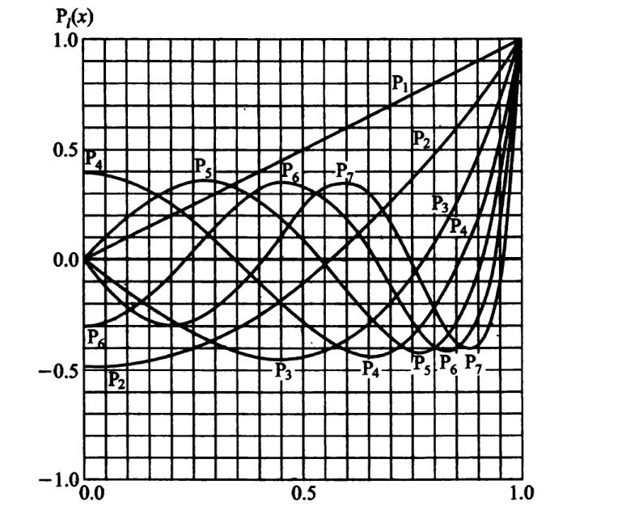
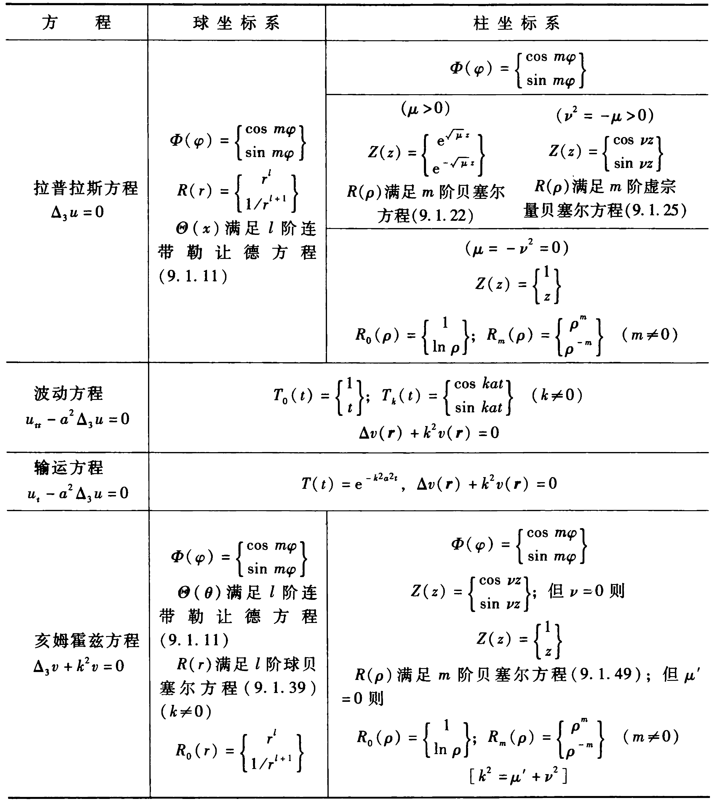
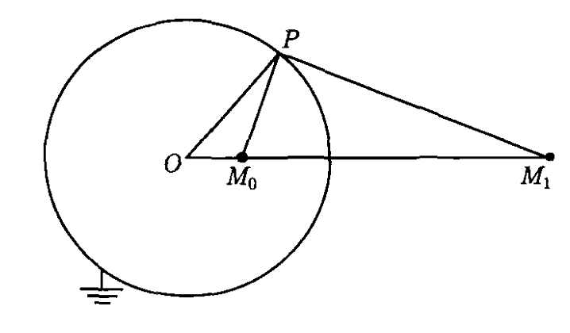
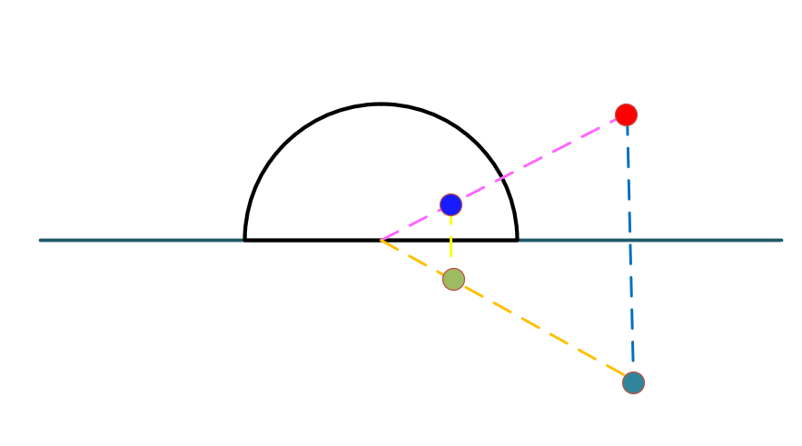
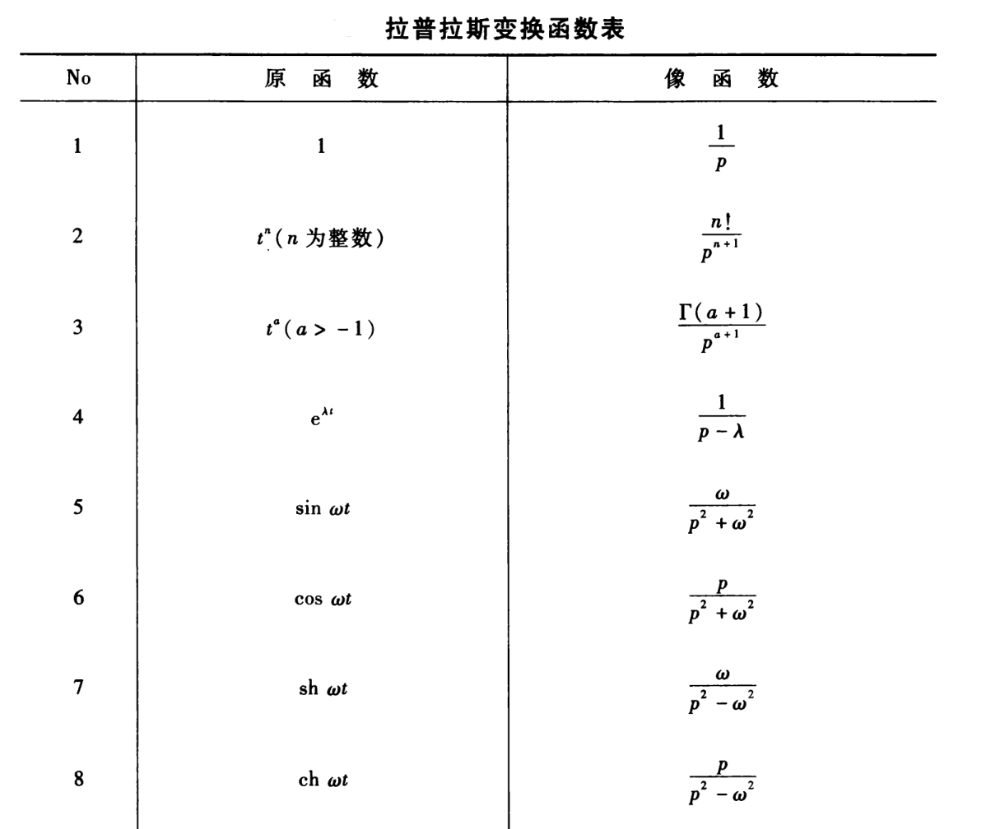

#! https://zhuanlan.zhihu.com/p/627085807
# 数理方法考前必背

笔记源代码(https://github.com/cjyyx/notes/tree/main/%E5%AD%A6%E4%B9%A0%E7%AC%94%E8%AE%B0/%E6%95%B0%E7%90%86%E6%96%B9%E6%B3%95)

## 特殊函数

### 勒让德多项式

前几个勒让德多项式

$$
\begin{aligned}
P_{0}(x) & = 1 \\
P_{1}(x) & = x=\cos \theta \\
P_{2}(x) & = \dfrac{1}{2}\left(3 x^{2}-1\right)=\dfrac{1}{4}(3 \cos 2 \theta+1) \\
P_{3}(x) & = \dfrac{1}{2}\left(5 x^{3}-3 x\right)=\dfrac{1}{8}(5 \cos 3 \theta+3 \cos \theta)
\end{aligned}
$$

勒让德多项式的正交关系

$$
\int_{-1}^{+1} \mathrm{P}_{k}(x) \mathrm{P}_{l}(x) \mathrm{d} x=0 \quad(k \neq l)
$$

$$
\int_{0}^{\pi} \mathrm{P}_{k}(\cos \theta) \mathrm{P}_{l}(\cos \theta) \sin \theta \mathrm{d} \theta=0 \quad(k \neq l)
$$

勒让德多项式的模

$$
N_{l}^{2}=\int_{-1}^{+1}\left[\mathrm{P}_{l}(x)\right]^{2} \mathrm{~d} x =\dfrac{2}{2 l+1}
$$

$$
N_{l}=\sqrt{\dfrac{2}{2 l+1}} \quad(l=0,1,2, \cdots)
$$

### 连带勒让德函数

$$
\mathrm{P}_{l}^{m}(x)=\left(1-x^{2}\right)^{\frac{m}{2}} \mathrm{P}_{l}^{[m]}(x) \quad (m=0,1,2, \cdots,l)
$$

函数表

$$
\begin{aligned}
P_{1}^{1}(x) & =\left(1-x^{2}\right)^{\frac{1}{2}}=\sin \theta \\
P_{2}^{1}(x) & =3\left(1-x^{2}\right)^{\frac{1}{2}} x=\frac{3}{2} \sin 2 \theta=3 \sin \theta \cos \theta \\
P_{2}^{2}(x) & =3\left(1-x^{2}\right)=\frac{3}{2}(1-\cos 2 \theta)=3 \sin ^{2} \theta \\
P_{3}^{1}(x) & =\frac{3}{2}\left(1-x^{2}\right)^{\frac{1}{2}}\left(5 x^{2}-1\right)=\frac{3}{8}(\sin \theta+5 \sin 3 \theta)=6 \sin \theta-\frac{15}{2} \sin ^{3} \theta \\
P_{3}^{2}(x) & =15\left(1-x^{2}\right) x=\frac{15}{4}(\cos \theta-\cos 3 \theta)=15 \sin ^{2} \theta \cos \theta \\
P_{3}^{3}(x) & =15\left(1-x^{2}\right)^{\frac{3}{2}}=\frac{15}{4}(3 \sin \theta-\sin 3 \theta)=15 \sin ^{3} \theta
\end{aligned}
$$

连带勒让德函数的正交关系

$$
\int_{-1}^{+1} \mathrm{P}_{k}^{m}(x) \mathrm{P}_{l}^{m}(x) \mathrm{d} x=0 \quad(k \neq l)
$$

$$
\int_{0}^{\pi} \mathrm{P}_{k}^{m}(\cos \theta) \mathrm{P}_{l}^{m}(\cos \theta) \sin \theta \mathrm{d} \theta=0 \quad(k \neq l)
$$

连带勒让德函数的模

$$
\left(N_{l}^{m}\right)^{2}=\int_{-1}^{+1}\left[\mathrm{P}_{l}^{m}(x)\right]^{2} \mathrm{~d} x= \dfrac{(l+m) ! 2}{(l-m) !(2 l+1)}
$$

$$
N_{l}^{m}=\sqrt{\dfrac{(l+m) ! 2}{(l-m) !(2 l+1)}}
$$

## 球坐标系和柱坐标系下的分离变数法

### 拉普拉斯方程

$$
\Delta u=0
$$

**球坐标**

$$
\frac{1}{r^{2}} \frac{\partial}{\partial r}\left(r^{2} \frac{\partial u}{\partial r}\right)+\frac{1}{r^{2} \sin \theta} \frac{\partial}{\partial \theta}\left(\sin \theta \frac{\partial u}{\partial \theta}\right)+\frac{1}{r^{2} \sin ^{2} \theta} \frac{\partial^{2} u}{\partial \varphi^{2}}=0
$$

分离变数

$$
u(r, \theta, \varphi)=R(r) \mathrm{Y}(\theta, \varphi)
$$

分解为

$$
\frac{\mathrm{d}}{\mathrm{d} r}\left(r^{2} \frac{\mathrm{d} R}{\mathrm{~d} r}\right)-l(l+1) R=0
$$

$$
\frac{1}{\sin \theta} \frac{\partial}{\partial \theta}\left(\sin \theta \frac{\partial \mathrm{Y}}{\partial \theta}\right)+\frac{1}{\sin ^{2} \theta} \frac{\partial^{2} \mathrm{Y}}{\partial \varphi^{2}}+l(l+1) \mathrm{Y}=0
$$

**柱坐标**

$$
\frac{1}{\rho} \frac{\partial}{\partial \rho}\left(\rho \frac{\partial u}{\partial \rho}\right)+\frac{1}{\rho^{2}} \frac{\partial^{2} u}{\partial \varphi^{2}}+\frac{\partial^{2} u}{\partial z^{2}}=0 
$$

分离变数

$$
u(\rho, \varphi, z)=R(\rho) \Phi(\varphi) Z(z)
$$

分解为

$$
\Phi^{\prime \prime}+\lambda \Phi=0
$$

$$
Z^{\prime \prime}-\mu Z=0
$$

$$
\frac{\mathrm{d}^{2} R}{\mathrm{~d} \rho^{2}}+\frac{1}{\rho} \frac{\mathrm{d} R}{\mathrm{~d} \rho}+\left(\mu-\frac{m^{2}}{\rho^{2}}\right) R=0
$$

### 亥姆霍兹方程

$$
\Delta v+k^{2} v=0 \quad ( k \neq 0 )
$$

**球坐标**

分离变数

$$
v(r, \theta, \varphi)=R(r) Y(\theta, \varphi)
$$

得球函数方程

$$
\frac{1}{\sin \theta} \frac{\partial}{\partial \theta}\left(\sin \theta \frac{\partial \mathrm{Y}}{\partial \theta}\right)+\frac{1}{\sin ^{2} \theta} \frac{\partial^{2} \mathrm{Y}}{\partial \varphi^{2}}+l(l+1) \mathrm{Y}=0
$$

和 $l$ 阶球贝塞尔方程

$$
\frac{\mathrm{d}}{\mathrm{d} r}\left(r^{2} \frac{\mathrm{d} R}{\mathrm{~d} r}\right)+\left[k^{2} r^{2}-l(l+1)\right] R=0
$$

**柱坐标**

分离变数

$$
v(\rho, \varphi, z)=R(\rho) \Phi(\varphi) Z(z)
$$

分解为

$$
\Phi^{\prime \prime}+\lambda \Phi=0
$$

$$
Z^{\prime \prime}+\nu^{2} Z=0
$$

$$
\frac{\mathrm{d}^{2} R}{\mathrm{~d} \rho^{2}}+\frac{1}{\rho} \frac{\mathrm{d} R}{\mathrm{~d} \rho}+\left(k^{2}-\nu^{2}-\frac{\lambda}{\rho^{2}}\right) R=0
$$

## 格林函数法

### 第一边值问题的泊松方程的格林函数法

$$
\Delta u=f(\boldsymbol{r}) \quad(\boldsymbol{r} \in T)
$$

$$
u(\boldsymbol{r})=\varphi(\boldsymbol{r}) \quad(\boldsymbol{r} \in \Sigma)
$$

则

$$
u\left(\boldsymbol{r}_{0}\right)=\iiint_{T} \mathrm{G}\left(\boldsymbol{r}, \boldsymbol{r}_{0}\right) f(\boldsymbol{r}) \mathrm{d} V+\iint_{\Sigma} \varphi(\boldsymbol{r}) \frac{\partial \mathrm{G}\left(\boldsymbol{r}, \boldsymbol{r}_{0}\right)}{\partial n} \mathrm{~d} S
$$

其中，$\mathrm{G}$ 称为泊松方程第一边值问题的格林函数

$$
\Delta \mathrm{G}\left(r, r_{0}\right)=\delta\left(r-r_{0}\right), \quad \mathrm{G}(\boldsymbol{r})=0 \quad(\boldsymbol{r} \in \Sigma)
$$

### 用电像法求格林函数

**球域以内的第一边值问题**

$$
\left\{\begin{aligned}
& \nabla^{2} \mathrm{G}=\delta\left(r-r_{0}\right) \\
& \left.\mathrm{G}\right|_{r=R}=0
\end{aligned}\right.
$$

其解为

$$
\begin{aligned}
\mathrm{G}\left(\boldsymbol{r}, \boldsymbol{r}_{0}\right) & =-\frac{1}{4 \pi} \frac{1}{\left|\boldsymbol{r}-\boldsymbol{r}_{0}\right|}+\frac{R}{r_{0}} \frac{1}{4 \pi} \frac{1}{\left|\boldsymbol{r}-\boldsymbol{r}_{1}\right|} \\
& =-\frac{1}{4 \pi} \frac{1}{\left|\boldsymbol{r}-\boldsymbol{r}_{0}\right|}+\frac{R}{r_{0}} \frac{1}{4 \pi} \frac{1}{\left|\boldsymbol{r}-\dfrac{R^{2}}{r_{0}^{2}} \boldsymbol{r}_{0}\right|}
\end{aligned}
$$

**无穷大平面上凸起的半球的第一边值问题**

像电荷已在图中标出，其解为

$$
G\left(\boldsymbol{r}, \boldsymbol{r}_{0}\right)=-\frac{1}{4 \pi}\frac{1}{\left|\boldsymbol{r}-\boldsymbol{r}_{0}\right|}+\frac{1}{4 \pi}\frac{1}{\left|\boldsymbol{r}-\boldsymbol{r}_{(1)}^{*}\right|}+\frac{1}{4 \pi}\frac{R}{r_{0}}\frac{1}{\left|\boldsymbol{r}-\boldsymbol{r}_{(2)}^{*}\right|}-\frac{1}{4 \pi}\frac{R}{r_{0}}\frac{1}{\left|\boldsymbol{r}-\boldsymbol{r}_{(3)}^{*}\right|}
$$

其中

$$
\left\{\begin{aligned}
\boldsymbol{r}_{0} & =\left(x_{0}, y_{0}, z_{0}\right) \\
\boldsymbol{r}_{(1)}^{*} & =\left(x_{0}, y_{0},-z_{0}\right) \\
\boldsymbol{r}_{(2)}^{*} & =\frac{R^{2}}{r_{0}}\left(x_{0}, y_{0}, z_{0}\right) \\
\boldsymbol{r}_{(3)}^{*} & =\frac{R^{2}}{r_{0}}\left(x_{0}, y_{0},-z_{0}\right)
\end{aligned}\right.
$$

## 积分变换法

### 傅里叶变换

$$
F(\omega)=\frac{1}{2 \pi} \int_{-\infty}^{\infty} f(x) \mathrm{e}^{-\mathrm{i} \omega x} \mathrm{~d} x
$$

$$
f(x)=\int_{-\infty}^{\infty} F(\omega) \mathrm{e}^{\mathrm{i} \omega x} \mathrm{~d} \omega
$$

**导数定理**

$$
\mathscr{F}\left[f^{\prime}(x)\right]=\mathrm{i} \omega F(\omega)
$$

$$
\mathscr{F}\left[f^{(n)}(x)\right]=(\mathrm{i} \omega)^{n} F(\omega)
$$

**积分定理**

$$
\mathscr{F}\left[\int^{(x)} f(\xi) \mathrm{d} \xi\right]=\frac{1}{\mathrm{i} \omega} F(\omega)
$$

**相似性定理**

$$
\mathscr{ F }[f(a x)]=\frac{1}{a} F\left(\frac{\omega}{a}\right)
$$

**延迟定理**

$$
\mathscr{F}\left[f\left(x-x_{0}\right)\right]=\mathrm{e}^{-\mathrm{i} \omega x_{0}} F(\omega)
$$

**位移定理**

$$
\mathscr{F}\left[\mathrm{e}^{\mathrm{i} \omega_{0} x} f(x)\right]=F\left(\omega-\omega_{0}\right)
$$

**卷积定理**

$$
\mathscr{F}\left[f_{1}(x) * f_{2}(x)\right]=2 \pi F_{1}(\omega) F_{2}(\omega)
$$

三重傅里叶变换

$$
F(\boldsymbol{k})=\frac{1}{(2 \pi)^{3}} \iiint_{-\infty}^{\infty} f(\boldsymbol{r})\left[\mathrm{e}^{\mathrm{i} k \cdot r}\right]^{*} \mathrm{~d} \boldsymbol{r}
$$

$$
f(\boldsymbol{r})=\iiint_{-\infty}^{\infty} F(\boldsymbol{k}) \mathrm{e}^{\mathrm{i} k \cdot r} \mathrm{~d} \boldsymbol{k}
$$

### 拉普拉斯变换

$$
\bar{f}(p)=\int_{0}^{\infty} f(t) \mathrm{e}^{-p t} \mathrm{~d} t
$$

$$
f(t)=\frac{1}{2 \pi} \int_{-\infty}^{\infty} \bar{f}(\sigma+\mathrm{i} \omega) \mathrm{e}^{(\sigma+i \omega)} \mathrm{d} \omega = \frac{1}{2 \pi \mathrm{i}} \int_{\sigma-\mathrm{i} \infty}^{\sigma+\mathrm{i} \infty} \bar{f}(p) \mathrm{e}^{\mathrm{i} p} \mathrm{d} p
$$

**线性定理**

若  $f_{1}(t) \fallingdotseq \bar{f}_{1}(p), f_{2}(t) \fallingdotseq \bar{f}_{2}(p)$ , 则

$$
c_{1} f_{1}(t)+c_{2} f_{2}(t) \fallingdotseq c_{1} \bar{f}_{1}(p)+c_{2} \bar{f}_{2}(p)
$$

**导数定理**

$$
f^{\prime}(t) \fallingdotseq p \bar{f}(p)-f(0)
$$

$$
f^{(n)}(t) \fallingdotseq p^{n} \bar{f}(p)-p^{n-1} f(0)-p^{n-2} f^{\prime}(0)-\cdots-p f^{(n-2)}(0)-f^{(n-1)}(0)
$$

**积分定理**

$$
\int_{0}^{t} \psi(\tau) \mathrm{d} \tau \fallingdotseq \frac{1}{p} \mathscr{L}[\psi(t)]
$$

**相似性定理**

$$
f(a t) \fallingdotseq \frac{1}{a} \bar{f}\left(\frac{p}{a}\right)
$$

**位移定理**

$$
\mathrm{e}^{-\lambda t} f(t) \fallingdotseq \bar{f}(p+\lambda)
$$

**延迟定理**

$$
f\left(t-t_{0}\right) \fallingdotseq \mathrm{e}^{-p t_{0}} \bar{f} (p)
$$

**卷积定理**

若  $f_{1}(t) \fallingdotseq \bar{f}_{1}(p), f_{2}(t) \fallingdotseq \bar{f}_{2}(p)$ ，则

$$
f_{1}(t) * f_{2}(t) \fallingdotseq \bar{f}_{1}(p) \bar{f}_{2}(p)
$$

### 二阶非齐次线性方程的通解

有二阶非齐次线性方程

$$
y^{\prime \prime}+a_{1}(x) y^{\prime}+a_{2}(x) y=f(x)
$$

设  $y_{1}(x), y_{2}(x)$  是对应的二阶齐次线性方程

$$
y^{\prime \prime}+a_{1}(x) y^{\prime}+a_{2}(x) y=0
$$

的基本解组，则该二阶非齐次线性方程的通解为

$$
y(x)=c_{1} y_{1}(x)+c_{2} y_{2}(x)+\int_{x_{0}}^{x} \frac{y_{1}(x)\left(-y_{2}(\xi)\right)+y_{2}(x) y_{1}(\xi)}{y_{1}(\xi) y_{2}^{\prime}(\xi)-y_{2}(\xi) y_{1}^{\prime}(\xi)} f(\xi) d \xi
$$

### 无限长弦的自由振动

$$
u_{t}-a^{2} u_{x x}=0 \quad (-\infty<x<\infty)
$$

$$
\left.u\right|_{t=0}=\varphi(x),\quad \left.u_{t}\right|_{t=0}=\psi(x)
$$

其解为**达朗贝尔公式**

$$
u(x, t)=\frac{1}{2}[\varphi(x+a t)+\varphi(x-a t)]+\frac{1}{2 a} \int_{x-a t}^{x+a t} \psi(\xi) \mathrm{d} \xi
$$

### 三维无界空间的自由振动

$$
u_{t}-a^{2} \Delta_{3} u=0
$$

$$
\left.u\right|_{t=0}=\varphi(\boldsymbol{r}),\quad \left.u_{t}\right|_{t=0}=\psi(\boldsymbol{r})
$$

其解为**泊松公式**

$$
u(\boldsymbol{r}, t)=\frac{1}{4 \pi a} \frac{\partial}{\partial t} \iint_{S_{a t}^{r}} \frac{\varphi\left(\boldsymbol{r}^{\prime}\right)}{a t} \mathrm{~d} S^{\prime}+\frac{1}{4 \pi a} \iint_{S_{a t}^{r}} \frac{\psi\left(\boldsymbol{r}^{\prime}\right)}{a t} \mathrm{~d} S^{\prime}
$$

其中  $S_{a t}^{r}$  是球心为  $\boldsymbol{r}$，半径为  $a t$  的球面；$\mathrm{d} S^{\prime}$  是球面  $S_{a t}^{r}$  的面积元。

### 二维无界空间的自由振动

$$
u_{t}-a^{2} \Delta_{2} u=0
$$

$$
\left.u\right|_{t=0}=\varphi(x, y),\quad \left.u_{t}\right|_{t=0}=\psi(x, y)
$$

使用降维法

$$
\begin{aligned}
\mathrm{d} \sigma^{\prime} & =\mathrm{d} S^{\prime} \cos \theta=\mathrm{d} S^{\prime} \frac{\sqrt{a^{2} t^{2}-\rho^{2}}}{a t} \\
& =\mathrm{d} S^{\prime} \frac{\sqrt{a^{2} t^{2}-\left(x^{\prime}-x\right)^{2}-\left(y^{\prime}-y\right)^{2}}}{a t}
\end{aligned}
$$

泊松公式在二维问题中成为

$$
\begin{aligned}
u(x, y, t)= & \frac{1}{2 \pi a} \frac{\partial}{\partial t} \iint_{\Sigma_{a t}^{x, y}} \frac{\varphi\left(x^{\prime}, y^{\prime}\right)}{\sqrt{a^{2} t^{2}-\left(x^{\prime}-x\right)^{2}-\left(y^{\prime}-y\right)^{2}}} \mathrm{~d} x^{\prime} \mathrm{d} y^{\prime} \\
& +\frac{1}{2 \pi a} \iint_{\Sigma_{a t}^{x, y}} \frac{\psi\left(x^{\prime}, y^{\prime}\right)}{\sqrt{a^{2} t^{2}-\left(x^{\prime}-x\right)^{2}-\left(y^{\prime}-y\right)^{2}}} \mathrm{~d} x^{\prime} \mathrm{d} y^{\prime}
\end{aligned}
$$

### 无限长细杆的热传导问题

$$
u_{t}-a^{2} u_{x x}=0 \quad(-\infty<x<\infty)
$$

$$
\left.u\right|_{t=0}=\varphi(x)
$$

其解为

$$
u(x, t)=\int_{-\infty}^{\infty} \varphi(\xi)\left[\dfrac{1}{2 a \sqrt{\pi t}} \exp\{-\dfrac{(x-\xi)^{2}}{4 a^{2} t}\}\right] \mathrm{d} \xi
$$

### 三维无界空间的受迫振动

$$
u_{t t}-a^{2} \Delta_{3} u=f(\boldsymbol{r}, t)
$$

$$
\left.u\right|_{t=0}=0,\quad \left.u_{t}\right|_{t=0}=0
$$

其解为**推迟势**

$$
u(\boldsymbol{r}, t)=\frac{1}{4 \pi a^{2}} \iiint_{T_{a t}^{r}} \frac{f\left(\boldsymbol{r}^{\prime}, t-\left|\boldsymbol{r}-\boldsymbol{r}^{\prime}\right| / a\right)}{\left|\boldsymbol{r}-\boldsymbol{r}^{\prime}\right|} \mathrm{d} V^{\prime}
$$

其中  $T_{a t}^{r}$  是球心为  $\boldsymbol{r}$，半径为  $a t$  的球体；$\mathrm{d} V^{\prime}$  是球体  $T_{a t}^{r}$  的体积元。