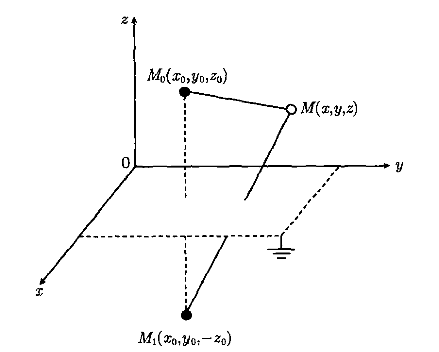
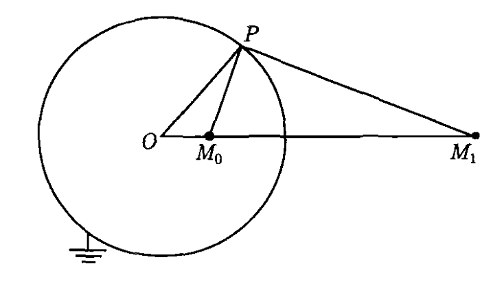
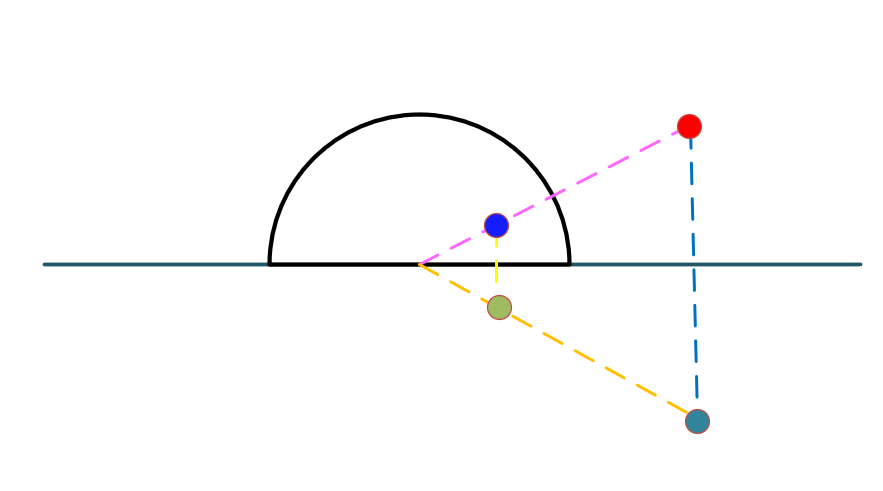

#! https://zhuanlan.zhihu.com/p/626997324
# 格林函数法

<!-- > 知乎不支持多重积分符号，将就着看吧。`iint` 表示二重积分，`iiint` 表示三重积分。 -->

笔记源代码(https://github.com/cjyyx/notes/tree/main/%E5%AD%A6%E4%B9%A0%E7%AC%94%E8%AE%B0/%E6%95%B0%E7%90%86%E6%96%B9%E6%B3%95)

格林函数又称点源函数，代表一个点源在一定的边界条件和（或）初始条件下所产生的场，知道了点源的场就可以用叠加的方法求出任意源所产生的场。

## 格林公式

**第一格林公式**

$$
\iint_{\Sigma} u \nabla v \cdot \mathrm{d} \boldsymbol{S} = \iiint_{T} \nabla \cdot(u \nabla v) \mathrm{d} V = \iiint_{T} u \Delta v \mathrm{~d} V+\iiint_{T} \nabla u \cdot \nabla v \mathrm{~d} V
$$

**第二格林公式**

$$
\iint_{\Sigma}(u \nabla v-v \nabla u) \cdot \mathrm{d} \boldsymbol{S}=\iiint_{T}(u \Delta v-v \Delta u) \mathrm{d} V
$$

也就是

$$
\iint_{\Sigma}\left(u \frac{\partial v}{\partial n}-v \frac{\partial u}{\partial n}\right) \mathrm{d} S=\iiint_{T}(u \Delta v-v \Delta u) \mathrm{d} V
$$

其中 $\partial / \partial n$ 表示沿边界 $\Sigma$ 的外法向求导数。

## 泊松方程的格林函数法

泊松方程

$$
\Delta u=f(\boldsymbol{r}) \quad(\boldsymbol{r} \in T)
$$

边界条件表示为

$$
\alpha \frac{\partial u}{\partial n}+\beta u=\varphi(\boldsymbol{r}) \quad(\boldsymbol{r} \in \Sigma)
$$

$\alpha=0, \beta \neq 0$ 第一边值问题或狄里希利（Dirichlet）问题

$\alpha \neq 0, \beta=0$ 第二边值问题或诺伊曼（Neumann）问题

$\alpha \neq 0, \beta \neq 0$ 第三边值问题或鲁宾（Rubin）问题

若以 $v\left(\boldsymbol{r}, \boldsymbol{r}_{0}\right)$ 表示位于 $\boldsymbol{r}_{0}$ 点的单位强度的正点源在 $\boldsymbol{r}$ 点产生的场，则应有

$$
\Delta v\left(r, r_{0}\right)=\delta\left(r-r_{0}\right)
$$

**泊松方程的基本积分公式**

$$
u\left(\boldsymbol{r}_{0}\right)=\iiint_{T} v\left(\boldsymbol{r}, \boldsymbol{r}_{0}\right) f(\boldsymbol{r}) \mathrm{d} V-\iint_{\Sigma}\left[v\left(\boldsymbol{r}, \boldsymbol{r}_{0}\right) \frac{\partial u(\boldsymbol{r})}{\partial n}-u(\boldsymbol{r}) \frac{\partial v\left(\boldsymbol{r}, \boldsymbol{r}_{0}\right)}{\partial n}\right] \mathrm{d} S
$$

### 三种边值问题

**第一边值问题**

$$
u(\boldsymbol{r})=\varphi(\boldsymbol{r}), \quad v(\boldsymbol{r})=0 \quad(\boldsymbol{r} \in \Sigma)
$$

则

$$
u\left(\boldsymbol{r}_{0}\right)=\iiint_{T} \mathrm{G}\left(\boldsymbol{r}, \boldsymbol{r}_{0}\right) f(\boldsymbol{r}) \mathrm{d} V+\iint_{\Sigma} \varphi(\boldsymbol{r}) \frac{\partial \mathrm{G}\left(\boldsymbol{r}, \boldsymbol{r}_{0}\right)}{\partial n} \mathrm{~d} S
$$

其中，$\mathrm{G}$ 称为泊松方程第一边值问题的格林函数

$$
\Delta \mathrm{G}\left(r, r_{0}\right)=\delta\left(r-r_{0}\right), \quad \mathrm{G}(\boldsymbol{r})=0 \quad(\boldsymbol{r} \in \Sigma)
$$

**第三边值问题**

$$
\alpha \frac{\partial u}{\partial n}+\beta u=\varphi(\boldsymbol{r}), \quad \alpha \frac{\partial v}{\partial n}+\beta v=0 \quad(\boldsymbol{r} \in \Sigma)
$$

则

$$
u\left(\boldsymbol{r}_{0}\right)=\iiint_{T} \mathrm{G}\left(\boldsymbol{r}, \boldsymbol{r}_{0}\right) f(\boldsymbol{r}) \mathrm{d} V-\frac{1}{\alpha} \iint_{\Sigma} \mathrm{G}\left(\boldsymbol{r}, \boldsymbol{r}_{0}\right) \varphi(\boldsymbol{r}) \mathrm{d} S
$$

其中，$\mathrm{G}$ 称为泊松方程第三边值问题的格林函数

$$
\Delta \mathrm{G}\left(r, r_{0}\right)=\delta\left(r-r_{0}\right), \quad \alpha \frac{\partial \mathrm{G}}{\partial n}+\beta \mathrm{G}=0 \quad(\boldsymbol{r} \in \Sigma)
$$

**第二边值问题**

pass

### 格林函数的对称性

$$
\mathrm{G}\left(\boldsymbol{r}_{1}, \boldsymbol{r}_{2}\right)=\mathrm{G}\left(\boldsymbol{r}_{2}, \boldsymbol{r}_{1}\right)
$$

## 无界空间的格林函数

无界域情形通常可得到有限形式的格林函数，即**基本解**。一般边值问题的格林函数可分解为两部分 $\mathrm{G}=\mathrm{G}_{0}+\mathrm{G}_{1}$，其中 $\mathrm{G}_{0}$ 为基本解。

$\mathrm{G}_{0}$ 满足 $\Delta \mathrm{G}_{0}=\delta\left(r-r_{0}\right)$

三维情况，其解为

$$
\mathrm{G}_{0}\left(r, r_{0}\right)=- \frac{1}{4 \pi} \frac{1}{\left|r-r_{0}\right|}
$$

二维情况，其解为

$$
\mathrm{G}_{0}\left(r, r_{0}\right)=-\frac{1}{2 \pi} \ln \frac{1}{\left|r-r_{0}\right|}
$$

$\mathrm{G}_{1}$ 则满足相应的齐次方程(拉普拉斯方程) $\Delta \mathrm{G}_{1}=0$ 及相应的边界条件。而拉普拉斯方程的边值问题的求解是熟知的。

## 用电像法求格林函数

### 无穷大平面的第一边值问题

$$
\left\{\begin{aligned}
& \nabla^{2} \mathrm{G}=\delta\left(r-r_{0}\right) \\
& \left.\mathrm{G}\right|_{z=0}=0
\end{aligned}\right.
$$

其解为

$$
\begin{aligned}
\mathrm{G}\left(\boldsymbol{r}, \boldsymbol{r}_{0}\right)= & -\frac{1}{4 \pi} \frac{1}{\left|\boldsymbol{r}-\boldsymbol{r}_{0}\right|}+\frac{1}{4 \pi} \frac{1}{\left|\boldsymbol{r}-\boldsymbol{r}_{1}\right|} \\
= & -\frac{1}{4 \pi} \frac{1}{\sqrt{\left(x-x_{0}\right)^{2}+\left(y-y_{0}\right)^{2}+\left(z-z_{0}\right)^{2}}} \\
& +\frac{1}{4 \pi} \frac{1}{\sqrt{\left(x-x_{0}\right)^{2}+\left(y-y_{0}\right)^{2}+\left(z+z_{0}\right)^{2}}}
\end{aligned}
$$

$$
\left.\frac{\partial \mathrm{G}\left(\boldsymbol{r}, \boldsymbol{r}_{0}\right)}{\partial n}\right|_{\Sigma} = -\left.\frac{\partial \mathrm{G}}{\partial z}\right|_{z=0}
$$

### 球域以内的第一边值问题

$$
\left\{\begin{aligned}
& \nabla^{2} \mathrm{G}=\delta\left(r-r_{0}\right) \\
& \left.\mathrm{G}\right|_{r=R}=0
\end{aligned}\right.
$$

其解为

$$
\begin{aligned}
\mathrm{G}\left(\boldsymbol{r}, \boldsymbol{r}_{0}\right) & =-\frac{1}{4 \pi} \frac{1}{\left|\boldsymbol{r}-\boldsymbol{r}_{0}\right|}+\frac{R}{r_{0}} \frac{1}{4 \pi} \frac{1}{\left|\boldsymbol{r}-\boldsymbol{r}_{1}\right|} \\
& =-\frac{1}{4 \pi} \frac{1}{\left|\boldsymbol{r}-\boldsymbol{r}_{0}\right|}+\frac{R}{r_{0}} \frac{1}{4 \pi} \frac{1}{\left|\boldsymbol{r}-\dfrac{R^{2}}{r_{0}^{2}} \boldsymbol{r}_{0}\right|}
\end{aligned}
$$

### 无穷大平面上凸起的半球的第一边值问题

像电荷已在图中标出，其解为

$$
G\left(\boldsymbol{r}, \boldsymbol{r}_{0}\right)=-\frac{1}{4 \pi}\frac{1}{\left|\boldsymbol{r}-\boldsymbol{r}_{0}\right|}+\frac{1}{4 \pi}\frac{1}{\left|\boldsymbol{r}-\boldsymbol{r}_{(1)}^{*}\right|}+\frac{1}{4 \pi}\frac{R}{r_{0}}\frac{1}{\left|\boldsymbol{r}-\boldsymbol{r}_{(2)}^{*}\right|}-\frac{1}{4 \pi}\frac{R}{r_{0}}\frac{1}{\left|\boldsymbol{r}-\boldsymbol{r}_{(3)}^{*}\right|}
$$

其中

$$
\left\{\begin{aligned}
\boldsymbol{r}_{0} & =\left(x_{0}, y_{0}, z_{0}\right) \\
\boldsymbol{r}_{(1)}^{*} & =\left(x_{0}, y_{0},-z_{0}\right) \\
\boldsymbol{r}_{(2)}^{*} & =\frac{R^{2}}{r_{0}}\left(x_{0}, y_{0}, z_{0}\right) \\
\boldsymbol{r}_{(3)}^{*} & =\frac{R^{2}}{r_{0}}\left(x_{0}, y_{0},-z_{0}\right)
\end{aligned}\right.
$$

## 含时间的格林函数法

一般强迫振动的定解问题是

$$
u_{t t}-a^{2} \Delta u=f(\boldsymbol{r}, t)
$$

$$
\left.\left(\alpha \frac{\partial u}{\partial n}+\beta u\right)\right|_{\Sigma}=\theta(M, t)
$$

$$
\left.u\right|_{t=0}=\varphi(\boldsymbol{r}),\left.u_{t}\right|_{t=0}=\psi(\boldsymbol{r})
$$

波动问题的格林函数满足定解问题

$$
\mathrm{G}_{t t}-a^{2} \Delta \mathrm{G}=\delta\left(r-r_{0}\right) \delta\left(t-t_{0}\right)
$$

$$
\left.\left(\alpha \frac{\partial \mathrm{G}}{\partial n}+\beta \mathrm{G}\right)\right|_{\Sigma}=0
$$

$$
\left.\mathrm{G}\right|_{t=0}=0,\left.\mathrm{G}_{t}\right|_{t=0}=0
$$

其对称性为

$$
\mathrm{G}\left(\boldsymbol{r}, t ; \boldsymbol{r}_{0} , t_{0}\right)=\mathrm{G}\left(\boldsymbol{r}_{0},-t_{0} ; \boldsymbol{r},-t\right)
$$

波动方程的解为

$$
\begin{aligned}
u(\boldsymbol{r}, t)= & \iiint_{T} \int_{0}^{t} \mathrm{G}\left(\boldsymbol{r}, t ; \boldsymbol{r}_{0}, t_{0}\right) f\left(\boldsymbol{r}_{0}, t_{0}\right) \mathrm{d} V_{0} \mathrm{~d} t_{0} \\
& +a^{2} \iint_{\Sigma} \int_{0}^{t}\left(\mathrm{G} \frac{\partial u}{\partial n_{0}}-u \frac{\partial \mathrm{G}}{\partial n_{0}}\right) \mathrm{d} S_{0} \mathrm{~d} t_{0} \\
& +\left.\iiint_{T}\left[\mathrm{G} u_{t_{0}}-u \mathrm{G}_{t_{0}}\right]\right|_{t_{0}=0} \mathrm{~d} V_{0}
\end{aligned}
$$