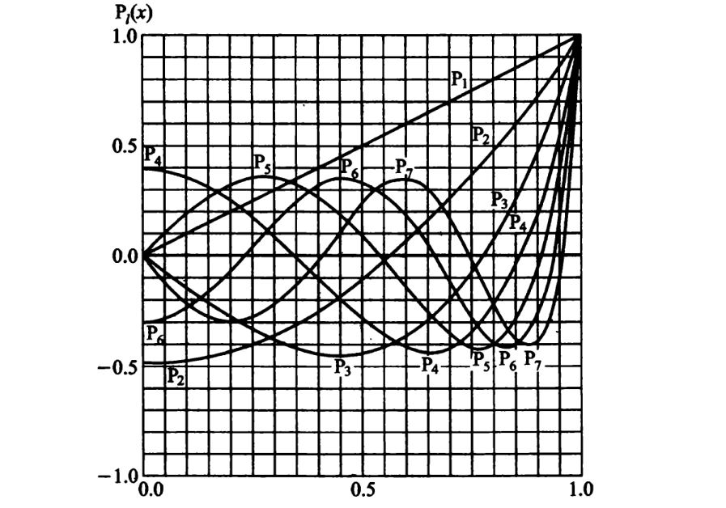
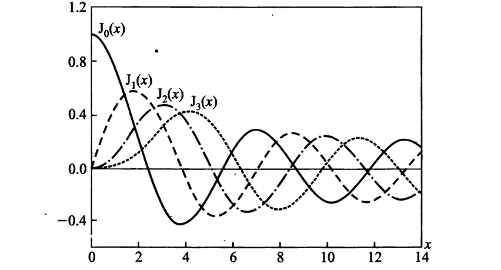
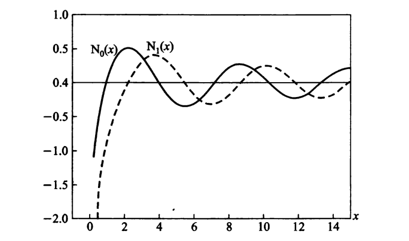
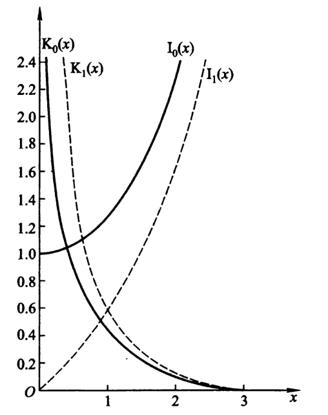

#! https://zhuanlan.zhihu.com/p/626661086
# 数理方法中的特殊函数

笔记源代码(https://github.com/cjyyx/notes/tree/main/%E5%AD%A6%E4%B9%A0%E7%AC%94%E8%AE%B0/%E6%95%B0%E7%90%86%E6%96%B9%E6%B3%95)

## 勒让德多项式

### 表达式

在 $x_{0}=0$ 的邻域上求解 $l$ 阶勒让德方程

$$
\left(1-x^{2}\right) y^{\prime \prime}-2 x y^{\prime}+l(l+1) y=0
$$

其解为

$$
y(x)=a_{0} y_{0}(x)+a_{1} y_{1}(x)
$$

$$
\begin{aligned}
y_{0} & (x)= 1+\frac{(-l)(l+1)}{2 !} x^{2}+\frac{(2-l)(-l)(l+1)(l+3)}{4 !} x^{4}+\cdots \\
& +\frac{(2 k-2-l)(2 k-4-l) \cdots(-l)(l+1)(l+3) \cdots(l+2 k-1)}{(2 k) !} x^{2 k}+\cdots
\end{aligned}
$$

$$
\begin{aligned}
y_{1} & (x)=x+\frac{(1-l)(l+2)}{3 !} x^{3}+\frac{(3-l)(1-l)(l+2)(l+4)}{5 !} x^{5}+\cdots \\
& +\frac{(2 k-1-l)(2 k-3-l) \cdots(1-l)(l+2)(l+4) \cdots(l+2 k)}{(2 k+1) !} x^{2 k+1}+\cdots
\end{aligned}
$$

勒让德方程在  $x= \pm 1$  往往有自然边界条件 “解在  $x= \pm 1$  保持有限”。解退化得到的多项式，将它们分别乘以适当的常数，称为  $l$  阶勒让德多项式，记作  $P_{l}(x)$。

$$
\mathrm{P}_{l}(x)=\sum_{k=0}^{[l / 2]}(-1)^{k} \dfrac{(2 l-2 k) !}{2^{l} k !(l-k) !(l-2 k) !} x^{l-2 k}
$$

其中 $[l / 2]$ 表示不超过 $l/2$ 的最大整数。

微分表示：罗德里格斯公式

$$
\mathrm{P}_{l}(x)=\dfrac{1}{2^{l} l !} \dfrac{\mathrm{d}^{l}}{\mathrm{~d} x^{l}}\left(x^{2}-1\right)^{l}
$$

积分表示：施列夫利积分

$$
\mathrm{P}_{l}(x)=\dfrac{1}{2 \pi \mathrm{i}} \dfrac{1}{2^{l}} \oint_{C} \dfrac{\left(z^{2}-1\right)^{l}}{(z-x)^{l+1}} \mathrm{~d} z
$$

$C$ 为 $z$ 平面上围绕 $z=x$ 点的任一闭合回路。

拉普拉斯积分

$$
\mathrm{P}_{l}(x)=\dfrac{1}{\pi} \int_{0}^{\pi} [\cos \theta+\mathrm{i} \sin \theta \cos \psi]^{l} \mathrm{~d} \psi
$$

母函数

$$
\dfrac{1}{\sqrt{R^{2}-2 r R \cos \theta+r^{2}}}=\left\{\begin{array}{ll}
\sum\limits_{l=0}^{\infty} \dfrac{1}{R^{l+1}} r^{l} \mathrm{P}_{l}(\cos \theta) & (r<R) \\
\sum\limits_{l=0}^{\infty} R^{l} \dfrac{1}{r^{l+1}} \mathrm{P}_{l}(\cos \theta) & (r>R)
\end{array}\right.
$$

前几个勒让德多项式

$$
\begin{aligned}
P_{0}(x) & = 1 \\
P_{1}(x) & = x=\cos \theta \\
P_{2}(x) & = \dfrac{1}{2}\left(3 x^{2}-1\right)=\dfrac{1}{4}(3 \cos 2 \theta+1) \\
P_{3}(x) & = \dfrac{1}{2}\left(5 x^{3}-3 x\right)=\dfrac{1}{8}(5 \cos 3 \theta+3 \cos \theta) \\
P_{4}(x) & = \dfrac{1}{8}\left(35 x^{4}-30 x^{2}+3\right)=\dfrac{1}{64}(35 \cos 4 \theta+20 \cos 2 \theta+9) \\
P_{5}(x) & = \dfrac{1}{8}\left(63 x^{5}-70 x^{3}+15 x\right)=\dfrac{1}{128}(63 \cos 5 \theta+35 \cos 3 \theta+30 \cos \theta) \\
P_{6}(x) & = \dfrac{1}{16}\left(231 x^{6}-315 x^{4}+105 x^{2}-5\right)=\dfrac{1}{512}(231 \cos 6 \theta+126 \cos 4 \theta+105 \cos 2 \theta+50)
\end{aligned}
$$

### 性质

$$
\left|\mathrm{P}_{l}(x)\right| \leqslant 1, \quad(-1 \leqslant x \leqslant 1)
$$

$$
\mathrm{P}_{l}(1)=1
$$

$$
P_{2 n+1}(0)=0
$$

$$
P_{2 n}(0)=(-1)^{n} \dfrac{(2 n-1) ! !}{(2 n) ! !}
$$

其中有记号

$$
\boxed{\begin{aligned}
(2 n) ! ! & =(2 n)(2 n-2)(2 n-4) \cdots 6 \cdot 4 \cdot 2 \\
(2 n-1) ! ! & =(2 n-1)(2 n-3)(2 n-5) \cdots 5 \cdot 3 \cdot 1 \\
(2 n) ! & =(2 n) ! !(2 n-1) ! !
\end{aligned}}
$$

奇偶性
- $l=2n+1$，奇函数
- $l=2n$，偶函数

递推公式

$$
(k+1) \mathrm{P}_{k+1}(x)-(2 k+1) x \mathrm{P}_{k}(x)+k \mathrm{P}_{k-1}(x)=0 \quad (k \geqslant 1)
$$

可以用来转化 $x \mathrm{P}_{k}(x)$。

另外的递推式

$$
\mathrm{P}_{k}(x)=\mathrm{P}_{k+1}^{\prime}(x)-2 x \mathrm{P}_{k}^{\prime}(x)+\mathrm{P}_{k-1}^{\prime}(x) \quad(k \geqslant 1)
$$

$$
(2 k+1) \mathrm{P}_{k}(x)=\mathrm{P}_{k+1}^{\prime}(x)-\mathrm{P}_{k-1}^{\prime}(x) \quad(k \geqslant 1)
$$

$$
\mathrm{P}_{k+1}^{\prime}(x)=(k+1) \mathrm{P}_{k}(x)+x \mathrm{P}_{k}^{\prime}(x)
$$

$$
k \mathrm{P}_{k}(x)=x \mathrm{P}_{k}^{\prime}(x)-\mathrm{P}_{k-1}^{\prime}(x) \quad(k \geqslant 1)
$$

$$
\left(x^{2}-1\right) \mathrm{P}_{k}^{\prime}(x)=k x \mathrm{P}_{k}(x)-k \mathrm{P}_{k-1}(x) \quad(k \geqslant 1)
$$

勒让德多项式的正交关系

$$
\int_{-1}^{+1} \mathrm{P}_{k}(x) \mathrm{P}_{l}(x) \mathrm{d} x=0 \quad(k \neq l)
$$

$$
\int_{0}^{\pi} \mathrm{P}_{k}(\cos \theta) \mathrm{P}_{l}(\cos \theta) \sin \theta \mathrm{d} \theta=0 \quad(k \neq l)
$$

勒让德多项式的模

$$
N_{l}^{2}=\int_{-1}^{+1}\left[\mathrm{P}_{l}(x)\right]^{2} \mathrm{~d} x =\dfrac{2}{2 l+1}
$$

$$
N_{l}=\sqrt{\dfrac{2}{2 l+1}} \quad(l=0,1,2, \cdots)
$$

常见的积分，可以用分部积分或递推关系求

$$
\int_{-1}^{1} \mathrm{P}_{l}(x) \mathrm{d} x=0 \quad (l \geqslant 1)
$$

$$
\int_{0}^{1} x \mathrm{P}_{2 n}(x) \mathrm{d} x = (-1)^{n+1} \dfrac{1}{(2 n-1)} \cdot \dfrac{(2 n-1) ! !}{(2 n+2) ! !} \quad(n=1,2, \cdots)
$$

## 连带勒让德函数

### 表达式

连带勒让德方程

$$
\left(1-x^{2}\right) \dfrac{\mathrm{d}^{2} \Theta}{\mathrm{d} x^{2}}-2 x \dfrac{\mathrm{d} \Theta}{\mathrm{d} x}+\left[l(l+1)-\dfrac{m^{2}}{1-x^{2}}\right] \Theta=0 \quad(x=\cos \theta)
$$

- $m=0,1,2,\cdots$
- $l$ 为常数，待定

解是连带勒让德函数 $\mathrm{P}_{l}^{m}(x)$

$$
\mathrm{P}_{l}^{m}(x)=\left(1-x^{2}\right)^{\frac{m}{2}} \mathrm{P}_{l}^{[m]}(x) \quad (m=0,1,2, \cdots,l)
$$

微分表示，罗德里格斯公式
$$
\mathrm{P}_{l}^{m}(x)=\dfrac{\left(1-x^{2}\right)^{\frac{m}{2}}}{2^{l} l !} \dfrac{\mathrm{d}^{l+m}}{\mathrm{~d} x^{l+m}}\left(x^{2}-1\right)^{l}
$$

积分表示，拉普拉斯积分
$$
\mathrm{P}_{l}^{m}(x)=\dfrac{\mathrm{i}^{m}}{2 \pi} \dfrac{(l+m) !}{l !} \int_{-\pi}^{\pi} \mathrm{e}^{-\mathrm{i} m \psi}[\cos \theta+\mathrm{i} \sin \theta \cos \psi]^{l} \mathrm{~d} \psi
$$

函数表

$$
\begin{aligned}
P_{1}^{1}(x) & =\left(1-x^{2}\right)^{\frac{1}{2}}=\sin \theta \\
P_{2}^{1}(x) & =3\left(1-x^{2}\right)^{\frac{1}{2}} x=\frac{3}{2} \sin 2 \theta=3 \sin \theta \cos \theta \\
P_{2}^{2}(x) & =3\left(1-x^{2}\right)=\frac{3}{2}(1-\cos 2 \theta)=3 \sin ^{2} \theta \\
P_{3}^{1}(x) & =\frac{3}{2}\left(1-x^{2}\right)^{\frac{1}{2}}\left(5 x^{2}-1\right)=\frac{3}{8}(\sin \theta+5 \sin 3 \theta)=6 \sin \theta-\frac{15}{2} \sin ^{3} \theta \\
P_{3}^{2}(x) & =15\left(1-x^{2}\right) x=\frac{15}{4}(\cos \theta-\cos 3 \theta)=15 \sin ^{2} \theta \cos \theta \\
P_{3}^{3}(x) & =15\left(1-x^{2}\right)^{\frac{3}{2}}=\frac{15}{4}(3 \sin \theta-\sin 3 \theta)=15 \sin ^{3} \theta \\
P_{4}^{1}(x) & =\frac{5}{2}\left(1-x^{2}\right)^{\frac{1}{2}}\left(7 x^{3}-3 x\right) =\frac{5}{16}(2 \sin 2 \theta+7 \sin 4 \theta) =10 \sin \theta \cos \theta-\frac{15}{2} \sin ^{3} \theta \cos \theta \\
P_{4}^{2}(x) & =\frac{15}{2}\left(1-x^{2}\right)\left(7 x^{2}-1\right) =\frac{15}{16}(3+4 \cos 2 \theta-7 \cos 4 \theta)=45 \sin ^{2} \theta-\frac{105}{2} \sin ^{4} \theta \\
P_{4}^{3}(x) & =105\left(1-x^{2}\right)^{\frac{3}{2}} x=\frac{105}{8}(2 \sin 2 \theta-\sin 4 \theta)=105 \sin ^{3} \theta \cos \theta \\
P_{4}^{4}(x) & =105\left(1-x^{2}\right)^{2}=\frac{105}{8}(3-4 \cos 2 \theta+\cos 4 \theta)=105 \sin ^{4} \theta
\end{aligned}
$$

### 性质

当 $m>l$ 时，$P_{l}^{m}(x) \equiv 0$。

当 $m<0$ 时，有

$$
\mathrm{P}_{l}^{-m}(x)=\dfrac{(l-m) !}{(l+m) !} \mathrm{P}_{l}^{m}(x)
$$

奇偶性
- $l-m$ 偶数，偶函数
- $l-m$ 奇数，奇函数

递推公式

$$
(2 k+1) x \mathrm{P}_{k}^{m}(x)=(k+m) \mathrm{P}_{k-1}^{m}(x)+(k-m+1) \mathrm{P}_{k+1}^{m}(x)
$$

$$
(2 k+1)\left(1-x^{2}\right)^{1 / 2} \mathrm{P}_{k}^{m}(x)=(k+m)(k+m-1) \mathrm{P}_{k-1}^{m-1}(x)- (k-m+2)(k-m+1) \mathrm{P}_{k+1}^{m-1}(x) \quad(k \geqslant 1)
$$

$$
(2 k+1)\left(1-x^{2}\right) \dfrac{\mathrm{dP}_{k}^{m}(x)}{\mathrm{d} x}= (k+1)(k+m) \mathrm{P}_{k-1}^{m}(x)-k(k-m+1) \mathrm{P}_{k+1}^{m}(x) \quad(k \geqslant 1)
$$

正交关系

$$
\int_{-1}^{+1} \mathrm{P}_{k}^{m}(x) \mathrm{P}_{l}^{m}(x) \mathrm{d} x=0 \quad(k \neq l)
$$

模

$$
\left(N_{l}^{m}\right)^{2}=\int_{-1}^{+1}\left[\mathrm{P}_{l}^{m}(x)\right]^{2} \mathrm{~d} x= \dfrac{(l+m) ! 2}{(l-m) !(2 l+1)}
$$

$$
N_{l}^{m}=\sqrt{\dfrac{(l+m) ! 2}{(l-m) !(2 l+1)}}
$$

## 三类柱函数

### 表达式

非整数阶贝塞尔方程

在 $x_{0}=0$ 的邻域上的 $\nu$ 阶贝塞尔方程

$$
x^{2} y^{\prime \prime}+x y^{\prime}+\left(x^{2}-\nu^{2}\right) y=0 \quad ( \nu \notin Z)
$$

定义 $\nu$ 阶**贝塞尔函数**

$$
\mathrm{J}_{\nu}(x)=\sum_{k=0}^{\infty} \frac{(-1)^{k}}{k ! \Gamma(\nu+k+1)}\left(\frac{x}{2}\right)^{\nu+2 k}
$$

和 $-\nu$ 阶贝塞尔函数

$$
\mathrm{J}_{-\nu}(x)=\sum_{k=0}^{\infty} \frac{(-1)^{k}}{k ! \Gamma(-\nu+k+1)}\left(\frac{x}{2}\right)^{-\nu+2 k}
$$

则 $\nu$ 阶贝塞尔方程的通解

$$
y(x)=C_{1} \mathrm{~J}_{\nu}(x)+C_{2} \mathrm{~J}_{-\nu}(x)
$$

可定义 $\nu$ 阶**诺伊曼函数**

$$
\mathrm{N}_{\nu}(x)=\frac{\mathrm{J}_{\nu}(x) \cos \nu \pi-\mathrm{J}_{-\nu}(x)}{\sin \nu \pi}
$$

则 $\nu$ 阶贝塞尔方程的通解也可为

$$
y(x)=C_{1} \mathrm{~J}_{\nu}(x)+C_{2} \mathrm{~N}_{\nu}(x)
$$

整数 $m$ 阶贝塞尔方程

通解为

$$
y(x)=C_{1} \mathrm{~J}_{m}(x)+C_{2} \mathrm{~N}_{m}(x)
$$

任意阶贝塞尔方程

取线性独立的

$$
\left\{\begin{array}{l}
\mathrm{H}_{\nu}^{(1)}(x)=\mathrm{J}_{\nu}(x)+\mathrm{iN}_{\nu}(x) \\
\mathrm{H}_{\nu}^{(2)}(x)=\mathrm{J}_{\nu}(x)-\mathrm{iN}_{\nu}(x)
\end{array}\right.
$$

并称之为**第一种和第二种汉克尔函数**。$\nu$ 阶(包括整数)贝塞尔方程的通解可表为

$$
y(x)=C_{1} \mathrm{H}_{\nu}^{(1)}(x)+C_{2} \mathrm{H}_{\nu}^{(2)}(x)
$$

贝塞尔函数、诺伊曼函数、汉克尔函数又分别称为第一类、第二类、第三类柱函数。

### 性质

当 $x \rightarrow 0$，有

$$
\begin{aligned}
& \mathrm{J}_{0}(x) \rightarrow 1, \quad \mathrm{~J}_{\nu}(x) \rightarrow 0, \quad \mathrm{~J}_{-\nu}(x) \rightarrow \infty, \\
& \mathrm{N}_{0}(x) \rightarrow-\infty, \quad \mathrm{N}_{\nu}(x) \rightarrow \pm \infty \\
& (\nu \neq 0)
\end{aligned}
$$

当 $x \rightarrow \infty$，有

$$
\begin{aligned}
\mathrm{H}_{\nu}^{(1)}(x) & \sim \sqrt{\frac{2}{\pi x}} \mathrm{e}^{\mathrm{i}(x-\nu \pi / 2-\pi / 4)} \\
\mathrm{H}_{\nu}^{(2)}(x) & \sim \sqrt{\frac{2}{\pi x}} \mathrm{e}^{-\mathrm{i}(x-\nu \pi / 2-\pi / 4)} \\
\mathrm{J}_{\nu}(x) & \sim \sqrt{\frac{2}{\pi x}} \cos (x-\nu \pi / 2-\pi / 4) \\
\mathrm{N}_{\nu}(x) & \sim \sqrt{\frac{2}{\pi x}} \sin (x-\nu \pi / 2-\pi / 4)
\end{aligned}
$$

递推公式

$$
\frac{\mathrm{d}}{\mathrm{d} x}\left[\frac{\mathrm{J}_{\nu}(x)}{x^{\nu}}\right]=-\frac{\mathrm{J}_{\nu+1}(x)}{x^{\nu}}
$$

$$
\frac{\mathrm{d}}{\mathrm{d} x}\left[x^{\nu} \mathrm{J}_{\nu}(x)\right]=x^{\nu} \mathrm{J}_{\nu-1}(x)
$$

如用$\mathrm{Z}_{\nu}(x)$代表$\nu$阶的第一或第二或第三类柱函数，总是有

$$
\frac{\mathrm{d}}{\mathrm{d} x}\left[\mathrm{Z}_{\nu}(x) / x^{\nu}\right] =-\mathrm{Z}_{\nu+1}(x) / x^{\nu}
$$

$$
\frac{\mathrm{d}}{\mathrm{d} x}\left[x^{\nu} \mathrm{Z}_{\nu}(x)\right] =x^{\nu} \mathrm{Z}_{\nu-1}(x)
$$

可改写为

$$
\mathrm{Z}_{\nu}^{\prime}(x)-\nu \mathrm{Z}_{\nu}(x) / x=-\mathrm{Z}_{\nu+1}(x)
$$

$$
\mathrm{Z}_{\nu}^{\prime}(x)+\nu \mathrm{Z}_{\nu}(x) / x=\mathrm{Z}_{\nu-1}(x)
$$

可得

$$
\mathrm{Z}_{\nu-1}(x)-\mathrm{Z}_{\nu+1}(x)=2 \mathrm{Z}_{\nu}^{\prime}(x)
$$

$$
\mathrm{Z}_{\nu+1}(x)-2 \nu \mathrm{Z}_{\nu}(x) / x+\mathrm{Z}_{\nu-1}(x)=0
$$

零点的一些结论

1. 正负成对，绝对值相等 $\mathrm{J}_{m}(-x)=(-1)^{m} \mathrm{~J}_{m}(x)$
2. 无穷多个零点
3. $\mathrm{J}_{m}(x)$ 和 $\mathrm{J}_{m+1}(x)$ 的零点两两相间
4. $\mathrm{J}_{m}(x)$ 绝对值最小的零点比 $\mathrm{J}_{m+1}(x)$ 的更接近于0

$$\mathrm{J}_{0}^{\prime}(x)=-\mathrm{J}_{1}(x)$$

$$\mathrm{J}_{m}^{\prime}(x)=\frac{1}{2}\left[\mathrm{J}_{m-1}(x)-\mathrm{J}_{m+1}(x)\right]$$

诺伊曼函数

正交性

$$
\int_{0}^{\rho_{0}} \mathrm{~J}_{m}\left(\sqrt{\mu_{n}} \rho \right)\mathrm{J}_{m}\left(\sqrt{\mu_{l} }\rho \right) \rho \mathrm{~d} \rho=0 \quad(n \neq l)
$$

模

$$
\begin{aligned}
\left[N_{n}^{(m)}\right]^{2} & =\int_{0}^{\rho_{0}}\left[\mathrm{~J}_{m}\left(\sqrt{\mu_{n}^{(m)}} \rho\right)\right]^{2} \rho \mathrm{~d} \rho \\
& = \frac{1}{2}\left(\rho_{0}^{2}-\frac{m^{2}}{\mu_{n}^{(m)}}\right)\left[\mathrm{~J}_{m}\left(\sqrt{\mu_{n}^{(m)}} \rho_{0}\right)\right]^{2}+\frac{1}{2} \rho_{0}^{2}\left[\mathrm{~J}_{m}^{\prime}\left(\sqrt{\mu_{n}^{(m)}} \rho_{0}\right)\right]^{2}
\end{aligned}
$$

常见积分

$$
\begin{aligned}
& \int x^{-m} \mathrm{~J}_{m+1}(x) \mathrm{d} x=-x^{-m} \mathrm{~J}_{m}(x)+C \\
& \int \mathrm{J}_{1}(x) \mathrm{d} x=-\mathrm{J}_{0}(x)+C \\
& \int x^{m} \mathrm{~J}_{m-1}(x) \mathrm{d} x=x^{m} \mathrm{~J}_{m}(x)+C
\end{aligned}
$$

## 虚宗量柱函数

### 表达式

非整数阶虚宗量贝塞尔方程

在 $x_{0}=0$ 的邻域上的 $\nu$ 阶贝塞尔方程

$$
x^{2} y^{\prime \prime}+x y^{\prime}-\left(x^{2}+\nu^{2}\right) y=0 \quad ( \nu \notin Z)
$$

定义**虚宗量贝塞尔函数**

$$
\mathrm{I}_{\nu}(x)=\mathrm{i}^{-\nu} \mathrm{J}_{\nu}(\mathrm{i} x) =\sum_{k=0}^{\infty} \frac{1}{k ! \Gamma(\nu+k+1)}\left(\frac{x}{2}\right)^{\nu+2 k}
$$

$$
\mathrm{I}_{-\nu}(x) =\mathrm{i}^{\nu} \mathrm{J}_{-\nu}(\mathrm{i} x)=\sum_{k=0}^{\infty} \frac{1}{k ! \Gamma(-\nu+k+1)}\left(\frac{x}{2}\right)^{-\nu+2 k}
$$

则 $\nu$ 阶贝塞尔函数的通解为

$$
y(x)=C_{1} \mathrm{I}_{\nu}(x)+C_{2} \mathrm{I}_{-\nu}(x)
$$

整数 $m$ 阶虚宗量贝塞尔方程

定义**虚宗量汉克尔函数**

$$
\mathrm{K}_{\nu}(x)=\frac{\pi}{2} \mathrm{i} \mathrm{e}^{\mathrm{i} \frac{\pi}{2} \nu} \mathrm{H}_{\nu}^{(1)}(\mathrm{i} x)=\frac{\pi}{2} \frac{\mathrm{I}_{-\nu}(x)-\mathrm{I}_{\nu}(x)}{\sin \nu \pi}
$$

则整数 $m$ 阶虚宗量贝塞尔方程通解为

$$
y(x)=C_{1} \mathrm{I}_{m}(x)+C_{2} \mathrm{~K}_{m}(x)
$$

该通解也适用于非整数阶，即适用于任意阶。

### 性质

### 函数行为

$x \rightarrow 0$ 时，$\mathrm{I}_{0}(0)=1$，$\mathrm{I}_{m}(0)=0 (m \neq 0)$，$\mathrm{K}_{m}(x) \rightarrow \infty$。

$x \rightarrow \infty$ 时

$$
\mathrm{I}_{m}(x)=\frac{1}{2 \sqrt{x}} e^{x}
$$

$$
\mathrm{K}_{m}(x)=\frac{\pi}{2 \sqrt{x}} e^{-x}
$$

递推公式

$$
\frac{\mathrm{d}}{\mathrm{d} x}\left[\frac{\mathrm{I}_{\nu}(x)}{x^{\nu}}\right]=\frac{\mathrm{I}_{\nu+1}(x)}{x^{\nu}} ;\quad \frac{\mathrm{d}}{\mathrm{d} x}\left[x^{\nu} \mathrm{I}_{\nu}(x)\right]=x^{\nu} \mathrm{I}_{\nu-1}(x)
$$

$$
\begin{array}{l}
\mathrm{I}_{v-1}(x)-\mathrm{I}_{v+1}(x)=\frac{2 v}{x} \mathrm{I}_{v}(x) \\
\mathrm{I}_{v-1}(x)+\mathrm{I}_{v+1}(x)=2 \mathrm{I}_{v}^{\prime}(x) \\
\mathrm{K}_{v-1}(x)-\mathrm{K}_{v+1}(x)=-\frac{2 v}{x} \mathrm{~K}_{v}(x) \\
\mathrm{K}_{v-1}(x)+\mathrm{K}_{v+1}(x)=-2 \mathrm{~K}_{v}^{\prime}(x)
\end{array}
$$

