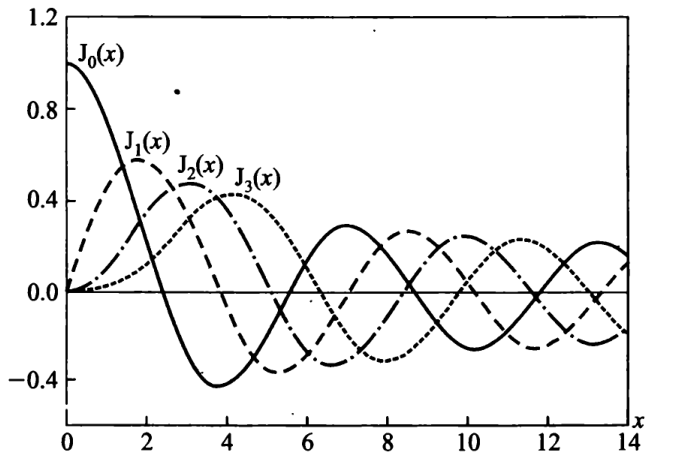
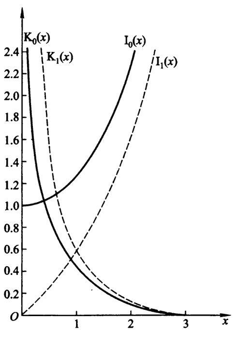
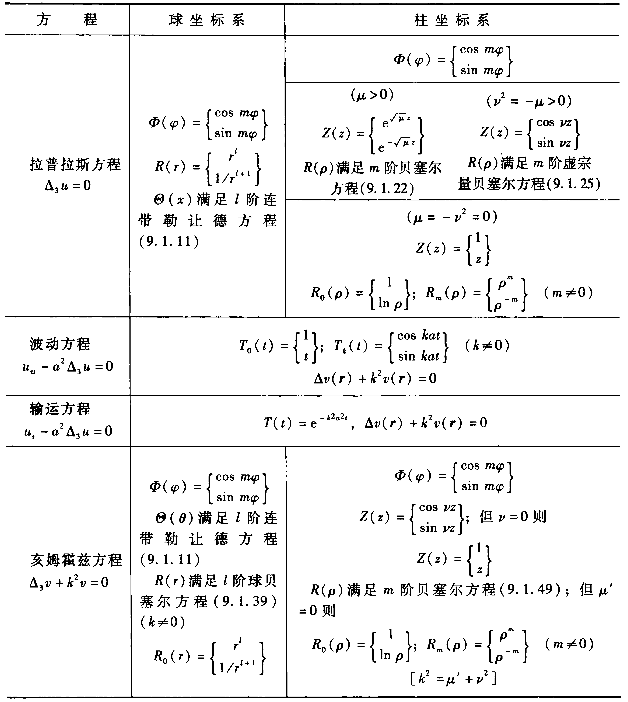

#! https://zhuanlan.zhihu.com/p/626812353
# 球坐标系和柱坐标系下的分离变数法

笔记源代码(https://github.com/cjyyx/notes/tree/main/%E5%AD%A6%E4%B9%A0%E7%AC%94%E8%AE%B0/%E6%95%B0%E7%90%86%E6%96%B9%E6%B3%95)

## 拉普拉斯方程

$$
\Delta u=0
$$

### 球坐标

球坐标系下

$$
\frac{1}{r^{2}} \frac{\partial}{\partial r}\left(r^{2} \frac{\partial u}{\partial r}\right)+\frac{1}{r^{2} \sin \theta} \frac{\partial}{\partial \theta}\left(\sin \theta \frac{\partial u}{\partial \theta}\right)+\frac{1}{r^{2} \sin ^{2} \theta} \frac{\partial^{2} u}{\partial \varphi^{2}}=0
$$

分离变数

$$
u(r, \theta, \varphi)=R(r) \mathrm{Y}(\theta, \varphi)
$$

分解为

$$
\frac{\mathrm{d}}{\mathrm{d} r}\left(r^{2} \frac{\mathrm{d} R}{\mathrm{~d} r}\right)-l(l+1) R=0 \tag{a}
$$

$$
\frac{1}{\sin \theta} \frac{\partial}{\partial \theta}\left(\sin \theta \frac{\partial \mathrm{Y}}{\partial \theta}\right)+\frac{1}{\sin ^{2} \theta} \frac{\partial^{2} \mathrm{Y}}{\partial \varphi^{2}}+l(l+1) \mathrm{Y}=0 \tag{b}
$$

常微分方程 (a) 解为

$$
R(r)=C r^{l}+D \frac{1}{r^{l+1}}
$$

偏微分方程 (b) 叫**球函数方程**。进一步分离变数

$$
\mathrm{Y}(\theta, \varphi)=\Theta(\theta) \Phi(\varphi)
$$

得
$$
\Phi^{\prime \prime}+\lambda \Phi=0 \tag{a}
$$

$$
\sin \theta \frac{\mathrm{d}}{\mathrm{d} \theta}\left(\sin \theta \frac{\mathrm{d} \Theta}{\mathrm{d} \theta}\right)+\left[l(l+1) \sin ^{2} \theta-\lambda\right] \Theta=0 \tag{b}
$$

常微分方程 (a) 有自然周期条件 $\Phi(\varphi+2 \pi)=\Phi(\varphi)$，构成本征值问题。记 $\lambda =m^{2}$。
- 本征值 $\lambda =m^{2} \quad(m=0,1,2,3, \cdots)$
- 本征函数 $A \cos m \varphi+B \sin m \varphi$

对常微分方程 (b) 用代换 $\theta=\arccos x$，得

$$
\left(1-x^{2}\right) \frac{\mathrm{d}^{2} \Theta}{\mathrm{d} x^{2}}-2 x \frac{\mathrm{d} \Theta}{\mathrm{d} x}+\left[l(l+1)-\frac{m^{2}}{1-x^{2}}\right] \Theta=0
$$

上面方程为 $l$ 阶连带勒让德方程，与自然边界条件，即解在 $x=\pm 1$ 有限，构成本征值问题
- 本征值 $l(l+1)$
- 本征函数 $\mathrm{P}_{l}^{m}(x)$

结合连带勒让德函数的性质，球函数方程分离变数解的形式是

$$
\mathrm{Y}_{l}^{m}(\theta, \varphi)=\mathrm{P}_{l}^{m}(\cos \theta)\left\{\begin{array}{l}
\sin m \varphi \\
\cos m \varphi
\end{array}\right\} \quad\left(\begin{array}{l}
m=0,1,2, \cdots, l \\
l=0,1,2,3, \cdots
\end{array}\right)
$$

记号 $\{\}$ 表示其中列举的函数是线性独立的，可任取其一。$l$ 叫作球函数的阶。

解可写为

$$
\begin{aligned}
u(r, \theta, \varphi)= & \sum_{m=0}^{\infty} \sum_{l=m}^{\infty} r^{l}\left[A_{l}^{m} \cos m \varphi+B_{l}^{m} \sin m \varphi\right] \mathrm{P}_{l}^{m}(\cos \theta)+ \\
& \sum_{m=0}^{\infty} \sum_{l=m}^{\infty} \frac{1}{r^{l+1}}\left[C_{l}^{m} \cos m \varphi+D_{l}^{m} \sin m \varphi\right] \mathrm{P}_{l}^{m}(\cos \theta)
\end{aligned}
$$

利用球函数进行广义傅里叶展开，会用到如下性质

勒让德多项式的正交关系

$$
\int_{-1}^{+1} \mathrm{P}_{k}(x) \mathrm{P}_{l}(x) \mathrm{d} x=0 \quad(k \neq l)
$$

$$
\int_{0}^{\pi} \mathrm{P}_{k}(\cos \theta) \mathrm{P}_{l}(\cos \theta) \sin \theta \mathrm{d} \theta=0 \quad(k \neq l)
$$

勒让德多项式的模

$$
N_{l}^{2}=\int_{-1}^{+1}\left[\mathrm{P}_{l}(x)\right]^{2} \mathrm{~d} x =\dfrac{2}{2 l+1}
$$

$$
N_{l}=\sqrt{\dfrac{2}{2 l+1}} \quad(l=0,1,2, \cdots)
$$

连带勒让德函数的正交关系

$$
\int_{-1}^{+1} \mathrm{P}_{k}^{m}(x) \mathrm{P}_{l}^{m}(x) \mathrm{d} x=0 \quad(k \neq l)
$$

$$
\int_{0}^{\pi} \mathrm{P}_{k}^{m}(\cos \theta) \mathrm{P}_{l}^{m}(\cos \theta) \sin \theta \mathrm{d} \theta=0 \quad(k \neq l)
$$

连带勒让德函数的模

$$
\left(N_{l}^{m}\right)^{2}=\int_{-1}^{+1}\left[\mathrm{P}_{l}^{m}(x)\right]^{2} \mathrm{~d} x= \dfrac{(l+m) ! 2}{(l-m) !(2 l+1)}
$$

$$
N_{l}^{m}=\sqrt{\dfrac{(l+m) ! 2}{(l-m) !(2 l+1)}}
$$

球函数的正交关系

( 球面$S$，$0 \leqslant \theta \leqslant \pi, 0 \leqslant \varphi \leqslant 2 \pi$ )

$$
\iint_{S} Y_{l}^{m}(\theta, \varphi) Y_{k}^{n}(\theta, \varphi) \sin \theta \mathrm{d} \theta \mathrm{d} \varphi=0 \quad(m \neq n \text { 或 } l \neq k)
$$

球函数的模

$$
\left(N_{l}^{m}\right)^{2}=\iint_{S} \left[Y_{l}^{m}(\theta, \varphi)\right]^{2} \sin \theta \mathrm{d} \theta \mathrm{d} \varphi =\dfrac{2 \pi \delta_{m}}{2 l+1} \dfrac{(l+m) !}{(l-m) !}
$$

$$
N_{l}^{m}=\sqrt{\dfrac{2 \pi \delta_{m}}{2 l+1} \dfrac{(l+m) !}{(l-m) !}}
$$

其中

$$
\delta_{m}=\left\{\begin{array}{ll}
2 & (m=0) \\
1 & (m=1,2,3, \cdots)
\end{array}\right.
$$

### 柱坐标

$$
\frac{1}{\rho} \frac{\partial}{\partial \rho}\left(\rho \frac{\partial u}{\partial \rho}\right)+\frac{1}{\rho^{2}} \frac{\partial^{2} u}{\partial \varphi^{2}}+\frac{\partial^{2} u}{\partial z^{2}}=0 
$$

分离变数

$$
u(\rho, \varphi, z)=R(\rho) \Phi(\varphi) Z(z)
$$

得

$$
\Phi^{\prime \prime}+\lambda \Phi=0 \tag{a}
$$

$$
Z^{\prime \prime}-\mu Z=0 \tag{b}
$$

$$
\frac{\mathrm{d}^{2} R}{\mathrm{~d} \rho^{2}}+\frac{1}{\rho} \frac{\mathrm{d} R}{\mathrm{~d} \rho}+\left(\mu-\frac{m^{2}}{\rho^{2}}\right) R=0 \tag{c}
$$

其中常微分方程 (a) 有自然周期条件 $\Phi(\varphi+2 \pi)=\Phi(\varphi)$，构成本征值问题。记 $\lambda =m^{2}$。
- 本征值 $\lambda =m^{2} \quad(m=0,1,2,3, \cdots)$
- 本征函数 $A \cos m \varphi+B \sin m \varphi$

圆柱区域上下底面齐次边界条件或圆柱侧面齐次边界条件，分别跟常微分方程 (b) 和常微分方程 (c) 构成本征值问题。此外需要根据具体情况决定 $\mu$ 的取值。

(1) 实心圆柱内部的问题，柱侧有齐次的边界条件

因为 $\mu<0$ 引至虚宗量贝塞尔方程，其解不适合作为本征函数，所以 $\mu \geqslant 0$。

当 $\mu =0$ 时

$$
Z(z)=C+D z
$$

$$
R(\rho)=\left\{\begin{array}{ll}
E+F \ln \rho & (m=0), \\
E \rho^{m}+F / \rho^{m} & (m=1,2,3, \cdots)
\end{array}\right.
$$

当 $\mu >0$ 时

$$
Z(z)=C \mathrm{e}^{\sqrt{\mu} z}+D \mathrm{e}^{-\sqrt{\mu} z}
$$

作代换 $x=\sqrt{\mu} \rho$，常微分方程 (c) 化为

$$
x^{2} \frac{\mathrm{d}^{2} R}{\mathrm{~d} x^{2}}+x \frac{\mathrm{d} R}{\mathrm{~d} x}+\left(x^{2}-m^{2}\right) R=0
$$

即 $m$ 阶贝塞尔方程。

**第一类齐次边界条件** $R(\rho_{0})=0$
- 本征值 $\mu_{n}^{(m, 1)}=\left(x_{n}^{(m, 1)} / \rho_{0}\right)^{2}=\left(x_{n}^{(m)} / \rho_{0}\right)^{2}$
- 本征函数 $\mathrm{J}_{m}\left(\sqrt{\mu_{n}^{(m, 1)}} \rho\right)$

其中，$x_{n}^{(m)}$ 表示方程 $\mathrm{J}_{m}\left(x_{0}\right)=0$ 的第 $n$ 个正根。

**第二类齐次边界条件** $R^{\prime}\left(\rho_{0}\right)=0$
- 本征值 $\mu_{0}^{(m, 2)}=0,\quad \mu_{n}^{(m, 2)}=\left(x_{n}^{(m, 2)} / \rho_{0}\right)^{2}$
- 本征函数 $\mathrm{J}_{m}\left(\sqrt{\mu_{n}^{(m, 2)}} \rho\right)$

其中 $x_{n}^{(m, 2)}$ 是方程 $J_{m}^{\prime}\left(x_{0}\right)=0$ 的第 $n$ 个正根。

**第三类齐次边界条件** $R\left(\rho_{0}\right)+H R^{\prime}\left(\rho_{0}\right)=0$
- 本征值 $\mu_{n}^{(m, 3)}=\left(x_{n}^{(m, 3)} / \rho_{0}\right)^{2}$
- 本征函数 $\mathrm{J}_{m}\left(\sqrt{\mu_{n}^{(m, 3)}} \rho\right)$

注意 $\mu=0$ 是否为本征值需要考虑。

其中 $x_{n}^{(m, 3)}$ 为方程 $\mathrm{J}_{m}\left(x_{0}\right)=\dfrac{x_{0}}{h+m} \mathrm{J}_{m+1}\left(x_{0}\right)$ 的第 $n$ 个正根。

正交关系

$$
\int_{0}^{\rho_{0}} \mathrm{~J}_{m}\left(\sqrt{\mu_{n}} \rho \right)\mathrm{J}_{m}\left(\sqrt{\mu_{l} }\rho \right) \rho \mathrm{~d} \rho=0 \quad(n \neq l)
$$

模

$$
\begin{aligned}
\left[N_{n}^{(m)}\right]^{2} & =\int_{0}^{\rho_{0}}\left[\mathrm{~J}_{m}\left(\sqrt{\mu_{n}^{(m)}} \rho\right)\right]^{2} \rho \mathrm{~d} \rho \\
& = \frac{1}{2}\left(\rho_{0}^{2}-\frac{m^{2}}{\mu_{n}^{(m)}}\right)\left[\mathrm{~J}_{m}\left(\sqrt{\mu_{n}^{(m)}} \rho_{0}\right)\right]^{2}+\frac{1}{2} \rho_{0}^{2}\left[\mathrm{~J}_{m}^{\prime}\left(\sqrt{\mu_{n}^{(m)}} \rho_{0}\right)\right]^{2}
\end{aligned}
$$

第一类齐次边界条件

$$
\left[N_{n}^{(m)}\right]^{2}=\frac{1}{2} \rho_{0}^{2}\left[J_{m+1}\left(\sqrt{\mu_{n}^{(m)}} \rho_{0}\right)\right]^{2}
$$

第二类齐次边界条件

$$
\left[N_{n}^{(m)}\right]^{2}=\frac{1}{2}\left(\rho_{0}^{2}-\frac{m^{2}}{\mu_{n}^{(m)}}\right)\left[J_{m}\left(\sqrt{\mu_{n}^{(m)}} \rho_{0}\right)\right]^{2}
$$

(2) 空心圆柱内部的问题，柱侧有齐次的边界条件

特征函数应该加上诺伊曼函数。

(3) 圆柱外部的问题，柱侧有齐次的边界条件

此时往往会涉及到波的传播，用汉克尔函数比较方便。

(4) 圆柱上下底面有齐次边界条件

- 本征值 $\nu^{2}=-\mu>0$
- 本征函数 $C \cos \nu z+D \sin \nu z$

作代换 $x=\nu \rho$，常微分方程 (c) 化为

$$
x^{2} \frac{\mathrm{d}^{2} R}{\mathrm{~d} x^{2}}+x \frac{\mathrm{d} R}{\mathrm{~d} x}-\left(x^{2}+m^{2}\right) R=0
$$

即为 $m$ 阶虚宗量贝塞尔方程。其通解为 $C_{1} \mathrm{I}_{m}(x)+C_{2} \mathrm{~K}_{m}(x)$

## 亥姆霍兹方程

$$
\Delta v+k^{2} v=0 \quad ( k \neq 0 )
$$

### 球坐标

分离变数

$$
v(r, \theta, \varphi)=R(r) Y(\theta, \varphi)
$$

得球函数方程

$$
\frac{1}{\sin \theta} \frac{\partial}{\partial \theta}\left(\sin \theta \frac{\partial \mathrm{Y}}{\partial \theta}\right)+\frac{1}{\sin ^{2} \theta} \frac{\partial^{2} \mathrm{Y}}{\partial \varphi^{2}}+l(l+1) \mathrm{Y}=0
$$

和 $l$ 阶**球贝塞尔方程**

$$
\frac{\mathrm{d}}{\mathrm{d} r}\left(r^{2} \frac{\mathrm{d} R}{\mathrm{~d} r}\right)+\left[k^{2} r^{2}-l(l+1)\right] R=0
$$

球函数方程构成本征值问题

$$
\mathrm{Y}_{l}^{m}(\theta, \varphi)=\mathrm{P}_{l}^{m}(\cos \theta)\left\{\begin{array}{l}
\sin m \varphi \\
\cos m \varphi
\end{array}\right\} \quad\left(\begin{array}{l}
m=0,1,2, \cdots, l \\
l=0,1,2,3, \cdots
\end{array}\right)
$$

对 $l$ 阶球贝塞尔方程进行变换

$$
x=k r,\quad R(r)=\sqrt{\frac{\pi}{2 x}} y(x)
$$

化为 $l+1/2$ 阶贝塞尔方程

$$
x^{2} \frac{\mathrm{d}^{2} y}{\mathrm{~d} x^{2}}+x \frac{\mathrm{d} y}{\mathrm{~d} x}+\left[x^{2}-\left(l+\frac{1}{2}\right)^{2}\right] y=0
$$

球贝塞尔方程的线性独立解是下列五种之中任取的两种

球贝塞尔函数

$$
\mathrm{j}_{l}(x)=\sqrt{\frac{\pi}{2 x}} \mathrm{~J}_{l+1 / 2}(x),\quad \mathrm{j}_{-l}(x)=\sqrt{\frac{\pi}{2 x}} \mathrm{~J}_{-(l+1 / 2)}(x)
$$

球诺伊曼函数

$$
\mathrm{n}_{l}(x) =\sqrt{\frac{\pi}{2 x}} \mathrm{~N}_{l+1 / 2}(x)
$$

球汉克尔函数

$$
\mathrm{h}_{l}^{(1)}(x) =\sqrt{\frac{\pi}{2 x}} \mathrm{H}_{l+1 / 2}^{(1)}(x),\quad \mathrm{h}_{l}^{(2)}(x) =\sqrt{\frac{\pi}{2 x}} \mathrm{H}_{l+1 / 2}^{(2)}(x)
$$

### 柱坐标

分离变数

$$
v(\rho, \varphi, z)=R(\rho) \Phi(\varphi) Z(z)
$$

得三个方程

$$
\Phi^{\prime \prime}+\lambda \Phi=0 \tag{a}
$$

$$
Z^{\prime \prime}+\nu^{2} Z=0 \tag{b}
$$

$$
\frac{\mathrm{d}^{2} R}{\mathrm{~d} \rho^{2}}+\frac{1}{\rho} \frac{\mathrm{d} R}{\mathrm{~d} \rho}+\left(k^{2}-\nu^{2}-\frac{\lambda}{\rho^{2}}\right) R=0 \tag{c}
$$

常微分方程 (a) 有自然周期条件
- 本征值 $\lambda=m^{2} \quad(m=0,1,2, \cdots)$
- 本征函数 $A \cos m \varphi+B \sin m \varphi$

记 $\mu^{\prime}=k^{2}-\nu^{2}$，则方程 (c) 可写为

$$
\frac{\mathrm{d}^{2} R}{\mathrm{~d} \rho^{2}}+\frac{1}{\rho} \frac{\mathrm{d} R}{\mathrm{~d} \rho}+\left(\mu^{\prime}-\frac{m^{2}}{\rho^{2}}\right) R=0
$$

若方程 (b) 施加齐次边界条件，则构成本征值问题，本征值和本征函数都容易确定，且必有本征值 $\nu^{2} \geqslant 0$。

若方程 (c) 施加齐次边界条件，也构成本征值问题，此时可以参考上面内容。

## 波动方程

$$
u_{tt}-a^{2} \Delta u=0
$$

分离变数

$$
u(\bm r, t)=T(t) v(\bm r)
$$

得

$$
T^{\prime \prime}+k^{2} a^{2} T=0 \tag{a}
$$

$$
\Delta v+k^{2} v=0 \tag{b}
$$

若 $k=0$，$T(t)=C+D t$，$v(\bm r)$ 满足拉普拉斯方程。这种情况不常见。

若 $k \neq 0$

$$
T(t)=C \cos k a t+D \sin k a t \text { 或 } C \mathrm{e}^{\mathrm{i} k a t}+D \mathrm{e}^{-\mathrm{i} k a t}
$$

$v(\bm r)$ 满足亥姆霍兹方程。

## 输运方程

$$
u_{t}-a^{2} \Delta u=0
$$

分离变数

$$
u(\bm r, t)=T(t) v(\bm r)
$$

得

$$
T^{\prime}+k^{2} a^{2} T=0 \tag{a}
$$

$$
\Delta v+k^{2} v=0 \tag{b}
$$

根据具体情况，若 $k=0$，则为稳态。

若 $k \neq 0$

$$
T(t)=C \mathrm{e}^{-k^{2} a^{2} t}
$$

## 总结

