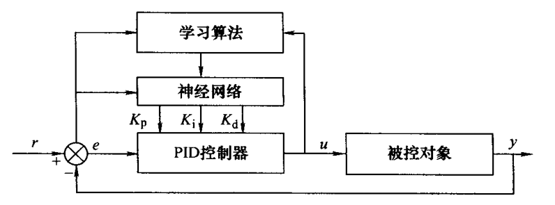

<!-- # 智能控制技术总结
https://www.cnblogs.com/cjyyx/p/18267796
 -->

# 模糊控制的数学基础

## 模糊集合

所研究的全部对象的总和，叫做**论域**，也叫全集合。

设 $x$ 为论域 $X$ 中的元素，$A$ 为论域 $X$ 中定义的一个集合，则 $x$ 和 $A$ 的关系可以用集合 $A$ 的**特征函数** $\mu_A(x)$ 来表示

$$
\mu_A(x)=\begin{cases}1&x\in A\\0&x\notin A\end{cases}
$$

给定论域 $U$ 中的一个**模糊集** $A$，是指任意元素 $x\in U$，都不同程度地属于这个集合，元素 $x$ 属于这个集合 $A$ 的程度可以用隶属函数 $\mu_{A}(x)\in[0,1]$ 来表示。

**模糊集合的表示方法**

Zadeh 表示法

$$
A=\frac{\mu_{A}(x_1)}{x_1}+\frac{\mu_{A}(x_2)}{x_2}+\cdots+\frac{\mu_{A}(x_n)}{x_n}
$$

序偶表示法

$$
A=\Set{(x_1,\mu_A(x_1)),(x_2,\mu_A(x_2)),\cdotp\cdotp\cdotp,(x_n,\mu_A(x_n))}
$$

隶属函数描述法

**模糊运算**

(1) 模糊集交 $C=A\cap B$

$$
\mu_C(x)=\mu_A(x)\wedge\mu_B(x)
$$

符号 $\wedge$ 代表取最小值运算。

(2) 模糊集并 $D=A\cup B$

$$
\mu_D(x)=\mu_A(x)\vee\mu_B(x)
$$

符号 $\vee$ 代表取最大值运算。

(3) 模糊集补 $\overline{A}$

$$
\mu_{\overline{A}}(x)=1-\mu_{A}(x)
$$

(4) 模糊集的相等

若 $\forall x\in U$，总有 $\mu_A(x)=\mu_B(x)$ 成立，则称 $A$ 和 $B$ 相等，记做 $A=B$ 。

(5) 模糊集的包含

若 $\forall x\in U$，总有 $\mu_A(x)\geq\mu_B(x)$ 成立，则称 $A$ 包含 $B$，记做 $A\supseteq B$ 。

**模糊运算的性质**

(1) 交换律

$$
A\cap B=B\cap A, A\cup B=B\cup A
$$

(2) 结合律

$$
A\cup(B\cup C)=(A\cup B)\cup C,A\cap(B\cap C)=(A\cap B)\cap C
$$

(3) 分配律

$$
A\cup(B\cap C)=(A\cup B)\cap(A\cup C),A\cap(B\cup C)=(A\cap B)\cup(A\cap C)
$$

(4) 传递律

$$
A\subseteq B,B\subseteq C \Rightarrow A\subseteq C
$$

(5) 幂等律

$$
A\cup A=A,A\cap A=A
$$

(6) 摩根律

$$
\overline{A\cup B}=\overline{A}\cap\overline{B},\overline{A\cap B}=\overline{A}\cup\overline{B}
$$

(7) 复原律

$$
\overline{\overline{A}}=A
$$

## 水平截集

在论域 $U$ 中，给定一个模糊集合 $A$，由对于 $A$ 的隶属度大于某一水平值(阈值) $\lambda$ 的元素组成的集合，叫做该模糊集合 $A$ 的 $\lambda$ 水平截集 $A_\lambda$。用公式可以描述如下：

$$
A_{\lambda}=\{x\mid\mu_{A}(x)\geq\lambda\}
$$

式中，$x\in U$，$\lambda\in[0,1]$ 。显然，$A_\lambda$是一个普通集合。

**水平截集的性质**

$$
(A\cup B)_\lambda=A_\lambda\cup B_\lambda
$$

$$
(A\cap B)_\lambda=A_\lambda\cap B_\lambda
$$

如果 $\lambda\in[0,1],\alpha\in[0,1]$ 且 $\lambda\leq\alpha$，则$A_\lambda\supseteq A_a$。也就是说，阈值越低，水平截集$A_\lambda$ 越大；阈值越高，水平截集$A_\lambda$ 越小。$A_{\lambda=1}$ 最小，如果 $A_{\lambda=1}$ 不是空集，则称它是 $A$ 的核。

## 模糊关系

假设 $x$ 是论域 $U$ 中的元素，$y$ 是论域 $V$ 中的元素，则 $U$ 到 $V$ 的一个模糊关系是指定义在 $U\times V$ 上的一个模糊子集 $R$ ，其隶属度 $\mu_{R}(x,y)\in[0,1]$ 代表 $x$ 和 $y$ 对于该模糊关系的关联程度。

常用矩阵的形式来描述

$$
R=\begin{bmatrix}\mu_{R}(x_{1},y_{1})&\mu_{R}(x_{1},y_{2})&\cdots&\mu_{R}(x_{1},y_{n})\\\mu_{R}(x_{2},y_{1})&\mu_{R}(x_{2},y_{2})&\cdots&\mu_{R}(x_{2},y_{n})\\\vdots&\vdots&&\vdots\\\mu_{R}(x_{m},y_{1})&\mu_{R}(x_{m},y_{2})&\cdots&\mu_{R}(x_{m},y_{n})\end{bmatrix}
$$

**模糊关系的运算**

模糊关系的相等

$$
R = S\Leftrightarrow r_{ij} = s_{ij}
$$

模糊关系的包含

$$
R\supseteq S\Leftrightarrow r_{ij}\geqslant s_{ij}
$$

模糊关系的并

$$
R\cup S=\begin{bmatrix}
r_{11}\vee s_{11}&\cdots&r_{1n}\vee s_{1n} \\
\vdots&&\vdots \\
r_{m1}\vee s_{m1}&\cdots&r_{mn}\vee s_{mn}
\end{bmatrix}
$$

模糊关系的交

$$
R\cap S=\begin{bmatrix}
r_{11}\wedge s_{11}&\cdots&r_{1n}\wedge s_{1n} \\
\vdots&&\vdots \\
r_{m1}\wedge s_{m1}&\cdots&r_{mn}\wedge s_{mn}
\end{bmatrix}
$$

模糊关系的补

$$
\overline{R}=\begin{bmatrix}
1-r_{11}&\cdots&1-r_{1n} \\
\vdots&&\vdots \\
1-r_{m1}&\cdots&1-r_{mn}
\end{bmatrix}
$$

**模糊关系的合成**

设 $R$ 是论域 $U\times V$ 上的模糊关系，描述为 $m\times n$ 的矩阵；$S$ 是论域 $V\times W$ 上的模糊关系，描述为 $n\times l$ 的矩阵。则 $R$ 和 $S$ 可以合成为论域 $U\times W$ 上的一个新的模糊关系

$$
C=R\circ S
$$

$$
\mu_{C}(x_i,z_j)=\bigvee_k[\mu_{R}(x_i,y_k)\wedge\mu_{S}(y_k,z_j)]
$$

**模糊变换**

设有两有限集 $X$ 和 $Y$，$R$ 是 $X\times Y$ 上的模糊关系，$A$ 和 $B$ 分别为 $X$ 和 $Y$ 上的模糊集。

$$
B=A\circ R
$$

$$
\mu_{B}(y_j)=\bigvee_i\left[\mu_{A}(x_i)\wedge\mu_{R}(x_i,y_j)\right]
$$

则称 $B$ 是 $A$ 的象，$A$ 是 $B$ 的原象，$R$ 是 $X$ 到 $Y$ 上的一个模糊变换。

**模糊决策**

设 $X$ 为所研究事物的因素集，在 $X$ 上选 $A$ 作为加权模糊集，$Y$ 是评语集，$B$ 是 $Y$ 上的决策集。$R$ 是 $X$ 到 $Y$ 上的模糊关系，用$R$ 做模糊变换，可得到决策集为

$$
B = A \circ R
$$

若要做出最后的决策，可按最大值原理，选最大的 $b_i$ 对应的 $y_i$ 作为最终的评判结果。

## 语言规则中蕴涵的模糊关系

**语言变量**是自然语言中的词或句，它的取值不是通常的数，而是用模糊语言表示的模糊集合。

- 变量名称。
- 变量的论域。
- 变量的语言值(每个语言值是定义在变量论域上的一个模糊集合)。
- 每个模糊集合的隶属函数。

**条件语句的蕴涵关系**

$A\times B$ 称做 $A$ 和 $B$ 的**笛卡儿乘积**，其隶属度运算法则为

$$
\mu_{A\times B}(u,v)=\mu_{A}(u)\wedge\mu_{B}(v)
$$

假设 $u$、$v$ 是已定义在论域 $U$ 和 $V$ 的两个语言变量

(1) 如果 $u$ 是 $A$，则 $v$ 是 $B$ ，其蕴涵的模糊关系

$$
R=(A\times B)\cup(\overline{A}\times V)
$$

$$
\mu_{R}(u,v)=[\mu_A(u)\wedge\mu_B(v)]\vee[1-\mu_A(u)]
$$

(2) 如果 $u$ 是 $A$，则 $v$ 是 $B$ ，否则 $v$ 是 $C$  ，其蕴涵的模糊关系

$$
R= (A \times B) \cup(\overline{A} \times C )
$$

$$
\mu_{R}(u,v)=[\mu_{A}(u)\wedge\mu_{B}(v)]\vee\{[1-\mu_{A}(u)]\wedge\mu_{C}(v)\}
$$

(3) 如果 $u$ 是$A_1$ ，则 $v$ 是 $B_1$ ；
否则，如果 $u$ 是 $A_2$ ，则 $v$ 是 $B_2$ ；
...
否则，如果 $u$ 是 $A_n$ ，则 $v$ 是 $B_n$ 。

$$
R=\bigcup_{i=1}^n(A_i\times B_i)
$$

$$
\mu_R(u,v)=\bigvee_{i=1}^n[\mu_{A_i}(u)\wedge\mu_{B_i}(v)]
$$
(4) 如果 $u_1$ 是 $A_1$ ，且 $u_2$ 是 $A_2$ ，... ，且 $u_m$ 是 $A_m$ ，则 $v$ 是 $B$ 。

$$
R=A_1\times A_2\times\cdots\times A_m\times B
$$

## 模糊推理

对于单输入的情况，假设两个语言变量 $x$、$y$ 之间的模糊关系为 $R$，当 $x$ 的模糊取值为 $A^*$ 时，与之相对应的 $y$ 的取值 $B^*$ 可通过模糊推理得出

$$
B^*=A^*\circ R
$$

多输入模糊推理

$$
B^{*}=(A_{1}^{*}\times A_{2}^{*}\times\cdots\times A_{m}^{*})\circ R
$$

# 模糊控制器的设计方法

## 模糊控制器的结构和设计

**模糊化**就是通过在控制器的输入、输出论域上定义语言变量，来将精确的输入、输出值转换为模糊的语言值。

通常取系统的误差值 $e$ 和误差变化率 $ec$ 为模糊控制器的两个输入，则在$e$ 的论域上定义语言变量 $E$，在 $ec$ 的论域上定义语言变量 $EC$，在控制量 $u$ 的论域上定义语言变量 $U$。

通常在语言变量的论域上，将其划分为有限的几档，作为语言值。例如 { “正大(PB)”、“正中(PM)”、“正小(PS)”、“零(ZO)”、“负小(NS)”、“负中(NM)”、“负大(NB)”} 7档。

各语言值的隶属函数有正态分布型、三角形、梯形。

- 隶属函数曲线的形状较尖时，分辨率较高，输入引起的输出变化比较剧烈，控制灵敏度较高；曲线形状较缓时、分辨率较低，输入引起的输出变化不那么剧烈，控制特性也较平缓，具有较好的系统稳定性。
- 相邻两曲线交点对应的隶属度 $\beta$ 值较小时，控制灵敏度较高，但鲁棒性不好；$\beta$ 值较大时，控制系统的鲁棒性较好，但控制灵敏度将降低。
- 确定隶属函数曲线的分布还要遵循清晰性和完备性的原则。

获得语言变量的变量值，即模糊输入 $A^*$ 和 $B^*$ 的方法为：

- 隶属度最大的模糊值当做当前模糊控制器的模糊输入量。
- 无法判断其属于哪个模糊值的隶属度更大，就把该精确量的隶属度取为最大($\mu$=1)来处理，得到一个插入的模糊状态。

<!-- 假设误差的连续取值范围是 $e=[e_{\mathrm{L}},e_{\mathrm{H}}]$ ，则量化因子

$$
K_{e}=\frac{2m}{e_{\mathrm{H}}-e_{\mathrm{L}}}
$$

则语言变量

$$
E = \left\langle K_{e}\Big( e - \frac{e_{\mathrm{H}} + e_{\mathrm{L}}}{2}\Big) \right\rangle
$$

$\langle\cdot\rangle$ 代表取整运算。 -->

**规则库**由若干条控制规则组成，这些控制规则根据人类控制专家的经验总结得出，按照 IF...is..and...is...THEN...is... 的形式表达。

规则库也可以用矩阵表的形式进行描述

控制规则

$$
R_i: \text{~IF~}E\text{~is~}A_i\text{~and~}EC\text{~is~}B_i\text{~THEN~}U\text{~is~}C_i
$$

蕴含的模糊关系为

$$
R_{i}=(A_{i}\times B_{i})\times C_{i}
$$

$$
\mu_{R_i}(E,EC,U)=\mu_{A_i}(E)\wedge\mu_{B_i}(EC)\wedge\mu_{C_i}(U)
$$

整个规则库蕴涵的模糊关系为

$$
R=\bigcup_i R_i
$$

$$
\mu_{R}(E,EC,U)=\bigvee_i [\mu_{R_i}(E,EC,U)]
$$

**模糊推理**

$$
C^{*}=(A^{*}\times B^{*})\circ R
$$

**清晰化**

(1) 最大隶属度方法

$C^*$ 中隶属度最大的元素 $U^*$ 作为精确输出控制量。
若模糊输出量 $C^*$ 的元素隶属度有几个相同的最大值，则取相应诸元素的平均值。

(2) 加权平均法(重心法)

对模糊输出量 $C^*$ 中各元素及其对应的隶属度求加权平均值，来得到精确输出控制量 $U^*$ 。

**模糊控制的优缺点**

模糊控制的优点：1）设计时不需要建立被控制对象的数学模型，只要求掌握人类的控制经验。2）系统的鲁棒性强，尤其适用于非线性时变、滞后系统的控制。模糊控制的缺点：1）确立模糊化和逆模糊化的方法时，缺乏系统的方法，主要靠经验和试凑。2）总结模糊控制规则有时比较困难。3）控制规则一旦确定，不能在线调整，不能很好地适应情况的变化。4）模糊控制器由于不具有积分环节，因而稳态精度不高。

## 模糊-PI 复合控制

模糊控制输入为 $E$、$EC$ 相当于 PD 控制器，在平衡点附近会产生振荡，稳态精度较差，为了提高稳态精度，可以将模糊控制器与 PI 控制器结合起来构成复合控制器。

**双模控制**

控制开关在系统误差较大时接通模糊控制器，来克服不确定性因素的影响；在系统误差较小时接通PI控制器来消除稳态误差。

串联控制

并联控制

## 自校正模糊控制

**参数自校正模糊控制器**

**规则自校正模糊控制器**

## 变结构模糊控制

# 神经网络基础

## 简介

**人工神经网络互连结构形式**

- 前向网络（前馈神经网络）：其网络中各个神经元接受前一级的输入，并输出到下一级，网络中没有反馈。
- 反馈网络（递归网络，回归网络）：输入信号决定了反馈系统的初始状态，然后系统经过一系列状态转移后，逐渐收敛于平衡状态。
- 竞争网络
- 随机网络

**人工神经网络的学习**

有导师学习

无导师学习

学习系统完全按照环境所提供数据的某些统计规律来调节自身参数或结构，以表示外部输入的某种固有特性。在无监督学习中，仅仅根据网络的输入调整网络的权值和阈值，没有一个目标输出。

**人工神经网络连接权的调整方法**

Hebb 学习规则：如果两个神经元同时兴奋(即同时被激活)，则它们之间的突触连接加强。

$\delta$ 学习规则（误差校正规则）：用已知样本作为教师对网络进行学习。

## 感知器模型

感知器的网络结构是由单层感知神经元，通过一组权值与 $n$ 个输入相连组成。

(1) 给定初始值 $W_i(0)$

(2) 输入一样本 $X=(x_i,\cdots,x_n,1)$ 和它的希望输出 $d$

(3) 计算实际输出

$$
Y(t)=f\left[\sum_{i=1}^{n+1}W_i(t)x_i\right]
$$

(4) 修正权

$$
W_i(t+1)=W_i(t)+\eta[d-Y(t)]x_i\quad i=1,2,\cdots,n+1
$$

式中，$0<\eta\leqslant 1$ 用于控制修正速度。

## BP 网络

假设神经网络的输入层、隐层和输出层的神经元数量分别为 $n$、$l$ 和 $m$，沿信息的传播方向，用 $In_j^{(i)}$、$Out_j^{(i)}$ 表示第 $i$ 层第 $j$ 个神经元的输入和输出。

输入层

$$
Out_i^{(1)} = In_i^{(1)} = x_i\quad i = 1 ,2 ,\cdots,n
$$

隐层

$$
In_j^{(2)}=\sum_{i=1}^n\left(w_{ij}^{(1)}Out_i^{(1)}-\theta_i\right)
$$

$$
Out_j^{(2)}=\phi(In_j^{(2)})\quad j=1,2,\cdots,l
$$

输出层

$$
y_{k} = Out_{k}^{(3)}= In_{k}^{(3)} = \sum_{j=1}^{l}w_{jk}^{(2)} Out_{j}^{(2)} \quad k= 1 ,2 ,\cdots,m
$$

$$
y_{k} = \sum_{j = 1}^{l}w_{jk}^{(2)} \phi\Big( \sum_{i = 1}^{n}w_{ij}^{(1)}x_{i} - \theta_{i}\Big) \quad k= 1 ,2 ,\cdots,m
$$
**BP学习算法**

(1) 依次取第 $k$ 组样本 $(\hat{X}_k,\hat{Y}_k), k=1,2,\cdots,m$，将 $\hat{X}_k$ 输入网络

(2) 依次计算目标函数，如果 $J<\varepsilon$，退出

$$
J=\frac12\sum_{k=1}^m\|\hat{Y}_k-Y_k\|^2
$$

(3) 计算

$$
\frac{\partial J_{k}}{\partial w_{ij}^{(1)}}=\sum_{i}\frac{\partial J_{k}}{\partial Y_{ki}}\frac{\partial Y_{ki}}{\partial Out_{j}^{(2)}}\frac{\partial Out_{j}^{(2)}}{\partial In_{j}^{(2)}}\frac{\partial In_{j}^{(2)}}{\partial w_{ij}^{(1)}}=-\sum_{i}(\hat{Y}_{ki}-Y_{ki})w_{j}^{(2)}f^{\prime}Out_{i}^{(1)}
$$

$$
\frac{\partial J_{k}}{\partial w_{j}^{(2)}} = \sum_{i} \frac{\partial J_{k}}{\partial Y_{ki}} \frac{\partial Y_{ki}}{\partial w_{j}^{(2)}} = - \sum_{i} ( \hat{Y}_{ki} - Y_{ki} ) Out_{j}^{(2)}
$$

(4) 计算

$$
\frac{\partial J}{\partial w} = \sum_{k = 1}^{m} \frac{\partial J_{k}}{\partial w}
$$

(5) 修正权值

$$
w(t+1)=w(t)-\eta\frac{\partial J}{\partial w(t)}
$$

## Hopfield 神经网络

采用反馈连接，考虑输出与输入间在时间上的传输延迟，所以所表示的是一个动态过程，需要用差分方程或微分方程来描述。

离散 Hopfield 网络实质上是一个离散的非线性动力学系统。因此如果系统是稳定的，则它可以从任意初态收敛到一个稳定状态；若系统是不稳定的，由于网络节点输出点只有1和-1（或1和0）两种状态，因而系统不可能出现无限发散，只可能出现限幅的自持震荡或极限环。若将稳态与某种优化计算的目标函数相对应，并作为目标函数的极小点。那么初态朝稳态的收敛过程便是优化计算过程。该优化计算是在网络演变过程中自动完成的。

# 神经网络在控制中的应用

## 概述

神经网络控制，即基于神经网络的控制或简称神经控制，是指在控制系统中采用神经网络这一工具对难以精确描述的复杂的非线性对象进行建模，或充当控制器，或优化计算，或进行推理，或故障诊断等，以及同时兼有上述某些功能的适应组合。

神经网络控制具备传统控制方法无法实现的一些优点和特征，主要表现为：

1. 神经网络可以处理难以用模型和规则描述的过程或系统
2. 神经网络采用并行分布式信息处理，具有很强的容错性
3. 神经网络的本质是非线性系统
4. 神经网络具有很强的信息综合能力
5. 神经网络的硬件实现愈趋方便

## 神经直接逆动态控制

## 神经自校正控制

**神经直接自校正控制**

该控制系统由一个常规控制器和一个具有离线辨识能力的神经网络辨识器组成，由于神经网络的非线性函数的映射能力，使得它可以在自校正控制系统中充当未知系统函数逼近器，且具有很高的建模精度。神经直接自校正控制的结构基本上与直接逆动态控制相同。

**神经间接自校正控制**

间接自校正控制一般称为自校正控制。自校正控制是一种利用辨识器将对象参数进行在线估计，用控制器实现参数的自动整定相结合的自适应控制技术，它可用于结构已知而参数未知但恒定的随机系统，也可用于结构已知而参数缓慢变化的随机系统。

## 神经网络系统辨识

## 神经网络 PID 控制

# 模糊神经网络

