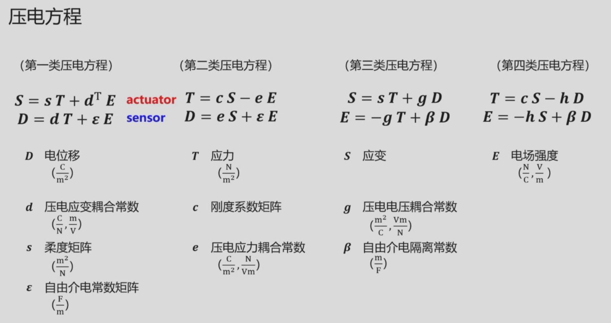
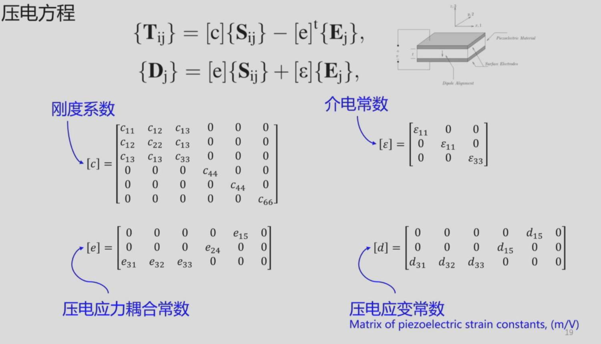

# 压电方程

<!--  -->

第一类

$$
S=sT+d^{\mathrm{T}}E
$$

$$
D=dT+\varepsilon E
$$

第二类

$$
T=cS-e^{\mathrm{T}}E
$$

$$
D=eS+\varepsilon E
$$

另一种写法

$$
S_i=s_{ij}T_j+d_{ki}E_k
$$

$$
\begin{bmatrix}S_1\\S_2\\S_3\\S_4\\S_5\\S_6\end{bmatrix}=\begin{bmatrix}s_{11}&s_{12}&s_{13}&0&0&0\\s_{21}&s_{22}&s_{23}&0&0&0\\s_{31}&s_{32}&s_{33}&0&0&0\\0&0&0&s_{44}&0&0\\0&0&0&0&s_{55}&0\\0&0&0&0&0&s_{66}\end{bmatrix}\begin{bmatrix}T_1\\T_2\\T_3\\T_4\\T_5\\T_6\end{bmatrix}+\begin{bmatrix}0&0&d_{31}\\0&0&d_{32}\\0&0&d_{33}\\0&d_{24}&0\\d_{15}&0&0\\0&0&0\end{bmatrix}\begin{bmatrix}E_1\\E_2\\E_3\end{bmatrix}
$$

- $T$ 应力
- $S$ 应变
- $E$ 电场强度
- $D$ 电位移
- $s$ 柔度矩阵
- $c$ 刚度矩阵
- $d$ 压电应变耦合常数
- $e$ 压电应力耦合常数
- $\varepsilon$ 自由介电常数

<!--  -->

闭合曲面的总电荷量

$$
Q=\iint\mathbf{D}\cdot\mathrm{d}\mathbf{A}
$$
