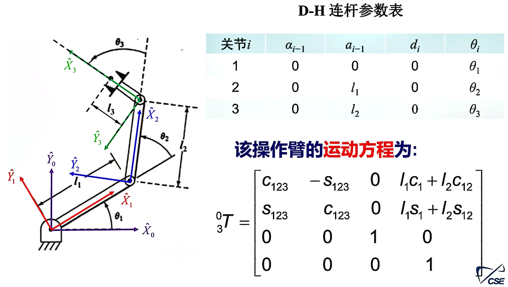
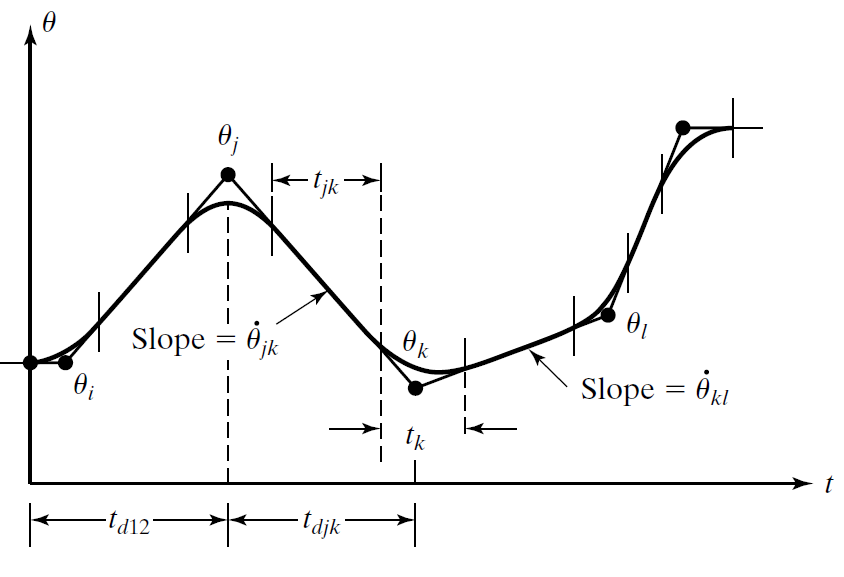
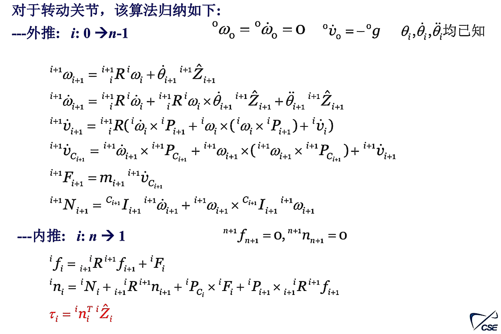

<!-- #! https://zhuanlan.zhihu.com/p/693756708

# 机器人建模与控制期末总结 -->

## 数学补充

**符号约定**

(1) 一般大写字母的变量表示矢量或矩阵，小写字母的变量表示标量

(2) 左上标和左下标表示变量所在的坐标系

如：$^AP$表示坐标系$\{A\}$中的位置矢量；$_B^AR$ 是确定坐标系$\{A\}$和坐标系$\{B\}$相对关系的矩阵；无左上、下标的位置矢量一般是世界坐标系中的。

(3) 某些三角函数有时候会被简化表示，如：

- $\cos\theta_3=c\theta_3=c_3$
- $\sin\theta_1=s\theta_1=s_1$
- $c_{23}=\cos(\theta_2+\theta_3)$
- $s_{13}=\sin(\theta_1+\theta_3)$

**双参数反正切函数**

$$
\theta=\mathrm{Atan2}(y,x)
$$

定义域 $\mathbb{R}^2\backslash(0,0)$ ，值域 $(-\pi,\pi]$ 。

**三维向量的外积**

$$
^AP\times{}^AQ=\begin{vmatrix}i&j&k\\\\p_x&p_y&p_z\\\\q_x&q_y&q_z\end{vmatrix}=\begin{bmatrix}0&-p_z&p_y\\p_z&0&-p_x\\-p_y&p_x&0\end{bmatrix}\begin{bmatrix}q_x\\q_y\\q_z\end{bmatrix}
$$

**线性方程组解与零空间**

若  $A$  为  $m \times n$  维矩阵，且  $A$  为满秩，则线性方程组  $A x=b$  的解

(1)  $m>n$  时，方程组是过定的，通常方程组无解。此时，使得  $\|A x-b\|^{2}$  最小的  $x$  为方程的最小二乘解，由左伪逆计算

$$
x^{*}=A^{+} b=A_{\text {left}}^{-1} b=\left(A^{T} A\right)^{-1} A^{T} b
$$

(2)  $m<n$  时，方程组是欠定的，通常方程组可能存在无数个解。此时，所有解中使得  $x$  范数最小的  $x$  为方程的最小范数解，由右伪逆计算

$$
x^{*}=A^{+} b=A_{\text{right}}^{-1} b=A^{T}\left(A A^{T}\right)^{-1} b
$$

零空间(Null Space)：若  $A$  为  $m \times n$  维矩阵，则  $A$  的零空间为线性方程组  $A x=0$ 的所有解集合，记为  $N(A)=\left\{x \in \mathbb{R}^{n}: A x=0\right\}$

(1)  $m \geq n$  时，若  $A$  为列满秩， $A$  的零空间只有零向量；

(2)  $m<n$  时，若  $A$  为行满秩， $A$  的零空间中的向量为

$$
\tilde{x}=\left(I-A^{+} A\right) x=\left(I-A_{\text {right }}^{-1} A\right) x=\left(I-A^{T}\left(A A^{T}\right)^{-1} A\right) x
$$

其中， $x$  为任意  $n$  维向量。

**矩阵求导**

$$
\dot{V} = \frac{\mathrm{d}V}{\mathrm{d}t}
$$

设有三个矩阵 $A, B, C$

$$
\dot{C} = \dot{A} B + A \dot{B}
$$

**雅可比 Jacobian**

$$
Y=F(X)
$$

$$
\delta Y=\frac{\partial F}{\partial X}\delta X=J(X)\delta X
$$

偏导数矩阵 $J(X)$ 称作**雅可比矩阵**，是 $x_i$ 的函数。雅可比矩阵可看成是 $X$ 中的速度向$Y$中速度的映射。$J(X)$ 是一个时变的线性变换。

**李雅普诺夫稳定性**

李雅普诺夫方法用于确定下列微分方程的稳定性

$$
\dot{X}=f(X)
$$

式中，$X$ 为 $m\times1$ 矢量，$f(\cdot)$ 可以是非线性函数。注意，高阶微分方程总是可以被写成一组形式如上的一阶微分方程。为了用李雅普诺夫方法证明一个系统是否稳定，必须构造一个具有如下性质的广义能量函数 $V(X)$

(1) $V(X)$ 具有连续的一阶偏导数，除 $V(0)=0$，对于任意 $X$ 有 $V(X)>0$；

(2) $\dot{V}(X)\leqslant0$ ，$\dot{V}(X)$ 指 $V(X)$在系统所有轨迹上的变化率。

若这些性质仅在特定区域成立，则相应的系统为弱稳定的；若这些性质在全局成立，则相应的系统为强稳定的。

## 空间描述与变换

### 位姿

空间中任何一点可用一个**位置**矢量描述，该矢量还需附加坐标系的信息。位置矢量的每个分量为矢量在相应坐标轴上的投影。

在物体上固定一个坐标系，并给出此坐标系相对于参考坐标系的表达，可称为物体的**姿态**描述。

**点的位置描述**

$O_{A}$ 表示{A}的原点。$\hat{X}_{A}$、$\hat{Y}_{A}$ 和$\hat{Z}_{A}$ 分别表示{A}的 $x$ 轴向、$y$ 轴向和 $z$ 轴向的单位向量。

$\overrightarrow{O_AP}=\begin{bmatrix}\hat{X}_A&\hat{Y}_A&\hat{Z}_A\end{bmatrix}{}^AP$，${}^AP=\begin{bmatrix}p_x\\p_y\\p_z\end{bmatrix}$

**物体的位置和姿态描述**

设{B}是某物体的一个**联体坐标系**，即该物体上的任何一个点在{B}中的位置已知且始终不变。

在{A}中表示出{B}的位置

$$
\overrightarrow{O_AO_B}=\begin{bmatrix}\hat{X}_A&\hat{Y}_A&\hat{Z}_A\end{bmatrix}{}^AO_B
$$

在{A}中表示出{B}的姿态

$$
\begin{bmatrix}\hat{X}_B&\hat{Y}_B&\hat{Z}_B\end{bmatrix}=\begin{bmatrix}\hat{X}_A&\hat{Y}_A&\hat{Z}_A\end{bmatrix}{}_B^AR
$$

**旋转矩阵** $_B^AR=\begin{bmatrix}r_{11}&r_{12}&r_{13}\\r_{21}&r_{22}&r_{23}\\r_{31}&r_{32}&r_{33}\end{bmatrix}$

任何一个旋转矩阵 $R$（一一对应于刚体的一个姿态）都属于集合 $SO(3)$

1. 每个列向量是单位向量。即 $||\vec{r}_1|| = ||\vec{r}_2|| = ||\vec{r}_3|| = 1$，其中 $\vec{r}_1, \vec{r}_2, \vec{r}_3$ 分别是 $R$ 的第一、第二、第三列。
2. 任意两个列向量都是正交的。即 $\vec{r}_1 \cdot \vec{r}_2 = \vec{r}_2 \cdot \vec{r}_3 = \vec{r}_1 \cdot \vec{r}_3 = 0$。
3. 第三个列向量是前两个列向量的向量积。即 $\vec{r}_3 = \vec{r}_1 \times \vec{r}_2$。

- $R$ 的行列式等于1
- $R$ 可逆且 $R^{-1}=R^{\mathrm{T}}$

在{A}中表示出{B}的**位姿**(描述物体在{A}中的位姿)：

**齐次变换矩阵** $\displaystyle {}_{B}^AT=\left.\left[\begin{array}{ccc|c}&{}_B^AR&&{}^AO_B\\\hline0&0&0&1\end{array}\right.\right]\in\mathbb{R}^{4\times4}$

在坐标系{A}中描述坐标系{B}中的位置矢量 $\boldsymbol{P}$

$$
{}^AP={}_B^AR {}^BP+{}^AO_B
$$

$$
\begin{bmatrix}{}^AP\\1\end{bmatrix}={}^A_BT \begin{bmatrix}{}^BP\\1\end{bmatrix}
$$

**坐标系几何关系**

$$
_A^BR={}_B^AR^{-1}={}_B^AR^{\mathrm{T}}
$$

$$
{}^BO_A=-{}_A^BR \,{}^AO_B
$$

$$
_A^BT={}_B^AT^{-1}
$$

$$
T^{-1}=\left.\left[\begin{array}{ccc|c}&R^{\mathrm{T}}&&{}-R^{\mathrm{T}}O\\\hline0&0&0&1\end{array}\right.\right]
$$

旋转矩阵的链乘法则

$$
{}^A_CR={}^A_BR \,{}^B_CR
$$

齐次变换矩阵的链乘法则

$$
{}^A_CT={}^A_BT \,{}^B_CT
$$

**右乘联体左乘基。**

### 欧拉角、固定角

**基本旋转矩阵**

$$
R_z(\theta)=\begin{bmatrix}\cos\theta&-\sin\theta&0\\[0.3em]\sin\theta&\cos\theta&0\\[0.3em]0&0&1\end{bmatrix}=\begin{bmatrix}c\theta&-s\theta&0\\[0.3em]s\theta&c\theta&0\\[0.3em]0&0&1\end{bmatrix}
$$

$$
R_y(\theta)=\begin{bmatrix}\cos\theta&0&\sin\theta\\0&1&0\\-\sin\theta&0&\cos\theta\end{bmatrix}=\begin{bmatrix}c\theta&0&s\theta\\0&1&0\\-s\theta&0&c\theta\end{bmatrix} \\
$$

$$
R_x(\theta)=\begin{bmatrix}1&0&0\\0&\cos\theta&-\sin\theta\\0&\sin\theta&\cos\theta\end{bmatrix}=\begin{bmatrix}1&0&0\\0&c\theta&-s\theta\\0&s\theta&c\theta\end{bmatrix}
$$

表示旋转矩阵的方法：

**欧拉角**

$$
R_{Z^{\prime}Y^{\prime}X^{\prime}}(\alpha,\beta,\gamma)=R_{z}(\alpha)R_{y}(\beta)R_{x}(\gamma)
$$

ABC 型欧拉角，ABA 型欧拉角，各有6种。

**固定角**

$$
R_{XYZ}(\gamma,\beta,\alpha)=R_z(\alpha)R_y(\beta)R_x(\gamma)
$$

有12种。

**由旋转矩阵求欧拉角或固定角的解**

已知 $R\in SO(3)$ ，求 $(\alpha,\beta,\gamma)\in(-\pi,\pi]\times[-\pi/2,\pi/2]\times(-\pi,\pi]$ ，使得 $R=R_{Z^{\prime}Y^{\prime}X^{\prime}}(\alpha,\beta,\gamma)$

$$
R_{Z^{\prime}Y^{\prime}X^{\prime}}(\alpha,\beta,\gamma)=\begin{bmatrix}\cos\alpha\cos\beta&\cos\alpha\sin\beta\sin\gamma-\sin\alpha\cos\gamma&\cos\alpha\sin\beta\cos\gamma+\sin\alpha\sin\gamma\\\sin\alpha\cos\beta&\sin\alpha\sin\beta\sin\gamma+\cos\alpha\cos\gamma&\sin\alpha\sin\beta\cos\gamma-\cos\alpha\sin\gamma\\-\sin\beta&\cos\beta\sin\gamma&\cos\beta\cos\gamma\end{bmatrix}
$$

### 欧拉旋转定理

定点转动：在三维空间里，假设一个刚体在运动过程中，刚体内部至少有一点固定不动，称此运动为定点转动。将联体坐标系原点设在此固定点，刚体姿态变、位置不变。

欧拉旋转定理：若刚体从初姿态作任意定点转动后呈终姿态，则必可找到一个过原点的轴 $K$ 及角度 $\theta$ ，刚体从初姿态绕 $K$ 作定轴转动 $\theta$ 后呈终姿态。

以单位向量 $^AK=[k_x,k_y,k_z]^\mathrm{T}$ 表示**等效轴**，记**等效轴角**为 $\theta$ ，**等效旋转矩阵**为

$$
R_K(\theta)=\begin{bmatrix}k_x^2\nu\theta+c\theta&k_xk_y\nu\theta-k_zs\theta&k_xk_z\nu\theta+k_ys\theta\\k_xk_y\nu\theta+k_zs\theta&k_y^2\nu\theta+c\theta&k_yk_z\nu\theta-k_xs\theta\\k_xk_z\nu\theta-k_ys\theta&k_yk_z\nu\theta+k_xs\theta&k_z^2\nu\theta+c\theta\end{bmatrix}
$$

其中 $\nu\theta=1-\cos\theta$

$$
R_K(\theta)=R_{-K}(-\theta)
$$

**等效轴角的计算**

已知$R\in SO(3)$，求等效轴 $\begin{bmatrix}k_x&k_y&k_z\end{bmatrix}^{\mathrm{T}}$ 和 $\theta\in\left[0,\pi\right]$ 使得 $R=R_K(\theta)$

$$
\theta=\text{Acos}\left(\frac{r_{11}+r_{22}+r_{33}-1}2\right)
$$

若 $\theta\in\left(0,\pi\right)$，有唯一解

$$
\left.\left[\begin{array}{c}k_x\\k_y\\k_z\end{array}\right.\right]=\dfrac{1}{2\sin\theta}\left[\begin{array}{c}r_{32}-r_{23}\\r_{13}-r_{31}\\r_{21}-r_{12}\end{array}\right]
$$

### 单位四元数表示

**四元数**

四元数 $q=\eta+i\varepsilon_1+j\varepsilon_2+k\varepsilon_3$

四元数加法 $(\eta+i\varepsilon_1+j\varepsilon_2+k\varepsilon_3)+(\xi+i\delta_1+j\delta_2+k\delta_3)=(\eta+\xi)+i(\varepsilon_1+\delta_1)+j(\varepsilon_2+\delta_2)+k(\varepsilon_3+\delta_3)$

四元数乘法

$$
\begin{aligned}
&(\eta+i\varepsilon_1+j\varepsilon_2+k\varepsilon_3)(\xi+i\delta_1+j\delta_2+k\delta_3) \\
=&(\eta\xi-\varepsilon_{1}\delta_{1}-\varepsilon_{2}\delta_{2}-\varepsilon_{3}\delta_{3})+i(\eta\delta_1+\varepsilon_1\xi+\varepsilon_2\delta_3-\varepsilon_3\delta_2) \\
&+j(\eta\delta_2-\varepsilon_1\delta_3+\varepsilon_2\xi+\varepsilon_3\delta_1)+k(\eta\delta_3+\varepsilon_1\delta_2-\varepsilon_2\delta_1+\varepsilon_3\xi) \\
=&\begin{bmatrix}\eta&-\varepsilon_1&-\varepsilon_2&-\varepsilon_3\\\varepsilon_1&\eta&-\varepsilon_3&\varepsilon_2\\\varepsilon_2&\varepsilon_3&\eta&-\varepsilon_1\\\varepsilon_3&-\varepsilon_2&\varepsilon_1&\eta\end{bmatrix}\begin{bmatrix}\xi\\\delta_1\\\delta_2\\\delta_3\end{bmatrix}
\end{aligned}
$$

四元数共轭 $(\eta+i\varepsilon_1+j\varepsilon_2+k\varepsilon_3)^*=\eta-i\varepsilon_1-j\varepsilon_2-k\varepsilon_3$

四元数模长 $|\eta+i\varepsilon_1+j\varepsilon_2+k\varepsilon_3|=\sqrt{\eta^2+\varepsilon_1^2+\varepsilon_2^2+\varepsilon_3^2}$

纯四元数：仅有虚部的四元数

四元数的逆 $q^{-1}$ 满足 $qq^{-1}=q^{-1}q=1$，$q^{-1}=\dfrac{q^*}{\left\|q\right\|^2}$

**欧拉参数**

在等效轴 $[k_xk_yk_z]^\mathrm{T}$ 和等效轴角 $\theta{\in}\mathbb{R}$ 的基础上，定义欧拉参数(单位四元数, unit quaternion) $\begin{bmatrix}\eta&\varepsilon_1&\varepsilon_2&\varepsilon_3\end{bmatrix}^\mathrm{T}$

$$
\eta=\cos\frac\theta2 ,\qquad \left.\varepsilon=\left[\begin{array}{c}\varepsilon_1\\\\\varepsilon_2\\\\\varepsilon_3\end{array}\right.\right]=\left[\begin{aligned}k_x\sin\frac\theta2\\k_y\sin\frac\theta2\\k_z\sin\frac\theta2\end{aligned}\right]
$$

记 $U$ 为由全体欧拉参数构成的集合，$U$ 是$\mathbb{R}^4$中的单位超球面。

任给一个姿态（或旋转），必有两组反号的欧拉参数与之对应。

Grassmann积

$$
\begin{bmatrix}\eta\\\varepsilon\end{bmatrix}\oplus\begin{bmatrix}\xi\\\delta\end{bmatrix}=\begin{bmatrix}\eta\xi-\varepsilon^\mathrm{T}\delta\\\eta\delta+\xi\varepsilon+\varepsilon\times\delta\end{bmatrix}=\begin{bmatrix}\eta&-\varepsilon_1&-\varepsilon_2&-\varepsilon_3\\\varepsilon_1&\eta&-\varepsilon_3&\varepsilon_2\\\varepsilon_2&\varepsilon_3&\eta&-\varepsilon_1\\\varepsilon_3&-\varepsilon_2&\varepsilon_1&\eta\end{bmatrix}\begin{bmatrix}\xi\\\delta_1\\\delta_2\\\delta_3\end{bmatrix}=A\begin{bmatrix}\xi\\\delta_1\\\delta_2\\\delta_3\end{bmatrix}
$$

单位四元数(unit quaternion)与欧拉参数一一对应。

**3D 旋转公式**

任意向量 $\mathbf{v}$ 沿着以单位向量定义的旋转轴 $\mathbf{u}$ 旋转 $\theta$ 之后的 $\mathbf{v}^{\prime}$ 可由四元数乘法获得。

令 $\nu=\left[0,\mathbf{v}\right]$，$\nu^{\prime}=\left[0,\mathbf{v}^{\prime}\right]$，$q=\left[\cos\dfrac{\theta}{2},\mathbf{u}\sin\dfrac{\theta}{2}\right]$

则 $\nu^{\prime}=q\nu q^*=q\nu q^{-1}$

旋转矩阵基于欧拉参数表达为

$$
_B^AR=R_\varepsilon(\eta)=\begin{bmatrix}2(\eta^2+\varepsilon_1^2)-1&2(\varepsilon_1\varepsilon_2-\eta\varepsilon_3)&2(\varepsilon_1\varepsilon_3+\eta\varepsilon_2)\\2(\varepsilon_1\varepsilon_2+\eta\varepsilon_3)&2(\eta^2+\varepsilon_2^2)-1&2(\varepsilon_2\varepsilon_3-\eta\varepsilon_1)\\2(\varepsilon_1\varepsilon_3-\eta\varepsilon_2)&2(\varepsilon_2\varepsilon_3+\eta\varepsilon_1)&2(\eta^2+\varepsilon_3^2)-1\end{bmatrix}
$$

## 微分运动学

### 时变位姿的符号表示

**位置矢量的导数**

矢量 $^{B}Q$ 的微分表示为如下同维矢量

$$
^BV_{Q}=\frac{\mathrm{d}}{\mathrm{d}t}{}^BQ=\lim_{\Delta t\to0}\frac{^BQ(t+\Delta t)-{}^BQ(t)}{\Delta t}
$$

**速度矢量** $^BV_{Q}$ 可在任意坐标系中描述

$$
{}^A({}^BV_Q)=\frac{^A\mathrm{d}}{\mathrm{d}t}{}^BQ={}_B^AR {}^BV_Q
$$

$$
{}^B({}^BV_Q)={}^BV_Q
$$

经常讨论的是一个坐标系原点相对于世界坐标系$\{U\}$的速度，对于这种情况，定义一个缩写符号

$$
v_{C}={}^UV_{\mathrm{CORG}}
$$

$$
{}^Av_C={}_U^AR v_C={}_U^AR {}^UV_{\mathrm{CORG}}\neq{}^AV_{\mathrm{CORG}}
$$

**角速度矢量** $^A\Omega_B$ 描述了坐标系{B}相对于坐标系{A}的旋转。从物理意义上讲， $^A\Omega_B$ 的方向就是{B}相对于{A}的瞬时旋转轴，$^{A}\Omega_B$ 的大小表示旋转速率。

$$
{}^C({}^A\Omega_B)={}_A^CR^A\Omega_B
$$

经常讨论的是动坐标系(比如{C}) 相对于世界坐标系{U}的角速度，对于这种情况，定义一个缩写符号

$$
\omega_C={}^U\Omega_C
$$

特别要注意下列符号的意思

$$
^A\omega_C={}_U^AR\omega_C={}_U^AR {}^U\Omega_C\neq{}^A\Omega_C
$$

$$
^C\omega_C={}_U^CR\omega_C={}_U^CR {}^U\Omega_C
$$

**加速度**

$$
^B\dot{V}_Q=\frac{\mathrm{d}}{\mathrm{d}t}{}^BV_Q=\lim_{\Delta t\to0}\frac{^BV_Q(t+\Delta t)-^BV_Q(t)}{\Delta t}
$$

$$
^A\dot{\Omega}_B=\frac{\mathrm{d}}{\mathrm{d}t}{}^A\Omega_B=\lim_{\Delta t\to0}\frac{^A\Omega_B\left(t+\Delta t\right)-^A\Omega_B\left(t\right)}{\Delta t}
$$

$$
\dot{v}_{A}={}^{U}\dot{V}_{AORG}
$$

$$
\dot{\omega}_A={}^U\dot{\Omega}_A
$$

### 刚体的速度

**坐标系间的速度和加速度变换**

刚体上某点 $Q$ 相对于坐标系 $A$ 的速度

$$
^AV_Q={}^{A}V_{BORG}+{}_{B}^{A}R{}^{B}V_{Q}+{}^{A}\Omega_{B}\times{}_{B}^{A}R^{B}Q
$$

- $^{A}V_{BORG}$：坐标系 $B$ 的原点相对于坐标系 $A$ 的速度。
- $_{B}^{A}R$：从坐标系 $B$ 到坐标系 $A$ 的旋转矩阵，表示两个坐标系之间的空间方向关系。
- $^{B}V_{Q}$：点 $Q$ 相对于坐标系 $B$ 的速度。
- $^{A}\Omega_{B}$：坐标系 $B$ 相对于坐标系 $A$ 的角速度。
- $^{B}Q$：点 $Q$ 在坐标系 $B$ 中的位置向量。

刚体上某点 $Q$ 相对于坐标系 $A$ 的加速度

$$
^A\dot{V}_Q={}^A\dot{V}_{BORG}+{}_{B}^{A}R^{B}\dot{V}_{Q}+2{}^{A}\Omega_{B}\times{}_{B}^{A}R^{B}V_{Q}+^{A}\dot{\Omega}_{B}\times{}_{B}^{A}R^{B}Q+^{A}\Omega_{B}\times(^{A}\Omega_{B}\times{}_{B}^{A}R^{B}Q)
$$

- $^A\dot{V}_{BORG}$：坐标系 $B$ 的原点相对于坐标系 $A$ 的加速度。
- $^{B}\dot{V}_{Q}$：点 $Q$ 相对于坐标系 $B$ 的加速度。
- $^{A}\dot{\Omega}_{B}$：坐标系 $B$ 相对于坐标系 $A$ 的角加速度。

当点 $Q$ 相对于坐标系 $B$ 保持不变（即位置向量 $^BQ$ 是一个常数），可以简化为：

$$
^A\dot{V}_Q={}^A\dot{V}_{BORG}+{}^A\Omega_B\times(^A\Omega_B\times{}_B^AR^BQ)+{}^A\dot{\Omega}_B\times{}_B^AR^BQ
$$

**坐标系间的角速度和角加速度变换**

假设坐标系 $B$ 以角速度 $^A\Omega_B$ 相对于坐标系 $A$ 转动，同时坐标系 $C$ 以角速度 $^B\Omega_C$ 相对于坐标系 $B$ 转动。

坐标系 $C$ 相对于坐标系 $A$ 的角速度

$$
^A\Omega_C={}^A\Omega_B+{}_B^AR {}^B\Omega_C
$$

角加速度

$$
^A\dot{\Omega}_C={}^A\dot{\Omega}_B+{}_B^AR {}^B\dot{\Omega}_C+{}^A\Omega_B\times{}_B^AR {}^B\Omega_C
$$

## 刚体力学

### 惯性张量

坐标系{A}中的**惯性张量**

$$
^AI=\begin{bmatrix}I_{xx}&-I_{xy}&-I_{xz}\\-I_{xy}&I_{yy}&-I_{yz}\\-I_{xz}&-I_{yz}&I_{zz}\end{bmatrix}
$$

$\displaystyle I_{xx} =\iiint_V(y^2+z^2)\rho\mathrm{d}v$ ，
$\displaystyle I_{yy} =\iiint_V(x^2+z^2)\rho\mathrm{d}v$ ，
$\displaystyle I_{zz} =\iiint_V(x^2+y^2)\rho\mathrm{d}v$

$\displaystyle I_{xy} =\iiint_Vxy\rho\mathrm{d}v$ ，
$\displaystyle I_{xz} =\iiint_Vxz\rho\mathrm{d}v$ ，
$\displaystyle I_{yz} =\iiint_Vyz\rho\mathrm{d}v$

$$
I=\iiint_V(\boldsymbol{r}^\mathrm{T}\boldsymbol{r}I_3-\boldsymbol{r}\boldsymbol{r}^\mathrm{T})\mathrm{d}m
$$

$I_{xx}$、$I_{yy}$和$I_{zz}$称为惯性矩。其余 3 个交叉项称为惯量积。当任意选择坐标系的姿态时，可能会使刚体的惯量积为零。此时，坐标系的轴被称为主轴，而相应的惯量矩被称为主惯性矩。

**平行移轴定理**

假设{C}是以刚体质心为原点的坐标系，{A}为任意平移后的坐标系，矢量 $P_c=(x_c,y_c,z_c)^T$ 表示刚体质心在坐标系{A}中的位置。平行移轴定理可以表示成为矢量-矩阵形式

$$
^AI={}^CI+m(P_c^TP_cI_3-P_c P_c^T)
$$

式中 $I_{3}$ 是 3×3 单位矩阵。

### 静力学

力的坐标变换

$$
{}^BF={}_B^AR{}^AF
$$

$$
{}^BN={}^BP_{AORG}\times{}^BF+{}_A^BR {}^AN
$$

### 牛顿方程和欧拉方程

牛顿方程

作用在质心上的力 $F$ 引起刚体的加速度为

$$
F = m\dot{v}_C
$$

式中 $m$ 代表刚体的总质量。

欧拉方程

作用在刚体上的力矩 $N$ 引起刚体的转动为

$$
{}^CN={}^CI {}^C\dot{\omega}+{}^C\omega\times{}^CI {}^C\omega
$$

式中 $^{C}I$ 是刚体在坐标系{C}中的惯性张量。坐标系{C}固连于连杆，原点在刚体的质心。

## 正运动学

### 串联机构中的运动学参量

从串联机器人进行编号

- 固定基座为连杆0
- 第一个可动连杆为连杆1
- 以此类推，机器人最末端的连杆为连杆$N$
- 连杆0 与连杆1 通过关节1 连接，… ，连杆$N-1$ 与连杆$N$ 通过关节$N$ 连接

为了确定末端执行器在3维空间的位置和姿态，串联机器人至少需要6个关节。

用空间中的直线“轴$i$ ”表示关节$i$ 的轴线，轴$i$ 的正方向由设计者指定。

- 旋转关节：旋转轴中心线
- 滑动关节：滑动方向中心线

连杆$i$ 绕（沿）轴$i$ 相对于连杆$i–1$ 运动。

**D-H 参数**：运动学参量

若轴$i-1$ 和轴$i$ 不平行，它们有唯一的公垂线段；若轴$i-1$ 和轴$i$ 平行，它们的公垂线段不唯一，可按需取一条公垂线段。公垂线段$\overrightarrow{O_{i-1}P_i}$ 的正方向为轴$i-1$ 指向轴$i$，称$\overrightarrow{O_{i-1}P_i}$ 为**几何连杆**。

公垂线段$\overrightarrow{O_{i-1}P_i}$ 的长度，表示为**连杆长度** $a_{i-1}$。当$a_{i-1}=0$ 时，我们并不将零长度的$\overrightarrow{O_{i-1}P_i}$ 视为传统的零向量，而是在与轴$i-1$和轴$i$同时垂直的方向中选一个作为$\overrightarrow{O_{i-1}P_i}$ 的正方向。

过轴$i-1$ 作一个平面垂直于$\overrightarrow{O_{i-1}P_i}$，然后将轴$i$ 投影到该平面上，按照轴$i-1$ 绕$\overrightarrow{O_{i-1}P_i}$ 旋转到轴$i$ 投影的思路以右手螺旋法则确定轴$i-1$ 与轴$i$ 夹角的值，此夹角即为**连杆转角** $\alpha_{i-1}$。

从$P_i$ 到$O_i$ 的有向距离，记为**连杆偏距** $d_i$

过$\overrightarrow{O_{i-1}P_i}$ 作一个平面垂直于轴$i$ ，然后将$\overrightarrow{O_iP_{i+1}}$ 投影到该平面上，在平面内按照$\overrightarrow{O_{i-1}P_i}$ 绕轴$i$ 旋转到$\overrightarrow{O_iP_{i+1}}$ 投影的思路以右手螺旋法则确定$\overrightarrow{O_{i-1}P_i}$ 与$\overrightarrow{O_iP_{i+1}}$ 夹角的值，此旋转角度即为**关节角** $\theta_i$

**关节1 的运动学参量（首关节约定）**

设定一个虚拟的轴0与轴1重合，即取 $a_0=0$ ，$\alpha_0=0$ 。

若关节1是转动关节，取$d_1=0$，而$\overrightarrow{O_0P_1}$ 的方向则任取与轴1垂直的某个方向，取$\overrightarrow{O_0P_1}$ 的方向就是决定$\overrightarrow{O_1P_2}$ 的零位方向。

若关节1是滑动关节，取$\theta_1{=}0$，而$\overrightarrow{O_0P_1}$ 的位置则任取轴1上的某个点，取$\overrightarrow{O_0P_1}$ 的位置就是决定$\overrightarrow{O_1P_2}$ 的零位位置。

$\overrightarrow{O_0P_1}$ 是一个固定不动的几何连杆。

**关节N 的运动学参量（尾关节约定）**

轴$N-1$ 和轴$N$ 存在，$a_{N-1}$ 和$\alpha_{N-1}$ 已知，需要选取长度任意的$\overrightarrow{O_N P_{N+1}}$ 。

若关节$N$ 是转动关节，取$d_{N}=0$，而$\overrightarrow{O_N P_{N+1}}$ 的方向则任取与连杆$N$ 固连的某个方向，$\overrightarrow{O_N P_{N+1}}$ 与 $\overrightarrow{O_{N-1} P_{N}}$ 的夹角即是关节角 $\theta_N$ 。

若关节$N$ 是滑动关节，取$\theta_{N}=0$，而点$O_N$ 则任取轴$N$ 上与连杆$N$ 固连的某个点，$O_N$ 与$P_N$ 的相对位移即决定了连杆偏距$d_{N}$ 。

### 建立坐标系的改进D-H方法

**运动学参量表**

$a_{i-1}$ 和 $\alpha_{i-1}$ 是固定不变的参数，不会随着关节$i$的运动而变化。

若关节$i$ 是转动关节，则 $d_i$ 是固定不变的参数，$\theta_i$ 是会随着关节$i$的运动而变化的关节变量，即：3个连杆参数 $a_{i-1},\alpha_{i-1},d_i$ ，1个关节变量$\theta_i$

若关节$i$ 是滑动关节，则 $\theta_i$ 是固定不变的参数，$d_i$ 是会随着关节$i$的运动而变化的关节变量，即：3个连杆参数$a_{i-1},\alpha_{i-1},\theta_i$ ，1个关节变量$d_i$

一个有$N$个关节的串联机构，有$4N$个运动学参量，其中$3N$ 个是连杆参数、$N$个是关节变量，它们包含了串联机构的全部空间几何信息。

**连杆联体坐标系的配置**

串联机器人是一个多体系统（$N+1$ 个刚体），描述机器人的运动即是描述$N+1$ 个刚体的运动，因此需要建立每个刚体（实物连杆）的联体坐标系。

几何连杆 $\overrightarrow{O_{i-1} P_i}$ 与连杆$i-1$ 固连，$\overrightarrow{O_{i-1}P_i}$ 的联体坐标系也是连杆$i-1$ 的联体坐标系。

建立连杆$i-1$ 的联体坐标系$\{i-1\}$

- $O_{i-1}$为$\{i-1\}$的原点
- 轴$i-1$为$\{i-1\}$的Z轴
- $\overrightarrow{O_{i-1}P_i}$为$\{i-1\}$的X轴
- 右手定则定$\{i-1\}$的Y轴

### 机器人的正运动学计算

相邻连杆联体坐标系的变换

$$
\begin{aligned}
{}_{i}^{i-1}T &=\left[\begin{array}{c:c}
R_{x}(\alpha_{i-1}) & 0\\
\hdashline 0 & 1
\end{array}\right] \left[\begin{array}{ccc:c}
1 & 0 & 0 & a_{i-1} \\
0 & 1 & 0 & 0 \\
0 & 0 & 1 & 0 \\
\hdashline 0 & 0 & 0 & 1
\end{array}\right] \left[\begin{array}{c:c}
R_{z}(\theta_{i}) & 0\\
\hdashline 0 & 1
\end{array}\right] \left[\begin{array}{ccc:c}
1 & 0 & 0 & 0 \\
0 & 1 & 0 & 0 \\
0 & 0 & 1 & d_i \\
\hdashline 0 & 0 & 0 & 1
\end{array}\right] \\
&=\left[\begin{array}{cccc}
\cos \theta_{i} & -\sin \theta_{i} & 0 & a_{i-1} \\
\sin \theta_{i} \cos \alpha_{i-1} & \cos \theta_{i} \cos \alpha_{i-1} & -\sin \alpha_{i-1} & -\sin \alpha_{i-1} d_{i} \\
\sin \theta_{i} \sin \alpha_{i-1} & \cos \theta_{i} \sin \alpha_{i-1} & \cos \alpha_{i-1} & \cos \alpha_{i-1} d_{i} \\
0 & 0 & 0 & 1
\end{array}\right]
\end{aligned}
$$

对于具有N个关节的串联机器人，其N个关节变量可形成一个N×1的**关节矢量**。所有关节矢量构成的空间称为**关节空间**。关节空间中的每一个关节矢量都确定了机器人的一个**位形**。

正运动学：关节空间 → 笛卡尔空间

## 逆运动学

**工作空间**是机器人末端工具联体坐标系原点所能到达的范围。**灵巧工作空间**是机器人末端工具能够以任何姿态到达的区域。**可达工作空间**是机器人末端工具以至少一种姿态到达的区域。灵巧工作空间是可达工作空间的子集。若目标位置在灵巧工作空间内，则逆运动学问题的解存在。若目标位置不在可达工作空间内，则逆运动学问题的解不存在。当操作臂少于6自由度时，它在三维空间内不能达到全部位姿。

**封闭解法**是指基于解析形式的算法。将运动学的封闭解法分为两类：代数解法和几何解法。**数值解法**具有迭代性质，所以比封闭解法的求解速度慢得多。在多重解的情况下，数值解法不能求出全部的解。

所有包含转动关节和移动关节的串联型6自由度操作臂都是可解的，但这种解一般是数值解。对于6自由度操作臂来说，只有在特殊情况下才有解析解，这种存在解析解（封闭解）的操作臂存在几个正交关节轴，或者有多个 $\alpha_i$ 为0 或$\pm90^\circ$ 。具有6个旋转关节的操作臂存在封闭解的充分条件是相邻的三个关节轴线相交于一点。

## 轨迹生成

**路径**：机器人位形的一个特定序列，而不考虑机器人位形的时间因素。**轨迹**：与何时到达路径中的每个部分有关，强调了时间性和连续性。

机械臂轨迹控制过程中要求以足够的路径更新率自动完成各关节位置、速度和加速度的轨迹。

关节空间规划方法计算量小、没有奇异位形问题，不过，末端在笛卡尔空间的路径形状较复杂，不是直线、圆或正弦等常见形状。

**四元数插补**

对于单位四元数表示的两个姿态 $q_0=\left[\cos(\theta_0),\quad\sin(\theta_0)\mathbf{u}_0\right]$ ，$q_1=\left[\cos(\theta_1),\quad\sin(\theta_1)\mathbf{u}_1\right]$

四元数插补要求规划出一些中间姿态$q_t$，使初始姿态$q_{0}$能够平滑地过渡到最终变换姿态$q_{1}$ 。

四元数球面线性插值Slerp

$$
q_t=\mathrm{Slerp}(q_0,q_1,t)=\frac{\sin((1-t)\theta)}{\sin(\theta)}q_0+\frac{\sin(t\theta)}{\sin(\theta)}q_1
$$

$$
\theta=\cos^{-1}(q_0\cdot q_1)
$$

Slerp 的钝角处理：

若 $q_0\cdot q_1<0$ ，则将 $q_1$ 改为 $-q_1$ ，使用新的夹角进行插值，保证插值的路径最短。

## 操作臂运动学

在考虑机器人连杆运动时，一般使用连杆坐标系{0}作为参考坐标系。因此，$v_i$ 是连杆坐标系{i}原点的线速度，$\omega_i$ 是连杆坐标系{i}的角速度。

$$
\begin{aligned}
^iv_i&={}_U^iRv_i={}_U^iR \, {}^UV_{iORG}={}_0^iR^0V_{iORG} \\
^i\omega_i&={}_U^iR\omega_i={}_U^iR \, {}^U\Omega_i={}_0^iR^0\Omega_i \\
^{i+1}v_i&={}_U^{i+1}Rv_i={}_U^{i+1}R \, {}^UV_{iORG}={}_0^{i+1}R^0V_{iORG} \\
^{i+1}\omega_i&={}_U^{i+1}R\omega_i={}_U^{i+1}R \, {}^U\Omega_i={}_0^{i+1}R{}^0\Omega_i
\end{aligned}
$$

### 连杆间的速度与加速度传递

**连杆间的速度传递**

若 $i+1$ 关节为转动关节

$$
{}^{i+1}v_{i+1}={}^{i+1}_{i}R\left({}^{i}v_{i}+{}^{i}\omega_{i}\times{}^{i}P_{i+1}\right)
$$

$$
^{i+1}\omega_{i+1}={}^{i+1}_iR \, {}^i\omega_i+\dot{\theta}_{i+1} \, {}^{i+1}\hat{Z}_{i+1}
$$

移动关节

$$
{}^{i+1}v_{i+1}={}_i^{i+1}R({}^iv_i+{}^i\omega_i\times{}^iP_{i+1})+\dot{d}_{i+1}{}^{i+1}\dot{Z}_{i+1}
$$

$$
{}^{i+1}\omega_{i+1}={}_i^{i+1}R^i\omega_i
$$

**连杆间的加速度传递**

$$
^{i+1}\dot{\omega}_{i+1}={}_{i}^{i+1}R^{i}\dot{\omega}_{i}+{}_{i}^{i+1}R^{i}\omega_{i}\times\dot{\theta}_{i+1}{}^{i+1}\hat{Z}_{i+1}+\ddot{\theta}_{i+1}{}^{i+1}\hat{Z}_{i+1}
$$

当第 $i+1$ 个关节是移动关节时，上式可简化为

$$
{}^{i+1}\dot{\omega}_{i+1}={}_i^{i+1}R^i\dot{\omega}_i
$$

连杆坐标系原点的线加速度

$$
^{i+1}\dot{v}_{i+1}={}^{i+1}_iR\left[{}^i\omega_i\times{}^iP_{i+1}+{}^i\omega_i\times\left({}^i\omega_i\times{}^iP_{i+1}\right)+{}^i\dot{v}_i\right]
$$

当第 $i+1$ 个关节是移动关节时，上式可简化为

$$
^{i+1}\dot{v}_{i+1}={}^{i+1}_iR\left[{}^i\omega_i\times{}^iP_{i+1}+{}^i\omega_i\times\left({}^i\omega_i\times{}^iP_{i+1}\right)+{}^i\dot{v}_i\right] \\
+2^{i+1}\omega_{i+1}\times\dot{d}_{i+1}{}^{i+1}\hat{Z}_{i+1}+\ddot{d}_{i+1}{}^{i+1}\hat{Z}_{i+1}
$$

每个连杆质心的线加速度

$$
^i\dot{v}_{C_i}={}^i\dot{\omega}_i\times{}^iP_{C_i}+{}^i\omega_i\times({}^i\omega_i\times{}^iP_{C_i})+{}^i\dot{v}_i
$$

假定坐标系{C}附加于连杆 $i$ 上，坐标系原点位于连杆质心，且各坐标轴方向与原连杆坐标系{i}方向相同。

### 雅可比

**几何雅可比矩阵**：操作臂的关节速度 $\Theta$ 与末端线速度和角速度 $\begin{pmatrix}v&\omega\end{pmatrix}^T$ 之间的映射关系矩阵 $J(\Theta)$ 。

$$
\begin{bmatrix}v\\\omega\end{bmatrix}=J(\Theta)\dot{\Theta}
$$

**矢量积构造法**

若机械臂末端执行器固连在连杆$N$上，而且相对于世界坐标系{U}，每个连杆的坐标系原点 $P_i$ 和转轴单位向量 $\hat{Z}_i$ 已由正运动学求得。

假设其他关节固定不动，只有第$i$个关节运动，则由此运动产生的连杆$N$的线速度和角速度如下：

若第$i$个关节为转动关节

$$
v_N^{(i)}=\dot{\theta}_i\hat{Z}_i\times(P_N-P_i) ,\quad \omega_N^{(i)}=\dot{\theta}_i\hat{Z}_i
$$

若第$i$个关节为移动关节

$$
v_N^{(i)}=\dot{d}_i\hat{Z}_i ,\quad \omega_N^{(i)}=0
$$

末端实际线速度和角速度

$$
v_N=\sum_{i=1}^Nv_N^{(i)} ,\quad \omega_N=\sum_{i=1}^N\omega_N^{(i)}
$$

**奇异性**

对于一般机械臂，奇异位形为令雅可比矩阵 $J$ 不满秩的 $\Theta$ 值所构成的位形。不同情况下的奇异点的判断条件为

(1) 无冗余($m=n$)，在此 $\Theta$ 时 $J$ 不可逆，即 $\det(J(\Theta))=0$ ；

(2) 冗余($m<n$)，在此 $\Theta$ 时 $J$ 不行满秩，即 $rank\left(J(\Theta)\right)<m$ ；

(3) 欠驱动($m>n$)，在此 $\Theta$ 时 $J$ 不列满秩，即 $rank\left(J(\Theta)\right)<n$ 。

**分析雅可比** $J_{\alpha}(\Theta)$ ，基于对末端执行器姿态的最小表示。

令 $X=\begin{bmatrix}d(\Theta)\\\alpha(\Theta)\end{bmatrix}$ 表示末端执行器的姿态，其中 $d(\Theta)$ 为基座坐标系原点到末端执行器坐标系原点的一般向量，$\alpha$ 为末端执行器坐标系相对于基座坐标系姿态的最小表示(例如固定角表示或欧拉角表示)。

$$
\dot{X}=\begin{bmatrix}\dot{d}\\\dot{\alpha}\end{bmatrix}=J_a(\Theta)\dot{\Theta}
$$

若刚体姿态矩阵为  $R=\left[\begin{array}{lll}r_{11} & r_{12} & r_{13} \\ r_{21} & r_{22} & r_{23} \\ r_{31} & r_{32} & r_{33}\end{array}\right]$ ，刚体角速度  $\omega=\left[\begin{array}{c}\omega_{x} \\ \omega_{y} \\ \omega_{z}\end{array}\right]$ ，有

$$
\dot{R} R^{\mathrm{T}}=S
$$

$$
{\left[\begin{array}{lll}
\dot{r}_{11} & \dot{r}_{12} & \dot{r}_{13} \\
\dot{r}_{21} & \dot{r}_{22} & \dot{r}_{23} \\
\dot{r}_{31} & \dot{r}_{32} & \dot{r}_{33}
\end{array}\right]\left[\begin{array}{lll}
r_{11} & r_{21} & r_{31} \\
r_{12} & r_{22} & r_{32} \\
r_{13} & r_{23} & r_{33}
\end{array}\right]=\left[\begin{array}{ccc}
0 & -\omega_{z} & \omega_{y} \\
\omega_{z} & 0 & -\omega_{x} \\
-\omega_{y} & \omega_{x} & 0
\end{array}\right]}
$$

$$
\omega_{x}=\dot{r}_{31} r_{21}+\dot{r}_{32} r_{22}+\dot{r}_{33} r_{23}
$$

$$
\omega_{y}=\dot{r}_{11} r_{31}+\dot{r}_{12} r_{32}+\dot{r}_{13} r_{33}
$$

$$
\omega_{z}=\dot{r}_{21} r_{11}+\dot{r}_{22} r_{12}+\dot{r}_{23} r_{13}
$$

角速度与欧拉角速率的关系

$$
\omega=B(\phi)\dot{\phi}
$$

几何雅可比与分析雅可比矩阵的转换

$$
J_a(\Theta)=\begin{bmatrix}I&0\\0&B^{-1}(\alpha)\end{bmatrix}J(\Theta)
$$

记 $T_a=\begin{bmatrix}I&0\\0&B^{-1}(\alpha)\end{bmatrix}$

## 操作臂动力学

### 静力学

为相邻杆件所施加的力和力矩定义以下特殊的符号：

- $f_i$ 连杆 $i-1$ 施加在连杆 $i$ 上的力
- $n_i$ 连杆 $i-1$ 施加在连杆 $i$ 上的力矩

静力平衡，有

$$
{}^if_i={}_{i+1}^iR{}^{i+1}f_{i+1}
$$

$$
{}^in_i={}_{i+1}^iR{}^{i+1}n_{i+1}+{}^iP_{i+1}\times{}^if_i
$$

保持系统静平衡的关节力矩

$$
\tau_i={}^in_i^T \,{}^i\hat{Z}_i
$$

对于关节 $i$ 是移动关节的情况，可以算出关节驱动力为

$$
\tau_i={}^if_i^T \,{}^i\hat{Z}_i
$$

按照惯例，通常将使关节角增大的旋转方向定义为关节力矩的正方向。

**力域中的雅可比**

在静态下，关节力矩与末端力平衡

$$
\tau=J(\Theta)^T F
$$

雅可比的转置将作用于操作臂的笛卡尔力映射成等效关节力矩。

### 动力学

由关节运动计算关节力矩的完整算法由两部分组成。第一部分是对每个连杆应用牛顿-欧拉方程，从连杆 1 到连杆 $n$ 向外递推计算连杆的速度和加速度的。第二部分是从连杆 $n$ 到连杆 1 迭代计算连杆间的相互作用力和力矩以及关节驱动力矩。

### 动力学方程的结构

状态空间方程

$$
\tau=M(\Theta)\ddot{\Theta}+V(\Theta,\dot{\Theta})+G(\Theta)
$$

式中 $M(\Theta)$ 为操作臂的 $n\times n$ 质量矩阵，$V(\Theta,\dot{\Theta})$ 是 $n\times1$ 的离心力和哥氏力矢量，$G(\Theta)$ 是 $n\times1$ 重力矢量。

### 拉格朗日方程

计算操作臂的第 $i$ 根连杆的质心线速度和角速度：

$$
v_{C_i}=J_{v_{C_i}}(\theta)\dot{\theta}\qquad{}^i\omega_i=J_{^i\omega_i}(\theta)\dot{\theta}
$$

连杆 $i$ 的动能表达式

$$
k_i=\frac12m_iv_{C_i}^\mathrm{T}v_{C_i}+\frac12{}^i\omega_i^\mathrm{T~}{}^{C_i}I_i{}^i\omega_i
$$

操作臂的动能可以描述为关节位置和速度的标量函数

$$
k(\Theta,\dot{\Theta})=\frac12\dot{\Theta}^TM(\Theta)\dot{\Theta}
$$

操作臂的质量矩阵一定是对称且正定矩阵。

连杆 $i$ 的势能可表示为

$$
u_i=-m_i{}^0g^{\mathrm{T}}{}^0P_{C_i}+u_{\mathrm{ref}_i}
$$

$^{0}g$ 是 3×1 的重力矢量，$^{0}P_{C_i}$ 是连杆 $i$ 的质心的位置，$u_{\mathrm{ref}_i}$ 是使 $u_i$ 的最小值为零的常数。

操作臂的总势能 $u(\Theta)$ 可描述为关节位置的标量函数。

$$
u=\sum_{i=1}^nu_i
$$

**拉格朗日函数**

$$
\mathcal{L}(\Theta,\dot{\Theta})=k(\Theta,\dot{\Theta})-u(\Theta)
$$

则操作臂的运动方程为

$$
\frac{\mathrm{d}}{\mathrm{d}t}\frac{\partial\mathcal{L}}{\partial\dot{\Theta}}-\frac{\partial\mathcal{L}}{\partial\Theta}=\tau
$$

这里 $\tau$ 是 $n\times1$ 的激励力矩矢量。

## 运动控制

机器人控制是通过反馈调节执行器的输入，在保证闭环系统稳定和实现期望行为的同时，满足既定的瞬态和稳态要求。机器人控制分为自由空间的运动控制和与环境交互控制。机器人运动控制要求实现对期望轨迹的跟踪，达到稳、快、准。

### 逆动力学控制

**α-β分解运动控制**

二阶线性系统的动力学模型

$$
m\ddot{x}+b\dot{x}+kx=f
$$

分解成模型控制+位置校正两部分，先利用反馈将模型化为单位质量模型，再对单位质量模型设计控制律。

$$
m\ddot{x}+b\dot{x}+kx=\alpha f^{\prime}+\beta
$$

取

$$
\alpha=m \qquad \beta=b\dot{x}+kx
$$

得到单位质量运动模型

$$
\ddot{x}=f^{\prime}
$$

设计控制律

$$
f^{\prime}=-k_v\dot{x}-k_px
$$

**轨迹跟踪控制**，跟踪一条给定的轨迹 $x_d(t)$

定义跟踪误差，$e=x_d-x$，$\dot{e}=\dot{x}_d-\dot{x}$

设计PID伺服控制律 $f^{\prime}=\ddot{x}_d+k_v\dot{e}+k_pe+k_i\int edt$

非线性的基于模型的控制律(α-β分解运动控制)，用来“抵消”系统的非线性，并简化为单位质量系统后，设计简单的线性伺服控制律。这种方法称为**反馈线性化**。

### 鲁棒控制

动力学模型

$$
W(\theta)\ddot{\theta}+C(\theta,\dot{\theta})\dot{\theta}+G(\theta)=\nu
$$

内环控制律

$$
\nu=\hat{W}(\theta)a_{q}+\hat{C}(\theta,\dot{\theta})\dot{\theta}+\hat{G}(\theta)
$$

得

$$
\ddot{\theta}=a_q-W^{-1}(\theta)(\tilde{W}(\theta)a_q+\tilde{C}(\theta,\dot{\theta})\dot{\theta}+\tilde{G}(\theta))=a_q-\eta(\theta,\dot{\theta},a_q)
$$

$\eta(\theta,\dot{\theta},a_q)$ 表示不确定性

外环控制律

$$
a_{q}=\ddot{\theta}_{d}+F_{0}(\theta_{d}-\theta)+F_{1}(\dot{\theta}_{d}-\dot{\theta})+\delta a
$$

由 $e=\theta_d-\theta$，有闭环系统方程

$$
\ddot{e}=-F_0e-F_1\dot{e}+(\eta-\delta a)
$$

令 $h= \begin{bmatrix} e\\ \dot{e} \end{bmatrix}$ ，有闭环状态方程

$$
\dot{h} = \begin{bmatrix} 0& I\\ - F_0& - F_1\end{bmatrix} h+ \begin{bmatrix} 0\\ I\end{bmatrix} ( \eta- \delta a) = Fh+ \begin{bmatrix} 0\\ I\end{bmatrix} ( \eta- \delta)
$$

首先设计 $F_{0}$ 和 $F_{1}$ 使得 $F$ 的特征值具有负实部，然后设计 $\delta a=S(e)$ 应对 $\eta$ 。

### 自适应控制

动力学模型

$$
W(\theta)\ddot{\theta}+C(\theta,\dot{\theta})\dot{\theta}+G(\theta)=\nu
$$

**参数线性化**：$W(\theta)\ddot{\theta}+C(\theta,\theta)\dot{\theta}+G(\theta)$ 可以重写为 $Y(\theta,\dot{\theta},\ddot{\theta})\Theta$ 。

构造  $\hat{W}(\theta) \ddot{\theta}+\hat{C}(\theta, \dot{\theta}) \dot{\theta}+\hat{G}(\theta)=Y(\theta, \dot{\theta}, \ddot{\theta}) \hat{\Theta}$ ，其中时变的  $\hat{\Theta}$  是  $\Theta$  的估计，时变的  $\hat{W} 、 \hat{C}$  和  $\hat{G}$  分别是  $W$、$C$ 和  $G$  的估计。

内环控制律  $\nu=\hat{W}(\theta) a_{q}+\hat{C}(\theta, \dot{\theta}) \dot{\theta}+\hat{G}(\theta)$

外环控制律  $a_{q}=\ddot{\theta}_{d}+F_{0}\left(\theta_{d}-\theta\right)+F_{1}\left(\dot{\theta}_{d}-\dot{\theta}\right)$

$F_{0}$  和  $F_{1}$  为有正值增益的对角阵。

$$
\ddot{e}=-F_{1} \dot{e}-F_{0} e+\hat{W}^{-1}(\theta) Y(\theta, \dot{\theta}, \ddot{\theta}) \tilde{\Theta}
$$

$e=\theta_{d}-\theta$ ，$\tilde{\Theta}=\Theta-\hat{\Theta}$

令  $h=\left[\begin{array}{l}e \\ \dot{e}\end{array}\right]$ ，得状态方程

$$
\dot{h}=\left[\begin{array}{cc}0 & I \\ -F_{0} & -F_{1}\end{array}\right] h+\left[\begin{array}{l}0 \\ I\end{array}\right] \hat{W}^{-1}(\theta) Y(\theta, \dot{\theta}, \ddot{\theta}) \tilde{\Theta}=F h+\Phi \tilde{\Theta}
$$

设计  $F_{0}$  和  $F_{1}$  使得  $F$  的特征值具有负实部，给定 2 个正定矩阵  $Q$  和  $\Gamma$ ，则存在正定矩阵  $P$ ，满足李雅普诺夫方程  $F^{\mathrm{T}} P+P F=-Q$ 。

设计参数更新律  $\dot{\hat{\Theta}}=\Gamma^{-1} \Phi^{\mathrm{T}} P h$ ，构造李雅普诺夫函数  $V(h, \tilde{\Theta})=h^{\mathrm{T}} P h+\tilde{\Theta}^{\mathrm{T}} \Gamma \tilde{\Theta}$ ，可以计算得 $\dot{V}(h, \tilde{\Theta})=-h^{\mathrm{T}} Q h$  半负定。

位置跟踪误差 $e$ 收敛到零，参数估计误差 $\tilde{\Theta}$ 有界。

### 基于无源性的自适应控制

$$
W(\theta)a_q+C(\theta,\dot{\theta})v_q+G(\theta)=X(\theta,\dot{\theta},v_q,a_q)\Theta
$$

$$
\hat{W}(\theta)a_q+\hat{C}(\theta,\dot{\theta})v_q+\hat{G}(\theta)=X(\theta,\dot{\theta},v_q,a_q)\hat{\Theta}
$$

内环控制律  $\nu=\hat{W}(\theta)a_q+\hat{C}(\theta,\dot{\theta})v_q+\hat{G}(\theta)+Kr$

外环控制律  $a_q=\ddot{\theta}_d+\Lambda(\dot{\theta}_d-\dot{\theta})$ ，$v_q=\dot{\theta}_d+\Lambda(\theta_d-\theta)$ ，$r=(\dot{\theta}_d-\dot{\theta})+\Lambda(\theta_d-\theta)$

$K$ 和 $\Lambda$ 为有正值增益的对角阵。

$$
W(\theta)\dot{r}+C(\theta,\dot{\theta})r+Kr=X(\theta,\dot{\theta},\nu_q,a_q)\tilde{\Theta}
$$

自治系统

$$
\begin{cases}\dot{r}=-W^{-1}(C+K)r+W^{-1}X\tilde{\Theta}\\\dot{e}=r-\Lambda e\\\dot{\tilde{\Theta}}=-\Gamma^{-1}X^{\mathrm{T}}r\end{cases}
$$

### 多变量控制算法的比较

自适应逆动力学控制，要求测量$\ddot{\theta}$，要求$\hat{W}(\theta)$ 可逆。

基于无源性的自适应控制，不要求测量$\ddot{\theta}$，不要求$\hat{W}(\theta)$ 可逆。

鲁棒控制的$\hat{W}$、$\hat{C}$ 和$\hat{G}$ 是不变的；自适应控制的$\hat{W}$、$\hat{C}$ 和$\hat{G}$ 是变化的。

鲁棒控制以不变应对不确定性；自适应控制以变化应对不确定性。

## 力控制

### 约束坐标系

为了描述机器人与环境之间的相互作用，令 $\xi=(v^T,\omega^T)^T$ 表示末端执行器的瞬时线速度和瞬时加速度，令 $F=(f^T,n^T)^T$ 表示作用在末端执行器上的瞬时力和瞬时力矩。向量 $\xi$ 和 $F$ 均为 6 维向量空间中的元素。

**自然约束**，特定接触条件下自然形成，与期望运动无关，满足对偶条件

$$
\xi^{\mathrm{T}}F=0
$$

**人工约束**，用于运动和力控制任务的参考输入。

**装配策略**为完成任务而事先规划好的人工约束序列。策略需包含检测手段以检测接触状态的变化，并跟踪自然约束的变化。当自然约束变化时，要调用新的人工约束集并进行控制。

### 力位混合控制

力位混合控制器需要在存在自然力约束的方向进行操作臂的位置控制，在存在自然位置约束的方向进行操作臂的力控制。

**质量-弹簧系统**

$$
f=mk_e^{-1}\ddot{f}_e+f_e+f_{dist}
$$
令 $e_f=f_d-f_e$ ，设计控制律为

$$
f=mk_e^{-1}[\ddot{f}_d+k_{vf}\dot{e}_f+k_{pf}e_f]+f_e+f_{dist}
$$

由此得到误差线性系统

$$
\ddot{e}_f+k_{vf}\dot{e}_f+k_{pf}e_f=0
$$

力检测的噪声很大，无法数值微分，可由 $\dot{f}_e=k_e\dot{x}$ 代替，通过机械臂的速度测量代替力的微分。

### 阻抗控制

许多情况下，交互过程往往伴随着能量的转移，这时单一的位置、速度或力控制就不足以控制交互过程的能量流动。阻抗控制，设计控制器使交互力与机械臂位置之间呈现出期望的关系，从而实现柔顺控制。

**机械阻抗**定义为复频域内作用力与速度的比值 $\dfrac{F(s)}{\dot{X}(s)}$

理想的位置控制器对应高阻抗，要在外力干扰下维持运动状态不变；理想的力控制器对应低阻抗，要保持期望的作用力，不受位置变化的干扰。

阻抗控制的目标不是力或位置的轨迹，而是物体对外界所表现出的动力学特性。

**例：**

质量块的位移为 $x$ ，质量为 $m$ ，$F_{ext}$ 和 $F$ 分别为环境施加的外力和控制力。则运动方程为

$$
m\ddot{x}=F+F_{ext}
$$

质量块的期望轨迹为 $x_d(t)$，令 $\tilde{x}(t)=x(t)-x_d(t)$ 表示运动的跟踪误差，则阻抗控制的目标为

$$
M_d\ddot{\tilde{x}}+B_d\dot{\tilde{x}}+K_d\tilde{x}=F_{ext}
$$

其中 $M_d,B_d,K_d$ 分别表示期望的惯量、阻尼和刚度。

传感器测量当前位置与目标位置的偏差，并调整控制力的大小来达到预期的阻抗关系。阻抗控制律可以表示为

$$
F=m\ddot{x}_d+(m-M_d)\ddot{\tilde{x}}-\left(B_d\dot{\tilde{x}}+K_d\tilde{x}\right)
$$

上式中出现了跟踪误差的二阶导数，在实际系统中会引入严重的测量噪声。通过测量外力，可以将控制律改为

$$
F=m\ddot{x}_d-\frac m{M_d}\left(B_d\dot{\tilde{x}}+K_d\tilde{x}\right)+\left(\frac m{M_d}-1\right)F_{ext}
$$

**机械臂动力学**

关节空间动力学

$$
M(\Theta)\ddot{\Theta}+V(\Theta,\dot{\Theta})+G(\Theta)=\tau+J^T(\Theta)F
$$

笛卡尔空间动力学

$$
M_X(\Theta)\ddot{X}+V_X(\Theta,\dot{\Theta})+G_X(\Theta)=J_a^{-T}(\Theta)\tau+F_a
$$

- $F_a=T_a^{-T}(\alpha)F$
- $M_X(\Theta)=J_a^{-T}(\Theta)M(\Theta)J_a^{-1}(\Theta)=\left(J_a(\Theta)M^{-1}(\Theta)J_a^T(\Theta)\right)^{-1}$
- $V_X(\Theta,\dot{\Theta})=J_a^{-T}(\Theta)V(\Theta,\dot{\Theta})-M_X(\Theta)\dot{J}_a(\Theta)\dot{\Theta}$
- $G_X(\Theta)=J_a^{-T}(\Theta)G(\Theta)$

反馈线性化，内环控制律，闭环系统线性化为单位质量系统

$$
\tau=J_a^T(\Theta){\left[M_X(\Theta)a+V_X(\Theta,\dot{\Theta})+G_X(\Theta)-F_a\right]}
$$

设计期望动态阻抗模型

$$
M_m\left(\ddot{X}-\ddot{X}_d\right)+D_m\left(\dot{X}-\dot{X}_d\right)+K_m\left(X-X_d\right)=F_a
$$

通常期望惯量、阻尼和刚度矩阵都取为对角阵，以将各个分量解耦。可通过设定外环控制律 $a$ 实现。

如果在设计阻抗控制律时将期望的惯量矩阵取为机械臂的笛卡尔惯量矩阵，可以消除了接触力反馈项（不再需要力/力矩传感器）。

阻抗控制基于测量的位置来控制外力，需要直接对关节力矩进行控制，但很多机械臂不开放底层力矩控制接口。此时可以使用**导纳控制**来实现与环境接触时的阻抗特性。导纳控制基于测量的外力来控制位置，只需要发送位置/速度指令。

