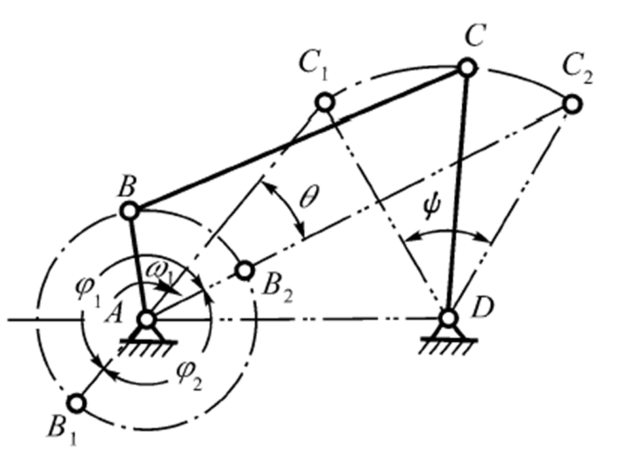
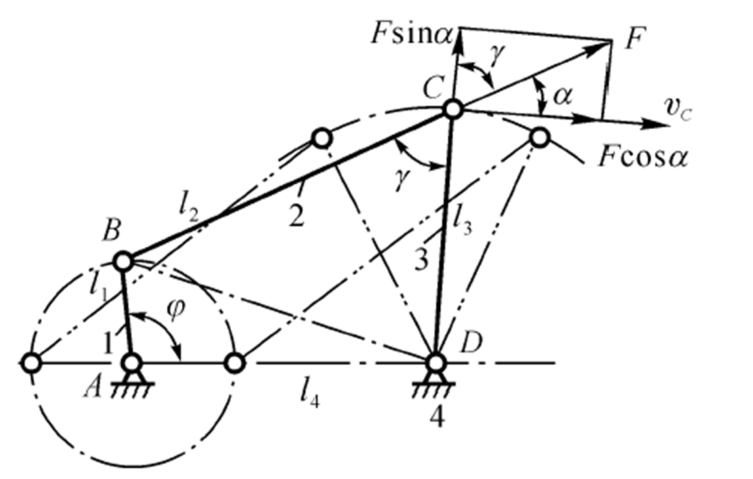
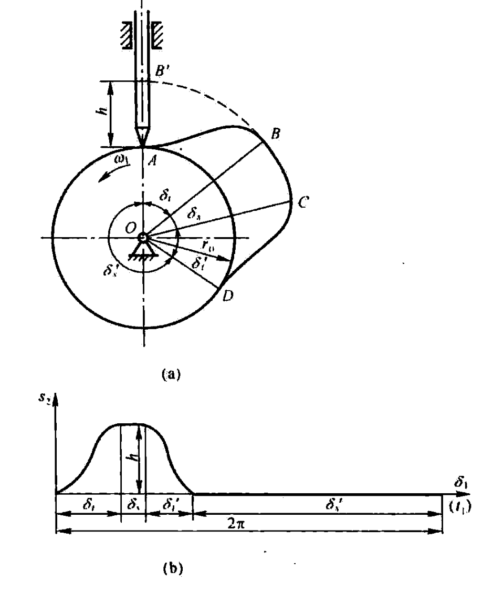
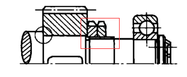

#! https://zhuanlan.zhihu.com/p/640236746
# 机械设计基础 考前补天

笔记源代码 https://github.com/cjyyx/notes/blob/main/%E5%AD%A6%E4%B9%A0%E7%AC%94%E8%AE%B0/%E6%9C%BA%E6%A2%B0%E8%AE%BE%E8%AE%A1%E5%9F%BA%E7%A1%80/%E5%A4%8D%E4%B9%A0.md

## 自由度的计算

$$
F=3 n-2 P_{L}-P_{H}
$$

运动构件数 $n$，低副数 $P_{L}$，高副数 $P_{H}$

高副：点、线接触，应力高; 低副：面接触，应力低

三个或三个以上构件在同一轴线上用间转副相联接构成复合铰链。若有$m$个构件构成同轴复合铰链，则应具有$m-1$个回转副。

- 局部自由度
- 虚约束

## 连杆机构设计与分析

曲柄摇杆机构

摇杆的摆角  $\psi$  : 摇杆  $C D$  在两个极限位置  $C_{1} D$  和  $C_{2} D$  间的夹角

极位夹角  $\theta$  : 曲柄与连杆两共线位置之间所夹的锐角

压力角  $\alpha$  : 从动件驱动力  $F$  与力作用点绝对速度之间所夹锐角。

传动角  $\gamma$  : 压力角的余角,  $\gamma=90^{\circ}-\alpha$  (即连杆与从动摇杆之间所夹锐角)

死点位置

## 凸轮机构设计与分析

基圆：以凸轮的最小向径  $r_{0}$  为半径所作的圆

推程：凸轮将从动件的尖底由最低位置  $A$  推至最高位置  $B^{\prime}$ 

推程运动角  $\delta_{t}$  远休止角  $\delta_{s}$ 

回程: 凸轮将从动件从最高位置  $B^{\prime}$  带回到最低位置  $A$

回程运动角  $\delta_{t}^{\prime}$  近休止角  $\delta_{s}^{\prime}$ 

从动件行程 (b)

压力角  $\alpha$  : 凸轮对从动件的作用力  $F$  的方向与从动 件尖底的速度方向之间所夹的锐角

## 齿轮受力方向和转动方向分析

太难不看

## 轮系传动比计算和转向分析

靠常识

## 轴结构设计的合理性分析和改错

（1）轴应便于加工

（2）轴上零件要易于装拆

为便于轴上零件的装拆，一般轴都做成从轴端逐渐向中间增大的阶梯状。

(a) 装零件的轴端应有倒角

(b) 需要磨削的轴端有砂轮越程槽

(c) 车螺纹的轴端应有退刀槽。

（3）轴和轴上零件要有准确的工作位置（定位）

零件的轴向定位由轴肩或套筒来实现。

轴肩：阶梯轴上截面变化之处。

套筒端面须紧靠被定位零件端面

无法采用套筒或套筒太长时，可采用双圆螺母加以固定

（4）各零件要牢固而可靠地相对固定（固定）

（5）改善应力状况，减小应力集中（强度、刚度）

- 用圆角过渡；
- 尽量避免在轴上开径向孔、切口或凹槽;
- 重要结构可增加卸载槽B、过渡肩环、凹切圆角、增大圆角半径。

## 滚动轴承寿命计算

轴承的基本额定寿命：一批同型号的轴承, 在相同的条件下运转, 其中  $10 \%$  的轴承已发生疲劳点蚀, 而  $90 \%$  的轴承尚末发生疲劳点蚀时所能达到的总转数, 用  $L_{10}$  表示, 单位百万转, 即  $10^{6} \mathrm{r}$  。

$$
L_{10}=\left(\frac{C}{P}\right)^{\varepsilon}
$$

$$
L_{10 h}=\frac{10^{6}}{60 n}\left(\frac{C}{P}\right)^{\varepsilon}
$$

- 寿命指数  $\varepsilon$,  球轴承 3,  滚子轴承  10/3
- 当量动载荷  $P$ 
- 基本额定动载荷  $C$