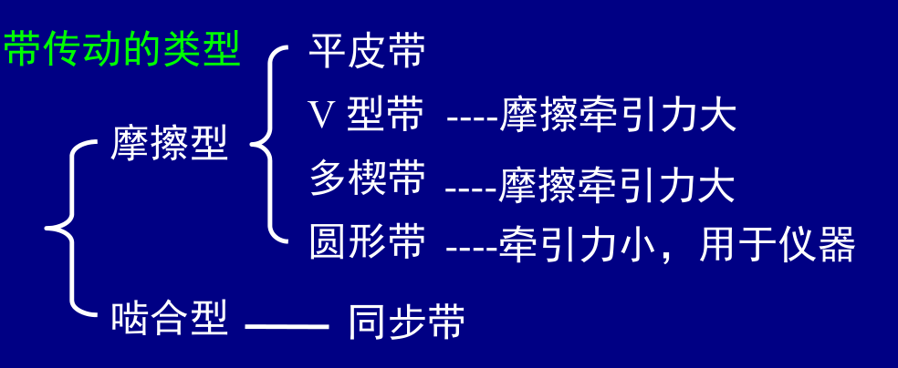
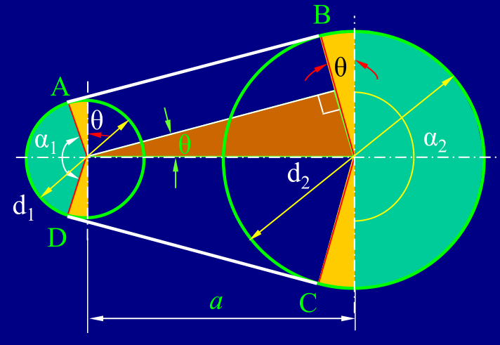
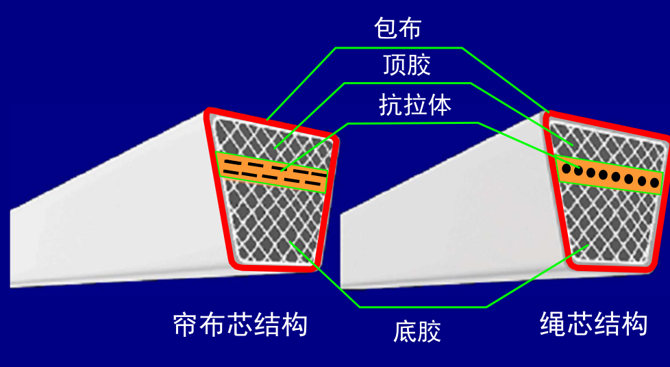

@import "style.css"

# 带 传 动

## 带传动的组成、特点和应用

带传动的组成：主动轮1、从动轮2、环形带3

带传动的几何关系

<!--  -->

中心距$a$

包角$\alpha$

<!-- 
$$\theta \approx \sin \theta=\frac{d_{2}-d_{1}}{2 a}$$

$$\alpha=\pi \pm 2 \theta$$ -->

$$
\alpha=\pi \pm \frac{d_{2}-d_{1}}{a}
$$

$$\alpha=180^{\circ} \pm \frac{d_{2}-d_{1}}{a} \times 57.3^{\circ}$$

带长$L$

$$L \approx 2 a+\frac{\pi}{2}\left(d_{1}+d_{2}\right)+\frac{\left(d_{2}-d_{1}\right)^{2}}{4 a}$$

$$a \approx \frac{2 L-\pi\left(d_{1}+d_{2}\right)+\sqrt{\left[2 L-\pi\left(d_{1}+d_{2}\right)\right]^{2}-8\left(d_{2}-d_{1}\right)^{2}}}{8}$$

带传动安装时必须把带张紧在带轮上，当带工作一段时间之后，因带永久伸长而松弛时，还应当重新张紧。

带传动的张紧方法：
- 调整中心距
- 采用张紧轮
- 自动张紧

带传动的优点：
1. 适用于中心距较大的传动；
2. 带具有良好的挠性，可缓和冲击、吸收振动；
3. 过载时带与带轮之间会出现打滑，避免了其它零件的坏；
4. 结构简单、成本低廉。

带传动的缺点：
1. 传动的外廓尺寸较大；
2. 需要张紧装置；
3. 由于带的滑动，不能保证固定不变的传动比；
4. 带的寿命较短；
5. 传动效率较低。

## V带和V带轮

V带组成：强力层、压缩层、包封层

节线：弯曲时保持原长不变的一条周线。
节面：全部节线构成的面。

V带参数：
顶宽b
节宽 b p
高度 h
楔角θ =40 ˚
基准直径d d ：在V带轮上，与所配用V带的节面宽度相
对应的带轮直径。
d d
基准长度L d ：V带在规定的张紧力下，位于带轮基准
直径上的周线长度。