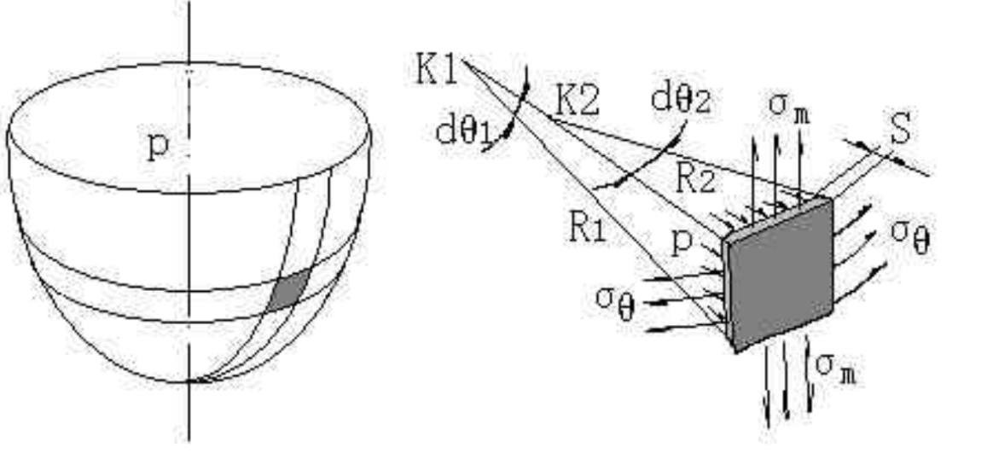
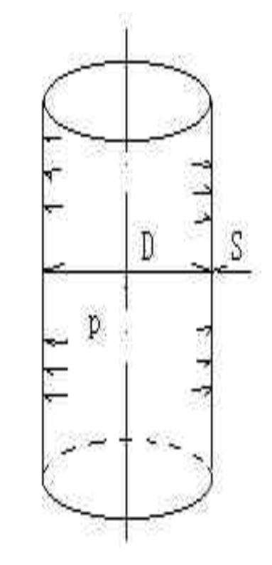

## 壳体受气体内压时存在的应力

$$
\frac{\sigma_{m}}{R_{1}}+\frac{\sigma_{\theta}}{R_{2}}=\frac{p}{S}
$$

$$
\sigma_{\mathrm{m}}=\frac{p R_{2}}{2 S}
$$

### 圆简形壳体

$$
\sigma_{m}=\frac{p D}{4 S}
$$

$$
\sigma_{\theta}=\frac{p D}{2 S}
$$

- $\sigma_{m}$ 经向应力
- $\sigma_{\theta}$ 环向应力