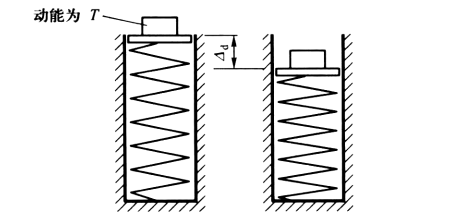

# 动载荷

## 动静法

惯性力，达朗贝尔原理

$$
\sigma_{\mathrm{d}}=K_{\mathrm{d}} \sigma_{\mathrm{st}}
$$

- $\sigma_{\mathrm{d}}$：动应力
- $\sigma_{\mathrm{st}}$：静应力
- $K_{\mathrm{d}}$：动荷因数

## 杆件受冲击时的应力和变形

这些杆件看作是弹簧. 忽略弹簧的质量, 只考虑其弹性, 便简化成一个自由度的运动系统。

设冲击物与弹簧开始接触的瞬时动能为  $T$ ; 由于弹簧的阻抗, 当弹簧变形到达最大位置时, 系统的速度变为零, 弹簧的变形为  $\Delta_{\mathrm{d}}$  . 

$$
\Delta_{\mathrm{d}}=K_{\mathrm{d}} \Delta_{\mathrm{st}}, \quad F_{\mathrm{d}}=K_{\mathrm{d}} P, \quad \sigma_{\mathrm{d}}=K_{\mathrm{d}} \sigma_{\mathrm{st}}
$$

- $\Delta_{\mathrm{st}}$：静变形
- $P$：重物
- $\sigma_{\mathrm{st}}$：静应力
- $K_{\mathrm{d}}$：冲击动荷因数

$$
K_{\mathrm{d}}=\frac{\Delta_{\mathrm{d}}}{\Delta_{\mathrm{st}}}=1+\sqrt{1+\frac{2 T}{P \Delta_{\mathrm{st}}}}
$$

**一般原理**

能量守恒定律, 冲击系统的动能和势能的变化应等于弹簧的应变能

$$
\Delta T+\Delta V=V_{\mathrm{\varepsilon d}}
$$

动载荷完成的功等于弹簧的应变能

$$
V_{\mathrm{\varepsilon d}}=\frac{1}{2} F_{\mathrm{d}} \Delta_{\mathrm{d}}
$$

线弹性范围内

$$
\frac{F_{\mathrm{d}}}{F_{\mathrm{st}}}=\frac{\Delta_{\mathrm{d}}}{\Delta_{\mathrm{st}}}=\frac{\sigma_{\mathrm{d}}}{\sigma_{\mathrm{st}}}
$$

$F_{\mathrm{st}}$ 为与动载荷同方向同作用点的静载荷

有冲击动荷因数

$$
K_{\mathrm{d}}=\frac{\Delta_{\mathrm{d}}}{\Delta_{\mathrm{st}}}
$$

