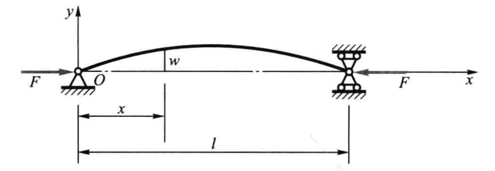
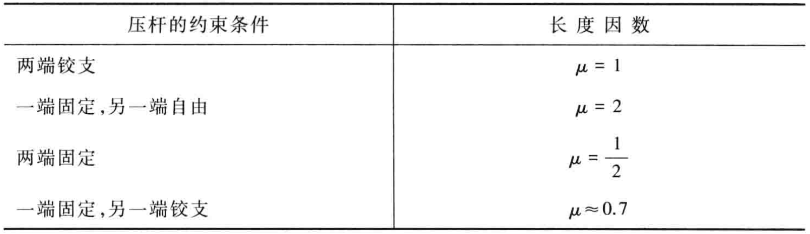
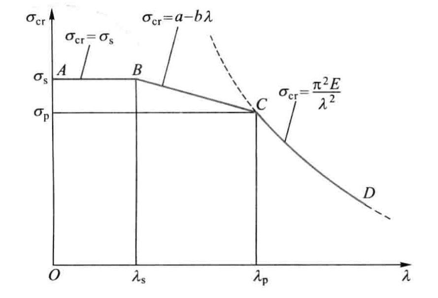

# 压杆稳定

细长杆件受压时，压弯。

压杆丧失其直线形状的平衡而过渡为曲线平衡, 称为丧失稳定性, 简称**失稳**, 也称为屈曲。压力的极限值称为临界压力或**临界力**, 记为  $F_{\mathrm{cr}}$  。

## 两端铰支细长压杆的临界压力

$$
F_{\mathrm {cr }}=\frac{\pi^{2} E I}{l^{2}}
$$

## 其他支座条件下细长压杆的临界压力

<!-- 
对于一端固定、另一端自由且长为  $l$  的压杆, 其临界压力等于两端铰支长为  $2 l$  的压杆的临界压力, 即

$$
F_{\mathrm{cr}}=\frac{\pi^{2} E I}{(2 l)^{2}}
$$

两端都是固定端约束

$$
F_{\mathrm{cr}}=\frac{\pi^{2} E I}{\left(0.5 l\right)^{2}}
$$

一端为固定端，另一端为饺支座 

$$
F_{\mathrm{cr}} \approx \frac{\pi^{2} E I}{(0.7 l)^{2}}
$$ -->

欧拉公式

$$
F_{\mathrm{cr}}=\frac{\pi^{2} E I}{(\mu l)^{2}}
$$

- $\mu l$  表示把压杆折算成两端较支杆的长度, 称为**相当长度**
- $\mu$  称为长度因数

## 欧拉公式的适用范围 经验公式

临界压力对应的应力

$$
\sigma_{\mathrm{cr}}=\frac{F_{\mathrm{cr}}}{A}
$$

定义惯性半径  $i$

$$
I=i^{2} A
$$

定义柔度或长细比  $\lambda$

$$
\lambda=\frac{\mu l}{i}
$$

则有

$$
\sigma_{\mathrm{cr}}=\frac{\pi^{2} E}{\lambda^{2}}
$$

只有临界应力小于比例极限  $\sigma_{\mathrm{p}}$  时, 欧拉公式才适用

$$
\frac{\pi^{2} E}{\lambda^{2}} \leqslant \sigma_{\mathrm{p}} \quad \text { 或 } \quad \lambda \geqslant \pi \sqrt{\frac{E}{\sigma_{\mathrm{p}}}} = \lambda_{\mathrm{p}}
$$

若压杆的柔度  $\lambda$  小于  $\lambda_{\mathrm{p}}$ ,  有两种经验公式

直线公式

$$
\sigma_{\mathrm{cr}}=a-b \lambda
$$

抛物线公式

$$
\sigma_{\mathrm{cr}}=a_{1}-b_{1} \lambda^{2}
$$

## 压杆的稳定性校核

工作安全因数应大于规定的稳定安全因数

$$
n=\frac{F_{\mathrm{er}}}{F} \geqslant n_{\mathrm{st}}
$$