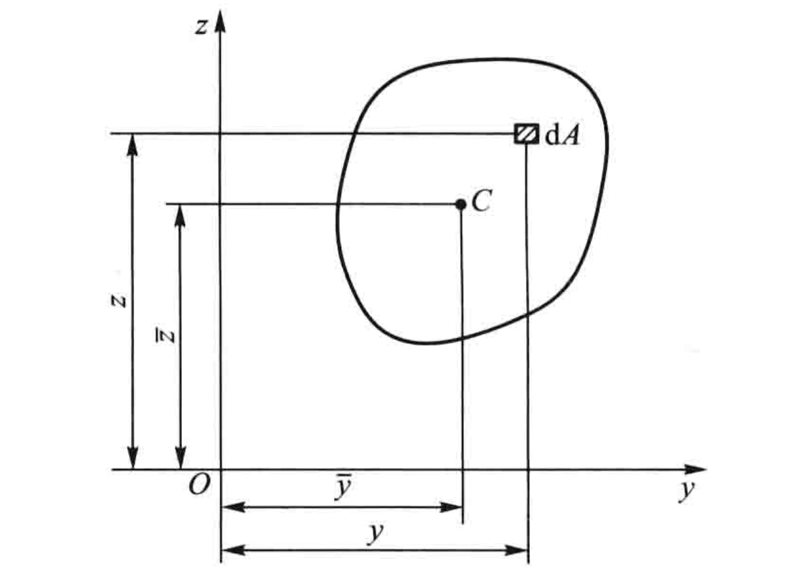

# 平面图形的几何性质

## 静矩和形心

建立材料力学问题的直角坐标系时，通常用 $x$ 轴表示杆的轴线方向，用 $y$ 轴和 $z$ 轴表示杆的横向，即横截面所在平面。

$$
S_{z}=\int_{A} y \mathrm{~d} A, \quad S_{y}=\int_{A} z \mathrm{~d} A
$$

分别定义为图形对 $z$ 轴和 $y$ 轴的**静矩**，也称为图形对 $z$ 轴和 $y$ 轴的一次矩。

$$
\bar{y}=\frac{S_{z}}{A}, \quad \bar{z}=\frac{S_{y}}{A}
$$

确定平面图形的**形心**坐标的公式。

由静矩的定义可知，图形各组成部分对某一轴的静矩的代数和，等于整个图形对同一轴的静矩。

## 惯性矩和惯性半径

$$
I_{y}=\int_{A} z^{2} \mathrm{~d} A, \quad I_{z}=\int_{A} y^{2} \mathrm{~d} A
$$

定义为图形对 $z$ 轴和 $y$ 轴的**惯性矩**，也称为图形对 $z$ 轴和 $y$ 轴的二次矩。

$$
i_{y}=\sqrt{\frac{I_{y}}{A}}, \quad i_{z}=\sqrt{\frac{I_{z}}{A}}
$$

称为图形对 $z$ 轴和 $y$ 轴的**惯性半径**。

$$
I_{\mathrm{p}}=\int_{A} \rho^{2} \mathrm{~d} A
$$

定义为图形对坐标原点 $O$ 的**极惯性矩**。其中 $\rho$ 表示微面积 $\mathrm{d} A$ 到坐标原点 $O$ 的距离。

图形对任意一对互相垂直的轴的惯性矩之和，等于它对该两轴交点(坐标原点)的极惯性矩。

当一个平面图形是由若干个简单的图形组成时，根据惯性矩的定义，可先算出每一个简单图形对同一轴的惯性矩，然后求其总和，即等于整个图形对于这一轴的惯性矩。

## 惯性积

$$
I_{y z}=\int_{A} y z \mathrm{~d} A
$$

定义为图形对 $y,z$ 轴的惯性积。

坐标系的两根坐标轴中只要有一根为图形的对称轴，则图形对这一坐标系的惯性积就等于零。

## 平行移轴公式

$C$  为图形的形心,  $y_{C}$  和  $z_{C}$  是通过形心的坐标轴。图形对形心轴  $y_{C}$  和  $z_{C}$  的惯性矩和惯性积分别记为

$$
I_{y_{C}}=\int_{A} z_{C}^{2} \mathrm{~d} A, \quad I_{z_{C}}=\int_{A} y_{C}^{2} \mathrm{~d} A, \quad I_{y_{C} z_{C}}=\int_{A} y_{C} z_{C} \mathrm{~d} A
$$

若有一坐标系，  $y$  轴平行于  $y_{C}$ , 且两者的距离为  $a$ ; $z$  轴平行于  $z_{C}$ , 且两者的距离为  $b$ , 图形对  $y$  轴和  $z$  轴的惯性矩和惯性积应为

$$
I_{y}=\int_{A} z^{2} \mathrm{~d} A, \quad I_{z}=\int_{A} y^{2} \mathrm{~d} A, \quad I_{y z}=\int_{A} y z \mathrm{~d} A
$$

由于

$$
y=y_{C}+b, \quad z=z_{C}+a
$$

则有平行移轴公式

$$
\begin{array}{l}
I_{y}=I_{y_{C}}+a^{2} A \\
I_{z}=I_{z_{C}}+b^{2} A \\
I_{y z}=I_{y_{C} z_{C}}+a b A
\end{array}
$$

其中

$$
A = \int_{A} \mathrm{~d} A
$$

## 转轴公式 主惯性轴

平面图形对 $y$ 轴和 $z$ 轴的惯性矩和惯性积为

$$
I_{y}=\int_{A} z^{2} \mathrm{~d} A, \quad I_{z}=\int_{A} y^{2} \mathrm{~d} A, \quad I_{y z}=\int_{A} y z \mathrm{~d} A
$$

若将坐标轴绕  $O$  点旋转  $\alpha$  角, 且以逆时针转向为正, 旋转后得新的坐标轴  $y_{1}, z_{1}$ , 而图形对  $y_{1}, z_{1}$  轴的惯性矩和惯性积则应分别为

$$
I_{y_{1}}=\int_{A} z_{1}^{2} \mathrm{~d} A, \quad I_{z_{1}}=\int_{A} y_{1}^{2} \mathrm{~d} A, \quad I_{y_{1} z_{1}}=\int_{A} y_{1} z_{1} \mathrm{~d} A
$$

则有

$$
I_{y_{1}}=\dfrac{I_{y}+I_{z}}{2}+\dfrac{I_{y}-I_{z}}{2} \cos 2 \alpha-I_{y z} \sin 2 \alpha
$$

$$
I_{z_{1}}=\dfrac{I_{y}+I_{z}}{2}-\dfrac{I_{y}-I_{z}}{2} \cos 2 \alpha+I_{y z} \sin 2 \alpha
$$

$$
I_{y_{1} z_{1}}=\dfrac{I_{y}-I_{z}}{2} \sin 2 \alpha+I_{y z} \cos 2 \alpha
$$

令 $\dfrac{\mathrm{d} I_{y_{1}}}{\mathrm{~d} \alpha}=0$，则有

$$
\tan 2 \alpha=-\frac{2 I_{y z}}{I_{y}-I_{z}}
$$

该式可以解出相差  $90^{\circ}$  的两个角度  $\alpha$ , 从而确定了一对坐标轴  $y_{0}$  和  $z_{0}$  。图形对这一对轴中的一个轴的惯性矩为最大值  $I_{\text {max }}$ , 而对另一个轴的惯性矩则为最小值  $I_{\text {min }}$  。此外，使导数  $\dfrac{\mathrm{d} I_{y_{1}}}{\mathrm{~d} \alpha}=0$  的角度  $\alpha$  恰好 使惯性积等于零。所以, 当坐标轴绕  $O$  点旋转到某一位置  $y_{0}$  和  $z_{0}$  时, 图形对这一对坐标轴的惯性积等于零, 这一对坐标轴称为**主惯性轴**, 简称为主轴。对主惯性轴的惯性矩称为**主惯性矩**。如上所述, 对通过  $O$  点的所有轴来说,对主轴的 两个主惯性矩, 一个是最大值另一个是最小值。

通过图形形心C的主惯性轴称为形心主惯性轴，图形对该轴的惯性矩就称为形心主惯性矩。如果这里所说的平面图形是杆件的横截面，则截面的形心主惯性轴与杆件轴线所确定的平面，称为形心主惯性平面。杆件横截面的形心主惯性轴、形心主惯性矩和杆件的形心主惯性平面，在杆件的弯曲理论中有重要意义。截面对于对称轴的惯性积等于零，截面形心又必然在对称轴上，所以截面的对称轴就是形心主惯性轴，它与杆件轴线确定的纵向对称面就是形心主惯性平面。

截面对通过同一点的任意一对相互垂直的坐标轴的两惯性矩之和为一常数，即等于截面对坐标原点的极惯性矩。

