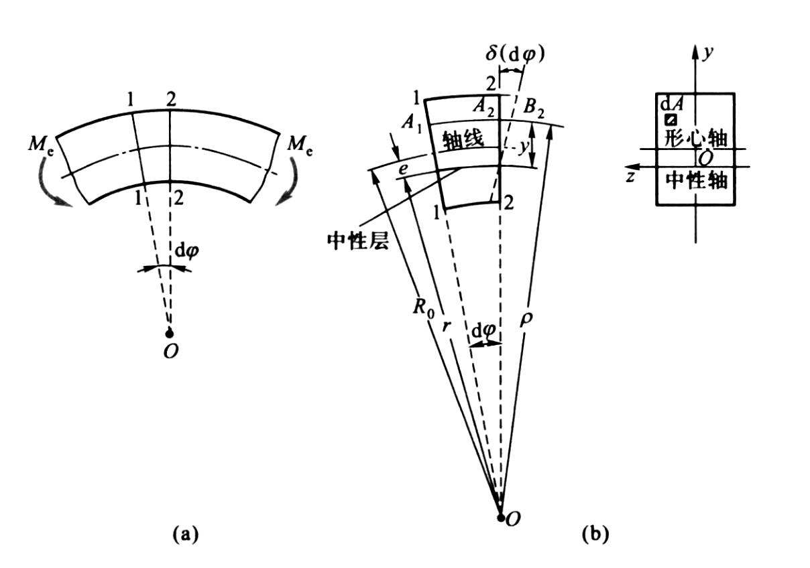
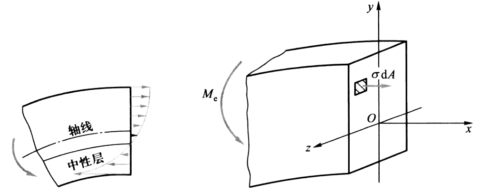
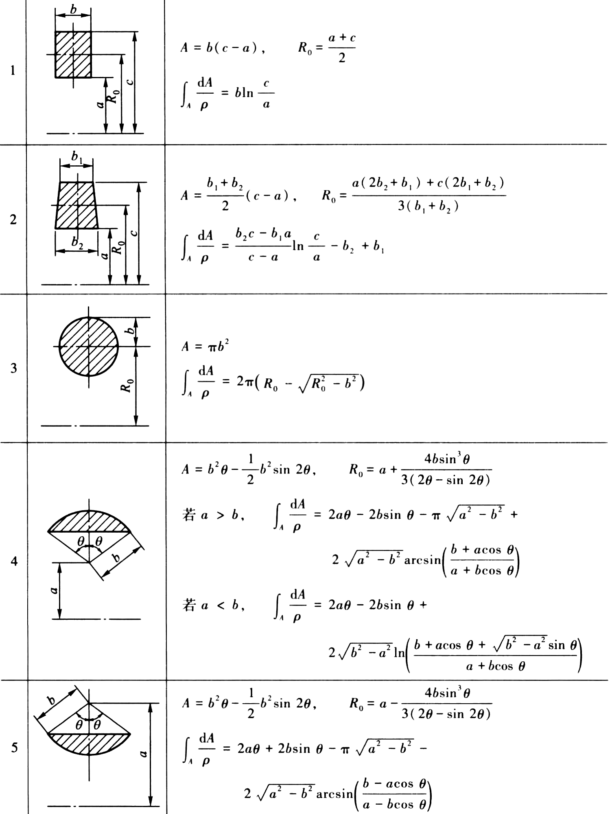

# 平面曲杆

- 平面曲杆：曲杆有一纵向对称面，因而横截面有一对称轴，轴线是纵向对称面中的平面曲线
- 对称弯曲：作用于曲杆上的载荷都在纵向对称面内，由于对称，变形后的曲杆轴线将仍是纵向对称面内的曲线

需要考虑轴线的曲率

## 曲杆纯弯曲时的正应力

假设

- 平面假设
- 纵向纤维间无正应力

$$
\varepsilon = \frac{y}{\rho} \frac{\delta(\mathrm{d} \varphi)}{\mathrm{d} \varphi}
$$

$$
\sigma=E \varepsilon
$$

中性层的曲率半径

$$
r=\frac{A}{\int_{A} \frac{\mathrm{d} A}{\rho}}
$$

截面上的应力

$$
\sigma=\frac{M y}{S \rho}
$$

- $y$：该点到中性轴的距离
- $\rho$：该点到曲率中心的距离
- $S=A e$：整个横截面对中性轴的静矩

