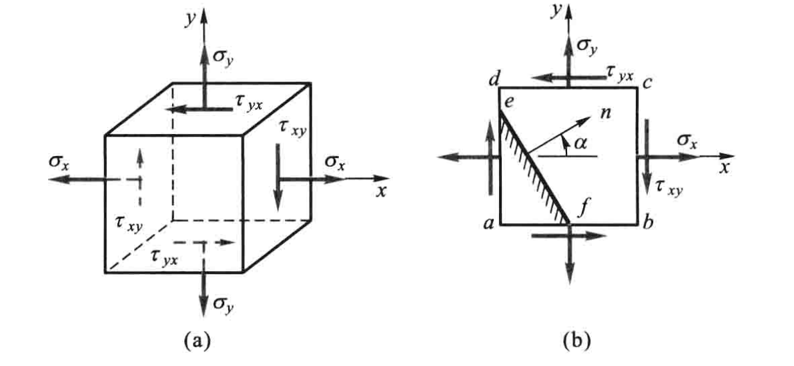
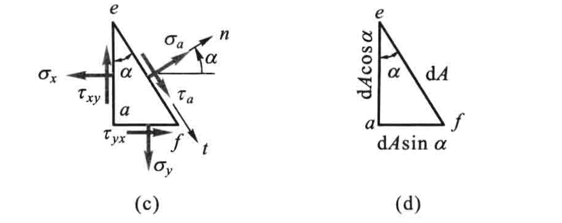
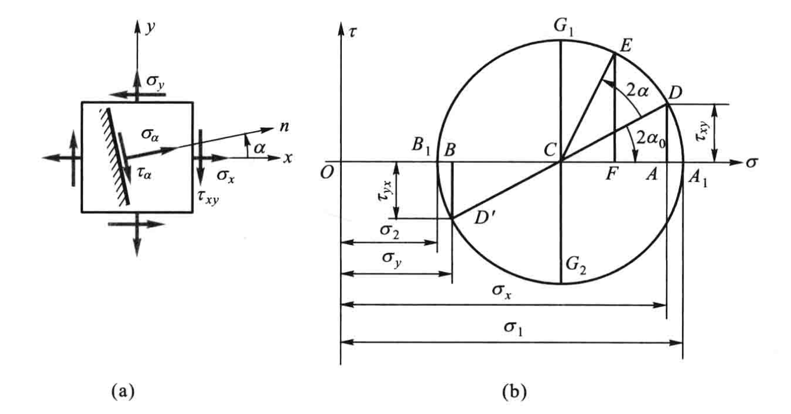
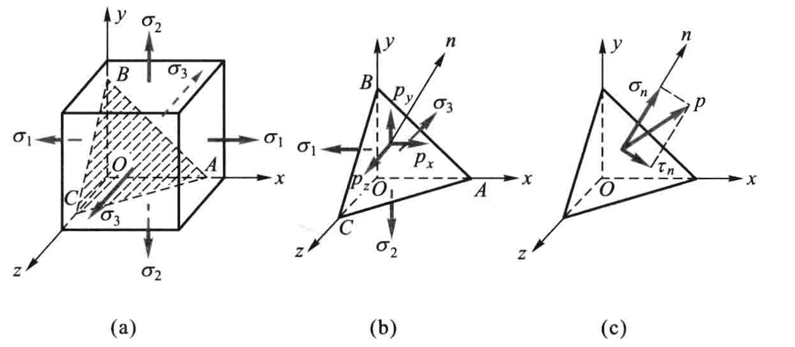
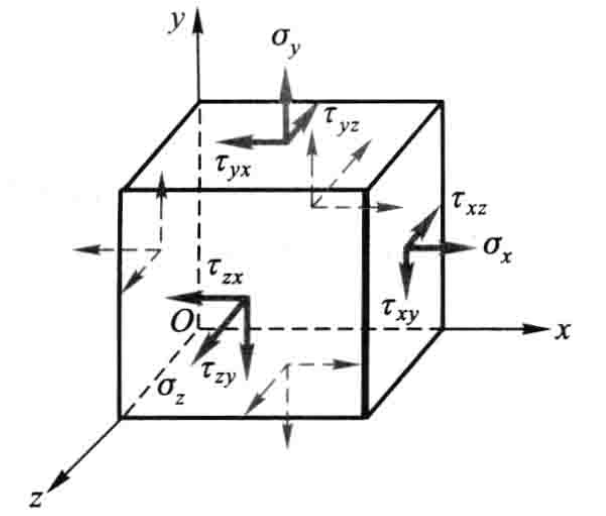
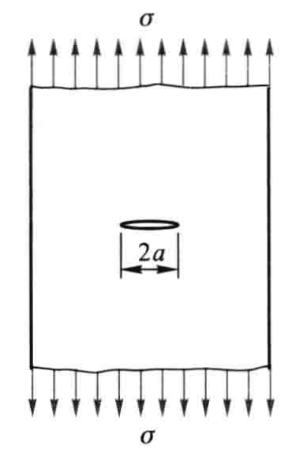

# 应力和应变分析

## 应力状态概述

杆件内不同位置的点通常具有不同的应力。所以，一点的应力是该点坐标的函数。就一点而言，通过这一点的截面可以有不同的方位，而截面上的应力又随截面的方位而变化。

围绕一点取出的单元体，一般在三个方向上的尺寸均为无穷小。以致可以认为，在它的每个面上，应力都是均匀的；且在单元体内相互平行的截面上，应力都是相同的，同等于通过该点的平行面上的应力。所以这样的单元体的应力状态可以代表一点的应力状态。研究通过一点的不同截面上的应力变化情况，就是应力分析的内容。

单元体的三个相互垂直的面上都无切应力，这种切应力等于零的面称为**主平面**。主平面上的正应力称为**主应力**。通过受力构件的任意点皆可找到三个相互垂置的主平面，因而每一点都有三个主应力。对简单拉伸（或压缩），三个主应力中只有一个不等于零，称为单向应力状态。若三个主应力中有两个不等于零，称为二向应力状态。当三个主应力皆不等于零时，称为三向应力状态。单向应力状态也称为简单应力状态，二向和三向应力状态也统称为复杂应力状态。

## 二向应力状态分析——解析法

单元体的各面上, 设应力分量  $\sigma_{x}, \sigma_{y}, \tau_{x y}$  和  $\tau_{y x}$  皆为已知, 其余各应力分量均为零, 这种应力状态称为平面应力状态。

关于应力的符号规定为：正应力以拉应力为正而压应力为负；切应力对单元体内任意点的矩为顺时针转向时，规定为正，反之为负。

取任意斜截面  $e f$ , 其外法线  $n$  与  $x$  轴的夹角为  $\alpha$  。规定: 由  $x$  轴转到外法线  $n$  为逆时针转向时, 则  $\alpha$  为正。截面  $e f$  把单元体分成两部分。 斜截面  $e f$  上的应力有正应力  $\sigma_{\alpha}$  和切应力  $\tau_{\alpha}$  ，  $e f$  面的面积为  $\mathrm{d} A$ 。

根据切应力互等定理，$\tau_{x y}=\tau_{y x}$，则根据平衡方程

$$
\sigma_{\alpha}=\frac{\sigma_{x}+\sigma_{y}}{2}+\frac{\sigma_{x}-\sigma_{y}}{2} \cos 2 \alpha-\tau_{x y} \sin 2 \alpha
$$

$$
\tau_{\alpha}=\frac{\sigma_{x}-\sigma_{y}}{2} \sin 2 \alpha+\tau_{x y} \cos 2 \alpha
$$

对主平面，$\alpha = \alpha_{0}$，此时正应力为最大值或最小值，切应力为零。

$$
\tan 2 \alpha_{0}=-\frac{2 \tau_{x y}}{\sigma_{x}-\sigma_{y}}
$$

$$
\left.\begin{array}{l}
\sigma_{\max } \\
\sigma_{\min }
\end{array}\right\}=\frac{\sigma_{x}+\sigma_{y}}{2} \pm \sqrt{\left(\frac{\sigma_{x}-\sigma_{y}}{2}\right)^{2}+\tau_{x y}^{2}}
$$

公式确定的两个角度  $\alpha_{0}$  中, 将其中一个角度  $\alpha_{01}$  限定在  $\left(-\dfrac{\pi}{4}, \dfrac{\pi}{4}\right)$  之 间, 并取另一个角度为  $\alpha_{02}=\alpha_{01}+\dfrac{\pi}{2}$ , 则绝对值较小的一个确定  $\sigma_{\text {max }}$  所在的平面。

最大和最小切应力所在平面与主平面的夹角为 45°。

在求出截面上一点主应力的方向后，把其中一个主应力的方向延长与相邻横截面相交。求出交点的主应力方向，再将其延长与下一个相邻横截面相交。依次类推，将得到一条折线，它的极限将是一条曲线。在这样的曲线上，任一点的切线即代表该点主应力的方向。这种曲线称为**主应力迹线**。经过每一点有两条相互垂直的主应力迹线。

## 二向应力状态分析——图解法

平面应力状态下，在法线倾角为 $\alpha$ 的斜面上，有

$$
\left(\sigma_{\alpha}-\frac{\sigma_{x}+\sigma_{y}}{2}\right)^{2}+\tau_{\alpha}^{2}=\left(\frac{\sigma_{x}-\sigma_{y}}{2}\right)^{2}+\tau_{x y}^{2}
$$

因为  $\sigma_{x}, \sigma_{y}, \tau_{x y}$  皆为已知量, 所以该式是一个以  $\sigma_{\alpha}$  和  $\tau_{\alpha}$  为变量的圆方程。若以横坐标表示  $\sigma$ , 纵坐标表示  $\tau$ , 则圆心的横坐标为  $\dfrac{1}{2}\left(\sigma_{x}+\sigma_{y}\right)$ , 纵坐标为零。圆周的半径为  $\sqrt{\left(\dfrac{\sigma_{x}-\sigma_{y}}{2}\right)^{2}+\tau_{x y}^{2}}$  。这一圆周称为应力圆。

## 三向应力状态

这里只讨论当三个主应力已知时，任意斜截面上的应力计算。

以任意斜截面  $A B C$  从单元体中取出四面体。设  $A B C$  的法 线  $n$  的三个方向余弦为  $l, m, n$ , 它们应满足关系式

$$
l^{2}+m^{2}+n^{2}=1
$$

现将斜截面  $A B C$  上的应力分解成平行于  $x, y, z$  轴的三个分量  $p_{x}, p_{y}, p_{z}$  。由四面体的平衡方程得

$$
p_{x}=\sigma_{1} l, \quad p_{y}=\sigma_{2} m, \quad p_{z}=\sigma_{3} n
$$

还可以把总应力分解成与斜截面垂直的正应力  $\sigma_{n}$  和相切的切应力  $\tau_{n}$

$$
\sigma_{n}=\sigma_{1} l^{2}+\sigma_{2} m^{2}+\sigma_{3} n^{2}
$$

$$
\tau_{n}^{2}=\sigma_{1}^{2} l^{2}+\sigma_{2}^{2} m^{2}+\sigma_{3}^{2} n^{2}-\sigma_{n}^{2}
$$

## 位移与应变分量

构件各点的位移和应变都发生于同一平面内的情况称为平面应变问题.

pass

## 广义胡克定律

在最普遍的情况下, 描述一点的应力状态需要 9 个应力分量。考虑到切应力互等定理,  $\tau_{x y}$  和  $\tau_{y x}$, $\tau_{y z}$  和  $\tau_{z y}$, $\tau_{z x}$  和  $\tau_{x z}$  都分别数值相等。这样, 原来的 9 个应力分量中独立的就只有 6 个。这种普遍情况, 可以看作是三组单向应力和三组纯剪切的组合。

### 各向同性材料

对于各向同性材料, 当变形很小且在线弹性范围内时, 线应变只与正应力有关, 而与切应力无关; 切应变只与切应力有关, 而与正应力无关。则有

$$
\begin{aligned}
\varepsilon_{x}=\dfrac{1}{E}\left[\sigma_{x}-\mu\left(\sigma_{y}+\sigma_{z}\right)\right] \\
\varepsilon_{y}=\dfrac{1}{E}\left[\sigma_{y}-\mu\left(\sigma_{z}+\sigma_{x}\right)\right] \\
\varepsilon_{z}=\dfrac{1}{E}\left[\sigma_{z}-\mu\left(\sigma_{x}+\sigma_{y}\right)\right]
\end{aligned}
$$

$$
\gamma_{x y}=\frac{\tau_{x y}}{G}, \quad \gamma_{y z}=\frac{\tau_{y z}}{G}, \quad \gamma_{z x}=\frac{\tau_{z x}}{G}
$$

当单元体的周围六个面皆为主平面时, 在三个坐标平面内的切应变等于零, 故坐标  $x, y, z$  的方向就是主应变的方向。也就是说主应变和主应力的方向是重合的。所以，在主应变用实测的方法得到后, 将其代入广义胡克定律，即可解出主应力。当然，这只适用于各向同性的线弹性材料。

当单元体的周围六个面皆为主平面时，体应变

$$
\theta=\frac{\sigma_{\mathrm{m}}}{K}
$$

其中

$$
K=\frac{E}{3(1-2 \mu)}, \quad \sigma_{\mathrm{m}}=\frac{\sigma_{1}+\sigma_{2}+\sigma_{3}}{3}
$$

$K$  称为体积弹性模量,  $\sigma_{\mathrm{m}}$  是三个主应力的平均值。公式说明, 单位体积的体积改变  $\theta$  只与三个主应力之和有关, 至于三个主应力之间的比例, 对  $\theta$  并无影响。公式还表明,体应变  $\theta$  与平均应力  $\sigma_{\mathrm{m}}$  成正比, 此即**体积胡克定律**。

### 各向异性材料

对于各向异性材料, 广义胡克定律按矩阵的形式写出为

$$
\left\{\begin{array}{l}
\sigma_{x} \\
\sigma_{y} \\
\sigma_{z} \\
\tau_{y z} \\
\tau_{z x} \\
\tau_{x y}
\end{array}\right\}=\left[\begin{array}{llllll}
c_{11} & c_{12} & c_{13} & c_{14} & c_{15} & c_{16} \\
c_{21} & c_{22} & c_{23} & c_{24} & c_{25} & c_{26} \\
c_{31} & c_{32} & c_{33} & c_{34} & c_{35} & c_{36} \\
c_{41} & c_{42} & c_{43} & c_{44} & c_{45} & c_{46} \\
c_{51} & c_{52} & c_{53} & c_{54} & c_{55} & c_{56} \\
c_{61} & c_{62} & c_{63} & c_{64} & c_{65} & c_{66}
\end{array}\right]\left\{\begin{array}{c}
\varepsilon_{x} \\
\varepsilon_{y} \\
\varepsilon_{z} \\
\gamma_{y z} \\
\gamma_{z x} \\
\gamma_{x y}
\end{array}\right\}
$$

上式中  $6 \times 6$  的矩阵称为刚度阵, 是对称的且是正定的矩阵, 因此刚度阵是可逆的, 它的逆矩阵称为柔度阵。由于刚度矩阵是对称的, 即  $c_{i j}=c_{j i}$ , 因此各向异性材料的独立材料常数是 21 个。这种晶体材料在结晶学中称为三斜晶系。从公式可以看出, 此时存在拉伸与剪切间的耦合效应, 即正应变不仅与正应力有关, 而且还与切应力有关; 同样, 切应变不仅与切应力有关, 而且还与正应力有关, 因此各向异性材料一点处的主应力方向与主应变的方向不一致。

### 正交各向异性材料

对于正交各向异性材料, 此时材料的每点都有三个相互垂直的对称面, 当坐标方向选为材料主方向时, 广义胡克定律按矩阵的形式写出为

$$
\left\{\begin{array}{l}
\sigma_{x} \\
\sigma_{y} \\
\sigma_{z} \\
\tau_{y z} \\
\tau_{z x} \\
\tau_{x y}
\end{array}\right\}=\left[\begin{array}{cccccc}
c_{11} & c_{12} & c_{13} & 0 & 0 & 0 \\
c_{21} & c_{22} & c_{23} & 0 & 0 & 0 \\
c_{31} & c_{32} & c_{33} & 0 & 0 & 0 \\
0 & 0 & 0 & c_{44} & 0 & 0 \\
0 & 0 & 0 & 0 & c_{55} & 0 \\
0 & 0 & 0 & 0 & 0 & c_{66}
\end{array}\right]\left\{\begin{array}{l}
\varepsilon_{x} \\
\varepsilon_{y} \\
\varepsilon_{z} \\
\gamma_{y z} \\
\gamma_{z x} \\
\gamma_{x y}
\end{array}\right\}
$$

此时独立材料常数只有 9 个。这种的晶体材料在结晶学中称为正交晶系。从公 式可以看出, 若坐标方向选为材料主方向时, 则正应力只引起正应变, 切应力只引起切应变, 即不存在拉伸与剪切间的耦合效应。各种长纤维增强复合材料就是典型的正交各向异性材料, 其纤维铺设的方向和与纤维相垂直的方向即为材料的主方向。

## 复杂应力状态的应变能密度

各向同性材料, 单元体的周围六个面皆为主平面, 应变能密度

$$
v_{\varepsilon}=\frac{1}{2 E}\left[\sigma_{1}^{2}+\sigma_{2}^{2}+\sigma_{3}^{2}-2 \mu\left(\sigma_{1} \sigma_{2}+\sigma_{2} \sigma_{3}+\sigma_{3} \sigma_{1}\right)\right]
$$

单元体的变形一方面表现为体积的增加或减小; 另一方面表现为形状的改变, 即由正方体变为长方体。因此, 应变能密度  $v_{\varepsilon}$  也被认为由两部分组成: (1) 因体积变化而储存的应变能密度  $v_{V}$  。体积变化是指单元体的棱边变形相等, 变形后仍为正方体, 只是体积发生变化的情况。  $v_{V}$  称为体积改变能密度。(2) 体积不变, 但由正方体改变为长方体而储存的应变能密度  $v_{\mathrm{d}}$ 。 $v_{\mathrm{d}}$  称为畸变能密度。

$$
v_{\varepsilon}=v_{V}+v_{\mathrm{d}}
$$

其中

$$
v_{V}=\frac{3(1-2 \mu)}{2 E} \sigma_{\mathrm{m}}^{2}=\frac{1-2 \mu}{6 E}\left(\sigma_{1}+\sigma_{2}+\sigma_{3}\right)^{2}
$$

$$
v_{\mathrm{d}}=\frac{1+\mu}{6 E}\left[\left(\sigma_{1}-\sigma_{2}\right)^{2}+\left(\sigma_{2}-\sigma_{3}\right)^{2}+\left(\sigma_{3}-\sigma_{1}\right)^{2}\right]
$$

## 强度理论

### 最大拉应力理论(第一强度理论)

这一理论认为最大拉应力是引起断裂的主要因素。即认为无论是什么应力状态,只要最大拉应力达到与材料性质有关的某一极限值,则材料就发生断裂。

单向应力状态, 最大拉应力 $\sigma_{1}$

$$
\sigma_{1} \leqslant[\sigma]
$$

### 最大伸长线应变理论(第二强度理论)

这一理论认为最大伸长线应变是引起断裂的主要因素。即认为无论什么应力状态, 只要最大伸长线应变达到与材料性质有关的某一极限值, 材料即发生断裂。

设单向拉伸直到断裂仍可用胡克定律计算应变

$$
\sigma_{1}-\mu\left(\sigma_{2}+\sigma_{3}\right) \leqslant[\sigma]
$$

### 最大切应力理论(第三强度理论)

这一理论认为最大切应力是引起屈服的主要因素。即认为无论什么应力状态, 只要最大切应力达到与材料性质有关的某一极限值, 材料就发生屈服。

任意应力状态下

$$
\tau_{\max }=\frac{\sigma_{1}-\sigma_{3}}{2}
$$

强度条件

$$
\sigma_{1}-\sigma_{3} \leqslant[\sigma]
$$

### 最大畸变能密度理论(第四强度理论)

这一理论认为畸变能密度是引起屈服的主要因素。即认为无论什么应力状态, 只要畸变能密度达到与材料性质有关的某一极限值，材料就发生屈服。

$$
\sqrt{\frac{1}{2}\left[\left(\sigma_{1}-\sigma_{2}\right)^{2}+\left(\sigma_{2}-\sigma_{3}\right)^{2}+\left(\sigma_{3}-\sigma_{1}\right)^{2}\right]} \leqslant[\sigma]
$$

可把四个强度理论的强度条件写成以下统一的形式

$$
\sigma_{\mathrm{r}} \leqslant[\sigma]
$$

式中  $\sigma_{\mathrm{r}}$  称为相当应力。它由三个主应力按一定形式组合而成。按照从第一强度理论到第四强度理论的顺序, 相当应力分别为

$$
\left.\begin{array}{l}
\sigma_{\mathrm{r} 1}=\sigma_{1} \\
\sigma_{\mathrm{r} 2}=\sigma_{1}-\mu\left(\sigma_{2}+\sigma_{3}\right) \\
\sigma_{\mathrm{r} 3}=\sigma_{1}-\sigma_{3} \\
\sigma_{\mathrm{r} 4}=\sqrt{\dfrac{1}{2}\left[\left(\sigma_{1}-\sigma_{2}\right)^{2}+\left(\sigma_{2}-\sigma_{3}\right)^{2}+\left(\sigma_{3}-\sigma_{1}\right)^{2}\right]}
\end{array}\right\}
$$

以上介绍了四种常用的强度理论。铸铁、石料、混凝土、玻璃等脆性材料，通常以断裂的形式失效，宜采用第一和第二强度理论。碳钢、铜、铝等塑性材料，通常以屈服的形式失效，宜采用第三和第四强度理论。

## 莫尔强度理论

$\left[\sigma_{1}\right]$  和  $\left[\sigma_{c}\right]$  分别为材料的抗拉和抗压许用应力。

强度条件

$$
\sigma_{\mathrm{r} M}=\sigma_{1}-\frac{\left[\sigma_{\mathrm{t}}\right]}{\left[\sigma_{c}\right]} \sigma_{3} \leqslant\left[\sigma_{\mathrm{t}}\right]
$$

## 构件含裂纹时的断裂准则

应力强度因子

$$
K_{1}=\sigma \sqrt{\pi a}
$$

断裂准则

$$
K_{1}=K_{\mathrm{lc}}
$$