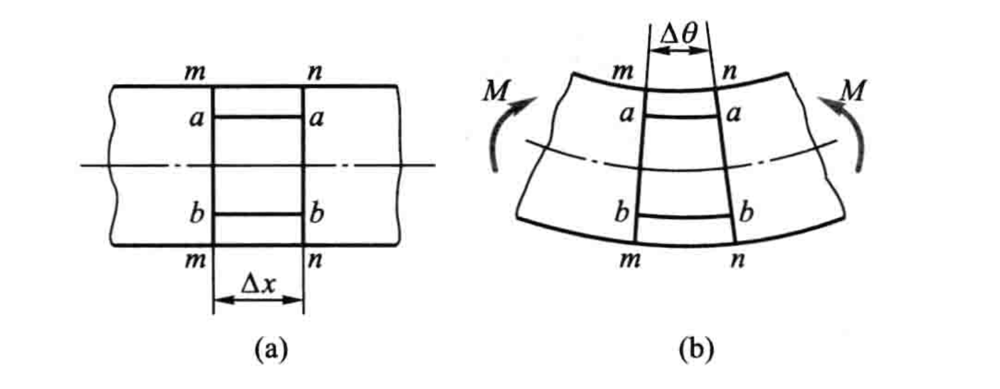
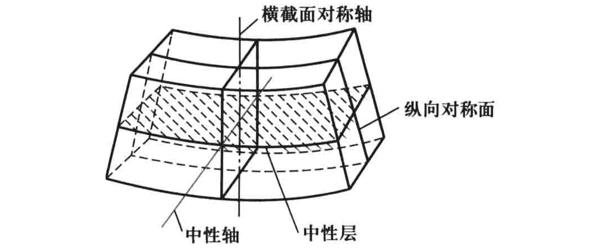
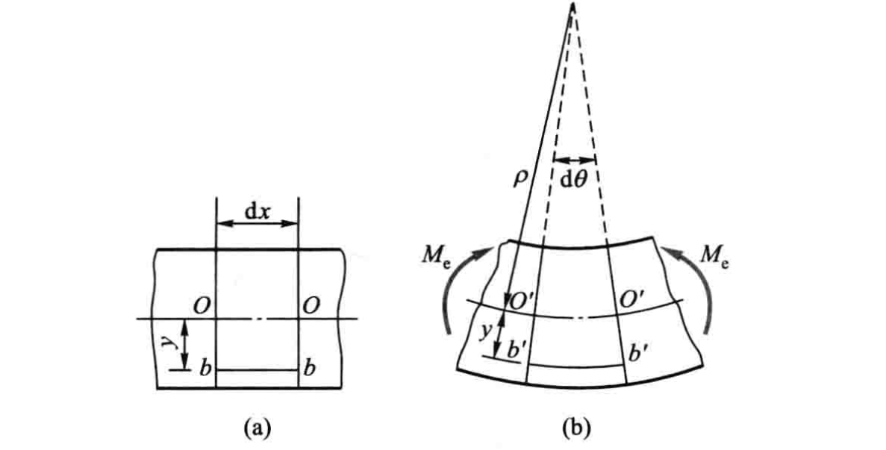
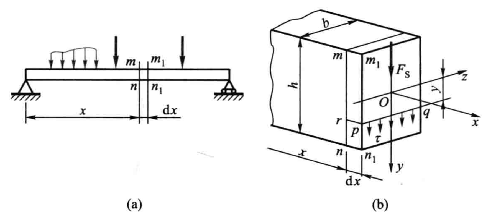
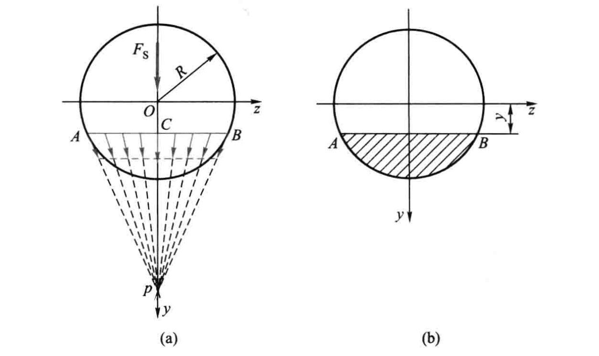

# 弯曲应力

(Internal forces) stresses on the cross section of the bending member

弯曲构件横截面上的（内力）应力

- Bending moment $M$ -> Normal stress $\sigma$
- Shearing force $Q$ -> Shearing stress $\tau$

弯矩 $M$ 与横截面上的正应力 $\sigma$ 相关；
剪力 $F_{s}$ 只与切应力 $\tau$ 相关。

下面将研究正应力 $\sigma$ 和切应力 $\tau$ 的大小和分布规律。

## 梁的纯弯曲

- 纯弯曲：内力只有弯矩，没有剪力
- 横力弯曲：内力既有弯矩，又有剪力

横向线(ab)变形后仍为直线，但有转动；纵向线变为曲线，且上缩下伸；横向线与纵向线变形后仍正交。

两个概念
- 中性层：梁内一层纤维既不伸长也不缩短，因而纤维不受拉应力和压应力，此层纤维称中性层。
- 中性轴：中性层与横截面的交线。

假设
- 平面假设：横截面变形后仍为平面，只是绕中性轴发生转动，距中性轴等高处，变形相等。
- 纵向纤维之间无正应力（纤维内部有）。

## 纯弯曲时的正应力

以梁横截面的对称轴为 $y$ 轴，且向下为正。以中性轴为 $z$ 轴，但中性轴的位置尚待确定。在中性轴尚未确定之前，$x$ 轴只能暂时认为是通过原点的横截面的法线。

设在梁的纵向对称面内，作用大小相等、方向相反的力偶 $M$，构成纯弯曲。

则纵向纤维的应变为

$$
\varepsilon = \frac{y}{\rho}
$$

胡克定律

$$
\sigma =E \varepsilon
$$

静力关系

$$
Q = \int_{A} \sigma \mathrm{d} A=0
$$

$$
M_{y} = \int_{A} z \sigma \mathrm{d} A=0
$$

$$
M_{z} = \int_{A} y \sigma \mathrm{d} A = M
$$

说明 $z$ 轴（中性轴）应通过截面形心；$y$ 轴是横截面的对称轴。

综上可求正应力

$$
\sigma=\frac{M y}{I_{z}}
$$

其中

$$
I_{z} = \int_{A} y^{2} \mathrm{~d} A
$$

## 横力弯曲时的正应力

横力弯曲时，纯弯曲的假设不再成立。但纯弯曲的计算公式不会带来很大的误差。

横力弯曲时，弯矩随截面位置变化。一般情况下，最大正应力发生于弯矩最大的截面上

$$
\sigma_{\max}=\frac{M_{\max}}{W}
$$

其中 $W$ 称为抗弯截面系数，与截面的几何形状有关，单位为 $\text{m}^{3}$。

## 弯曲切应力

### 矩形截面梁

两点假设
- 切应力与剪力平行
- 切应力沿截面宽度均匀分布（沿 $z$ 轴）

在截面高度 $h$ 大于宽度 $b$ 的情况下，以上述假定为基础得到的解，与精确解相比有足够的精确度。

则 $pq$ 上的切应力

$$
\tau=\frac{Q S_{z}^{*}}{I_{z} b}
$$

其中 $S_{z}^{*}$ 为截面上距中性轴为 $y$ 的横线 $pq$ 以下部分的面积（即面 $pn_{1}$，记为 $A_{1}$）对中性轴的静矩

$$
S_{z}^{*}=\int_{A_{1}} y \mathrm{~d} A=\frac{b}{2}\left(\frac{h^{2}}{4}-y^{2}\right)
$$

则有

$$
\tau=\frac{Q}{2 I_{z}}\left(\frac{h^{2}}{4}-y^{2}\right)=\frac{Q}{2 b h}\left(\frac{1}{4}-\left(\frac{y}{h}\right)^{2}\right)
$$

且有

$$
I_{z}=\frac{b h^{3}}{12}
$$

最大切应力发生于中性轴上。

$$
\tau_{\max }=\frac{3}{2} \frac{Q}{b h}
$$

### 工字形截面梁

腹板几乎负担了截面上的全部剪力，而且腹板上的切应力接近于均匀分布。翼缘负担了截面上的大部分弯矩。

$$
\tau = \frac{F_{s}}{b_{0}h_{0}}
$$

### 圆形截面梁

截面边缘上各点的切应力与圆周相切。这样，在水平弦 $AB$ 的两个端点上，与圆周相切的切应力作用线相交于 $y$ 轴上的某点 $p$。可以假设 $AB$ 弦上各点切应力的作用线都通过 $p$ 点；再假设 $AB$ 弦上各点切应力的垂直分量 $\tau_{y}$ 是相等的，则有

$$
\tau_{y}=\frac{Q S_{z}^{*}}{I_{z} b}
$$

式中 $b$ 为 $AB$ 弦的长度，$S_{z}^{*}$ 是图中画阴影线的面积对 $z$ 轴的静矩。

且有

$$
I_{z}=\frac{\pi R^{4}}{4}
$$

在中性轴上，切应力为最大值，且 $S_{z}^{*}=\dfrac{\pi R^{2}}{2} \dfrac{4 R}{3 \pi}$

$$
\tau_{\max }=\frac{4}{3} \frac{Q}{\pi R^{2}}
$$