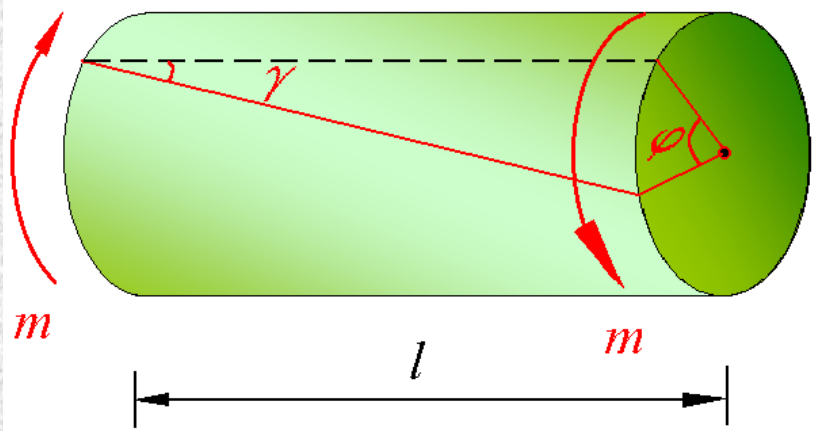
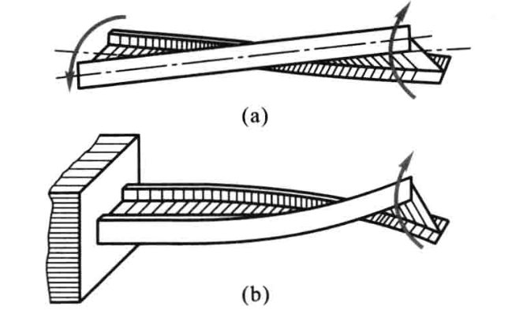
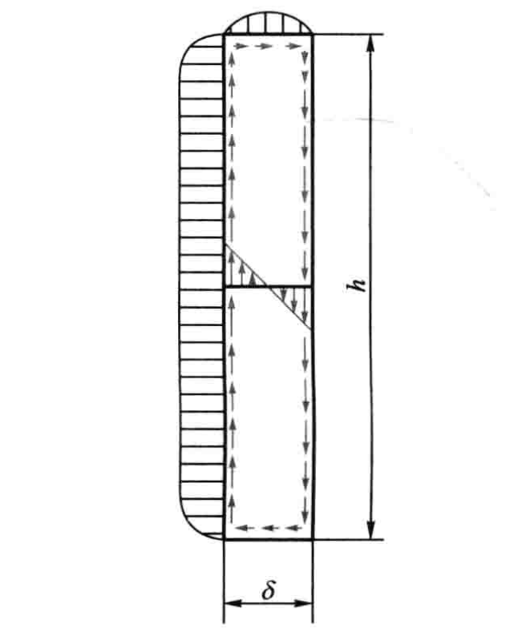

# 扭转

## 扭转的概念

扭转角$\varphi$，弧度制

剪应变$\gamma$

<!-- $$\gamma=\frac{r \varphi}{l}$$

其中$l$为圆筒的长度 -->

## 扭矩

### 外力矩的求法

$$
\left\{M_{\mathrm{e}}\right\}_{\mathrm{N} \cdot \mathrm{m}}=9549 \frac{\{P\}_{\mathrm{kW}}}{\{n\}_{\mathrm{r} / \mathrm{min}}}
$$

### 扭矩和扭矩图

扭矩$T$的符号规定如下：若按右手螺旋法则把$T$表示为矢量，当矢量方向与截面的外法线的方向一致时，$T$为正；反之，为负。也即当力偶矩矢的指向离开截面时为正，反之为负。

截面法求扭矩，且可画出扭矩图

## 纯剪切

### 薄壁圆筒

半径$r$，筒壁厚度$\delta$，外加扭转力矩$M_{e}$，横截面上只有切应力$\tau$，则有

$$
\tau=\frac{M_{\mathrm{e}}}{2 \pi r^{2} \delta}
$$

### 切应力互等定理

材料内部，在相互垂直的两个平面上，切应力必然成对存在，且数值相等；两者都垂直于两个平面的交线，方向则共同指向或共同背离这一交线。这就是切应力互等定理。

### 剪切胡克定律

材料内部单元体的上、下、左、右四个侧面上，只有切应力并无正应力，这种情况称为纯剪切。

剪切胡克定律
$$\tau=G \gamma$$

式中$G$为比例常数，称为材料的切变模量。因$\gamma$量纲为$1$，$G$的量纲与$\tau$相同。钢材的$G$值约为80GPa。

至此，我们已经引用了三个弹性常数，即弹性模量$E$、泊松比$\mu$和切变模量$G$。对各向同性材料，可以证明三个弹性常数$E,G,\mu$之间存在下列关系
$$
G=\frac{E}{2(1+\mu)}
$$

### 剪切应变能

$$
v_{\varepsilon}=\frac{1}{2} \tau \gamma=\frac{\tau^{2}}{2 G}
$$

## 圆轴扭转

### 变形几何关系

圆轴扭转变形前原为平面的横截面，变形后仍保持为平面，形状和大小不变，半径仍保持为直线；且相邻两截面间的距离不变。这就是**圆轴扭转的平面假设**。

距圆心为$\rho$处的切应变为
$$
\gamma_{\rho}=\rho \frac{\mathrm{d} \varphi}{\mathrm{d} x}
$$

切应变发生于垂直于半径的平面内。

### 物理关系

由剪切胡克定律，横截面上距圆心为$\rho$处的切应力为
$$\tau_{\rho}=G \gamma_{\rho}$$

切应力沿半径方向的分布如图

### 静力关系

内力系对圆心的力矩
$$
T=\int_{A} \rho \tau_{\rho} \mathrm{d} A
$$

记
$$
I_{\mathrm{p}}=\int_{A} \rho^{2} \mathrm{~d} A
$$

称为横截面对圆心$O$点的极惯性矩(截面二次极矩)。

综合上式，可推出
$$
\tau_{\rho}=\frac{T \rho}{I_{\mathrm{p}}}
$$

引用记号
$$W_{\mathrm{t}}=\frac{I_{\mathrm{p}}}{R}$$

称为抗扭截面系数，则有
$$\tau_{\max }=\frac{T}{W_{t}}$$

以上各式是以平面假设为基础导出的。试验结果表明，只有对横截面不变的直圆轴，平面假设才是正确的。所以这些公式只适用于等直圆杆。对圆截面沿轴线变化缓慢的小锥度锥形杆，也可近似地用这些公式计算。

建立圆轴扭转的强度条件
$$\tau_{\max }=\frac{T_{\max }}{W_{t}} \leqslant[\tau]$$

### 圆轴在扭转刚性条件下的变形

$$
\frac{\mathrm{d} \varphi}{\mathrm{d} x}=\frac{T}{G I_{p}}
$$

$\mathrm{d} \varphi$表示相距为$\mathrm{d} x$的两个横截面之间的相对转角

单位长度扭转角
$$
\theta=\frac{\mathrm{d} \varphi}{\mathrm{d} x}=\frac{T}{G I_{\mathrm{p}}}
$$

扭转的刚度条件
$$
\theta_{\max }=\frac{|T|_{\max }}{G I_{p}} \leq[\theta]
$$

## 圆柱形密圈螺旋弹簧

螺旋弹簀簧丝的轴线是一条空间螺旋线。当螺旋角$\alpha$很小时，例如$\alpha < 5 ^{\circ}$，可忽略$\alpha$的影响，近似地认为，簧丝横截面与弹簧轴线(亦即与$F$力)在同一平面内。一般将这种弹簧称为密圈螺旋弹簧。此外，当簧丝横截面的直径$d$远小于弹簧圈的平均直径$D$时，还可以略去簧丝曲率的影响，近似地用直圆杆公式计算。

### 弹簧丝横截面上的应力

弹簧最大切应力的修正公式

$$
\tau_{\max }=\left(\frac{4 c-1}{4 c-4}+\frac{0.615}{c}\right) \frac{8 F D}{\pi d^{3}}=k \frac{8 F D}{\pi d^{3}}
$$

其中

$$
c=\frac{D}{d}, \quad k=\frac{4 c-1}{4 c-4}+\frac{0.615}{c}
$$

$c$ 称为弹簧指数，$k$ 为对近似公式的一个修正系数，称为曲度系数。

簧丝的强度条件是

$$
\tau_{\max } \leqslant[\tau]
$$

### 弹簀的变形

弹簧在轴向压力(或拉力)作用下，轴线方向的总缩短(或伸长)量 $\lambda$，就是弹簧的变形。

$$
\lambda=\frac{F}{C}
$$

其中

$$
C=\frac{G d^{4}}{8 D^{3} n}
$$

$C$ 代表弹簧抵抗变形的能力，称为弹簧的刚度系数。

## 非圆截面杆扭转

取一横截面为矩形的杆，在其侧面上画上纵向线和横向周界线，扭转变形后发现横向周界线已变为空间曲线。这表明变形后杆的横截面已不再保持为平面，这种现象称为翘曲。所以，平面假设对非圆截面杆件的扭转不再适用。

非圆截面杆件的扭转可分为自由扭转和约束扭转。

杆件扭转时，横截面上边缘各点的切应力都与截面边界相切。截面凸角处的切应力等于零。

### 矩形截面杆的自由扭转

矩形截面杆的自由扭转：横截面上的切应力分布如图所示；边缘各点的切应力形成与边界相切的顺流；四个角点，上切应力等于零；最大切应力发生于矩形长边的中点。

$$
\tau_{\max }=\frac{T}{\alpha h b^{2}}
$$

式中$h$ 为长边，$b$ 为短边。$\alpha$是一个与比值 $h/b$ 有关的系数。

短边中点的切应力$\tau_{1}$，是短边上的最大切应力

$$
\tau_{1}=\nu \tau_{\max }
$$

式中$\tau_{\max }$ 是长边中点的最大切应力。系数$\nu$ 与比值$h/b$有关。

杆件两端横截面的相对转角$\varphi$ 的计算公式是

$$
\varphi=\frac{T l}{G I_{\mathrm{t}}}
$$

式中$G I_{\mathrm{t}}$ 称为杆件的抗扭刚度

$$
G I_{\mathrm{t}}=G \beta h b^{3}
$$

系数$\beta$ 与比值$h/b$有关。

### 狭长矩形截面杆的自由扭转

特别地，当 $h/b > 10$ 时，截面成为狭长矩形。这时 $\alpha=\beta \approx \frac{1}{3}$

如以 $\delta$ 表示狭长矩形的短边的长度，则有

$$
\tau_{\max }=\frac{3 T}{h \delta^{2}}
$$

$$
\varphi=\frac{3 T l}{G h \delta^{3}}
$$

在狭长矩形截面上，扭转切应力的变化规律大致如图所示。虽然最大切应力在长边的中点，但沿长边各点的切应力实际上变化不大，接近相等，在靠近短边处才迅速减小为零。

## 薄壁杆件的自由扭转

薄壁杆件：壁厚远小于横截面的其他两个尺寸(高和宽)或平均半径。

若杆件的截面中线(薄壁杆横截面的壁厚平分线，也称壁厚中线)是一条不封闭的折线或曲线，则称为开口薄壁杆件。若截面中线是一条封闭的折线或曲线，则称为闭口薄壁杆件。

### 开口薄壁杆件的自由扭转

开口薄壁杆件横截面，可以看作是由若干个狭长矩形组成的。自由扭转时假设横截面在其本身平面内形状不变，则整个横截面和组成截面的各部分的扭转角 $\varphi$ 相等。以 $T$ 表示整个截面上的扭矩，则

$$
\varphi=\frac{T l}{G I_{\mathrm{t}}}
$$

其中 $G I_{\mathrm{t}}$ 即为开口薄壁杆件的抗扭刚度

$$
I_{\mathrm{t}}=\sum \frac{1}{3} h_{i} \delta_{i}^{3}
$$

长边各点的切应力
$$
\tau_{i}=\frac{T \delta_{i}}{I_{\mathrm{t}}}
$$

当各狭长矩形连接处有圆角，翼缘内侧有斜度时

$$
I_{\mathrm{t}}=\eta \cdot \frac{1}{3} \sum h_{i} \delta_{i}^{3}
$$

式中 $\eta$ 为修正因数。对角钢 $\eta= 1.00$，槽钢 $\eta= 1.12$，T字钢 $\eta= 1.15$，工字钢 $\eta= 1.20$。

中线为曲线的开口薄璧杆件，计算时可将截面展直,作为狭长矩形截面处理。

### 闭口薄壁杆件的自由扭转

横截面只有内外两个边界的单孔管状杆件。沿厚度 $\delta$ 切应力均匀分布。则有

$$
f=\tau \delta=\text { 常量 }
$$

$f$ 称为剪力流。

$$
T=2 f \omega
$$

$\omega$ 是截面中线所围面积。

$$
\tau=\frac{f}{\delta}=\frac{T}{2 \omega \delta}
$$

闭口薄壁杆件自由扭转的变形

$$
\varphi=\frac{M_{\mathrm{e}} l}{4 G \omega^{2}} \oint \frac{\mathrm{d} s}{\delta}
$$

