#! https://zhuanlan.zhihu.com/p/639193273
# 材料力学重点整理

笔记源代码 https://github.com/cjyyx/notes/blob/main/%E5%AD%A6%E4%B9%A0%E7%AC%94%E8%AE%B0/%E6%9D%90%E6%96%99%E5%8A%9B%E5%AD%A6/%E6%9D%90%E6%96%99%E5%8A%9B%E5%AD%A6%E5%A4%8D%E4%B9%A0%E9%87%8D%E7%82%B9.md

## 基本概念

### 材料力学基本假设

1. Continuity 连续性
2. Homogeneity 均匀性
3. Isotropy 各向同性
4. Small deformation 微小变形（结构不变）

### 圣维南原理 (Saint-Venant’s principle)

如用与外力系静力等效的合力来代替原力系，则除在原力系作用区域内有明显差别外，在离外力作用区域略远处(例如距离约等于横截面尺寸处)，上述代替的影响就非常微小，可以不计。

### 低碳钢拉伸

把拉力  $F$  除以试样横截面的原始面积  $A$ ，得出正应力  $\sigma=F/A$ ；同时，把伸长量  $\Delta l$  除以标距的原始长度  $l$ ，得到应变  $\varepsilon=\Delta l/l$  。

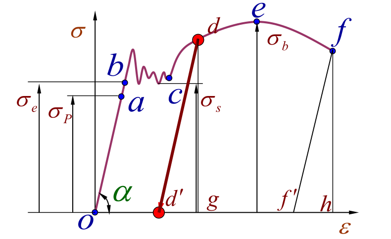

(1) **弹性阶段** Elastic Range ($O-b$)

$O-a$ ，胡克定律(Hooke’s Law)

$$
\sigma=E \varepsilon
$$

**比例极限**(Proportional limit) $\sigma_{P}$

$a-b$，不是直线，但仍然弹性变形

弹性极限(Elastic limit)  $\sigma_{e}$

(2) **屈服阶段** Yielding Range ($b-d$)

这种应力基本保持不变，而应变显著增加

将  $\sigma - \delta$  曲线上应力首次下降前的最大应力判定为上**屈服极限**(Upper yielding limit)，将不计初始瞬时效应(即舍去第一个谷值应力)时屈服阶段内最小的应力定义为下屈服极限(Lower yielding limit)

(3) **强化阶段** Hardening Stage ($d-e$)

材料所能承受的最大应力   $\sigma_{b}$ ，称为**强度极限**

Ultimate strenth , which also reflects the strength of materials

(4) **缩颈阶段** Necking Range ($e-f$)

最终拉断

试样拉断后, 由于保留了塑性变形, 试样标距由原来的  $l$  变为  $l_{1}$  。用百分比表示的比值

$$
\delta=\dfrac{l_{1}-l}{l} \times 100 \%
$$

称为**伸长率**。

原始横截面面积为  $A$  的试样, 拉断后缩颈处的最小截面面积变为  $A_{1}$ , 用百分比表示的比值

$$
\psi=\dfrac{A-A_{1}}{A} \times 100 \%
$$

称为**断面收缩率**。

### 温度应力和装配应力

温度变化将引起物体的膨胀或收缩。静定结构由于可以自由变形，当温度均匀变化时，并不会引起构件的内力。但在超静定结构中，因变形受到部分或全部约束，温度变化时，往往会引起内力。

当温度变化为  $\Delta T$  时，杆件由于温度变化引起的变形(伸长)应为

$$
\Delta l_{T}=\alpha_{l} \Delta T \cdot l
$$

式中  $\alpha_{l}$  为材料的线胀系数。

加工构件时，尺寸上产生一些微小误差是难以避免的。对静定结构，加工误差只不过是造成结构几何形状的轻微变化，不会引起内力。但对超静定结构，加工误差往往要引起内力。

### 应力集中

因杆件外形突然变化，而引起局部应力急剧增大的现象，称为应力集中 (Stress Concentration)。

设发生应力集中的截面上的最大应力为  $\sigma_{\max }$ ，同一截面上的平均应力为  $\sigma$ ，则比值

$$
K=\dfrac{\sigma_{\max }}{\sigma}
$$

称为理论应力集中因数。它反映了应力集中的程度，是一个大于 1 的因数。

实验结果表明：截面尺寸变化越急剧、角越尖、孔越小，应力集中的程度就越严重。

### 切应力互等定理

在相互垂直的两个平面上，切应力必然成对存在，且数值相等；两者都垂直于两个平面的交线，方向则共同指向或共同背离这一交线。

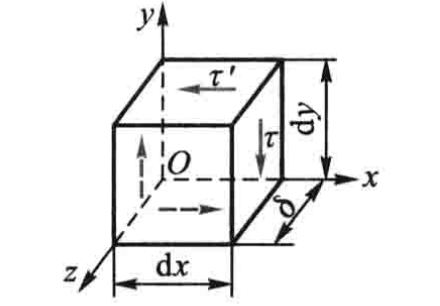

## 基本应力应变模型

### 拉伸与压缩

拉为正，压为负。

轴向拉压 $N$ 产生正应力 $\sigma$ ，与轴向线应变 $\varepsilon$ (杆件长度) 和横向应变 $\varepsilon^{\prime}$ (横向尺寸)

$$
\sigma=E \varepsilon
$$

$$
\mu=-\dfrac{\varepsilon^{\prime}}{\varepsilon}
$$

- $E$：弹性模量
- $\mu$：泊松比

产生单位体积应变能

$$
v_{\varepsilon}=\dfrac{\sigma^{2}}{2 E}=\dfrac{1}{2} \sigma \varepsilon
$$

对于长为 $l$ 的杆，若轴向力为 $F$，有

$$
\Delta l=\dfrac{F ~ l}{E A}
$$

$$
V_{\varepsilon}=\dfrac{F^{2} l}{2 E A}
$$

### 剪切

对杆上任意一点的矩，顺时针为正，逆时针为负。

剪力 $Q$ 产生切应力 $\tau$。

实用计算

$$
\tau = \dfrac{Q}{A}
$$

### 扭转

按右手法则表示为矢量，与外法线方向一致为正，反之为负。

**圆轴的扭转**

**平面假设**：圆轴扭转变形前原为平面的横截面，变形后仍保持为平面，形状和大小不变，半径仍保持为直线；且相邻两截面间的距离不变。

距圆心为 $\rho$ 处的切应力

$$
\tau_{\rho}=\dfrac{T \, \rho}{I_{\mathrm{p}}}
$$

- $I_{\mathrm{p}}=\int_{A} \rho^{2} \mathrm{~d} A$：极惯性矩

对于实心圆轴，$I_{\mathrm{p}}=\int_{0}^{2 \pi} \int_{0}^{R} \rho^{3} \mathrm{~d} \rho \mathrm{d} \theta=\dfrac{\pi R^{4}}{2}$

相距为 $\mathrm{d} x$ 的两个横截面之间的相对转角

$$
\dfrac{\mathrm{d} \varphi}{\mathrm{d} x}=\dfrac{T}{G I_{p}}
$$

- $G$：切变模量

$$
G=\dfrac{E}{2(1+\mu)}
$$

$\mathrm{d} x$ 上的应变能

$$
\mathrm{d} V_{\varepsilon}=\dfrac{T^{2} \mathrm{d} x}{2 G I_{\mathrm{p}}}
$$

**矩形截面杆的扭转**

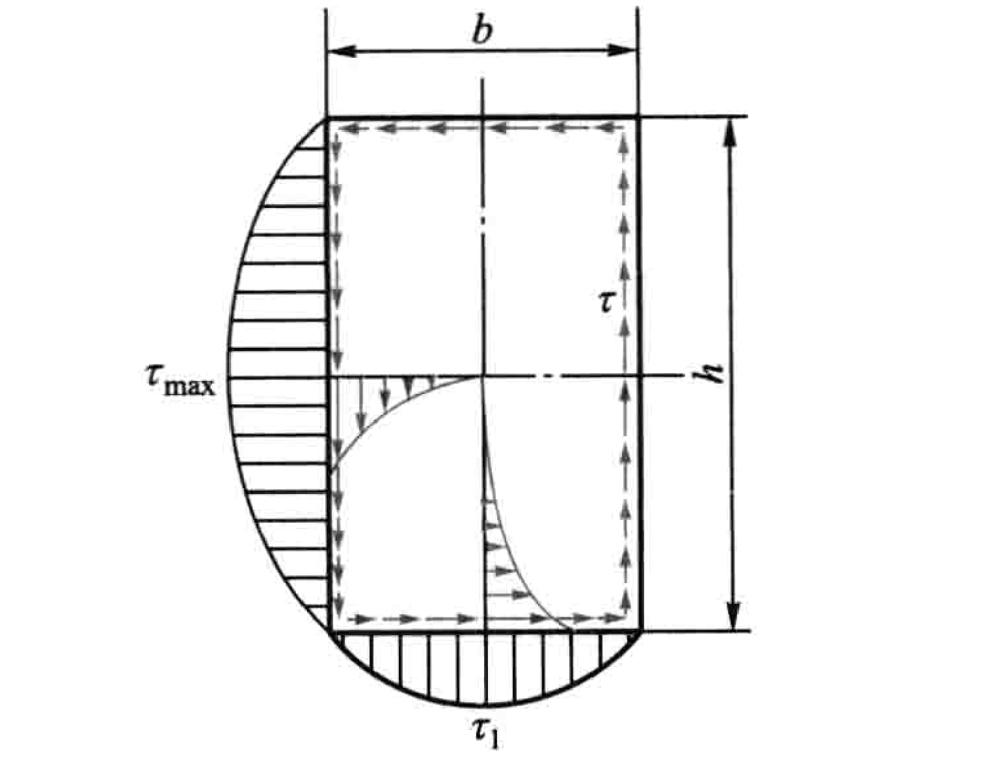

$$
\tau_{\max }=\dfrac{T}{\alpha h b^{2}}
$$

$$
\tau_{1}=\nu \tau_{\max }
$$

$$
\mathrm{d} \varphi=\dfrac{T \mathrm{d} x}{G I_{\mathrm{t}}}
$$

- $G I_{\mathrm{t}} = G \beta h b^{3}$：抗扭刚度

特别地，当 $h/b > 10$ 时，截面成为狭长矩形。这时 $\alpha=\beta \approx \dfrac{1}{3}$。如以 $\delta$ 表示狭长矩形的短边的长度，则有

$$
\tau_{\max }=\dfrac{3 T}{h \delta^{2}}
$$

$$
\mathrm{d} \varphi=\dfrac{3 T \mathrm{d} x}{G h \delta^{3}}
$$

在狭长矩形截面上，沿长边各点的切应力实际上变化不大，接近相等，在靠近短边处才迅速减小为零。

**开口薄壁杆件的扭转**

开口薄壁杆件横截面，可以看作是由若干个狭长矩形组成的。中线为曲线的开口薄璧杆件，计算时可将截面展直，作为狭长矩形截面处理。

假设横截面在其本身平面内形状不变，则整个横截面和组成截面的各部分的扭转角 $\varphi$ 相等。

$$
\mathrm{d} \varphi=\dfrac{T \mathrm{d} x}{G I_{\mathrm{t}}}
$$

- $G I_{\mathrm{t}}$：开口薄壁杆件的抗扭刚度

$$
I_{\mathrm{t}}=\sum \dfrac{1}{3} h_{i} \delta_{i}^{3}
$$

长边各点的切应力

$$
\tau_{i}=\dfrac{T \delta_{i}}{I_{\mathrm{t}}}
$$

当各狭长矩形连接处有圆角，翼缘内侧有斜度时

$$
I_{\mathrm{t}}=\eta \cdot \dfrac{1}{3} \sum h_{i} \delta_{i}^{3}
$$

- $\eta$：修正因数

### 弯曲

在截面处弯曲变形凸向下时，截面上的弯矩规定为正，反之为负。

概念

- 中性层：梁内一层纤维既不伸长也不缩短，因而纤维不受拉应力和压应力，此层纤维称中性层
- 中性轴：中性层与横截面的交线

**假设**

- 平面假设：横截面变形后仍为平面，只是绕中性轴发生转动，距中性轴等高处，变形相等
- 纵向纤维之间无正应力（纤维内部有）

纵向纤维的应变

$$
\varepsilon = \dfrac{y}{\rho}
$$

- $y$：中性层向下位置坐标
- $\rho$：曲率半径

**弯曲正应力**

横截面有对称轴

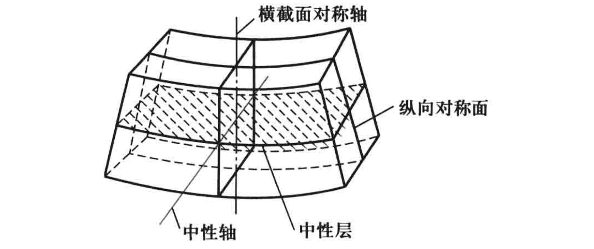

中性轴应通过截面形心。

以梁横截面的对称轴为 $y$ 轴，且向下为正，以中性轴为 $z$ 轴，以通过原点的横截面的法线为 $x$ 轴。

正应力

$$
\sigma=\dfrac{M y}{I_{z}}
$$

- $I_{z} = \int_{A} y^{2} \mathrm{~d} A$：横截面对 $z$ 轴的惯性矩

- 截面是高为  $h$  、宽为  $b$  的矩形，$I_{z}=\dfrac{b h^{3}}{12}$
- 截面是直径为  $d$  的圆形，$I_{z}=\dfrac{\pi d^{4}}{64}$

一般情况下，最大正应力发生于弯矩最大的截面上

$$
\sigma_{\max}=\dfrac{M_{\max}}{W}
$$

- $W$：抗弯截面系数，单位为  $\mathrm{m}^{3}$

- 截面是高为  $h$  、宽为  $b$  的矩形，$W=\dfrac{b h^{2}}{6}$
- 截面是直径为  $d$  的圆形，$W=\dfrac{\pi d^{3}}{32}$

在弯矩较大处采用较大截面，而在弯矩较小处采用较小截面。这种截面沿轴线变化的梁，称为变截面梁。变截面梁的正应力计算仍可近似地用等截面梁的公式。如变截面梁各横截面上的最大正应力都相等，且都等于许用应力，就是**等强度梁**。

**弯曲切应力**

矩形截面梁

截面高度 $h$ 大于宽度 $b$ 的情况下，假设

- 切应力与剪力平行
- 切应力沿截面宽度均匀分布（沿 $z$ 轴）

则切应力为

$$
\tau=\dfrac{Q S_{z}^{*}}{I_{z} b}
$$

- $S_{z}^{*}=\int_{A_{1}} y \mathrm{~d} A=\dfrac{b}{2}\left(\dfrac{h^{2}}{4}-y^{2}\right)$：截面上距中性轴为 $y$ 的横线以下部分的面积（记为 $A_{1}$）对中性轴的静矩
- $I_{z}=\dfrac{b h^{3}}{12}$：横截面对 $z$ 轴的惯性矩

最大切应力发生于中性轴上

$$
\tau_{\max }=\dfrac{3}{2} \dfrac{Q}{b h}
$$

对于工字形截面梁，腹板几乎负担了截面上的全部剪力，而且腹板上的切应力接近于均匀分布。（翼缘负担了截面上的大部分弯矩）

**弯曲变形**

横力弯曲变形的基本方程

$$
\dfrac{1}{\rho}=\dfrac{M}{E I}
$$

- $E I$：抗弯刚度

发生弯曲变形时，变形前为直线的梁轴线，变形后成为一条连续且光滑的曲线，称为挠曲线。

以变形前的梁轴线为 $x$ 轴，垂直向上的轴为 $y$ 轴，$x-y$ 平面为梁的纵向对称面。

- 挠度 $w$：坐标为 $x$ 的横截面的形心沿 $y$ 方向的位移
- 转角 $\theta$：坐标为 $x$ 的横截面相对其原来位置转过的角度

小变形的情况下

$$
\mathrm{d} w = \theta \mathrm{~d} x
$$

$$
\dfrac{\mathrm{d}^{2} w}{\mathrm{~d} x^{2}}=\dfrac{M}{E I}
$$

弯曲应变能

$$
\mathrm{d} V_{\varepsilon}=\dfrac{M^{2} \mathrm{d} x}{2 E I}
$$

- 边界条件：在固定端，挠度和转角都为零；在铰支座上，挠度为零
- 连续条件：在挠曲线的任意点上，有唯一确定的挠度和转角

积分得

$$
\theta=\dfrac{\mathrm{d} w}{\mathrm{~d} x}=\int \dfrac{M}{E I} \mathrm{~d} x+C
$$

$$
w=\iint\left(\dfrac{M}{E I} \mathrm{~d} x\right) \mathrm{d} x+C x+D
$$

在弯曲变形很小，且材料服从胡克定律的情况下，挠曲线的微分方程是线性的。因此可以采用叠加法。

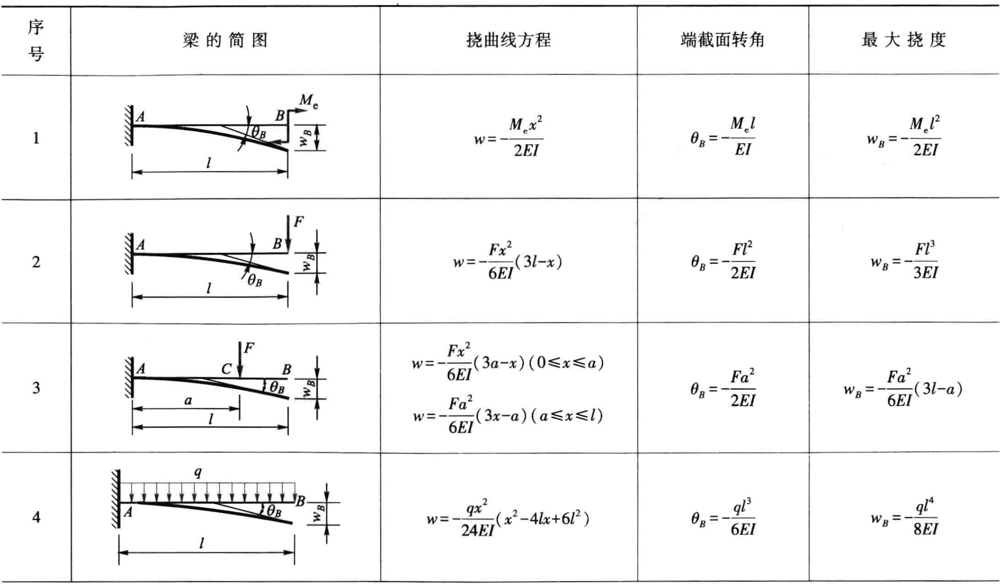

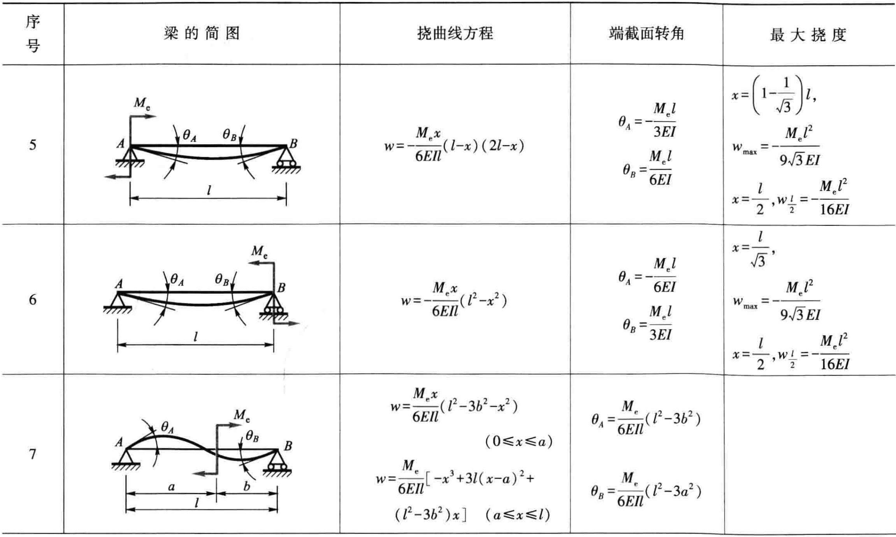

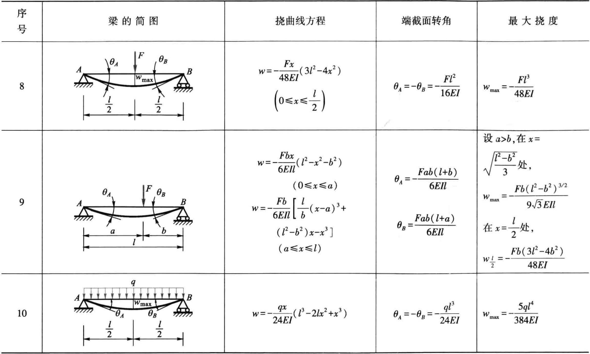

## 复杂受力情况下的应力应变

### 组合变形与叠加原理

组合变形是两种或两种以上基本变形组合的情况。

分析组合变形时，可先将外力进行简化或分解，把构件上的外力转化成几组静力等效的载荷，其中每一组载荷对应着一种基本变形。可分别计算每一基本变形各自引起的应力、内力、应变和位移，然后将所得结果叠加，得到构件在组合变形下的应力、内力、应变和位移，这就是叠加原理。

叠加原理的成立，要求位移、应力、应变和内力等与外力成线性关系。当不能保证上述线性关系时，叠加原理不能使用。

### 偏心压缩和截面核心

截面核心：横截面上的一封闭区域，当压力作用点位于该区域时，截面上只有压应力，该区域称为截面核心。

### 非对称弯曲

梁无纵向对称面，或者虽有纵向对称面，但载荷并不在这个平面内的情况，称为非对称弯曲。

设梁的轴线为  $x$  轴, 横截面内通过形心的两根任意轴为  $y$  轴和  $z$  轴。假设两端的纯弯曲力偶矩作用在  $x-y$  平面内, 并将其记为  $M_{z}$  。

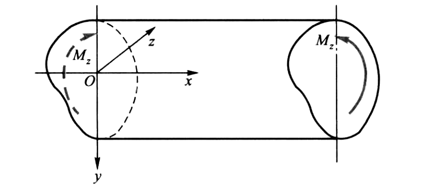

此时若仍采用 (1) 平面假设; (2) 纵向纤维之间无正应力 两个假设，则有如下结论

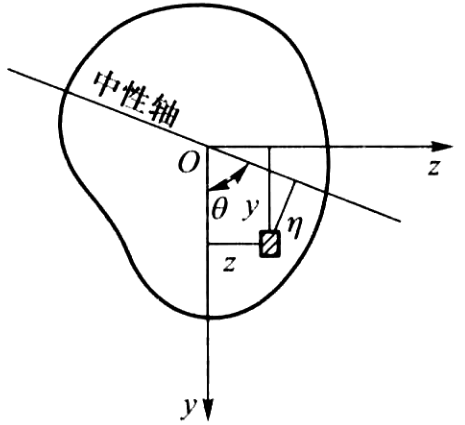

中性轴通过截面形心，其位置

$$
\tan \theta=\dfrac{I_{y}}{I_{y z}}
$$

应力

$$
\sigma=\dfrac{M_{z} \eta}{I_{z} \sin \theta-I_{y z} \cos \theta}=\dfrac{M_{z}\left(I_{y} y-I_{y z} z\right)}{I_{y} I_{z}-I_{y z}^{2}}
$$

- $\eta=y \sin \theta-z \cos \theta$：到中心轴的距离

### 弯曲中心

若杆件有纵向对称面，且横向力作用于该对称面内，则杆件只可能在纵向对称面内发生弯曲，不会有扭转变形。若横向力作用平面不是纵向对称面，即使是形心主惯性平面，杆件除弯曲变形外，还将发生扭转变形。只有当横向力通过截面的某一特定点时，杆件才只发生弯曲变形而无扭转变形，这一特定点称为弯曲中心或剪切中心。

## 应力和应变分析

一点的应力状态：过一点不同方向面上应力的集合。

应力状态的研究对象是单元体，其特征为：

1. 单元体的尺寸无限小，每个面上应力均匀分布；
2. 任意一对平行平面上的应力相等。

主单元体是指各侧面上切应力均为零的单元体。其中，单元体上切应力为零的面称为**主平面**，主平面上的正应力称**主应力**。

一点处必定存在一个单元体, 使得三个相互垂直的面均为主平面, 三个互相垂直的主应力分别记为  $\sigma_{1}$  ,  $\sigma_{2}$ , $\sigma_{3}$ , 且规定按代数值大小的顺序来排列, 即  $\sigma_{1} \geq \sigma_{2} \geq \sigma_{3}$  。

### 平面应力状态

单元体的各面上, 设应力分量  $\sigma_{x}, \sigma_{y}, \tau_{x y}$  和  $\tau_{y x}$  皆为已知, 其余各应力分量均为零, 这种应力状态称为平面应力状态。

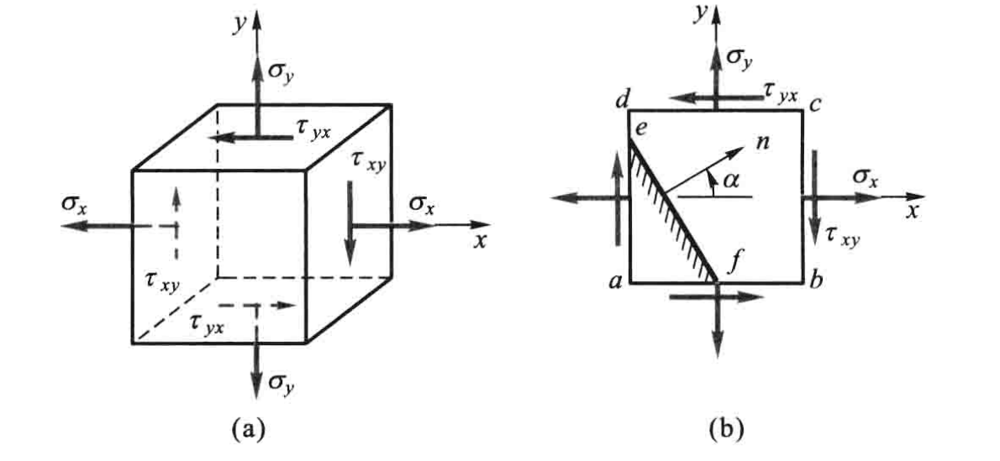

关于应力的符号规定为：正应力以拉应力为正而压应力为负；切应力对单元体内任意点的矩为顺时针转向时，规定为正，反之为负。

平面应力状态下，在法线倾角为 $\alpha$ 的斜面上，有

$$
\left(\sigma_{\alpha}-\dfrac{\sigma_{x}+\sigma_{y}}{2}\right)^{2}+\tau_{\alpha}^{2}=\left(\dfrac{\sigma_{x}-\sigma_{y}}{2}\right)^{2}+\tau_{x y}^{2}
$$

这是一个圆方程，称为**应力圆**。

应力圆与单元体应力间的关系：

1. 点面之间的对应关系：单元体任一截面上的应力，必对应于应力圆上某一点的坐标；
2. 夹角关系：圆周上任意两点所引半径的夹角等于单元体上对应两截面夹角的两倍，且两者的转向一致。

### 广义胡克定律

在最普遍的情况下, 描述一点的应力状态需要 9 个应力分量。考虑到切应力互等定理,  $\tau_{x y}$  和  $\tau_{y x}$, $\tau_{y z}$  和  $\tau_{z y}$, $\tau_{z x}$  和  $\tau_{x z}$  都分别数值相等。这样, 原来的 9 个应力分量中独立的就只有 6 个。这种普遍情况, 可以看作是三组单向应力和三组纯剪切的组合。

对于各向同性材料, 当变形很小且在线弹性范围内时, 线应变只与正应力有关, 而与切应力无关; 切应变只与切应力有关, 而与正应力无关。则有

$$
\begin{aligned}
\varepsilon_{x}=\dfrac{1}{E}\left[\sigma_{x}-\mu\left(\sigma_{y}+\sigma_{z}\right)\right] \\
\varepsilon_{y}=\dfrac{1}{E}\left[\sigma_{y}-\mu\left(\sigma_{z}+\sigma_{x}\right)\right] \\
\varepsilon_{z}=\dfrac{1}{E}\left[\sigma_{z}-\mu\left(\sigma_{x}+\sigma_{y}\right)\right]
\end{aligned}
$$

$$
\gamma_{x y}=\dfrac{\tau_{x y}}{G}, \quad \gamma_{y z}=\dfrac{\tau_{y z}}{G}, \quad \gamma_{z x}=\dfrac{\tau_{z x}}{G}
$$

当单元体的周围六个面皆为主平面时, 在三个坐标平面内的切应变等于零, 故坐标  $x, y, z$  的方向就是主应变的方向。也就是说主应变和主应力的方向是重合的。所以，在主应变用实测的方法得到后, 将其代入广义胡克定律，即可解出主应力。当然，这只适用于各向同性的线弹性材料。

当单元体的周围六个面皆为主平面时，体应变

$$
\theta=\dfrac{\sigma_{\mathrm{m}}}{K}
$$

其中

$$
K=\dfrac{E}{3(1-2 \mu)}, \quad \sigma_{\mathrm{m}}=\dfrac{\sigma_{1}+\sigma_{2}+\sigma_{3}}{3}
$$

$K$  称为体积弹性模量,  $\sigma_{\mathrm{m}}$  是三个主应力的平均值。公式说明, 单位体积的体积改变  $\theta$  只与三个主应力之和有关, 至于三个主应力之间的比例, 对  $\theta$  并无影响。公式还表明,体应变  $\theta$  与平均应力  $\sigma_{\mathrm{m}}$  成正比, 此即体积胡克定律。

三个主应力同时存在时，单元体的应变能密度为

$$
\begin{aligned}
v_{\varepsilon} & =\dfrac{1}{2}\left(\sigma_{1} \varepsilon_{1}+\sigma_{2} \varepsilon_{2}+\sigma_{3} \varepsilon_{3}\right) \\
& =\dfrac{1}{2 E}\left[\sigma_{1}^{2}+\sigma_{2}^{2}+\sigma_{3}^{2}-2 \mu\left(\sigma_{1} \sigma_{2}+\sigma_{2} \sigma_{3}+\sigma_{3} \sigma_{1}\right)\right]
\end{aligned}
$$

### 强度理论

材料失效形式主要有屈服失效和断裂失效两种。

（1）屈服失效：材料出现显著的塑性变形而丧失其正常的工作能力。

（2）断裂失效：有脆性断裂和韧性断裂两种形式。其中，脆性断裂是指在无明显的变形下突然断裂；韧性断裂是指在产生大量塑性变形后断裂。

**常用强度理论**

（1）最大拉应力理论(第一强度理论)

这一理论认为最大拉应力是引起断裂的主要因素。

相当应力

$$
\sigma_{\mathrm{r} 1}=\sigma_{1}
$$

（2）最大伸长线应变理论(第二强度理论)

这一理论认为最大伸长线应变是引起断裂的主要因素。

相当应力

$$
\sigma_{\mathrm{r} 2}=\sigma_{1}-\mu\left(\sigma_{2}+\sigma_{3}\right)
$$

（3）最大切应力理论(第三强度理论)

这一理论认为最大切应力是引起屈服的主要因素。

相当应力

$$
\sigma_{\mathrm{r} 3}=\sigma_{1}-\sigma_{3}
$$

（4）最大畸变能密度理论(第四强度理论)

这一理论认为畸变能密度是引起屈服的主要因素。

相当应力

$$
\sigma_{\mathrm{r} 4}=\sqrt{\dfrac{1}{2}\left[\left(\sigma_{1}-\sigma_{2}\right)^{2}+\left(\sigma_{2}-\sigma_{3}\right)^{2}+\left(\sigma_{3}-\sigma_{1}\right)^{2}\right]}
$$

以上介绍了四种常用的强度理论。铸铁、石料、混凝土、玻璃等脆性材料，通常以断裂的形式失效，宜采用第一和第二强度理论。碳钢、铜、铝等塑性材料，通常以屈服的形式失效，宜采用第三和第四强度理论。

**莫尔强度理论**

$\left[\sigma_{\mathrm{t}}\right]$  和  $\left[\sigma_{\mathrm{c}}\right]$  分别为材料的抗拉和抗压许用应力。

强度条件

$$
\sigma_{\mathrm{r M}}=\sigma_{1}-\dfrac{\left[\sigma_{\mathrm{t}}\right]}{\left[\sigma_{\mathrm{c}}\right]} \sigma_{3} \leqslant\left[\sigma_{\mathrm{t}}\right]
$$

## 能量方法

### 应变能

组合变形下，杆件的应变能计算

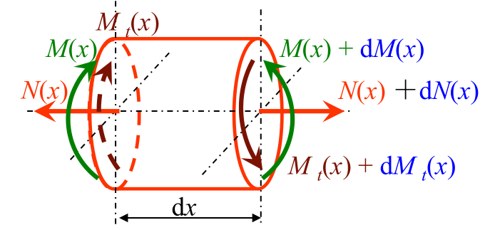

$$
V_{\varepsilon}=\int_{l} \dfrac{N^{2}(x)}{2 E A} \mathrm{~d} x+\int_{l} \dfrac{M^{2}(x)}{2 E I} \mathrm{~d} x+\int_{l} \dfrac{M_{t}^{2}(x)}{2 G I_{p}} \mathrm{~d} x
$$

### 互等定理 (Reciprocal Theorem)

线弹性结构

第一组力在第二组力引起的位移上所作的功，等于第二组力在第一组力引起的位移上所作的功，这就是功的互等定理。

当  $F_{1}=F_{3}$  时,  $F_{1}$  作用点沿  $F_{1}$  方向因作用  $F_{3}$  而引起的位移, 等于  $F_{3}$  作 用点沿  $F_{3}$  方向因作用  $F_{1}$  而引起的位移。这就是位移互等定理。

### 卡氏定理 (Castigliano’s Theorem)

卡氏第一定理，适用于线性和非线性的弹性结构

$$
F_{i}=\dfrac{\partial V_{\varepsilon}\left(\delta_{1}, \delta_{2}, \cdots, \delta_{i}, \cdots\right)}{\partial \delta_{i}}
$$

卡氏第二定理，适用于线弹性结构

$$
\delta_{i}=\dfrac{\partial V_{\varepsilon}\left(F_{1}, F_{2}, \cdots, F_{i}, \cdots\right)}{\partial F_{i}}
$$

### 虚功原理 (Virtual Work Principle)

外力所做的虚功等于内力在相应虚位移上所做的功，也等于杆件的虚应变能 。

### 单位载荷法 莫尔积分

利用虚功原理可以导出计算结构一点位移的单位载荷法。设在外力 $F$ 作用下, 结构  $A$  点沿某一任意方向  $a a$  的位移为 $\Delta$。结构上各点的广义位移为  $\mathrm{d} \delta$。

为了计算  $\Delta$ , 设想在同一结构的  $A$  点上, 沿  $a a$  方向作用一单位力, 它与约束力组成平衡力系。这时结构的内力为 $\bar{F}$。

把结构在原有外力 $F$ 作用下的位移作为虚位移, 加于单位力作用下的结构上。根据虚功原理

$$
1 \cdot \Delta = \int{\bar{F} \mathrm{~d} \delta}
$$

因为单位力  $1$  没有量纲，因此单位力引起的内力  $\bar{F}$  也应没有量纲。

对以抗弯为主的杆件

$$
\Delta=\int_{l} \bar{M}(x) \mathrm{d} \theta
$$

$$
\mathrm{d} \theta=\dfrac{M(x)}{E I} \mathrm{~d} x
$$

对有 $n$ 根杆的杆系,  只有轴力的拉伸或压缩

$$
\Delta=\sum_{i=1}^{n} \bar{N}_{i} \Delta l_{i}
$$

$$
\Delta l=\dfrac{N \, l}{E A}
$$

有时需要求结构上两点的相对位移。这时，只要沿两点连线，作用方向相反的一对单位力，然后用单位载荷法计算，即可求得相对位移。

## 超静定问题

### 基本静定系和相当系统

静不定结构 (Statistically Indeterminate Structures)：结构的强度和刚度均得到提高，约束反力不能由平衡方程求得

静不定度（次）数：约束反力多于独立平衡方程的数

超静定问题是综合了静力方程、变形协调方程(几何方程)和物理方程等三方面的关系求解的。

超静定结构：杆件的内力和外力不能完全由平衡方程解出的结构。

与静定结构不同，超静定结构的一些支座往往并不是维持几何不变所必需的。解除刚架的支座，它仍然是几何不变的结构。因此把这类约束称为多余约束。与多余约束对应的约束力就称为多余约束力。

解除超静定结构的某些约束后得到的静定结构,称为原超静定结构的**基本静定系**。

在基本静定系上，除原有载荷外，还应该用相应的多余约束力代替被解除的多余约束，有时把载荷和多余约束力作用下的基本静定系称为**相当系统**。

### 用力法解超静定结构

对于一次超静定结构，解除多余约束，用多余约束力 $X_{1}$ 代替，其作用点是 $B$。在载荷  $F$  与  $X_{1}$  联 合作用下, 以  $\Delta_{1}$  表示  $B$  点沿  $X_{1}$  方向的位移。可以认为  $\Delta_{1}$  由两部分组成, 一部分是基本静定系在  $F$  单独作用下引起的  $\Delta_{1 F}$ , 另一部分 是在  $X_{1}$  单独作用下引起的  $\Delta_{1 X_{1}}$  。这样有

$$
\Delta_{1}=\Delta_{1 F}+\Delta_{1 X_{1}}
$$

因  $B$  点原有的约束, 它在  $X_{1}$  方向不应有任何位移,所以

$$
\Delta_{1}=0
$$

这也就是变形协调方程。

在计算  $\Delta_{1 X_{1}}$  时, 可以在基本静定系上沿  $X_{1}$  方向作用单位力,  $B$  点沿  $X_{1}$  方向因这一单位力引起的位移记为  $\delta_{11}$  。对线弹性结构

$$
\Delta_{1 X_{1}}=\delta_{11} X_{1}
$$

则有

$$
\delta_{11} X_{1}+\Delta_{1 F}=0
$$

$\Delta_{1 F}, \delta_{11}$ 都可以用莫尔积分求出，于是可以求得 $X_{1}$。

显然, 可以把力法推广到  $n$  次超静定结构, 这时线性方程组为

$$
\left.\begin{array}{c}
\delta_{11} X_{1}+\delta_{12} X_{2}+\cdots+\delta_{1 n} X_{n}+\Delta_{1 F}=0 \\
\delta_{21} X_{1}+\delta_{22} X_{2}+\cdots+\delta_{2 n} X_{n}+\Delta_{2 F}=0 \\
\cdots \cdots \cdots \cdots \\
\delta_{n 1} X_{1}+\delta_{n 2} X_{2}+\cdots+\delta_{n n} X_{n}+\Delta_{n F}=0
\end{array}\right\}
$$

$\delta_{i j}$ 的量纲是位移比上力 . 根据位移互等定理, 存在以下关系:

$$
\delta_{i j}=\delta_{j i}
$$

力法得出的线性方程组都按照一定规范写成标准形式, 一般称为力法的正则方程或典型方程。

### 对称及反对称性质的利用

对称结构上受对称载荷作用时，对称截面上，只有轴力和弯矩。

对称结构上受反对称载荷时，对称截面上，只有剪力。

### 连续梁及三弯矩方程

连续跨过一系列中间支座的多跨梁, 称为连续梁。采用下述记号: 从左到右把支座依次编号为  $0,1,2, \cdots$, 把跨度依次编号为  $l_{1}, l_{2}, l_{3}, \cdots$。设所有支座在同一水平线上, 并无不同沉陷。且设只有支座 $0$ 为固定铰支座,其余皆为可动铰支座。

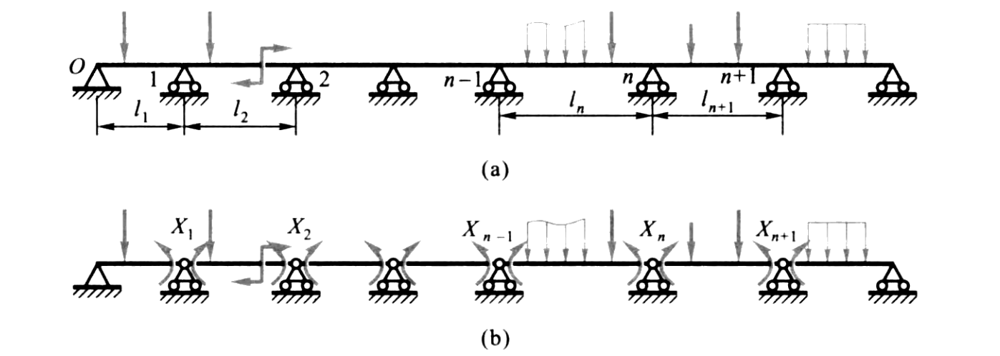

设想在每个中间支座的上方, 把梁切开并装上铰链, 这就相当于把这些截面上的弯矩作为多余约束力, 并分别记为  $X_{1} ,  X_{2}, \cdots, X_{n}, \cdots$  。在任一支座上方, 两侧截面上的弯矩是大小相等、方向相反的一对力偶矩, 与其相应的位移是两侧截面的相对转角。

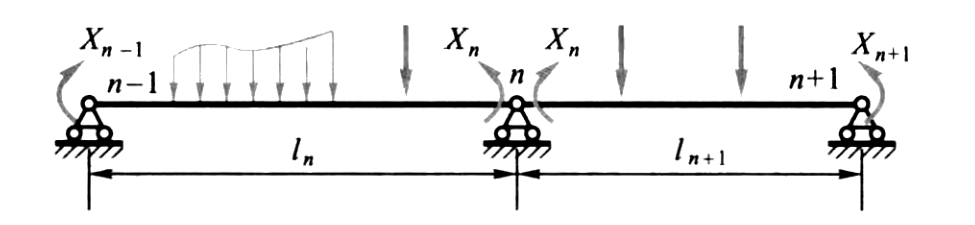

支座  $n$  上方, 较链两侧截面的相对转角为  $\Delta_{n}$ , 且可将它写成

$$
\Delta_{n}=\delta_{n(n-1)} X_{n-1}+\delta_{n n} X_{n}+\delta_{n(n+1)} X_{n+1}+\Delta_{n F}
$$

式中常数项和 3 个系数都可由莫尔积分来计算, 且  $\Delta_{n}=0$.

## 动载荷

$$
\sigma_{\mathrm{d}}=K_{\mathrm{d}} \sigma_{\mathrm{st}}
$$

- $\sigma_{\mathrm{d}}$：动应力
- $\sigma_{\mathrm{st}}$：静应力
- $K_{\mathrm{d}}$：动荷因数

### 动静法

**达朗贝尔原理** ：对做匀加速运动的质点系，如假想地在每一个质点上加上惯性力，则质点系上的原力系与惯性力系组成平衡力系。(视为静力学问题处理)

### 受冲击时的应力

基本假设

1. 不计冲击物的变形
2. 冲击前后，冲击物和杆件构成的系统机械能守恒
3. 构件材料服从胡克定律

冲击过程中变形和应力的瞬时最大值，就是动应力。

能量守恒定律, 冲击系统的动能和势能的变化应等于应变能

$$
\Delta T+\Delta V=V_{\mathrm{\varepsilon d}}
$$

动载荷的功等于应变能

$$
V_{\mathrm{\varepsilon d}}=\dfrac{1}{2} F_{\mathrm{d}} \Delta_{\mathrm{d}}
$$

线弹性范围内

$$
F = k \Delta
$$

这样可以解出 $F_{\mathrm{d}}$ 及对应的动应力。

## 疲劳

### 交变应力

应力随时间周期变化

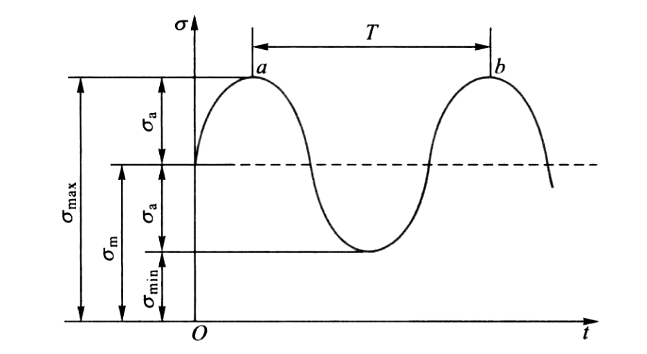

以  $\sigma_{\max }$  和  $\sigma_{\min }$  分别表示循环中的最大和最小应力, 比值

$$
r=\dfrac{\sigma_{\min }}{\sigma_{\max }}
$$

称为交变应力的**循环特征**或应力比。  $\sigma_{\text {max }}$  与  $\sigma_{\min }$  的代数和的二分之一称为平均应力, 即

$$
\sigma_{\mathrm{m}}=\dfrac{1}{2}\left(\sigma_{\max }+\sigma_{\min }\right)
$$

$\sigma_{\max }$  与  $\sigma_{\min }$  代数差的二分之一称为**应力幅**, 即

$$
\sigma_{\mathrm{a}}=\dfrac{1}{2}\left(\sigma_{\max }-\sigma_{\text {min }}\right)
$$

若交变应力的  $\sigma_{\max }$  和  $\sigma_{\text {min }}$  大小相等, 符号相反, 这种情况称为**对称循环**。

$$
r=-1, \quad \sigma_{\mathrm{m}}=0, \quad \sigma_{\mathrm{a}}=\sigma_{\max }
$$

各种应力循环中, 除对称循环外, 其余情况统称为不对称循环。

$$
\sigma_{\max }=\sigma_{\mathrm{m}}+\sigma_{\mathrm{a}}, \quad \sigma_{\min }=\sigma_{\mathrm{mm}}-\sigma_{\mathrm{a}}
$$

可见, 任一不对称循环都可看成是在平均应力  $\sigma_{\mathrm{m}}$  上叠加一个幅度为  $\sigma_{\mathrm{a}}$  的对称循环。

若应力循环中的  $\sigma_{\min }=0$  或  $\sigma_{\max }=0$  , 表示交变应力变动于某一应力与零之间,  这种情况称为**脉动循环**。

$$
r=0, \quad \sigma_{\mathrm{a}}=\sigma_{\mathrm{m}}=\dfrac{1}{2} \sigma_{\max } \quad\left(\sigma_{\min }=0\right)
$$

或

$$
r=-\infty, \quad-\sigma_{\mathrm{a}}=\sigma_{\mathrm{m}}=\dfrac{1}{2} \sigma_{\min } \quad\left(\sigma_{\max }=0\right)
$$

### 疲劳极限

疲劳失效： 构件在名义应力低于强度极限，甚至低于屈服极限的情况下，突然发生脆性断裂的现象。(塑性材料在长期、反复的交变应力作用下，发生疲劳失效前没有明显的塑性变形。)

**对金属疲劳的解释**一般认为，在足够大的交变应力下，金属中位置最不利或较弱的晶体，沿最大切应力作用面形成滑移带，滑移带开裂成为微观裂纹。在构件外形突变(如圆角、切口、沟槽等)或表面刻痕或材料内部缺陷等部位，都可能因较大的应力集中而引起微观裂纹。分散的微观裂纹经过集结贯通，将形成宏观裂纹。以上是裂纹的萌生过程。已形成的宏观裂纹在交变应力下逐渐扩展。扩展是缓慢的而且并不连续，因应力水平的高低时而持续时而停滞。这就是裂纹的扩展过程。随着裂纹的扩展，构件截面逐步削弱，当削弱到一定极限时，构件便发生突然断裂。

**金属疲劳断裂**会形成光滑区和粗糙区。在裂纹扩展过程中，裂纹的两个侧面在交变载荷下，时而压紧，时而分开，多次反复，形成了断口的光滑区。最后的突然断裂形成断口的粗糙区。

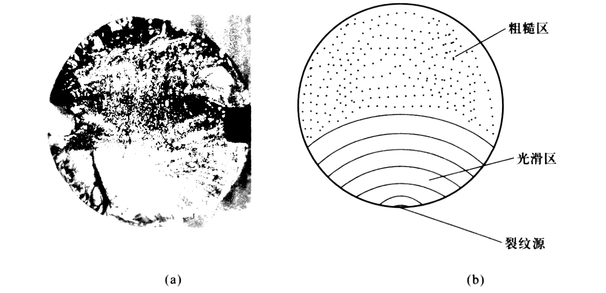

常温下的试验结果表明,  如钢制试样经历  $10^{7}$  次循环仍末发生疲劳破坏,  则再增加循环次数,  也不会发生疲劳破坏。所以,就把在  $10^{7}$  次循环下仍末疲劳的最大应力,  规定为钢材的**疲劳极限**, 而把  $N_{0}=10^{7}$  称为循环基数。

对称循环的疲劳极限记为  $\sigma_{-1}$ , 下标 “$- 1$” 表示对称循环的循环特征为  $r=-1$  。

### 影响疲劳极限的因素

**构件外形的影响**

在对称循环下, 若以  $\left(\sigma_{-1}\right)_{\mathrm{d}}$  或  $\left(\boldsymbol{\tau}_{-1}\right)_{\mathrm{d}}$  表示无应力集中的光滑试样的疲劳极限;  $\left(\sigma_{-1}\right)_{k}$  或  $\left(\tau_{-1}\right)_{k}$  表示有应力集中因素, 且尺寸与光滑试样相同的试样的疲劳极限,则比值

$$
K_{\sigma}=\dfrac{\left(\sigma_{-1}\right)_{\mathrm{d}}}{\left(\sigma_{-1}\right)_{\mathrm{k}}} \text { (对于正应力) 或 } \quad K_{\tau}=\dfrac{\left(\tau_{-1}\right)_{\mathrm{d}}}{\left(\tau_{-1}\right)_{\mathrm{k}}} \text { (对于切应力) }
$$

称为有效应力集中因数。

**构件尺寸的影响**

在对称循环下, 若光滑小试样的疲劳极限为  $\sigma_{-1}$ , 光滑大试样的疲劳极限为  $\left(\sigma_{-1}\right)_{\mathrm{d}}$ , 则比值

$$
\varepsilon_{\sigma}=\dfrac{\left(\sigma_{-1}\right)_{d}}{\sigma_{-1}}
$$

称为尺寸因数, 其数值小于 1 。对扭转, 尺寸因数为

$$
\varepsilon_{\tau}=\dfrac{\left(\tau_{-1}\right)_{\mathrm{d}}}{\tau_{-1}}
$$

**构件表面质量的影响**

若表面磨光的试样的疲劳极限为  $\left(\sigma_{-1}\right)_{\mathrm{d}}$ , 而表面为其他加工情况时构件的疲劳极限为  $\left(\sigma_{-1}\right)_{\beta}$ , 则比值

$$
\beta=\dfrac{\left(\sigma_{-1}\right)_{\beta}}{\left(\sigma_{-1}\right)_{d}}
$$

称为表面质量因数.

综合上述三种因素, 在对称循环下, 构件的疲劳极限应为

$$
\sigma_{-1}^{0}=\dfrac{\varepsilon_{\sigma} \beta}{K_{\sigma}} \sigma_{-1}
$$

式中  $\sigma_{-1}$  是光滑小试样的持久极限。如为切应力可写成

$$
\tau_{-1}^{0}=\dfrac{\varepsilon_{\tau} \beta}{K_{\tau}} \tau_{-1}
$$

### 对称循环下, 构件的疲劳强度计算

对称循环下, 实际构件的疲劳极限  $\sigma_{-1}^{0}$  。将  $\sigma_{-1}^{0}$  除以安全因数  $n$  得许用应力为

$$
\left[{\sigma}_{-1}\right]=\dfrac{{\sigma}_{-1}^{0}}{n}
$$

构件的强度条件应为

$$
\sigma_{\max } \leqslant\left[\sigma_{-1}\right] \text { 或 } \sigma_{\max } \leqslant \dfrac{\sigma_{-1}^{0}}{n}
$$

式中  $\sigma_{\max }$  是构件危险点的最大工作应力。

构件的工作安全因数  $n_{\sigma}$

$$
n_{\sigma}=\dfrac{\sigma_{-1}^{0}}{\sigma_{\text {max }}}
$$

于是强度条件可以写成

$$
n_{\sigma} \geqslant n
$$

即构件的工作安全因数  $n_{\sigma}$  应大于或等于规定的安全因数  $n_{\sigma}$ 

可把工作安全因数  $n_{\sigma}$  和强度条件表示为

$$
n_{\sigma}=\dfrac{\sigma_{-1}}{\dfrac{K_{\sigma}}{\varepsilon_{\sigma} \beta} \sigma_{\max }} \geqslant n
$$

如为扭转交变应力, 公式应写成

$$
n_{\tau}=\dfrac{\tau_{-1}}{\dfrac{K_{\tau}}{\varepsilon_{\tau} \beta} \tau_{\max }} \geqslant n
$$

### 提高构件疲劳强度的措施

疲劳裂纹主要形成于构件表面和应力集中的部位。

1、减缓应力集中：构件外形设计上避免出现方形和带尖角的孔和槽，对于截面突变处应采用半径足够大的过渡圆角。

2、降低表面粗糙度：对于疲劳强度要求较高的构件，应注意加工时降低表面粗糙度。构件使用过程中应尽量避免其表面受到机械损伤或化学损伤。

3、增加表面强度：通过热处理、化学处理或机械法的方式强化构件表层，提高构件疲劳强度。

## 压杆稳定

细长杆件受压时，压弯。

压杆丧失其直线形状的平衡而过渡为曲线平衡, 称为丧失稳定性, 简称**失稳**, 也称为屈曲。压力的极限值称为临界压力或**临界力**, 记为  $F_{\mathrm{cr}}$  。

### 支座条件下细长压杆的临界压力

**两端铰支细长压杆的临界压力**

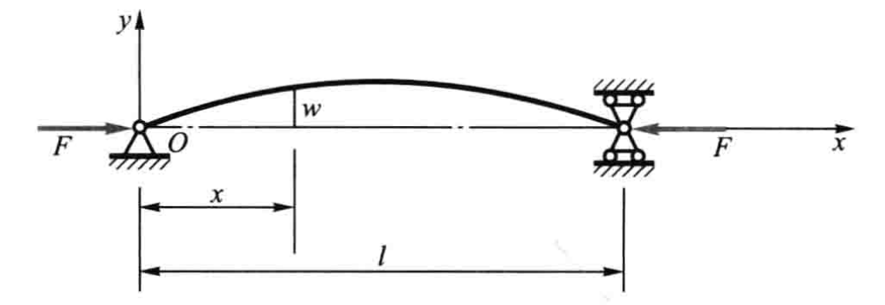

$$
F_{\mathrm {cr }}=\dfrac{\pi^{2} E I}{l^{2}}
$$

**欧拉公式**

$$
F_{\mathrm{cr}}=\dfrac{\pi^{2} E I}{(\mu l)^{2}}
$$

- $\mu l$  表示把压杆折算成两端较支杆的长度, 称为**相当长度**
- $\mu$  称为长度因数

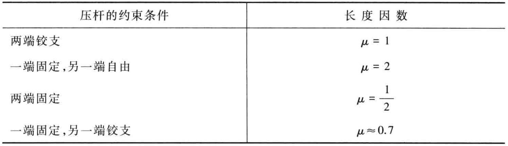

### 欧拉公式的适用范围 经验公式

临界压力对应的应力

$$
\sigma_{\mathrm{cr}}=\dfrac{F_{\mathrm{cr}}}{A}
$$

定义惯性半径  $i$

$$
I=i^{2} A
$$

定义柔度或长细比  $\lambda$

$$
\lambda=\dfrac{\mu l}{i}
$$

则有

$$
\sigma_{\mathrm{cr}}=\dfrac{\pi^{2} E}{\lambda^{2}}
$$

只有临界应力小于比例极限  $\sigma_{\mathrm{p}}$  时, 欧拉公式才适用

$$
\dfrac{\pi^{2} E}{\lambda^{2}} \leqslant \sigma_{\mathrm{p}} \quad \text { 或 } \quad \lambda \geqslant \pi \sqrt{\dfrac{E}{\sigma_{\mathrm{p}}}} = \lambda_{\mathrm{p}}
$$

若压杆的柔度  $\lambda$  小于  $\lambda_{\mathrm{p}}$ ,  有两种经验公式

直线公式

$$
\sigma_{\mathrm{cr}}=a-b \lambda
$$

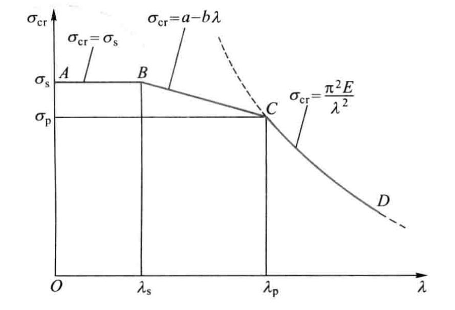

抛物线公式

$$
\sigma_{\mathrm{cr}}=a_{1}-b_{1} \lambda^{2}
$$

### 压杆的稳定性校核

工作安全因数应大于规定的稳定安全因数

$$
n=\dfrac{F_{\mathrm{cr}}}{F} \geqslant n_{\mathrm{st}}
$$

### 提高压杆稳定性的措施

1. 选择合理的截面形状，截面的惯性矩越大，或惯性半径越大，稳定性越好
2. 改变压杆的约束条件
3. 合理选择材料

