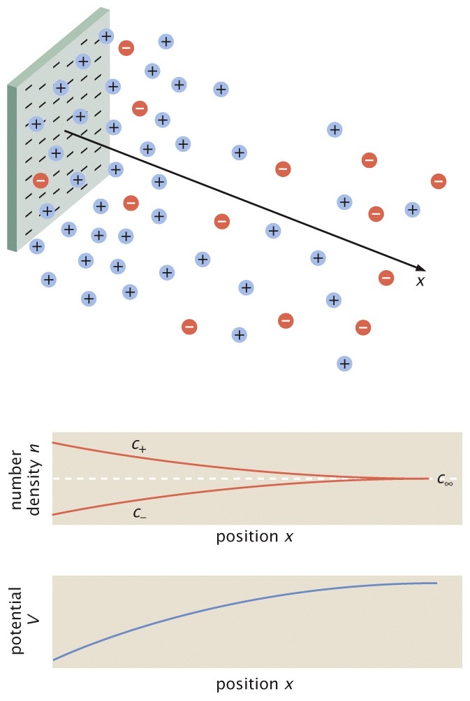

<!-- #! https://zhuanlan.zhihu.com/p/704447875 -->

<!-- # 生物力学考前补天 (╥_╥) -->

## 简答题

### 能量货币

**(1) 细胞中的“能量货币”有哪几种主要形式？最常见的“能量货币”是什么？**

1. 磷酸根所携带的能量(类似的有鸟苷三磷酸GTP等)。
2. NADH(或其类似物NADPH)：可转移的高能电子形式携带的还原电位(“氧化自己，还原别人”；转移两个电子来还原被氧化的有机化合物；失去电子时被氧化，氧化反应通常是自发的)。
3. 离子梯度以类似于电池的方式来储存能量。

最常见的“能量货币”是腺苷三磷酸（ATP），细胞通过水解ATP释放能量用于驱动各种生物化学反应。

### 常用单位

**(2) 细胞的物理生物学常用单位（时间、空间、力、能量的常用单位）**

### 数量估计

**(3) 一个典型细胞（以大肠杆菌为例），球蛋白、膜蛋白、核糖体的数目大概是多少？**

大肠杆菌中大部分的蛋白质是球蛋白。虽然具体的数量可能会根据不同条件有所不同，但一个典型的大肠杆菌细胞包含约几百万个球蛋白分子。大肠杆菌细胞膜中大约包含1000种不同类型的膜蛋白。每种膜蛋白的分子数量可以从数百到数万不等，整体上膜蛋白的数量可能在几十万到几百万之间。在快速生长的条件下，一个大肠杆菌细胞包含大约20000个核糖体。

### 病毒入侵细胞

**(4) 病毒入侵细胞有哪几种典型方式？新冠病毒如何入侵人类细胞？试简述之**

常见病毒及其侵入细胞的三种典型方式：内吞、注射、膜融合

新冠病毒入侵人体细胞的过程：在入侵的那一刻，新冠病毒与受体结合，并与细胞膜发生了膜融合。

### 热力学第二定律

**(5) 热力学第二定律有多种表述，试写出任意两种，并简述热力学第二定律与热力学第一定律的区别。**

开尔文表述(1851年)：不可能从单一热源吸热使之完全变为有用功而不产生其它影响。

克劳修斯表述(1850年)：不可能把热从低温物体传到高温物体而不产生其它影响。

第一定律强调了“热”与“功”作为能量转化不同形式的等价性；第二定律揭示了“热功转化”的不等价性。第二定律的核心是自然界一切热现象都是不可逆的。

### 平衡态统计力学

**(6) 简述平衡态统计力学的核心任务和基本假设。**

平衡态统计力学的核心任务：

- 寻找热平衡系统微观态的概率分布(对于给定约束条件)
- 由此给出宏观热力学量的微观解释
- 并给出各宏观量之间的定量关系(即热力学关系)

例如，对于理想气体，可给出状态方程，内能与熵、体积、粒子数之间的关系(热力学第一定律)，等等。

平衡态统计物理的基本假设是Boltzmann等几率假说：孤立系统的所有微观状态以等几率的方式出现。

孤立系统是与外界无物质、能量交换的体系。一般认为这样的系统最终必然演化到热平衡状态，具有确定的能量(内能)、体积、温度等。特别的，这个热平衡态就是熵最大的状态(按照热力学第二定律)。Boltzmann指出了“等几率”与“熵最大”之间的等价关系。

**(7) 写出玻尔兹曼分布的表达式（包括其成立条件），并简述其物理意义。**

$$
P_i=\mathrm{e}^{-\beta E_i}/Z
$$

其中：

- $P_i$ 是系统处于第 $i$ 个微观状态的概率。
- $E_i$ 是第 $i$ 个微观状态的能量。
- $Z$ 是配分函数，定义为所有可能状态的配分之和。

$$
\beta=1/k_{B}T
$$

$$
Z=\sum_{i=1}^{N}\mathrm{e}^{-\beta E_{i}}
$$

成立条件：

1. **热平衡状态**：系统必须处于热平衡状态，即系统与其环境处于热力学平衡，没有净的能量交换。
2. **经典统计力学假设**：系统中的粒子遵循经典统计力学假设，适用于大多数经典系统或在高温下的量子系统。
3. **独立粒子近似**：粒子之间的相互作用可以忽略，或者其效应可以通过有效势能来处理。

物理意义：

1. **概率与能量的关系**：玻尔兹曼分布表明，系统处于某一能量状态的概率与该状态的能量呈指数关系。能量越高，状态的概率越低；能量越低，状态的概率越高。
2. **热力学平衡**：在热力学平衡下，系统在各能级间的分布只取决于这些能级的能量和系统的温度。温度越高，系统在高能量状态的概率增大；温度越低，系统趋向于处于低能量状态。
3. **宏观观测**：玻尔兹曼分布是宏观物理量（如内能、自由能等）与微观状态联系的桥梁，通过配分函数可以计算系统的各种热力学性质。

**(8) 写出配分函数表达式，并从数学和物理两方面简述配分函数的意义。**

$$
Z=\sum_{i=1}^{N}\mathrm{e}^{-\beta E_{i}}
$$

数学意义：

1. **归一化因子**：配分函数 是概率分布的归一化因子，确保所有可能状态的概率之和等于1。
2. **生成函数**：配分函数是系统中各种热力学量的生成函数。通过对配分函数的不同操作，可以导出系统的内能、自由能、熵、压强等热力学量。例如，系统的自由能可以表示为 $F = -k_B T \ln Z$ 。
3. **统计求和**：配分函数是对系统所有可能微观状态的统计权重的求和，是系统所有可能状态的综合描述。

物理意义：

1. **能量状态的权重**：配分函数体现了不同能量状态在热平衡下的权重。能量较低的状态对配分函数的贡献较大，能量较高的状态贡献较小。这反映了系统在热平衡状态下更可能处于低能量状态。
2. **热力学量的计算**：配分函数是连接微观状态和宏观热力学量的桥梁。通过配分函数可以计算系统的内能 $U = -\frac{\partial \ln Z}{\partial \beta} = k_B T^2 \frac{\partial \ln Z}{\partial T}$ 。
3. **系统的热力学行为**：配分函数包含了系统在不同温度和能量状态下的热力学信息。它反映了系统在不同条件下的分布特性和能量交换规律。例如，通过计算配分函数在不同温度下的变化，可以预测系统的相变行为。

### 热涨落能量

**(9) 热涨落能量是多少？为什么选其作为热涨落的能量？**

$$
1 k_{B}T=4.1 \mathrm{pN\cdot nm}=4.1\times 10^{-21} \mathrm{J}
$$

热涨落能量，通常表示为 $k_B T$ ，是物理学中一个重要概念，用于描述在热力学平衡下，由于热运动导致的系统能量的微小波动。

被选择作为热涨落的能量的原因：

- 在平衡状态下，系统的能量分布服从玻尔兹曼分布，而 $k_B T$ 是这个分布中的自然能量单位，反映了温度对系统微观状态的影响。
- 在纳米尺度(恰好是细胞中的高分子的尺度)，$k_B T$ 与电荷重排、成键和分子重排等性质相关的确定性能量是可比拟的；这与在熟悉的厘米或米的尺度上确定性力占主导地位的情况不同。

### 自由能

**(10) 写出吉布斯自由能的表达式，并简述其物理意义。**

$$
G=U-TS+pV
$$

1. **自发过程的判据**：吉布斯自由能在恒温恒压条件下用于判断化学反应和物理过程的自发性。如果在过程中的吉布斯自由能减少，即 $\Delta G < 0$，则过程是自发的。这意味着系统在达到平衡状态时，自由能最小。
2. **化学平衡**：在化学反应中，吉布斯自由能的变化与反应进行的方向和程度密切相关。对于一个化学反应，若 $\Delta G = 0$，反应达到平衡状态，此时反应物和生成物的浓度保持不变。
3. **最大非体积功**：吉布斯自由能还表示在恒温恒压下系统所能提供的最大非体积功。例如，在生物系统中，ATP水解所释放的能量部分被用于驱动细胞内的各种非体积功，如机械运动和主动运输。
4. **热力学势**：吉布斯自由能是一个热力学势，它综合了系统的内能、体积和熵等因素，便于分析恒温恒压条件下的热力学过程。通过吉布斯自由能，可以方便地计算系统的平衡状态和相变条件。

### 细胞力学

- 生物力学的一个前沿领域；
- 细胞在力学载荷作用下细胞膜、细胞骨架的变形、粘弹性、粘附力等力学性能研究；
- 力学因素对细胞生长、发育、成熟、增殖、衰老和死亡等的影响及其机制研究；
- 关注人体各类细胞，尤其是与血液循环系统、人体支撑运动系统、消化系统等有关的细胞。

### 血流动力学

应用流体力学的理论和方法研究血液沿血管循环流动的原因、条件、状态以及各种影响因素，以阐明血液流动的规律、生理意义及与疾病的关系。

- 血液在心血管系统中流动的力学，研究血流量、血流阻力、血压以及它们之间的相互关系；
- 血液是一种流体，因此血流动力学基本原理与一般流体力学的原理相同；
- 血细胞及血管弹性影响，血流动力学具有一般流体力学的共性，又有其自身的特点；
- 血流动力学检查，包括血液比粘度(血比粘度、血浆比粘度、全血比粘度)、红细胞电泳、红细胞沉降率、纤溶系统功能等。
- 血液在心血管系统中流动的力学，研究血流量、血流阻力、血压以及它们之间的相互关系；

$$
Q=\frac{(P_1-P_2)}R \qquad R=\frac{8\eta L}{\pi r^4}
$$

在正常生理范围内，生理流动大部为层流。心脏射血时，主动脉瓣口峰值雷诺数高达5000-120000，然而除了在射血峰期可以观测到一些湍流斑外，没有观测到持续的测量。

在病理条件下，在呼吸道和主动脉里都可以观测到湍流。人工心瓣后的流动就是湍流。
研究表明：主动脉瓣或血管在某一部位变窄后，其下游血管会扩张(Post stenotic
dilatation，PSD)，这时下游血管里的压力比上游低，被称为PSD佯谬。本质在于狭窄部下游流动局部湍流、阻力剧增，这将导致恶性循环。

### 影响血流阻力的主要因素

血流阻力与血管长度和血液粘滞度成正比，与血管半径的4次方成反比。由于血管的长度变化很小，因此血流阻力主要取决于：

- 血管口径：口径增大时，血流阻力降低，血流量增多；口径缩小时，血流量减少
- 血液粘滞度：受红细胞压积(数目多，粘度高)，血流切率(切率小粘度高)，温度等影响

### 细胞力学表征手段及典型应用

单细胞力学性能检测技术

- 原子力显微镜技术（Atomic Force Microscopy, AFM）
原子力显微镜技术是一种高分辨率的扫描探针显微镜技术，通过探针与样品表面的相互作用来测量细胞表面的力学特性。AFM可以精确测量细胞膜的硬度、弹性和粘附力等力学参数，广泛应用于细胞力学研究​​。

- 光镊与光学拉伸（Optical Tweezers and Stretching）
光镊利用激光束对微小颗粒（如细胞或分子）施加力，通过捕获和操控这些颗粒来研究其力学性能。光镊技术常用于研究DNA与蛋白质分子的相互作用以及细胞膜的拉伸性质​​。

- 微吸管技术（Micropipette Aspiration）
微吸管技术通过使用微小的玻璃管吸附细胞部分区域，施加一定的负压来测量细胞膜的弹性和粘弹性性质。这种技术可以测量细胞膜的表面张力和面积膨胀模量，适用于研究细胞在不同力学条件下的响应​​。

- 微流控技术（Microfluidics）
微流控技术通过在微米尺度的流道中操控流体，来测量单细胞的力学性能。利用微流控装置，可以实现高通量、低样品消耗和精确控制的细胞力学测量。该技术广泛应用于研究细胞的变形、迁移和力学特性​​。

- 细胞过孔技术

- 细胞拉伸流诱导变形（Cell Stretching Induced by Flow）
该技术通过流动诱导细胞拉伸变形，研究细胞在受力状态下的力学响应。这种方法可以模拟体内流体环境对细胞的力学刺激，广泛应用于血管内皮细胞和其他类型细胞的力学研究​​。

- 利用声波分离循环肿瘤细胞（Separation of Circulating Tumor Cells Using Acoustic Waves）
利用声波技术，通过声学力场实现对循环肿瘤细胞的分离和捕获。声波分离技术具有高效、非接触和无损伤的特点，适用于循环肿瘤细胞的检测和分析​​。

### 细胞迁移及胞内扩散

细胞迁移是细胞在外界或内部信号的刺激下，通过细胞骨架重组和黏附动力学变化实现的移动过程。细胞迁移在多种生物学过程中起关键作用，包括胚胎发育、免疫反应、伤口愈合和癌症转移。具体内容包括：

1. **细胞骨架重组**：
   - **微丝（Actin filaments）**：负责细胞边缘的推进和收缩。
   - **微管（Microtubules）**：提供方向性和支撑。
   - **中间纤维（Intermediate filaments）**：提供结构稳定性。
2. **黏附动力学**：
   - **黏附斑（Focal adhesions）**：连接细胞骨架和细胞外基质，提供附着力和信号传导。
3. **细胞迁移的模式**：
   - **伪足运动（Pseudopodia movement）**：常见于白细胞等免疫细胞。
   - **基质依赖性运动（Matrix-dependent movement）**：癌细胞在基质中的迁移。

胞内扩散是指细胞内部分子和离子的运动和分布过程，主要分为被动扩散和主动运输。

1. **被动扩散（Passive Diffusion）**：
   - **布朗运动**：悬浮在液体或气体中的微粒进行的无规则运动。
   - **简单扩散**：分子从高浓度区域向低浓度区域的自发运动，不需要能量。
   - **协助扩散（Facilitated Diffusion）**：通过膜蛋白辅助分子穿过细胞膜，同样不需要能量。
2. **主动运输（Active Transport）**：
   - **逆浓度梯度运动**：分子从低浓度区域向高浓度区域移动，需消耗能量（ATP）。
   - **例子**：钠-钾泵（Sodium-potassium pump），通过消耗ATP将Na+排出细胞，K+输入细胞。

为了研究胞内扩散的特性和机制，科学家们使用了一系列实验技术：

1. **光漂白荧光恢复法（FRAP, Fluorescence Recovery After Photobleaching）**：利用激光漂白特定区域的荧光分子，观察荧光恢复速度来测量分子扩散速率。
2. **荧光光联谱法（Fluorescence Correlation Spectroscopy, FCS）**：通过分析荧光分子在小体积内的波动来研究其扩散行为。
3. **单粒子跟踪法（Single Particle Tracking, SPT）**：跟踪单个分子或粒子的运动轨迹，了解其在细胞内的扩散路径和速率。

## 计算题

### 热力学

**热力学第一定律**

$$
dU=TdS-pdV+\mu dN+\phi dq+...
$$

- $\mu$ 化学势，在给定条件下，体系中某组分粒子数目改变时体系内能的变化趋势
- $N$ 分子数

**赫姆霍兹自由能**

$$
F=U-TS
$$

**吉布斯自由能**

$$
G=U-TS+pV
$$

$$
G(T,p,N)=N\mu(T,p)
$$

**焓(enthalpy)**

$$
H=U+pV
$$

### 统计物理

$$
P_i=\mathrm{e}^{-\beta E_i}/Z
$$

$$
\beta=1/k_{B}T
$$

$$
Z=\sum_{i=1}^{N}\mathrm{e}^{-\beta E_{i}}
$$

玻尔兹曼熵，统计熵

$$
S=k_B\ln\Omega
$$

$\Omega$ 是微观状态的总数

内能

$$
U=\langle E\rangle=\sum_jE_je^{-\beta E_j}/Z=-\frac{\partial\ln Z}{\partial\beta}
$$

熵的吉布斯表示式

$$
S = -k_B \sum_i P_i \ln P_i=k_B\beta U+k_B\ln Z
$$

赫姆霍兹自由能

$$
F=-k_BT\ln Z
$$

### 统计力学的简单利用

**估算浸在水中的疏水物体的界面自由能**

水分子的氢原子指向四面体的顶点有6种不同的方式，这导致水分子的6种取向。如果4个最近邻的水分子中有一个被非极性分子取代，那么，由于失去千形成氢键的伙伴，可能的取向变为3个。

每个水分子的熵改变为

$$
\Delta S_{\mathrm{hydrophobic}}= k_{B} \ln3 - k_{B} \ln6 =-k_{B} \ln2
$$

一个疏水分子放在水中的疏水成本

$$
\Delta G_{\mathrm{hydrophobic}}(n)=nk_{B}T\ln2
$$

式中，$n$ 是靠近非极性分子的水分子数目。

疏水分子的出现导致了单位面积上的自由能成本

$$
\Delta G_{\mathrm{hydrophobic}}=\gamma_{\mathrm{hydrophobic}}A
$$

10 个水分子覆盖面积大约为 $1 \text{nm}^2$， 且 $\ln2\approx0.7$，有 $\gamma=7 k_BT/\mathrm{nm}^2$。

**推导稀溶液中溶质化学势公式**

格子模型

总状态数

$$
W=\frac{\left(N_{H_2O}+N_s\right)!}{N_{H_2O}!N_s!}
$$

斯特林近似

$$
\ln N!\approx N\ln N-N \quad (N\rightarrow\infty)
$$

$$
\begin{aligned}
S_{mix}=k_{B}\ln W & \approx-k_{B}\left[N_{{H_{2}O}}\ln\frac{N_{{H_{2}O}}}{N_{{H_{2}O}}+N_{s}}+N_{s}\ln\frac{N_{s}}{N_{{H_{2}O}}+N_{s}}\right] \\
& \approx-k_B\left(N_s\ln\frac{N_s}{N_{H_2O}}-N_s\right)
\end{aligned}
$$

总自由能

$$
G_{tot}=\underbrace{N_{\mathrm{H_{2}O}}\mu_{\mathrm{H_{2}O}}^{0}}_{\text{水的自由能}}+\underbrace{N_{s}\varepsilon_{s}}_{\text{溶质能量}}-\underbrace{TS_{mix}}_{\text{混合熵}}
$$

溶质化学势

$$
\mu_s=\left(\frac{\partial G_{tot}}{\partial N_s}\right)_{T,p}=\varepsilon_s+k_BT\ln\frac c{c_0}
$$

式中，引入了符号 $c=N_{s}/V_{\mathrm{box}}$ 和 $c_0=N_\mathrm{H_2O}/V_{\mathrm{box}}$ 用浓度变量代替了粒子数变量。

化学势更一般地写成

$$
\mu_{i}=\mu_{i0}+k_{B}T\mathrm{ln}\frac{c_{i}}{c_{i0}}
$$

下标 0 指的是某些方便的参考态。

### 两态系统

态变量 $\sigma_{S}$ 来表示是否具有活性，$\sigma_{P}$ 刻画蛋白质磷酸化的状态。

$$
G(\sigma_{P},\sigma_{S})=[1-\sigma_{P}]((1-\sigma_{S})0+\sigma_{S}\varepsilon)+\sigma_{P}[(1-\sigma_{S})(-I_{2})+\sigma_{S}(\varepsilon-I_{1})]
$$

### 随机行走模型

**回转半径**

$$
R_G=\sqrt{\frac{L_{tot} \xi_p}{3}}
$$

- $L_{tot}=Na$ DNA的总长度
- $\xi_p$ 持续长度(驻留长度)

$$
\langle R^{2}\rangle=La\approx 2L\xi_{p}
$$

形成环的可能性 $p_0\propto N^{-1/2}$ (1D)，$\propto N^{-3/2}$ (3D)

**首末端长度与外力的关系**

**自由能** $G(L)$ 与伸长 $L=(n_r-n_l)a$ 的函数关系

$$
G(L)=-k_{B}T\ln W(L;L_{tot})
$$

式中 $W(L;L_{tot})$ 是分子伸长为 $L$ 时的构型数。

受外力 $f$ 作用下

$$
f=-\frac{\partial G}{\partial L}
$$

分子两端的相对伸长

$$
z=\frac{\langle L\rangle}{L_{tot}}=\tanh\frac{fa}{k_{B}T}
$$

小力极限情形 $fa\ll k_{B}T$

$$
\langle L\rangle=\frac{L_{tot}a}{k_{B}T}f
$$

### 盐溶液的静电学

像蛋白质和核糖核酸这样的带电高分子在盐溶液中会建立起屏蔽云，以至于它们的总电荷会被中和。离子的能量与熵的竞争关系决定了屏蔽云的厚度。

为了定量地研究离子电荷密度，首先考虑一种简单情况，即溶液中的带电物体是一个均匀带负电的膜，如图所示，其电荷面密度为 $\sigma$，单位为 $\mathrm{C/m^2}$。

溶液中离子的数密度由玻尔兹曼公式给出

$$
c_{+}(x)=c_{\infty}\mathrm{e}^{-zeV(x)/k_{B}T}
$$

$$
c_{-}(x)=c_{\infty}\mathrm{e}^{+zeV(x)/k_{B}T}
$$

总电荷密度

$$
\rho(x)=zec_{+}(x)-zec_{-}(x)
$$

泊松方程

$$
\frac{\mathrm{d}^{2}V(x)}{\mathrm{d}x^{2}}=-\frac{\rho(x)}{\varepsilon_{r}\varepsilon_{0}}
$$

推得屏蔽离子的分布，泊松-玻尔兹曼方程

$$
\frac{\mathrm{d}^{2}V(x)}{\mathrm{d}x^{2}}=\frac{zec_{\infty}}{\varepsilon_{r}\varepsilon_{0}}\left(\mathrm{e}^{zeV(x)/k_{B}T}-\mathrm{e}^{-zeV(x)/k_{B}T}\right)
$$

线性近似，得到了描述平面带电体的休克尔方程

$$
\frac{\mathrm{d}^{2}V(x)}{\mathrm{d}x^{2}}=\frac{2z^{2}e^{2}c_{\infty}}{\varepsilon_{r}\varepsilon_{0}k_{B}T}V(x)
$$

$$
E_{x}(0)=\frac{\sigma}{\varepsilon_{0}\varepsilon_{r}}=\left.-\frac{\mathrm{d}V(x)}{\mathrm{d}x}\right|_{x=0}
$$

解得

$$
V(x)=\frac{\sigma\lambda_{D}}{\varepsilon_{r}\varepsilon_{0}}\mathrm{e}^{-x/\lambda_{D}}
$$

$$
\rho(x)=-\frac{\sigma}{\lambda_{D}}\mathrm{e}^{-x/\lambda_{D}}
$$

Debye 长度

$$
\lambda_{D}=\sqrt{\frac{\varepsilon_{r}\varepsilon_{0}k_{B}T}{2z^{2}e^{2}c_{\infty}}}
$$

### 生物系统的梁理论

长为 $L$ 的梁弯成半径 $R$ 的圆弧的弯曲能

$$
E_{\mathrm{bend}}=\frac{EI}{2}\int_{0}^{L}\left|\frac{\mathrm{d}\mathbf{t}}{\mathrm{d}s}\right|^{2}\mathrm{d}s=\frac{EIL}{2R^{2}}
$$

- $\mathbf{t}(s)$ 轮廓线上距离 $s$ 处的切向量
- 曲率 $k(s)=\dfrac1{R(s)}=\left|\dfrac{\mathrm{d}\mathbf{t}}{\mathrm{d}s}\right|$

$$
g(s)=\langle t(0)\cdot t(s)\rangle=\langle cos\theta\rangle =e^{-s/\xi_{p}}
$$

驻留长度度量了自由能中熵的贡献(倾向于打乱聚合物的方向)和弯曲消耗的能量之间的竞争。

$$
Z=\int_{0}^{2\pi}\mathrm{d}\phi\int_{0}^{\pi}\mathrm{d}\theta\sin\theta\mathrm{e}^{-(EI/2k_{B}Ts)\theta^{2}}
$$

$$
\langle\theta^{2}\rangle=\frac{1}{Z}\int_{0}^{2\pi}\mathrm{d}\phi\int_{0}^{\pi}\mathrm{d}\theta\sin\theta\theta^{2}\mathrm{e}^{-(EI/2k_{B}Ts)\theta^{2}}
$$

对于小角度，$\sin\theta\approx\theta$ ，利用变量代换 $u=(EI/2k_BTs)\theta^2$

$$
Z=\frac{2\pi k_{B}Ts}{EI}\int_{0}^{\infty}\mathrm{d}u\mathrm{e}^{-u}=\frac{2\pi k_{B}Ts}{EI}
$$

$$
\langle\theta^{2}\rangle=\frac{1}{Z}\left(-\frac{2k_{B}Ts}{I}\frac{\partial Z}{\partial E}\right)=-\frac{2k_{B}Ts}{I}\frac{\partial\ln Z}{\partial E}=\frac{2k_{B}Ts}{EI}
$$

$$
g(s)\approx 1-\frac{1}{2}\langle\theta^{2}\rangle=1-\frac{k_{B}T}{EI}s
$$

$$
\xi_{p}=\frac{EI}{k_{B}T}
$$

### 分子马达的动力学

布朗棘轮的形式之一如图所示。长度为 $\delta$ 的单体构成的聚合物在细胞膜之类的障碍物附近生位。当热涨落引起的聚合物与障碍物之间的间隙大于 $\delta$ 时，单体就能结合并聚合在末端，因而有效地将障碍物往前推。

聚合单体不断在纤维的前端聚合可以看做一个随机扩散过程。对于一个稳定的聚合过程，则满足稳定扩散方程

$$
\frac{\partial^2p}{\partial x^2}=0
$$

$$
\int_0^\delta p\mathrm{~d}x=1 \qquad p(\delta)=0
$$

$$
p(x)=-\frac{2}{\delta^2}x+\frac{2}{\delta}
$$

聚合单体的流量

$$
j_0=-D\frac{\partial p}{\partial x}=\frac{2D}{\delta^2}
$$

首次通过时间则是该值的倒数，$\tau_1=\delta^2/2D$ 。细丝聚合速率

$$
\nu=\frac{\delta}{\tau_{1}}=\frac{2D}{\delta}
$$

### 分子键理论模型

已知：分子键的解离概率为

$$
p(t)=k(t)\exp\Bigg(-\int\limits_{0}^{t}k(t')\mathrm{~d}t'\Bigg)
$$

其中 $k(t)$ 为解离速率。分子键的寿命为

$$
T=\int\limits_{0}^{\infty}tp(t)\mathrm{~d}t=\int\limits_{0}^{\infty}tk(t)\exp\biggl(-\int\limits_{0}^{t}k(t')\mathrm{~d}t'\biggr)\mathrm{~d}t
$$

分子键受到外力 $F(t) = rt= k_{LR}\nu t$ 作用时，$k= k_0\exp \left ( \dfrac {rt}{F_b}\right )$

求解：分子键最可几断裂力(most probable rupture force)

使用归一化时间 $\tau=k_0 t$

$$
k(t)\mathrm{~d}t=k(\tau)\mathrm{~d}\tau
$$

$$
k(\tau)=\exp\biggl(\frac{r\tau}{k_{0}F_{b}}\biggr)=e^{\mu\tau}
$$

$$
\mu=\frac{r}{k_{0}F_{b}}
$$

则有

$$
p(\tau)=\exp\left(\mu\tau+\frac{1}{\mu}\left(1-e^{\mu\tau}\right)\right)
$$

分子键最可几断裂时间 $\dfrac{\mathrm{d}p(\tau^*)}{\mathrm{d}\tau}=0$

$$
\tau^*=\frac{\ln\mu}\mu
$$

若 $\mu<1$ ，$\tau^*<0$ ，最可几断裂时间在加载开始

若 $\mu>1$ ，$\tau^*>0$ ，最可几断裂力为

$$
F^*=rt^*=\frac{r}{k_0}\tau^*=\frac{r}{k_0\mu}\ln\mu=F_b\ln\biggl(\frac{r}{k_0F_b}\biggr)
$$

### 细胞膜力学分析，微吸管技术

拉普拉斯-杨定律可给出囊泡内外压差

$$
\Delta p_{out}=\frac{2\tau}{R_v}
$$

囊泡内的压强和微吸管内的压强之差

$$
\Delta p_{in}=\frac{2\tau}{R_l}
$$

$$
\tau=\frac{\Delta p}{2}\frac{R_l}{1-(R_l/R_{\mathrm{v}})}
$$

测量面积拉伸模量 $K_a$

利用面积应变和张力之间关系：

$$
\tau=K_a\frac{\Delta a}{a_0}
$$

带帽柱面面积和参考面积为

$$
\Delta a=2\pi R_ll+2\pi R_l^2
$$

$$
a_0=4\pi R_v^2
$$

$$
\frac{\Delta a}{a_0}=\frac{R_l^2(1+l/R_l)}{2R_v^2}
$$

### 胞内的扩散和输运

以扩散时间度量生物距离

$$
\boxed{t\approx\frac{L^2}D}
$$

