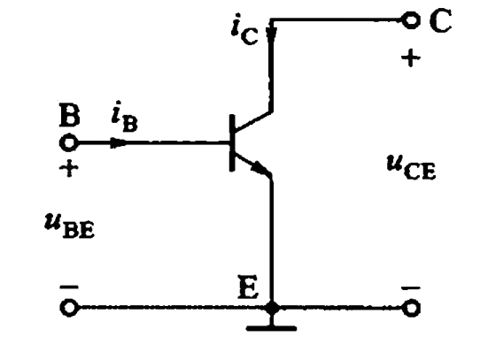

# 三极管模型

三极管电路的参考方向如上图。

三极管有两个输入，两个输出。

输入：$U_{BE},U_{CE}$

输出：$I_{B},I_{E}$

其它电路变量的计算
$$U_{BC}=U_{BE}-U_{CE}$$

$$I_{C}=I_{E}-I_{B}$$

对于不同的$U_{BE},U_{CE}$，三极管工作在不同的状态。

## 放大区

输入要求：$U_{BE}>U_{BE sat},U_{CE}>U_{CE sat}$

输出
$$
I_{B}=\frac{U_{BE}-U_{BE sat}}{R_{B}}
$$

$$
I_{E}=\beta I_{B}
$$

其中，$U_{BE sat}$是导通电压，通常为 0.6V ~ 0.8V；$R_{B}$是基极电阻，通常已知；其中，β 是三极管的电流放大倍数，通常已知。