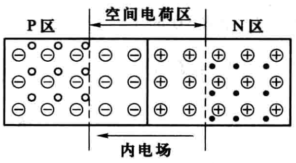

# 二极管三极管原理

**纯净的半导体**中含有**自由电子**（带负电）和**空穴**（带正电）两种运载电荷的粒子——**载流子**，自由电子和空穴的数量相等，整个半导体呈现电中性。

如果在纯净的半导体中掺入少量的某种元素，即成为**杂质半导体**。掺入硼或铝、镓等三价元素的半导体称为空穴型半导体，简称**P型半导体**。P型半导体中，掺入的三价元素越多，空穴的数量也越多，空穴是多数载流子；当然也存在少量的自由电子，是少数载流子。掺入磷或砷、锑等五价元素的半导体称为电子型半导体，简称**N型半导体**。N型半导体中自由电子是多数载流子，空穴是少数载流子。

如果采用工艺措施，使一块杂质半导体的一侧为P型，另一侧为N型，则在P型和N型半导体的交界面附近形成**PN结**，如图所示。图中P区的空心圈表示能移动的空穴，减号圈表示由得到一个电子的三价杂质所形成的不能移动的负离子；N区中的实心点表示能移动的自由电子，加号圈表示由失去一个电子的五价杂质所形成的不能移动的正离子。

