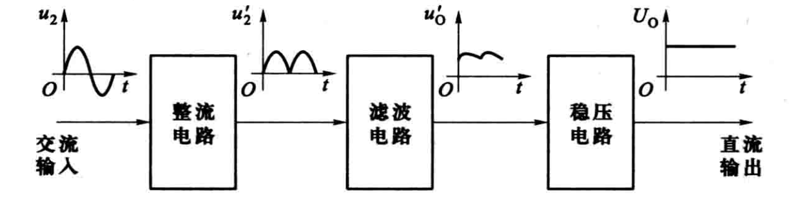
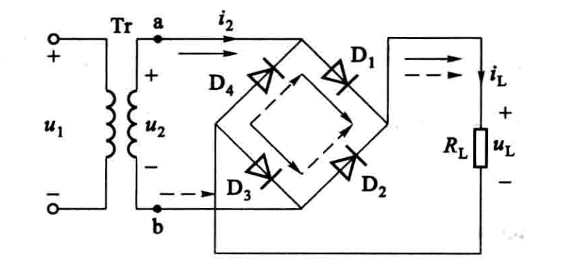
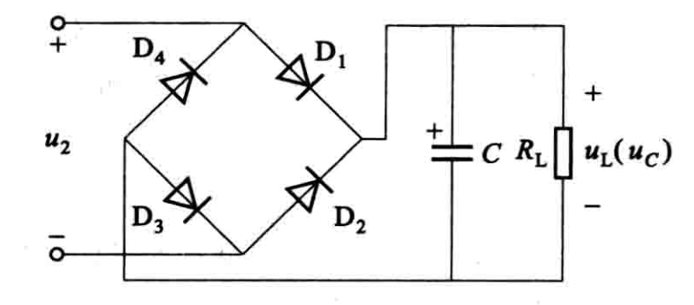
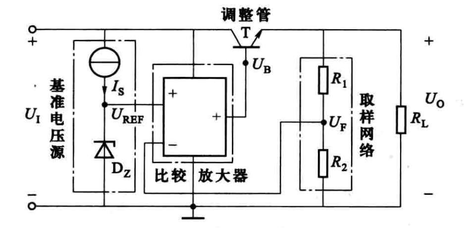
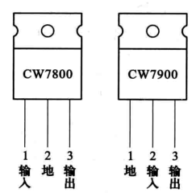
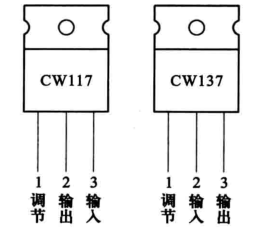
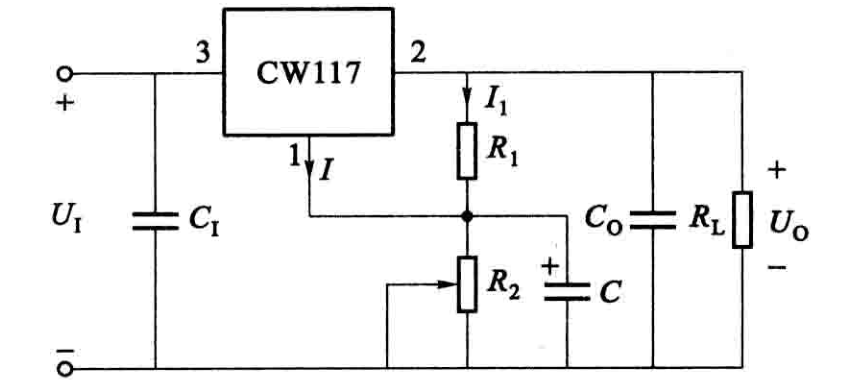

# 功率电子电路

## 直流稳压电源

### 单相桥式整流电路

负载电阻  $R_{\mathrm{L}}$  上所得单向脉动电压的平均值 (即直流分量)

$$
U_{\mathrm{L}}=\frac{1}{\pi} \int_{0}^{\pi} \sqrt{2} U_{2} \sin \omega t \mathrm{~d}(\omega t)=\frac{2 \sqrt{2}}{\pi} U_{2} \approx 0.9 U_{2}
$$

流过负载电阻  $R_{\mathrm{L}}$  的电流  $i_{\mathrm{L}}$  的平均值

$$
I_{\mathrm{L}}=\frac{U_{\mathrm{L}}}{R_{\mathrm{L}}}=0.9 \frac{U_{2}}{R_{\mathrm{L}}}
$$

通过每个二极管的电流平均值为负载电 流平均值的一半, 即

$$
I_{\mathrm{D}}=\frac{1}{2} I_{\mathrm{L}}=0.45 \frac{U_{2}}{R_{\mathrm{L}}}
$$

每个整流二极管所承受的最大反向电压为

$$
U_{\mathrm{DRM}}=\sqrt{2} U_{2}
$$

通过变压器二次侧的电流  $i_{2}$  仍为正弦波, 其有效值

$$
I_{2}=\frac{U_{2}}{R_{\mathrm{L}}}=\frac{U_{\mathrm{L}}}{0.9 R_{\mathrm{L}}}=1.11 I_{\mathrm{L}}
$$

电源变压器的容量 (即视在功率)

$$
S=U_{2} I_{2}
$$

### 滤波电路

在  $R_{\mathrm{L}} C \geqslant(3 \sim 5) T / 2$  ( $T$  为  $u_{2}$  的周期) 时,负载电压的平均值可按下式估算

$$
U_{\mathrm{L}} \approx 1.2 U_{2}
$$

### 稳压电路

串联型稳压电路

集成稳压电路

可调式三端集成稳压器 CW117 和 CW137 , 在输出端与调节端之间具有 1.25 V (典型值) 基准电压.

CW117 接成输出电压连续可调的基本电路

$$
U_{\mathrm{O}} \approx U_{21}+I_{1} R_{2}=1.25\left(1+\frac{R_{2}}{R_{1}}\right)
$$

## 功率半导体器件和变流电路

