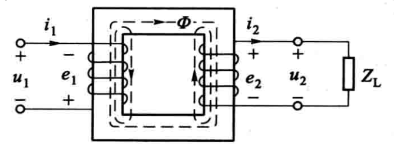

# 变压器和电动机

## 变压器

### 变压器原理

$$
\frac{U_{1}}{U_{20}} \approx \frac{N_{1}}{N_{2}}=k
$$

式中,  $k$  称为变压比, 简称为变比。

一次、二次绕组的变压比近似等于它们的匝数比, 当  $N_{1}$ 、 $N_{2}$  不同时, 变压器可以把某一数值的交流电压变换成同频率的另一个数值的交流电压, 这就是变压器的电压变换作用。

$$
\dot{I}_{1} \approx-\frac{N_{2}}{N_{1}} \dot{I}_{2}
$$

在额定情况下, 一次、二次绕组的电流有效值近似地与它们的匝数成反比。也就是说变压器具有电流变换作用。式中的负号表示, 对于图所示的电流参考方向而言, 电流  $\dot{I}_{1}$  和  $\dot{I}_{2}$  在相位上几乎相差  $180^{\circ}$ , 因此, 磁通势  $\dot{I}_{1} N_{1}$  和  $\dot{I}_{2} N_{2}$  的实际方向几乎是相反的。

$$
Z_{\mathrm{L}}^{\prime}=\left(\frac{N_{1}}{N_{2}}\right)^{2} Z_{\mathrm{L}}
$$

式说明, 接在二次绕组的负载阻抗  $Z_{\mathrm{L}}$  对一次侧的影响, 可以用一个接于一次绕组的等效阻抗  $Z_{\mathrm{L}}^{\prime}$  来代替, 等效阻抗  $Z_{\mathrm{L}}^{\prime}$  等于  $Z_{\mathrm{L}}$  的  $k^{2}$  倍。

### 变压器的外特性

变压器一次电压  $U_{1}$  为额定值时,  $U_{2}=f\left(I_{2}\right)$  的关系曲线称为变压器的外特性。

### 变压器的损耗和效率

变压器的输出功率  $P_{2}$  和输人功率  $P_{1}$  之比称为变压器的效率, 通常用百分数表示

$$
\eta=\frac{P_{2}}{P_{1}} \times 100 \%=\frac{P_{2}}{P_{2}+P_{\mathrm{Fe}}+P_{\mathrm{Cu}}} \times 100 \%
$$

### 变压器的额定值

额定电压  $U_{1 \mathrm{~N}} / U_{2 \mathrm{~N}}$

额定电流  $I_{1 \mathrm{~N}} / I_{2 \mathrm{~N}}$

额定容量  $S_{\mathrm{N}}$ , 额定容量即额定视在功率, 表示变压器输出电功率的能力

对于单相变压器

$$
S_{\mathrm{N}}=U_{2 \mathrm{~N}} I_{2 \mathrm{~N}}
$$

对于三相变压器

$$
S_{\mathrm{N}}=\sqrt{3} U_{2 \mathrm{~N}} I_{2 \mathrm{~N}}
$$

式中的  $U_{2 \mathrm{~N}}$ 、 $I_{2 \mathrm{~N}}$  为线电压和线电流。

## 三相异步电动机

合成磁场的转速，同步转速（转/分）

$$
n_{1}=\frac{60 f}{p}
$$

- $f$：电源频率
- $p$：磁极对数

异步电动机的转子转速  $n$  与旋转磁场的同步转速  $n_{1}$  之差是保证异步电动机工作的必要因素。这两个转速之差称为转差, 用  $\Delta n$  表示, 即

$$
\Delta n=n_{1}-n
$$

转差与同步转速之比称为转差率,  用  $s$  表示,即

$$
s=\frac{\Delta n}{n_{1}}=\frac{n_{1}-n}{n_{1}}
$$

