# 数字集成电路

## 逻辑代数运算规则

逻辑代数有三种基本的逻辑运算：与运算、或运算和非运算，其他的各种逻辑运算都可以由这三种基本运算组成。

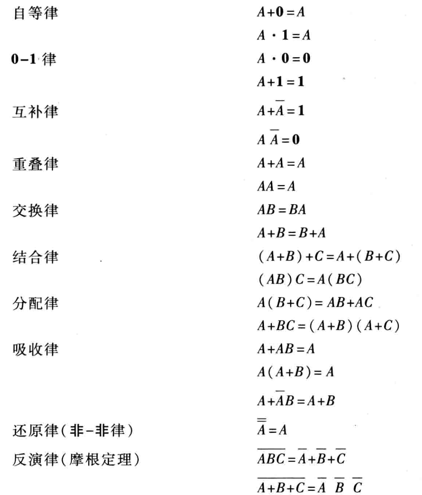

## 逻辑函数的表示与化简

当一组输出变量（因变量）与一组输入变量（自变量）之间的函数关系是一种逻辑关系时，称为逻辑函数。一个具体事物的因果关系就可以用逻辑函数表示。

### 表示方法

- 逻辑状态表：列出输入、输出变量的所有逻辑状态
- 逻辑表达式：用基本运算符号列出输入、输出变量间的逻辑代数式
- 逻辑图：用逻辑符号表示输入、输出变量间的逻辑关系
- 卡诺图：与变量的最小项对应的按一定规则排列的方格图

### 逻辑函数的代数化简法

合并项法

$$
A B+A \bar{B}=A
$$

吸收法

$$
A+A B=A
$$

消去法

$$
A B+\bar{A} B=A+B
$$

配项法

$$
A+\bar{A}=1
$$

## 集成门电路

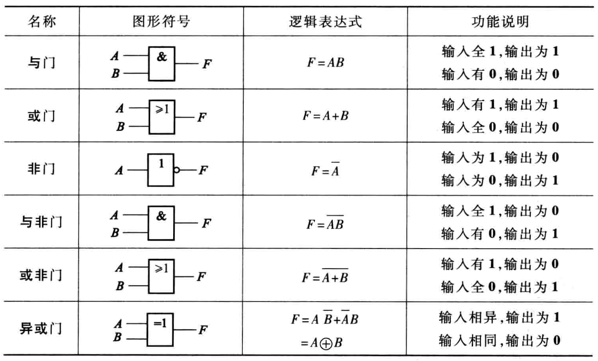

TTL 门电路是晶体管-晶体管逻辑 ( Transistor-Transistor Logic) 门电路的简称。其特点是工作速度快，带负载能力强，抗干扰性能好，所以一直是数字系统普遍采用的器件之一。

### TTL与非门电路

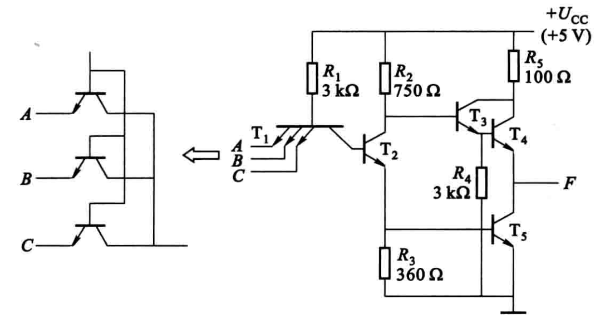

**电压传输特性**

如果把与非门的一个输入端接一个可变的直流电源，其余输入端接高电平，当输入电压 $U_{\mathrm{I}}$ 从零逐渐增加到高电平，输出电压便会作出相应的变化，就可以得到如图所示的TTL与非门的电压传输特性曲线。

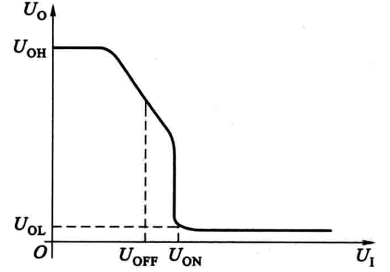

**主要参数**

(1) 输出高电平  $U_{\mathrm{OH}}$  和输出低电平  $U_{\mathrm{OL}}$  。

$U_{\mathrm{OH}}$  是指输入至少有一个为低电平时的输出电平,  $U_{\mathrm{OL}}$  是指输入端全为高电平时的输出电平。在实际应用中, 通常规定了高电平的下限值及低电平的上限值。例如 TTL 与非门当  $U_{\mathrm{cc}}=5 \mathrm{~V}$  时,  $U_{\mathrm{OH}} \geqslant 2.4 \mathrm{~V}$, $U_{\mathrm{OL}} \leqslant 0.4 \mathrm{~V}$  。

(2) 开门电平  $U_{\mathrm{ON}}$  和关门电平  $U_{\mathrm{OFF}}$  。

开门电平  $U_{\mathrm{ON}}$  是指输出电平刚刚下降到输出低电平的上限值时的输入电平, 它是保证与非门的输出为低电平时的输入高电平下限值。

关门电平  $U_{\mathrm{OFF}}$  是指输出电平刚刚上升到输出高电平的下限值时的输入电平, 它是保证与非门的输出为高电平时的输入低电平上限值。对 TTL 与非门, 一般规定  $U_{\mathrm{ON}}=1.8 \mathrm{~V}$, $U_{\mathrm{OFF}}=0.8 \mathrm{~V}$  。

(3) 输入低电平噪声容限  $U_{\mathrm{NL}}$  和输入高电平噪声容限  $U_{\mathrm{NH}}$  。 噪声容限表征了与非门电路的抗干扰能力。

当输入低电平  $\left(U_{\mathrm{IL}}=U_{\mathrm{OL}}\right)$  时, 只要干扰信号与输入低电平叠加起来的数值小于  $U_{\text {OFF}}$ , 输出仍为高电平, 逻辑关系正常。表征这一干扰信号的极限值 (最大值) 即为输入低电平噪声容限  $U_{\mathrm{NL}}$ , 显然

$$
U_{\mathrm{NL}}=U_{\mathrm{OFF}}-U_{\mathrm{OL}}
$$

$U_{\mathrm{NL}}$  越大表示输入低电平时的抗干扰能力越强。

当输入高电平  $\left(U_{\mathrm{IH}}=U_{\mathrm{OH}}\right)$  时, 只要干扰信号 (负向) 与输入高电平叠加起来 的数值大于  $U_{\mathrm{ON}}$ , 输出仍为低电平, 逻辑关系正常。表征这一干扰信号的极限值 (最大值) 即为输入高电平噪声容限  $U_{\mathrm{NH}}$ , 显然

$$
U_{\mathrm{NH}}=U_{\mathrm{OH}}-U_{\mathrm{ON}}
$$

$U_{\mathrm{NH}}$  越大表示输入高电平时的抗干扰能力越强。

(4) 扇出系数  $N_{0}$  。

扇出系数  $N_{0}$  是指一个与非门能带同类门的最大数目, 它表示与非门的带负载能力。对 TTL 与非门而言, 手册给定  $N_{0} \geqslant 8$  。

(5) 平均传输延迟时间  $t_{\mathrm{pd}}$  。

TTL 与非门工作时, 由于晶体管从导通到截止或者从截止到导通都需要一定的时间, 因此输出脉冲相对于输入脉冲来说总有一定的延迟, 称为传输延迟。平均传输延迟时间

$$
t_{\mathrm{pd}}=\left(t_{\mathrm{pHL}}+t_{\mathrm{pLH}}\right) / 2
$$

它表示门电路的开关速度,  $t_{\mathrm{pd}}$  越小, 开关速度越快。

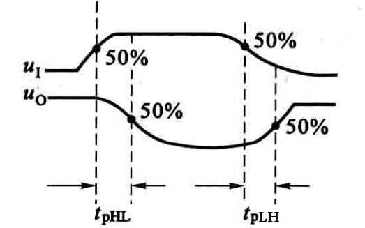

### TTL三态与非门电路

如果把几个逻辑门的输出端都接到同一根传输线上 ，要求每个逻辑门能在不同时刻轮流向传输线传送信号 ，这就需要对每个逻辑门进行分时控制。这种带有控制端的逻辑门就是三态门。

三态门有三种状态： 高阻态(开路)、低电平和高电平 。

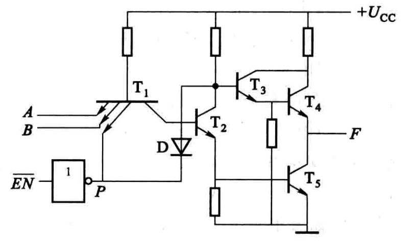

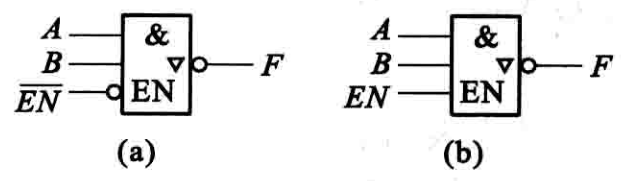

在 (a) 图中  $\overline{E N}=1$  时,  $F$  为高阻态, 在  $\overline{E N}=0$  时  $F=\overline{A B}$  ，故称为控制端低电平时有效的三态与非门。

在 (b) 图中  $E N=0$  时,  $F$  为高阻态, 在  $E N=1$  时  $F=\overline{A B}$ , 故称为控制端高电平时有效的三态与非门。

## 组合逻辑电路

把门电路按一定规律加以组合，可以构成具有各种逻辑功能的逻辑电路。 这种电路叫组合逻辑电路。

输出状态只与当前的输入状态有关，与原输出状态无关。或者说，当输入变量选取任意一组确定的值以后，输出变量的状态就唯一地被确定。

### 加法器

加法器是算术运算电路中的基本运算单元，用于二进制数的加法运算。

**半加器**

只求本位相加，不计低位进位

$A, B$：两个相加位 ；$S$：半加和；$C$：进位数

$$
\begin{array}{l}
S=\bar{A} B+A \bar{B} \\
C=A B
\end{array}
$$

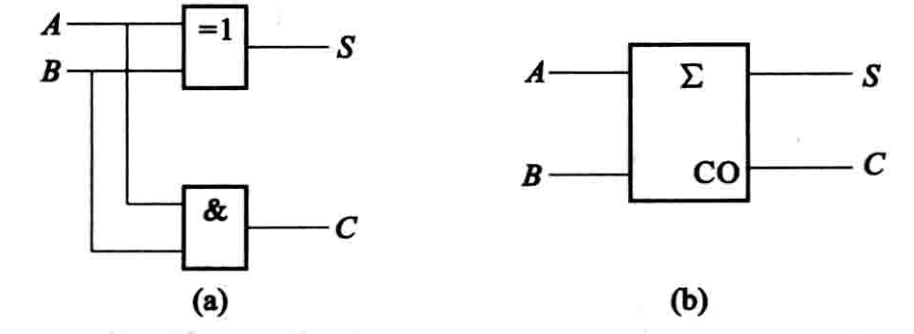

图(a) 是实现半加器的逻辑图
图(b) 是半加器的逻辑符号

**全加器**

两个一位二进制数相加，并考虑低位来的进位

$A_{n} 、 B_{\mathrm{n}}$  是本位的加数和被加数,  $C_{\mathrm{n}-1}$  是从低位来的进位数,  $S_{\mathrm{n}}$  为和数,  $C_{\mathrm{n}}$  为进位数

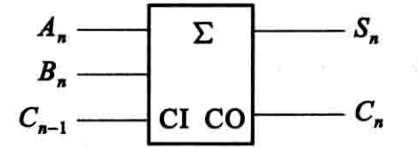

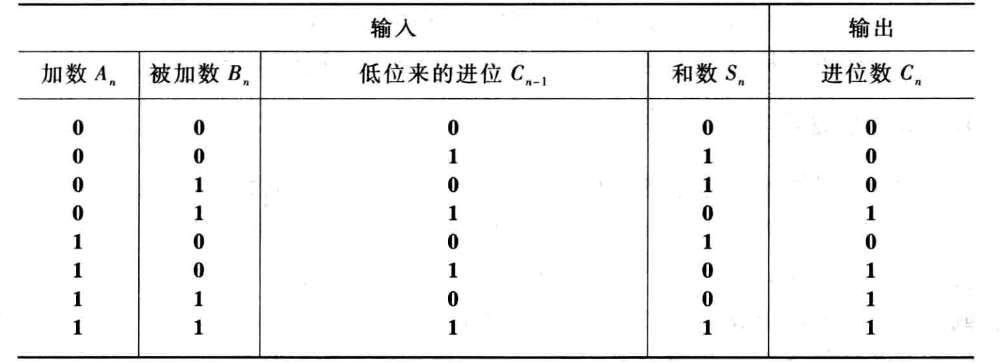

### 编码器、译码器及数字显示

**编码器**

编码就是用二进制代码来表示一个给定的十进制数 、字符或含义 。 完成这一功能的逻辑电路称为编码器。

**译码器**

译码是编码的逆过程 ， 即是将代码所表示的信息翻译过来的过程 。 实现译码功能的电路称为译码器。

## 集成触发器

时序逻辑电路：它的输出不仅与当前时刻的输入状态有关，而且与电路原来的状态有关。

集成触发器：是组成时序逻辑电路的基本部件。

集成触发器的特点：

（1）触发器具有 0 和 1 两个稳定状态，在触发信号作用下，可以从原来的一种稳定状态转换到另一种稳定状态。

（2）触发器的输出状态不仅和当时的输入有关，而且和以前的输出状态有关，这是触发器和门电路的最大区别。

### 基本 RS 触发器

$\bar{S}$ 、 $\bar{R}$  为输入端,  $Q$ 、 $\bar{Q}$  为输出端。 正常工作时  $Q$  与  $\bar{Q}$  的电平是相反的。

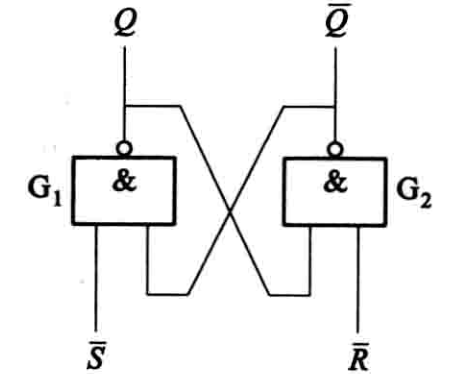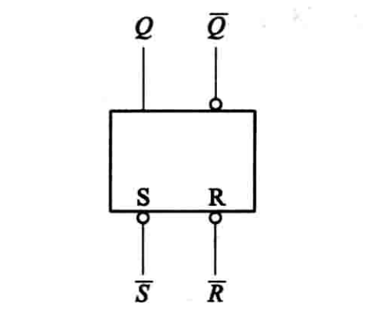

$Q=0$ 、 $\bar{Q}=1$ , 触发器处于 0 状态。
$Q=1$ 、 $\bar{Q}=0$ , 触发器处于 1 状态。

用  $Q^{n}$  表示触发器原来的状态 (称为原态),  $Q^{n+1}$  表示新的状态(称为次态)。

将触发器的原状态  $Q^{n}$  作为一个输入变量,  $Q^{n+1}$  的状态由  $\bar{S}$ 、 $\bar{R}$  和  $Q^{n}$  来 确定。可以列出基本 RS 触发器的逻辑状态转换表

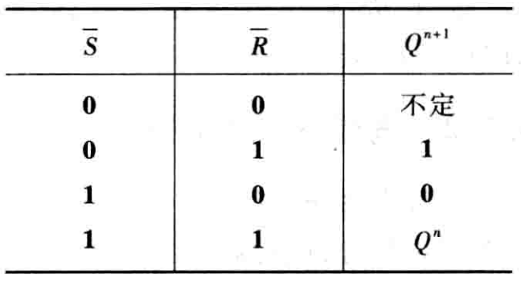

(1) 触发器的输出有两个稳态:  $Q=0$ 、 $\bar{Q}=\mathbf{1}$  和  $Q=1$ 、 $\bar{Q}=\mathbf{0}$  。这种有两个稳态的触发器通常称为**双稳态触发器**。若令  $\bar{S}=1$ 、 $\bar{R}=1$ , 触发器的状态就可以保持, 说明双稳态触发器具有记忆功能。

(2) 利用加于  $\bar{R}$ 、 $\bar{S}$  端的负脉冲可使触发器由一个稳态转换为另一稳态。 加入的负脉冲称触发脉冲。

(3) 可以直接置位。当  $\bar{R}=\mathbf{0}$ 、 $\bar{S}=\mathbf{1}$  时,  $Q=\mathbf{0}$ , 所以  $\bar{R}$  端称为置  $\mathbf{0}$  端或复位端; 而  $\bar{R}=1$ 、 $\bar{S}=0$  时,  $Q=1$ , 所以  $\bar{S}$  端称为置 1 端或置位端。  $\bar{S}$ 、 $\bar{R}$  上方的“一” (非号) 表示加负脉冲 (低电平) 时才有这个功能。图形符号中  $\bar{S}$ 、 $\bar{R}$  引线靠近方框处的小圆圈也表示该触发器是用低电平触发的。  $\bar{Q}$  引线靠近方框处的小圆圈表示该端状态和  $Q$  端相反。

### 同步RS触发器

在数字系统中往往要求触发器的动作时刻和其他部件相一致，这就必须有一个同步信号，以协调触发器和触发器、触发器和其他数字逻辑部件的动
作。同步信号是一种脉冲信号，通常称为**时钟脉冲**（ Clock Pulse 简称 CP ）。

具有时钟脉冲的触发器叫**同步触发器**。

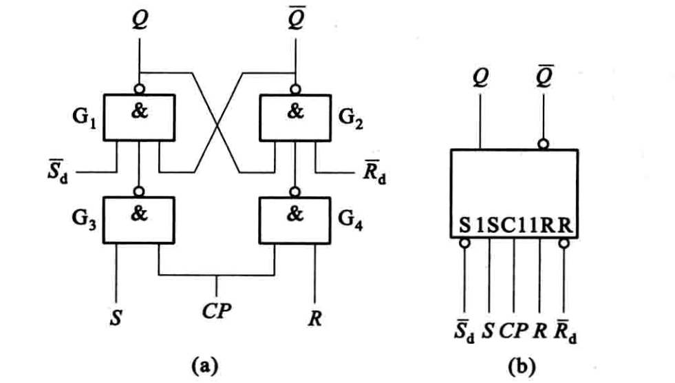

同步 RS 触发器的逻辑图如图 (a) 所示, 图形符号如图 (b) 所示。图中  $R$ 、 $S$  端为数据输入端,  $CP$  端为时钟脉冲输入端,  $\bar{S}_{\mathrm{d}}$ 、 $\bar{R}_{\mathrm{d}}$  为直接置位、复位输入端。图形符号中方框内文字符号  $\mathrm{C} 1$ 、 $1 \mathrm{S}$ 、 $1 \mathrm{R}$  中的 $1$ 是一种关联标识,表示  $\mathrm{C} 1$  和  $1 \mathrm{S}$ 、 $1 \mathrm{R}$  是相互关联的输入, 即只有在  $\mathrm{C} 1$  是高电平时,  $1 \mathrm{S}$ 、 $1 \mathrm{R}$  才起作用(  $\mathrm{C} 1$  外引线靠近框处加有一小圆圈,则表示是低电平有效,无小圆圈则表示是高电平有效)。

$\bar{S}_{\mathrm{d}}$ 、 $\bar{R}_{\mathrm{d}}$  不受  CP  的控制和  $S$ 、 $R$  的影响, 称为异步输人端, 可以使触发器直接置位或复位。当  $\bar{S}_{\mathrm{d}}=0$ 、 $\bar{R}_{\mathrm{d}}=1$  时,  $Q=1$ , 直接置位; 当  $\bar{S}_{\mathrm{d}}=   1$ 、 $\bar{R}_{\mathrm{d}}=0$  时,  $Q=0$ , 直接复位。所以  $\bar{S}_{\mathrm{d}}$  和  $\bar{R}_{\mathrm{d}}$  分别称为直接置位输人端和直接复位输人端, 它们都是低电平或负脉冲时有效。  $\bar{S}_{\mathrm{d}}$  、  $\bar{R}_{\mathrm{d}}$  常用来设置所需要的初始状态, 一般应在时钟脉冲到来之前设定触发器的初始状态。不作用时,  $\bar{S}_{\mathrm{d}}$  和  $\bar{R}_{\mathrm{d}}$  都应设置成高电平。

从逻辑图中可以看出,  $C P=0$  时,  $R$  和  $S$  都被封锁, 触发器的状态不会改变。只有在  $C P=1$  时, 触发器状态才会根据  $S$ 、 $R$  端的输人而改变。这样当整个系统的触发器受同一个时钟脉冲控制时, 系统中的各个部分就能协调一致的工作。这就是同步的作用。

### D 锁存器

在同步 RS 触发器基础上改进 ， 且只能用于锁存数据。

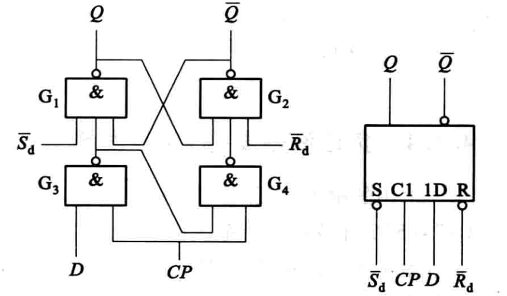

当  $C P=0$  时,  $D$  输人端被封锁, 数据不能传人,  $D$  锁存器状态不变。

当  $C P=1$  时,  D  锁存器输出状态由  $D$  输人端电平决定, 若  $D={1}$  则  $Q={1}$ , 若  $D={0}$  则  $Q={0}$  。一旦  $C P$  重新变为  ${0}$, $D$  数据就被锁存。

D 锁存器的逻辑函数表达式(通常称为特性方程)为

$$
Q^{n+1}=D
$$

由于 D 锁存器的状态只有在 $CP=1$ 期间才能改变, 故把这种触发方式称为电平触发方式。电平触发方式的优点是结构简单, 动作比较快。缺点是 $CP= 1$ 期间, 输人状态的变化会引起输出状态的变化。因此电平触发方式的触发器不能用于计数, 只能用于锁存数据。

### 正边沿触发的 D 触发器

边沿触发是指触发器的次态仅由时钟脉冲的**上升沿**或**下降沿**来到时的输入信号决定，在此以前或以后输入信号的变化不会影响触发器的状态。

边沿触发器分为正边沿（上升沿）触发器和负边沿（下降沿）触发器两类。

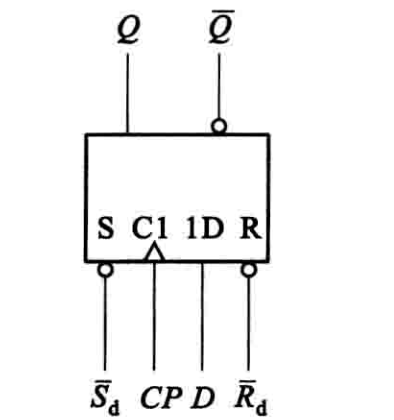

图为正边沿 D 触发器的图形符号。注意图中方框内 C1 处有一个符号 “^”,表示 C1 的输入由 0 变 1 (上升沿)时, 1D 的输人起作用。

### 负边沿触发的 JK 触发器

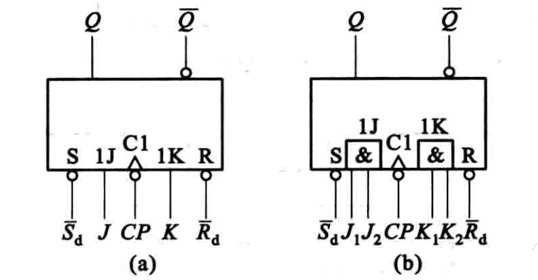

图中是负边沿  JK  触发器的图形符号, 其中图  (b) 中的  J 、 K  各有两个输人端 (也可能为多个输人端), 它们之间是与逻辑关系, 即  $J=J_{1} J_{2}$, $K=   K_{1} K_{2}$  。图中  $\bar{S}_{\mathrm{d}}$  是直接置位端,  $\bar{R}_{\mathrm{d}}$  是直接复位端,  CP  是时钟脉冲输人端。  CP  端靠近方框处有一小圆圈, 加上方框内的符号 “^”, 表示  CP  信号从高电平到低电平时有效, 即属负边沿(下降沿)触发。

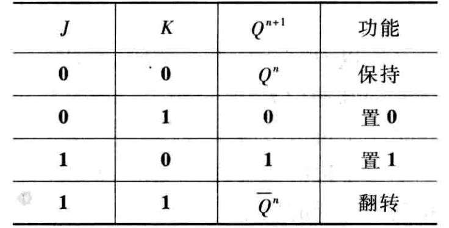

特性方程为

$$
Q^{n+1} =J \bar{Q}^{n}+\bar{K} Q^{n}
$$

## 时序逻辑电路

时序逻辑电路的特点：

1. 由触发器或触发器加组合逻辑电路组成
2. 时序逻辑电路 的输出不仅与当前时刻的输入状态有关，而且与电路原来状态（触发器的状态）有关 。
3. “ 时序 ” 意即电路的状态与时间顺序有密切的关系

时序逻辑电路的分类：根据时钟脉冲加入方式的不同，分为**同步时序逻
辑电路**和**异步时序逻辑电路**。

### 时序逻辑电路的分析方法

时序逻辑电路的分析就是分析给定时序逻辑电路的逻辑功能。由于时序电路的逻辑状态是按时间顺序随输入信号的变化而变化，因此，分析时序逻辑电路就是找出电路的输出状态随输入变量和时钟脉冲作用下的变化规律。

时序逻辑电路的分析步骤

1. 分析电路的组成。了解哪些是输入量，哪些是输出量。了解各触发器之间的连接方法和组合电路部分的结构（在不少时序逻辑电路中， 都含有组合逻辑电路的部分）。
2. 写出组合逻辑电路对外输出的逻辑表达式，称为输出方程。若没有则不写。
3. 写出各个触发器输入端的逻辑函数表达式，称为驱动方程。
4. 把各个触发器的驱动方程代入触发器的特性方程，得出各触发器的状态方程。
5. 根据状态方程和输出方程，列出逻辑状态转换表，画出波形图，确定该时序电路的状态变化规律和逻辑功能。

有效状态：计数循环中出现的状态称为有效状态。
无效状态：计数循环中不出现的状态称为无效状态。

计数器正常工作时，电路状态只会在有效状态内循环，不会出现无效状态。但如果外界干扰或其它偶然因素的作用，可能会使逻辑电路出现无效状态，这时如果在时钟脉冲作用下能使电路自动回到某一个有效状态，则称该电路能**自启动**。

### 寄存器

寄存器分为数码寄存器和移位寄存器。

#### 数码寄存器

数码寄存器用来暂时存放参与运算的数据和运算结果。一位触发器可寄存一位二进制数，需要存放多少位数，就需要用多少个触发器。

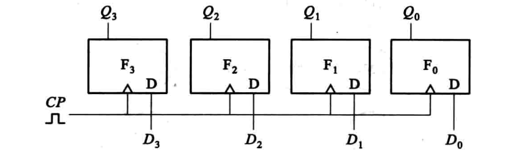

图中是用 4 个  D  触发器组成的 4 位数码寄存器。  $D_{3} D_{2} D_{1} D_{0}$  为待寄存 的 4 位二进制数码, 当  CP  端加人一个正脉冲后, 4 位二进制数码就存人 4 个触发器了。

#### 移位寄存器

移位寄存器的功能:存放数码和移位。

移位: 就是在移位脉冲作用下使得寄存器的数码向左或向右移位。

通过数码移位，可以实现两个二进制数的串行相加、相乘和其他的算术运算。

移位寄存器分为单向移位寄存器和双向移位寄存器; 按输入方式的不同，可分为串行输入和并行输入; 按输出方式的不同，可分为串行输出和并行输出。

**单向移位寄存器**: 分右移寄存器和左移寄存器。数码自左向右移称为右移寄存器; 数码自右向左移称为左移寄存器。

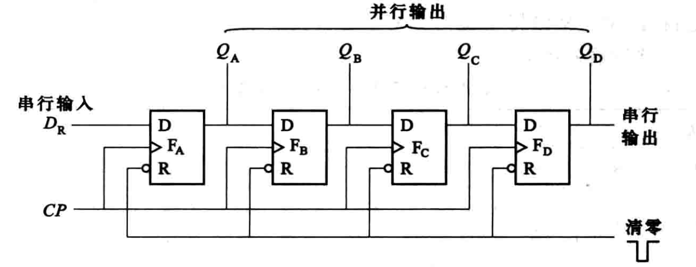

图中是由  D  触发器组成的 4 位数码右移寄存器的逻辑图。输人只加至 触发器  $\mathrm{F}_{\mathrm{A}}$  的  D  端, 是串行输人方式。 4 位数码输出可以从 4 个触发器的  Q  端得 到, 即并行输出; 也可以依次从最后一个触发器  $\mathrm{F}_{\mathrm{D}}$  的  $Q_{\mathrm{D}}$  端得到, 即串行输出。

各个触发器的状态方程为  $Q_{A}^{n+1}=D_{\mathrm{R}}, Q_{\mathrm{B}}^{n+1}=Q_{A}^{n}, Q_{\mathrm{C}}^{n+1}=   Q_{\mathrm{B}}^{n}, Q_{\mathrm{D}}^{n+1}=Q_{\mathrm{C}}^{n}$

每加一个移位脉冲, 数码就向右移动一位, 故该寄存器是一个右移寄存器。

**双向移位寄存器**

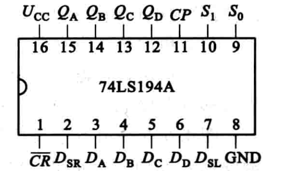

图中是集成 4 位双向通用移位寄位器 **74LS194A** 的外引线排列图。图中  $D_{\mathrm{A}}$  、  $D_{\mathrm{B}}$ 、 $D_{\mathrm{C}}$ 、 $D_{\mathrm{D}}$  为并行输人端;  $Q_{\mathrm{A}}$ 、 $Q_{\mathrm{B}}$ 、 $Q_{\mathrm{C}}$ 、 $Q_{\mathrm{D}}$  为对应的并行输出端;  $D_{\mathrm{SR}}$  和  $D_{\mathrm{SL}}$  分别为右移和左移串行数据输人端;  $\overline{C R}$  为直接清零端;  $S_{1}$ 、 $S_{0}$  为工作模式控制端。

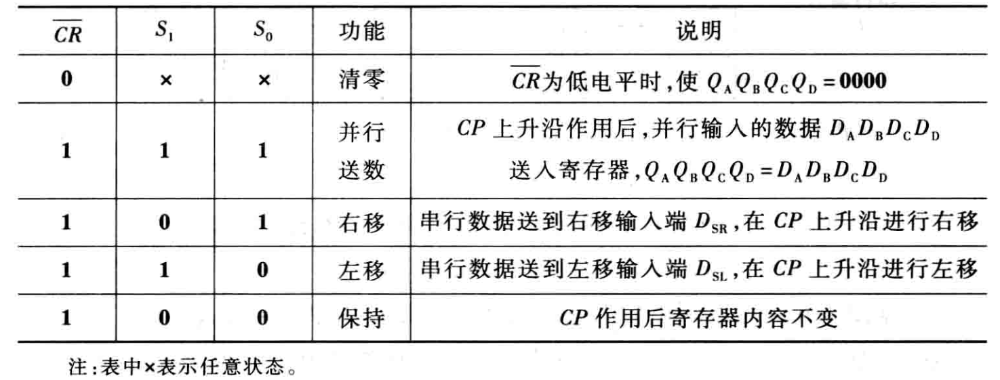

### 计数器

能对脉冲的个数进行计数的逻辑部件，即计数器。

计数器的种类很多。按计数器数字的增加或减小分类，可分为加法计数器、减法计数器和既能做加法又能做减法的可逆计数器。按脉冲引入方式的不同，可分为同步计数器和异步计数器。按计数进制分类又可分为二进制计数器和非二进制计数器。

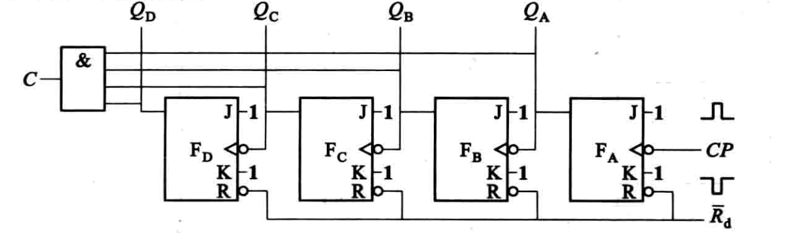

图中为异步 4 位二进制加法计数器逻辑图。由图可知, 每个  $CP$  下降沿作用,  $Q_{A}$  翻转; 每个 $ Q_{A}$  下降沿作用,  $Q_{\text {B }}$  翻转; 每个  $Q_{\mathrm{B}}$  下降沿作用,  $Q_{\mathrm{C}}$  翻转; 每个  $Q_{\mathrm{C}}$  下降沿作用,  $Q_{\mathrm{D}}$  翻转。

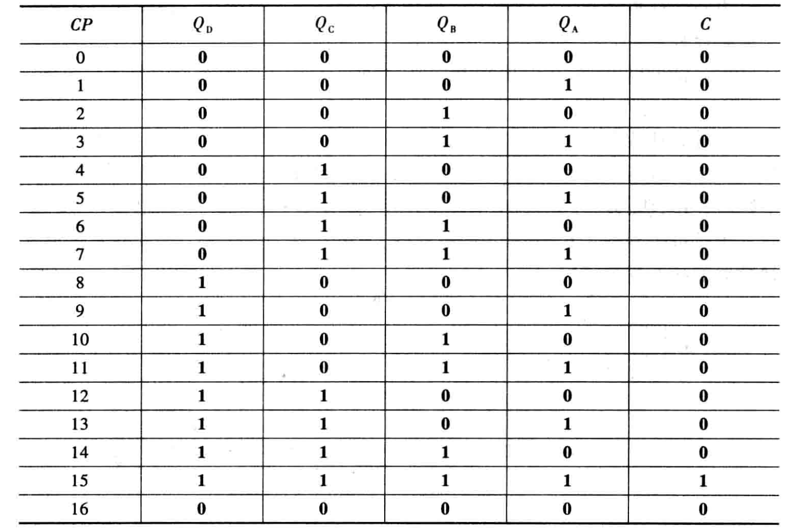

异步计数器的优点是结构简单，缺点是各触发信号逐级传递,需要一定的传输延迟时间，所以计数速度较慢。为此可采用同步计数器。

无论是异步二进制计数器还是同步二进制计数器，都有相应的集成块。

下图是集成 4 位二进制可逆计数器 **74LS193** 的外引线排列图和功能表。外引线排列图中  $A$ 、 $B$ 、 $C$ 、 $D$  为预置数置入端, 当  $\overline{L D}$  端接低电平时, 预置数被置人,  $Q_{\mathrm{D}} Q_{\mathrm{C}} Q_{\mathrm{B}} Q_{\mathrm{A}}=   D C B A$ , 有了预置数功能, 计数器就可以从任意状态开始计数。  $C R$  为清零 (复位) 端, 高电平有效, 当  $C R=1$  时,  $Q_{\mathrm{D}} Q_{\mathrm{c}} Q_{\mathrm{B}} Q_{\mathrm{A}}=0000$  。时钟输人端  $C P_{+}$ 、 $C P_{-}$ 分别可使计数器实现加计数和减计数, 加计数时,  $C P_{+}$ 为时钟输人,  $C P_{-}$ 必须接高电平, 减计数时  $C P_{-}$ 为时钟输人,  $C P_{+}$ 必须接高电平。  $\overline{C O}$  为进位端, 当加计数到 $1111$ 时发出一个负脉冲。  $\overline{B O}$  为借位端, 当减计数到 $0000$ 时发出一个负脉冲。功能表如表中  $\mathbf{1}$  表示高电平,  $\mathbf{0}$  表示低电平,  $\times$  表示任意态。

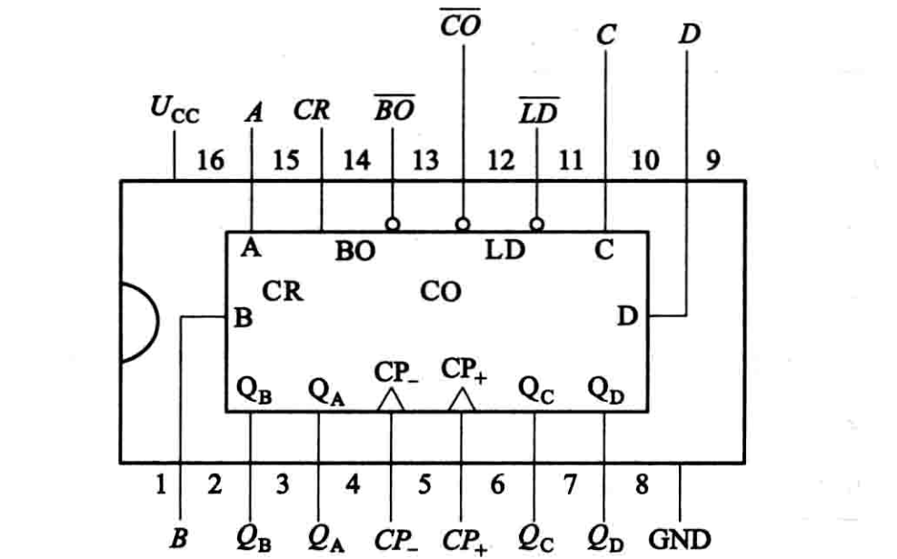

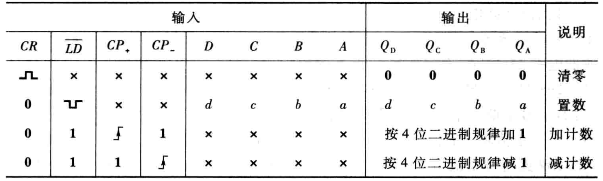

下图是集成 4 位二进制加法计数器  **74LS163**  的外引线排列图与功能表, 相同名称端子的功能与  74LS193  的功能一致,  $C T_{\mathrm{p}}$ 、 $C T_{\mathrm{T}}$  可作多片连接时的控制用。

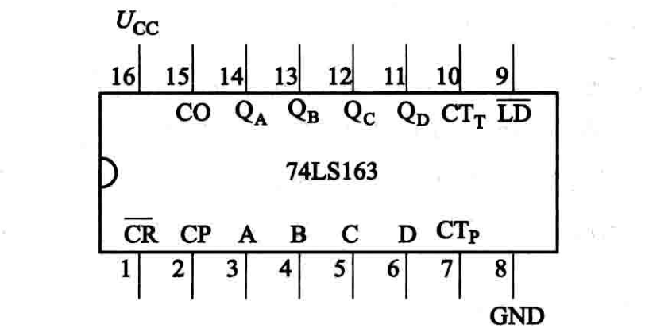

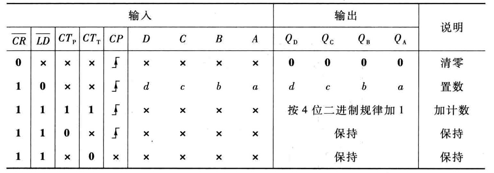

**任意进制计数器**： 就是指 N 进制计数器，即每来 N 个计数脉冲，计数器状态重复一次。 利用二进制或十进制计数器集成块，经过适当地联结可以方便地构成 N 进制计数器。

构成 N 进制计数器常用的方法有复位法和置数法。