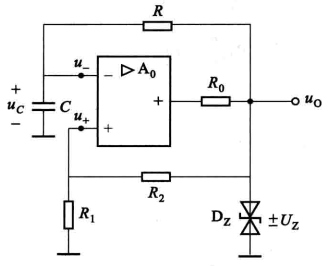
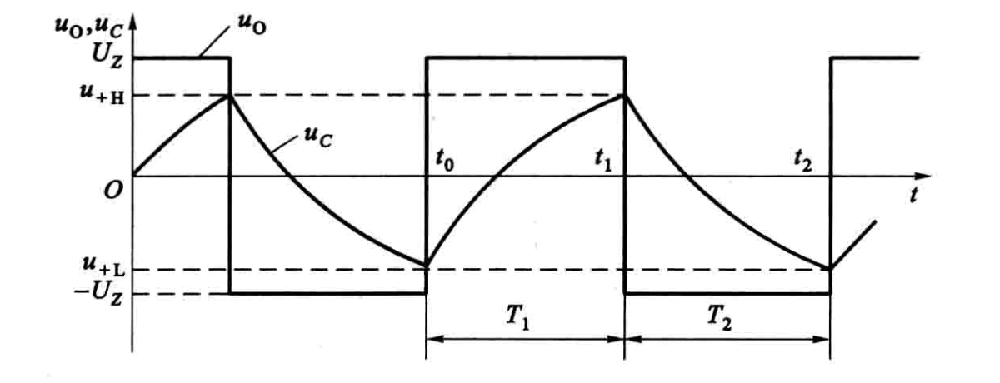
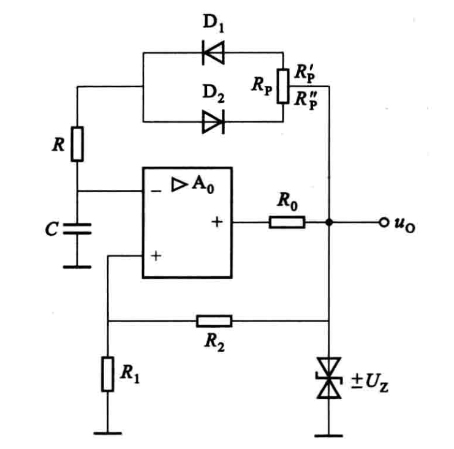
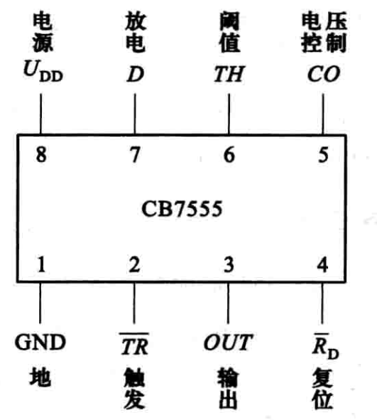
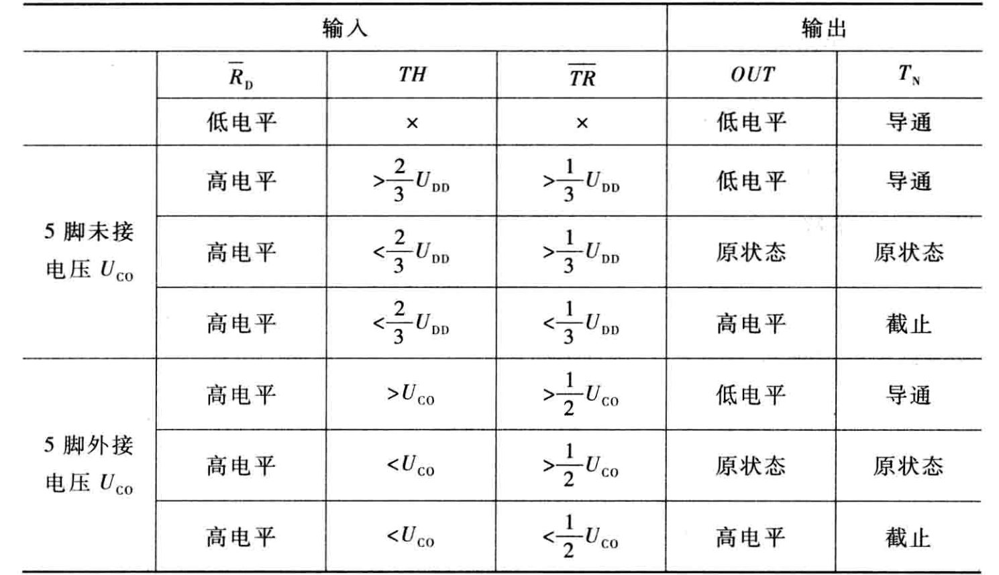
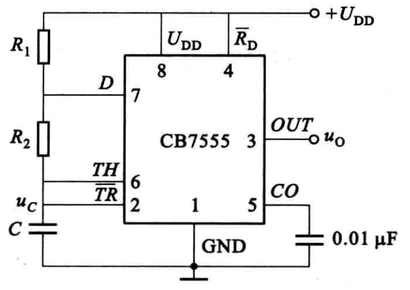
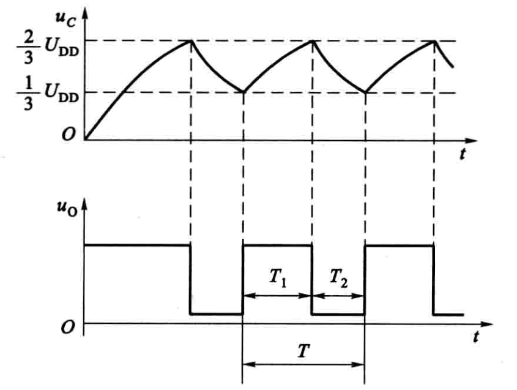
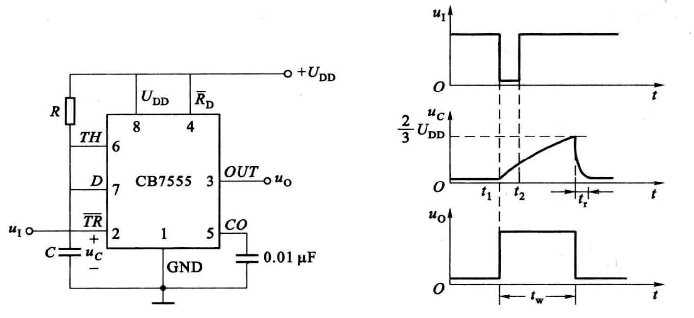
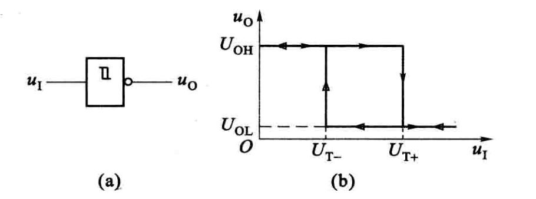
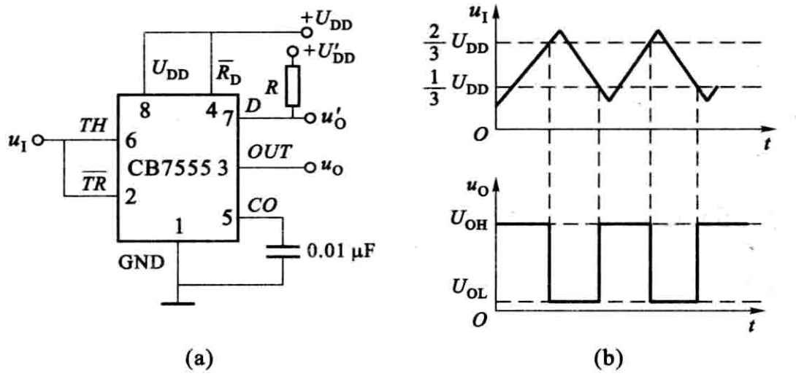

# 波形产生与变换

波形产生电路的共同特点

- 自激（不需要任何输入信号）
- 必须在电路中引入足够强的正反馈

## 用集成运放构成的多谐振荡器

当电路接通电源瞬间, 电容电压  $u_{c}=0$ , 集成运放处于正饱和还是负饱和纯属偶然。假设因双向稳压管的正、负向稳定电压均为  $U_{\mathrm{Z}}$ , 这时  $u_{0}= \pm U_{Z}$  .

$$
T_{1}=R C \ln \left(1+\frac{2 R_{1}}{R_{2}}\right)
$$

$$
T_{2}=R C \ln \left(1+\frac{2 R_{1}}{R_{2}}\right)
$$

$$
T=2 R C \ln \left(1+\frac{2 R_{1}}{R_{2}}\right)
$$

定义矩形波高电平的时间与周期之比的百分值为矩形波的**占空比**。

$$
T_{1}=R_{P}^{\prime} C \ln \left(1+\frac{2 R_{1}}{R_{2}}\right)
$$

$$
T_{2}=R_{P}^{\prime \prime} C \ln \left(1+\frac{2 R_{1}}{R_{2}}\right)
$$

$$
T=R_{P} C \ln \left(1+\frac{2 R_{1}}{R_{2}}\right)
$$

##  用 555 集成定时器构成的多谐振荡器

$$
T_{1}=\left(R_{1}+R_{2}\right) C \ln 2 \approx 0.693\left(R_{1}+R_{2}\right) C
$$

$$
T_{2}=R_{2} C \ln 2 \approx 0.693 R_{2} C
$$

## 用555集成定时器构成的单稳态触发器

- 多谐振荡器没有稳定状态， 属无稳触发器。
- 双稳态触发器，有两个稳定状态，从一个稳态翻转为另一个稳态必须靠脉冲信号触发，脉冲消失后，稳态一直保持。
- 单稳态触发器在脉冲信号未加之前，处于稳定状态，经信号触发后，触发器翻转到新的状态，经过一定延时后触发器又自动翻转到原来的稳定状。所以只有一种稳定状态。

##  用 555 集成定时器构成的施密特触发器

施密特触发器有两个稳定状态，是一种双稳态触发器

- 不具有记忆保持功能，其稳定状态依赖输入信号来维持
- 它属于电平触发，而不是脉冲触发
- 两种状态翻转时的输入电压(称阈值电压)不同

