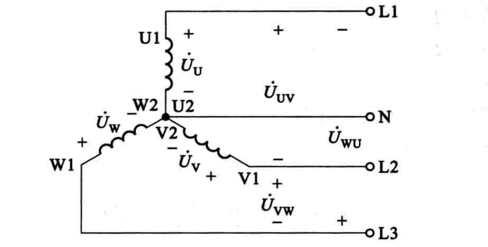

# 电路分析基础

## 基尔霍夫定律

### 几个名词

- 结点:三个或三个以上电路元件的连接点
- 支路:连接两个结点之间的电路
- 回路:电路中任一闭合路径称为回路
- 网孔:电路中最简单的单孔回路
- 每一条支路的电流称为支路电流，每两个结点之间的电压称为支路电压

### 基尔霍夫定律

**基尔霍夫电流定律(KCL)**：在任何电路中，任何结点上的所有支路电流的代数和在任何时刻都等于零
$$\sum i=0$$

把KCL应用到某一结点时，首先要指定每一支路电流的参考方向。参考方向离开结点的电流带正号；参考方向指向结点的电流带负号(反之亦然)。

KCL对广义节点也适用。

**基尔霍夫电压定律(KVL)**：在任何电路中，形成任何一个回路的所有支路沿同一循行方向电压的代数和在任何时刻都等于零
$$\sum u=0$$

为了应用KVL，必须指定回路的循行方向。当支路电压的参考方向和回路的循行方向一致时带正号，反之为负号。

### 支路电流法

支路电流法是电路最基本的分析方法之一。它以支路电流为求解对象，应用基尔霍夫定律分别对结点和回路列出所需要的方程式，然后计算出各支路电流。

支路电流求出后，支路电压和电路功率就很容易得到。

## 叠加定理与等效电源定理

**线性电路**是指用线性元件（电阻、电感、电容、工作于放大区的理想晶体管、变压器）组成的电路。线性电路有齐次性，如果输入信号经过放大或缩小后再加以求和，则输出信号也会相应放大或缩小；叠加性，当输入信号由两个或多个部分组成时，输出信号可以看作是这些部分输出信号的叠加和。

### 叠加定理

**叠加定理**的含义是，对于一个线性电路来说，由几个独立电源共同作用所产生的某一支路的电流或电压，等于各个独立电源单独作用时分别在该支路所产生的电流或电压的代数和。当其中某一个独立电源单独作用时，其余的独立电源应除去(电压源予以短路，电流源予以开路)。

在含有受控源的电路中，因受控源不是独立电源，不能单独作用。在某个独立电源单独作用而除去其余独立电源时，受控源不能除去，仍要保留在电路中。

### 等效电源定理

具有两个接线端的部分电路，称为**二端网络**。二端网络还视其内部是否包含电源而分为有源二端网络和无源二端网络。

以$N_{A}$表示有源二端网络，$N_{P}$表示无源二端网络。

对二端网络来说，从一个端子流出的电流，等于流入另一端子的电流。

对于无源二端网络，一般情况下，等效电路为一条无源支路，可用一等效电阻表示。

戴维宁定理指出，对外电路来说，一个线性有源二端网络可用一个电压源和一个电阻串联的电路来等效，该电压源的电压等于此有源二端网络的开路电压$U_{OC}$，串联电阻等于此有源二端网络除去独立电源后在其端口处的等效电阻$R_{0}$。这个电压源和电阻串联的等效电路称为戴维宁等效电路。

诺顿定理指出，对外电路来说，一个线性有源二端网络可用一个电流源和一个电阻并联的电路来等效，该电流源的电流等于此有源二端网络的短路电流$I_{SC}$，并联电阻等于此有源二端网络除去独立电源后在其端口处的等效电阻$R_{0}$。这个电流源和电阻并联的等效电路称为诺顿等效电路。

值得注意的是，戴维宁定理和诺顿定理对被等效网络的要求是该二端网络必须是线性的，而对外电路则无此要求。另外，若二端网络与外电路之间有耦合关系，例如外电路的某受控源受网络内某支路电流或电压的控制，则不能使用这两个定理。

$$R_{0}=\frac{U_{\mathrm{OC}}}{I_{\mathrm{SC}}}$$

当有源二端网络中含有受控源时，除去独立电源以后，受控源仍保留在网络中，这时应该用上式计算等效电阻$R_{0}$，而不能用电阻的串、并联化简的方法求出。

## 正弦交流电路

在实际应用中，除了直流电路外，更多的是正弦交流电路（简称交流电路）。发电厂所提供的电压和电流，几乎都是随时间按正弦规律变化的（称为正弦量）。在模拟电子电路中也常用正弦信号作为信号源。对于非正弦线性电路，也可以将非正弦信号分解成正弦信号进行计算，然后叠加。

前面介绍支路电流法、叠加原理和等效源定理虽然都是结合直流电路讨论的，但这些电路的基本分析方法对线性的交流电路也是适用的。**在交流电路中，正弦量的参考方向，是指正半周时的方向**。

为了分析和计算的方便，通常用相量(phasor)来表示正弦量，应用相量法(phasor method)来求解正弦交流电路。

### 正弦量的三要素

随时间按正弦规律变化的电压和电流称为正弦交流电，可以表示为

$$
\left.\begin{array}{c}
u=U_{\mathrm{m}} \sin \left(\omega t+\varphi_{u}\right) \\
i=I_{\mathrm{m}} \sin \left(\omega t+\varphi_{i}\right)
\end{array}\right\}
$$

最大值、角频率、初相位称为正弦量的三要素。

与周期、频率的关系

$$
\omega=\frac{2 \pi}{T}=2 \pi f
$$

有效值的计算

$$
I=\frac{I_{\mathrm{m}}}{\sqrt{2}} ,\quad U=\frac{U_{\mathrm{m}}}{\sqrt{2}}
$$

### 正弦量的相量表示法

相量法的实质是用复数来表述正弦量。

设有个正弦电压为$u=\sqrt{2} U \sin \left(\omega t+\varphi_{u}\right)$，那么表示该正弦电压的复数就是

$$
\dot{U}=U e^{\mathrm{j} \varphi_{u}}=U \angle \varphi_{u}
$$

同样，若正线电流为$i=\sqrt{2} I \sin \left(\omega t+\varphi_{i}\right)$，那么表示该正弦电流的复数就是

$$
\dot{I}=I e^{\mathrm{j} \varphi_{i}}=I \angle \varphi_{i}
$$

注意这是表示正弦量的复数，而不是普通的复数。表示正弦量的复数$\dot{U}, \dot{I}$称为**相量**。相量法适用于**同频率**的正弦量计算。只有在各个正弦量均为同一频率时，各正弦量变换成相量进行运算才有意义。

### 各元件上电压与电流关系的相量形式

#### 电阻

电阻两端的电压 $u$ 与流过该电阻的电流$i$ 是同频率正弦量

$u$ 与$i$ 同相位

其瞬时值、有效值和相量均服从欧姆定律

#### 电感

电感两端的电压$u$ 与电流$i$ 是同频率正弦量

$$\varphi_{u}=\varphi_{i}+90^{\circ}$$

$$U=\omega L I$$

即

$$
\dot{U} =\mathrm{j} X_{L} \dot{I}
$$

其中

$$
X_{L}=\omega L=2 \pi f L
$$

称为电感抗，简称感抗，具有电阻的量纲，单位也是欧($\Omega$)

#### 电容

电容两端的电压$u$ 与电流$i$ 是同频率正弦量

$$
\dot{U}=-\mathrm{j} X_{C} \dot{I}
$$

其中

$$
X_{C}=\frac{1}{\omega C}=\frac{1}{2 \pi f C}
$$

称为电容抗，简称容抗，具有电阻的量纲，单位也是欧($\Omega$)

感抗和容抗都等于电源与电流有效值之比。

### 简单正弦交流电路的计算

#### 基尔霍夫定律的相量形式

KCL的相量形式为

$$
\sum \dot{I}=0
$$

KVL的相量形式为

$$
\sum \dot{U}=0
$$

#### 阻抗(复阻抗)

电阻、电感、电容串联时，产生阻抗

$$
Z=R+\mathrm{j} X=R+\mathrm{j}\left(X_{L}-X_{C}\right)
$$

是一个复数，$X$ 称电抗。

阻抗的模$|Z|$称为阻抗模，辐角$\varphi$ 称为阻抗角

$$
|Z|=\sqrt{R^{2}+X^{2}}=\sqrt{R^{2}+\left(X_{L}-X_{C}\right)^{2}}
$$

$$
\varphi=\arctan \left(\frac{X}{R}\right)=\arctan \left(\frac{X_{L}-X_{C}}{R}\right)
$$

当 $X > 0$，$\varphi > 0$，$i$ 滞后于$u$，电路为电感性；
当 $X < 0$，$\varphi < 0$，$i$ 超前于$u$，电路为电容性；
当 $X = 0$，$\varphi = 0$，$i$ 与$u$ 同相位，电路为电阻性或处于(串联)谐振状态。

电压与电流的有效值之比等于阻抗模，电压与电流之间的相位差等于阻抗角
$$
\dot{U} = Z \dot{I}
$$

由于在串联电路中流过R、L、C 的电流相同，通常画相量图时先画$\dot{I}$ 相量(因其初相位$\varphi_{i}$ 没有给定，故可设$\varphi_{i} = 0$,然后依次画出$\dot{U}_{R}$(和$\varphi_{i}$ 同相)、$\dot{U}_{L}$(超前$\varphi_{i}$ $90^{\circ}$)、$\dot{U}_{C}$(滞后$\varphi_{i}$ $90^{\circ}$)，最后根据矢量求和的关系，将画出$\dot{U}$。

#### 阻抗的串联和并联

阻抗串联或并联后，其等效阻抗的计算公式和电阻串联或并联后等效电阻的计算公式是相似的，但计算时必须按复数运算的方法进行运算。

当$n$个阻抗相串联时，等效阻抗$Z$ 为

$$
Z=\sum_{i=1}^{n} Z_{i}=\sum_{i=1}^{n} R_{i}+\mathrm{j} \sum_{i=1}^{n} X_{i}
$$

当$n$个阻抗相并联时，等效阻抗$Z$ 为

$$
\frac{1}{Z}=\frac{1}{Z_{1}}+\frac{1}{Z_{2}}+\cdots+\frac{1}{Z_{n-1}}+\frac{1}{Z_{n}}=\sum_{k=1}^{n} \frac{1}{Z_{k}}
$$

在正弦交流电路中应用相量法之后，直流电路的分析方法都可采用。直流电路的计算公式中，只要把电阻、电压和电流改为阻抗、电压相量和电流相量，就成为正弦交流电路的计算公式。

### 交流电路的功率

瞬时功率

$$
p = u i
$$

对于无源二端网络，$i=\sqrt{2} I \sin \omega t$，$u=\sqrt{2} U \sin (\omega t+\varphi)$，有

$$
p =u i =U I \cos \varphi(1-\cos 2 \omega t)+U I \sin \varphi \sin 2 \omega t
$$

电路在电流变化一个周期内负载吸收功率的平均值称为平均功率或有功功率

$$
P=\frac{1}{T} \int_{0}^{T} p \mathrm{~d} t
$$

对于正弦电路

$$
P=U I \cos \varphi
$$

$\varphi$ 为电压与电流的相位差。$\cos \varphi$ 称为功率因数(用$\lambda$ 表示)，$\varphi$ 称为功率因数角，两者都由负载的性质决定。

电路中的电感和电容并不消耗功率，只是起能量吞吐作用。电路中的平均功率等于电阻所消耗的功率，因此平均功率又称为有功功率。

瞬时功率可写成

$$
p=P(1-\cos 2 \omega t)+Q \sin 2 \omega t
$$

式中第一项反映电阻所消耗的瞬时功率。第二项中$Q=U I \sin \varphi$，称为无功功率，是储能元件与电源的能量交换的瞬时功率的最大值。

电路的电压有效值与电流有效值的乘积，称为电路的视在功率

$$
S=U I
$$

有功功率、无功功率、视在功率三者关系

$$
P=S \cos \varphi,\quad Q=S \sin \varphi,\quad S=\sqrt{P^{2}+Q^{2}}
$$

功率因数

$$
\lambda = \frac{P}{S}
$$

由于工业上大量的设备均为感性负载，因此常采用并联电容器的方法来提高功率因数。

### RLC 电路中的谐振

#### 串联谐振

在 RLC 串联电路中，当 $X_L =X_C$ 时，电路中感抗和容抗相互抵消，$\dot{I}$ 和 $\dot{U}$ 同相，整个电路呈电阻性，电路的这种工作状态称为串联谐振。

串联谐振时的感抗或容抗称为谐振电路的特性阻抗，用 $\rho$ 表示。

#### 并联谐振

电感线圈与电容器并联，当端电压 $U$ 与总电流 $I$ 同相位时，电路并联谐振。

## 三相交流电路

三相电源 —— 由三个幅值相等、频率相同、相位互差 120 ° 的单相交流电源构成。

三相电路 —— 由三相电源供电的电路。

三相电源一般来自发电机(自供电情况)或变压器二次侧的三个**绕组**，如图所示。图中所标 $U_1, V_1, W_1$ 为三个绕组的**始端**，$U_2, V_2, W_2$ 为绕组的**末端**。若将三个绕组的末端连接在一起，便形成星形联结。三个绕组的连接点称为**中性点**或零点。从中性点引出的导线，称为**中性线**或零线，有时中性线接地。中性线用字母 $N$ 表示。三相绕组的三个始端引出的线称为**相线**或端线，又称为火线，分别用字母 $L_1, L_2, L_3$ 表示。引出中性线的电源称为三相四线制电源，其供电方式称为三相四线制。不引出中性线的供电方式，称为三相三线制。

三相电源**相电压**的瞬时值表达式为

$$
\begin{array}{l}
u_{\mathrm{U}}=\sqrt{2} U_{\mathrm{P}} \sin \omega t \\
u_{\mathrm{V}}=\sqrt{2} U_{\mathrm{P}} \sin \left(\omega t-120^{\circ}\right) \\
u_{\mathrm{W}}=\sqrt{2} U_{\mathrm{P}} \sin \left(\omega t-240^{\circ}\right)
\end{array}
$$

相量表示

$$
\begin{array}{l}
\dot{U}_{\mathrm{U}}=U_{\mathrm{P}} \angle(0^{\circ}) \\
\dot{U}_{\mathrm{V}}=U_{\mathrm{P}} \angle(-120^{\circ}) \\
\dot{U}_{\mathrm{W}}=U_{\mathrm{P}} \angle(-240^{\circ})
\end{array}
$$

$U_{\mathrm{P}}$ 为相电压有效值。

相线之间的电压  $\dot{U}_{\mathrm{UV}}$ 、 $\dot{U}_{\mathrm{VW}}$ 、 $\dot{U}_{\mathrm{WV}}$  称为**线电压**, 它们的有效值用  $U_{\mathrm{L}}$  表示，$U_{\mathrm{L}}=\sqrt{3} U_{\mathrm{P}}$。

$$
\begin{array}{l}
\dot{U}_{\mathrm{UV}}=\sqrt{3} U_{\mathrm{P}} \angle(30^{\circ}) \\
\dot{U}_{\mathrm{VW}}=\sqrt{3} U_{\mathrm{P}} \angle(-90^{\circ}) \\
\dot{U}_{\mathrm{WU}}=\sqrt{3} U_{\mathrm{P}} \angle(-210^{\circ})
\end{array}
$$

## 一阶电路的瞬态分析

### 换路定律

电路与电源的接通、断开，或电路参数、结构的改变统称为**换路**。

在电路分析中，通常规定换路在瞬间完成。

换路定律：

（1）换路前后，电容上的电压不能突变
（2）换路前后，电感上的电流不能突变

换路定律的依据是能量不能突变，否则功率会无穷大。