# 集成运算放大器

## 集成运放的基本组成

集成运放是一种具有很高的电压放大倍数，性能优越，集成化的多级放大器。

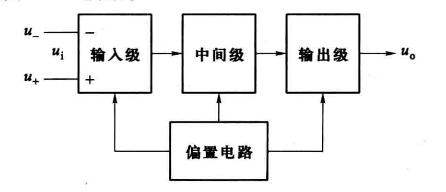

- 输入级：输入电阻大、漂移小、抗干扰能力强
- 中间级:电压放大倍数高
- 输出级:输出电阻小、负载能力强、输出电压稳定
- 偏置电路:为各级提供稳定的偏置电流

多级放大器的级间耦合方式
- 阻容耦合：通过电容联接前后级，传递交流信号
- 变压器耦合：用变压器联接前后级，传递交流信号
- 直接耦合：用导线联接前后级，传递交直流信号

### 集成运放的输入级电路-差分放大电路

集成运放的输入级采用差分放大电路，它能较好地抑制零点漂移。

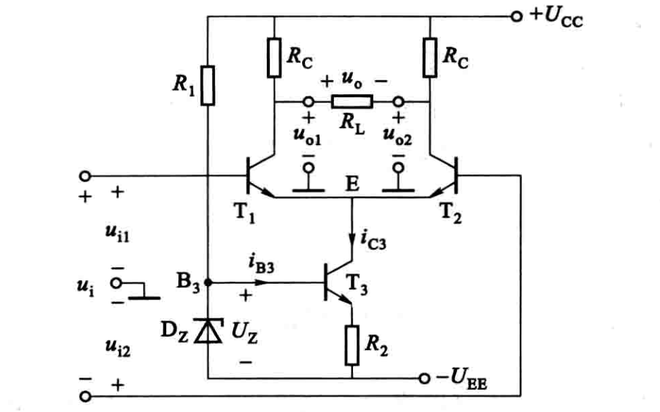

电路特点：对称；双端输入，双端输出。

**差模信号输入**

差模信号  $u_{i 1}=-u_{i 2}$ ,  $u_{i 1}$  与  $u_{i 2}$  大小相同，极性相反。

$u_{o 1}$  与  $u_{o 2}$  大小相同，极性相反。

$u_{o}=u_{o 1}-u_{o 2}$ , 有输出电压, 具有放大作用。 $u_{i}=u_{i 1}-u_{i 2}$ , 记差模电压放大倍数为  $A_{d}=\dfrac{u_{o}}{u_{i}}$.

**共模信号输入**

共模信号  $u_{i 1}=u_{i 2}$ ,  $u_{i 1}$  与  $u_{i 2}$  大小和极性均相同。

理想情况, 电路完全对称, 恒流源  $u_{o}=0$  , 无放大作用

实际电路,  $u_{o} \neq 0$ , 即差分放大电路对共模信号的放大倍数并不为零。

记共模电压放大倍数为  $A_{c}$ , 共模抑制比  $K_{\text {CMR }}=\dfrac{A_{d}}{A_{c}}$ 

集成运放

- 双端输入，双端输出
- 双端输入，单端输出
- 单端输入，双端输出
- 单端输入，单端输出

为提高集成运放的输入电阻，降低噪声，输入级的静态电流常取得很小，还采用场效晶体管组成差分放大电路。

### 集成运放的输出级电路-互补对称电路

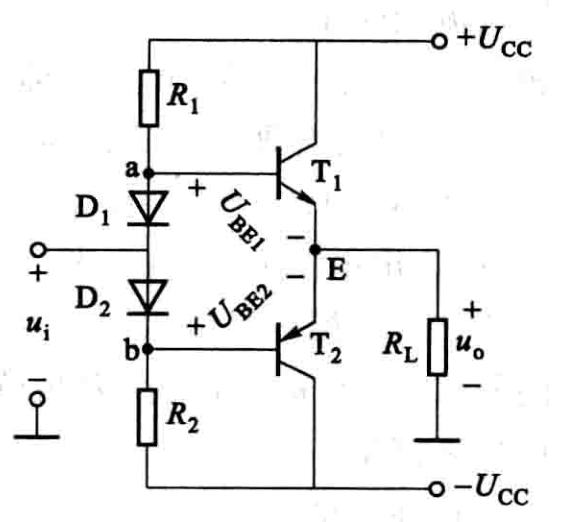

$u_{i}$  正负变化，  $T_{1}$ 、 $T_{2}$  轮流导通, 负载上合成一个与  $u_{i}$  相应的波形。

### 集成运放的图形符号和信号输入方式

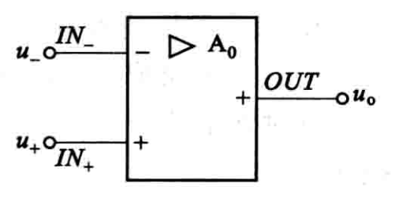

- $I N_{-}$ 反相输入端
- $I N_{+}$ 同相输入端
- $O U T-$ 输出端

集成运放在实际使用时，其信号有三种基本输入方式。若同相输入端接地，信号从反相端与地之间输入，称为反相输入方式；若反相输入端接地，信号从同相端与地之间输入，称为同相输入方式；若信号从两输入端之间输入或两输入端都有信号输入，称为差分输入方式。

## 集成运放的基本特性

### 集成运放的主要参数

pass

### 集成运放的电压传输特性和电路模型

集成运放的电压传输特性是指开环时输出电压与输人电压的关系曲线，即

$$
u_{\mathrm{o}}=f\left(u_{\mathrm{i}}\right)
$$

它有一个线性区和两个饱和区.

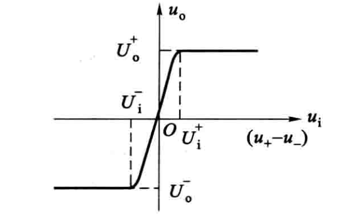

在线性区工作时

$$
u_{0}=A_{0} u_{\mathrm{i}}=A_{0}\left(u_{+}-u_{-}\right)
$$

线性工作区模型, 即为电压控制电压源的模型

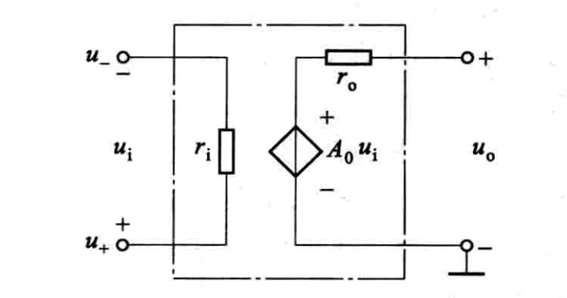

$r_{i}$  为输入电阻,  $r_{o}$  为输出电阻,  $A_{0}$  为开环差模电压放大倍数。

### 集成运放的理想特性

- 开环电压增益  $A_{0} \rightarrow \infty$ 
- 输入电阻  $r_{i} \rightarrow \infty$ 
- 输出电阻  $r_{o} \rightarrow 0$ 
- 共模抑制比  $K_{\text {CMR }} \rightarrow \infty$ 

由于输入电阻很大,  $i_{+}=i_{-} \approx 0$ 
由于开环电压增益很大, 而输出电压为有限值,  $u_{+} \approx u_{-}$ 

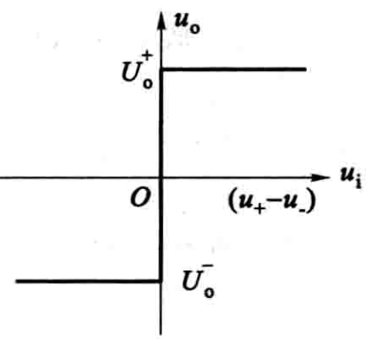

集成运放工作状态的判断

反馈：当电路的输出端通过外部电路与输入端相连，形成闭环工作状态，即引入反馈。

- 开环工作-饱和区
- 闭环正反馈-饱和区
- 闭环负反馈-线性区

## 放大电路中的负反馈

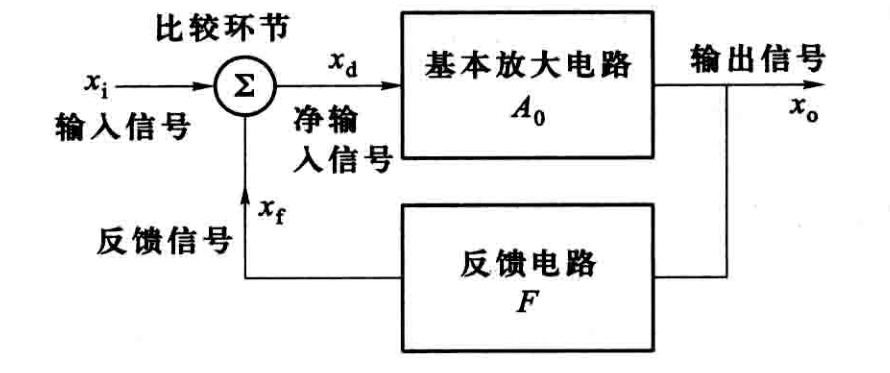

- 对于负反馈  $x_{d}=x_{i}-x_{f}$ 
- 反馈系数  $F=\dfrac{x_{f}}{x_{o}}$ 
- 开环放大倍数  $A_{0}=\dfrac{x_{o}}{x_{d}}$ 
- 闭环放大倍数  $A_{f}=\dfrac{x_{o}}{x_{i}}=\dfrac{A_{0} x_{d}}{x_{d}\left(1+F A_{0}\right)}=\dfrac{A_{0}}{1+F A_{0}}$ 
- 当  $\left|1+F A_{0}\right| \gg 1$  (深度负反馈)  $A_{f}=\dfrac{A_{0}}{1+F A_{0}} \approx \dfrac{A_{0}}{F A_{0}}=\dfrac{1}{F}$ 

### 负反馈的四种类型

按输入回路连接方式

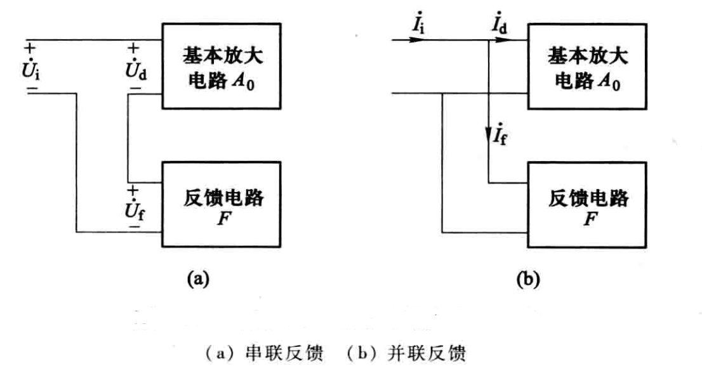

按输出回路连接方式

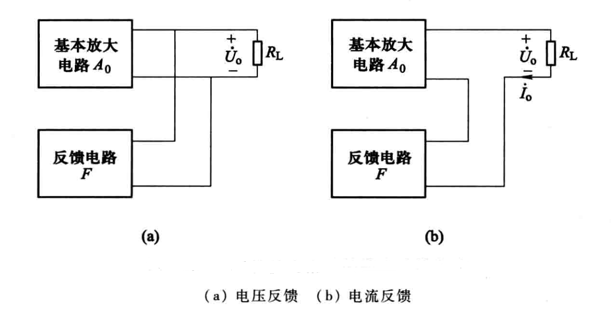

**电压串联负反馈**

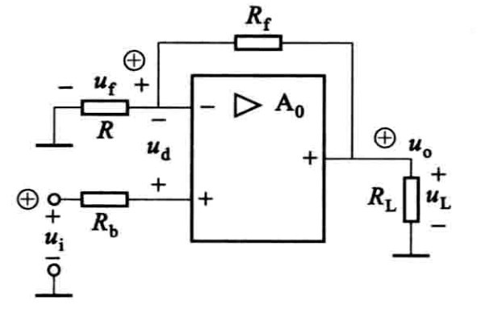

输入回路  $u_{d}=u_{i}-u_{f}$ 

反馈电压  $u_{f}=\dfrac{R}{R+R_{f}} u_{o}$ 

**电流并联负反馈**

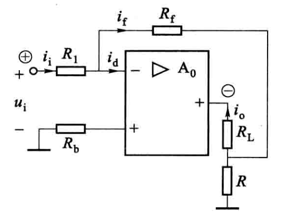

输入回路  $i_{d}=i_{i}-i_{f}$ 

反馈电流  $i_{f}=\dfrac{R}{R+R_{f}} i_{o}$ 

**电压并联负反馈**

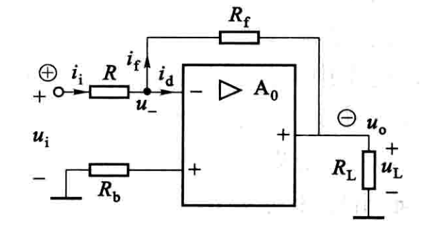

输入回路  $i_{d}=i_{i}-i_{f}$  

反馈电流  $i_{f}=\dfrac{u_{-}-u_{o}}{R_{f}}$ 

**电流串联负反馈**

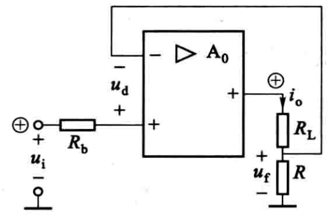

输入回路  $u_{d}=u_{i}-u_{f}$  

反馈电压  $u_{f} \approx R i_{o}$ 

### 负反馈对放大电路性能的影响

- 提高放大倍数的稳定性
- 减小非线性失真
- 扩展通频带
- 改变输入电阻和输出电阻

串联反馈 输入电阻增大
并联反馈 输入电阻减小
电压反馈 输出电阻减小
电流反馈 输出电阻增大

