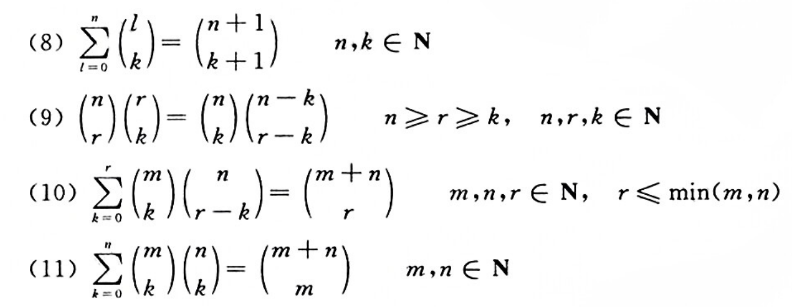

# 组合计数基础

## 基本计数规则

- 加法法则
- 乘法法则
- 分类处理与分步处理

## 排列与组合

### 集合的排列与组合

从  $n$  元集  $S$  中有序、不重复选取的  $r$  个元素称为  $S$  的一个  $r$ -排列,  $S$  的所有  $r$ -排列的个数记作  $P(n, r)$ .

设  $n, r$  为自然数, 则

$$
P(n, r)=\left\{\begin{aligned}
& \frac{n !}{(n-r) !} & n \geqslant r \\
& 0 & n<r
\end{aligned}\right.
$$

从  $n$  元集  $S$  中无序、不重复选取的  $r$  个元素称为  $S$  的一个  $r$ -组合,  $S$  的所有  $r$ -组合的个数记作  $C(n, r)$ .

设  $n, r$  为自然数, 则

$$
C(n, r)=\left\{\begin{aligned}
& \frac{n !}{r !(n-r) !} & n \geqslant r \\
& 0 & n<r
\end{aligned}\right.
$$

设  $n, r$  为正整数, 则

(1)  $C(n, r)=\dfrac{n}{r} C(n-1, r-1)$

(2)  $C(n, r)=C(n, n-r)$

(3)  $C(n, r)=C(n-1, r-1)+C(n-1, r)$

### 多重集的排列与组合

设多重集  $S=\left\{n_{1} \cdot a_{1}, n_{2} \cdot a_{2}, \cdots, n_{k} \cdot a_{k}\right\}$ , 其中含有  $k$  种元素, 对于  $i=1,2, \cdots, k$, $n_{i}$  表示第  $i$  种元素  $a_{i}$  在  $S$  中出现的次数, 一般  $0<n_{i} \leqslant+\infty$ . 

多重集用于处理允许重复的选取问题, 当  $n_{i}=+\infty$  时表示有足够多的  $a_{i}$  以备选取.

设多重集  $S=\left\{n_{1} \cdot a_{1}, n_{2} \cdot a_{2}, \cdots, n_{k} \cdot a_{k}\right\}$ , 且  $n=n_{1}+n_{2}+\cdots+n_{k}$ , 称  $S$  的全体元素组成的排列为  $S$  的**全排列**.

**定理**

$S$  的  $r$ -排列在特殊情况下的一些结果.

(1) 当  $r=n$  时,  $S$  的全排列数

$$
N=\frac{n !}{n_{1} ! n_{2} ! \cdots n_{k} !}
$$

(2) 若  $r \leqslant n_{i}, i=1,2, \cdots, k$  时,  $S$  的  $r$ -排列数是  $k^{r}$ .

**定理**

当  $r \leqslant n_{i}, i=1,2, \cdots, k$  时,多重集  $S$  的  $r$-组合数  $N=C(k+r-1, r)$ .

## 二项式定理与组合恒等式

**二项式定理**

设  $n$  是正整数, 对一切  $x$  和  $y$ , 有

$$
\begin{aligned}
(x+y)^{n}=\sum_{k=0}^{n} \binom{n}{k} x^{k} y^{n-k}
\end{aligned}
$$

符号  $\dbinom{n}{k}$ , 当  $n$  与  $k$  都是自然数时, 它就等于组合数  $C(n, k)$ .

**组合恒等式**

## 非降路径问题

## 多项式定理

设  $n$  为正整数,  $x_{i}$  为实数,  $i=1,2, \cdots, t$ . 那么有

$$
\left(x_{1}+x_{2}+\cdots+x_{t}\right)^{n}=\sum\limits_{\substack{满足  n_{1}+\cdots+n_{t}=n \\ 的非负整数解 }} \dbinom{n}{n_{1} n_{2} \cdots n_{t}} x_{1}^{n_{1}} x_{2}^{n_{2}} \cdots x_{t}^{n_{t}}
$$

这里  $\dbinom{n}{n_{1} n_{2} \cdots n_{t}}=\dfrac{n !}{n_{1} ! n_{2} ! \cdots n_{t} !}$ , 称为**多项式系数**.

$$
\sum\limits_{\substack{满足  n_{1}+\cdots+n_{t}=n \\ 的非负整数解 }} \dbinom{n}{n_{1} n_{2} \cdots n_{t}} = t^{n}
$$

