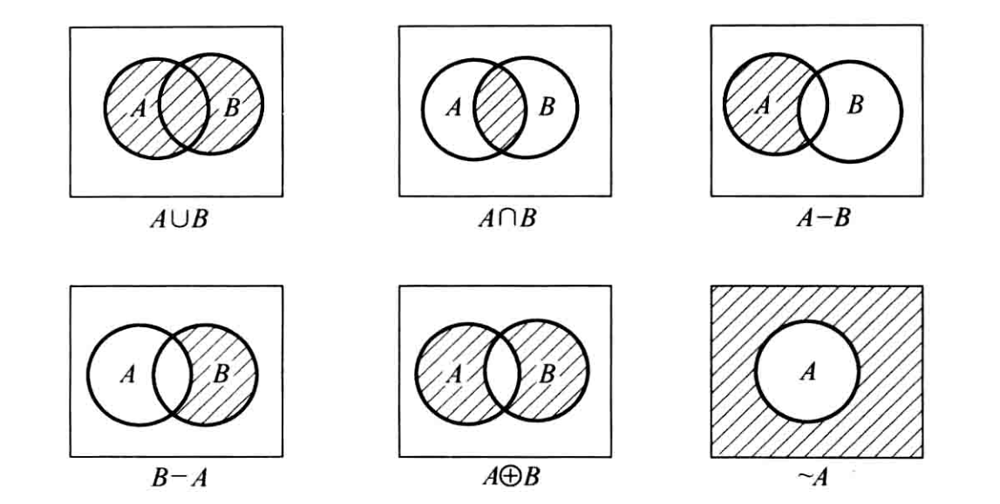
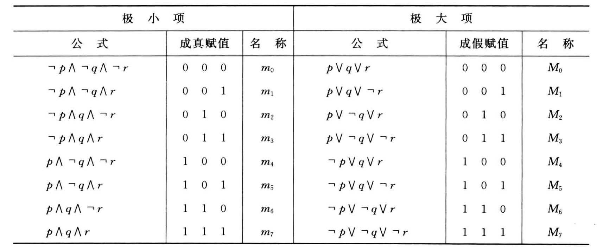
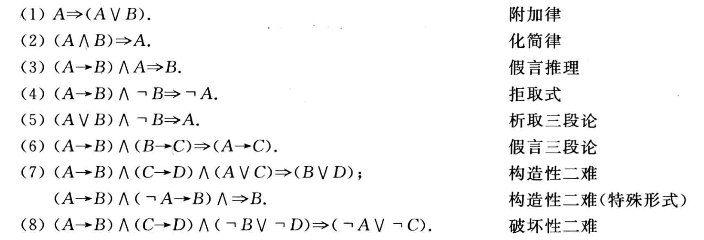
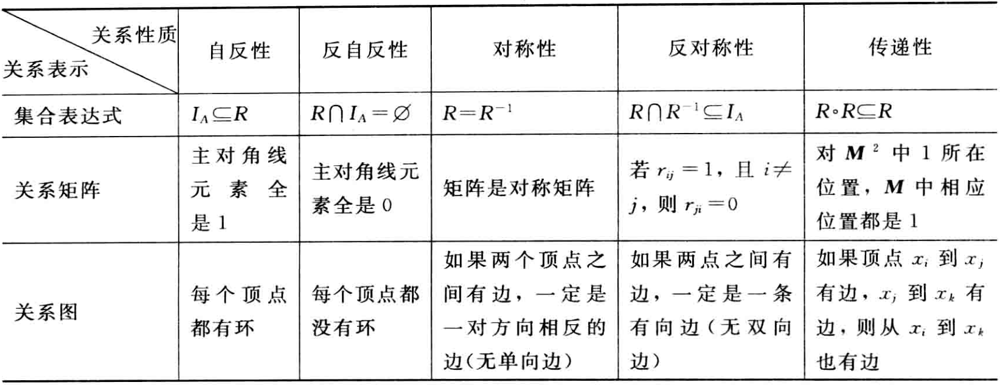
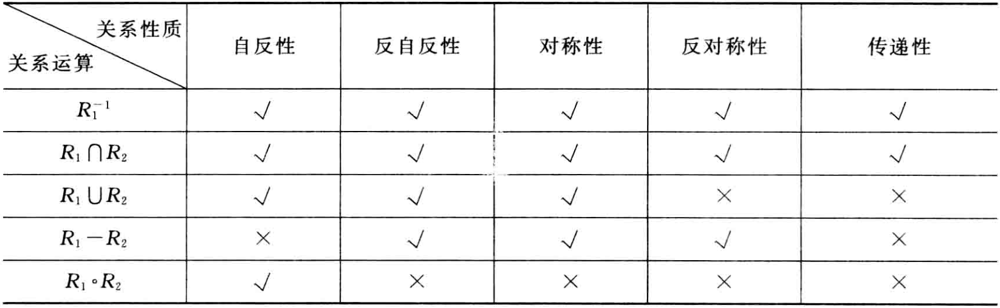

#! https://zhuanlan.zhihu.com/p/639464918
# 离散数学重点整理

笔记源代码 https://github.com/cjyyx/notes/blob/main/%E5%AD%A6%E4%B9%A0%E7%AC%94%E8%AE%B0/%E7%A6%BB%E6%95%A3%E6%95%B0%E5%AD%A6/%E7%A6%BB%E6%95%A3%E6%95%B0%E5%AD%A6%E5%A4%8D%E4%B9%A0%E9%87%8D%E7%82%B9.md

## 集合论

$x \in A$: $x$  是  $A$  的一个元素
$x \notin A$ ($x$  不属于  $A$): $x$  不是  $A$  的一个元素

$$
A \subseteq B \Leftrightarrow \forall x(x \in A \rightarrow x \in B)
$$

$$
A \subset B \Leftrightarrow A \subseteq B \wedge A \neq B
$$

$$
A=B \Leftrightarrow A \subseteq B \wedge B \subseteq A
$$

**空集**  $\varnothing$:  不含任何元素的集合, 空集是任何集合的子集

**幂集** $P(A)=\{x \mid x \subseteq A\}$:  由  $A$  的所有子集组成的集合

**并集**  $A \cup B=   \{x \mid x \in A \vee x \in B\}$

**交集**  $A \cap B=   \{x \mid x \in A \wedge x \in B\}$

**相对补集**  $A-B=\{x \mid x \in A \wedge x \notin B\}$

**对称差集**  $A \oplus B=(A-B) \cup(B-A)=(A \cup B)-(A \cap B)=\{x \mid(x \in A \wedge x \notin B) \vee(x \in B \wedge x \notin A)\}$

**绝对补集**  $\sim A=E-A=\{x \mid x \notin A\}$

基本集合恒等式

分配律

$$
A \cup(B \cap C)=(A \cup B) \cap(A \cup C)
$$

$$
A \cap(B \cup C)=(A \cap B) \cup(A \cap C)
$$

德摩根律

$$
\sim(B \cup C)=\sim B ~ \cap \sim C
$$

$$
\sim(B \cap C)=\sim B ~ \cup \sim C
$$

补交转换律

$$
A-B=A ~ \cap \sim B
$$

## 命题逻辑

### 基本概念

**命题**:  所表达的判断是真(正确)或假(错误)陈述句.

**命题符号化**:  将命题和它的真值用抽象的符号表示。小写的英文字母  $p, q, r, \cdots, p_{i}, q_{i}, r_{i}, \cdots$  表示命题, 数字 1 表示真, 数字 0 表示假.

- 否定式,  $\neg p$,  表示非  $p$
- 合取式,  $p \wedge q$,  表示  $p$  并且  $q$
- 析取式,  $p \vee q$,  表示  $p$  或  $q$
- 蕴涵式,  $p \rightarrow q$,  表示如果  $p$  , 则  $q$
- 等价式,  $p \leftrightarrow q$,  表示  $p$  当且仅当  $q$

$p \rightarrow q$  的逻辑关系:  $q$  为  $p$  的必要条件,  $p$  为  $q$  的充分条件

**命题变项**：  对命题进一步抽象,  真值可以变化的陈述句

**命题公式**:  将命题变项用联结词和圆括号按一定的逻辑关系联结起来的符号串

- 重言式(永真式): 无成假赋值的命题公式
- 矛盾式(永假式): 无成真赋值的命题公式
- 可满足式: 非矛盾式的命题公式

### 等值演算

双重否定律

$$
\neg \neg A \Leftrightarrow A
$$

幂等律

$$
A \vee A \Leftrightarrow A
$$

$$
A \wedge A \Leftrightarrow A
$$

交换律

$$
A \vee B \Leftrightarrow B \vee A
$$

$$
A \wedge B \Leftrightarrow B \wedge A
$$

结合律

$$
(A \vee B) \vee C \Leftrightarrow A \vee(B \vee C)
$$

$$
(A \wedge B) \wedge C \Leftrightarrow A \wedge(B \wedge C)
$$

分配律

$$
A \vee(B \wedge C) \Leftrightarrow(A \vee B) \wedge(A \vee C)
$$

$$
A \wedge(B \vee C) \Leftrightarrow(A \wedge B) \vee(A \wedge C)
$$

德摩根律

$$
\neg(A \vee B) \Leftrightarrow \neg A \wedge \neg B
$$

$$
\neg(A \wedge B) \Leftrightarrow \neg A \vee \neg B
$$

吸收律

$$
A \vee(A \wedge B) \Leftrightarrow A
$$

$$
A \wedge(A \vee B) \Leftrightarrow A
$$

### 范式

命题变项及其否定统称作**文字**。仅由有限个文字构成的析取式称作**简单析取式**。仅由有限个文字构成的合取式称作**简单合取式**。

由有限个简单合取式构成的析取式称为**析取范式**；由有限个简单析取式构成的合取式称为**合取范式**。析取范式与合取范式统称为**范式**。

在含有  $n$  个命题变项的简单合取式(简单析取式)中，若每个命题变项和它的否定式不同时出现，而二者之一必出现且仅出现一次，且第  $i$  个命题变项或它的否定式出现在从左算起的第  $i$  位上(若命题变项无角标,就按字典顺序排列)，称这样的简单合取式(简单析取式)为**极小项(极大项)**。

若由  $n$  个命题变项构成的析取范式(合取范式)中所有的简单合取式(简单析取式)都是极小项(极大项)，则称该析取范式(合取范式)为**主析取范式(主合取范式)**

**任何命题公式都存在与之等值的主析取范式和主合取范式，并且是唯一的**

真值表和主析取范式(主合取范式)是描述命题公式的**两种标准形式**。

### 推理

命题公式  $A_{1}, A_{2}, \cdots, A_{k}$  推出  $B$  的推理正确(有效)当且仅当蕴涵式

$$
\left(A_{1} \wedge A_{2} \wedge \cdots \wedge A_{k}\right) \rightarrow B
$$

为重言式(上式为推理的**形式结构**)，并记为

$$
\left(A_{1} \wedge A_{2} \wedge \cdots \wedge A_{k}\right) \Rightarrow B
$$

称永真的蕴涵式为**推理定律**

可以把一个公式换成任何与它等值的公式，称作**等值置换**，简称置换

**构造证明法**

(1) 前提引入规则：在证明的每一步都可以引入前提

(2) 结论引入规则：在证明的每一步都可以引入由前面的公式得到的有效结论

**归结证明法**

归结规则（归结定律）

$$
\left(L \vee C_{1}\right) \wedge\left(\neg L \vee C_{2}\right) \Rightarrow C_{1} \vee C_{2}
$$

其中，$L$  是一个变元，$C_{1}$  和  $C_{2}$  是简单析取式。

(1) 把结论的否定引入前提

把推理证明

$$
\left(A_{1} \wedge A_{2} \wedge \cdots \wedge A_{k}\right) \rightarrow B
$$

转换成

$$
\left(A_{1} \wedge A_{2} \wedge \cdots \wedge A_{k} \wedge \neg B\right) \rightarrow 0
$$

(2) 把所有前提，包括结论的否定在内，化成合取范式，并把得到的合取范式中的所有简单析取式作为前提

(3) 应用归结规则进行推理

(4) 如果推出空简单析取式，即推出  $0$，则证明推理正确

## 一阶逻辑

### 基本概念

命题逻辑的局限性：在命题逻辑中，命题是最基本的单位，对简单命题不再进行分解，并且不考虑命题之间的内在联系和数量关系。

**个体词**：所研究对象中可以独立存在的具体或抽象的客体

个体常项：表示具体事物的个体词，用 $a, b, c$ 等表示

个体变项：表示抽象事物的个体词，用 $x, y, z$ 等表示

个体域：个体变项的取值范围(有穷、无穷)

全总个体域：宇宙间一切事物

**谓词**：表示个体词性质或相互之间关系的词

谓词常项：表示具体性质或相互之间关系的谓词

谓词变项：表示抽象性质或相互之间关系的谓词

谓词用 $F, G, H, P$ 等大写字母表示

$n$ 元谓词 $P\left(x_{1}, x_{2}, \ldots, x_{n}\right)$：含 $n$ 个个体变项的谓词

0 元谓词：不含个体变项的谓词

1 元谓词：表示事物的性质

多元谓词 $(n \geq 2)$：表示事物之间的关系

**量词**：表示个体变项与论域之间关系的词

全称量词($\forall$)：表示任意的，所有的，一切的等

存在量词($\exists$)：表示存在，有的，至少有一个等

**一阶语言** $\mathscr{L}$：便于将自然语言中的命题符号化的用于一阶逻辑的形式语言

$\mathscr{L}$ 的**项**的定义如下

(1) 个体常项和个体变项是项

(2) 若 $\varphi\left(x_{1}, x_{2}, \cdots, x_{n}\right)$ 是任意的 $n$ 元函数，$t_{1}, t_{2}, \cdots, t_{n}$ 是任意的 $n$ 个项，则 $\varphi\left(t_{1}, t_{2}, \cdots, t_{n}\right)$ 是项

(3) 所有的项都是有限次使用(1)(2)得到的.

设 $R\left(x_{1}, x_{2}, \cdots, x_{n}\right)$ 是 $\mathscr{L}$ 的任意 $n$ 元谓词，$t_{1}, t_{2}, \cdots, t_{n}$ 是 $\mathscr{L}$ 的任意的 $n$ 个项，则称 $R\left(t_{1}, t_{2}, \cdots, t_{n}\right)$ 是 $\mathscr{L}$ 的**原子公式**

$\mathscr{L}$ 的**合式公式**定义如下

(1) 原子公式是合式公式

(2) 若 $A$ 是合式公式，则 $(\neg A)$ 也是合式公式

(3) 若 $A, B$ 是合式公式，则 $(A \wedge B), (A \vee B), (A \rightarrow B), (A \leftrightarrow B)$ 也是合式公式

(4) 若 $A$ 是合式公式，则 $\forall x  A, \exists x  A$ 也是合式公式

(5) 只有有限次地应用(1)~(4)构成的符号串才是合式公式

合式公式也称为谓词公式，简称公式。

在公式 $\forall x A, \exists x A$ 中，称 $x$ 为**指导变元**，$A$ 为相应量词的**辖域**

指定公式中的个体域以及个体变项、谓词变项等的具体涵义称作对它的**解释**。给公式中的每一个自由出现的个体变项指定个体域中的一个元素称作在解释 $I$ 下的**赋值**。给定解释及赋值，任何公式都变为命题。

### 等值演算

**基本等值式**

命题逻辑中的重言式的代换实例都是一阶逻辑中的等值式

**消去量词等值式**

设个体域为有限集 $D=\left\{a_{1}, a_{2}, \cdots, a_{n}\right\}$，则有

(1) $\forall x A(x) \Leftrightarrow A\left(a_{1}\right) \wedge A\left(a_{2}\right) \wedge \cdots \wedge A\left(a_{n}\right)$

(2) $\exists x A(x) \Leftrightarrow A\left(a_{1}\right) \vee A\left(a_{2}\right) \vee \cdots \vee A\left(a_{n}\right)$

**量词否定等值式**

设 $A(x)$ 是任意的含自由出现个体变项 $x$ 的公式，则

(1) $\neg \forall x  A(x) \Leftrightarrow \exists x \neg A(x)$

(2) $\neg \exists x A(x) \Leftrightarrow \forall x  \neg A(x)$

**量词辖域收缩与扩张等值式**

设 $A(x)$ 是任意的含自由出现个体变项 $x$ 的公式，$B$ 中不含 $x$ 的出现，则

(1)

$$
\forall x(A(x) \vee B) \Leftrightarrow \forall x A(x) \vee B
$$

$$
\forall x(A(x) \wedge B) \Leftrightarrow \forall x A(x) \wedge B
$$

$$
\forall x(A(x) \rightarrow B) \Leftrightarrow \exists x A(x) \rightarrow B
$$

$$
\forall x(B \rightarrow A(x)) \Leftrightarrow B \rightarrow \forall x A(x)
$$

(2) 
$$
\exists x(A(x) \vee B) \Leftrightarrow \exists x A(x) \vee B
$$

$$
\exists x(A(x) \wedge B) \Leftrightarrow \exists x A(x) \wedge B
$$

$$
\exists x(A(x) \rightarrow B) \Leftrightarrow \forall x A(x) \rightarrow B
$$

$$
\exists x(B \rightarrow A(x)) \Leftrightarrow B \rightarrow \exists x A(x)
$$

**量词分配等值式**

设 $A(x), B(x)$ 是任意的含自由出现个体变项 $x$ 的公式，则

(1) $\forall x(A(x) \wedge B(x)) \Leftrightarrow \forall x A(x) \wedge \forall x B(x)$

(2) $\exists x(A(x) \vee B(x)) \Leftrightarrow \exists x A(x) \vee \exists x B(x)$

**置换规则**

设 $\Phi(A)$ 是含公式 $A$ 的公式, $\Phi(B)$ 是用公式 $B$ 取代 $\Phi(A)$ 中的所有的 $A$ 之后的公式, 若 $A \Leftrightarrow B$, 则 $\Phi(A) \Leftrightarrow \Phi(B)$.

一阶逻辑中的置换规则与命题逻辑中的置换规则形式上完全相同, 只是在这里 $A,B$ 是一阶逻辑公式.

**换名规则**

设 $A$ 为一公式, 将 $A$ 中某量词辖域中某约束变项的所有出现及相应的指导变元, 改成该量词辖域中未曾出现过的某个体变项符号, 公式中其余部分不变, 设所得公式为 $A^{\prime}$, 则 $A^{\prime} \Leftrightarrow A$。

**一阶逻辑前束范式**

设 $A$ 为一个一阶逻辑公式, 若 $A$ 具有如下形式:

$$
Q_{1} x_{1} Q_{2} x_{2} \cdots Q_{k} x_{k} B
$$

则称  $A$  为前束范式, 其中 $Q_{i}(1 \leqslant i \leqslant k)$ 为 $\forall$ 或 $\exists$, $B$ 为不含量词的公式.

前束范式存在定理：一阶逻辑中的任何公式都存在与之等值的前束范式.

## 关系

### 基本概念

**有序对** $\langle x, y\rangle$：由两个元素 $x$ 和 $y$，按照一定次序构成的二元组

**笛卡儿积**  $A \times B=\{\langle x, y\rangle \mid x \in A , y \in B\}$

笛卡儿积运算不适合交换律和结合律，但对并和交运算适合分配律。

**关系**：一个集合中的元素都是有序对或者这个集合是空集

关系的名字一般使用大写的英文字母，通常记作  $R$ 。如果有序对  $\langle x, y\rangle \in R$ ，可以简单记作  $x R y$

设  $A, B$  为集合， $A \times B$  的任何子集所定义的二元关系叫做**从**  $\boldsymbol{A}$  **到**  $\boldsymbol{B}$  **的二元关系**，当  $A=B$  时则叫做  $\boldsymbol{A}$  **上的二元关系**。

$$
E_{A}=\{\langle x, y\rangle \mid x \in A , y \in A\}=A \times A
$$

$$
I_{A}=\{\langle x, x\rangle \mid x \in A\}
$$

$E_{A}, I_{A}$  分别称为**全域关系**与**恒等关系**。

**二元关系的表示**

设  $A=\left\{x_{1}, x_{2}, \cdots, x_{n}\right\}, B=\left\{y_{1}, y_{2}, \cdots, y_{m}\right\}$, $R$  是从  $A$  到  $B$  的关系,  $R$  的**关系矩阵**是布尔矩阵  $M_{R}=\left(r_{i j}\right)_{n \times m}$ , 其中  $r_{i j}=1 \Leftrightarrow\left\langle x_{i}, y_{j}\right\rangle \in R, i=1,2, \cdots, n, j=1 ,  2, \cdots, m$ .

当  $R$  为  $A$  上的关系时,  $R$  的关系矩阵是  $n$  阶方阵.

设  $A=\left\{x_{1}, x_{2}, \cdots, x_{n}\right\}$, $R$  的**关系图**是  $G_{R}=\langle A, R\rangle$ , 其中 $A$  为  $G$  的结点集,  $R$  为边集.  $\forall x_{i}, x_{j} \in A$ , 如果  $\left\langle x_{i}, x_{j}\right\rangle \in R$ , 在图中就有一条从  $x_{i}$  到  $x_{j}$  的有向边.

### 基本运算

设  $R$  为二元关系,  $R$  的**定义域、值域和域**分别记作  $\operatorname{dom} R, \operatorname{ran} R , \operatorname{fld}  R$ , 其中

$$
\operatorname{dom} R=\{x \mid \exists y(\langle x, y\rangle \in R)\}
$$

$$
\operatorname{ran} R=\{y \mid \exists x(\langle x, y\rangle \in R)\}
$$

$$
\operatorname{fld} R=\operatorname{dom} R \cup \operatorname{ran} R
$$

由定义不难看出, 定义域  $\operatorname{dom} R$  是  $R$  中所有有序对的第一元素构成的集合, 值域 $\operatorname{ran}  R$  是  $R$  中所有有序对的第二元素构成的集合, $\operatorname{fld}  R$  是  $R$  中有序对涉及的全体元素的集合.

$R$  的**逆**  $R^{-1}=\{\langle y, x\rangle \mid\langle x, y\rangle \in R\}$

设  $R, S$  为二元关系,  $R$  与  $S$  的**合成**  $R \circ S=\{\langle x, z\rangle \mid \exists y(\langle x, y\rangle \in R \wedge\langle y, z\rangle \in S)\}$

合成运算不满足交换律.

设  $R$  为  $A$  上的关系,  $n$  为自然数, 则  $R$  的  $n$  次**幂**定义为:

(1)  $R^{0}=\{\langle x, x\rangle \mid x \in A\}=I_{A}$

(2)  $R^{n+1}=R^{n} \circ R$

有如下定理

（1）存在自然数  $s$  和  $t$ , 使得  $R^{s}=R^{t}$ .说明有穷集合上的关系  $R$  只有有限多个不同的幂

（2）$R^{m} \circ R^{n}=R^{m+n}$ ,  $\left(R^{m}\right)^{n}=R^{m n}$

### 关系的性质

设  $R$  是集合  $A$  上的关系

如果  $\forall x(x \in A \rightarrow\langle x, x\rangle \in R)$ , 则称  $R$  在  $A$  上**自反**

如果  $\forall x(x \in A \rightarrow\langle x, x\rangle \notin R)$ , 则称  $R$  在  $A$  上**反自反**

如果  $\forall x \forall y(x, y \in A \wedge\langle x, y\rangle \in R \rightarrow\langle y, x\rangle \in R)$ , 则称  $R$  在  $A$  上**对称**

如果  $\forall x \forall y(x, y \in A \wedge\langle x, y\rangle \in R \wedge\langle y, x\rangle \in R \rightarrow x=y)$ , 则称  $R$  在  $A$  上**反对称**

如果  $\forall x \forall y \forall z(x, y, z \in A \wedge\langle x, y\rangle \in R \wedge\langle y, z\rangle \in R \rightarrow\langle x, z\rangle \in R)$ , 则称  $R$  是**传递**的

是否能够保持性质

### 关系闭包

设  $R$  为  $A$  上的关系, 则有

(1) 自反闭包  $r(R)=R \cup R^{0}$

(2) 对称闭包  $s(R)=R \cup R^{-1}$

(3) 传递闭包  $t(R)=R \cup R^{2} \cup R^{3} \cup \cdots$

$tsr(R)$：同时获得具有三种性质的闭包

可以用关系矩阵直接计算关系的自反、对称和传递闭包的矩阵. 设关系  $R$  及  $r(R)$ ,  $s(R)$, $t(R)$  的矩阵分别为  $M, M_{r}, M_{s}, M_{t}$ , 则

$$
M_{r}=M+E
$$

$$
M_{s}=M+M^{\prime}
$$

$$
M_{t}=M+M^{2}+M^{3}+\cdots
$$

其中 $E$ 是和 $M$ 同阶的单位矩阵, $M^{\prime}$ 是 $M$ 的转置矩阵.

### 等价关系

设  $R$  是集合  $A$  上的关系, 如果  $R$  是自反的、对称的、传递的, 则称  $R$  为  $A$  上 的**等价关系**. 对于任何元素  $x, y \in A$ , 如果  $x R y$ , 则称  $x$  与  $y$  等价, 记作  $x \sim y$ .

记  $A$  中与  $x$  等价的全体元素构成的子集称为  $x$  的**等价类**, 记作  $[x]_{R}$ . 在不会混淆的情况下, 可以简记为  $[x]$ , 即$[ x ]=\{y \mid y \in A, x R y\}$

$A$  上的全体等价类构成的集合称作  $A$  关于等价关系  $R$  的**商集**, 记作  $A / R$ , 即  $A / R=\left\{[x]_{R} \mid x \in A\right\}$

设  $A$  为非空集合, 若  $A$  的子集族  $\pi(\pi \subseteq P(A))$  满足下面条件:

(1)  $\varnothing \notin \pi$

(2)  $\forall x \forall y(x, y \in \pi \wedge x \neq y \rightarrow x \cap y=\varnothing)$

(3)  $\bigcup_{x \in \pi} x=A$

则称  $\pi$  是  $A$  的一个**划分**, 称  $\pi$  中的元素为  $A$  的**划分块**.

**等价关系与划分一一对应**

商集  $A / R$  就是  $A$  的划分, 称为由等价关系  $R$  导出的划分.

反过来, 给定集合  $A$  的划分  $\pi$ , 也可以根据如下规则导出  $A$  上的一个等价关系  $R$  :  $x R y$  当且仅当  $x$  与  $y$  在  $\pi$  的同一个划分块中.

### 偏序关系

非空集合  $A$  上的自反、反对称和传递的关系称为  $A$  上的**偏序关系**, 简称偏序，记作  $\preccurlyeq$ .

- 如果  $\langle x, y\rangle \in \preccurlyeq$ , 记作  $x \preccurlyeq y$ , 读作 “  $x$  小于或等于  $y$  ”.
- 如果  $x \preccurlyeq y \vee y \preccurlyeq x$ , 则称  $x$  与  $y$  **可比**.

集合  $A$  和  $A$  上的偏序关系  $\preccurlyeq$  一起叫做**偏序集**, 记作  $\langle A, \preccurlyeq\rangle$ .

偏序集可以使用**哈斯图**. 它是利用偏序关系的自反、反对称、传递性进行简化的关系图.

**定义**

设  $\langle A, \preccurlyeq\rangle$  为偏序集,  $B \subseteq A, y \in B$ .

若  $\forall x(x \in B \rightarrow y \preccurlyeq x)$  成立, 则称  $y$  为  $B$  的**最小元**.

若  $\forall x(x \in B \rightarrow x \preccurlyeq y)$  成立, 则称  $y$  为  $B$  的**最大元**.

若  $\forall x(x \in B \wedge x \preccurlyeq y \rightarrow x=y)$  成立, 则称  $y$  为  $B$  的**极小元**.

若  $\forall x(x \in B \wedge y \preccurlyeq x \rightarrow x=y)$  成立, 则称  $y$  为  $B$  的**极大元**.

**定义**

设  $\langle A, \preccurlyeq\rangle$  为偏序集,  $B \subseteq A, y \in A$ .

若  $\forall x(x \in B \rightarrow x \preccurlyeq y)$  成立, 则称  $y$  为  $B$  的**上界**.

若  $\forall x(x \in B \rightarrow y \preccurlyeq x)$  成立, 则称  $y$  为  $B$  的**下界**.

令  $C=\{y \mid y  为  B  的上界  \}$ , 则称  $C$  的最小元为  $B$  的最小上界或**上确界**.

令  $D=\{y \mid y  为  B  的下界  \}$ , 则称  $D$  的最大元为  $B$  的最大下界或**下确界**.

## 函数

### 定义与基本性质

设  $f$  是二元关系, 如果对于任意  $x \in \operatorname{dom} f$ , 都存在唯一的  $y \in \operatorname{ran} f$ , 使得  $x f y$  成立, 则称  $f$  为**函数** (或者映射). 这时也称  $y$  为  $f$  在  $x$  的值, 记作  $y=f(x)$ .

设  $A, B$  为集合, 如果  $f$  为函数,  $\operatorname{dom} f=A$, $\operatorname{ran} f \subseteq B$,  则称  $f$  为**从**  $\boldsymbol{A}$  **到**  $\boldsymbol{B}$  **的函数**, 记作  $f: A \rightarrow B$ .

所有从  $A$  到  $B$  的函数的集合记作  $B^{A}$ , 符号化表示为  $
B^{A}=\{f \mid f: A \rightarrow B\}$

若  $|A|=m,|B|=n, m, n \neq 0$ , 则  $\left|B^{A}\right|=n^{m}$ .

设  $f: A \rightarrow B$ ,

(1) 若  $\operatorname{ran} f=B$ , 则称  $f: A \rightarrow B$  是**满射**的.

(2) 若  $\forall y \in \operatorname{ran} f$  都存在唯一的  $x \in A$  使得  $f(x)=y$ , 则称  $f: A \rightarrow B$  是**单射**的.

(3) 若  $f: A \rightarrow B$  既是满射又是单射的, 则称  $f: A \rightarrow B$  是**双射**的.

### 函数的复合与反函数

**定理**

设  $f, g$  是函数, 则  $f \circ g$  也是函数, 且满足

(1)  $\operatorname{dom}(f \circ g)=\{x \mid x \in \operatorname{dom} f \wedge f(x) \in \operatorname{dom} g\}$ .

(2)  $\forall x \in \operatorname{dom}(f \circ g)$,  有  $f \circ g(x)=g(f(x))$ .

**定理**

设  $f: A \rightarrow B, g: B \rightarrow C$ .

(1) 如果  $f: A \rightarrow B, g: B \rightarrow C$  都是满射的, 则  $f \circ g: A \rightarrow C$  也是满射的.

(2) 如果  $f: A \rightarrow B, g: B \rightarrow C$  都是单射的, 则  $f \circ g: A \rightarrow C$  也是单射的.

(3) 如果  $f: A \rightarrow B, g: B \rightarrow C$  都是双射的, 则  $f \circ g: A \rightarrow C$  也是双射的.

**定理**

设  $f: A \rightarrow B$  是双射的, 则**反函数**  $f^{-1}: B \rightarrow A$  也是双射的

## 图

### 基本概念

**定义**

无序对: 两个元素构成的集合  $\{a, b\}$

无序积  $A \& B$: $\{\{a, b\} \mid a \in A \wedge b \in B\}$

为方便起见, 将无序积  $A \& B$  的元素无序对  $\{a, b\}$  记为  $(a, b)$ .

**无向图**  $G=\langle V, E\rangle$ . 其中  $V$  是一个非空的有穷集合, 称为  $G$  的顶点集,  $V$  中的元素称为顶点或结点;  $E$  是无序积  $V \& V$  的一个有穷的多重子集,  称  $E$  为  $G$  的边集,  其元素称为无向边或简称为边.

**有向图**  $D=\langle V, E\rangle$ . 其中顶点集  $V$  同无向图中的顶点集; 边集  $E$  是卡氏积  $V \times V$  的有穷的多重子集, 其中元素称为有向边或简称为边.

用  $V(G), E(G)$  分别表示无向图  $G$  的顶点集和边集; 用  $V(D), E(D)$  分别表示有向图  $D$  的顶点集和边集.

设  $G=\langle V, E\rangle$  为一无向图,  $v_{i} \in V$ , 称  $v_{i}$  作为边的端点的次数之和为  $v_{i}$  的**度数**, 简称为度, 记作  $d_{G}\left(v_{i}\right)$ .

设  $D=\langle V, E\rangle$  为一个有向图,  $v_{i} \in V$ , 称  $v_{i}$  作为边的始点的次数之和为  $v_{i}$  的**出度**, 记作  $d_{D}^{+}\left(v_{i}\right)$ , 简记为  $d^{+}\left(v_{i}\right)$ ; 称  $v_{i}$  作为边的终点的次数之和为  $v_{i}$  的**入度**, 记作  $d_{D}^{-}\left(v_{i}\right)$ , 简记为  $d^{-}\left(v_{i}\right)$ ; 称  $v_{i}$  作为边的端点的次数之和为  $v_{i}$  的度数或度, 记作  $d_{D}\left(v_{i}\right)$ , 简记为  $d\left(v_{i}\right)$ . 显然,  $d\left(v_{i}\right)=d^{+}\left(v_{i}\right)+d^{-}\left(v_{i}\right)$ .

另外, 称  $\Delta(G)=\max \{d(v) \mid v \in V(G)\}$  为  $G$  的最大度,  $\delta(G)=\min \{d(v) \mid v \in V(G)\}$  为  $G$  的最小度. 在不会引起混淆的情况下, 常把  $\Delta(G)$  简记作  $\Delta$ , 把  $\delta(G)$  简记作  $\delta$ .

又称  $\Delta^{+}(D)=\max \left\{d^{+}(v) \mid v \in V(D)\right\}$  为  $D$  的最大出度; 称  $\delta^{+}(D)=\min \left\{d^{+}(v) \mid v \in V(D)\right\}$  为  $D$  的最小出度; 称  $\Delta^{-}(D)=\max \left\{d^{-}(v) \mid v \in V(D)\right\}$  为  $D$  的最大入度; 称  $\delta^{-}(D)=\min \left\{d^{-}(v) \mid v \in V(D)\right\}$  为  $D$  的最小入度. 在不引起混淆的情况下, 常将  $\Delta^{+}(D), \delta^{+}(D), \Delta^{-}(D), \delta^{-}(D)$  分别简记为  $\Delta^{+}, \delta^{+}, \Delta^{-}, \delta^{-}$ .

在图中, 称度数为 1 的顶点为**悬挂顶点**, 与它关联的边为**悬挂边**.

**握手定理**

设  $G=\langle V, E\rangle$  为一无向图,  $V=\left\{v_{1}, v_{2}, \cdots, v_{n}\right\}$ , 边的条数  $|E|=m$ , 则

$$
\sum_{i=1}^{n} d\left(v_{i}\right)=2 m
$$

设  $D=\langle V, E\rangle$  为一有向图,  $V=\left\{v_{1}, v_{2}, \cdots, v_{n}\right\}$,  $|E|=m$ , 则

$$
\sum_{i=1}^{n} d^{+}\left(v_{i}\right)=\sum_{i=1}^{n} d^{-}\left(v_{i}\right)=m
$$

<!-- 设  $V=\left\{v_{1}, v_{2}, \cdots, v_{n}\right\}$  为  $n$  阶图  $G$  的顶点集, 称  $d\left(v_{1}\right), d\left(v_{2}\right), \cdots, d\left(v_{n}\right)$  为  $G$  的度数列. -->

### 图的连通性

**定义**

给定图  $G=\langle V, E\rangle$ . 设  $G $ 中顶点和边的交替序列为  $\Gamma=v_{0} e_{1} v_{1} e_{2} \cdots e_{l} v_{l}$ . 若  $\Gamma$  满足如下条件:  $v_{i-1}$  和  $v_{i}$  是  $e_{i}$  的端点 (  $G$  为有向图时, 要求  $v_{i-1}$  是  $e_{i}$  的始点,  $v_{i}$  是  $e_{i}$  的终点),  $i=1,2, \cdots, l$ , 则称  $\Gamma$  为  $v_{0}$  到  $v_{l}$  的**通路**.  $v_{0}, v_{l}$  分别称为此通路的起点和终点.  $\Gamma$  中 所含边的数目  $l$  称为  $\Gamma$  的长度. 当  $v_{0}=v_{l}$  时, 称通路为**回路**.

若  $\Gamma$  中所有边各异, 则称  $\Gamma$  为**简单通路**, 此时, 又若  $v_{0}=v_{l}$ , 则称  $\Gamma$  为**简单回路**.

若  $\Gamma$  的所有顶点各异, 所有边也各异, 则称  $\Gamma$  为**初级通路**或路径. 此时, 又若  $v_{0}=v_{l}$ , 则称  $\Gamma$  为**初级回路**或圈, 并将长度为奇数的圈称为奇圈, 长度为偶数的圈称为偶圈.

**定理**

在一个  $n$  阶图中, 若从顶点  $u$  到  $v(u \neq v)$  存在通路, 则从  $u$  到  $v$  存在长度小于等于  $n-1$  的初级通路.

在一个  $n$  阶图中, 如果存在  $v$  到自身的简单回路, 则从  $v$  到自身存在长度不超过  $n$  的初级回路.

**定义**

在无向图  $G$  中, 若顶点  $v_{i}$  与  $v_{j}$  之间存在通路, 则称  $v_{i}$  与  $v_{j}$  是**连通**的. 规定  $v_{i}$  与自身是连通的.

若无向图  $G$  是平凡图, 或  $G$  中任二顶点都是连通的, 则称  $G$  是**连通图**, 否则称  $G$  是非连通图.

设  $G=\langle V, E\rangle$  为一无向图,设  $R=\{\langle x, y\rangle \mid x, y \in V 且 x 与 y 连通 \}$  ,  则  $R$  是  $V$  上的等价关系. 设  $R$  的不同的等价类分 别为  $V_{1}, V_{2}, \cdots, V_{k}$ , 称它们的导出子图  $G\left[V_{1}\right], G\left[V_{2}\right], \cdots, G\left[V_{k}\right]$  为  $G$  的**连通分支**, 其连通分支的个数记为  $p(G)$ . 若  $G$  是连通图,则  $p(G)=1$ . 若  $p(G) \geqslant 2$ , 则  $G$  一定是非连通图.

设无向图  $G=\langle V, E\rangle$ . 若存在顶点集  $V^{\prime} \subset V$ , 使得  $p\left(G-V^{\prime}\right)>p(G)$ , 而对于任意的  $V^{\prime \prime} \subset V^{\prime}$ , 均有  $p\left(G-V^{\prime \prime}\right)=p(G)$ , 则称.  $V^{\prime}$  是  $G$  的**点割集**. 若图  $G$  的某个点割集中只有一个顶点, 则称该顶点为**割点**.

若存在边子集  $E^{\prime} \subset E$ , 使得  $p\left(G-E^{\prime}\right)>p(G)$ , 而对于任意的  $E^{\prime \prime} \subset E^{\prime}$ , 均有  $p\left(G-E^{\prime \prime}\right)= p(G)$ , 则称  $E^{\prime}$  是  $G$  的边割集, 简称**割集**. 若  $G$  的某边割集中只有一条边, 则称该边为割边或称为**桥**.

设  $G$  为一个无向连通图.

定义  $\kappa(G)=\min \left\{\left|V^{\prime}\right| \mid V^{\prime}\right.  是  G  的点割集或  V^{\prime}  使  \left(G-V^{\prime}\right)  只有一个顶点  \}$ , 称  $\kappa(G)$  为  $G$  的**点连通度**. 

定义  $\lambda(G)=\min \left\{\left|E^{\prime}\right| \mid E^{\prime}\right.  是  G  的边割集  \}$ , 称  $\lambda(G)$  为  $G$  的**边连通度**.

规定非连通图的点连通度和边连通度都是 0 .

对于任何无向图  $G$ , 有

$$
\kappa(G) \leqslant \lambda(G) \leqslant \delta(G)
$$

**定义**

设  $D=\langle V, E\rangle$  为一有向图. 设  $v_{i}, v_{j}$  为  $D$  中任意两个顶点. 若从  $v_{i}$  到  $v_{j}$  有通路, 则称  $v_{i}$  **可达**  $v_{j}$ . 规定  $v_{i}$  到自身总是可达的. 设  $v_{i}, v_{j}$  为  $D$  中任意两个顶点. 若  $v_{i}$  可达  $v_{j}$, $v_{j}$  也可达  $v_{i}$ , 则称  $v_{i}$  与  $v_{j}$  是**相互可达**的.  $v_{i}$  与自身是相互可达的.

设  $D$  为一有向图. 如果略去  $D$  中各边的方向所得无向图是连通图, 则称  $D$  是**弱连通图**或连通图. 若  $D$  中任意两个顶点至少一个可达另一个, 则称  $D$  是**单向连通图**. 若  $D$  中任意两个顶点都是相互可达的,则称  $D$  是**强连通图**.

显然, 一个有向图是强连通的, 它一定是单向连通的; 若是单向连通的, 它必为弱连通的. 但反之都不真.

可用下面方法来判断一个有向图  $D$  是否为强连通的或是否为单向连通的. 判别法 1：若有向图  $D$  中存在经过每个顶点至少一次的回路. 则  $D$  是强连通的. 判别法 2: 若有向图  $D$  中存在经过每个顶点至少一次的通路, 则  $D$  是单向连通的.

### 图的矩阵表示

**定义**

设无向图  $G=\langle V, E\rangle, V=\left\{v_{1}, v_{2}, \cdots, v_{n}\right\}, E=\left\{e_{1}, e_{2}, \cdots, e_{m}\right\}$ , 令  $m_{i j}$  为顶点  $v_{i}$  与边  $e_{j}$ 的关联次数,  则称  $\left(m_{i j}\right)_{n \times m}$  为  $G$  的**关联矩阵**, 记作  $M(G)$ .

$m_{i j}$  的可能取值有 3 种: 0 (  $v_{i}$  与  $e_{j}$  不关联),  1  ($v_{i}$  与  $e_{j}$  关联次数为 1 ), 2  (  $v_{i}$  与  $e_{j}$  关联次数为 2 , 即  $e_{j}$  是以  $v_{i}$  为端点的环).

设有向无环图  $D=\langle V, E\rangle, V=\left\{v_{1}, v_{2}, \cdots, v_{n}\right\}, E=\left\{e_{1}, e_{2}, \cdots, e_{m}\right\}$ . 令

$$
m_{i j}=\left\{\begin{array}{ll}
1 & v_{i} 为 e_{j}  的始点 \\
0 & v_{i} 与 e_{j}  不关联 \\
-1 & v_{i}  是  e_{j} 的终点
\end{array}\right.
$$

则称  $\left(m_{i j}\right)_{n \times m}$  为  $D$  的**关联矩阵**, 记作  $M(D)$ .

设有向图  $D=\langle V, E\rangle, V=\left\{v_{1}, v_{2}, \cdots, v_{n}\right\},|E|=m$ . 令  $a_{i j}^{(1)}$  为顶点  $v_{i}$  邻接到顶点  $v_{j}$  的边的条数, 称  $\left(a_{i j}^{(1)}\right)_{n \times n}$  为  $D$  的**邻接矩阵**, 记作  $A(D)$ .

设有向图  $D=\langle V, E\rangle$ , 其中  $V=\left\{v_{1}, v_{2}, \cdots, v_{n}\right\}$ , 令

$$
p_{i j}=\left\{\begin{array}{ll}
1 &  若 v_{i} 可达 v_{j} \\
0 &  否则
\end{array} \quad 1 \leqslant i, j \leqslant n\right.
$$

称  $\left(p_{i j}\right)_{n \times n}$  为  $D$  的**可达矩阵**, 记作  $P(D)$ .

**定理**

设  $A$  为有向图  $D$  的邻接矩阵,  $D$  的顶点集  $V=\left\{v_{1}, v_{2}, \cdots, v_{n}\right\}$ , 则  $A^{l}(l \geqslant 1)$  的元素  $a_{i j}^{(l)}$  是  $v_{i}$  到  $v_{j}$  长度为  $l$  的通路数,  $\sum_{i, j} a_{i j}^{(l)}$  是  $D$  中长度为  $l$  的通路总数, 其中  $\sum_{i} a_{i i}^{(l)}$  是  $D$  中长度为  $l$  的回路总数.

### 几种特殊的图

**二部图**

若能将无向图  $G=\langle V, E\rangle$  的顶点集  $V$  分成两个不相交的子集  $V_{1}$  和  $V_{2}$  (即  $V_{1} \cap V_{2}=\varnothing$  且  $V_{1} \cup V_{2}=V$  ) , 使得  $G$  中任何一条边的两个端点一个属于  $V_{1}$ , 另一个属于  $V_{2}$ , 则称  $G$  为**二部图** (有的书上称其为偶图、双图, 或二分图),  $V_{1}, V_{2}$  称为**互补顶点子集**. 若  $G$  是二部图, 常将  $G$  记为  $G=\left\langle V_{1}, V_{2}, E\right\rangle$ , 其中  $V_{1}, V_{2}$  是互补顶点子集. 由定义可以看出,  $n$  阶零图 (含平凡图)都是二部图.

又若  $V_{1}$  中任一顶点与  $V_{2}$  中任一顶点均有且仅有一条边相关联,则称二部图  $G$  为**完全二部图**. 若  $\left|V_{1}\right|=r,\left|V_{2}\right|=s$ , 则记完全二部图为  $K_{r, s}$ .

无向图  $G=\langle V, E\rangle$  是二部图当且仅当  $G$  中无奇数长度的回路.

设二部图  $G=\left\langle V_{1}, V_{2}, E\right\rangle$, $E^{\prime} \subseteq E$ . 若  $E^{\prime}$  中的边互不相邻, 则称  $E^{\prime}$  是  $G$  的 **匹配**. 如果在  $E^{\prime}$  中再添加任意一条边后所得到的边子集不再是匹配, 则称  $E^{\prime}$  是  $G$  的**极大匹配**.  $G$  中边数最多的匹配称为  $G$  的**最大匹配**.

又设  $\left|V_{1}\right| \leqslant\left|V_{2}\right|$, $E^{\prime}$  是  $G$  的匹配. 若  $\left|E^{\prime}\right|=\left|V_{1}\right|$ , 则称  $E^{\prime}$  是  $V_{1}$  到  $V_{2}$  的**完备匹配**. 当  $\left|V_{1}\right|=\left|V_{2}\right|$  时, 完备匹配称为**完美匹配**.

**相异性条件**

设二部图  $G=\left\langle V_{1}, V_{2}, E\right\rangle$ , 其中  $\left|V_{1}\right| \leqslant\left|V_{2}\right|$ , 则  $G$  中存在  $V_{1}$  到  $V_{2}$  的完备匹配当且仅当  $V_{1}$  中任意  $k\left(k=1,2, \cdots,\left|V_{1}\right|\right)$  个顶点至少与  $V_{2}$  中的  $k$  个顶点相邻.

$\boldsymbol{t}$ **条件**

设二部图  $G=\left\langle V_{1}, V_{2}, E\right\rangle$ , 其中  $\left|V_{1}\right| \leqslant\left|V_{2}\right|$ . 如果存在正整数  $t$ , 使得  $V_{1}$  中每 个顶点至少关联  $t$  条边, 而  $V_{2}$  中每个顶点至多关联  $t$  条边, 则  $G$  中存在  $V_{1}$  到  $V_{2}$  的完备匹配.

**欧拉图**

设  $G=\langle V, E\rangle$  是连通图 (无向的或有向的).  $G$  中经过每条边一次并且仅一次的通路称作**欧拉通路**;  $G$  中经过每条边一次且仅一次的回路称作**欧拉回路**; 具有欧拉回路的图称为**欧拉图**.

无向欧拉图的判别：

- 无向图  $G$  含有欧拉回路当且仅当  $G$  是连通的且无奇度顶点
- 无向图  $G$  含有欧拉通路、但没有欧拉回路当且仅当  $G$  是连通的且有 2 个奇度顶点, 其余顶点均为偶度数的. 这 2 个奇度顶点是每条欧拉通路的端点

有向欧拉图的判别：

- 有向图  $D$  含有欧拉回路当且仅当  $D$  是连通的且所有顶点的入度等于出度.
- 有向图  $D$  含有欧拉通路、但不含有欧拉回路当且仅当  $D$  是连通的，且有一个顶点的出度比入度大 1 、一个顶点的入度比出度大 1 , 其余的顶点的入度等于出度.

**哈密顿图**

设  $G=\langle V, E\rangle$  为一图 (无向的或有向的).

- **哈密顿通路**:  $G$  中经过每个顶点一次且仅一次的通路
- **哈密顿回路**:  $G$  中经过每个顶点一次且仅一次的回路
- 若  $G$  中存在哈密顿回路, 则称  $G$  为**哈密顿图**

设无向图  $G=\langle V, E\rangle$  为哈密顿图,  $V_{1}$  是  $V$  的任意真子集, 则

$$
p\left(G-V_{1}\right) \leqslant\left|V_{1}\right|
$$

- $p\left(G-V_{1}\right)$  为从  $G$  中删除  $V_{1}$  后所得图的连通分支数.

**平面图**

图  $G$  如果能以这样的方式画在平面上: 除顶点处外没有边交叉出现, 则称  $G$  为**平面图**. 画出的没有边交叉出现的图称为  $G$  的平面嵌入或平面表示. 无平面嵌入的图称为非平面图.

设  $G$  是一个平面图,  $G$  的边将所在平面划分成若干个区域,每个区域称为  $G$  的一个**面**. 其中面积无限的区域称为无限面或**外部面**,面积有限的区域称为**内部面**或有限面. 包围每个面的所有边构成的回路组称为该面的**边界**,边界的长度称为该**面的次数**. 面  $R_{i}$  的次数记作  $\operatorname{deg}\left(R_{i}\right)$ , 常将外部面记成  $R_{0}$ .

在一个平面图  $G$  中, 所有面的次数之和为边数的 2 倍, 即

$$
\sum_{i=1}^{r} \operatorname{deg}\left(R_{i}\right)=2 m
$$

其中,  $r$  为  $G$  的面数,  $m$  为边数.

设  $G$  为任意的连通的平面图, 则

$$
n-m+r=2
$$

其中,  $n$  为  $G$  的顶点数,  $m$  为边数,  $r$  为面数.

库拉图斯基定理

一个图是平面图当且仅当它不含与  $K_{5}$  同胚的子图, 也不含与  $K_{3,3}$  同胚的子图.

一个图是平面图当且仅当它没有可以收缩到  $K_{5}$  的子图, 也没有可以收缩到  $K_{3,3}$  的子图.

## 树

### 无向树

**定义**

连通不含回路的无向图称为**无向树**, 简称为树. 常用  $T$  表示一棵树. 每个连通分支都是树的非连通无向图称为**森林**. 平凡图称为**平凡树**.

设  $T=\langle V, E\rangle$  为一棵无向树,  $v \in V$ . 若  $d(v)=  1$ , 则称  $v$  为  $T$  的**树叶**. 若  $d(v) \geqslant 2$ , 则称  $v$  为**分支点**.

设  $G=\langle V, E\rangle$  是无向连通图,  $T$  是  $G$  的生成子图, 并且  $T$  是树, 则称  $T$  是  $G$  的**生成树**.  $G$  在  $T$  中的边称为  $T$  的树枝.  $G$  不在  $T$  中的边称为  $T$  的弦.  $T$  的所有弦的集合的导出子图称为  $T$  的**余树**.

任何无向连通图  $G$  都存在生成树.

对图  $G$  的每条边  $e$  附加上一个实数  $w(e)$ , 称  $w(e)$  为边  $e$  的**权**.  $G$  连同附加在各边的权称为带权图, 常记作  $G=\langle V, E, W\rangle$ .

设无向连通带权图  $G=\langle V, E, W\rangle$, $T$  是  $G$  的一棵生成树.  $T$  各边的权之和称为  $T$  的权, 记作  $W(T)$ . $G$  的所有生成树中权最小的生成树称为  $G$  的**最小生成树**.

### 根树

**定义**

一棵非平凡的有向树, 如果有一个顶点的入度为 0 , 其余顶点的入度均为 1 , 则称此有向树为**根树**. 在根树中, 入度为 0 的顶点称为**树根**; 入度为 1 , 出度为 0 的顶点称为**树叶**; 入度为 1 , 出度大于 0 的顶点称为**内点**, 内点和树根统称为**分支点**.

在根树中, 从树根到任一顶点  $v$  的通路长度称为  $v$  的**层数**, 记作  $l(v)$ , 称层数相同的顶点在同一层上. 层数最大顶点的层数称为**树高**, 记  $h(T)$  为根树  $T$  的高度.

设  $T$  为一棵非平凡的根树. 若  $T$  的每个分支点至多有  $r$  个儿子, 则称  $T$  为  $\boldsymbol{r}$  **元树**; 若  $T$  的每个分支点都恰有  $r$  个儿子, 则称  $T$  为  $\boldsymbol{r}$  **元正则树**; 若  $r$  元树  $T$  是有序的, 则 称  $T$  为  $\boldsymbol{r}$  **元有序树**; 若  $r$  元正则树  $T$  是有序的,则称  $T$  是  $\boldsymbol{r}$  **元有序正则树**; 若  $T$  是  $r$  元正则树, 且所有树叶的层数均为树高  $h(T)$ , 则称  $T$  为  $\boldsymbol{r}$  **元完全正则树**; 若  $T$  是  $r$  元完全正则树, 且  $T$  是有序的,则称  $T$  为  $\boldsymbol{r}$  **元有序完全正则树**.

2 元树又称为 2 叉树.

设 2 元树  $T$  有  $t$  片树叶  $v_{1}, v_{2}, \cdots, v_{t}$ , 权分别为  $w_{1}, w_{2}, \cdots, w_{t}$ , 称  $W(T)=   \sum_{i=1}^{t} w_{i} l\left(v_{i}\right)$  为  $T$  的权, 其中  $l\left(v_{i}\right)$  是  $v_{i}$  的层数. 在所有有  $t$  片树叶且权分别为  $w_{1}, w_{2}, \cdots, w_{t}$  的 2 元树中, 权最小的 2 元树称为带权  $w_{1}, w_{2}, \cdots, w_{t}$  的**最优 2 元树**.

对于一棵根树的每个顶点都访问一次且仅访问一次称为行遍或周游一棵树.

对于 2 元有序正则树有以下 3 种周游或行遍方法:

(1) 中序行遍法 其访问次序为: 左子树, 树根, 右子树.

(2) 前序行遍法 其访问次序为 : 树根, 左子树, 右子树.

(3) 后序行遍法 其访问次序为: 左子树, 右子树,树根.

## 组合计数

### 基本计数方法

- 一一对应原理
- 加法法则与乘法法则
- 分类处理与分步处理

### 容拆原理和对称筛公式

设  $S$  为有穷集,  $P_{1}, P_{2}, \cdots, P_{m}$  是  $m$  种性质,  $A_{i}$  是  $S$  中具有性质  $P_{i}$  的元素构成的子集,  $\bar{A}_{i}$  是  $A_{i}$  相对于  $S$  的补集, 其中  $i=1,2, \cdots, m$ . 那么  $S$  中不具有性质  $P_{1}, P_{2}, \cdots, P_{m}$  的元素数为

$$
\left|\bar{A}_{1} \cap \bar{A}_{2} \cap \cdots \cap \bar{A}_{m}\right|=|S|-\sum_{i=1}^{m}\left|A_{i}\right|+\sum_{1 \leqslant i<j \leqslant m}\left|A_{i} \cap A_{j}\right|-\sum_{1 \leqslant i<j<k \leqslant m}\left|A_{i} \cap A_{j} \cap A_{k}\right|+\cdots+(-1)^{m}\left|A_{1} \cap A_{2} \cap \cdots \cap A_{m}\right|
$$

在容拆原理的基础上, 令

$$
|S|=N, \quad N_{k}=\left|A_{i_{1}} \cap A_{i_{2}} \cap \cdots \cap A_{i_{k}}\right|
$$

其中,  $1 \leqslant i_{1}<i_{2}<\cdots<i_{k} \leqslant m, k=1,2, \cdots, m$ , 则容拆原理变成

$$
N_{0}=N-\binom{m}{1} N_{1}+\binom{m}{2} N_{2}-\cdots+(-1)^{m}\binom{m}{m} N_{m}=N+\sum_{t=1}^{m}(-1)^{t}\binom{m}{t} N_{t}
$$

对称筛公式是容拆原理的特殊表示, 只有性质在计数中具有对称性时才能使用. 这种对称性的表现是：在  $m$  种性质中, 具有其中任何 1 条性质的元素数都等于  $N_{1}$ , 具有其中任何 2 条性质的元素数都等于  $N_{2}$ , 具有其中任何  $m-1$  条性质的元素数都等于  $N_{m-1}$ .

### 特殊系数与定理

**组合数**

设  $n, r$  为自然数

$$
P(n, r)=\left\{\begin{aligned}
& \frac{n !}{(n-r) !} & n \geqslant r \\
& 0 & n<r
\end{aligned}\right.
$$

$$
C(n, r)=\left\{\begin{aligned}
& \frac{n !}{r !(n-r) !} & n \geqslant r \\
& 0 & n<r
\end{aligned}\right.
$$

(1)  $C(n, r)=\dfrac{n}{r} C(n-1, r-1)$

(2)  $C(n, r)=C(n, n-r)$

(3)  $C(n, r)=C(n-1, r-1)+C(n-1, r)$

**二项式定理**

设  $n$  是正整数, 对一切  $x$  和  $y$ , 有

$$
(x+y)^{n}=\sum_{k=0}^{n} \binom{n}{k} x^{k} y^{n-k}
$$

符号  $\dbinom{n}{k}$ , 当  $n$  与  $k$  都是自然数时, 它就等于组合数  $C(n, k)$ .

**多项式定理**

设  $n$  为正整数,  $x_{i}$  为实数,  $i=1,2, \cdots, t$ . 那么有

$$
\left(x_{1}+x_{2}+\cdots+x_{t}\right)^{n}=\sum\limits_{\substack{满足  n_{1}+\cdots+n_{t}=n \\ 的非负整数解 }} \dbinom{n}{n_{1} n_{2} \cdots n_{t}} x_{1}^{n_{1}} x_{2}^{n_{2}} \cdots x_{t}^{n_{t}}
$$

这里  $\dbinom{n}{n_{1} n_{2} \cdots n_{t}}=\dfrac{n !}{n_{1} ! n_{2} ! \cdots n_{t} !}$ , 称为**多项式系数**.

$$
\sum\limits_{\substack{满足  n_{1}+\cdots+n_{t}=n \\ 的非负整数解 }} \dbinom{n}{n_{1} n_{2} \cdots n_{t}} = t^{n}
$$

**牛顿二项式定理**

设  $\alpha$  为实数, 则对一切实数  $x, y$, $|x / y|<1$ , 有

$$
(x+y)^{\alpha}=\sum_{n=0}^{\infty}\binom{\alpha}{n} x^{n} y^{\alpha-n}
$$

其中

$$
\binom{r}{n}=\left\{\begin{array}{ll}
0 & n<0 \\
1 & n=0 \\
\dfrac{r(r-1) \cdots(r-n+1)}{n !} & n>0
\end{array}\right.
$$

称为**牛顿二项式系数**

$$
\frac{1}{1-x}=1+x+x^{2}+\cdots
$$

$$
\frac{1}{(1-x)^{2}}=\sum_{n=0}^{\infty}(n+1) x^{n}
$$

### 基本组合计数模型

**多重集的排列与组合模型**

设多重集  $S=\left\{n_{1} \cdot a_{1}, n_{2} \cdot a_{2}, \cdots, n_{k} \cdot a_{k}\right\}$ , 其中含有  $k$  种元素, 对于  $i=1,2, \cdots, k$, $n_{i}$  表示第  $i$  种元素  $a_{i}$  在  $S$  中出现的次数, 一般  $0<n_{i} \leqslant+\infty$ . 

多重集用于处理允许重复的选取问题, 当  $n_{i}=+\infty$  时表示有足够多的  $a_{i}$  以备选取.

记  $n=n_{1}+n_{2}+\cdots+n_{k}$ , 称  $S$  的全体元素组成的排列为  $S$  的**全排列**.

$S$  的  $r$ -排列与  $r$ -组合在特殊情况下的一些结果.

(1) $r=n$  时

$S$  的全排列数  $N=\dfrac{n !}{n_{1} ! n_{2} ! \cdots n_{k} !}$

(2) $r \leqslant n_{i}, i=1,2, \cdots, k$  时

$S$  的  $r$ -排列数  $k^{r}$

$r$-组合,  与不定方程  $x_{1}+x_{2}+\cdots+x_{k}=r$  的非负整数解  $x_{1}, x_{2}, \cdots, x_{k}$ 一一对应, 和多重集  $\{r \cdot 1,(k-1) \cdot 0\}$  的全排列一一对应,  故  $N=C(k+r-1, r)$.

(3) 任意  $r$

$S$  的  $r$ -组合数是不定方程

$$
x_{1}+x_{2}+\cdots+x_{k}=r, \quad x_{i} \leqslant n_{i}, \quad i=1,2, \cdots, k
$$

的非负整数解的个数. 考虑函数

$$
G(y)=\left(1+y+\cdots+y^{n_{1}}\right)\left(1+y+\cdots+y^{n_{2}}\right) \cdots\left(1+y+\cdots+y^{n_{k}}\right)
$$

展开式中  $y^{r}$  的系数, 恰好是多重集  $S$  的  $r$ -组合数.

**不定方程解的计数模型**

考虑对变量取值存在限制情况下的不定方程

$$
x_{1}+x_{2}+\cdots+x_{k}=r, \quad l_{i} \leqslant x_{i} \leqslant n_{i}, \quad i=1,2, \cdots, k
$$

这时关于方程非负整数解的计数没有一般的公式, 生成函数是

$$
G(y)=\left(y^{l_{1}}+y^{l_{1}+1}+\cdots+y^{n_{1}}\right)\left(y^{l_{2}}+y^{l_{2}+1}+\cdots+y^{n_{2}}\right) \cdots\left(y^{l_{k}}+y^{l_{k}+1}+\cdots+y^{n_{k}}\right)
$$

$G(y)$  的展开式中  $y^{r}$  的系数就是不定方程的解的个数.

对于某些不定方程, 变量的系数不全是 $1$ , 而用其他正整数作为系数, 即

$$
p_{1} x_{1}+p_{2} x_{2}+\cdots+p_{k} x_{k}=r, \quad x_{i} \in \mathbf{N}, \quad p_{1}, p_{2}, \cdots, p_{k} \text { 为正整数 }
$$

那么也可以使用生成函数的方法求解,对应的生成函数是

$$
G(y)=\left(1+y^{p_{1}}+y^{2 p_{1}}+\cdots\right)\left(1+y^{p_{2}}+y^{2 p_{2}}+\cdots\right) \cdots\left(1+y^{p_{k}}+y^{2 p_{k}}+\cdots\right)
$$

$G(y)$  的展开式中  $y^{r}$  的系数就是这个不定方程的解的个数.

**非降路径模型**

设  $a, b, m, n$  是正整数, 且有  $a \leqslant m$, $b \leqslant n$, 从  $(a, b)$  点到  $(m, n)$  点的**非降路径**是一条折线, 这条折线由  $m-a+n-b$  次移动构成, 每次允许向上或者向右移动一步.

设  $a 、 b 、 c 、 d 、 m 、 n$  是非负整数, 其中  $a \leqslant c \leqslant m, b \leqslant d \leqslant n$ .

(1) 从  $(a, b)$  点到  $(m, n)$  点的非降路径数  $\dbinom{m-a+n-b}{m-a}$

(2) 从  $(a, b)$  点经过  $(c, d)$  点到  $(m, n)$  点的非降路径数, 等于从  $(a, b)$  点到  $(c, d)$  点的非降路径数与从  $(c, d)$  点到  $(m, n)$  点的 非降路径数之积

(3) 从  $(0,0)$  点到  $(n, n)$  点除端点外中间不接触对角线  $y=x$  的非降路径数  $\dfrac{2}{n} \dbinom{2n-2}{n-1}$

(4) 从  $(0,0)$  点到  $(n, n)$  点不穿过对角线  $y=x$  且在对角线下方的非降路径数  $\dfrac{1}{n+1}\dbinom{2n}{n}$

