# 可压缩流动基础

1atm=101325Pa

## 常黏度可压缩控制方程

**连续方程**

$$
\frac{\partial \rho}{\partial t}+\nabla \cdot(\rho \boldsymbol{V})=0
$$

**能量方程** 

$$
\rho \frac{\mathrm{D}}{\mathrm{D} t} \boldsymbol{V}=\rho \boldsymbol{f}+\nabla \cdot [\boldsymbol{\tau}]
$$

**本构方程（牛顿流体）**

$$
\boldsymbol{\tau}=2 \mu [\boldsymbol{\varepsilon}]-\frac{2}{3} \mu(\nabla \cdot \boldsymbol{V}) \mathbf{I}-p \mathbf{I}
$$

即

$$
\tau_{i j}=\left\{\begin{aligned}
& \mu\left(\dfrac{\partial u_{i}}{\partial x_{j}}+\dfrac{\partial u_{j}}{\partial x_{i}}\right) \quad & i \neq j \\
& 2 \mu \dfrac{\partial u_{i}}{\partial x_{j}}-\dfrac{2}{3} \mu (\nabla \cdot \boldsymbol{V})-p \quad & i=j
\end{aligned}\right.
$$

- $\mu$  是动力黏度，量纲 M/(L·T)，单位 Pa·s

应变率张量

$$
\varepsilon_{i j}=\frac{1}{2}\left(\frac{\partial u_{i}}{\partial x_{j}}+\frac{\partial u_{j}}{\partial x_{i}}\right)
$$

**内能方程**

$$
\rho \frac{\mathrm{D}}{\mathrm{D} t} e=\rho q+\nabla \cdot(\kappa \nabla T)+\boldsymbol{\tau}: \boldsymbol{\varepsilon}
$$

- $q$ 吸收热辐射、化学反应及燃烧等产生的外部加热

**状态方程**

$$
\rho=\rho(p, T)
$$

## 热力学基础

### 理想气体

$$
p=\rho R T
$$

标准情况下的大气,  R=287J/(kg・K)

### 内能和焓

比内能和比焓

$$
h=e+p / \rho
$$

**量热完全气体**

$$
h=c_{p} T
$$

$$
e=c_{V} T
$$

$$
c_{p}=\frac{\gamma R}{\gamma-1}
$$

$$
c_{V}=\frac{R}{\gamma-1}
$$

对于标准情况下的大气，$\gamma$  =1.4

### 热力学定律

热力学第一定律

$$
\delta q+\delta w=\mathrm{d} e
$$

熵的定义

$$
\mathrm{d} s=\frac{\delta q_{\mathrm{rev}}}{T}
$$

- $s$ 熵
- $\delta q_{\mathrm{rev}}$ 可逆地加于系统的热增量

实际上

$$
\mathrm{d} s=\frac{\delta q}{T}+\mathrm{d} s_{\mathrm{irrev}}
$$

- $\delta q$ 不可逆过程中实际加在系统上的热增量
- $s_{\mathrm{irrev}}$ 不可逆过程中，系统由于黏性消耗，热传导和质量耗散而产生的熵增

热力学第二定律

$$
\mathrm{d} s \geqslant \frac{\delta q}{T}
$$

熵的实际计算

可逆过程中

$$
T \mathrm{~d} s=\mathrm{d} e+p \mathrm{~d} v
$$

$$
T \mathrm{~d} s=\mathrm{d} h-v \mathrm{~d} p
$$

对量热完全气体

$$
s_{2}-s_{1}=c_{p} \ln \frac{T_{2}}{T_{1}}-R \ln \frac{p_{2}}{p_{1}}
$$

$$
s_{2}-s_{1}=c_{V} \ln \frac{T_{2}}{T_{1}}+R \ln \frac{v_{2}}{v_{1}}
$$

### 等熵关系式

定义既绝热又可逆的过程叫做等熵过程

$$
\frac{p_{2}}{p_{1}}=\left(\frac{\rho_{2}}{\rho_{1}}\right)^{\gamma}=\left(\frac{T_{2}}{T_{1}}\right)^{\gamma /(\gamma-1)}
$$

- 将等熵过程中的压强、密度、温度联系起来
- 许多实际流动问题可以被假设为等熵的
- 附面层之外的绝大多数流动可视为等熵流动
- 此公式对量热完全气体有效

对于无粘等熵流动

$$
\frac{\gamma}{\gamma-1} \frac{p}{\rho}+\frac{1}{2} V^{2}=\text { const }
$$

## 无黏可压缩控制方程

**连续方程**

$$
\frac{\partial \rho}{\partial t}+\nabla \cdot(\rho \boldsymbol{V})=0
$$

**动量方程** 

$$
\rho \frac{\mathrm{D}}{\mathrm{D} t} \boldsymbol{V}=\rho \boldsymbol{f}-\nabla p
$$

**能量方程**

$$
\rho \frac{\mathrm{D}}{\mathrm{D} t} \left(e+\frac{V^2}{2}\right)=\rho q+\nabla \cdot(\kappa \nabla T)-\nabla \cdot (p \boldsymbol{V})+\rho(\boldsymbol{f} \cdot \boldsymbol{V})
$$

**状态方程**

$$
p=\rho R T
$$

**内能方程**

$$
e=c_{V} T
$$

## 声速

考虑等熵过程

$$
a=\sqrt{\left(\frac{\mathrm{d} p}{\mathrm{~d} \rho}\right)_{\mathrm{s}}}=\sqrt{\gamma R T}
$$

标准海平面大气的声速  $a=340.9 \mathrm{~m} / \mathrm{s}$

马赫数

$$
Ma = \frac{V}{a}
$$

## 滞止参数

**流动定常、绝热、无黏**

沿流线

$$
h+\frac{V^{2}}{2}=h_{0}
$$

对于量热完全气体

$$
h_{0}=c_{p} T_{0}
$$

称**总温**  $T_{0}$， **总焓**  $h_{0}$

如果所有的流线都来自均匀自由来流，那么总焓在不同流线也是相等的，在整个流场中为常数，等于自由来流对应的总焓。

**流动定常、绝热、无黏、等熵**

沿流线

$$
\frac{\gamma}{\gamma-1} \frac{p}{\rho}+\frac{1}{2} V^{2}=\frac{\gamma}{\gamma-1} \frac{p_{0}}{\rho_{0}}
$$

$$
p_{0}=\rho_{0} R T_{0}
$$

称**总压**  $p_{0}$，**总密度**  $\rho_{0}$ 

如果整个流动区域都是等熵的，则总压和总密度分别为常数。

可以定义

$$
a_{0} = \sqrt{\gamma R T_{0}}
$$

对理想气体

$$
a^{2}+\frac{\gamma-1}{2} V^{2}=a_{0}^{2}
$$

**等熵关系式**

$$
T=T_{0}\left(1+\frac{\gamma-1}{2} Ma^{2}\right)^{-1}
$$

$$
p=p_{0}\left(1+\frac{\gamma-1}{2} Ma^{2}\right)^{-\gamma/(\gamma-1)}
$$

$$
\rho=\rho_{0}\left(1+\frac{\gamma-1}{2} Ma^{2}\right)^{-1/(\gamma-1)}
$$

## 临界参数

亚声速流或者超声速流中，考虑流场中一点，流体微团**等熵**加速或减速至声速，对应的参数称为**临界参数**，用 “  $*$  ” 标记。

$$
a^{*}=\sqrt{\gamma R T^{*}}
$$

$$
\frac{T^{*}}{T_{0}}=\frac{2}{\gamma+1} \qquad \frac{p^{*}}{p_{0}}=\left(\frac{2}{\gamma+1}\right)^{\frac{\gamma}{\gamma-1}} \qquad \frac{\rho^{*}}{\rho_{0}}=\left(\frac{2}{\gamma+1}\right)^{\frac{1}{\gamma-1}}
$$

特征马赫数

$$
Ma^{*} = \frac{V}{a^*}
$$

$$
{Ma^{*}}^{2}=\frac{(\gamma+1) Ma^{2}}{2+(\gamma-1) Ma^{2}}
$$

# 正激波

## 正激波的关系式

①区是激波前均匀来流，②区是激波后与①区状态参数不同的另一个均匀流

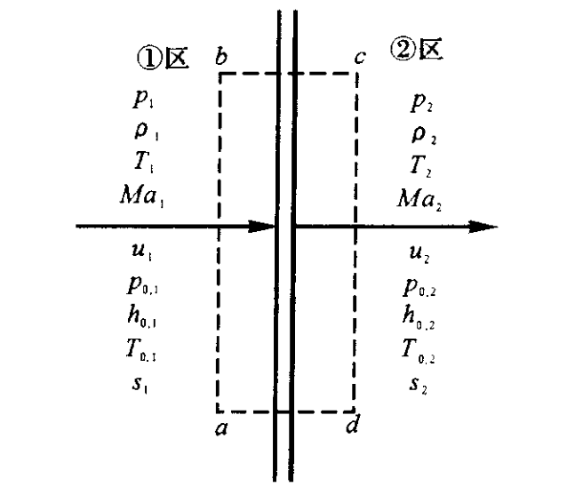

选择一个以abed围成的矩形控制体，激波被控制体所围。两个侧面均与流动方向垂直且面积为A。

定常，绝热，控制体边界无黏，无体积力

连续方程

$$
\rho_{1} u_{1}=\rho_{2} u_{2}
$$

动量方程

$$
p_{1}+\rho_{1} u_{1}^{2}=p_{2}+\rho_{2} u_{2}^{2}
$$

能量方程

$$
h_{1}+\frac{u_{1}^{2}}{2}=h_{2}+\frac{u_{2}^{2}}{2}
$$

热力学关系式

$$
h_{2}=c_{p} T_{2}
$$

$$
p_{2}=\rho_{2} R T_{2}
$$

推导可计算  $Ma_{2}$

$$
\frac{a_{1}^{2}}{\gamma-1}+\frac{u_{1}^{2}}{2}=\frac{a_{2}^{2}}{\gamma-1}+\frac{u_{2}^{2}}{2}
$$

$$
M_{2}^{2}=\frac{(\gamma-1) M_{1}^{2}+2}{2 \gamma M_{1}^{2}-(\gamma-1)}
$$

推导可得**R-H 关系式**

$$
\frac{\rho_{2}}{\rho_{1}}=\frac{(\gamma+1) M_{1}^{2}}{(\gamma-1) M_{1}^{2}+2}
$$

$$
\frac{T_{2}}{T_{1}}=\left(2 \gamma M_{1}^{2}-\gamma+1\right) \frac{(\gamma-1) M_{1}^{2}+2}{(1+\gamma)^{2} M_{1}^{2}}
$$

$$
\frac{p_{2}}{p_{1}}=1+\frac{2 \gamma}{\gamma+1}\left(M_{1}^{2}-1\right)
$$

正激波过后，熵增

$$
s_{2}-s_{1}=c_{p} \ln \left\{\left[1+\frac{2 \gamma}{\gamma+1}\left(M a_{1}^{2}-1\right)\right]^{2} \frac{2+(\gamma-1) M a_{1}^{2}}{(\gamma+1) M a_{1}^{2}}\right\}-R \ln \left[1+\frac{2 \gamma}{\gamma+1}\left(M a_{1}^{2}-1\right)\right]
$$

## 滞止参数、临界参数

在定常、绝热、无黏流动中，沿流线

$$
\frac{\gamma+1}{2(\gamma-1)} a^{* 2}=\frac{a_{0}^{2}}{\gamma-1}=\text { const }
$$

且总温也不变

总压关系

$$
\frac{p_{0.2}}{p_{0.1}}=e^{-\left(s_{2}-s_{1}\right) / R}
$$

有普朗特关系

$$
a^{* 2}=u_{1} u_{2}
$$

## 可压缩流动中速度的测量

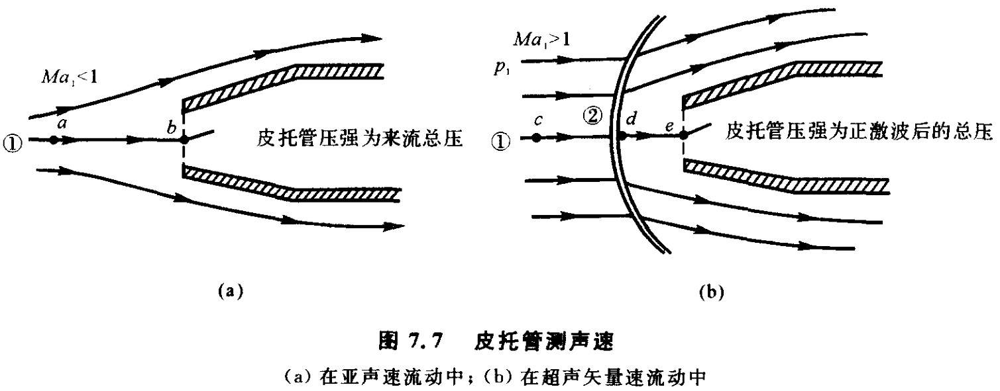

**亚声速流动**

$$
Ma_{1}^{2}=\frac{2}{\gamma-1}\left[\left(\frac{p_{0.1}}{p_{1}}\right)^{(\gamma-1) / \gamma}-1\right]
$$

$$
u_{1}^{2}=\frac{2 a_{1}^{2}}{\gamma-1}\left[\left(\frac{p_{0,1}}{p_{1}}\right)^{(\gamma-1) / \gamma}-1\right]
$$

- $p_{0.1}$ 来流的总压
- $p_{1}$ 来流的静压

**超声速流动**

瑞利-皮托管公式

$$
\frac{p_{0.2}}{p_{1}}=\left(\frac{(\gamma+1)^{2} Ma_{1}^{2}}{4 \gamma Ma_{1}^{2}-2(\gamma-1)}\right)^{\gamma /(\gamma-1)} \frac{1-\gamma+2 \gamma Ma_{1}^{2}}{\gamma+1}
$$

- $p_{0.2}$ 正激波后总压

# 斜激波

## 小扰动的传播及马赫锥

马赫角

$$
\mu=\sin ^{-1} \frac{1}{M}
$$

## 斜激波关系式

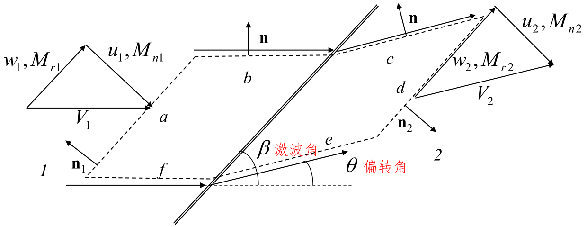

### 基本关系

连续性方程

$$
\rho_{1} u_{1}=\rho_{2} u_{2}
$$

$$
w_{1}=w_{2}
$$

动量方程

$$
p_{1}+\rho_{1} u_{1}^{2}=p_{2}+\rho_{2} u_{2}^{2}
$$

能量方程

$$
h_{1}+\frac{V_{1}^{2}}{2}=h_{2}+\frac{V_{2}^{2}}{2}=h_{0}
$$

通过激波，总焓不变，进一步而言，对于量热完全气体，总温也保持不变。

$$
h_{1}+\frac{u_{1}^{2}}{2}=h_{2}+\frac{u_{2}^{2}}{2}
$$

通过斜激波的变化由垂直于激波的速度分量确定。并且方程与正激波的控制方程相同。

定义斜激波前后的法向马赫数

$$
M_{n, 1}=M_{1} \sin \beta
$$

$$
M_{n, 2}=M_{2} \sin (\beta-\theta)
$$

有关系式

$$
M_{n, 2}^{2}=\frac{1+[(\gamma-1) / 2] M_{n, 1}^{2}}{\gamma M_{n, 1}^{2}-(\gamma-1) / 2}
$$

$$
\frac{\rho_{2}}{\rho_{1}}=\frac{(\gamma+1) M_{n, 1}^{2}}{2+(\gamma-1) M_{n, 1}^{2}}
$$

$$
\frac{p_{2}}{p_{1}}=1+\frac{2 \gamma}{\gamma+1}\left(M_{n, 1}^{2}-1\right)
$$

$$
\frac{T_{2}}{T_{1}}=\frac{p_{2}}{p_{1}} \frac{\rho_{1}}{\rho_{2}}
$$

**波后马赫数即可能小于1，也可以大于1**

### 激波角

斜激波偏转角不是独立参数，有 $\theta-\beta-M_{1}$ 关系式

$$
\tan \theta=2 \cot \beta \frac{M_{1}^{2} \sin ^{2} \beta-1}{M_{1}^{2}(\gamma+\cos 2 \beta)+2}
$$

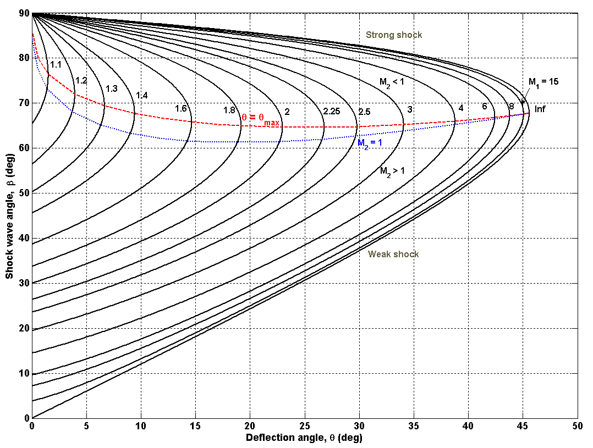

(1) 对于一个给定的波前马赫数, 存在一个  $\theta_{\max}$

- $\theta<\theta_{\max}$ 存在贴体直线斜激波
- $\theta>\theta_{\max}$  出现弯的脱体激波。

$$
\lim _{M_{1} \rightarrow \infty} \theta_{\max } \approx 45.5^{0}
$$

(2) 对应一个  $\theta$  值  $\left(<\theta_{\max }\right)$ , 存在两个  $\beta$  值。不同  $M_{1}$  对应的  $\theta_{\max }$  组成的连线上部分对应强解, 下部分对应弱解。另外一条稍低于  $\theta_{\max }$  连线的曲线为  $M_{2}=1$  的连线, 上部分对应波后为亚音速流情况，下部分对应波后为超音速流情况。

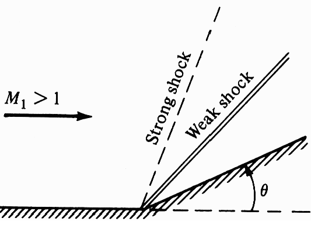

“弱” 与 “强” 的分类是根据以下事实确定的：当给定  $M_{1}$ 时,  $\beta$  越大则  $M_{n, 1}$  越大, 因此压强比  $\mathrm{p}_{2} / \mathrm{p}_{1}$  越大。在实际情况中, 通常出现的是弱解情况。

(3) 如果  $\theta=0^{\circ}$ , 那么  $\beta=90^{\circ}$  或  $\beta=\mu$  (马赫角)。  $\beta=90^{\circ}$  的情况对应正激波, 属于强激波解。  $\beta=\mu$  对应马赫波。对于这两种情况, 通过波流线不发生偏转。

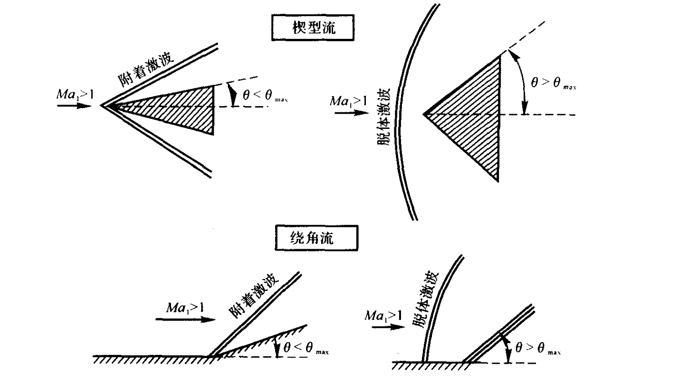

(4) 超音速流流过半顶角为  $\theta$  的尖楔。增加来流马赫数  $M_{1}$  。随着  $M_{1}$  的增加,  $\beta$  角减小, 激波增强, 这是因为随着  $M_{1}$  的增加,  $M_{n, 1}$  是增大的。相反, 降低来流马赫数  $M_{1}$ , 激波角  $\beta$  增大,激波变弱。如果  $M_{1}$  降低到一定程度, 激波将会脱体。对于  $\theta=20^{\circ}, M_{1}<1.84$  时激波将会脱体。

(5) 保持  $M_{1}$  不变而增大偏转角  $\theta$  。随着  $\theta$  的增大, 激波角  $\beta$  增大,  $M_{n, 1}$  是增大的, 激波将会变强。但是, 一旦  $\theta$  角超过  $\theta_{\max}$ , 激波会变成脱体激波。

## 流过尖楔和圆锥的超音速流

对于有着相同半顶角的的圆锥体和楔形体来说，他们的主要不同点为：

- 圆锥体上的激波较弱；
- 圆锥体上的压力较小；
- 圆锥体表面以上的流线是弯曲的，而不是直线的。

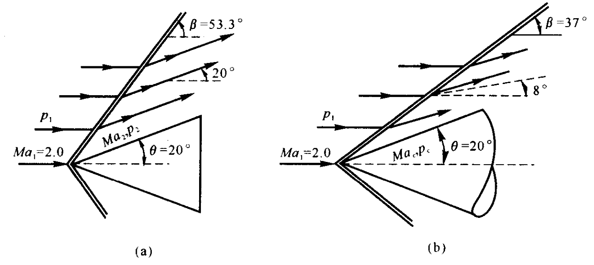

对于尖楔，假设尖楔底部压力为自由来流静压

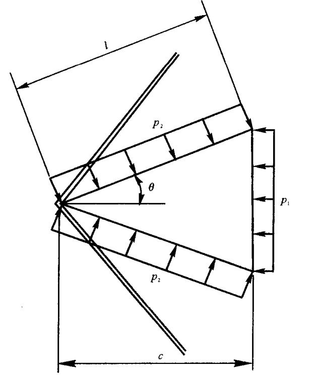

来流动压

$$
q_{1}=\frac{1}{2} \rho_{1} V_{1}^{2}=\frac{1}{2} \rho_{1} \frac{\gamma p_{1}}{\gamma p_{1}} V_{1}^{2}=\frac{\gamma p_{1}}{2 a_{1}^{2}} V_{1}^{2}=\frac{\gamma}{2} p_{1} M a_{1}^{2}
$$

阻力

$$
D^{\prime}=(2 l \sin \theta)\left(p_{2}-p_{1}\right)
$$

阻力系数

$$
c_{d}=\frac{D^{\prime}}{q_{1} c}=\frac{4 \tan \theta}{\gamma M a_{1}^{2}}\left(\frac{p_{2}}{p_{1}}-1\right)
$$

阻力产生的根源是激波的出现。激波是一个耗散的,产生阻力的机制。因此,这种情况下的阻力被称为**波阻**

## 激波干扰与反射

### 正规反射

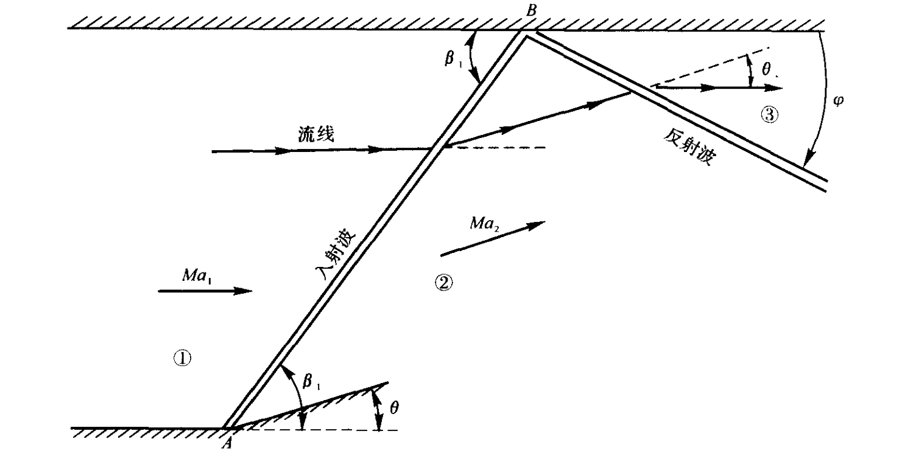

如上图所示的斜激波在真实情况下有时会碰到固壁或与其它激波、膨胀波相交，进而发生相互作用，这种现象称为激波的干扰与反射。

- **入射激波**(Incident shock wave): 点 A 处产生的斜激波
- **反射激波**(Reflected shock wave): 入射激波打到水平壁面 B 点，不会自动消失，而是产生另外一个由 B 点发出的斜激波，以保证激波后流动满足
流线与物面相切的边界条件。这个由 B 点发出的斜激波就是反射激波。

讨论

- 对应相同的偏转角 $\theta$，反射激波的波前马赫数较小。反射激波的
强度比入射激波弱。
- 反射激波与上壁面的夹角 $\varphi$ 不等于入射激波的激波角 $\beta_{1}$，即反射不是镜像反射。
- 反射激波后的流动特性以及反射波与上壁面的夹角 $\varphi$ 可以由 $M_{1}$ 和 $\theta$ 唯一确定。具体步骤如下：

1. 由给定的 $M_{1}$ 和 $\theta$ 计算 2 区的流动特性。
2. 由上一步求出的 $M_{2}$ 和已知的 $\theta$ 值计算区域 3 的流动特性。

### 马赫反射

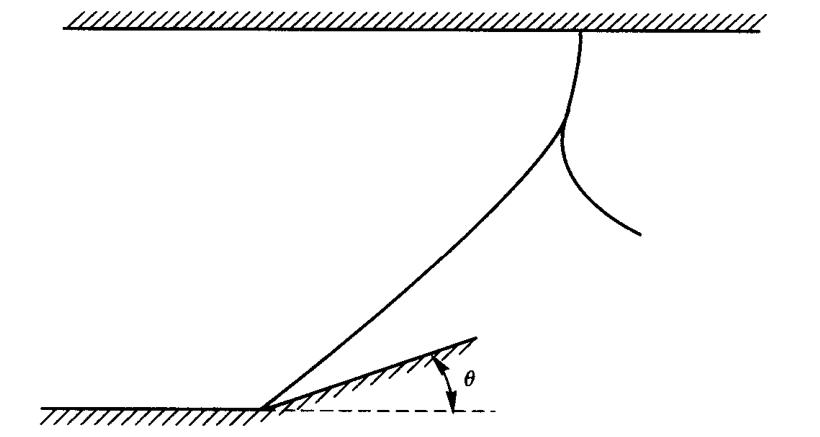

由角点发出的直入射斜激波在上壁面附近弯曲，并在壁面变成一正激波。这个正激波保证了壁面处的壁面边界条件。另外，由正激波上分支出一个反射激波向下游传播。这种波型，称为马赫反射。

## 钝头体前的脱体激波

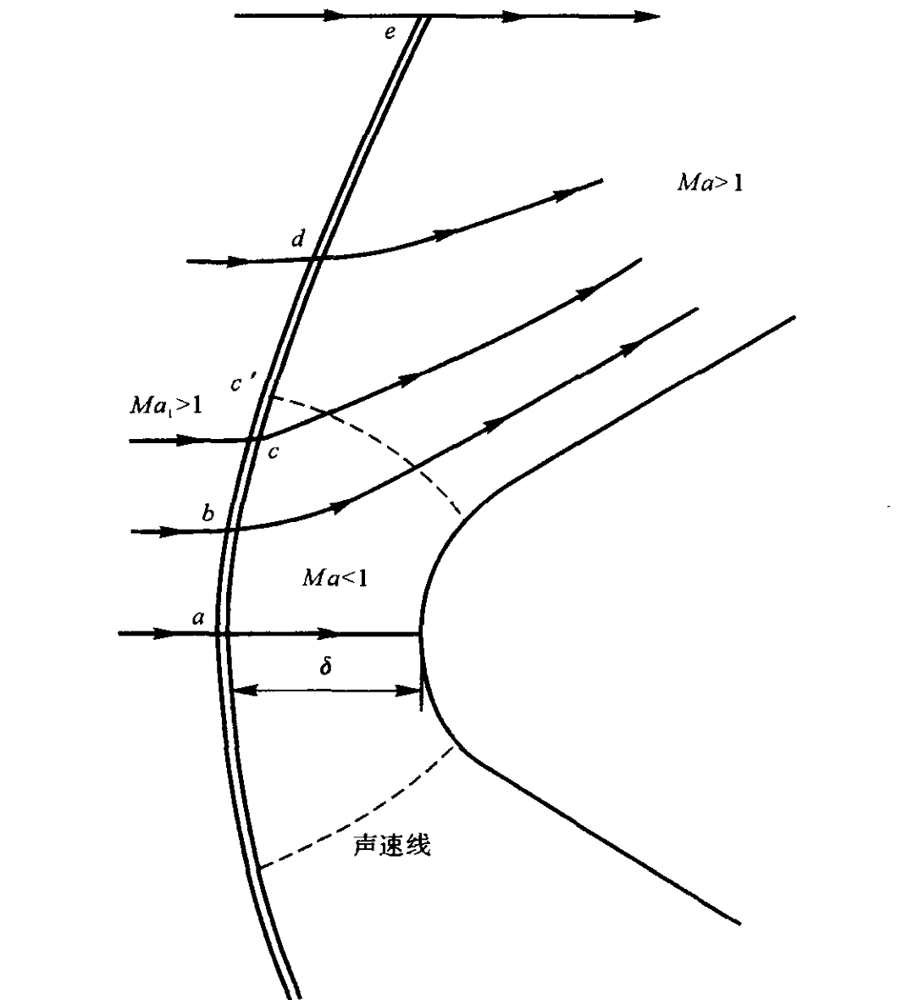

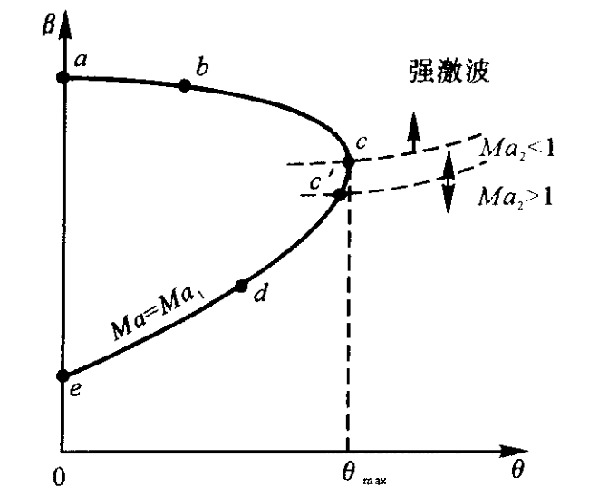

## 普朗特-梅耶膨胀波

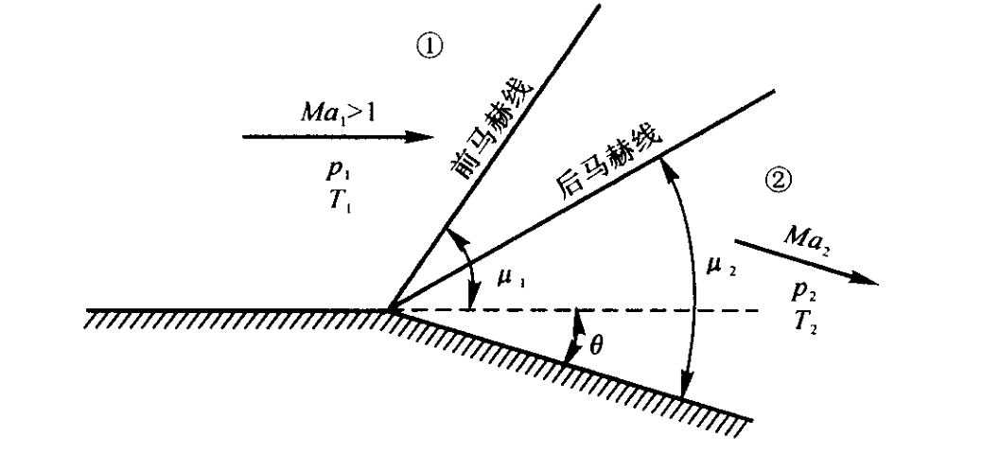

$$
\mu_{1}=\arcsin \frac{1}{M_{1}} \qquad \mu_{2}=\arcsin \frac{1}{M_{2}}
$$

膨胀过程是一个等熵过程

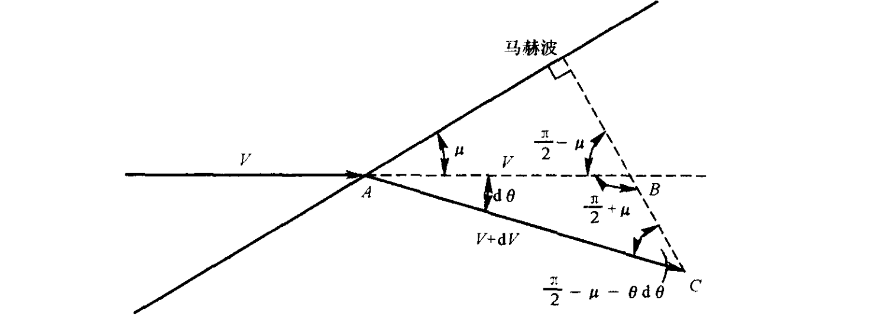

考虑一个以无限小的偏转  $\mathrm{d} \theta$  引起的非常弱的马赫波，马赫角

$$
\mu=\arcsin \frac{1}{M}
$$

斜波波前波后的切向速度分量保持不变

$$
\mathrm{d} \theta=\sqrt{M^{2}-1} \frac{d V}{V}
$$

结合等熵关系式，有 Prandtl-Meyer 函数

$$
\nu(M)=\sqrt{\frac{\gamma+1}{\gamma-1}} \tan ^{-1} \sqrt{\frac{\gamma-1}{\gamma+1}\left(M^{2}-1\right)}-\tan ^{-1} \sqrt{M^{2}-1}
$$

和关系

$$
\theta=\nu\left(M_{2}\right)-\nu\left(M_{1}\right)
$$

对凸曲面，不计气体黏性时，气流参数值的总变化只决定于波前气流参数和总折转角度，不同折转方式只是改变了膨胀过程的快慢。

对凹曲面，由单向直线马赫波所组成的等熵波系（膨胀波或压缩波）都可应用 P－M 关系，但要注意转角符号。

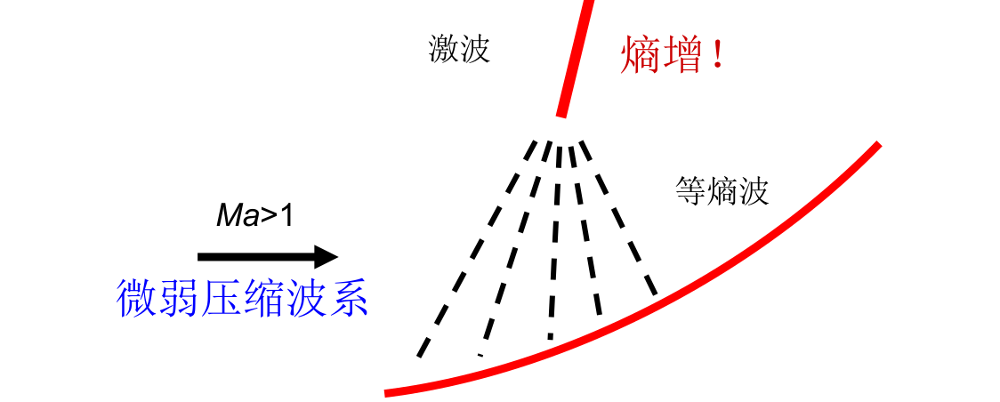

因为膨胀波是等熵的, 因此  $p_{0}$  和  $T_{0}$  通过膨胀波保持不变。即  $T_{0,1}=T_{0,2}$ ，$p_{0,1}=p_{0,2}$

$$
\frac{T_{2}}{T_{1}}=\frac{1+[(\gamma-1) / 2] M_{1}^{2}}{1+[(\gamma-1) / 2] M_{2}^{2}}
$$

$$
\frac{p_{2}}{p_{1}}=\left(\frac{1+[(\gamma-1) / 2] M_{1}^{2}}{1+[(\gamma-1) / 2] M_{2}^{2}}\right)^{\gamma /(\gamma-1)}
$$

对于 Prandtl-Meyer 函数，当  $M_{1}=1$, $M_{2}=\infty$  时, 气流的最大偏转角为

$$
\nu_{\infty}=\frac{\pi}{2}\left(\sqrt{\frac{\gamma+1}{\gamma-1}}-1\right)
$$

如果此时壁面转角大于气流的最大偏转角, 在最大偏转角之外的区域会出现涡街。

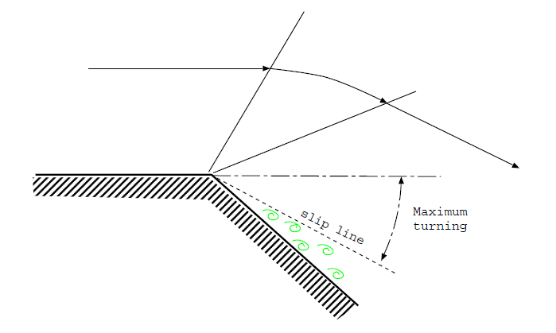

## 激波——膨胀波理论及其对超音速翼型的应用

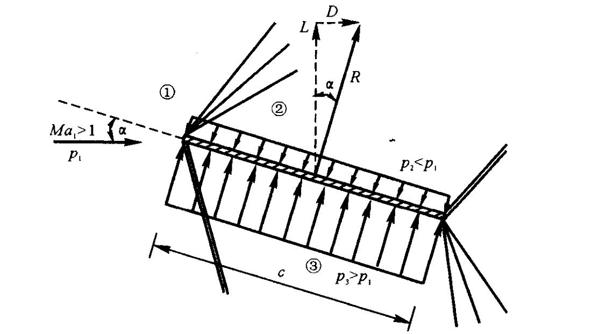

升力

$$
L^{\prime}=\left(p_{3}-p_{2}\right) c \cdot \cos \alpha
$$

$$
c_{l}=\frac{L^{\prime}}{q_{1} S}=\frac{L^{\prime}}{\frac{\gamma}{2} p_{1} M_{1}^{2} c}
$$

阻力

$$
D^{\prime}=\left(p_{3}-p_{2}\right) c \cdot \sin \alpha
$$

$$
c_{d}=\frac{D^{\prime}}{q_{1} S}=\frac{D^{\prime}}{\frac{\gamma}{2} p_{1} M_{1}^{2} c}
$$

<!-- 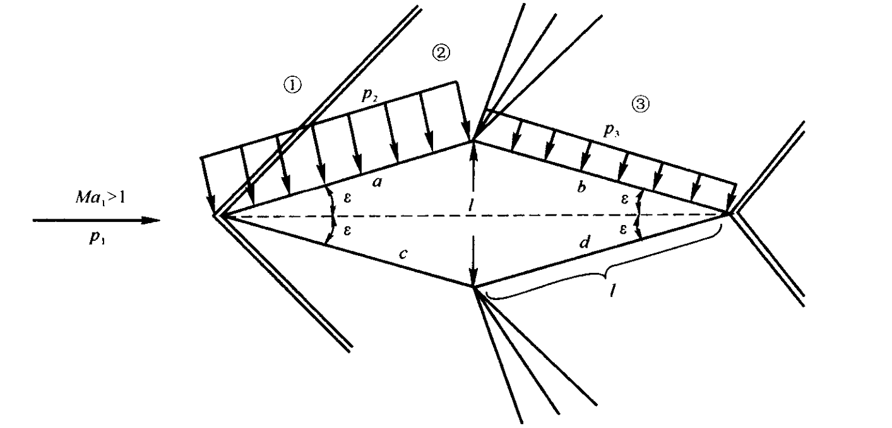 -->

