# 无黏、不可压缩流动

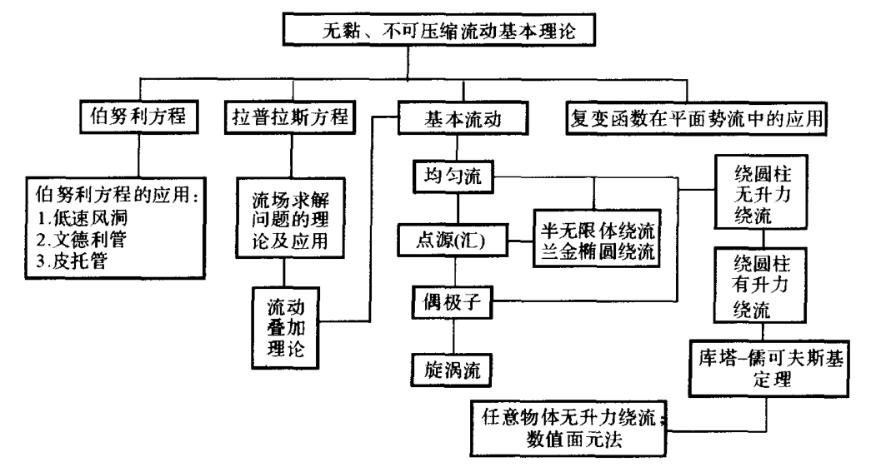

$$
\nabla \cdot \boldsymbol{V}=0
$$

$$
\rho \frac{D \boldsymbol{V}}{D t}=\rho \boldsymbol{f}-\nabla p
$$

## 动量方程的积分

$$
\frac{\partial \boldsymbol{V}}{\partial t}+(\boldsymbol{V} \cdot \boldsymbol{\nabla}) \boldsymbol{V}=-\frac{1}{\rho} \boldsymbol{\nabla} p+\boldsymbol{f}
$$

**兰姆-葛罗米柯方程**

根据

$$
\boldsymbol{V} \times(\boldsymbol{\nabla} \times \boldsymbol{V})=\boldsymbol{\nabla}\left(\frac{\boldsymbol{V} \cdot \boldsymbol{V}}{2}\right)-(\boldsymbol{V} \cdot \boldsymbol{\nabla}) \boldsymbol{V}
$$

有

$$
\frac{\partial \boldsymbol{V}}{\partial t}+\boldsymbol{\nabla}\left(\frac{V^{2}}{2}\right)-\boldsymbol{V} \times \boldsymbol{\Omega}=-\frac{1}{\rho} \boldsymbol{\nabla} p+\boldsymbol{f}
$$

**葛罗米柯方程**

假定彻体力是有势的 $\boldsymbol{f}=-\nabla \Pi$

$$
\frac{\partial \boldsymbol{V}}{\partial t}-\boldsymbol{V} \times \boldsymbol{\Omega}=-\nabla\left(\frac{p}{\rho}+\Pi+\frac{V^{2}}{2}\right)
$$

## 伯努利方程

无黏、不可压缩，定常，略去体积力条件下

$$
p+\frac{1}{2} \rho V^{2}=\text { const }
$$

- 对有旋流动 ，同一条流线对应同一个常数值
- 对无旋流动 ，整个流场对应同一个常数值

**准一维流动连续方程**

$$
\rho A V=\mathrm{const}
$$

$$
A V=\mathrm{const}
$$

**皮托管**

假定自由来流速度为  $V_{1}$ , 则其压力有动压、静压和总压之分。所谓静压即未受扰动的自由来流的压力  $p_{1}$ ; 总压, 即自由来流的速度减小为零时, 流体的压力  $p_{0}$ ; 动压, 即未受扰动的自由来流中单位体积流的动能  $\frac{1}{2} \rho V^{2}$ , 以符号  $q$  表示。为测得来流速度, 将皮托管如图所示放

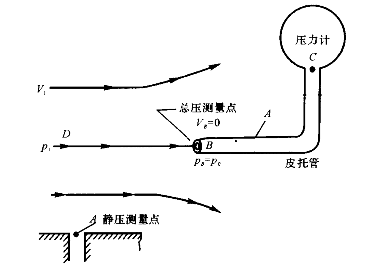

$$
p_{1}+\frac{1}{2} \rho V_{1}^{2}=p_{0}
$$

## 无旋、不可压缩流动控制方程及其边界条件

### 势函数与流函数-满足拉普拉斯方程

无旋流动是指涡量(即旋度)或角速度为零的流动,  则存在**速度势函数**(速度位, 位函数)  $\phi=\phi(x, y, z)$  , 有

$$
V=\nabla \phi
$$

$$
\nabla^{2} \phi=0
$$

平面不可压流动的连续方程  $\boldsymbol{\nabla} \cdot \boldsymbol{V}=0$  即

$$
\frac{\partial u}{\partial x}+\frac{\partial v}{\partial y}=0
$$

则存在**流函数**  $\psi=\psi(x, y)$  , 有

$$
\mathrm{d} \psi=-v \mathrm{~d} x+u \mathrm{~d} y
$$

$$
\nabla^{2} \psi=0
$$

- 流函数的等值线是流线
- 过同一点的流函数等值线与等势线正交
- 两条流线间的流量是两流线的流函数值之差

$$
Q_{\overset{\frown}{A B}}=\int_{\overset{\frown}{A B}} \boldsymbol{V} \cdot \boldsymbol{n} \mathrm{d} \boldsymbol{l} = \psi_{B}-\psi_{A}
$$

$$
\frac{\partial \phi}{\partial r}=V_{r} \qquad \frac{1}{r} \frac{\partial \phi}{\partial \theta}=V_{\theta}
$$

$$
\frac{1}{r} \frac{\partial \psi}{\partial \theta} =V_{r} \qquad -\frac{\partial \psi}{\partial r} =V_{\theta}
$$

### 远场边界条件

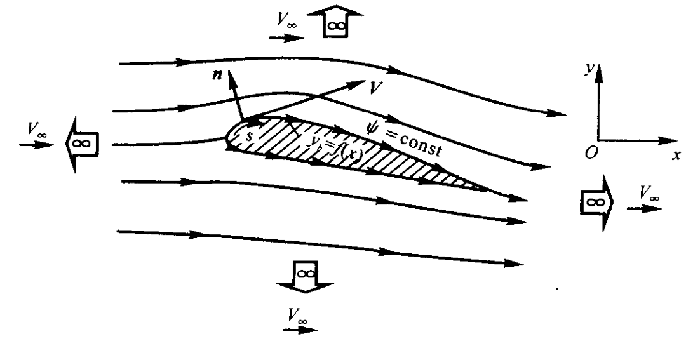

$$
u=\frac{\partial \phi}{\partial x}=\frac{\partial \psi}{\partial y}=V_{\infty}
$$

$$
v=\frac{\partial \phi}{\partial y}=-\frac{\partial \psi}{\partial x}=0
$$

### 固壁边界条件

$$
\boldsymbol{V} \cdot \boldsymbol{n}=(\boldsymbol{\nabla} \phi) \cdot \boldsymbol{n}=0
$$

$$
\frac{\partial \phi}{\partial n}=0
$$

$$
\frac{\partial \psi}{\partial s}=0
$$

物面实际上就是一条流线

## 基本流动

### 均匀流

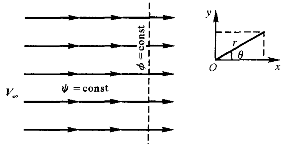

$$
\phi=V_{\infty} x=V_{\infty} r \cos \theta
$$

$$
\psi=V_{\infty} y=V_{\infty} r \sin \theta
$$

### 点源（汇）

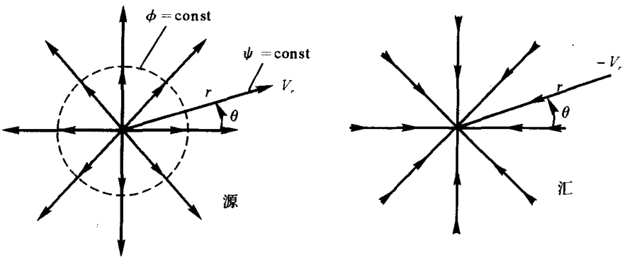

- 源流动是一种不可压缩流动，但源点除外，因为此点为奇点
- 源流动在任意点处（除源点）都是无旋的

$$
V_{r}=\frac{c}{r} \quad V_{\theta}=0
$$

$$
c=\frac{\Lambda}{2 \pi}
$$

$\Lambda$  称为源强度, 表示每秒单位长度点源内流出的体积流量, 单位为  $\mathrm{m}^{3} / \mathrm{s}$

$$
\phi=\frac{\Lambda}{2 \pi} \ln r \qquad \psi=\frac{\Lambda}{2 \pi} \theta
$$

### 偶极子

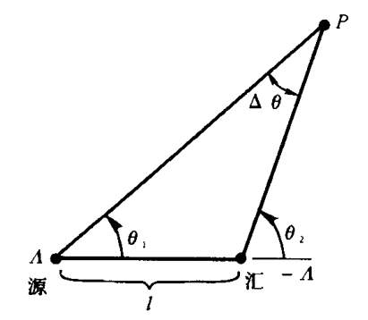

$$
l \rightarrow 0 ,\quad \Delta \theta \rightarrow 0
$$

偶极子的强度

$$
l \Lambda=\kappa
$$

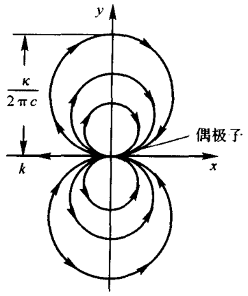

$$
\phi=\frac{\kappa}{2 \pi} \frac{\cos \theta}{r}
$$

$$
\psi=-\frac{\kappa}{2 \pi} \frac{\sin \theta}{r}
$$

### 旋涡流（点涡流）

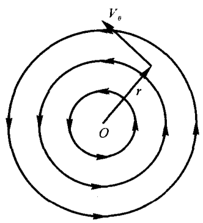

$$
V_{\theta}=-\frac{\Gamma}{2 \pi r}, \quad V_{r}=0
$$

$\Gamma$ 点涡流强度

$$
\phi=-\frac{\Gamma}{2 \pi} \theta
$$

$$
\psi=\frac{\Gamma}{2 \pi} \ln r
$$

## 流动的叠加

### 半无限体绕流

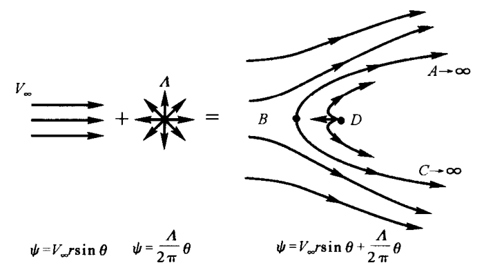

### 兰金椭圆绕流

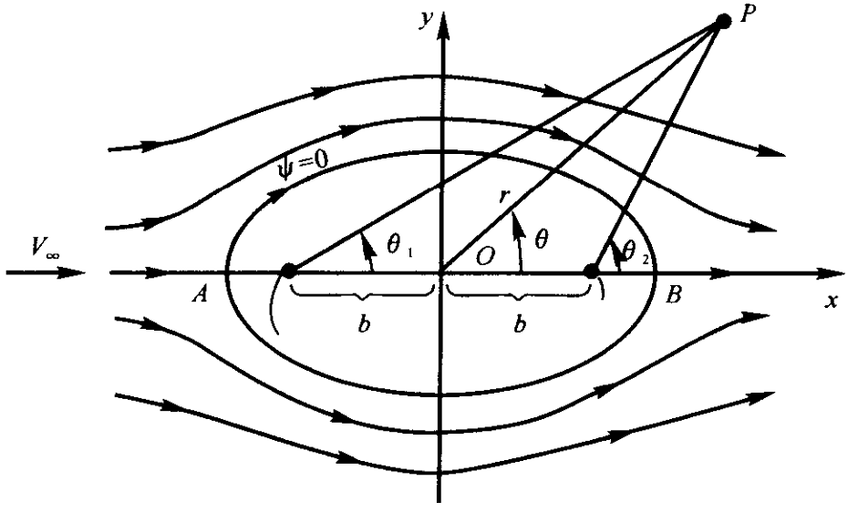

$$
\psi=V_{\infty} r \sin \theta+\frac{\Lambda}{2 \pi}\left(\theta_{1}-\theta_{2}\right)
$$

通过点 $A$ 和点 $B$ 的流线

$$
\psi=V_{\infty} r \sin \theta+\frac{\Lambda}{2 \pi}\left(\theta_{1}-\theta_{2}\right)=0
$$

$$
O A=O B=\sqrt{b^{2}+\frac{\Lambda b}{\pi V_{\infty}}}
$$

### 绕圆柱无升力流动

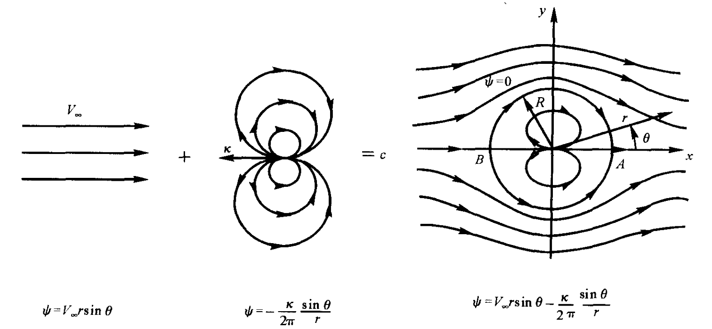

$$
\psi=V_{\infty} r \sin \theta-\frac{\kappa}{2 \pi} \frac{\sin \theta}{r}
$$

圆形流线

$$
\psi=V_{\infty} r \sin \theta-\frac{\kappa}{2 \pi} \frac{\sin \theta}{r} = 0
$$

$$
R=\sqrt{\frac{\kappa}{2 \pi V_{\infty}}}
$$

圆柱表面的速度分布

$$
V_{r}=0 ,\qquad V_{\theta}=-2 V_{\infty} \sin \theta
$$

### 绕圆柱有升力流动

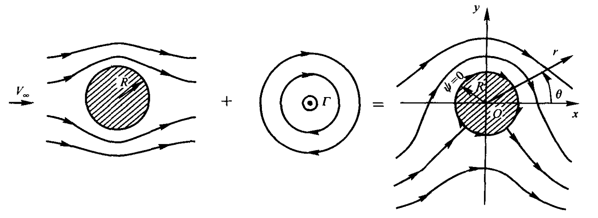

$$
\psi=V_{\infty} r \sin \theta\left(1-\frac{R^{2}}{r^{2}}\right)+\frac{\Gamma}{2 \pi} \ln \frac{r}{R}
$$

## 库塔-儒可夫斯基定理

二维的无黏、不可压缩流的绕流问题

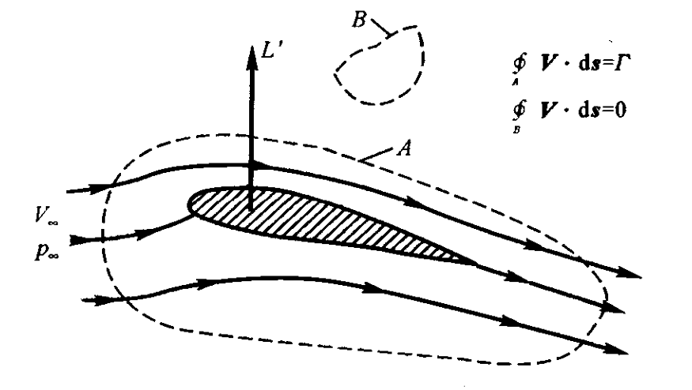

若翼型上有升力产生, 则在绕翼型的速度场中, 沿曲线  $A$  进行的速度线积分为有限值, 即环量

$$
\Gamma=\oint_{A} \boldsymbol{V} \cdot \mathrm{d} \boldsymbol{s}
$$

为有限值。可以得到单位展长上的翼型升力  $L^{\prime}$  的表达式

$$
L^{\prime}=\rho_{\infty} V_{\infty} \Gamma
$$

## 面元法

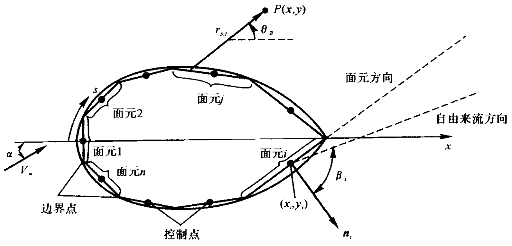

点  $P$  的坐标为  $(x, y)$, $r_{p, j}$  为第  $j$  块面元上任意一点到点  $P$ 的距离。则在点  $P$  由第  $j$  块面元引起的速度势

$$
\Delta \phi_{j}=\frac{\lambda_{j}}{2 \pi} \int_{j} \ln r_{p, j} \mathrm{~d} s_{j}
$$

式中, 第  $j$  块面元上的  $\lambda_{j}$  为常数, 且积分只在第  $j$  块面元上进行。根据叠加原理, 所有的面元在点  $P$  处引起的总速度势为

$$
\phi(P)=\sum_{j=1}^{n} \Delta \phi_{j}=\sum_{j=1}^{n} \frac{\lambda_{j}}{2 \pi} \int_{j} \ln r_{p . j} \mathrm{~d} s_{j}
$$

式中

$$
r_{p, j}=\sqrt{\left(x-x_{j}\right)^{2}+\left(y-y_{j}\right)^{2}}
$$

式中,  $\left(x_{j}, y_{j}\right)$  为沿物面第  $j$  块面元上任意点的坐标。由于点  $P$  为流场中任意一点, 可以把点  $P$ 取在第  $i$  块面元的控制点  $\left(x_{i}, y_{i}\right)$  处

$$
\phi\left(x_{i}, y_{i}\right)=\sum_{j=1}^{n} \frac{\lambda_{j}}{2 \pi} \int_{j} \ln r_{i j} \mathrm{~d} s_{j}
$$

并且

$$
r_{i j}=\sqrt{\left(x_{i}-x_{j}\right)^{2}+\left(y_{i}-y_{j}\right)^{2}}
$$

则上式就成为所有面元块对第  $i$  块面元控制点处的速度势的总和。

考虑在控制点处使用边界条件，即速度在控制点处的法向分量为零。

用  $\boldsymbol{n}_{i}$  表示垂直于第  $i$  块面元的单位法向矢量, 方向沿物面向外。垂直于第  $i$  块面元的自由来流法向分量为

$$
V_{\infty, n}=\boldsymbol{V}_{\infty} \cdot \boldsymbol{n}_{i}=V_{\infty} \cos \beta_{i}
$$

第  $i$  个控制点处的流场速度法向分量由两部分组成：一部分是由自由来流引起的法向速度分量；另一部分就是由所有面元引起的法向速度分量。根据流场边界条件知，这两部分之和应该为零，即

$$
\frac{\lambda_{i}}{2}+\sum_{\substack{j=1 \\(j \neq i)}}^{n} \frac{\lambda_{j}}{2 \pi} \int_{j} \frac{\partial}{\partial n_{i}}\left(\ln r_{i j}\right) \mathrm{d} s_{j}+V_{\infty} \cos \beta_{i}=0
$$

$$
\frac{\lambda_{i}}{2}+\sum_{\substack{j=1 \\(j \neq i)}}^{n} \frac{\lambda_{j}}{2 \pi} I_{i, j}+V_{\infty} \cos \beta_{i}=0
$$

