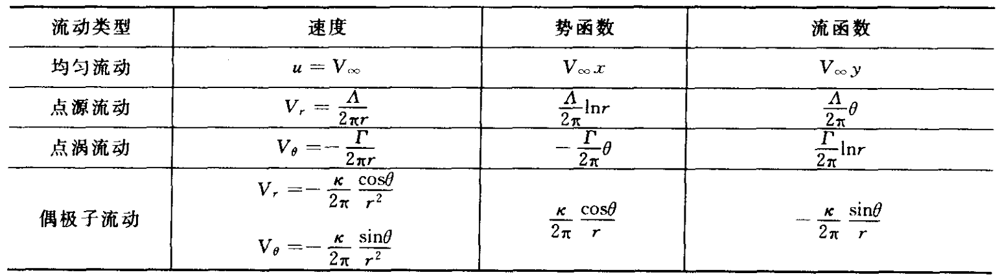
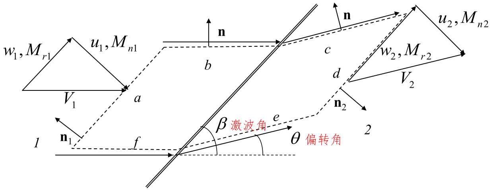
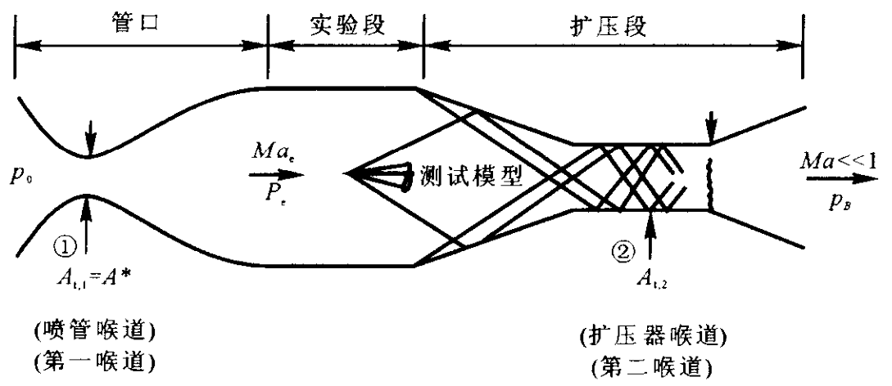

# 绪论与补充

## 流体的物理模型

流体定义：静止状态无法承受剪切应

连续介质假设：不考虑分子间隙，认为介质连续分布于流体所占据的整个空间。流体由连续的流体微团组成，宏观上要足够小，以反映流场“点”状态；微观上要足够大，以消除分子随机运动带来的宏观物理量在统计上的涨落。

> 连续介质假设成立条件：Knudsen数 $\mathrm{Kn}<0.001$，$\mathrm{Kn}=\dfrac{\lambda}{L}$，其中  $\lambda$  为分子平均自由程， $\mathrm{L}$  为流动的特征尺度

### 基本物理量与物理模型

**理想气体**

$$
p=\rho R T
$$

- 标准大气压：101325 Pa = 1 atm
- 海平面大气密度：1.225 Kg/m3
- 标准情况下的大气，R=287 J/(kg・K)

**弹性模量**
压力增量对流体单位比体积增量之比

$$
E=-\frac{d p}{d V / V}=\rho \frac{d p}{d \rho}
$$

水:  $2.15 \times 10^{9} \mathrm{~N} / \mathrm{m}^{2}$ ，空气：水的  $1 / 20000$

**热膨胀系数**

$$
\beta=-\frac{1}{\rho} \frac{\partial \rho}{\partial \mathrm{T}}=\frac{1}{v} \frac{\partial v}{\partial T}
$$

**黏度**

黏度  $\mu$  反映了流体抵抗剪切应变率的能力

牛顿切应力定律：

$$
\tau=\mu \dfrac{\mathrm{d} u}{\mathrm{d} y}
$$

切应力与速度梯度成正比的流体，称为**牛顿流体**；其余种类的流体称为非牛顿流体。

运动黏度  $\nu=\dfrac{\mu}{\rho}$

当温度升高时，液体黏度减小，气体黏度增大。

对于空气，有萨兰特公式(Sutherland's law)

$$
\mu=\mu_{0} \frac{273+C}{T+C}\left(\frac{T}{273}\right)^{1.5}
$$

其中  $\mu_{0}=1.72e-5$  是  $0^{\circ} \mathrm{C}$  时的动力粘度；$\mathrm{C}=110$

对于水

$$
\mu=\frac{\mu_{0}}{1+0.0337 T+0.000221 T^{2}}
$$

**导热**

$$
\boldsymbol{q}=-k \nabla T
$$

- $q$ 热流密度
- $k$ 热传导系数

**流体的扩散性**

$$
\boldsymbol{J}=-D \nabla C
$$

- $\boldsymbol{J}$ 物质扩散通量
- $D$ 物质扩散系数
- $C$ 物质的体积浓度

**内能和焓**

比焓与比内能之间的关系

$$
h=e+p / \rho
$$

对量热完全气体：

$$
h=c_{p} T ,\quad e=c_{V} T
$$

$$
c_{p}=\frac{\gamma R}{\gamma-1} ,\quad c_{V}=\frac{R}{\gamma-1}
$$

对于标准情况下的大气，$\gamma$  =1.4

### 热力学定律

热力学第一定律

$$
\delta q+\delta w=\mathrm{d} e
$$

熵的定义

$$
\mathrm{d} s=\frac{\delta q_{\mathrm{rev}}}{T}
$$

- $s$ 熵
- $\delta q_{\mathrm{rev}}$ 可逆地加于系统的热增量

实际上

$$
\mathrm{d} s=\frac{\delta q}{T}+\mathrm{d} s_{\mathrm{irrev}}
$$

- $\delta q$ 不可逆过程中实际加在系统上的热增量
- $s_{\mathrm{irrev}}$ 不可逆过程中，系统由于黏性消耗，热传导和质量耗散而产生的熵增

热力学第二定律

$$
\mathrm{d} s \geqslant \frac{\delta q}{T}
$$

熵的实际计算：

可逆过程中

$$
T \mathrm{~d} s=\mathrm{d} e+p \mathrm{~d} v
$$

$$
T \mathrm{~d} s=\mathrm{d} h-v \mathrm{~d} p
$$

对量热完全气体

$$
s_{2}-s_{1}=c_{p} \ln \frac{T_{2}}{T_{1}}-R \ln \frac{p_{2}}{p_{1}}=c_{V} \ln \frac{T_{2}}{T_{1}}+R \ln \frac{v_{2}}{v_{1}}
$$

定义既绝热又可逆的过程叫做等熵过程。对量热完全气体，有**等熵关系式**

$$
\frac{p_{2}}{p_{1}}=\left(\frac{\rho_{2}}{\rho_{1}}\right)^{\gamma}=\left(\frac{T_{2}}{T_{1}}\right)^{\gamma /(\gamma-1)}
$$

### 声速

考虑等熵过程

$$
a=\sqrt{\left(\frac{\mathrm{d} p}{\mathrm{~d} \rho}\right)_{\mathrm{s}}}=\sqrt{\gamma R T}
$$

标准海平面大气的声速  $a=340.9 \mathrm{~m} / \mathrm{s}$

马赫数

$$
Ma = \frac{V}{a}
$$

马赫角

$$
\mu=\sin ^{-1} \frac{1}{Ma}
$$

### 滞止参数

**流动定常、绝热、无黏**

由热力学第一定理，沿流线

$$
h+\frac{V^{2}}{2}=h_{0}
$$

对于量热完全气体  $h_{0}=c_{p} T_{0}$ ，称**总温**  $T_{0}$， **总焓**  $h_{0}$  。

如果所有的流线都来自均匀自由来流，那么总焓在不同流线也是相等的，在整个流场中为常数，等于自由来流对应的总焓。

**流动定常、绝热、无黏、等熵**

沿流线总焓相同，则量热完全气体有

$$
\frac{\gamma}{\gamma-1} \frac{p}{\rho}+\frac{1}{2} V^{2}=\frac{\gamma}{\gamma-1} \frac{p_{0}}{\rho_{0}}
$$

$$
p_{0}=\rho_{0} R T_{0}
$$

称**总压**  $p_{0}$，**总密度**  $\rho_{0}$

如果整个流动区域都是等熵的，则总压和总密度分别为常数。

可以定义滞止声速

$$
a_{0} = \sqrt{\gamma R T_{0}}
$$

对理想气体

$$
a^{2}+\frac{\gamma-1}{2} V^{2}=a_{0}^{2}
$$

**等熵关系式**

$$
T=T_{0}\left(1+\frac{\gamma-1}{2} Ma^{2}\right)^{-1}
$$

$$
p=p_{0}\left(1+\frac{\gamma-1}{2} Ma^{2}\right)^{-\gamma/(\gamma-1)}
$$

$$
\rho=\rho_{0}\left(1+\frac{\gamma-1}{2} Ma^{2}\right)^{-1/(\gamma-1)}
$$

### 临界参数

亚声速流或者超声速流中，考虑流场中一点，流体微团**等熵**加速或减速至声速，对应的参数称为**临界参数**，用 “  $*$  ” 标记。

$$
a^{*}=\sqrt{\gamma R T^{*}}
$$

$$
\left(\frac{a^{*}}{a_{0}}\right)^{2}=\frac{T^{*}}{T_{0}}=\frac{2}{\gamma+1} \qquad \frac{p^{*}}{p_{0}}=\left(\frac{2}{\gamma+1}\right)^{\gamma/(\gamma-1)} \qquad \frac{\rho^{*}}{\rho_{0}}=\left(\frac{2}{\gamma+1}\right)^{1/(\gamma-1)}
$$

特征马赫数  $Ma^{*}=\dfrac{V}{a^*}$

$$
{Ma^{*}}^{2}=\frac{(\gamma+1) Ma^{2}}{2+(\gamma-1) Ma^{2}}
$$

## 流体运动

### 描述方法

拉格朗日描述，欧拉描述

**随体导数**

$$
\frac{\mathrm{D}}{\mathrm{D} t}=\frac{\partial}{\partial t}+(\boldsymbol{V} \cdot \nabla)=\frac{\partial}{\partial t}+u_{j} \frac{\partial}{\partial x_{j}}
$$

**流场**

- **流线**：给定的瞬间流场中的假理曲线，该曲线上各点处的切线方向都与流场该点处的速度矢量方向一致
- **迹线**：流体质点的运动轨迹。在定常流动中，流线与迹线重合，形状不变
- **流管**：在流场中任意画一条不是流线的封闭曲线，在同一时刻过此曲线上的每一点作流线，由这些相邻流线所构成的管状曲面
- **流面**：通过一条非流线的曲线(不封闭或封闭的)上每一点所作的那些相邻流线组成的曲面
- **流量**：单位时间内穿过指定截面的流体量
- **脉线**：在一段时间内相继通过空间某固定点的很多流体质点连成的线。在定常流动中脉线的形状不变，与流线、迹线重合，因此常用它来代表流线。
- **涡量**：$\boldsymbol{\Omega}=\operatorname{rot} \boldsymbol{V}=\nabla \times \boldsymbol{V}$
- **涡线**：同一瞬时，该线上每一点的涡轴线都与曲线相切
- 涡面，涡管，涡通量

**雷诺输运定理**

某一瞬间，控制体内的流体所构成的体系，它所具有的物理量总量的随体导数，等于同一瞬间控制体系中所含同一物理量的增加率与该物理量通过控制面的净流出率之和。

$$
\begin{aligned}
& \frac{\mathrm{D}}{\mathrm{D} t}\left(\iiint_{\Omega(t)} \eta(x, y, z, t) \mathrm{d} \Omega\right) \\
= & \iiint_{\Omega} \frac{\partial \eta(x, y, z, t)}{\partial t} \delta \Omega +\oiint_{S} \eta(x, y, z, t) \boldsymbol{V}(x, y, z, t) \cdot \boldsymbol{n} \delta S
\end{aligned}
$$

### 运动分析

平移，线变形，旋转，角变形

应变率张量

$$
\varepsilon_{i j}=\frac{1}{2}\left(\frac{\partial u_{i}}{\partial x_{j}}+\frac{\partial u_{j}}{\partial x_{i}}\right)
$$

应力张量  $\tau_{ij}$

## 二维翼型

### 几何描述

### 气动性质

攻角（迎角）$\alpha$ ：来流与翼型弦线的夹角

单位展长升力 $L^{\prime}$ ：与重力方向相反的气动力分量

单位展长阻力 $L^{\prime}$ ：与升力垂直

单位展长升力力矩 $\displaystyle M^{\prime}=-\int_{0}^{c} \xi \mathrm{d} L^{\prime}$ ：单位展长涡元关于前缘力矩

升力系数  $\displaystyle c_{l}=\frac{L^{\prime}}{q_{\infty} c}$

阻力系数  $\displaystyle c_{d}=\frac{D^{\prime}}{q_{\infty} c}$

力矩系数  $\displaystyle c_{m,le}=\frac{M^{\prime}}{q_{\infty} c^{2}}$

气动中心(焦点)：气动力矩不随迎角变化的点

压力中心  $x_{cp}=-\dfrac{M^{\prime}}{L^{\prime}}$

## 三维机翼

### 几何参数

翼展  $b$ ， 翼面积  $S$

展弦比  $AR=\dfrac{b^{2}}{S}$

几何扭转：攻角沿翼展变化。翼尖攻角小于翼根攻角，称为外洗，反之，称为内洗。

根梢比：翼根弦长与翼尖弦长之比

厚弦比：翼型的最大厚度和弦长的比

### 气动性质

升力、阻力和力矩： $L$ ，$D$  和  $M$

升力系数  $C_{L}=\dfrac{L}{q_{\infty} S}$

阻力系数  $C_{D}=\dfrac{D}{q_{\infty} S}$

力矩系数  $C_{M}=\dfrac{M}{q_{\infty} S}$

## 量纲分析和相似理论

实验的理论基础则是相似原理，实验数据分析则要应用量纲分析。

### 量纲分析

量纲公式

速度  $\operatorname{dim} v=LT^{-1}$  、加速度  $\operatorname{dim} a=LT^{-2}$  、密度  $\operatorname{dim} \rho=ML^{-3}$ 力  $\operatorname{dim} F=MLT^{-2}$  、压强  $\operatorname{dim} p=ML^{-1} T^{-2}$

表面张力  $\operatorname{dim} \sigma=MT^{-2}$  、体积模量  $\operatorname{dim} K=ML^{-1} T^{-2}$  动力粘度  $\operatorname{dim} \mu=M L^{-1} T^{-1}$  、运动粘度  $\operatorname{dim} v=L^{2} T^{-1}$  比热容  $\operatorname{dim} c_{p}=\operatorname{dim} c_{V}=L^{2} T^{-2} \Theta^{-1}$  气体常数  $\operatorname{dim} R=L^{2} T^{-2} \Theta^{-1}$

量纲一致性原则：描述物理现象的物理方程中的各项量纲必然相同。量纲分析：利用量纲一致性原则寻求物理量之间的关系。

$\Pi$定理(铂金汉定理)：如果一个物理过程涉及到  $n$  个物理量和  $m$  个基本量纲，则这个物理过程可以由  $n$  个物理量组成的  $n-m$  个无量纲量的函数关系来描述。

1. 确定影响此物理现象的各个物理量
2. 从  $n$  个物理量中选取  $m$  个基本物理量作为  $m$  个基本量纲的代表
3. 从三个基本物理量以外的物理量中，每次轮取一个，连同三个基本物理量组合成一个无量纲的  $\pi$  项，一共写出   $n-3$  个  $\pi$  项
4. 写出描述物理现象的无因次关系式

### 流动的相似理论

流动相似应满足的条件

- 几何相似：模型和原型的全部对应线形长度的比值为一定常数
- 运动相似：模型与原形的流场所有对应点上、对应时刻的流速方向相同而流速大小的比例相等
- 动力相似：模型与原型的流场所有对应点作用在流体微团上的各种力彼此方向相同，而它们大小的比例相等

只有在满足以上三个相似之后，模型流动才能够真实地模拟出原型流动，模拟才具有实际价值和意义。

四个无量纲数

雷诺数  $Re=\dfrac{\rho U L}{\mu}$ ：惯性力与粘性力的比值

弗劳德数  $Fr=\dfrac{U^{2}}{g L}$ ：惯性力与重力的比值

斯特劳哈尔数  $S_{t}=\dfrac{L}{t U}=\dfrac{f L}{U}$ ：当地惯性力和迁移惯性力的比值，$f$  为特征频率

欧拉数  $Eu=\dfrac{\Delta p}{\rho U^{2}}$ ：所受压力与惯性力之比

相似判据：只要四个无量纲数在两流场中是相同的，那么原型和模型流场相似，则两方程应反映同一事实。

马赫数  $Ma=\dfrac{U}{c_{0}}$ ：惯性力和弹性力之比

普朗特数  $Pr=\dfrac{c_{p} \mu}{k}$ ：流体动量扩散能力与热量扩散能力的对比关系

# 不可压流动

## 无黏不可压流动基础

### 无黏不可压流动的控制方程

适用范围：液体和低速气体(Ma<0.3)流动

$$
\nabla \cdot \boldsymbol{V}=0
$$

$$
\rho \frac{\mathrm{D} \boldsymbol{V}}{\mathrm{D} t}=\rho \mathbf{f}-\nabla p
$$

**伯努利方程**

无黏、不可压缩，定常，略去体积力条件下

$$
p+\frac{1}{2} \rho V^{2}=\text { const }
$$

- 对有旋流动，同一条流线对应同一个常数值
- 对无旋流动，整个流场对应同一个常数值

该常数为总压 $p_{0}$， $\dfrac{1}{2} \rho V^{2}$ 为动压 $q$

压力系数 $C_{p}=\left(p-p_{\infty}\right) / \dfrac{1}{2} \rho V_{\infty}^{2}=1-\left(V/V_{\infty}\right)^{2}$

### 二维无旋流动

**速度势函数**

$$
V=\nabla \phi ,\quad \nabla^{2} \phi=0
$$

**流函数**

$$
\mathrm{d} \psi=-v \mathrm{~d} x+u \mathrm{~d} y
$$

$$
\nabla^{2} \psi=0
$$

- 流函数的等值线是流线
- 过同一点的流函数等值线与等势线正交
- 两条流线间的流量是两流线的流函数值之差

$$
\frac{\partial \phi}{\partial r}=V_{r} \qquad \frac{1}{r} \frac{\partial \phi}{\partial \theta}=V_{\theta}
$$

$$
\frac{1}{r} \frac{\partial \psi}{\partial \theta} =V_{r} \qquad -\frac{\partial \psi}{\partial r} =V_{\theta}
$$

### 基本流动

### 流动的叠加

- 半无限体绕流：均匀流与点源的叠加
- 兰金椭圆绕流：均匀流 + 点源 + 点汇；令速度为0，可以解得两个驻点Ａ和Ｂ
- 绕圆柱无升力流动：均匀流+偶极子
- 圆柱有升力流动：均匀流 + 偶极子 + 涡旋流

达朗贝尔佯谬：势流的情况下在流体中匀速运动的物体不受到液体的作用力

### 库塔-儒可夫斯基定理

二维的无黏、不可压缩流的绕流问题，若翼型上有升力产生，则在绕翼型的速度场中，沿曲线  $A$  进行的速度线积分为有限值，即环量

$$
\Gamma=\oint_{A} \boldsymbol{V} \cdot \mathrm{d} \boldsymbol{s}
$$

可以得到单位展长上的翼型升力  $L^{\prime}$  的表达式

$$
L^{\prime}=\rho_{\infty} V_{\infty} \Gamma
$$

## 二维翼型

### 面涡理论

面涡由无限多的涡丝构成，涡丝与展向平行。定义涡强  $\gamma(s)$。穿过面涡的当地切向速度改变量等于当地面涡强度。

开尔文环量定理：在无粘正压流体中，若外力有势，在一条由相同流体质点组成的封闭曲线的速度环量在随体运动中不随时间变化。

从尾缘脱落的尾涡称为“ 起动涡”；而保持在翼型上的涡量称为“ 附着涡”；如果翼型立即停止，附着涡也随即脱落下来形成“ 停止涡”。由开尔文环量定理，绕翼型的环量与起动涡的环量大小相等方向相反。

### 库塔条件

对于给定环量的物体绕流，只有一个确定的流动同时满足远场和物面边界条件。如果环量不确定，远场边界条件和物体形状不能唯一确定流动形态。

1. 对于给定形状且给定迎角的翼型，绕翼型的环量大小恰好使得流体光滑流过后缘点；
2. 如果翼型后缘夹角为有限大小，则后缘点为驻点；
3. 如果翼型后缘夹角为零,则沿上、下表面流过翼型后缘的速度为相等的有限值。

$$
\gamma_{\mathrm{TE}}=\gamma(a)=V_{1}-V_{2} = 0
$$

### 薄翼理论

小厚度、小弯度翼型

翼型可以用在中弧线上分布的面涡来代替。只需求出能够使中弧线为流线，且满足后缘库塔条件的面涡强度分布。

$$
\frac{1}{2 \pi} \int_{0}^{c} \frac{\gamma(\xi) \mathrm{d} \xi}{x-\xi}=V_{\infty}\left[\alpha-\frac{\mathrm{d} z}{\mathrm{~d} x}\right]
$$

称为**薄翼理论基本公式**，其解为

$$
\gamma(\theta)=2 V_{\infty}\left(A_{0} \frac{1+\cos \theta}{\sin \theta}+\sum_{n=1}^{\infty} A_{n} \sin n \theta\right)
$$

$$
A_{0}=\alpha-\frac{1}{\pi} \int_{0}^{\pi} \frac{\mathrm{d} z}{\mathrm{~d} x} \mathrm{~d} \theta_{0}
$$

$$
A_{n}=\frac{2}{\pi} \int_{0}^{\pi} \frac{\mathrm{d} z}{\mathrm{~d} x} \cos n \theta_{0} \mathrm{~d} \theta_{0}
$$

可计算

$$
\Gamma=\int_{0}^{c} \gamma(\xi) \mathrm{d} \xi=c V_{\infty}\left[\pi A_{0}+\frac{\pi}{2} A_{1}\right]
$$

$$
c_{l}=\frac{L^{\prime}}{q c}=\frac{\rho_{\infty} V_{\infty} \Gamma}{\dfrac{1}{2} \rho_{\infty} V_{\infty}^{2} c}=2 \pi\left[\alpha+\frac{1}{\pi} \int_{0}^{\pi} \frac{\mathrm{d} z}{\mathrm{~d} x}\left(\cos \theta_{0}-1\right) \mathrm{d} \theta_{0}\right]
$$

$$
c_{m,le}=-\frac{\pi}{2}\left(A_{0}+A_{1}-\frac{A_{2}}{2}\right)=-\left[\frac{c_{l}}{4}+\frac{\pi}{4}\left(A_{1}-A_{2}\right)\right]
$$

气动中心在距前缘 1/4 弦长点处，压力中心随升力系数的变化而移动。

对称翼型(平板)的中弧线与弦线重合，其弯度为零。

$$
c_{l}=2 \pi \alpha ,\quad c_{m,le}=-\frac{c_{l}}{4}
$$

气动中心和压力中心均在距前缘 1/4 弦长点处。

## 有限展机翼

### 下洗和诱导阻力

有限展机翼的翼梢旋涡会在机翼周围产生一个小的向下的诱导速度  $w$ ，称之为**下洗速度**。下洗速度与来流速度叠加后，在机翼的各剖面附近形成了相对下偏的当地相对速度。

定义翼型弦线与来流  $V_{\infty}$  的夹角  $\alpha$  为**几何迎角**；当地相对来流的方向定义为来流下偏一个角度  $\alpha_{i}$  后所得的方向，并称  $\alpha_{i}$  为**下洗角**。

当地翼型剖面真正感受到的迎角是翼型弦线与当地相对来流之间的夹角，定义为**有效迎角** $\alpha_{\text {eff }}=\alpha-\alpha_{i}$ 。

升力方向在与来流垂直向上的基础上又向后偏转了一个  $\alpha_{i}$  角，所以在来流方向上会产生一个分量  $D_{i}$ ，这个分量就是由于下洗存在而产生的阻力，称为**诱导阻力**。

作用在有限展长机翼上的下洗减小了机翼每个翼型剖面所感受到的迎角，产生了诱导阻力。

### 有限翼展展向升力分布

- 升力分布为翼展方向的函数  $L^{\prime}(y)$ ；
- 弦长沿翼展变化；
- 零升力攻角沿翼展方向变化，称为**气动扭转**；
- 由于环量和单位展长升力成比例，因此环量也是展长的函数；
- 升力在翼尖为零。

### 线涡及其诱导速度

线涡是可以弯曲的。线涡会在周围的空间中产生诱导流场。如果沿包围线涡的任意封闭路径计算环量，就会得到一个常值  $\Gamma$，定义为线涡的强度。在线涡上取一有向微段  $\mathrm{d} \boldsymbol{l}$。设从微段  $\mathrm{d} \boldsymbol{l}$  到空间任意点  $P$  的矢径为  $\boldsymbol{r}$ , 则微段  $\mathrm{d} \boldsymbol{l}$  在点  $P$  的诱导速度为

$$
\mathrm{d} \boldsymbol{V}=\frac{\Gamma}{4 \pi} \frac{\mathrm{d} \boldsymbol{l} \times \boldsymbol{r}}{|\boldsymbol{r}|^{3}}
$$

半无限长线涡的诱导速度  $V=\dfrac{\Gamma}{4 \pi h}$ ，$h$ 为到线涡出发点的距离。

亥姆霍兹定理：涡丝强度沿长度方向不变；涡丝不能在流体中中断；涡丝或者延长到流体的边界（可以为无穷远），或者形成闭合回路。

### 经典升力线理论

沿升力线无穷多马蹄涡叠加，用附着涡代替有限长机翼，用附着涡和自由拖曳涡描述绕流有限长机翼流场。附着涡在其自身上没有诱导速度，两个拖曳涡在附着涡方向沿下洗方向有诱导速度。

$$
w\left(y_{0}\right)=-\frac{1}{4 \pi} \int_{-b / 2}^{b / 2} \frac{(\mathrm{d} \Gamma / \mathrm{d} y) \mathrm{d} y}{y_{0}-y}
$$

诱导迎角

$$
\alpha_{i}\left(y_{0}\right)=\arctan\left(-\frac{w\left(y_{0}\right)}{V_{\infty}}\right)
$$

$$
\alpha_{\text {eff }}=\alpha-\alpha_{i}
$$

当地翼型的升力系数  $c_{l}=2 \pi\left[\alpha_{\mathrm{eff}}\left(y_{0}\right)-\alpha_{L=0}\right]$

又有当地翼型升力的两种求法

$$
L^{\prime}=\frac{1}{2} \rho_{\infty} V_{\infty}^{2} c\left(y_{0}\right) c_{l}\left(y_{0}\right)=\rho_{\infty} V_{\infty} \Gamma\left(y_{0}\right)
$$

可推出**普朗特升力线理论基本方程**

$$
\alpha\left(y_{0}\right)=\frac{\Gamma\left(y_{0}\right)}{\pi V_{\infty} c\left(y_{0}\right)}+\alpha_{L=0}\left(y_{0}\right)+\frac{1}{4 \pi V_{\infty}} \int_{-b / 2}^{b / 2} \frac{(\mathrm{d} \Gamma / \mathrm{d} y) \mathrm{d} y}{y_{0}-y}
$$

求解出环量  $\Gamma=\Gamma(y)$

升力分布

$$
L^{\prime}\left(y_{0}\right)=\rho_{\infty} V_{\infty} \Gamma\left(y_{0}\right)
$$

总升力

$$
L=\int_{-b / 2}^{b / 2} L^{\prime}(y) d y=\rho_{\infty} V_{\infty} \int_{-b / 2}^{b / 2} \Gamma(y) \mathrm{d} y
$$

升力系数

$$
C_{L}=\frac{L}{q_{\infty} S}=\frac{2}{V_{\infty} S} \int_{-b / 2}^{b / 2} \Gamma(y) \mathrm{d} y
$$

单位展长诱导阻力

$$
D_{i}^{\prime}=L^{\prime} \alpha_{i}
$$

总诱导阻力

$$
D_{i}=\int_{-b / 2}^{b / 2} D^{\prime}(y) \mathrm{d} y=\rho_{\infty} V_{\infty} \int_{-b / 2}^{b / 2} \Gamma(y) \alpha_{i}(y) \mathrm{d} y
$$

诱导阻力系数

$$
C_{D, i}=\frac{D_{i}}{q_{\infty} S}=\frac{2}{V_{\infty} S} \int_{-b / 2}^{b / 2} \Gamma(y) \alpha_{i}(y) \mathrm{d} y
$$

**椭圆型翼载分布**

$$
\Gamma(y)=\Gamma_{0} \sqrt{1-\left(\frac{2 y}{b}\right)^{2}}
$$

下洗速度沿展向为常数

$$
w=-\frac{\Gamma_{0}}{2 b}
$$

升力

$$
L=\rho_{\infty} V_{\infty} \Gamma_{0} \frac{b}{4} \pi
$$

升力系数

$$
C_{L} = \frac{\pi b \Gamma_0}{2 V_\infty S}
$$

诱导攻角

$$
\alpha_{i}=\frac{\Gamma_{0}}{2 b V_{\infty}}=\frac{C_{L}}{\pi \mathrm{AR}}
$$

椭圆升力分布情况下，诱导攻角和展弦比成反比。

诱导阻力系数

$$
C_{D, i}=\frac{C_{L}^{2}}{\pi A R}
$$

诱导阻力系数与升力系数的平方成正比。这是由于诱导阻力和升力均为机翼上下表面压力分布差异造成，因此诱导阻力常被称为升致阻力；诱导阻力系数和展弦比成反比。

弦长沿展向以椭圆规律分布

$$
c(y)=\frac{L^{\prime}(y)}{q_{\infty} c_{l}}
$$

## 黏性流动基础

粘性摩擦切应力与物面的粘附条件（无滑移条件）是粘性流体运动有别与理想流体运动的主要标志。

### 黏性流动的控制方程

**连续方程**

$$
\frac{\partial \rho}{\partial t}+\nabla \cdot(\rho \boldsymbol{V})=0
$$

$$
\frac{\partial \rho}{\partial t}+\frac{\partial\left(\rho u_{i}\right)}{\partial x_{i}}=0
$$

**运动方程**

$$
\rho \frac{\mathrm{D} \boldsymbol{V}}{\mathrm{D} t}=\rho \mathbf{f}+\nabla \cdot [\boldsymbol{\tau}]
$$

$$
\rho \frac{\partial u_{i}}{\partial t}+\rho u_{j} \frac{\partial u_{i}}{\partial x_{j}}=\rho f_{i}+\frac{\partial \tau_{i j}}{\partial x_{i}}
$$

考虑牛顿流体，广义牛顿内摩擦定理，有**本构方程**

$$
[\boldsymbol{\tau}]=2 \mu [\boldsymbol{\varepsilon}]-\left[p+\frac{2}{3} \mu \nabla \cdot \boldsymbol{V}\right](I)
$$

$$
\tau_{i j}=\left\{\begin{aligned}
& \mu\left(\dfrac{\partial u_{i}}{\partial x_{j}}+\dfrac{\partial u_{j}}{\partial x_{i}}\right) \quad & i \neq j \\
& 2 \mu \dfrac{\partial u_{i}}{\partial x_{j}}-\dfrac{2}{3} \mu \nabla \cdot \boldsymbol{V}-p \quad & i=j
\end{aligned}\right.
$$

常粘度条件，运动方程有

$$
\rho \frac{\mathrm{D} \boldsymbol{V}}{\mathrm{D} t}=\rho \mathbf{f}-\nabla p+\mu \nabla^{2} \boldsymbol{V}+\frac{\mu}{3} \nabla(\nabla \cdot \boldsymbol{V})
$$

不可压，有**涡量输运方程**

$$
\frac{\mathrm{D} \boldsymbol{\Omega}}{\mathrm{D} t}=(\boldsymbol{\Omega} \cdot \nabla) \boldsymbol{V}+\nu \nabla^{2} \boldsymbol{\Omega}
$$

粘性流体运动的基本特征：

- 运动的有旋性
- 旋涡的扩散性
- 能量的耗散性

**能量方程**

$$
\rho \frac{\mathrm{D}}{\mathrm{D} t}\left(e+\frac{V^{2}}{2}\right)=\rho \mathbf{f} \cdot \boldsymbol{V}+\nabla \cdot([\boldsymbol{\tau}] \cdot \boldsymbol{V})+\rho Q
$$

$$
\rho \frac{\mathrm{D}}{\mathrm{D} t}\left(e+\frac{u_{i} u_{i}}{2}\right)=\rho f_{i} u_{i}+\frac{\partial\left(\tau_{i j} u_{j}\right)}{\partial x_{i}}+\rho Q
$$

$$
\rho Q = \rho q+\nabla \cdot(k \nabla T) = \rho q+\frac{\partial}{\partial x_{i}}\left(k \frac{\partial T}{\partial x_{i}}\right)
$$

- $q$ 吸收热辐射、化学反应及燃烧等产生的外部加热

**动能方程**

$$
\rho \frac{\mathrm{D}}{\mathrm{D} t}\left(\frac{u_{i} u_{i}}{2}\right)=\rho f_{i} u_{i}+\frac{\partial\left(\tau_{j i} u_{i}\right)}{\partial x_{j}}-\tau_{j i} \varepsilon_{j i}
$$

**内能方程**

$$
\rho \frac{\mathrm{D} e}{\mathrm{D} t} =\boldsymbol{\pi}: \boldsymbol{\varepsilon} + \rho Q
$$

$$
\rho \frac{\mathrm{D} e}{\mathrm{D} t}=\pi_{i j} \varepsilon_{i j}+\rho Q
$$

定义耗散系数  $\Phi$

$$
\pi_{i j} \varepsilon_{i j} = -p \frac{\partial u_{i}}{\partial x_{i}}+\Phi
$$

对牛顿流体

$$
\Phi=2 \mu \varepsilon_{i j} \varepsilon_{i j}-\frac{2}{3} \mu\left(\frac{\partial u_{i}}{\partial x_{i}}\right)^{2}
$$

则内能方程为

$$
\rho \frac{\mathrm{D} e}{\mathrm{D} t} =-p \nabla \cdot \boldsymbol{V}+\Phi+\rho Q
$$

单位体积流体内能的变化率等于法向力作功、由于粘性而消耗的机械能以及外加热量之和

**焓方程**

$$
h=e+\frac{p}{\rho}
$$

$$
\rho \frac{\mathrm{D} h}{\mathrm{D} t}=\frac{\mathrm{D} p}{\mathrm{D} t}+\Phi+\rho Q
$$

有热焓式

$$
c_{p} \frac{\mathrm{D} T}{\mathrm{D} t}=Q+\frac{\Phi}{\rho}+\frac{1}{\rho} \frac{\mathrm{D} p}{\mathrm{D} t}
$$

总焓式

$$
\frac{\mathrm{D}}{\mathrm{D} t}\left(h+\frac{1}{2} u_{i} u_{i}\right)=Q+u_{i} f_{i}+\frac{1}{\rho} \frac{\partial\left(m_{j i} u_{i}\right)}{\partial x_{j}}+\frac{1}{\rho} \frac{\partial p}{\partial t}
$$

**熵方程**

对于完全气体

$$
T \frac{\mathrm{D} s}{\mathrm{D} t}=\frac{\mathrm{D} e}{\mathrm{D} t}+p \frac{\mathrm{D}}{\mathrm{D} t}\left(\frac{1}{\rho}\right)
$$

则有

$$
T \frac{\mathrm{D} s}{\mathrm{D} t}=\frac{\Phi}{\rho}+Q
$$

### 层流、湍流和转捩

**层流**流动时，流体微团保持相互平行的层状运动。流体的横向掺混仅由于分子热运动产生。对于**湍流**，流体微团间处于无规则的随机运动之中。不同尺寸的旋涡团间相互掺混，引起强烈的能量和热量的交换和传输，并引起机械能量的迅速耗散。流动从层流演变为湍流的现象与过程叫**转捩**。

雷诺实验：(1) 从层流转变为湍流的 Re 大小同入口处条件有关。(2) 压力损失，有上临界点，对应层流转变为湍流；下临界点，对应湍流转变为层流。

### 圆柱绕流

理想流体：

- 前驻点 A，后驻点 D，最大速度点 B、C；
- 中心流线在前驻点分叉，后驻点汇合；
- A-B 区和 A-C 区：顺压梯度区；B-D 区和 C-D 区：逆压梯度区；
- 圆柱面上压强分布对称，无阻力存在。

粘性流体：

- 物面附近产生边界层；
- A-B 点流程：消耗部分动能克服摩擦力阻力做功；
- B-D 点流程，流经一段距离将全部动能消耗殆尽，在壁面某点速度变为零(S点)，出现边界层分离；
- 在分离点之间的空腔内流体质点发生倒流，由下游高压区流向低压区，在圆柱后面形成了旋涡区；
- 旋涡涡区的出现，使得圆柱壁面压强前后不对称（如前驻点的压强要明显大于后驻点的压强）。

流体粘性引起的总阻力包括**摩擦阻力**和**压差阻力**。

### 平行平板间的层流

- 两平行平板间充满不可压牛顿流体
- 流体在  $x$  方向受压力梯度的作用

$$
v = 0
$$

$$
\frac{\partial u}{\partial t} + u \frac{\partial u}{\partial x} = f_{x} - \frac{1}{\rho}\frac{\partial p}{\partial x} + \nu \left( \frac{\partial^{2} u}{\partial x^{2}} + \frac{\partial^{2} u}{\partial y^{2}} \right)
$$

$$
f_{y} = \frac{1}{\rho}\frac{\partial p}{\partial y}
$$

### 管道中的层流

当流体进入管道入口后，边界层厚度由零随离开入口的距离增加，流动沿长度方向逐渐变化，经过一定长度后，流动不再改变，所有截面处的速度分布相同，称之为完全发展的流动，也称为泊肃叶流动(PoiseuilleFlow)。

$$
\mu\left(\frac{\mathrm{d}^{2} u}{\mathrm{~d} r^{2}}+\frac{1}{r} \frac{\mathrm{d} u}{\mathrm{~d} r}\right)=\frac{\mathrm{d} p}{\mathrm{~d} x}
$$

速度分布为抛物面

$$
u=-\frac{1}{4 \mu} \frac{\mathrm{d} p}{\mathrm{~d} x}\left(a^{2}-r^{2}\right)=u_{\max }\left(1-\frac{r^{2}}{a^{2}}\right)
$$

体积流量  $\displaystyle Q=\int_{0}^{a} u \cdot 2 \pi r \mathrm{d} r=-\frac{\pi a^{4}}{8 \mu} \frac{\mathrm{d} p}{\mathrm{~d} x}$

平均速度  $\displaystyle u_{\mathrm{m}}=-\frac{a^{2}}{8 \mu} \frac{\mathrm{d} p}{\mathrm{~d} x}$

剪应力分布  $\displaystyle \tau=\mu \frac{\partial u}{\partial r}=\frac{r}{2} \frac{\mathrm{d} p}{\mathrm{~d} x}$  ，管壁上剪应力  $\displaystyle \tau_{w}=\frac{a}{2} \frac{\mathrm{d} p}{\mathrm{~d} x}$

摩擦系数  $\displaystyle \gamma=\frac{\tau_{w}}{\frac{1}{2} \rho u_{m}^{2}}=\frac{8 \mu}{\rho u_{m} a}=\frac{16}{Re}$

阻力系数  $\displaystyle \lambda=\frac{\Delta p}{\frac{l}{2 a} \cdot \frac{1}{2} \rho u_{m}^{2}}=\frac{64}{Re}$

## 边界层理论

### 边界层

大雷诺数绕流流场，在靠近物面的薄层流体内，流场的特征与理想流动相差甚远，**沿着法向存在很大的速度梯度，粘性力无法忽略**。这一物面近区粘性力起重要作用的薄层称为**边界层**(附面层)。

- 边界层：N-S方程化简为边界层方程
- 尾迹区：N-S方程
- 势流区：理想流Euler方程

沿壁面的法线向外推移， $u=0.99 V_{e}$  的位置和壁面间的距离定义为边界层厚度，并称为边界层的**名义厚度**。

**排挤厚度**就是理想无黏流流线被外推的距离，用于边界层精确计算时修正物面。

$$
\delta_{1}=\frac{1}{\rho_{e} V_{e}} \int_{0}^{h>\delta}\left(\rho_{e} V_{e}-\rho u\right) \mathrm{d} y=\int_{0}^{h>\delta}\left(1-\frac{\rho u}{\rho_{e} V_{e}}\right) \mathrm{d} y
$$

**动量损失厚度**

$$
\delta_{2}=\frac{1}{\rho_{e} V_{e}^{2}} \int_{0}^{h>\delta} \rho u\left(V_{e}-u\right) \mathrm{d} y=\int_{0}^{h>\delta} \frac{\rho u}{\rho_{e} V_{e}}\left(1-\frac{u}{V_{e}}\right) \mathrm{d} y
$$

边界层内损失的动量相当于厚度为  $\delta_{2}$  的理想流体动量。

$$
\delta_{2} < \delta_{1} < \delta
$$

### 不可压缩层流边界层方程

选取长度尺度  $L$ ，速度尺度  $u_{e}$ ，时间尺度  $t=L / u_{e}$ ，近似假定在边界层内满足下列关系:

- 法向尺度远小于纵向尺度，纵向导数远小于法向导数
- 法向速度远远小于纵向速度
- 压强与外流速度的平方成正比

Prandtl 边界层方程

$$
\frac{\partial u}{\partial x}+\frac{\partial v}{\partial y}=0
$$

$$
\frac{\partial u}{\partial t}+u \frac{\partial u}{\partial x}+v \frac{\partial u}{\partial y}=-\frac{1}{\rho} \frac{\partial p}{\partial x}+v \frac{\partial^{2} u}{\partial y^{2}}
$$

$$
\frac{\partial p}{\partial y}=0
$$

边界条件

$$
y=0 , u=0 , v=0
$$

$$
y=\infty , u=u_{e}
$$

对于曲率不大的弯曲物面，上述边界层方程也近似成立。

- 边界层很薄
- 边界层内速度梯度很大，粘性不可忽略
- 边界层内压力沿壁面法向不变，等于外部势流压力
- 边界层内速度分布具有渐进性
- 边界层有涡性

### 定常平板层流边界层

不可压缩、定常、层流、不计重力、无压力梯度

**Blasius 解**

引入流函数  $\psi(x, y)$  和无量纲量  $\eta=\dfrac{y}{\sqrt{x \nu/V_{\infty}}}$

假设在距平板前缘不同位置处，边界层内速度分布是“相似”的： $\dfrac{u}{V_{\infty}}=\phi(\eta)$

则可定义无量纲函数  $f(\eta)$

$$
\psi=\int u \mathrm{~d} y=\sqrt{x \nu V_{\infty}} \int \phi(\eta) \mathrm{d} \eta \equiv \sqrt{x \nu V_{\infty}} f(\eta)
$$

$$
f f^{\prime \prime}+2 f^{\prime \prime \prime}=0
$$

边界条件为

当  $\eta=0$  时，  $f=f^{\prime}=0$

当  $\eta \rightarrow \infty$  时，  $f^{\prime}=1$

**边界层的各种厚度**

边界层厚度  $u / V_{\infty}=0.9916$ 时， $\eta=5.0$

$$
\delta=5 \sqrt{\frac{v x}{V_{\infty}}}=5 \frac{x}{\sqrt{\operatorname{Re}_{x}}}
$$

$$
\delta_{1}=\int_{0}^{\delta}\left(1-\frac{u}{V_{\infty}}\right) d y=1.7208 \frac{x}{\sqrt{\operatorname{Re}_{x}}}
$$

$$
\delta_{2}=\int_{0}^{\delta} \frac{u}{V_{\infty}}\left(1-\frac{u}{V_{\infty}}\right) d y=0.664 \frac{x}{\sqrt{\mathrm{Re}_{x}}}
$$

**壁面摩擦阻力**

壁面切应力

$$
\tau_{0}=\left.\mu \frac{\partial u}{\partial y}\right|_{y=0}=\left.\mu V_{\infty} f^{\prime \prime}(\eta)\right|_{\eta=0} \sqrt{\frac{V_{\infty}}{v x}}=0.332 \rho V_{\infty}^{2} \frac{1}{\sqrt{\operatorname{Re}_{x}}}
$$

壁面摩擦阻力系数

$$
C_{f}=\frac{\tau_{0}}{\frac{1}{2} \rho V_{\infty}^{2}}=0.664 \frac{1}{\sqrt{\operatorname{Re}_{x}}}
$$

平板的总摩擦阻力与阻力系数

$$
D_{F}=\int_{0}^{L} \tau_{0} d x=0.664 \rho V_{\infty}^{2} \sqrt{\frac{\nu L}{U}}
$$

$$
C_{F}=\frac{D_{F}}{\frac{1}{2} \rho V_{\infty}^{2} L}=\frac{1.328}{\sqrt{\operatorname{Re}_{L}}} \quad\left(100<\operatorname{Re}_{L}<5 \times 10^{5}\right)
$$

### 边界层动量积分方程式

$$
\frac{\tau_{0}}{\rho}=\frac{\mathrm{d}}{\mathrm{d} x}\left(V_{\mathrm{e}}^{2} \delta_{2}\right)+V_{\mathrm{e}} \delta_{1} \frac{\mathrm{d} V_{\mathrm{e}}}{\mathrm{d} x}
$$

一阶常微分方程，既适用于层流也适用于湍流边界层。该方程给出了壁面剪切应力与位移厚度和动量厚度之间的关系。

利用动量积分关系式方法求解边界层流动的基本思想就是：根据边界层流动特性和在壁面与边界层外缘的边界条件，近似地给出一个只依赖于单参数（称为型参数）的速度型族来代替边界层内真实的速度分布，这样就可以通过动量积分关系式将上述三个未知量归结为一个未知量，然后确定速度分布规律的型参数，进而可以确定边界层中其他流动参数。

### 边界层的分离

边界层中的流体质点受惯性力、粘性力和压力的作用。惯性力与粘性力的相对大小决定了粘性影响的相对区域大小，或边界层厚度的大小；粘性力的作用始终是阻滞流体质点运动，使流体质点减速，失去动能；压力的作用取决于绕流物体的形状和流道形状，**顺压梯度**有助于流体加速前进，而**逆压梯度**阻碍流体运动。

**分离点**定义为紧邻壁面顺流区与倒流区的分界点。分离点下游区域受逆压梯度的作用而发生倒流。在分离点附近和分离区，边界层假设不再成立，边界层厚度大大增加。

边界层分离的必要条件是存在逆压梯度和粘性剪切层。

根据边界层方程，在壁面上

$$
\frac{\partial^{2} u}{\partial y^{2}}=\frac{1}{\mu} \frac{\partial p}{\partial x}=-\frac{V_{e}}{\nu} \frac{\partial V_{e}}{\partial x}
$$

随着压力梯度的变号，边界层速度分布的曲率将改变符号。

粘性流体绕过曲线壁面时，速度将经历从加速达到最大然后减速的过程，对应的压强也会从顺压变化为逆压，从而边界层内速度分布的曲率也将随之改变。

- 对于顺压梯度区，压力沿程减小，速度沿程增加。边界层内的速度沿y方向是单调增加的，分布曲线无拐点，是一条向外凸的光滑曲线，流动是稳定的。
- 零压梯度区与顺压区速度分布相比，速度分布开始变尖瘦。
- 逆压梯度区出现速度分布的**拐点**，改变了速度分布的形状，在拐点以上为外凸型，在拐点以下为外凹型，存在拐点的速度分布型是不稳定的。

随着流体质点向下游流动从零压梯度点进入逆压区，拐点从物面上向外边界移动，物面近区的速度分布愈来愈瘦小。当拐点移动到空间某点时，物面处速度为 0，该点称为分离点。

分离点下游区域发生了回流，回流把主流推离壁面，边界层假设失效。

逆压梯度愈大，边界层分离愈靠前。边界层分离后，流动特征发生了变化。如：

- 从分离点不断脱离出旋涡，在分离点下游形成不稳定的旋涡区，从而使得主流区由原来无涡区变成有涡。
- 在分离点后出现低压区（或负压区），从而大大增加了绕流物体的阻力。

湍流边界层能够抵抗一定的逆压梯度而不分离(较大逆压下仍然会分离)。高尔夫球凹坑使层流边界层很快转捩成为湍流边界层，湍流的横向输运特性使其具有较饱满的速度型和抵抗逆压梯度的能力，因此具有较小的分离尾迹和流动阻力。

### 绕翼型的流动

边界层外可看作无粘流动。沿翼型表面压力变化，前缘驻点A处，压力最大；最小压力点B；顺压梯度区A-B，沿上表面流动速度将增加，压力减小至最小压力点B；逆压梯度区B-C，边界层内流体受逆压梯度及粘性双重影响，速度迅速减小，边界层迅速增厚。尾迹区，上下表面的边界层在后缘汇合形成尾迹流动。

迎角增大，逆压梯度增大。大迎角时上翼面最大速度点后的减速增压区将出现分离，边界层底层出现倒流，与上层顺流相互作用，形成漩涡脱离物体表面的现象。一方面改变了绕流的形状使升力大为降低；另一方面造成了减速增压过程的机械能有损失，实验表明分离区的压强接近分离点的压强，从而造成了较大的压差阻力，同时还存在摩擦阻力。

# 可压缩流动

## 无黏可压缩控制方程

**连续方程**

$$
\frac{\partial \rho}{\partial t}+\nabla \cdot(\rho \boldsymbol{V})=0
$$

**动量方程**

$$
\rho \frac{\mathrm{D}}{\mathrm{D} t} \boldsymbol{V}=\rho \mathbf{f}-\nabla p
$$

**能量方程**

$$
\rho \frac{\mathrm{D}}{\mathrm{D} t} \left(e+\frac{V^2}{2}\right)=\rho q+\nabla \cdot(k \nabla T)-\nabla \cdot (p \boldsymbol{V})+\rho(\mathbf{f} \cdot \boldsymbol{V})
$$

**状态方程**

$$
p=\rho R T
$$

**内能方程**

$$
e=c_{V} T
$$

## 正激波

### 正激波的关系式

定常，绝热，无黏，无体积力，但不等熵

$$
\Delta\left(\rho u\right)=\Delta\left(p+\rho u^{2}\right)=\Delta\left(h+\frac{u^{2}}{2}\right)=0
$$

$$
M_{2}^{2}=\frac{(\gamma-1) M_{1}^{2}+2}{2 \gamma M_{1}^{2}-(\gamma-1)}
$$

**R-H 关系式**

$$
\frac{\rho_{2}}{\rho_{1}}=\frac{(\gamma+1) M_{1}^{2}}{(\gamma-1) M_{1}^{2}+2}
$$

$$
\frac{T_{2}}{T_{1}}=\left(2 \gamma M_{1}^{2}-\gamma+1\right) \frac{(\gamma-1) M_{1}^{2}+2}{(1+\gamma)^{2} M_{1}^{2}}
$$

$$
\frac{p_{2}}{p_{1}}=1+\frac{2 \gamma}{\gamma+1}\left(M_{1}^{2}-1\right)
$$

正激波过后，熵增

$$
s_{2}-s_{1}=c_{p} \ln \left\{\left[1+\frac{2 \gamma}{\gamma+1}\left(M_{1}^{2}-1\right)\right] \frac{2+(\gamma-1) M_{1}^{2}}{(\gamma+1) M_{1}^{2}}\right\}-R \ln \left[1+\frac{2 \gamma}{\gamma+1}\left(M_{1}^{2}-1\right)\right]
$$

若来流马赫数小于 1，熵减，由热力学第二定律，不存在这种情况。

总压关系

$$
\frac{p_{0,2}}{p_{0,1}}=e^{-\left(s_{2}-s_{1}\right) / R}<1
$$

**普朗特关系**

$$
a^{* 2}=u_{1} u_{2}
$$

### 可压缩流动中速度的测量

**亚声速可压缩流**

绝热等熵，应用等熵关系式

$$
M_{1}^{2}=\frac{2}{\gamma-1}\left[\left(\frac{p_{0,1}}{p_{1}}\right)^{(\gamma-1) / \gamma}-1\right]
$$

**超声速可压缩流**

绝热不等熵，有正激波

$$
\frac{p_{0,2}}{p_{1}}=\left(\frac{(\gamma+1)^{2} M_{1}^{2}}{4 \gamma M_{1}^{2}-2(\gamma-1)}\right)^{\gamma /(\gamma-1)} \frac{1-\gamma+2 \gamma M_{1}^{2}}{\gamma+1}
$$

## 斜激波

### 斜激波关系式

<!--  -->

$$
\Delta\left(\rho u\right)=\Delta\left(w\right)=\Delta\left(p+\rho u^{2}\right)=\Delta\left(h+\frac{u^{2}}{2}\right)
$$

斜激波的压缩波，有偏转角  $\theta$  和激波角  $\beta$  。**通过斜激波的变化由垂直于激波的速度分量确定，并且方程与正激波的控制方程相同**。

定义斜激波前后的法向马赫数

$$
M_{n, 1}=M_{1} \sin \beta  \qquad M_{n, 2}=M_{2} \sin (\beta-\theta)
$$

有关系式

$$
M_{n, 2}^{2}=\frac{1+[(\gamma-1) / 2] M_{n, 1}^{2}}{\gamma M_{n, 1}^{2}-(\gamma-1) / 2}
$$

$$
\frac{\rho_{2}}{\rho_{1}}=\frac{(\gamma+1) M_{n, 1}^{2}}{2+(\gamma-1) M_{n, 1}^{2}}
$$

$$
\frac{p_{2}}{p_{1}}=1+\frac{2 \gamma}{\gamma+1}\left(M_{n, 1}^{2}-1\right)
$$

**波后马赫数即可能小于1，也可以大于1。**

斜激波偏转角不是独立参数，有 $\theta-\beta-M_{1}$ 关系式

$$
\tan \theta=2 \cot \beta \frac{M_{1}^{2} \sin ^{2} \beta-1}{M_{1}^{2}(\gamma+\cos 2 \beta)+2}
$$

(1) 对于一个给定的波前马赫数，存在一个  $\theta_{\max}$ ， $\theta<\theta_{\max}$ 存在贴体直线斜激波， $\theta>\theta_{\max}$  出现弯的脱体激波。

$$
\lim _{M_{1} \rightarrow \infty} \theta_{\max } \approx 45.5^{0}
$$

(2) 对应一个  $\theta$  值  $\left(<\theta_{\max }\right)$ ，存在两个  $\beta$  值。不同  $M_{1}$  对应的  $\theta_{\max }$  组成的连线上部分对应强解，下部分对应弱解。另外一条稍低于  $\theta_{\max }$  连线的曲线为  $M_{2}=1$  的连线，上部分对应波后为亚音速流情况，下部分对应波后为超音速流情况。

“弱” 与 “强” 的分类是根据以下事实确定的：当给定  $M_{1}$ 时，  $\beta$  越大则  $M_{n, 1}$  越大，因此压强比  $\mathrm{p}_{2} / \mathrm{p}_{1}$  越大。在实际情况中，通常出现的是弱解情况。

(3) 如果  $\theta=0^{\circ}$ ，那么  $\beta=90^{\circ}$  或  $\beta=\mu$  (马赫角)。  $\beta=90^{\circ}$  的情况对应正激波，属于强激波解。  $\beta=\mu$  对应马赫波。对于这两种情况, 通过波流线不发生偏转。

(4) 超音速流流过半顶角为  $\theta$  的尖楔。增加来流马赫数  $M_{1}$  。随着  $M_{1}$  的增加， $\beta$  角减小，激波增强，这是因为随着  $M_{1}$  的增加， $M_{n, 1}$  是增大的。相反，降低来流马赫数  $M_{1}$ ，激波角  $\beta$  增大，激波变弱。如果  $M_{1}$  降低到一定程度，激波将会脱体。

(5) 保持  $M_{1}$  不变而增大偏转角  $\theta$  。随着  $\theta$  的增大，激波角  $\beta$  增大， $M_{n, 1}$  是增大的，激波将会变强。但是一旦  $\theta$  角超过  $\theta_{\max}$ ，激波会变成脱体激波。

从理论上讲,总压是气体可做多少有用功的量度。总压损失越小，流动过程的效率越高。当马赫数增加时，通过正激波的总压损失越来越大，如果流动的马赫数在通过正激波前就被降低，总压损失就会变小，这就是第斜激波的作用，即降低通过正激波前的速度。尽管通过斜激波也有总压损失，但对于同一个上游马赫数来说比正激波的要小得多。实际应用是超音速进气道的设计。

### 流过尖楔和圆锥的超音速流

对于有着相同半顶角的的圆锥体和楔形体来说，他们的主要不同点为：

- 圆锥体上的激波较弱；
- 圆锥体上的压力较小；
- 圆锥体表面以上的流线是弯曲的，而不是直线的。

对于尖楔，假设尖楔底部压力为自由来流静压

来流动压

$$
q_{1}=\frac{1}{2} \rho_{1} V_{1}^{2}=\frac{1}{2} \rho_{1} \frac{\gamma p_{1}}{\gamma p_{1}} V_{1}^{2}=\frac{\gamma p_{1}}{2 a_{1}^{2}} V_{1}^{2}=\frac{\gamma}{2} p_{1} M a_{1}^{2}
$$

阻力

$$
D^{\prime}=(2 l \sin \theta)\left(p_{2}-p_{1}\right)
$$

阻力系数

$$
c_{d}=\frac{D^{\prime}}{q_{1} c}=\frac{4 \tan \theta}{\gamma M a_{1}^{2}}\left(\frac{p_{2}}{p_{1}}-1\right)
$$

阻力产生的根源是激波的出现。激波是一个耗散的产生阻力的机制。因此这种情况下的阻力被称为**波阻**。

### 激波干扰与反射

斜激波在真实情况下有时会碰到固壁或与其它激波、膨胀波相交，进而发生相互作用，这种现象称为激波的干扰与反射。

**正规反射**

入射激波打到水平壁面，不会自动消失，而是产生反射激波，以保证激波后流动满足流线与物面相切的边界条件。

- 对应相同的偏转角 $\theta$，反射激波的波前马赫数较小。反射激波的强度比入射激波弱。
- 反射激波与上壁面的夹角 $\varphi$ 不等于入射激波的激波角 $\beta_{1}$，即反射不是镜像反射。
- 反射激波后的流动特性以及反射波与上壁面的夹角 $\varphi$ 可以由 $M_{1}$ 和 $\theta$ 唯一确定。

**马赫反射**

由角点发出的直入射斜激波在上壁面附近弯曲，并在壁面变成一正激波。这个正激波保证了壁面处的壁面边界条件。另外，由正激波上分支出一个反射激波向下游传播。这种波型，称为马赫反射。

**激波干扰**

右行、左行激波干扰，产生各自的折射波，滑移线将波后区域分开。通过滑移线压强不变，速度的方向相同且平行于滑移线，但大小不一定相同，所有其它特性均不相同，特别是熵不相等。

两同向激波相交形成一更强的激波，同时伴随一个弱反射波。这一反射波是必须的，以调节保证滑移线分开的波后区域速度方向相同。

### 钝头体前的脱体激波

弓形激波，与来流垂直的激波最强，离开该点，激波逐渐变弯变弱，最后在远离物体的地方变为马赫波。弓形激波与钝头体之间的流动为超音速流和亚音速流的混合区。亚音速区与超音速区的分界线被称为**音速线**。脱体激波的形状、激波脱体距离、整个流场的解，由来流马赫数、钝头体的尺寸与形状确定。采用数值求解技术可以得到该流场的解。

弯曲弓形激波是可观察到在同一来流马赫数下所有可能的斜激波解的例子之一。a-c 对应强解；c 对应最大偏转角点；c-c' 对应波后马赫数小于 1 的弱解；c' 对应激波之后气流速度为音速的点；c'-e 对应激波之后马赫数大于 1 的弱解。

### 普朗特-梅耶膨胀波

**膨胀过程是一个等熵过程**。

要解决的问题是，已知上游马赫数  $M_{1}$  及其它流动特性，求通过偏转角  $\theta$  膨胀后的下游特性。有前马赫角  $\mu_{1}=\arcsin \dfrac{1}{M_{1}}$  对应前马赫线，后马赫角  $\mu_{2}=\arcsin \dfrac{1}{M_{2}}$  对应后马赫线。

考虑一个以无限小的偏转  $\mathrm{d} \theta$  引起的非常弱的马赫波，有

$$
\mathrm{d} \theta=\sqrt{M^{2}-1} \frac{d V}{V}
$$

结合等熵关系式，有 Prandtl-Meyer 函数

$$
\nu(M)=\sqrt{\frac{\gamma+1}{\gamma-1}} \tan ^{-1} \sqrt{\frac{\gamma-1}{\gamma+1}\left(M^{2}-1\right)}-\tan ^{-1} \sqrt{M^{2}-1}
$$

和关系

$$
\theta=\nu\left(M_{2}\right)-\nu\left(M_{1}\right)
$$

对凸曲面，不计气体黏性时，气流参数值的总变化只决定于波前气流参数和总折转角度，不同折转方式只是改变了膨胀过程的快慢。

对凹曲面，由单向直线马赫波所组成的等熵波系（膨胀波或压缩波）都可应用 P－M 关系，但要注意转角符号。

对于 Prandtl-Meyer 函数，当  $M_{1}=1$ ， $M_{2}=\infty$  时，气流的最大偏转角为

$$
\nu_{\infty}=\frac{\pi}{2}\left(\sqrt{\frac{\gamma+1}{\gamma-1}}-1\right)
$$

如果此时壁面转角大于气流的最大偏转角，在最大偏转角之外的区域会出现涡街。

### 激波-膨胀波理论及其对超音速翼型的应用

只要翼型是由直线段组成的，且流动偏转角足够小能保证没有脱体激波出现，那么绕翼型的超音速流动就是由一系列斜激波、膨胀波组成的，因此，我们可以应用激波-膨胀波理论精确地求解翼型表面的压力分布进而翼型的升力和阻力。

无粘、超音速流动的一个非常重要的特征，是翼型在超音速流中受到一定的**波阻**。波阻的存在在本质上与翼型产生的激波有关，即与通过激波的熵增和总压损失有关。降低波阻是超音速翼型设计中的一个重要考虑因素。在同样来流马赫数下，翼型的厚度越大，其零升波阻越大。

钝头体的阻力要大得多，这就是我们为什么在超音速飞行器中避免使用钝头前缘的原因。而在高超音速条件下，钝头前缘可以减小气动热。

## 准一维流动理论

### 准一维流的控制方程

流管面积变化不太剧烈， $y$ 、 $z$  方向的速度分量与  $x$  方向相比很小，这样的流场变量可被假设为只是  $x$  的函数，被定义为准一维流动。流动假设定常、无粘、忽略体积力、等熵。

$$
\mathrm{d}(\rho u A)=\mathrm{d} p+\rho u \mathrm{d} u=\mathrm{d} h+u \mathrm{d} u=0
$$

$$
p=\rho R T \qquad h=c_{p} T
$$

准一维流是**绝热等熵**的，因此总温 $T_{0}$、总压 $p_{0}$、总密度 $\rho_{0}$ 和滞止音速 $a_{0}$ 为常数。

**面积-速度关系式**

$$
\frac{\mathrm{d} A}{A}=\left(M^{2}-1\right) \frac{\mathrm{d} u}{u}
$$

- 对于  $M<1  $的亚音速流动，要使流动速度增加，必须减小管道截面；要使速度减小，必须使管道增加管道截面。
- 对于  $M>1$  超音速流动，要使流动速度增加，必须增加管道截面；要使速度减小，必须减小管道截面，与亚音速流变化趋势完全相反。
- 对于  $M=1$  (音速流)，对应于截面积分布函数  $A(x)$  达到当地最大或最小。在物理上，$M=1$  只能对应于管道面积最小处。

要使静止气体等熵地加速为超音速流，首先应通过收缩管道在亚音速段加速气
体；一旦达到音速，通过扩张管道进一步将气流加速至超音速。因此须将管道设计成收缩-扩张管道，称为**拉瓦尔管**。并且马赫数等于 1 只可能出现在最小截面积处，称之为**喉道**(throat)。

### 不同反压下的流动

假设气流在喉道处达到音速，则在等熵流中，喉道参数为临界参数，有面积-马赫数关系式

$$
\left(\frac{A}{A^{*}}\right)^{2}=\frac{1}{M^{2}}\left[\left(\frac{2}{\gamma+1}\right)\left(1+\frac{\gamma-1}{2} M^{2}\right)\right]^{(\gamma+1) /(\gamma-1)}
$$

$$
\left(\frac{A}{A^{*}}\right)^{2}=\frac{\gamma-1}{2} \frac{\left(\frac{2}{\gamma+1}\right)^{(\gamma+1) /(\gamma-1)}}{\left[1-\left(\frac{p}{p_{0}}\right)^{(\gamma-1) / \gamma}\right]\left(\frac{p}{p_{0}}\right)^{2 / \gamma}}
$$

一旦马赫数分布已知，其他流动参数就很容易得到。

考虑一给定截面积分布的收缩-扩张管道，不一定满足气流在喉道处达到音速。喉道用 t 表示，出口用 e 表示。

假设气流等熵地通过喷管加速，在扩张段膨胀为超音速流。此时的出口马赫数与压强分别为  $M_{e}=M_{e, 6}$ ， $p_{e}=p_{e, 6}$  。对于这种情况，㬋道处的流动为音速，且  $A_{t}=A^{*}$  。注意只有入口与出口存在压力差，才会存在通过喷管的流动  $p_{e}<p_{0}$ 。

如果出口压力  $p_{e}\ne p_{e, 6}$，则把出口下游的环境压力定义为**反压**(背压, back pressure)，用  $p_{B}$  表示。当总压和总温分别为  $p_{0}$  和  $T_{0}$  给定时，对于给定面积分布的收缩-扩张管道，其内部流动由出口反压  $p_{B}$  决定。如果 $p_{B}=p_{0}$，喷管入口与出口不存在压力差，那么喷管内没有流动发生。

当  $p_{e, 3} \leq p_{B}<p_{0}$  时,管内流动对应无数多个亚音速等熵解，每个不同的解与一个不同的反压  $p_{B}$  相联系。

随着出口压力的降低，在喉道处的速度增加，质量流量增加。当  $p_{B}=p_{e, 3}$  时，**气流在喉道处达到了音速**。如果进一步降低出口压力，使  $p_{B}<p_{e, 3}$ ，喉道处的流动参数保持不变。喉道处的马赫数不能超过 1 ，一旦流动在喉道达到音速，不管  $p_{B}$  降低到多少，质量流量仍然保持不变，这种流动称为 “**雍塞**” 流 (choked flow)。这是可压缩流流过管道的一个重要特征。扰动就不能向喉道之前的收缩段逆向传播。在喷管收缩段的流动不再与出口压力相联系。

当  $p_{e, 5}<p_{B}<p_{e, 3}$  时，管内流动对应无数多个非等熵解，喉道下游存在一道位置(强度)由  $p_{B}$  决定的正激波。

当  $p_{e, 6}<p_{B}<p_{e, 5}$  时，管内流动除出口外对应超音速等熵解，喷管出口处存在强度由  $p_{B}$  决定的斜激波。

当  $p_{B}=p_{e, 6}$  时，只有一种可能的超音速等熵流动。

当  $p_{B}<p_{e, 6}$  时，管内流动和  $p_{B}=p_{e, 6}$  时完全相同，但出口处存在膨胀波。

喉道处参数表示喷管流量计算公式

$$
\dot{m}=\rho_{t} u_{t} A_{t}=\frac{p_{0} A_{t}}{\sqrt{T_{0}}} M_{t} \sqrt{\frac{\gamma}{R}\left(1+\frac{\gamma-1}{2} M_{t}^{2}\right)^{-\frac{\gamma+1}{\gamma-1}}}
$$

当喉道处  $M_{t}=1$ ，则  $A_{t}=A^{*}$ ，流量达到最大值。

### 准一维流的应用

**扩压器**

扩压器是这样的一段管道，它的作用是使气流以尽可能小的总压损失通过管道并在其出口降低速度。

一个理想的超音速扩压器，应当以等熵压缩过程使速度降低。超音速流以马赫数进入扩压器，通过收缩段等熵地压缩到喉道处（M=1），然后进一步通过扩张管道在出口处以较低的亚音速马赫数流出。因为流动是等熵的，所以总压通过整个扩压器是不变的。超音速流在减速过程中不产生激波是极其困难的。在扩压器的收缩段，超音速气流向气流本身偏转，因此气流自身受到压缩会产生斜激波，等熵条件不再成立，通过激波有熵增产生。在真实问题中，气体是有粘性的，在扩压器壁面附面层内也会产生熵增。

实际的超音速扩压器中，来流通过一系列反射斜激波减速，收缩段通常采用收缩直壁。然后，再通过一等截面喉道。由于激波与附面层的相互干扰，反射波会逐渐变弱和耗散，有时在等截面喉道端口出现一弱的正激波。真正的超音速扩压器的喉道面积大于理想扩压器的喉道面积。最后，等截面喉道下游的亚音速流动通过扩张管道继续减速。设计高效率扩压器的关键在于使通过扩压器的气流总压损失尽可能小。

**超音速风洞**

- 超音速风洞的基本布局：**管口**为收缩-扩张喷管，在喷管扩张段产生超音速流，流入与喷管出口连接的称之为**实验段**的等截面段，然后流入与实验段相连的**扩压段**，即扩压器以使超音速来流减速。有两个喉道，喷管喉道(第一喉道)和扩压器喉道(第二喉道)。
- 实验模型被置于实验段，模型产生的激波传播至下游与扩压器内多反射波相互作用。超音速风洞中总压损失的主要来源是扩压器。

$$
\frac{A_{t, 2}}{A_{t, 1}}=\frac{\rho_{1} *}{\rho_{2} *}=\frac{p_{0,1}}{p_{0,2}}
$$

- 总压通过激波总是在下降，第二喉道总是比第一喉道大；
- 对于一个给定的风洞，如果  $A_{t,2}$  小于上式确定的值，在风洞的扩压段会发生“壅塞”的现象，即扩压器不能通过由喷管流出的等熵超音速流动；
- 从风洞的启动过程来分析。随着入口总压的提高，风洞启动过程中激波首先出现在喷管的扩张段(第一喉道下游)。如果  $A_{t,2}$  足够大，激波会随着总压的升高迅速向后移，激波会扫过实验段和扩压器的收缩段，出现在第二喉道的下游。我们称激波被第二喉道“吞咽”了，这时实验段的气流就是需要的等熵超音速流。相反，如果  $A_{t,2}$不够大，没有达到所要求的值，正激波会由于第二喉道的壅塞停留在喷管扩张段，这样通过实验段和扩压器的流动为亚音速的。出现这种情况，我们就称超音速风洞没有启动。改变这种情况的唯一办法是调节 $A_{t,2}$ ，使  $A_{t,2}/A_{t,1}$  足够大。

### 摩擦管流

假设没有能量增加，没有传质，管道截面积不变。

湿周  $l_{w}$ : 过流断面上流体与固体壁面接触的周界线长度

定义水力直径  $D_{H}=\dfrac{4A}{l_{w}}$

定义摩阻系数  $f=\dfrac{\tau_{w}}{0.5 \rho u^{2}}$

$$
\mathrm{d} (\rho u)=\frac{2 f}{D_{H}} \mathrm{d} x+\frac{1}{\gamma M a^{2}} \frac{\mathrm{d} p}{p}+\frac{\mathrm{d} u}{u}=\frac{\mathrm{d} T}{T}+(\gamma-1) Ma^{2} \frac{\mathrm{d} u}{u}=0
$$

解得

$$
\frac{\mathrm{d} \rho}{\rho}=-\frac{\gamma M a^{2}}{2\left(1-M a^{2}\right)} \frac{4 f \mathrm{d} x}{D_{H}}
$$

$$
\frac{\mathrm{d} p}{p}=-\frac{\gamma M a^{2}\left(1+(\gamma-1) M a^{2}\right)}{2\left(1-M a^{2}\right)} \frac{4 f \mathrm{d} x}{D_{H}}
$$

$$
\frac{\mathrm{d} u}{u}=\frac{\gamma M a^{2}}{2\left(1-M a^{2}\right)} \frac{4 f \mathrm{d} x}{D_{H}}
$$

$$
\frac{\mathrm{d} T}{T}=-\frac{\gamma(\gamma-1) M a^{4}}{2\left(1-M a^{2}\right)} \frac{4 f \mathrm{d} x}{D_{H}}
$$

$$
\frac{\mathrm{d} s}{c_{p}}=\frac{(\gamma-1) M a^{2}}{2} \frac{4 f \mathrm{d} x}{D_{H}}
$$

$$
\frac{\mathrm{d} Ma}{Ma}=\frac{\gamma M a^{2}\left(1+\frac{\gamma-1}{2} M a^{2}\right)}{2\left(1-M a^{2}\right)} \frac{4 f \mathrm{d} x}{D_{H}}
$$

- 流动为亚声速时，摩阻使速度、马赫数、熵增加，密度、压力、静温和总压减小
- 流动为超声速时，摩阻使密度、压力、静温、熵增加，速度马赫数和总压减小

$$
\lambda^{2}=\frac{(\gamma+1) M a^{2}}{2\left(1+\dfrac{\gamma-1}{2} M a^{2}\right)}
$$

$$
X(\lambda)=\frac{1}{\lambda^{2}}-1-\ln \frac{1}{\lambda^{2}}
$$

$X(\lambda)$  关于  $Ma$  曲线为 V 形，$Ma=1$  时为最低点，且值为 0 。

$$
\frac{2 \gamma}{\gamma+1} \frac{4 \bar{f} L_{\max }}{D_{H}}=X\left(\lambda_{i}\right)-X\left(\lambda_{e}\right)
$$

平均摩阻系数  $\displaystyle\bar{f}=\frac{1}{L_{\max }} \int_{0}^{L_{\max }} f \mathrm{~d} x$

对于亚声速流动，入口马赫数越高最大管长  $L_{\max}$  越短。管长超过最大管长  $L_{\max}$ ，会发生**摩擦壅塞**。出现壅塞时，扰动会传播到入口处，迫使气流发生溢流，减小流量，减小马赫数，从而使得最大管长等于实际管长。

对于超声速流动，出口为声速。对于给定管道，无论入口处马赫数多高，气流顺利流动的最大管长仅取决于比热比。发生壅塞时，扰动无法向上游传播，只有通过管内的激波调整流动，使得出口为声速。

### 增能管流

考虑加热情况下的管道流动，假设没有摩擦，加热不引起太大的温度变化，只考虑总温的变化，管道截面积不变。

$$
\frac{\mathrm{d} \rho}{\rho}+\frac{\mathrm{d} u}{u}=\frac{\mathrm{d} T_{0}}{T}-\frac{\mathrm{d} T}{T}-(\gamma-1) M a^{2} \frac{\mathrm{d} u}{u}=0
$$

增能总是使气流速度趋于声速，冷却使气流速度离开声速，单靠增能不能改变气流的亚声速特性。流动为亚声速时，马赫数 $Ma_{b}=\sqrt{1 / \gamma}$ 时，静温出现最大值，由能量方程可以看到，加热作用一部分用来增加内能，一部分用来增加动能。加热最多使马赫数达到1，对给定的入口马赫数，最大加热量使得出口马赫数为1，令Ma2=1，得到最大加热量。

对于亚声速流动，加热量超过最大加热量，将出现壅塞时，扰动会传播到入口处，迫使气流发生溢流，减小流量，减小马赫数。对于超声速流动，加热量超过最大加热量，发生壅塞时，扰动无法向上游传播，会在管内出现激波，使得波后马赫数降低，激波下游允许的最大热量增加。对于此类由热导致的壅塞现象，成为**热壅塞**。

## 绕翼型可压缩流动

### 控制方程

马赫数 0.3~1.0 的流动，需要考虑流体的可压缩性。

二维、无黏、无旋、定常、绝热、等熵，存在速度势函数

$$
\mathbf{V}=\nabla \phi
$$

得速度势方程

$$
\left[1-\frac{1}{a^{2}}\left(\frac{\partial \phi}{\partial x}\right)^{2}\right] \frac{\partial^{2} \phi}{\partial x^{2}}+\left[1-\frac{1}{a^{2}}\left(\frac{\partial \phi}{\partial y}\right)^{2}\right] \frac{\partial^{2} \phi}{\partial y^{2}}-\frac{2}{a^{2}}\left(\frac{\partial \phi}{\partial x}\right)\left(\frac{\partial \phi}{\partial y}\right) \frac{\partial^{2} \phi}{\partial x \partial y}=0
$$

$$
a^{2}=a_{0}^{2}-\frac{\gamma-1}{2}\left[\left(\frac{\partial \phi}{\partial x}\right)^{2}+\left(\frac{\partial \phi}{\partial y}\right)^{2}\right]
$$

### 线化速度势方程

扰动速度  $\hat{u}$ ， $\hat{v}$

$$
u=V_{\infty}+\hat{u} ,\quad v=\hat{v}
$$

扰动速度势函数  $\hat{\phi}$

$$
\phi=V_{\infty} x+\hat{\phi}
$$

假设小扰动  $\frac{\hat{u}}{V_{\infty}} \ll 1$ ， $\frac{\hat{\varepsilon}}{V_{\infty}} \ll 1$

小扰动速度方程为

$$
\left(1-M_{\infty}^{2}\right) \frac{\partial \hat{u}}{\partial x}+\frac{\partial \hat{v}}{\partial y}=0
$$

压力系数

$$
C_{p}=\frac{p-p_{\infty}}{q_{\infty}}=-\frac{2 \hat{u}}{V_{\infty}}
$$

小扰动方程边界条件

无穷远处

$$
\hat{u}=\hat{v}=0
$$

壁面边界条件

$$
\tan \theta=\frac{v}{u}=\frac{\hat{v}}{V_{\infty}+\hat{u}}
$$

$$
\frac{\partial \hat{\phi}}{\partial y}=V_{\infty} \tan \theta
$$

### 可压缩修正

在考虑可压缩性的情况下，对不可压缩的结果进行修正的方法

P-G法则可压缩修正，是基于小扰动线化速度势方程。限制：

- 小攻角薄翼
- 亚声速
- 在来流马赫数大于0.7不适用

变换

$$
\beta^{2}=\left(1-M_{\infty}^{2}\right)
$$

$$
\xi=x ,\quad \eta=\beta y ,\quad \bar{\phi}(\xi, \eta)=\beta \hat{\phi}(x, y)
$$

$$
\frac{\partial^{2} \bar{\phi}}{\partial \xi^{2}}+\frac{\partial^{2} \bar{\phi}}{\partial \eta^{2}}=0
$$

在物理空间和变换空间，绕流的翼型形状是相同的。

### 一些概念

临界马赫数：在翼面刚达到声速时对应的自由来流马赫数。

阻力发散马赫数：阻力开始突然增加对应的自由来流马赫数。音障。

面积律：减小整机在接近马赫数1时的阻力增加的设计思想。

跨声速面积律：飞机的横截面积的分布应沿飞机的纵轴平滑分布。

超临界翼型：目的是增大阻力发散马赫数。

### 线性化超音速流动控制方程

适用： $1.2<Ma<5$

$$
\left(1-M_{\infty}^{2}\right) \frac{\partial^{2} \hat{\phi}}{\partial x^{2}}+\frac{\partial^{2} \hat{\phi}}{\partial y^{2}}=0
$$

令  $\lambda=\sqrt{M_{\infty}^{2}-1}$

$$
\lambda^{2} \frac{\partial^{2} \hat{\phi}}{\partial x^{2}}-\frac{\partial^{2} \hat{\phi}}{\partial y^{2}}=0
$$

方程有基本解:

$$
\hat{\phi}=f(x-\lambda y)+g(x+\lambda y)
$$

在直线:

$$
x-\lambda y=\text { const } .
$$

斜率：

$$
\frac{d y}{d x}=\frac{1}{\lambda}=\frac{1}{\sqrt{M_{\infty}^{2}-1}}
$$

而对于马赫角:

$$
\tan \mu=\frac{1}{\sqrt{M_{\infty}^{2}-1}}
$$

因此使扰动势函数为常数的直线称为马赫线。

对于**绕小凸包的超音速流动**，当地表面与来流倾角为  $\theta$ 。壁面上马赫波的斜率指向下游方向；壁面上发出的扰动不能向上游传播，其影响区域限于扰动发出点的马赫波的下游区域。实际流动在凸包前部会有激波，在后部会有膨胀波，这些波是有限强度的波。线性化理论只是近似，其不足之一就是有限强度的波（激波和膨胀波）没有涉及。

阻力系数

$$
C_{p}=\frac{2 \theta}{\sqrt{M_{\infty}^{2}-1}}
$$

线化超音速压力系数与当地表面与来流倾角成正比

凸包前方压力高，后方压力低，从而存在阻力，称为**波阻**。倾斜角的正负号：当物面向来流方向倾斜时（迎风面），即  $\mathbf{V}_{\infty} \cdot \mathbf{n}<0$  取正号；反之（背风面），取负号。

### 线性化超音速流动理论的应用

压强系数与翼面斜率成线性关系，因此在线化理论范围内可把翼型分解示迎角为  $\alpha$  的平板绕流，中弧线弯度为  $f$  的弯板绕流，以及迎角、弯度均为零，厚度为  $t$  的对称翼型绕流。

在超音速线化小扰动条件下，翼型弯度、翼型厚度不产生升力，厚度部分不会对前缘力矩有贡献。

- 超声速线化理论所得升力线斜率较实验值高。原因是线化理论未考虑上表面边界层及其与后缘激波干扰造成的后缘压强升高，升力下降。
- 线化波阻与实验相比略小，在整个迎角范围几乎是个常数，该常数大约等于理论未记及的由粘性产生的摩擦阻力和压差阻力。
- 线化理论力矩系数与实验值偏差较大，线化理论结果低于实验结果，原因是上表面后缘附近实际压强比线化理论结果偏高，而力臂又较大，造成线化理论值比实验偏低。

### 阿克莱经典问题

阿克莱经典问题：二维定常的平面流流过无限长小波幅波纹壁的问题。

亚声速绕流：压强系数与波纹壁面相位差 π，压力沿水平方向的分量积分一个周期，为 0；而超声速与波纹壁面相位差 π/2，压力沿水平方向的分量积分一个周期，不为 0，由此产生的阻力称为波阻。

压力系数变化幅度，亚声速流动中随 Ma 增大而增大；超声速流动中，随 Ma 增大而减小

亚声速情况下，流线的振荡变化与壁面一致，壁面扰动在各个方向均匀传播；超声速情况下，流线的振荡变化与壁面不一致，壁面扰动沿着马赫线向下游传播。

亚声速情况下，壁面扰动离开壁面衰减，至无穷远为0；超声速情况下，沿着马赫线向下游传播。

### 滑移线稳定性分析

滑移线是两股平行流动流体的接触线。滑移线两侧法向速度和压力相同，切向速度和密度不同。研究滑移线的稳定性，不妨假设滑移线为水平方向的直线，在受到扰动的情况下，扰动是放大还是减弱。

滑移线两侧为亚声速，合力将导致滑移线不稳定。滑移线两侧为超声速，合力作用下，扰动不放大，也不衰减，向右侧移动，处于中性稳定状态。

滑移线上侧为超声速，下侧位亚声速，合力作用下，扰动被放大，滑移线不稳定。

## 高超音速流动概述

- 高超音速（Hypersonic）是钱学森于1946年创造的名词；
- 高超音速流动指的是远大于音速的流动，一般以大于马赫数5为标志；
- 流动是否高超音速流主要看是否出现高超音速流的特征。

### 高超音速流的特征

薄激波层：由于真实气体效应，高温气体的比热比接近1，激波将非常接近物面。

粘性干扰：边界层变厚，改变了物体的有效外形；激波层很薄，边界层和激波层尺度相当；无粘流和边界层相互干扰。

边界层厚度和马赫数的关系： $\displaystyle \frac{\delta}{x} \propto \frac{M_{\infty}^{2}}{\sqrt{\mathrm{Re}_{\infty}}}$

高熵层：随着马赫数的增加，通过的熵增也增加，从而导致强熵梯度和高涡旋流动。

定常流的Crocco方程，表明强熵梯度与强旋度是联系在一起的

$$
\mathbf{V} \times(\nabla \times \mathbf{V})=-T \nabla s
$$

高温真实气体效应：高超音速流激波后激波层的高温导致气体分子产生振动激发、离解、电离和化学反应。

- 气体分子离解及电离需要能量，使得激波层温度比完全气体理论得出的温低；
- 比热比不再是常数。
- 温度较低时，对流传热占主要地位；
- 温度较高时，辐射加热也占重要地位，不能忽略

低密度效应和低雷诺数效应：由于Kn数增大，导致Re降低，40km以上高度，很难出现湍流。

$M_{\infty}^{2} \rightarrow \infty$  时控制方程、边界条件均不出现  $M_{\infty}$ ，因此无量纲解与马赫数无关，称为**马赫数无关原理**。

### 牛顿流模型

牛顿假设流体由一系列均匀分布、彼此无关的运动质点组成。质点在于物面碰撞后相对于物面的法向动量损失转换为对物体的作用力，而切向动量不变。

压力系数

$$
C_{p}=\frac{p-p_{\infty}}{0.5 \rho_{\infty} V_{\infty}^{2}}=2 \sin ^{2} \theta
$$

牛顿公式所得结果的精度随马赫数的增大而提高。

### 气动热

来源有，驻点、摩擦、激波和边界层相互干扰、激波和激波相互干扰。

驻点热流，与机身头部曲率负相关

$$
q_{w} \propto \frac{1}{\sqrt{R}}
$$

### 乘波体

乘波体是一类超声速或高超声速的气动构型，激波附着在其前缘，飞行器看起来像“骑”在激波上，故称为“乘波体”。

