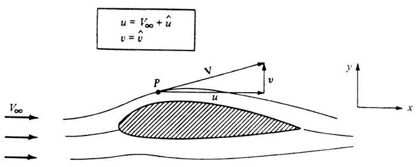
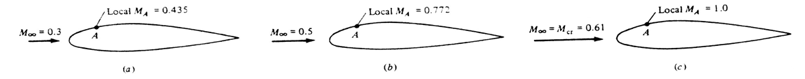
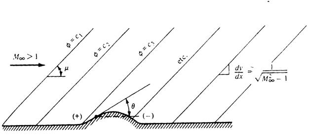

# 绕翼型可压缩流动

## 控制方程

二维、无黏、无旋、定常、绝热、等熵

连续性方程

$$
\frac{\partial(\rho u)}{\partial x}+\frac{\partial(\rho v)}{\partial y}=0
$$

动量方程(欧拉方程)

$$
\mathrm{d} p=-\rho V \mathrm{~d} V
$$

绝热等熵

$$
\mathrm{d} p=a^{2} \mathrm{~d} \rho
$$

存在速度势函数

$$
\mathbf{V}=\nabla \phi
$$

得速度势方程

$$
\left[1-\frac{1}{a^{2}}\left(\frac{\partial \phi}{\partial x}\right)^{2}\right] \frac{\partial^{2} \phi}{\partial x^{2}}+\left[1-\frac{1}{a^{2}}\left(\frac{\partial \phi}{\partial y}\right)^{2}\right] \frac{\partial^{2} \phi}{\partial y^{2}}-\frac{2}{a^{2}}\left(\frac{\partial \phi}{\partial x}\right)\left(\frac{\partial \phi}{\partial y}\right) \frac{\partial^{2} \phi}{\partial x \partial y}=0
$$

$$
a^{2}=a_{0}^{2}-\frac{\gamma-1}{2}\left[\left(\frac{\partial \phi}{\partial x}\right)^{2}+\left(\frac{\partial \phi}{\partial y}\right)^{2}\right]
$$

其它的流动参数

$$
M=\frac{V}{a}=\frac{\sqrt{u^{2}+v^{2}}}{a}
$$

$$
T=T_{0}\left(1+\frac{\gamma-1}{2} M^{2}\right)^{-1}
$$

$$
p=p_{0}\left(1+\frac{\gamma-1}{2} M^{2}\right)^{-\frac{\gamma}{\gamma-1}}
$$

$$
\rho=\rho_{0}\left(1+\frac{\gamma-1}{2} M^{2}\right)^{-\frac{1}{\gamma-1}}
$$

## 线化速度势方程

$$
u=V_{\infty}+\hat{u}
$$

$$
v=\hat{v}
$$

$\hat{u}, \hat{v}$  称为扰动速度

定义扰动速度势函数  $\hat{\phi}$

$$
\phi=V_{\infty} x+\hat{\phi}
$$

假设小扰动

$$
\frac{\hat{u}}{V_{\infty}} \ll 1, \quad \frac{\hat{\varepsilon}}{V_{\infty}} \ll 1
$$

小扰动速度方程为

$$
\left(1-M_{\infty}^{2}\right) \frac{\partial \hat{u}}{\partial x}+\frac{\partial \hat{v}}{\partial y}=0
$$

压力系数

$$
C_{p}=\frac{p-p_{\infty}}{q_{\infty}}=-\frac{2 \hat{u}}{V_{\infty}}
$$

小扰动方程边界条件

无穷远处

$$
\hat{u}=\hat{v}=0
$$

壁面边界条件

$$
\tan \theta=\frac{v}{u}=\frac{\hat{v}}{V_{\infty}+\hat{u}}
$$

$$
\frac{\partial \hat{\phi}}{\partial y}=V_{\infty} \tan \theta
$$

## 可压缩修正

在考虑可压缩性的情况下，对不可压缩的结果进行修正的方法

P-G法则可压缩修正，是基于小扰动线化速度势方程

$$
\left(1-M_{\infty}^{2}\right) \frac{\partial \hat{u}}{\partial x}+\frac{\partial \hat{v}}{\partial y}=0
$$

限制：

- 小攻角薄翼
- 亚声速
- 在来流马赫数大于0.7不适用

变换

$$
\beta^{2}=\left(1-M_{\infty}^{2}\right)
$$

$$
\xi=x ,\quad \eta=\beta y ,\quad \bar{\phi}(\xi, \eta)=\beta \hat{\phi}(x, y)
$$

$$
\frac{\partial^{2} \bar{\phi}}{\partial \xi^{2}}+\frac{\partial^{2} \bar{\phi}}{\partial \eta^{2}}=0
$$

## 临界马赫数

在翼面刚达到声速时对应的自由来流马赫数

## 线性化超音速流动控制方程

$$
\left(1-M_{\infty}^{2}\right) \frac{\partial^{2} \hat{\phi}}{\partial x^{2}}+\frac{\partial^{2} \hat{\phi}}{\partial y^{2}}=0
$$

令:

$$
\lambda=\sqrt{M_{\infty}^{2}-1}
$$

得到:

$$
\lambda^{2} \frac{\partial^{2} \hat{\phi}}{\partial x^{2}}-\frac{\partial^{2} \hat{\phi}}{\partial y^{2}}=0
$$

方程有基本解:

$$
\hat{\phi}=f(x-\lambda y)+g(x+\lambda y)
$$

在直线:

$$
x-\lambda y=\text { const } .
$$

斜率：

$$
\frac{d y}{d x}=\frac{1}{\lambda}=\frac{1}{\sqrt{M_{\infty}^{2}-1}}
$$

而对于马赫角:

$$
\tan \mu=\frac{1}{\sqrt{M_{\infty}^{2}-1}}
$$

因此使扰动势函数为常数的直线称为马赫线。

阻力系数

$$
C_{p}=\frac{2 \theta}{\sqrt{M_{\infty}^{2}-1}}
$$

线化超音速压力系数与当地表面与来流倾角成正比

## 线性化超音速流动理论的应用

压强系数与翼面斜率成线性关系，因此在线化理论范围内可把翼型分解示迎角为  $\alpha$  的平板绕流，中弧线弯度为  $f$  的弯板绕流，以及迎角、弯度均为零，厚度为  $t$  的对称翼型绕流。

**小攻角平板**

压力系数

$$
C_{p, u}=-\frac{2 \alpha}{\sqrt{M_{\infty}^{2}-1}}
$$

$$
C_{p, l}=\frac{2 \alpha}{\sqrt{M_{\infty}^{2}-1}}
$$

升力系数、阻力系数、气动力矩

$$
c_{l}=\frac{4 \alpha}{\sqrt{M_{\infty}^{2}-1}}
$$

$$
c_{d}=\frac{4 \alpha^{2}}{\sqrt{M_{\infty}^{2}-1}}
$$

$$
c_{m, L E}=-\frac{c_{l}}{2}=-\frac{2 \alpha}{\sqrt{M_{\infty}^{2}-1}}
$$

**弯度影响**

无升力

