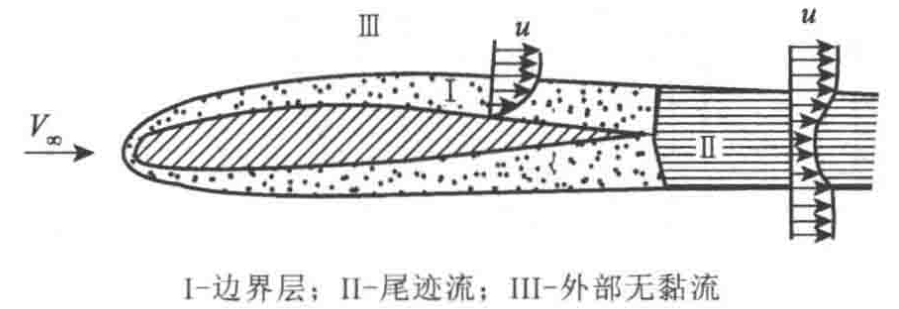
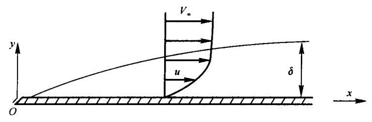
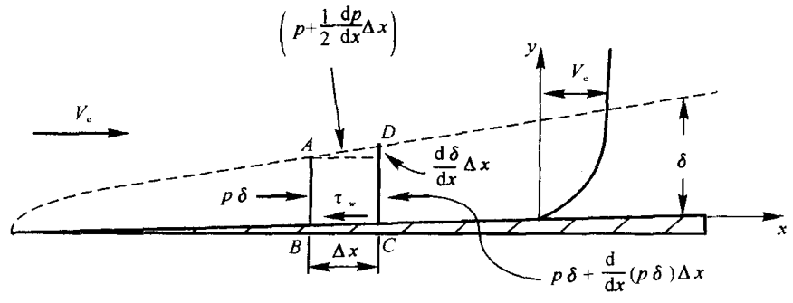
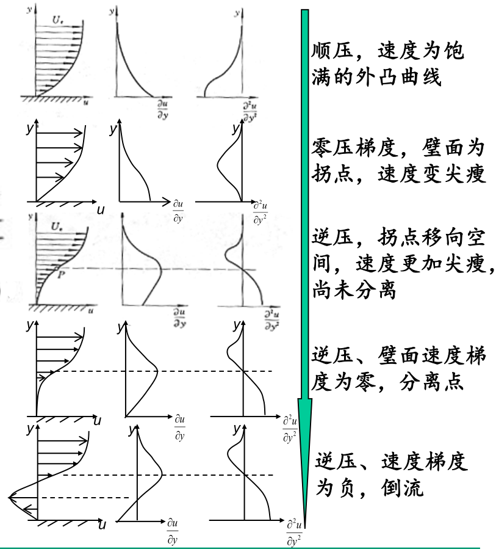

# 边界层理论

## 边界层

### 大雷诺数绕流流场

虽然整体流动的雷诺数很大，但在靠近物面的薄层流体内，流场的特征与理想流动相差甚远，**沿着法向存在很大的速度梯度，粘性力无法忽略**。这一物面近区粘性力起重要作用的薄层称为**边界层**。

- 边界层：N-S方程化简为边界层方程
- 尾迹区：N-S方程
- 势流区：理想流Euler方程

### 边界层厚度

**名义厚度**

在边界层外缘, 流向速度  $u$  是渐近地达到外流速度  $V_{e}$  的。通常沿壁面的法线向外推移, 将流向速度达到外流速度的某个百分数 （如  $u=0.99 V_{e}$  ) 的位置和壁面间的距离定义为边界层厚度, 并称为边界层的**名义厚度**。

$$
\frac{\delta}{l} \sim \frac{1}{\sqrt{Re}}
$$

- $\delta$  边界层名义厚度
- $l$  物体体沿物面流过的路程

**排挤厚度**

$$
\delta_{1}=\frac{1}{\rho_{e} V_{e}} \int_{0}^{h>\delta}\left(\rho_{e} V_{e}-\rho u\right) \mathrm{d} y=\int_{0}^{h>\delta}\left(1-\frac{\rho u}{\rho_{e} V_{e}}\right) \mathrm{d} y
$$

就是理想无黏流流线被外推的距离，用于边界层精确计算时修正物面。

**动量损失厚度**

$$
\delta_{2}=\frac{1}{\rho_{e} V_{e}^{2}} \int_{0}^{h>\delta} \rho u\left(V_{e}-u\right) \mathrm{d} y=\int_{0}^{h>\delta} \frac{\rho u}{\rho_{e} V_{e}}\left(1-\frac{u}{V_{e}}\right) \mathrm{d} y
$$

边界层内损失的动量相当于厚度为  $\delta_{2}$  的理想流体动量。

$$
\delta_{2} < \delta_{1} < \delta
$$

### 不可压缩层流边界层方程

对于二维不可压缩流动，连续方程和N-S方程为

$$
\frac{\partial u}{\partial x}+\frac{\partial v}{\partial y}=0
$$

$$
\frac{\partial u}{\partial t}+u \frac{\partial u}{\partial x}+v \frac{\partial u}{\partial y}=f_{x}-\frac{1}{\rho} \frac{\partial p}{\partial x}+\frac{\mu}{\rho}\left(\frac{\partial^{2} u}{\partial x^{2}}+\frac{\partial^{2} u}{\partial y^{2}}\right)
$$

$$
\frac{\partial v}{\partial t}+u \frac{\partial v}{\partial x}+v \frac{\partial v}{\partial y}=f_{y}-\frac{1}{\rho} \frac{\partial p}{\partial y}+\frac{\mu}{\rho}\left(\frac{\partial^{2} v}{\partial x^{2}}+\frac{\partial^{2} v}{\partial y^{2}}\right)
$$

## 沿平板的层流边界层

选取长度尺度  $L$ , 速度尺度  $u_{e}$ , 时间尺度  $t=L / u_{e}$ , 边界层近似假定在边界层内满足下列关系:

(1) 法向尺度远小于纵向尺度, 纵向导数远小于法向导数

$$
\frac{\delta}{L} \propto \frac{1}{\sqrt{\operatorname{Re}}}, \delta \ll L, \frac{\partial}{\partial x} \propto \frac{1}{L}, \frac{\partial}{\partial y} \propto \frac{1}{\delta}, \frac{\partial}{\partial x} \ll \frac{\partial}{\partial y}
$$

(2) 法向速度远远小于纵向速度

$$
u \propto \frac{L}{t}=u_{e}, v \ll u, v \propto \frac{\delta}{t} \propto \frac{\delta}{L / u_{e}}=\frac{\delta}{L} u_{e}, \frac{v}{u_{e}} \propto \frac{\delta}{L} \propto \frac{1}{\sqrt{\mathrm{Re}}}
$$

(3) 压强与外流速度的平方成正比

$$
p \propto \rho u_{e}^{2}
$$

Prandtl 边界层方程

$$
\frac{\partial u}{\partial x}+\frac{\partial v}{\partial y}=0
$$

$$
\frac{\partial u}{\partial t}+u \frac{\partial u}{\partial x}+v \frac{\partial u}{\partial y}=-\frac{1}{\rho} \frac{\partial p}{\partial x}+v \frac{\partial^{2} u}{\partial y^{2}}
$$

$$
\frac{\partial p}{\partial y}=0
$$

边界条件

$$
y=0 , u=0 , v=0
$$

$$
y=\infty , u=u_{e}
$$

对于曲率不大的弯曲物面，上述边界层方程也近似成立。

## 定常平板层流边界层

### Blasius 解

边界层外缘处流速均匀,  $V_{e}=V_{\infty}$ , 沿  $x$  轴方向在边界层外缘的压力梯度等于零, 即边界层中,  $\dfrac{\partial p}{\partial x}=0$  , 则  $p$  为常数。

$$
\frac{\partial u}{\partial x}+\frac{\partial v}{\partial y}=0
$$

$$
u \frac{\partial u}{\partial x}+v \frac{\partial u}{\partial y}=\nu \frac{\partial^{2} u}{\partial y^{2}}
$$

- 引入流函数  $\psi(x, y)$  以简化方程

$$
\frac{\partial \psi}{\partial y}=u \quad \frac{\partial \psi}{\partial x}=-v
$$

- 引用一个无量纲量  $\eta=\dfrac{y}{\sqrt{\frac{x \nu}{V_{\infty}}}}$

假设在距平板前缘不同位置处，边界层内速度分布是“相似”的

$$
\frac{u}{V_{\infty}}=\phi(\eta)
$$

则可定义无量纲函数  $f(\eta)$

$$
\psi=\int u \mathrm{~d} y=\sqrt{x \nu V_{\infty}} \int \phi(\eta) \mathrm{d} \eta \equiv \sqrt{x \nu V_{\infty}} f(\eta)
$$

有

$$
f f^{\prime \prime}+2 f^{\prime \prime \prime}=0
$$

边界条件为

当  $\eta=0$  时,  $f=f^{\prime}=0$

当  $\eta \rightarrow \infty$  时,  $f^{\prime}=1$

### 边界层的各种厚度

边界层厚度  $u / U_{\infty}=0.9916$ 时, $\eta=5.0$

$$
\delta=5 \sqrt{\frac{v x}{U_{\infty}}}=5 \frac{x}{\sqrt{\operatorname{Re}_{x}}}
$$

边界层位移厚度

$$
\delta_{1}=\int_{0}^{\delta}\left(1-\frac{u}{U_{\infty}}\right) d y=1.7208 \frac{x}{\sqrt{\operatorname{Re}_{x}}}
$$

边界层动量损失厚度

$$
\delta_{2}=\int_{0}^{\delta} \frac{u}{U_{\infty}}\left(1-\frac{u}{U_{\infty}}\right) d y=0.664 \frac{x}{\sqrt{\mathrm{Re}_{x}}}
$$

### 壁面摩擦阻力

壁面切应力

$$
\tau_{0}=\left.\mu \frac{\partial u}{\partial y}\right|_{y=0}=\left.\mu U_{\infty} f^{\prime \prime}(\eta)\right|_{\eta=0} \sqrt{\frac{U_{\infty}}{v x}}=0.332 \rho U_{\infty}^{2} \frac{1}{\sqrt{\operatorname{Re}_{x}}}
$$

壁面摩擦阻力系数

$$
C_{f}=\frac{\tau_{0}}{\frac{1}{2} \rho U_{\infty}^{2}}=0.664 \frac{1}{\sqrt{\operatorname{Re}_{x}}}
$$

平板的总摩擦阻力与阻力系数

$$
D_{F}=\int_{0}^{L} \tau_{0} d x=0.664 \rho U_{\infty}^{2} \sqrt{\frac{\nu L}{U}}
$$

$$
C_{F}=\frac{D_{F}}{\frac{1}{2} \rho U_{\infty}^{2} L}=\frac{1.328}{\sqrt{\operatorname{Re}_{L}}} \quad\left(100<\operatorname{Re}_{L}<5 \times 10^{5}\right)
$$

## 边界层动量积分方程式

考虑气流流过如图所示的二维曲面。取  $x$  轴沿物面,  $y$  轴与物面垂直。在边界层中取  $\mathrm{d} x$  的微段控制体  $A B C D$  (垂直纸面的宽度为无量纲单位 1),  $V_{\mathrm{e}}$  表示边界层外边缘处的  $x$  方向速度。

$$
\frac{\tau_{\mathrm{w}}}{\rho}=\frac{\mathrm{d}}{\mathrm{d} x}\left(V_{\mathrm{e}}^{2} \delta_{2}\right)+V_{\mathrm{e}} \frac{\mathrm{d} V_{\mathrm{e}}}{\mathrm{d} x} \delta_{1}
$$

记无量纲量  $C_{f}=\dfrac{\tau_{\mathrm{w}}}{\frac{1}{2} \rho V_{\mathrm{e}}^{2}}$  为当地摩擦系数,  $\mathrm{H}=\dfrac{\delta_{1}}{\delta_{2}}$  为形状因子

有

$$
\frac{C_{f}}{2}=\frac{\mathrm{d} \delta_{2}}{\mathrm{d} x}+\frac{\delta_{2}}{V_{\mathrm{e}}}(2+H) \frac{\mathrm{d} V_{\mathrm{e}}}{\mathrm{d} x}
$$

一阶常微分方程，既适用于层流也适用于湍流边界层。该方程给出了壁面剪切应力与位移厚度和动量厚度之间的关系。

利用动量积分关系式方法求解边界层流动的基本思想就是：根据边界层流动特性和在壁面与边界层外缘的边界条件，近似地给出一个只依赖于单参数（称为型参数）的速度型族来代替边界层内真实的速度分布，这样就可以通过动量积分关系式将上述三个未知量归结为一个未知量，然后确定速度分布规律的型参数，进而可以确定边界层中其他流动参数。

## 定常沿二维曲面层流边界层

对于曲面边界层问题, 其解要比平板边界层问题复杂得多。以二维曲面定常问题为例, 只要曲面的曲率半径  $R(x)$  足够大, 即  $\delta \ll R$, $\mathrm{~d} R / \mathrm{d} x \approx 1$ , 就可以建立一个  $x$  平行于当地壁面切线方向,  $y$  与当地壁面垂直的曲线坐标系  $(x, y)$

由于边界层外缘处的  $y$  方向速度和黏性的影响可略去不计,  有

$$
V_{\mathrm{e}} \frac{\mathrm{d} V_{\mathrm{e}}}{\mathrm{d} x}=-\frac{1}{\rho} \frac{\mathrm{d} p}{\mathrm{~d} x}
$$

绕二维曲面黏性流动的边界层方程为

$$
\frac{\partial u}{\partial x}+\frac{\partial v}{\partial y}=0
$$

$$
u \frac{\partial u}{\partial x}+v \frac{\partial v}{\partial y}=-\frac{1}{\rho} \frac{\partial p}{\partial x}+\nu \frac{\partial^{2} u}{\partial y^{2}}
$$

$$
\frac{\partial p}{\partial y}=0
$$

可用有限差分法求解

引进变量  $\eta$  和流函数  $\psi $

$$
\eta=y \sqrt{\frac{V_{\mathrm{e}}}{\nu x}}
$$

$$
\psi(x, y)=f(x, \eta) \sqrt{V_{\mathrm{e}} x \nu}
$$

有

$$
f^{\prime \prime \prime}+\frac{1+m}{2} f f^{\prime \prime}+m\left(1-f^{\prime 2}\right)=x\left(f^{\prime} \frac{\partial f^{\prime}}{\partial x}-f^{\prime \prime} \frac{\partial f}{\partial x}\right)
$$

式中,  $f$  右上角的撤表示对  $\eta$  求偏导数, 几撤表示求几阶偏导数;  $m$  为

$$
m(x)=\frac{x}{V_{\mathrm{e}}} \frac{\mathrm{d} V_{\mathrm{e}}}{\mathrm{d} x}
$$

边界条件为

$$
\left.\begin{aligned}
& f(x, 0)=f^{\prime}(x, 0)=0 \\
& f^{\prime}(x, \infty)=1
\end{aligned}\right\}
$$

## 边界层的分离

**分离点**定义为紧邻壁面顺流区与倒流区的分界点。分离点下游区域受逆压梯度的作用而发生倒流。在分离点附近和分离区， 边界层假设不再成立，边界层厚度大大增加。

边界层分离的必要条件是： 存在逆压梯度和粘性剪切层。

大迎角时上翼面最大速度点后的减速增压区将出现分离，一方面改变了绕流的形状使升力大为降低；另一方面造成了减速增压过程的机械能有损失，实验表明分离区的压强接近分离点的压强，从而造成了较大的压差阻力，同时还存在摩擦阻力。

### 在不同压力梯度区边界层的速度分布

根据边界层方程，在壁面上

$$
\frac{\partial^{2} u}{\partial y^{2}}=\frac{1}{\mu} \frac{\partial p}{\partial x}=-\frac{V_{e}}{\nu} \frac{\partial V_{e}}{\partial x}
$$

随着压力梯度的变号，边界层速度分布的曲率将改变符号。

粘性流体绕过曲线壁面时，速度将经历从加速达到最大然后减速的过程，对应的压强也会从顺压变化为逆压，从而边界层内速度分布的曲率也将随之改变。

### 分离点

物面处出现

$$
\left.\frac{\partial u}{\partial y}\right|_{y=0}=0,\left.\quad \frac{\partial^{2} u}{\partial y^{2}}\right|_{y=0}>0
$$

### 分离点下游区域

发生了回流，回流把主流推离壁面，**边界层假设失效**。

逆压梯度愈大，边界层分离愈靠前。边界层分离后，流动特征发生了变化。如：

- 从分离点不断脱离出旋涡，在分离点下游形成不稳定的旋涡区，从而使得主流区由原来无涡区变成有涡。
- 在分离点后出现低压区（或负压区），从而大大增加了绕流物体的阻力。

