<!-- #! https://zhuanlan.zhihu.com/p/675466143
# 自动控制原理总结 -->

## 绪论

- 系统：一些组合在一起的部件，作为一个有机的整体，实现特定的功能或完成特定的任务
- 控制系统：由一组元件相互连接构成一个系统，能够提供期望的响应
- 被控对象(或过程)：指被控制的设备、物体、或者一个运行的变化过程，如化学反应过程，飞机飞行过程，生物学过程等。过程的输入输出关系反映了过程的因果关系
- 被控变量(系统输出)：被控对象的输出，表征了对象或过程的状态和性能
- 控制变量(操作变量)：作用于被控对象，改变对象运行状态的量
- 参考输入(期望输入)：人们希望被控变量能达到的数值，又称给定输入、给定值、给定信号等。
- 反馈信号：从系统输出端取出并反向送回到系统输入端的信号称为反馈信号。当反馈信号的符号与被比较信号相反时称为负反馈，相同时称为正反馈。
- 反馈控制：将系统的输出量与参考输入进行比较，根据其误差进行控制，力图保持两者间预先设定好的关系。
- 偏差信号：期望输出值与实际输出值之间的偏差，往往简称偏差，有时也称为误差。
- 扰动信号：使系统的输出量偏离期望值的信号。扰动信号可能产生在系统内部，也可能来自系统外部。
- 控制器：作用是将系统输出与参考输入比较，根据得到的偏差，按预先设计好的控制规律给出控制量指令输出到执行机构。
- 执行机构：执行来自控制器的指令，并将控制作用施加于被控对象，以使被控变量按照预定的控制规律变化。
- 传感器(测量装置)：感知被控变量物理量的变化，并将其转换为控制(比较)器可以接受的反馈信号传送至控制(比较)器,也称反馈单元。
- 开环控制系统(Open-Loop Control System)：输出量不能对系统的控制作用产生影响的系统
- **闭环控制系统**(Close-Loop Control System)：又称**反馈控制系统** (Feedback Control System) 控制系统中将输出量反馈到输入端，对控制作用产生影响的系统就称为闭环控制系统。
- SISO：单输入单输出控制系统
- MIMO：多输入多输出控制系统
- 系统特性：指系统输入与输出之间的关系，可用数学式表示，也可用曲线或图表方式表示。系统特性分为静态特性与动态特性。
- 静态特性是系统稳定以后表现出来的输入输出关系，通常表现为静态的放大倍数;
- 动态特性指的是系统输入输出在从一个平稳状态过渡到另一个平稳状态的过程中所表现出来的特性，又称为过渡过程特性。

考虑动态过程在不同阶段中的特点，工程上通常从**稳定性、快速性、准确性**三个方面来衡量自动控制系统

## 拉普拉斯变换

### 傅里叶变换

$$
\displaystyle F(\omega)=\int_{-\infty}^{\infty} f(t) \mathrm{e}^{-\mathrm{j} \omega t} \mathrm{~d} t
$$

$$
\displaystyle f(t)=\dfrac{1}{2 \pi} \int_{-\infty}^{\infty} F(\omega) \mathrm{e}^{\mathrm{j} \omega t} \mathrm{~d} \omega
$$

记  $F(\omega)=\mathscr{F}[f(t)]$

### 单边拉普拉斯变换

$$
\displaystyle F(s)=\int_{0_{-}}^{\infty} f(t) \mathrm{e}^{-s t} \mathrm{~d} t
$$

$$
\displaystyle f(t)=\dfrac{1}{2 \pi \mathrm{j}} \int_{\sigma-\mathrm{j} \infty}^{\sigma+\mathrm{j} \infty} F(s) \mathrm{e}^{s t} \mathrm{~d} s \quad (s=\sigma+\mathrm{j} \omega)
$$

记  $F(s)=\mathscr{L}[f(t)]$

<!-- | 时间域函数 $f(t)$ | 拉普拉斯变换 $F(s)$ |
|-------------------|---------------------|
| $\delta(t)$（单位脉冲函数） | $1$ |
| $u(t)$（单位阶跃函数） | $\dfrac{1}{s}$ |
| $e^{-at}$（指数衰减函数） | $\dfrac{1}{s+a}$ |
| $\sin(bt)$ | $\dfrac{b}{s^2 + b^2}$ |
| $\cos(bt)$ | $\dfrac{s}{s^2 + b^2}$ |
| $t \cdot e^{-at}$ | $\dfrac{1}{(s+a)^2}$ |
| $t^n$ ($n$  为正整数) | $\dfrac{n!}{s^{n+1}}$ | -->

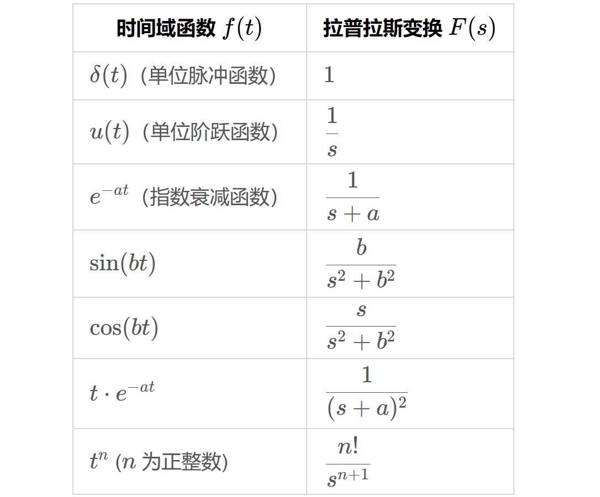

<!-- 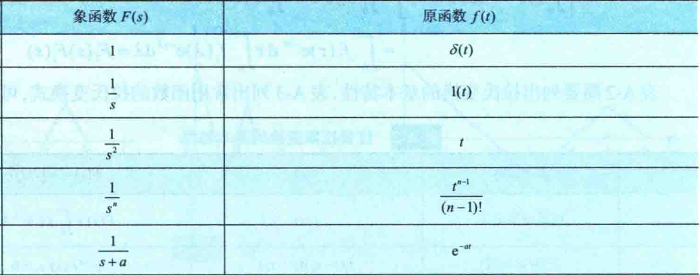
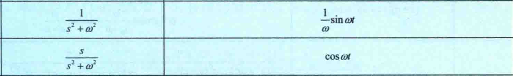 -->

**线性性质**

$$
\mathscr{L}\left[a f_{1}(t)+b f_{2}(t)\right]=a \mathscr{L}\left[f_{1}(t)\right]+b \mathscr{L}\left[f_{2}(t)\right]=a F_{1}(s)+b F_{2}(s)
$$

**微分定理**

$$
\mathscr{L}\left[\dfrac{\mathrm{d} f(t)}{\mathrm{d} t}\right]=s F(s)-f(0)
$$

$$
\mathscr{L}\left[\dfrac{\mathrm{d}^{n} f(t)}{\mathrm{d} t^{n}}\right]=s^{n} F(s)-\left[s^{n-1} f(0)+s^{n-2} \dot{f}(0)+\cdots+f^{(n-1)}(0)\right]
$$

- $f(0), \dot{f}(0), \ddot{f}(0), \cdots, f^{(n-1)}(0)$  为  $f(t)$  及其各阶导数在  t=0  时的值

**积分定理**

$$
\displaystyle\mathscr{L}\left[\int f(t) \mathrm{d} t\right]=\dfrac{1}{s} F(s)+\dfrac{1}{s} f^{(-1)}(0)
$$

$$
\displaystyle\mathscr{L}\left[\underbrace{\int \cdots \int}_{n} f(t)(\mathrm{d} t)^{n}\right]=\dfrac{1}{s^{n}} F(s)+\dfrac{1}{s^{n}} f^{(-1)}(0)+\cdots+\dfrac{1}{s} f^{(-n)}(0)
$$

- $f^{(-1)}(0), f^{(-2)}(0), \cdots, f^{(-n)}(0)$  为  $f(t)$  的各重积分在  $t=0$  时的值

**初值定理**

$$
\displaystyle \lim_{t \rightarrow 0_{+}} f(t)=\lim _{s \rightarrow \infty} s F(s)
$$

**终值定理**

$$
\displaystyle \lim_{t \rightarrow \infty} f(t)=\lim _{s \rightarrow 0} s F(s)
$$

**位移定理**

$$
\mathscr{L}\left[f\left(t-\tau_{0}\right) u\left(t-\tau_{0}\right)\right]=\mathrm{e}^{-\tau_{0} s} F(s) , \quad \tau_{0} \ge 0
$$

$$
\mathscr{L}\left[\mathrm{e}^{\alpha t} f(t)\right]=F(s-\alpha)
$$

**相似定理**

$$
\displaystyle \mathscr{L}\left[f\left(\dfrac{t}{a}\right)\right]=a F(a s)
$$

- $a$  为实常数

**卷积定理**

设  $F_{1}(s)=\mathscr{L}\left[f_{1}(t)\right]$，$F_{2}(s)=\mathscr{L}\left[f_{2}(t)\right]$，则有

$$
\displaystyle F_{1}(s) F_{2}(s)=\mathscr{L}\left[\int_{0}^{t} f_{1}(t-\tau) f_{2}(\tau) \mathrm{d} \tau\right]
$$

式中，$\displaystyle\int_{0}^{t} f_{1}(t-\tau) f_{2}(\tau) \mathrm{d} \tau$  叫做  $f_{1}(t)$  和  $f_{2}(t)$  的卷积，可写为  $f_{1}(t) * f_{2}(t)$

### 有理代数分式

$$
F(s)=\dfrac{B(s)}{A(s)}=\dfrac{b_{0} s^{m}+b_{1} s^{m-1}+\cdots+b_{m-1} s+b_{m}}{s^{n}+a_{1} s^{n-1}+\cdots+a_{n-1} s+a_{n}}
$$

式中，系数  $a_{1}, a_{2}, \cdots, a_{n}$，$b_{0}, b_{1}, \cdots, b_{m}$  都是实常数。$m$、$n$ 是正整数，通常  $m<n$。为了将  $F(s)$  写为部分分式形式，首先把  $F(s)$  的分母因式分解

$$
F(s)=\dfrac{B(s)}{A(s)}=\dfrac{b_{0} s^{m}+b_{1} s^{m-1}+\cdots+b_{m-1} s+b_{m}}{\left(s-s_{1}\right)\left(s-s_{2}\right) \cdots\left(s-s_{n}\right)}
$$

式中，$s_{1}, s_{2}, \cdots, s_{n}$  是  $A(s)=0$  的根，称为  $F(s)$  的**极点**。按照这些根的性质，分以下两种情况研究。

**无重根**

$A(s)=0$  无重根

这时，  $F(s)$  可展开为  $n$  个简单的部分分式之和，每个部分分式都以  $A(s)$  的一个因式作为其分母

$$
\displaystyle F(s)=\dfrac{c_{1}}{s-s_{1}}+\dfrac{c_{2}}{s-s_{2}}+\cdots+\dfrac{c_{i}}{s-s_{i}}+\cdots+\dfrac{c_{n}}{s-s_{n}}=\sum_{i=1}^{n} \dfrac{c_{i}}{s-s_{i}}
$$

式中， $c_{i}$  为待定常数，称为  $F(s)$  在极点  $s_{i}$  处的**留数**，可按下式计算:

$$
c_{i}=\lim _{s \rightarrow s_{i}}\left[\left(s-s_{i}\right) F(s)\right]
$$

或

$$
c_{i}=\left.\dfrac{B(s)}{\dot{A}(s)}\right|_{s=s_{i}}
$$

式中， $\dot{A}(s)$  为  $A(s)$  对  $s$  求一阶导数。

**有重根**

$A(s)=0$  有重根

设  $A(s)=0$  有  $r$  个重根  $s_{1}$，则  $F(s)$  可写为

$$
\begin{aligned}
F(s) & =\dfrac{B(s)}{\left(s-s_{1}\right)^{r}\left(s-s_{r+1}\right) \cdots\left(s-s_{n}\right)} \\
& =\dfrac{c_{r}}{\left(s-s_{1}\right)^{r}}+\dfrac{c_{r-1}}{\left(s-s_{1}\right)^{r-1}}+\cdots+\dfrac{c_{1}}{s-s_{1}}+\dfrac{c_{r+1}}{s-s_{r+1}}+\cdots+\dfrac{c_{n}}{s-s_{n}}
\end{aligned}
$$

式中,  $s_{1}$  为  $F(s)$  的重极点， $s_{r+1}, \cdots, s_{n}$  为  $F(s)$  的  $n-r$  个非重极点， $c_{r}, c_{r-1}, \cdots, c_{1}, c_{r+1}, \cdots ,  c_{n}$  为待定常数。其中,  $c_{r+1}, \cdots, c_{n}$  按无重根计算，但  $c_{r}, c_{r-1}, \cdots, c_{1}$  应按下式计算:

$$
\begin{aligned}
c_{r} & =\lim _{s \rightarrow s_{1}}\left(s-s_{1}\right)^{r} F(s) \\
c_{r-1} & =\lim _{s \rightarrow s_{1}} \dfrac{\mathrm{d}}{\mathrm{d} s}\left[\left(s-s_{1}\right)^{r} F(s)\right] \\
& \vdots \\
c_{r-j} & =\dfrac{1}{j !} \lim _{s \rightarrow s_{1}} \dfrac{\mathrm{d}^{(j)}}{\mathrm{d} s^{j}}\left[\left(s-s_{1}\right)^{r} F(s)\right] \\
& \vdots \\
c_{1} & =\dfrac{1}{(r-1) !} \lim _{s \rightarrow s_{1}} \dfrac{\mathrm{d}^{(r-1)}}{\mathrm{d} s^{r-1}}\left[\left(s-s_{1}\right)^{r} F(s)\right]
\end{aligned}
$$

## 控制系统的数学模型

### 控制系统作用的本质

- 被控对象具有其自身的系统特性
- 加入控制系统(环节)后形成的系统(闭环反馈控制系统)的系统特性发生变化，变化内容取决于加入的控制系统（环节）
- 根据被控对象(开环系统)原有的系统特性和闭环反馈控制系统所需要达到的系统特性，设计出满足要求的控制系统（环节）

### 控制系统的时域数学模型

一般情况下，应将微分方程写为标准形式，即与输入量有关的项写在方程的右端，与输出量有关的项写在方程的左端，方程两端变量的导数项均按降幂次序排列。

用线性微分方程描述的元件或系统，称为线性元件或线性系统。

### 控制系统的复数域数学模型

用拉氏变换法求解线性控制系统微分方程，可以得到控制系统在复频域中的数学模型——传递函数模型。

线性定常系统的**传递函数**，定义为零初始条件下，系统输出量的拉氏变换与输入量的拉氏变换之比。

$$
G(s)=\dfrac{C(s)}{R(s)}
$$

- 传递函数是复变量  $s$  的有理真分式函数，具有复变函数的所有性质, 且所有系数均为实数
- 传递函数是一种用系统参数表示输出量与输入量之间关系的表达式，它只取决于系统或元件的结构和参数，而与输入量的形式无关，也不反映系统内部的任何信息
- 传递函数  $G(s)$  的拉氏反变换是单位脉冲响应  $g(t)$
- 传递函数是在零初始条件下定义的。控制系统的零初始条件有两方面的含义：一是指输入量是在  $t \geqslant 0$  时才作用于系统，因此，在  $t=0^{-}$  时，输入量及其各阶导数均为零；二是指输入量加于系统之前，系统处于稳定的工作状态，即输出量及其各阶导数在  $t=0^{-}$  时的值也为零。传递函数可表征控制系统的动态性能，并用以求出在给定输入量时系统的零初始条件响应，即由拉氏变换的卷积定理，有

$$
\displaystyle c(t)=\mathscr{L}^{-1}[G(s) R(s)]=\int_{0}^{t} r(\tau) g(t-\tau) \mathrm{d} \tau=\int_{0}^{t} r(t-\tau) g(\tau) \mathrm{d} \tau
$$

传递函数的分子多项式和分母多项式经因式分解后可写为如下形式

$$
G(s)=\dfrac{b_{0}\left(s-z_{1}\right)\left(s-z_{2}\right) \cdots\left(s-z_{m}\right)}{a_{0}\left(s-p_{1}\right)\left(s-p_{2}\right) \cdots\left(s-p_{n}\right)}=K^{*} \dfrac{\prod\limits_{i=1}^{m}\left(s-z_{i}\right)}{\prod\limits_{j=1}^{n}\left(s-p_{j}\right)}
$$

- $z_{i}(i=1,2, \cdots, m)$  称为传递函数的**零点**
- $p_{j}(j=1,2, \cdots, n)$  称为传递函数的**极点**
- 系数  $K^{*}=b_{0} / a_{0}$  称为传递系数或**根轨迹增益**

在复数平面上表示传递函数的零点和极点的图形，称为传递函数的零极点分布图。在图中一般用 “$\circ$” 表示零点, 用 “$\times$” 表示极点。

传递函数的极点就是微分方程的特征根，因此它们决定了所描述系统自由运动的模态。传递函数的极点可以受输入函数的激发，在输出响应中形成自由运动的模态。传递函数的零点并不形成自由运动的模态，但它们却影响各模态在响应中所占的比重，因而也影响响应曲线的形状。

**无源网络**

为了改善控制系统的性能，常在系统中引入无源网络作为校正元件。无源网络通常由电阻、电容和电感组成。

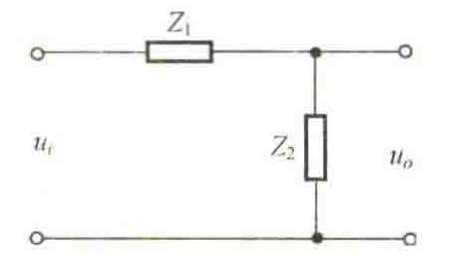

用复数阻抗表示电阻时仍为  $R$ , 电容  $C$  的复数阻抗为  $1 /(C s)$ , 电感  $L$  的复数阻抗 为  $L s$  。由图可直接写出电路的传递函数

$$
\dfrac{U_{o}(s)}{U_{i}(s)}=\dfrac{Z_{2}}{Z_{1}+Z_{2}}
$$

应该注意，求取无源网络传递函数时，一般假设网络输出端接有无穷大负载阻抗，输入内阻为零，否则应考虑负载效应。

### 典型的闭环控制系统

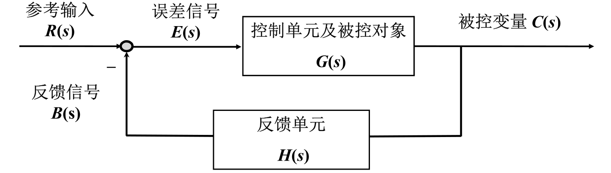

整个系统的传递函数（闭环系统传递函数）

$$
G_{c}(s)=\dfrac{C(s)}{R(s)}=\dfrac{G(s)}{1+G(s) H(s)}
$$

开环传递函数

$$
G_{o}(s)=\dfrac{B(s)}{E(s)}=G(s) H(s)
$$

前向通路传递函数

$$
G_{f}(s)=\dfrac{C(s)}{E(s)}=G(s)
$$

## 线性系统的时域分析法

### 系统时间响应的性能指标

典型输入信号

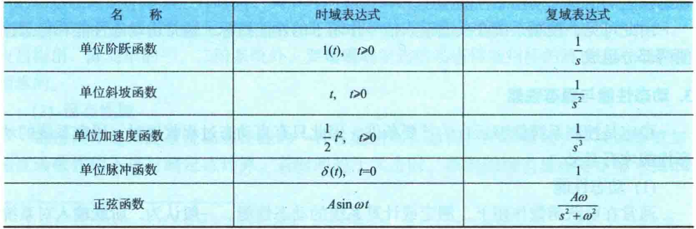

在典型输入信号作用下，任何一个控制系统的时间响应都由**动态过程**和**稳态过程**两部分组成。

通常在阶跃函数作用下，测定或计算系统的动态性能。

描述稳定的系统在单位阶跃函数作用下，动态过程随时间变化状况的指标，称为**动态性能指标**。为了便于分析和比较，假定系统在单位阶跃输入信号作用前处于静止状态，而且输出量及其各阶导数均等于零。

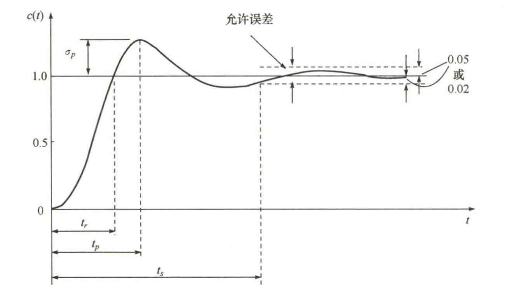

- **上升时间**  $t_{r}$  指响应从终值  $10 \%$  上升到终值  $90 \%$  所需的时间；对于有振荡的系统，亦可定义为响应从零第一次上升到终值所需的时间。上升时间是系统响应速度的一种度量。上升时间越短, 响应速度越快。
- **峰值时间**  $t_{p}$  指响应超过其终值到达第一个峰值所需的时间。
- **调节时间**  $t_{s}$  指响应到达并保持在终值  $\pm 5 \%$  内所需的最短时间。
- **超调量**  $\sigma \%$  指响应的最大偏离量  $c\left(t_{p}\right)$  与终值  $c(\infty)$  的差与终值  $c(\infty)$  比的百分数, 即

$$
\sigma \%=\dfrac{c\left(t_{p}\right)-c(\infty)}{c(\infty)} \times 100 \%
$$

若  $c\left(t_{p}\right)<c(\infty)$ , 则响应无超调。超调量亦称为最大超调量, 或百分比超调量。

**稳态误差**是描述系统稳态性能的一种性能指标，通常在阶跃函数、斜坡函数或加速度函数作用下进行测定或计算。若时间趋于无穷时，系统的输出量不等于输入量或输入量的确定函数，则系统存在稳态误差。稳态误差是系统控制精度或抗扰动能力的一种度量。

### 一阶系统的时域分析

$$
\Phi(s)=\dfrac{C(s)}{R(s)}=\dfrac{1}{T s+1}
$$

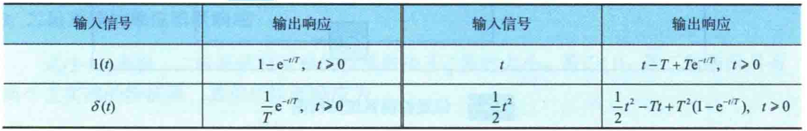

### 二阶系统的时域分析

$$
\Phi(s)=\dfrac{C(s)}{R(s)}=\dfrac{\omega_{n}^{2}}{s^{2}+2 \zeta \omega_{n} s+\omega_{n}^{2}}
$$

- $\omega_{n}>0$ 自然频率
- $\zeta$ 阻尼比
- $\sigma=-\zeta \omega_{n}$ 衰减系数
- $\omega_{d}=\omega_{n} \sqrt{1-\zeta^{2}}$ 阻尼震荡频率

极点

$$
s_{1,2}=\sigma \pm \omega_{d}
$$

**单位阶跃响应**

- $\zeta<0$ 不稳定的
- $\zeta=0$ 无阻尼情况
- $0<\zeta<1$ 欠阻尼情况
- $\zeta=1$ 临界阻尼情况
- $\zeta>1$ 过阻尼情况

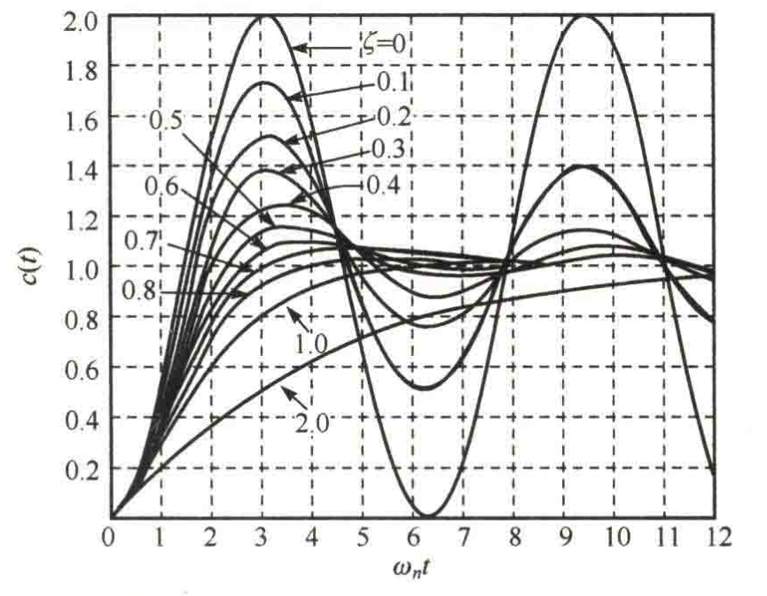

考虑 $0 \le \zeta<1$，当  $R(s)=1 / s$  时

$$
C(s)=\dfrac{1}{s}-\dfrac{s+\zeta \omega_{n}}{\left(s+\zeta \omega_{n}\right)^{2}+\omega_{d}^{2}}-\dfrac{\zeta \omega_{n}}{\left(s+\zeta \omega_{n}\right)^{2}+\omega_{d}^{2}}
$$

$$
\begin{aligned}
c(t) & =1-\mathrm{e}^{-\zeta \omega_{n} t}\left[\cos \omega_{d} t+\dfrac{\zeta}{\sqrt{1-\zeta^{2}}} \sin \omega_{d} t\right] \\
& =1-\dfrac{1}{\sqrt{1-\zeta^{2}}} \mathrm{e}^{-\zeta \omega_{n} t} \sin \left(\omega_{d} t+\beta\right), \quad t \geqslant 0
\end{aligned}
$$

$\beta=\arctan \left(\sqrt{1-\zeta^{2}} / \zeta\right)$，或者  $\beta=\arccos \zeta$，称为**阻尼角**。

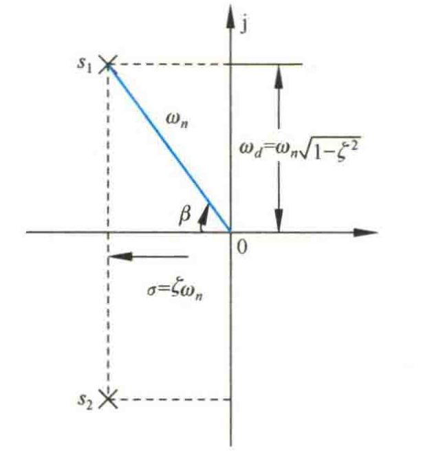

上升时间

$$
t_{r}=\dfrac{\pi-\beta}{\omega_{d}}
$$

峰值时间

$$
t_{p}=\dfrac{\pi}{\omega_{d}}
$$

超调量

$$
\sigma \%=\mathrm{e}^{-\pi \zeta / \sqrt{1-\zeta^{2}}} \times 100 \%
$$

选取误差带  $\Delta=0.05$

$$
t_{s}=\dfrac{3.5}{\zeta \omega_{n}}
$$

选取误差带  $\Delta=0.02$

$$
t_{s}=\dfrac{4.4}{\zeta \omega_{n}}
$$

衰减比  $n$ ：同方向过渡过程曲线上的相邻两个波峰之比

$$
n=e^{2 \pi \zeta / \sqrt{1-\zeta^{2}}}
$$

### 高阶系统的时域分析

高阶系统动态响应各分量的衰减快慢由系统极点的位置决定，极点在 $s$ 平面左半部离虚轴越远，相应的分量衰减越快，对系统的影响越小。

各分量所对应的系数取决于系数的零、极点分布。

- 当某极点靠近零点而远离其他极点和原点，则相应的系数越小，该动态分量的影响就越小。
- 若一对零极点互相很接近，则在输出中与该极点对应的分量就几乎被抵消。
- 若某极点远离零点，越接近其他极点与原点，该动态分量的影响也就越大。

系统的零、极点共同决定了系统动态响应曲线的形状。**对于系数很小（影响很小）的分量、远离虚轴衰减很快的分量常常可以忽略**，此时高阶系统就可用低阶系统来近似估计。

若高阶系统中距离虚轴最近的极点，其实数部分为其他极点的 1/5 或更小，并且附近又没有零点，则可认为系统的响应主要由该极点（或共轭复数极点）决定，因为这一分量衰减最慢。这种对系统暂态响应起主要作用的极点称为系统的**主导极点**。

一般情况下，高阶系统具有振荡性，故主导极点通常是共轭复数极点。所以，高阶系统常当作二阶系统来分析，相应的性能指标都可按二阶系统近似估计。

- 在不能应用主导极点概念分析系统时，则不能忽略距离较近的零、极点的影响。
- **一个不能忽略的零点对系统的影响是使超调量加大，响应速度加快**，这是由于零点具有微分的作用；
- **一个不能忽略的极点对系统的影响是使超调量减小，调节时间增加**，这是由于极点的滤波作用（或称阻尼作用）。

### 线性系统的稳定性分析-劳斯稳定判据

线性系统稳定的充分必要条件是：**系统传递函数的极点均位于  $s$  左半平面**

**劳斯稳定判据**

求极点，即求系统特征多项式的零点。设线性系统的特征方程为

$$
D(s)=a_{0} s^{n}+a_{1} s^{n-1}+\cdots+a_{n-1} s+a_{n}=0, \quad a_{0}>0
$$

劳斯表

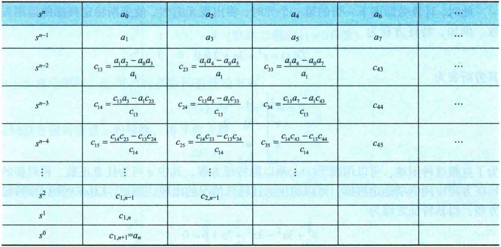

线性系统稳定的充分且必要条件是：劳斯表中第一列各值为正。如果劳斯表第一列中出现小于零的数值，系统就不稳定，且第一列各系数符号的改变次数，代表特征方程的正实部根的数目。

劳斯阵列的任意一行元素可以同时乘以或除以一个正数，而不会改变首列元素的符号。

特殊情况：

(1) 劳斯表中第一列有零元素

- 将 $s=1/x$ 代入原方程
- 将原特征多项式乘以因式 $(s+1)$

(2) 劳斯阵列有全零行

如果劳斯阵列具有全零行，则系统特征方程具有对称于原点的实根或复根

$$
s^{2}, \quad(s+\sigma)(s-\sigma), \quad(s+j \omega)(s-j \omega), \quad\left(s^{2}+2 \zeta \omega_{n} s+\omega_{n}^{2}\right)\left(s^{2}-2 \zeta \omega_{n} s+\omega_{n}^{2}\right)
$$

如果劳斯阵列的第  $i$  行元素全为零，则根据该行的上一非零行构造如下的辅助多项式

$$
U(s)=\beta_{1} s^{i+1}+\beta_{2} s^{i-1}+\beta_{3} s^{i-3}+\cdots
$$

其中， $\beta_{i}$  是上一非零行的系数，辅助多项式的阶次为对称特征根的个数。然后，将原劳斯阵列表中第  $i$  行元素替换为辅助多项式  $U(s)$  关于  $s$  的导函数的系数，并继续完成劳斯阵列表，以获得关于除对称特征根外的其它特征根的信息。

**稳定裕量的检验**

令  $s=z-\sigma_{1}$ ，即把虚轴左移  $\sigma_{1}$ 。将上式代入系统的特征方程式，得到以  $z$  为变量的新特征方程式，然后再检验新特征方程式有几个根位于新虚轴(垂直线  $s=-\sigma_{1}$ )的右边。如果所有根均在新虚轴的左边 (新劳斯阵列式首列均为正数)，则称系统具有稳定裕量  $\sigma_{1}$ 。

### 线性系统的稳态误差计算

只有当系统稳定时，研究稳态误差才有意义。

**误差与稳态误差**

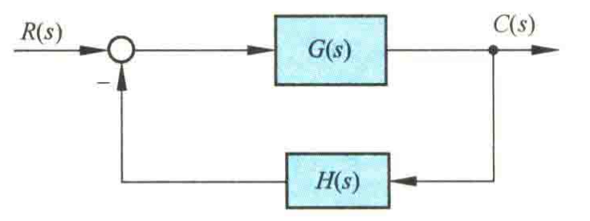

$$
E(s)=R(s)-H(s) C(s)
$$

此时，系统在  $E(s)$  信号作用下产生动作，使输出量趋于希望值。通常，称  $E(s)$  为误差信号。

误差本身是时间的函数，其时域表达式为

$$
e(t)=\mathscr{L}^{-1}[E(s)]=\mathscr{L}^{-1}\left[\Phi_{e}(s) R(s)\right]
$$

式中，$\Phi_{e}(s)$  为系统误差传递函数

$$
\Phi_{e}(s)=\dfrac{E(s)}{R(s)}=\dfrac{1}{1+G(s) H(s)}
$$

误差信号  $e(t)$  中，包含瞬态分量  $e_{t s}(t)$  和稳态分量  $e_{s s}(t)$  两部分。由于系统必须稳定，故当时间趋于无穷时, 必有  $e_{t s}(t)$  趋于零。因此，**控制系统的稳态误差定义为误差信号  $e(t)$ 的稳态分量  $e_{s s}(\infty)$，常以  $e_{s s}$  简单标志**。

如果有理函数  $s E(s)$  除在原点处有唯一的极点外，在  $s$  右半平面及虚轴上解析，即  $s E(s)$  的极点均位于  $s$  左半平面(包括坐标原点)，则可根据拉氏变换的终值定理，方便地求出系统的稳态误差

$$
e_{s s}(\infty)=\lim _{s \rightarrow 0} s E(s)=\lim _{s \rightarrow 0} \dfrac{s R(s)}{1+G(s) H(s)}
$$

**系统类型**

在一般情况下，分子阶次为  $m$ ，分母阶次为  $n$  的开环传递函数可表示为

$$
G(s) H(s)=\dfrac{K \prod\limits_{i=1}^{m}\left(\tau_{i} s+1\right)}{s^{v} \prod\limits_{j=1}^{n-v}\left(T_{j} s+1\right)}
$$

- $K$  为开环增益
- $\tau_{i}$  和  $T_{j}$  为时间常数
- $v$  为开环系统在  $s$  平面坐标原点上的极点的重数。现在的分类方法是以  $v$  的数值来划分的：$v=0$，称为 0 型系统；$v=1$，称为 I 型系统；$v=2$，称为 II 型系统 ...

**不同输入下的稳态误差**

$$
\begin{aligned}
e_{s s}(\infty)&=\lim _{s \rightarrow 0} \dfrac{s R(s)}{1+\dfrac{K \prod\limits_{i=1}^{m}\left(\tau_{i} s+1\right)}{s^{v} \prod\limits_{j=1}^{n-v}\left(T_{j} s+1\right)}} \\
&=\lim _{s \rightarrow 0}\dfrac{s^{v+1} R(s)}{K+s^{v}}
\end{aligned}
$$

- 位置误差系数  $\displaystyle K_{p}=\lim_{s \rightarrow 0} G(s) H(s)$
- 速度误差系数  $\displaystyle K_{v}=\lim_{s \rightarrow 0} s G(s) H(s)$
- 加速度误差系数  $\displaystyle K_{a}=\lim_{s \rightarrow 0} s^{2} G(s) H(s)$

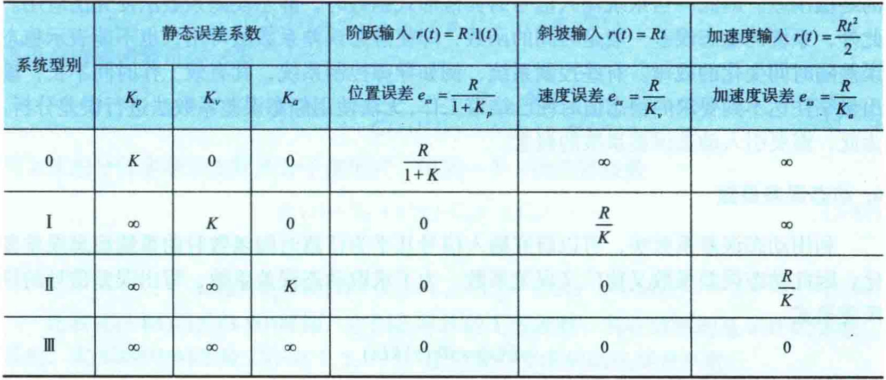

## 线性系统的根轨迹法

两个问题：

1. 如何通过闭环系统特征根的分布来全面了解闭环系统的动态特性；
2. 如何通对闭环系统的动态特性要求来决定闭环特征根的合理分布，进而确定控制器的结构和参数

### 基本概念

根轨迹简称根迹，它是开环系统某一参数从零变到无穷时，闭环系统特征方程式的根在  $s$  平面上变化的轨迹。

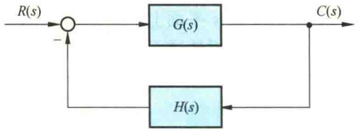

闭环传递函数

$$
\Phi(s)=\dfrac{G(s)}{1+G(s) H(s)}
$$

设开环传递函数

$$
G(s) H(s)=K^{*} \dfrac{\prod_{j=1}^{m}\left(s-z_{j}\right)}{\prod_{j=1}^{n}\left(s-p_{j}\right)}
$$

$K^{*}$  称为**开环系统根轨迹增益**

根轨迹法的基本任务在于：由已知的开环零、极点的分布及根轨迹增益，通过图解的方法找出闭环极点。

**根轨迹方程**

$$
K^{*} \dfrac{\prod_{j=1}^{m}\left(s-z_{j}\right)}{\prod_{i=1}^{n}\left(s-p_{i}\right)}=-1
$$

- $z_{j}$  为已知的开环零点
- $p_{i}$  为已知的开环极点
- $K^{*}$  从零变到无穷
- 其中处于变动地位的实参数，不限定是根轨迹增益，也可以是系统其他变化参数
- 注意只有  $n>m$  是物理上可实现的

相角条件

$$
\displaystyle \sum_{j=1}^{m} \angle\left(s-z_{j}\right)-\sum_{i=1}^{n} \angle\left(s-p_{i}\right)=(2 k+1) \pi , \quad k=0, \pm 1, \pm 2, \cdots
$$

模值条件

$$
K^{*}=\dfrac{\prod_{i=1}^{n}\left|s-p_{i}\right|}{\prod_{j=1}^{m}\left|s-z_{j}\right|}
$$

### 根轨迹绘制的基本法则

假定所研究的变化参数是根轨迹增益  $K^*$

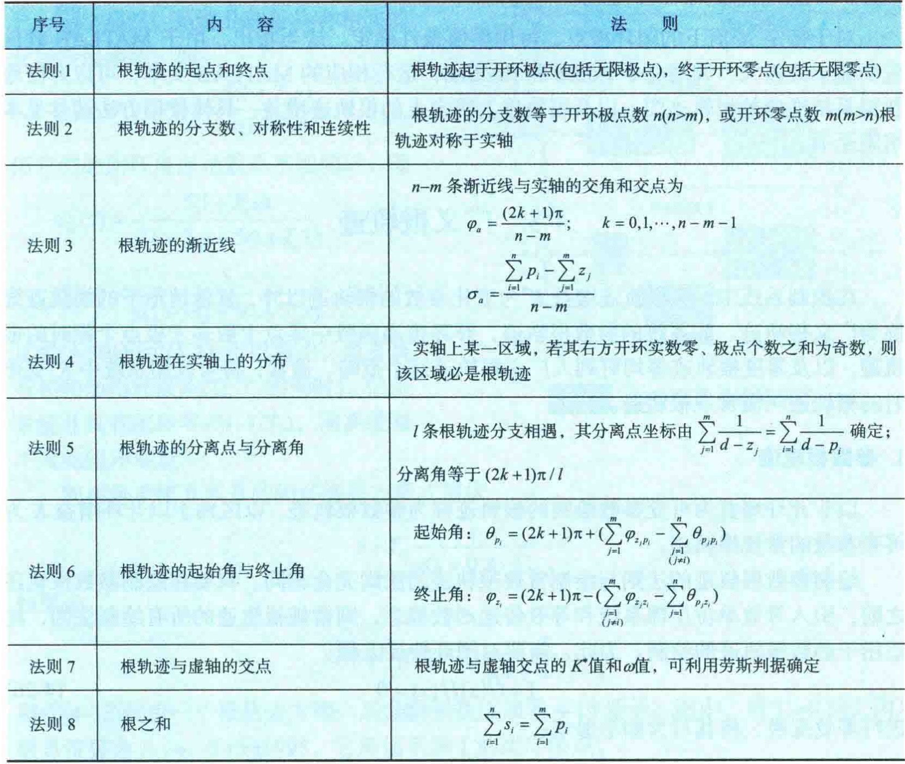

分离点的另一求法：

$$
-K=\dfrac{\prod_{i=1}^{n}\left(s-p_{i}\right)}{\prod_{j=1}^{m}\left(s-z_{j}\right)} ,\quad \left.\dfrac{\mathrm{d} (-K)}{\mathrm{d} s}\right|_{s=d}=0
$$

复数极点（或零点）的起始角（终止角）也称为出射角（入射角）

$$
\displaystyle \theta_{p_{k}}=\pi+\sum_{j=1}^{m} \angle\left(p_{k}-z_{j}\right)-\sum_{\substack{i=1 \\ i \neq k}}^{n} \angle\left(p_{k}-p_{i}\right)
$$

$$
\displaystyle \varphi_{z_{k}}=\pi+\sum_{i=1}^{n} \angle\left(z_{k}-p_{i}\right)-\sum_{\substack{j=1 \\ j \neq k}}^{m} \angle\left(z_{k}-z_{j}\right)
$$

### 广义根轨迹

在控制系统中，除根轨迹增益  $K^{*}$  为变化参数的根轨迹以外，其他情形下的根轨迹统称为广义根轨迹。通常，将负反馈系统中  $K^{*}$  变化时的根轨迹叫做常规根轨迹。

以非开环增益为可变参数绘制的根轨迹称为**参数根轨迹**

对闭环特征方程

$$
1+G(s) H(s)=0
$$

进行等效变换，将其写为如下形式:

$$
A \dfrac{P(s)}{Q(s)}=-1
$$

其中，$A$  为除  $K^{*}$  外，系统任意的变化参数；而  $P(s)$  和  $Q(s)$  为两个与  $A$  无关的首一多项式

可得等效反馈系统，其等效开环传递函数为

$$
G_{1}(s) H_{1}(s)=A \dfrac{P(s)}{Q(s)}
$$

利用上式画出的根轨迹，就是参数  $A$  变化时的参数根轨迹。

“等效” 的含义仅在闭环极点相同这一点上成立，而闭环零点一般是不同的。由闭环零、极点分布来分析和估算系统性能时，可以采用参数根轨迹上的闭环极点，但必须采用原来闭环系统的零点。

### 系统性能分析

稳定性：根轨迹不会进入  $s$  右半平面。根轨迹与虚轴交点处可求临界开环增益。

考虑一个二阶系统的特征根

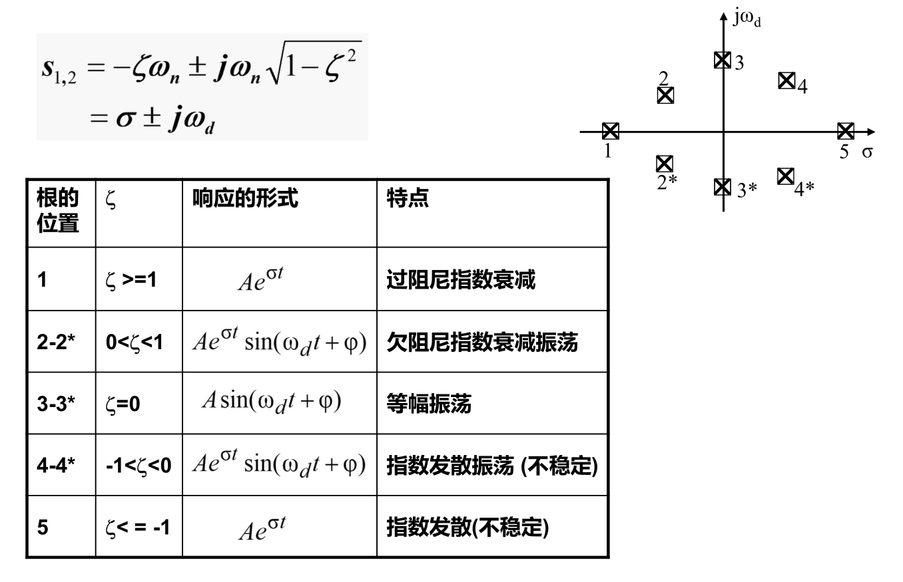

$s$  平面的特点如下：

- 水平线表示阻尼振荡频率  $\omega_{d}$。水平线越接近实轴,  $\omega_{d}$  越小。当根位于实轴上时  $\left(\omega_{d}=0\right)$ ，过渡过程无振荡
- 垂直线表示瞬态过程衰减速率，垂直线(或特征根)越接近于虚轴，瞬态过程越长
- 以原点为中心的圆表示无阻尼振荡频率  $\omega_{n}$。由于  $\sigma^{2}+\omega_{d}^{2}=\omega_{n}^{2}$，常值  $\omega_{n}$  的根轨迹在  $s$  平面上为一个圆。圆越小，则  $\omega_{n}$  越低
- 过原点的射线 (角度  $\eta$  ) 表示阻尼比  $\zeta$。对于正的  $\zeta$，由负实轴顺时针旋转的角度为  $\eta$

高阶系统动态性能由极点位置决定。系统特征方程中含有一对或多对共轭复根（极点）。若存在主导极点，一般用二阶系统的性能近似。

**主导极点**

- 对应于瞬态响应中过渡过程时间最长，幅度最大
- 接近于虚轴
- 其它极点（左侧远离）点主导极点，从而使得这些极点对应的瞬态响应幅值小，衰减迅速
- 若有一零点与主导极点较近，则该极点对应的瞬态响应幅值较小
- 闭环零极点相距很近就是偶极子

## 线性系统的频域分析法

对于稳定的线性定常系统，由谐波输入产生的输出稳态分量仍然是与输入同频率的谐波函数，而幅值与相位的变化是频率 $\omega$  的函数。

### 频率特性

稳定系统的频率特性等于输出和输入的傅氏变换之比

$$
G(\mathrm{j} \omega)=\dfrac{C(\mathrm{j} \omega)}{R(\mathrm{j} \omega)}=\left.G(s)\right|_{s=\mathrm{j} \omega}
$$

幅频特性

$$
A(\omega)=|G(\mathrm{j} \omega)|
$$

相频特性

$$
\varphi(\omega)=\angle[G(\mathrm{j} \omega)]
$$

输入: $u_{i}(t)=A \sin \omega t$
**稳态输出:** $u_{o}(t)=A \cdot A(\omega) \sin [\omega t+\varphi(\omega)]$

**幅相频率特性曲线**

又简称为**幅相曲线**或**极坐标图**或 Nyquist 图。以横轴为实轴、纵轴为虚轴，构成复数平面。若将频率特性表示为实数和虚数和的形式，则实部为实轴坐标值，虚部为虚轴坐标值。由于幅频特性为  $\omega$  的偶函数，相频特性为  $\omega$  的奇函数，  **$\omega$  从零变化至  $+\infty$  和  $\omega$  从零变化至  $-\infty$  的幅相曲线关于实轴对称**，因此一般只绘制从零变化至  $+\infty$  的幅相曲线。在系统幅相曲线中，频率  $\omega$  为参变量，一般用小箭头表示  $\omega$  增大时幅相曲线的变化方向。

**对数频率特性曲线**

又称为伯德曲线或**伯德图(Bode 图)**。对数频率特性曲线由对数幅频曲线和对数相频曲线组成，是工程中广泛使用的一组曲线。

对数频率特性曲线的横坐标按  $\lg \omega$  分度，单位为弧度/秒  $(\mathrm{rad} / s)$。

对数幅频曲线的纵坐标按

$$
L(\omega)=20 \lg |G(\mathrm{j} \omega)|=20 \lg A(\omega)
$$

线性分度，单位是分贝  $(\mathrm{dB})$  。

对数相频曲线的纵坐标按  $\varphi(\omega)$  线性分度，单位为度  $\left({ }^{\circ}\right)$  。由此构成的坐标系称为半对数坐标系。

**对数幅相曲线**

又称尼科尔斯曲线或尼科尔斯图。其特点是纵坐标为  $L(\omega)$，单位为分贝  $(\mathrm{dB})$ ，横坐标为  $\varphi(\omega)$，单位为度  $\left({ }^{\circ}\right)$，均为线性分度，频率  $\omega$  为参变量。

### 典型环节

开环传递函数  $G(s)H(s)$

开环传递函数的分子和分母多项式的系数皆为实数。根据开环零极点可将分子和分母多项式分解成因式，再将因式分类，即得典型环节。典型环节可分为两大类：一类为最小相位环节，即对应于  $s$  左半平面的开环零点或极点；另一类为非最小相位环节，即对应于  $s$  右半平面的开环零点或极点。

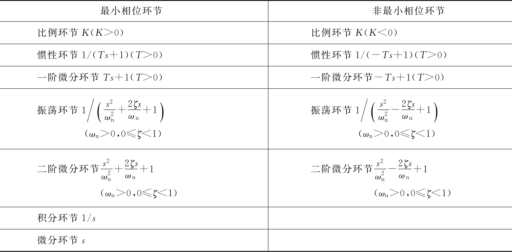

<!-- 最小相位环节有七种

1) 比例环节  $K \quad(K>0)$
2) 惯性环节  $1 /(T s+1) \quad(T>0)$
3) 一阶微分环节  $T s+1 \quad(T>0)$
4) 振荡环节  $1 /\left(s^{2} / \omega_{n}^{2}+2 \zeta s / \omega_{n}+1\right) \quad\left(\omega_{n}>0,0 \leqslant \zeta<1\right)$
5) 二阶微分环节  $s^{2} / \omega_{n}^{2}+2 \zeta s / \omega_{n}+1 \quad\left(\omega_{n}>0,0 \leqslant \zeta<1\right)$
6) 积分环节  $1 / s$
7) 微分环节  $s$

非最小相位环节有五种

1) 比例环节  $K \quad(K<0)$
2) 惯性环节  $1 /(-T s+1) \quad(T>0)$
3) 一阶微分环节  $-T s+1 \quad(T>0)$
4) 振荡环节  $1 /\left(s^{2} / \omega_{n}^{2}-2 \zeta s / \omega_{n}+1\right) \quad\left(\omega_{n}>0,0<\zeta<1\right)$
5) 二阶微分环节  $s^{2} / \omega_{n}^{2}-2 \zeta s / \omega_{n}+1 \quad\left(\omega_{n}>0,0<\zeta<1\right)$ -->

开环传递函数的典型环节分解可将开环系统表示为若干个典型环节的串联形式

$$
G(s) H(s)=\prod_{i=1}^{N} G_{i}(s)
$$

设典型环节的频率特性为

$$
G_{i}(\mathrm{j} \omega)=A_{i}(\omega) \mathrm{e}^{\mathrm{j} \varphi_{i}(\omega)}
$$

则系统开环频率特性

$$
\displaystyle G(\mathrm{j} \omega) H(\mathrm{j} \omega)=\left[\prod_{i=1}^{N} A_{i}(\omega)\right] \mathrm{e}^{\mathrm{j}\left[\sum_{i=1}^{N} \varphi_{i}(\omega)\right]}
$$

系统开环幅频特性和开环相频特性

$$
\displaystyle A(\omega)=\prod_{i=1}^{N} A_{i}(\omega), \quad \varphi(\omega)=\sum_{i=1}^{N} \varphi_{i}(\omega)
$$

系统开环对数幅频特性

$$
\displaystyle L(\omega)=20 \lg A(\omega)=\sum_{i=1}^{N} 20 \lg A_{i}(\omega)=\sum_{i=1}^{N} L_{i}(\omega)
$$

典型环节的Bode图叠加在一起就可以得到整个频率特性的Bode图，特别是采用对数幅频渐近特性曲线的时候。

### Bode 图

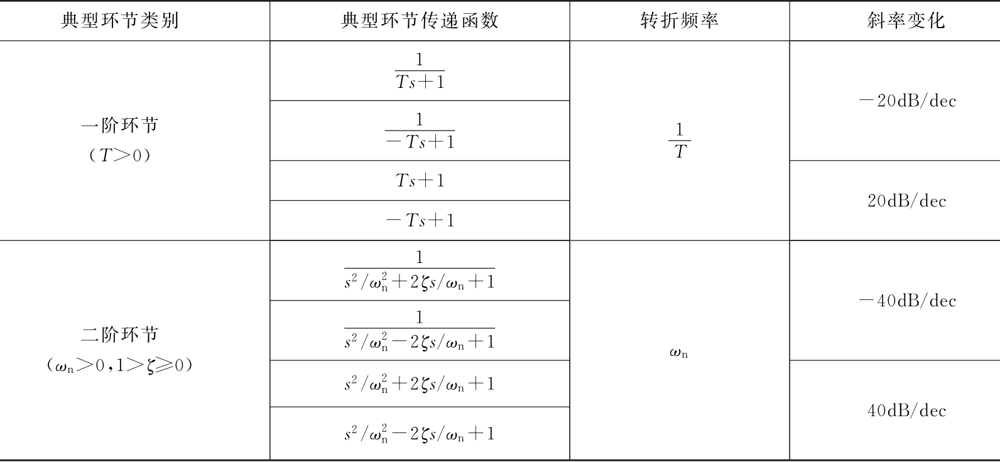

二阶环节，会出现谐振峰值

$$
M_{m}=\dfrac{1}{2 \zeta \sqrt{1-\zeta^{2}}} ,\quad \omega_{m}=\omega_{n} \sqrt{1-2 \zeta^{2}} ,\quad \zeta<\dfrac{1}{\sqrt{2}}
$$

解：先去掉  $M_{m}$  的 dB 单位

$$
\zeta^{2}=\dfrac{1}{2} \pm \dfrac{1}{2} \sqrt{1-\dfrac{1}{M_{m}^{2}}}
$$

### 极坐标图（幅相曲线）

典型环节幅相特性曲线

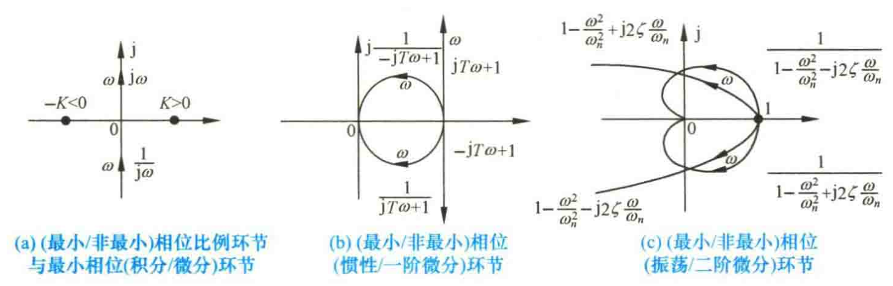

<!-- 开环传递函数的一般形式

$$
G(j \omega)=\dfrac{K_{m}\left(1+j \omega T'_{1}\right)\left(1+j \omega T'_{2}\right) \cdots\left(1+j \omega T'_{w}\right)}{(j \omega)^{m}\left(1+j \omega T_{1}\right)\left(1+j \omega T_{2}\right) \cdots\left(1+j \omega T_{u}\right)}
$$ -->

(1) 极坐标图的起点($0^{+}$)、终点($+\infty$)和渐近线

<!-- 系统的型别为 $m$ ，决定了系统极坐标图的起点，其相角为  $m \times\left(-90^{\circ}\right)$

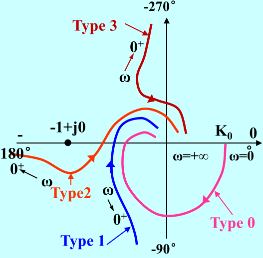

极坐标图的终点

$$
\lim_{\omega \rightarrow+\infty} G(j \omega)=0 \angle(w-m-u) 90^{\circ}
$$

由于分母的阶次通常大于分子的阶次，高频点是顺时针接近的 -->

(2) 极坐标图与实轴和虚轴的交点处的频率

$$
\operatorname{Im}[G(j \omega)]=0 ,\quad \operatorname{Re}[G(j \omega)]=0
$$

<!-- (3) 若传递函数分子没有与  $j \omega$  相关的环节, 则曲线光滑, 且  $G(j \omega)$  的相角随  $\omega$  由 $0$ 变化到  $\infty$  而连续减小.

若传递函数分子有与  $j \omega$  相关的环节, 根据分子时间常数的大小, 极坐标图的相角将不会单调变化, 而会产生凹点

了解  $G(j \omega)$  极坐标图在  $-1$  点附近的形状以及与负实轴的交点是非常重要的 -->

### Nyquist 稳定性判据

奈奎斯特稳定性判据(奈氏判据)：利用已知开环传递函数来判定闭环系统的稳定性。

前提条件： $\displaystyle \lim_{s \rightarrow \infty} G(s) H(s)$  存在

<!-- **数学基础**

设  $s$  为复数变量,  $F(s)$  为  $s$  的有理分式函数。对于  $s$  平面上任意一点  $s$ , 通过复变函数  $F(s)$  的映射关系, 在  $F(s)$  平面上可以确定关于  $s$  的象。

在  $s$  平面上任选一条闭合曲线  $\Gamma$ ,且不通过  $F(s)$  的任一零点和极点, 且包围  $F(s)$  的  $Z$  个零点和  $P$  个极点。

令  $s$  从闭合曲线  $\Gamma$  上任一点  $A$  起, 顺时针沿  $\Gamma$  运动一周, 再回到  $A$  点, 则相应地,  复平面上亦从点  $F(A)$  起, 到  $F(A)$  点止亦形成一条闭合曲线  $\Gamma_{F}$  ，其包围原点的圈数

$$
R=P-Z
$$

其中  $R<0$  和  $R>0$  分别表示  $\Gamma_{F}$  顺时针包围和逆时针包围  $F(s)$  平面的原点,  $R=0$  表示不包围  $F(s)$ 平面的原点。这个性质称为**幅角原理**。

**奈奎斯特曲线**

下面选择复变函数

$$
F(s)=1+G(s) H(s)=1+\dfrac{B(s)}{A(s)}=\dfrac{A(s)+B(s)}{A(s)}
$$

1)  $F(s)$  的零点为闭环传递函数的极点,  $F(s)$  的极点为开环传递函数的极点。
2) 因为开环传递函数分母多项式的阶次一般大于或等于分子多项式的阶次, 故  $F(s)$ 的零点和极点数相同。
3)  $s$  沿闭合曲线  $\Gamma$  运动一周所产生的两条闭合曲线  $\Gamma_{F}$  和  $\Gamma_{G H}$  只相差常数 $1$ , 即闭合曲线  $\Gamma_{F}$  可由  $\Gamma_{G H}$  沿实轴正方向平移一个单位长度获得。闭合曲线  $\Gamma_{F}$  包围复平面原点的圈数等于闭合曲线  $\Gamma_{G H}$  包围复平面  $-1$  点的圈数。

在  $s$  右半平面上选择闭合曲线  $\Gamma$

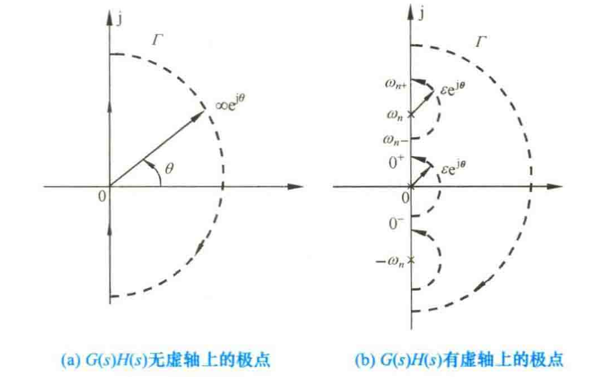

复平面闭合曲线  $\Gamma$  关于实轴对称, 鉴于  $G(s) H(s)$  为实系数有理分式函数, 故**闭合曲线  $\Gamma_{G H}$  亦关于实轴对称**, 因此只需绘制  $\Gamma_{G H}$  在  $\mathrm{Im}(s) \geqslant 0, s \in \Gamma$  对应的曲线段,得  $G(s) H(s)$  的半闭合曲线, 称为**奈奎斯特曲线**, 仍记为  $\Gamma_{G H}$  。 -->

**奈奎斯特曲线绘制**

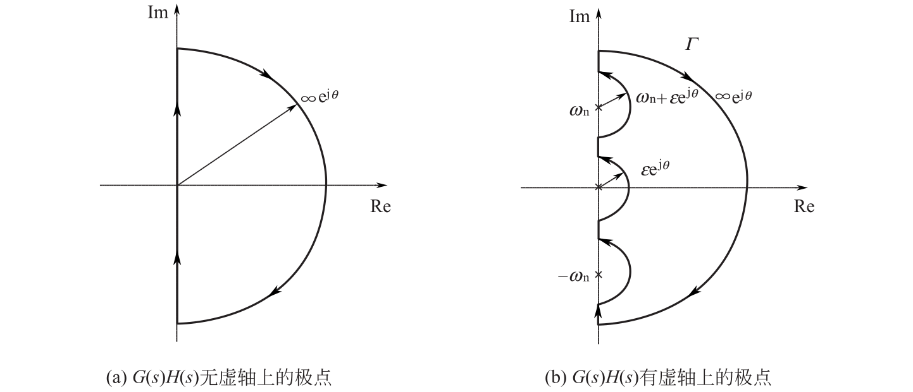

$s$  沿闭合曲线  $\Gamma$  运动一周，产生闭合曲线 $\Gamma_{G H}$

首先考虑  $\Gamma$  上半部分对应的半闭合曲线  $\Gamma_{G H}$：

(1) 若  $G(s) H(s)$  无虚轴上极点

- $\Gamma_{G H}$  在  $s=\mathrm{j} \omega, \omega \in[0,+\infty)$  时，对应开环幅相特性曲线
- $\Gamma_{G H}$  在  $s=\infty \mathrm{e}^{\mathrm{j} \theta}, \theta \in\left[0^{\circ},+90^{\circ}\right]$  时，对应固定的点  $\displaystyle \lim_{s \rightarrow \infty} G(s) H(s)$

(2) 若  $G(s) H(s)$  有原点极点

$\Gamma_{G H}$  在  $s$  在极点附近时，对应曲线为 $G\left(\mathrm{j} 0_{+}\right) H\left(\mathrm{j} 0_{+}\right)$ 点起逆时针作半径无穷大、圆心角为  $\nu \times 90^{\circ}$  的圆弧

$\Gamma$  下半部分对应的半闭合曲线，与上半部分对应的半闭合曲线，关于实轴对称。

**奈奎斯特稳定判据**

设  $N$  为  $\Gamma_{G H}$  穿越  $-1$  点左侧负实轴的次数， $N_{+}$ 表示正穿越的次数和(从上向下穿越)， $N_{-}$ 表示负穿越的次数和(从下向上穿越)。则  $\Gamma_{G H}$  逆时针包围  $-1$  点的圈数为

$$
R=2 N=2\left(N_{+}-N_{-}\right)
$$

记开环传递函数的正实部极点数  $P$ 。则  $F(s)=1+G(s) H(s)$  的零点数，即反馈控制系统正实部极点数为

$$
Z=P-R=P-2 N
$$

当  $P \neq R$  时， $Z \neq 0$ ，系统闭环不稳定。

而当半闭合曲线  $\Gamma_{G H}$  穿过  $-1$  点时，系统可能临界稳定，Nyquist 稳定判据不可用。

### 稳定裕度

定义增益临界点及截止频率  $\omega_{c}$

$$
A\left(\omega_{c}\right)=\left|G\left(\mathrm{j} \omega_{c}\right) H\left(\mathrm{j} \omega_{c}\right)\right|=1
$$

定义**相角裕度**

$$
\gamma=180^{\circ}+\angle\left[G\left(\mathrm{j} \omega_{c}\right) H\left(\mathrm{j} \omega_{c}\right)\right]
$$

其中 $\angle\left[G\left(\mathrm{j} \omega_{c}\right) H\left(\mathrm{j} \omega_{c}\right)\right] < 0$

对于稳定系统，$\gamma > 0$

定义相位临界点及穿越频率 $\omega_{x}$

$$
\varphi\left(\omega_{x}\right)=\angle\left[G\left(\mathrm{j} \omega_{x}\right) H\left(\mathrm{j} \omega_{x}\right)\right]=(2 k+1) \pi ; \quad k=0, \pm 1, \cdots
$$

定义**幅值裕度**为

$$
h=\dfrac{1}{\left|G\left(\mathrm{j} \omega_{x}\right) H\left(\mathrm{j} \omega_{x}\right)\right|}
$$

对数坐标下，幅值裕度

$$
h(\mathrm{dB})=-20 \lg \left|G\left(\mathrm{j} \omega_{x}\right) H\left(\mathrm{j} \omega_{x}\right)\right| (\mathrm{dB})
$$

对于最小相位系统，以相角裕度  $\gamma>0$  和幅值裕度  $h>1$  ( 或  $h(\mathrm{~dB})>0$ ) 作为系统稳定的充要条件是可靠的。

**极坐标图法**

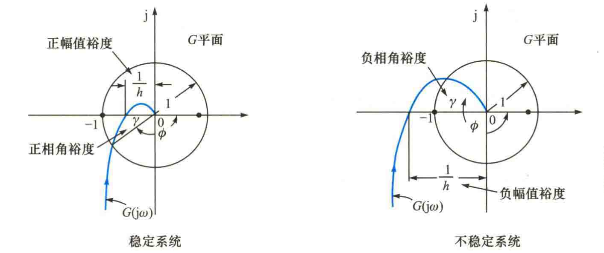

**Bode图法**

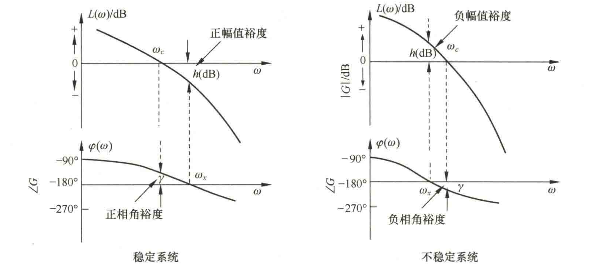

## 系统校正

- 系统分析：根据已知的系统（即结构、参数已知），计算出系统性能，分析这些性能与系统参数之间的关系，结果具有唯一性。
- 系统的综合与校正：根据系统应具备的性能指标以及原系统在性能指标上的缺陷，引入校正装置(元件)，以改善其性能指标。

### 常用校正装置的连接方式

串联校正

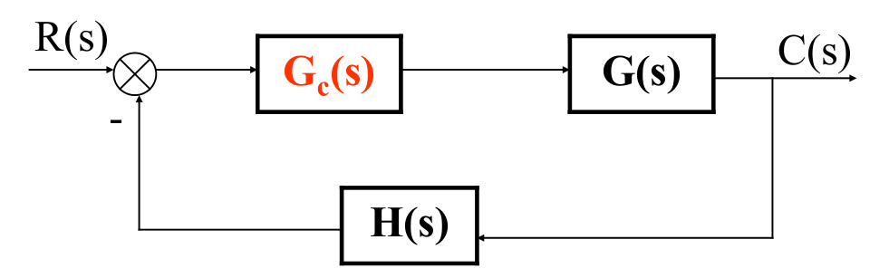

并联校正

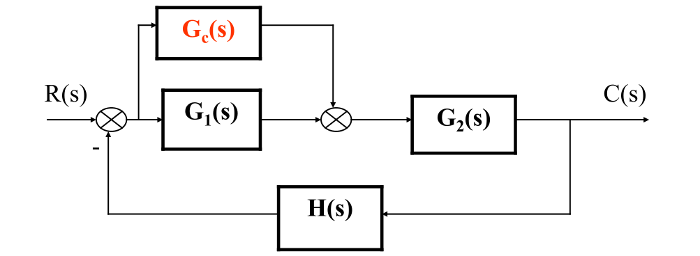

反馈校正

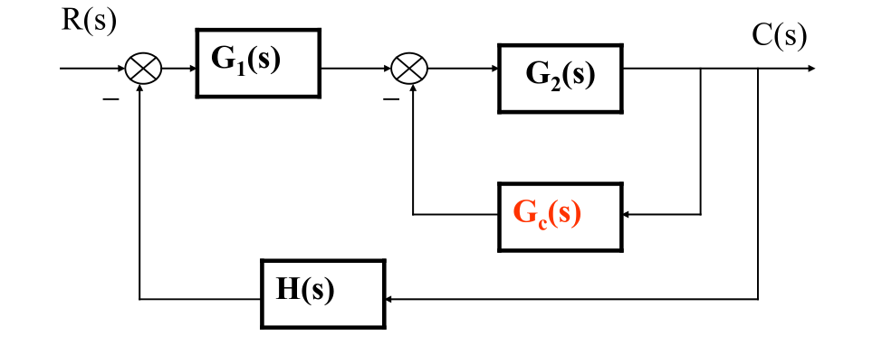

### 比例，积分、微分(PID)控制

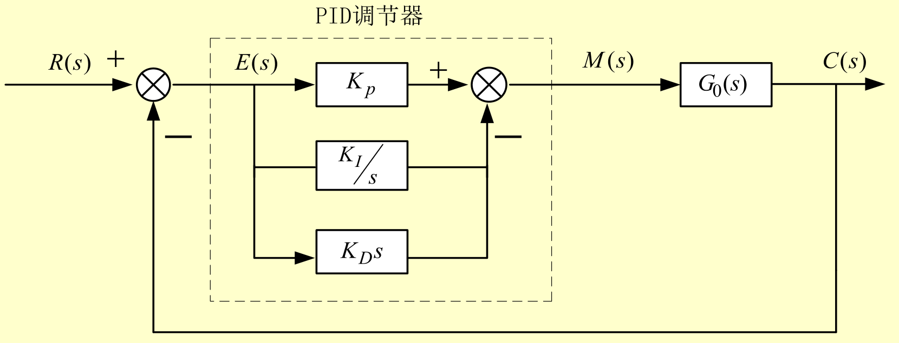

$$
\displaystyle \begin{aligned}
G_{e}(s)&=\frac{M(s)}{E(s)}=K_{p}+\frac{K_{I}}{s}+K_{D} s \\
&=\frac{K_{D}\left(s+\frac{K_{p}+\sqrt{K_{p}^{2}-4 K_{I} K_{D}}}{2 K_{D}}\right)\left(s+\frac{K_{p}-\sqrt{K_{p}^{2}-1 K_{I} K_{D}}}{2 K_{D}}\right)}{s}
\end{aligned}
$$

## 线性离散系统的分析与校正

### 信号的采样与保持

**采样控制系统**

- 系统中的离散信号是脉冲序列形式的离散系统，称为采样控制系统或脉冲控制系统
- 采样器和保持器是采样控制系统中的两个特殊环节

**数字控制系统**

- 系统中的离散信号是数字序列形式的离散系统，称为数字控制系统或计算机控制系统
- 不仅有采样过程，还有还有量化过程
- 模拟-数字转换器(A/D)和和数字-模拟转换器(D/A)是数字控制系统中的两个特殊环节

**采样**：将连续时间信号转化为离散时间信号，可以出现在系统中的多个地方，用开关符号表示。

<!-- 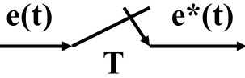 -->

$$
\displaystyle e^{*}(t)=e(t) \sum_{k=-\infty}^{\infty} \delta(t-k T)=e(t) \frac{1}{T} \sum_{k=-\infty}^{\infty} \mathrm{e}^{\mathrm{j} k \omega_{\mathrm{s}} t}
$$

$$
\displaystyle E^{*}(\mathrm{j} \omega)=\frac{1}{T} \sum_{k=-\infty}^{\infty} E\left(\mathrm{j} \omega-\mathrm{j} k \omega_{\mathrm{s}}\right)
$$

$T$  为采样周期，$\omega_{s}=2 \pi / T$  为采样频率。

设  $e(t)$  是某一个带限信号，在  $|\omega|>\omega_{M}$  时，  $E(\mathrm{j} \omega)=0$  。如果  $\omega_{s}>2 \omega_{M}$ ，那么  $e(t)$  就唯一地由其样本  $e(n T), n=0, \pm 1, \pm 2, \cdots$  所确定。频率  $2 \omega_{M}$  一般称为奈奎斯特率。

**零阶保持器(ZOH)**

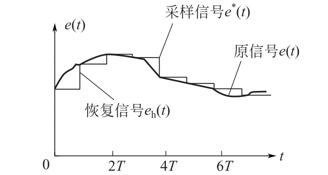

$$
\displaystyle G_{h 0}(j \omega)=\frac{1-\mathrm{e}^{-\mathrm{j} \omega T}}{\mathrm{j} \omega}=T \frac{\sin \frac{\omega T}{2}}{\frac{\omega T}{2}} \cdot \mathrm{e}^{-\mathrm{j} \frac{\omega T}{2}}
$$

- 低通特性，幅值随频率增大迅速衰减；
- 相角滞后特性，且随频率的增大而增大，使闭环系统稳定性变差；
- 时间滞后特性，ZOH 的平均响应在时间上比输入滞后 T/2，相当于给系统增加了一个延迟环节，对稳定性不利，且增加了系统输出中的纹波。

### Z 变换理论

z 变换又称为采样拉氏变换，是研究线性离散系统的重要数学工具。

采样拉氏变换

$$
\displaystyle E^{*}(s)=\sum_{n=0}^{\infty} e(n T) \mathrm{e}^{-n s T}
$$

记变量  $z=\mathrm{e}^{s T}$

$$
\displaystyle E(z)=\sum_{n=0}^{\infty} e(n T) z^{-n}
$$

记为

$$
E(z)=\mathscr{Z}[e^{*}(t)]
$$

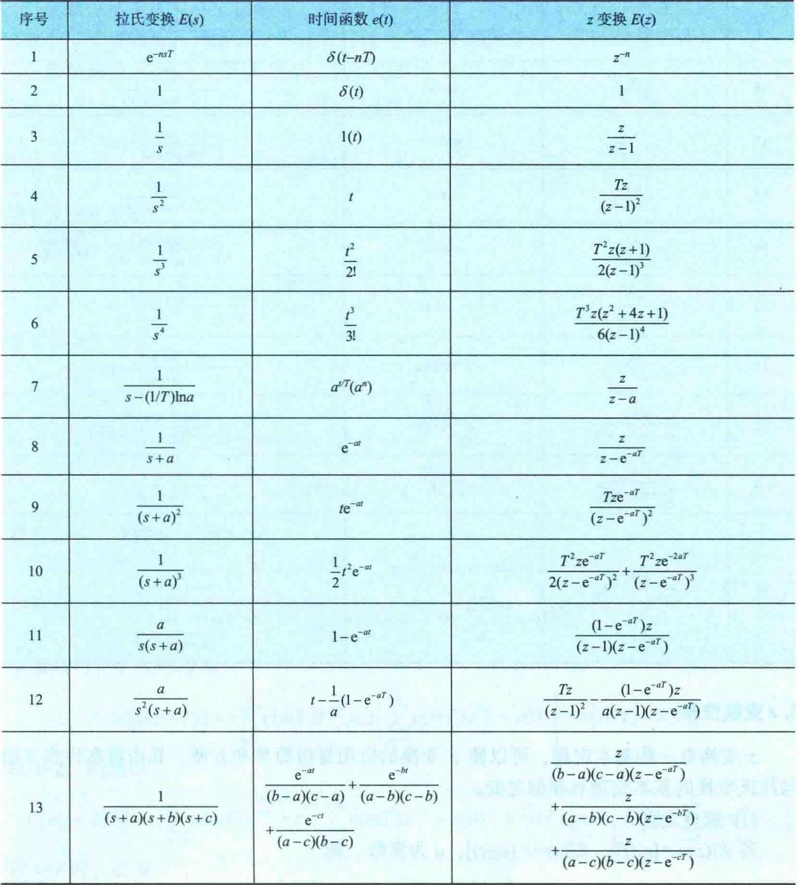
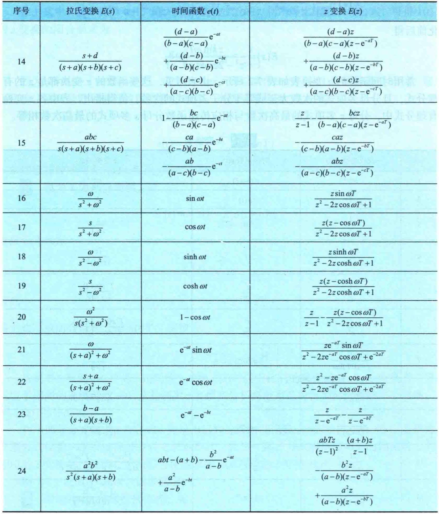
<!-- 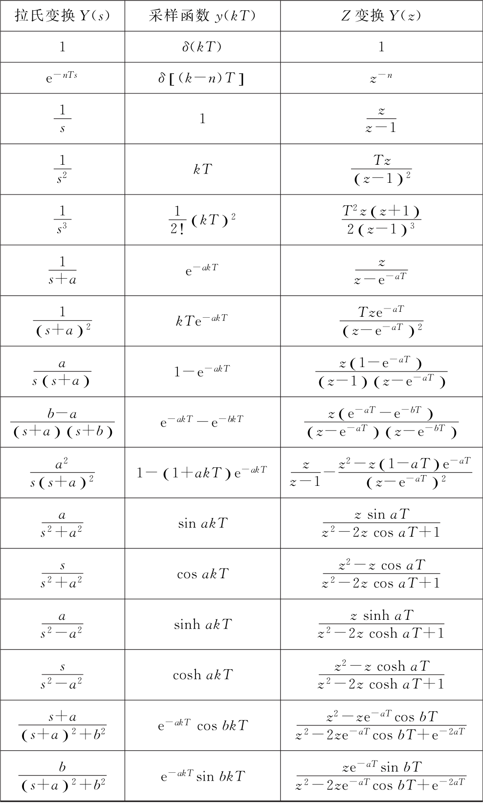 -->

单边Z变换常用的性质

**实数位移定理**

$$
\mathscr{Z}\left[f^{*}\left(t-k T\right)\right]=z^{-k} F(z)
$$

$$
\mathscr{Z}[f^{*}(t+k T)]=z^{k} F(z)-z^{k} F(0)-z^{k-1} F(T)-\cdots-z F\left[(k-1) T\right]
$$

**终值定理**

如果  $F(z)$  的极点位于单位圆内 (单位圆上最多在  $z=1$  处有一阶极点)，则有

$$
\displaystyle \lim_{k \rightarrow \infty} f\left(k T_{s}\right)=\lim_{z \rightarrow 1}\left[\left(1-z^{-1}\right) F(z)\right]
$$

**初值定理**

若  $\lim\limits_{z \rightarrow \infty} F(\mathrm{z})$  存在，则

$$
\displaystyle \lim_{k \rightarrow 0} f\left(k T_{s}\right)=\lim_{z \rightarrow \infty} F(z)
$$

### 数学模型

**脉冲传递函数**定义为零初始条件下系统输出采样信号的 Z 变换与输入采样信号的 Z 变换之比。也可以定义为系统**单位脉冲响应序列**的 Z 变换。

脉冲传递函数的求法要受采样开关数量与位置的影响。

由

$$
\displaystyle E^{*}(s)=\frac{1}{T} \sum_{k=-\infty}^{\infty} E\left(s-\mathrm{j} k \omega_{\mathrm{s}}\right)
$$

可得

$$
\left[G(s) E^{*}(s)\right]^{*}=G^{*}(s) E^{*}(s)
$$

**开环离散系统结构图**

<!-- 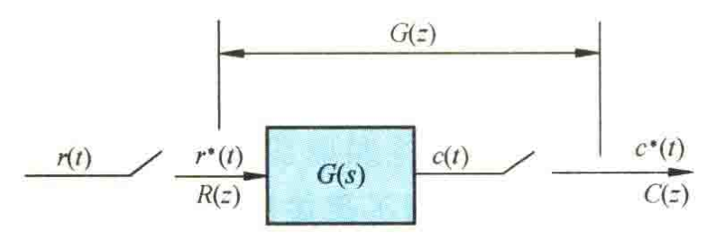 -->
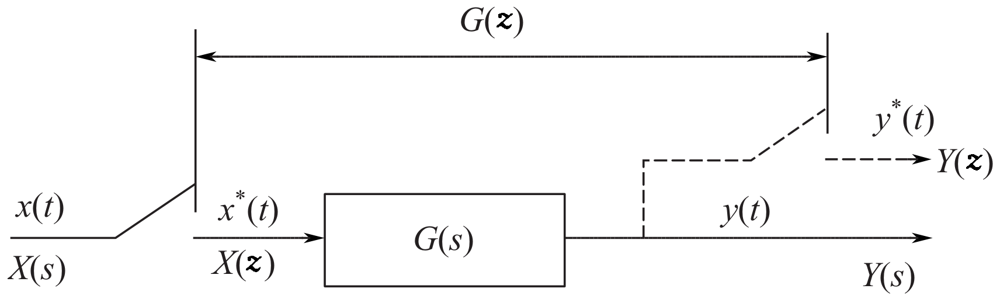

开环脉冲传递函数

$$
G(z)=\dfrac{Y(z)}{X(z)}
$$

实际系统的输出往往是连续信号  $y(t)$  ，而非离散信号  $y^{*}(t)$ ，虚拟采样开关实际上并不存在，只是表明脉冲传递函数作为离散系统的数学模型。

**环节串联形式**

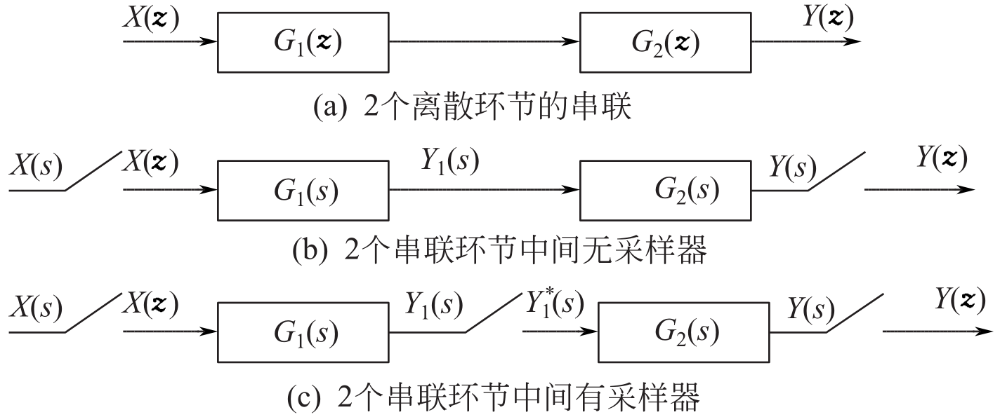

( a ) $G(z)=G_{1}(z) G_{2}(z)$

( b ) $G(z)=\mathscr{Z}\left[G_{1}(s) G_{2}(s)\right]=G_{1} G_{2}(z)$

( c ) $G(z)=\mathscr{Z}\left[G_{1}(s)\right] \mathscr{Z}\left[G_{2}(s)\right]=G_{1}(z) G_{2}(z)$

<!-- 闭环离散系统结构图

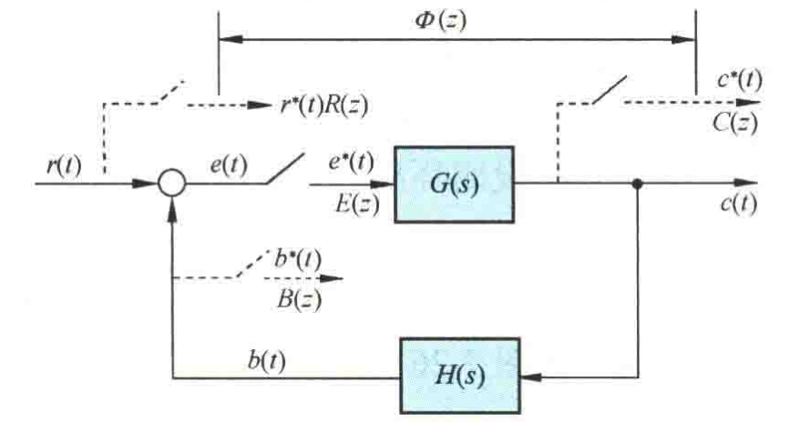

闭环系统脉冲传递函数

$$
\Phi(z)=\dfrac{C(z)}{R(z)}=\dfrac{G(z)}{1+H G(z)}
$$ -->

典型系统的输出 Z 变换

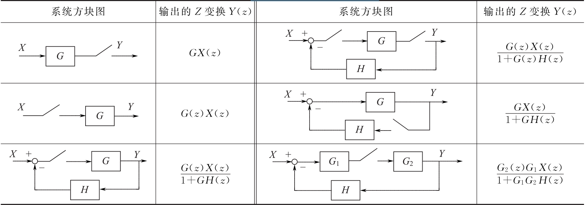

### Z平面分析

**S域到Z域的映射**

$$
z=e^{T_{s} s}=e^{\sigma T_{s}} e^{j \omega T_{s}}=e^{\sigma T_{s}} e^{j 2 \pi \omega / \omega_{s}}
$$

(1)  $s$  平面中实部  $\sigma$  为常数的线对应  $z$  平面中半径为  $e^{\sigma T s}$  的圆。特别地,  $s$  平面的虚轴部分对应  $z$  平面的单位圆; 虚轴上的连续部分对应一系列重叠的圆.

(2)  $s$  平面中虚部  $\omega$  为常数的线对应  $z$  平面中角度  $\omega T_{s}$  的射线.  $s$  平面的负实部  ($-\infty<\sigma<=0$) 对应于  $z$  平面中  $0<z<=1$  的实轴部分。

### 稳定性

离散系统稳定的定义：若离散系统在有界输入序列作用下，其输出序列也是有界的，则称该离散系统是稳定的。

**离散系统稳定的充分必要条件：特征方程的所有特征根在单位圆内**。

从z平面转换到w平面：

$$
\displaystyle z=\frac{w+1}{w-1} \Leftrightarrow w=\frac{z+1}{z-1}
$$

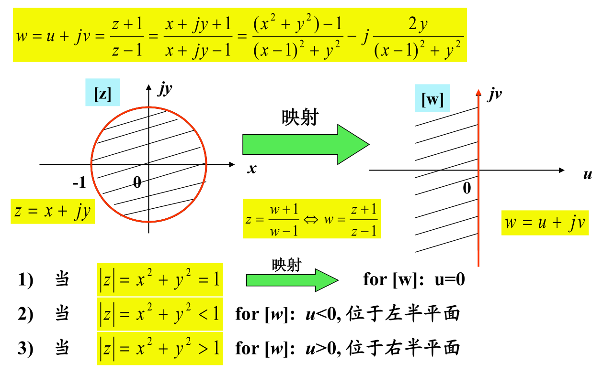

### 稳态误差

误差脉冲传递函数

$$
G_{e}(z)=\dfrac{E(z)}{R(z)}
$$

终值定理

$$
\displaystyle e(\infty)=\lim_{z \rightarrow 1}\left(1-z^{-1}\right) E(z)
$$

## 线性系统的状态空间分析与综合

现代控制理论采用状态空间模型描述系统的行为，能够刻画系统内部变量的运动过程，能够描述多变量系统（MultivariableSystem），包括包括多输入多输出（MIMO）系统。

### 基本概念

- 输入 (Input)：外部施加到系统上的全部激励。
- 输出 (Output)：来自系统的信息，可以从外部量测到。
- 状态 (State)：包括系统过去、现在和将来（时间域上）的运动状况的信息集合。
- 状态变量 (State variable)：一组最少数量的变量，能够确定系统的运动状态。
- 状态向量 (State vector)：如果有 $n$ 个状态变量构成向量 $x(t)$ 的分量，那么 $x(t)$ 称为状态向量，其阶数为 $n$。
- 状态空间 (State space)：由状态变量构成的 $n$ 维空间，称为状态空间。系统在任意时刻的状态向量 $x(t)$ 是状态空间中的一个点。系统随时间变化的过程会在状态空间中描绘出一条轨迹，称为状态轨迹(state trajectory)。
- 状态空间表达 (State space representation)：将反映系统动态过程的 $n$ 阶微分方程转换成一阶微分方程组的形式，并利用矩阵和向量来表示，这就是状态方程。将状态方程与描述系统状态变量与系统输出变量之间关系的输出方程一起构成了状态空间表达式。

线性时不变系统状态空间标准描述：

**连续系统描述**

状态方程 (State equation)：

$$
\dot{\boldsymbol{x}}(t)=\boldsymbol{A} \boldsymbol{x}(t)+\boldsymbol{B} \boldsymbol{u}(t)
$$

输出方程 (Output equation)：

$$
\boldsymbol{y}(t)=\boldsymbol{C} \boldsymbol{x}(t)+\boldsymbol{D} \boldsymbol{u}(t)
$$

- $\boldsymbol{x}(t)$：状态向量，表示系统的状态
- $\dot{\boldsymbol{x}}(t)$：状态向量 $\boldsymbol{x}(t)$ 的一阶导数
- $\boldsymbol{u}(t)$：系统的输入变量
- $\boldsymbol{y}(t)$：系统的输出变量
- $\boldsymbol{A}$：系数矩阵/系统矩阵
- $\boldsymbol{B}$：控制矩阵/输入矩阵
- $\boldsymbol{C}$：输出矩阵/观测矩阵
- $\boldsymbol{D}$：前馈矩阵/输入输出矩阵

**离散系统描述**

状态方程 (State equation)：

$$
\boldsymbol{x}(k+1)=\boldsymbol{A x}(k)+\boldsymbol{B u}(k)
$$

输出方程 (Output equation)：

$$
\boldsymbol{y}(k)=\boldsymbol{C x}(k)+\boldsymbol{D u}(k)
$$

- $\boldsymbol{x}(k)$：状态向量，表示系统的状态在离散时间点 $k$
- $\boldsymbol{u}(k)$：系统的输入变量在离散时间点 $k$
- $\boldsymbol{y}(k)$：系统的输出变量在离散时间点 $k$

### 系统状态方程求解

<!-- #### 连续系统状态方程求解 -->

定义矩阵指数

$$
\displaystyle \mathrm{e}^{\boldsymbol{A} t}=\sum_{k=0}^{\infty} \dfrac{1}{k !} \boldsymbol{A}^{k} t^{k}=\mathscr{L}^{-1}\left[(s \boldsymbol{I}-\boldsymbol{A})^{-1}\right]
$$

对于线性定常系统，$\mathrm{e}^{\boldsymbol{A} t}$  又称为状态转移矩阵，记为  $\boldsymbol{\Phi}(t)$

$\boldsymbol{\Phi}(t)$  具有如下运算性质:

1) $\boldsymbol{\Phi}(0)=\boldsymbol{I}$
2) $\dot{\boldsymbol{\Phi}}(t)=\boldsymbol{A \Phi}(t)=\boldsymbol{\Phi}(t) \boldsymbol{A}$
3) $\boldsymbol{\Phi}\left(t_{1} \pm t_{2}\right)=\boldsymbol{\Phi}\left(t_{1}\right) \boldsymbol{\Phi}\left( \pm t_{2}\right)=\boldsymbol{\Phi}\left( \pm t_{2}\right) \boldsymbol{\Phi}\left(t_{1}\right)$
4) $\boldsymbol{\Phi}^{-1}(t)=\boldsymbol{\Phi}(-t),  \boldsymbol{\Phi}^{-1}(-t)=\boldsymbol{\Phi}(t)$
5) $\boldsymbol{\Phi}\left(t_{2}-t_{0}\right)=\boldsymbol{\Phi}\left(t_{2}-t_{1}\right) \boldsymbol{\Phi}\left(t_{1}-t_{0}\right)$
6) $[\boldsymbol{\Phi}(t)]^{k}=\boldsymbol{\Phi}(k t)$

连续线性时不变系统状态方程

$$
\dot{\boldsymbol{x}}(t)=\boldsymbol{A} \boldsymbol{x}(t)+\boldsymbol{B} \boldsymbol{u}(t)
$$

的解

$$
\displaystyle \begin{aligned}
\boldsymbol{x}(t)&=\mathscr{L}^{-1}\left[(s \boldsymbol{I}-\boldsymbol{A})^{-1}\right] \boldsymbol{x}(0)+\mathscr{L}^{-1}\left[(s \boldsymbol{I}-\boldsymbol{A})^{-1} \boldsymbol{B} \boldsymbol{U}(s)\right] \\
&=\boldsymbol{\Phi}(t) \boldsymbol{x}(0)+\int_{0}^{t} \boldsymbol{\Phi}(\tau) \boldsymbol{B} \boldsymbol{u}(t-\tau) \mathrm{d} \tau
\end{aligned}
$$

**系统的传递函数矩阵**

初始条件为零时，输出向量的拉氏变换式与输入向量的拉氏变换式之间的传递关系称为传递函数矩阵，简称传递矩阵。

$$
\boldsymbol{G}(s)=\boldsymbol{C}(s \boldsymbol{I}-\boldsymbol{A})^{-1} \boldsymbol{B}+\boldsymbol{D}
$$

$$
\boldsymbol{Y}(s)=\boldsymbol{G}(s) \boldsymbol{U}(s)
$$

### 线性系统的可控性和可观性

一个完全状态可控的系统是对于任意初始时刻  $t_{0}$ ，每个状态都可以在有限的时间  $t_{f}>t_{0}$  内，由无约束的容许控制向量  $u(t)$ ，将初始状态  $\boldsymbol{x}\left(t_{0}\right)$ 转移到任意最终状态  $x\left(t_{f}\right)$

一个完全可观的系统是指，存在有限的时刻  $t_{f}>t>t_{0}$ ，系统的输出能唯一的确定每个状态的初始值  $x\left(t_{0}\right)$

一个系统可控的充分必要条件，是可控性矩阵  $M_{C}$  具有如下特性

$$
\displaystyle \operatorname{Rank} M_{C}=\operatorname{Rank}\left[\begin{array}{llll}B & A B & \cdots & A^{n-1} B\end{array}\right]=n
$$

可观性的充分必要条件，是可观性矩阵  $M_{O}$  满足

$$
\displaystyle \operatorname{Rank} M_{O}=\operatorname{Rank}\left[\begin{array}{c}
C \\
C A \\
\vdots \\
C A^{n-1}
\end{array}\right]=n
$$

