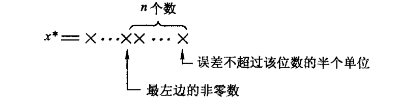
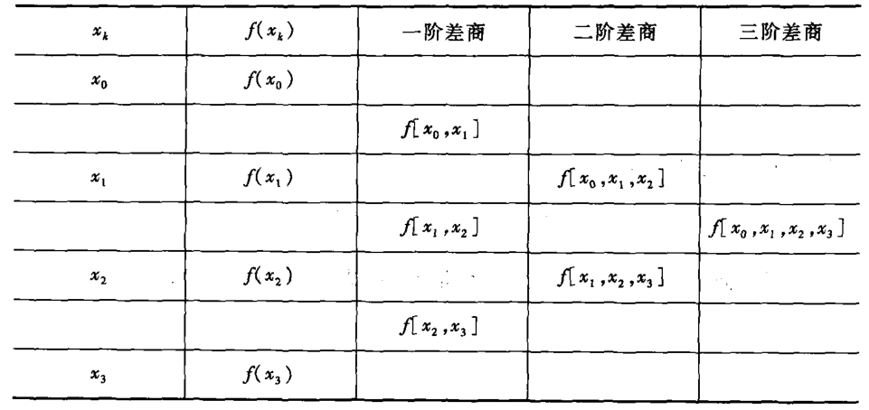
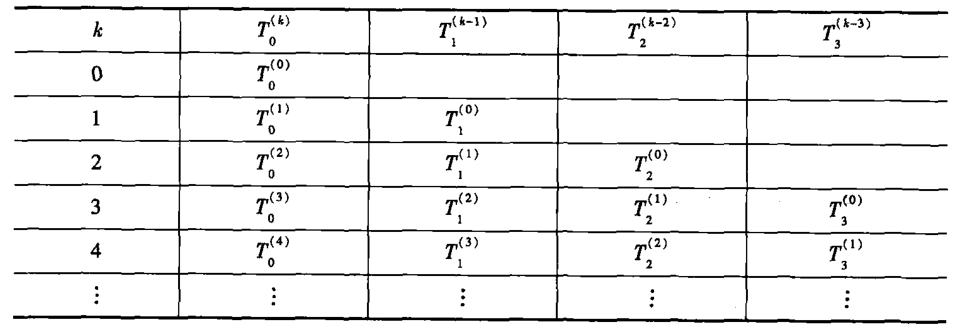

#! https://zhuanlan.zhihu.com/p/639696202
# 计算方法重点整理

笔记源代码 https://github.com/cjyyx/notes/blob/main/%E5%AD%A6%E4%B9%A0%E7%AC%94%E8%AE%B0/%E8%AE%A1%E7%AE%97%E6%96%B9%E6%B3%95/%E8%AE%A1%E7%AE%97%E6%96%B9%E6%B3%95%E5%9B%9E%E9%A1%BE.md

## 误差

**绝对误差**

$$
e^{*}(x)=x-x^{*}
$$

$x^{*}$ 为准确值 $x$ 的近似。

**绝对误差限**(误差限) $\varepsilon^{*}$，满足

$$
\left|e^{*}(x)\right|=\left|x-x^{*}\right| \leqslant \varepsilon^{*}
$$

写成

$$
x=x^{*} \pm \varepsilon^{*}
$$

**相对误差**

$$
e_{r}(x)=\frac{e^{*}(x)}{x}=\frac{x-x^{*}}{x}
$$

也有

$$
e_{r}^{*}(x)=\frac{e^{*}(x)}{x^{*}}=\frac{x-x^{*}}{x^{*}}
$$

**相对误差限** $\varepsilon_{r}^{*}$，满足

$$
\left|e_{r}^{*}(x)\right|=\left|\frac{e^{*}(x)}{x^{*}}\right|=\left|\frac{x-x^{*}}{x^{*}}\right| \leqslant \varepsilon_{r}^{*}
$$

若近似值 $x^{*}$ 某位数的半个单位是它的误差限，而且从该位数字到 $x^{*}$ 最左边的那个非零数字共有 $n$ 位，那么我们把这 $n$ 位数字都称为**有效数字**，并且说近似值 $x^{*}$ 具有 $n$ 位有效数字。

**数值运算中误差传播规律简析**

$y^{*}=f\left(x_{1}^{*}, x_{2}^{*}\right)$ 为函数值 $y=f\left(x_{1}, x_{2}\right)$ 的近似值，则当 $x_{1},x_{2}$ 的误差都较小时，有

$$
\begin{aligned}
y-y^{*} & =f\left(x_{1}, x_{2}\right)-f\left(x_{1}^{*}, x_{2}^{*}\right) \\
& \approx\left(\frac{\partial f}{\partial x_{1}}\right)^{*}\left(x_{1}-x_{1}^{*}\right)+\left(\frac{\partial f}{\partial x_{2}}\right)^{*}\left(x_{2}-x_{2}^{*}\right)
\end{aligned}
$$

即

$$
e^{*}(y) \approx\left(\frac{\partial f}{\partial x_{1}}\right)^{*} e^{*}\left(x_{1}\right)+\left(\frac{\partial f}{\partial x_{2}}\right)^{*} e^{*}\left(x_{2}\right)
$$

注意上式不是精确的，因为只用了泰勒函数的一阶展开，不过问题不大。

**数值运算中应注意的几个原则**

1. 选用数值稳定性好的算法
2. 相近两数避免相减
3. 绝对值相对太小的数不宜作除数
4. 警惕大数“吃掉”小数造成的危害
5. 简化计算步骤，减少运算次数

## 非线性方程迭代法求根

### 基本概念

取根的初始近似值 $x_{0}$，不断计算迭代公式

$$
x_{k+1}=g\left(x_{k}\right) \quad(k=0,1,2, \cdots)
$$

可得**迭代序列** $\{x_{k}\}$。$g(x)$ 称为**迭代函数**，$x_{k}$ 称根的 $k$ 次近似值。

**全局收敛**

若迭代函数 $g(x)$ 满足条件

(1) 在区间 $[a,b]$ 上 $g^{\prime}(x)$ 存在，且 $|g^{\prime}(x)| \leq L < 1$ (其中 $L$ 为小于 1 的正常数)

(2) 对任意 $x \in [a,b]$，都有 $g(x) \in [a,b]$

则对任取初始近似值 $x \in [a,b]$，迭代法 $x_{k+1}=g(x_{k})$ 产生的迭代序列 $\{x_{k}\}$ 都收敛于方程 $x=g(x)$ 在 $[a,b]$ 上的唯一实根 $x^{*}$

$\left|x^{*}-x_{k}\right| \leq \dfrac{L^{k}}{1-L}\left|x_{1}-x_{0}\right|$

**收敛阶**

若存在常数 $p (p \geq 1)$ 和 $c (c> 0)$，使得

$$
\lim\limits_{k \rightarrow \infty} \dfrac{\left|x^{*}-x_{k+1}\right|}{\left|x^{*}-x_{k}\right|^{p}}=c
$$

则称该迭代过程是 $\boldsymbol{p}$ **阶收敛**的。

当 $0<\left|g^{\prime}\left(x^{*}\right)\right|<1$ 时，线性收敛。

### 牛顿迭代法

**牛顿迭代公式**

$$
x_{k+1}=x_{k}-\frac{f\left(x_{k}\right)}{f^{\prime}\left(x_{k}\right)}
$$

对方程  $f(x)=0$，若存在区间 $[a,b]$ ，使

(1) $f(a)f(b)<0$

(2) 对任意 $x\in [a,b]$ 都有 $f^{\prime}(x) \ne 0$

(3) $f^{\prime\prime}(x)$ 在 $[a,b]$ 上连续且保号

(4) 初值 $x_{0}\in [a,b]$ 且 $f\left(x_{0}\right) f^{\prime \prime}\left(x_{0}\right)>0$

则牛顿迭代过程产生的迭代序列 $\{x_{k}\}$ 收敛于方程 $f(x)=0$ 在 $[a,b]$ 上的唯一实根 $x^{*}$。

**收敛阶**

单根情形

牛顿迭代法在零点 $x^{*}$ 的邻近是平方收敛的

重根情形

当 $x^{*}$ 为 $f(x)= 0$ 的 $m(m \geq 2)$ 重零点，$f(x)$ 在其零点$x^{*}$ 的某邻域内有二阶连续导数，则牛顿法局部线性收敛。

### 加速收敛方法

斯蒂芬森(Steffensen)方法 (也叫艾特肯算法)

把艾特肯加速技巧与不动点迭代结合，可得如下的迭代法
$$
\left\{\begin{aligned}
& y_{k}=g\left(x_{k}\right) \\
& z_{k}=g\left(y_{k}\right) \\
& x_{k+1}=x_{k}-\dfrac{\left(y_{k}-x_{k}\right)^{2}}{z_{k}-2 y_{k}+x_{k}}
\end{aligned}\right.
$$

迭代函数为

$$
h(x)=x-\frac{(g(x)-x)^{2}}{g(g(x))-2 g(x)+x}
$$

若 $x_{k+1}=g\left(x_{k}\right)$ 为 $p$ 阶收敛，则斯蒂芬森方法 $p+1$ 阶收敛。

### 非线性方程组牛顿迭代法求根

记  $X=\left(x_{1}, \cdots, x_{n}\right)^{T} \in R^{n}$,  $F=\left(f_{1}, \cdots, f_{n}\right)^{T}$

则非线性方程组可写成

$$
F(X)=0
$$

雅可比（Jacobi ）矩阵 
$$
F^{\prime}(X)=\dfrac{\partial\left(f_{1}, f_{2}, \cdots, f_{n}\right)}{\partial\left(x_{1}, x_{2}, \cdots, x_{n}\right)}=\left[\begin{array}{cccc}
\frac{\partial f_{1}}{\partial x_{1}} & \frac{\partial f_{1}}{\partial x_{2}} & \cdots & \frac{\partial f_{1}}{\partial x_{n}} \\
\frac{\partial f_{2}}{\partial x_{1}} & \frac{\partial f_{2}}{\partial x_{2}} & \cdots & \frac{\partial f_{2}}{\partial x_{n}} \\
\vdots & \vdots & \vdots \\
\frac{\partial f_{n}}{\partial x_{1}} & \frac{\partial f_{n}}{\partial x_{2}} & \cdots & \frac{\partial f_{n}}{\partial x_{n}}
\end{array}\right]
$$

有解非线性方程组的牛顿迭代法
$$
X^{(k+1)}=X^{(k)}-\left[F^{\prime}\left(X^{(k)}\right)\right]^{-1} F\left(X^{(k)}\right)
$$

## 线性代数方程组的解法

### 高斯消元法

三角形方程组: 通过**回代**和**前代**的方法求解

高斯消元法：将线性方程组等价地变换为一个上三角形方程组，然后用回代法求解，它包括消元和回代两个过程。

高斯消元法求解一个$n$ 阶线性方程组共需乘除法运算的总数为

$$
S=\frac{1}{3} n^{3}+n^{2}-\frac{1}{3} n=O\left(n^{3}\right)
$$

为了避免上述高斯消元法中数值计算的不稳定性，一般要在每次消元之前增加一个**选主元**的过程，将绝对值最大或较大的元素交换到主元素的位置上。

列主元的思想是：当变换到第 $k$ 步时，从第 $k$ 列及以下的各元素中选出绝对值最大者，然后通过**行变换**将它交换到主元素的位置 $(k,k)$ 上。

### 三角分解法

设实矩阵 $A$ 的各阶主子式 $\operatorname{det}\left(A_{i}\right) \neq 0(i=1,2, \cdots, n)$ 则，存在唯一的**杜利特尔分解(LU 分解)**

$$
A=L U
$$

其中

$$
L=\left[\begin{array}{ccccc}
1 & & & & \\
l_{21} & 1 & & & \\
l_{31} & l_{32} & 1 & & \\
\vdots & \vdots & \ddots & \ddots & \\
l_{n 1} & l_{n 2} & \cdots & l_{n, n-1} & 1
\end{array}\right], \quad U=\left[\begin{array}{ccccc}
u_{11} & u_{12} & u_{13} & \cdots & u_{1 n} \\
& u_{22} & u_{23} & \cdots & u_{2 n} \\
& & u_{33} & \cdots & u_{3 n} \\
& & & \ddots & \vdots \\
& & & & u_{n n}
\end{array}\right]
$$

且有

$$
u_{k i}=a_{k i}-\sum_{j=1}^{k-1} l_{k j} u_{j i} \quad (i=k, k+1, \cdots, n)
$$

$$
l_{i k}=\left(a_{i k}-\sum_{j=1}^{k-1} l_{i j} u_{j k}\right) / u_{k k} \quad (i=k+1, k+2, \cdots, n)
$$

矩阵三角分解的计算工作量（乘除法次数）为 $O\left(n^{3}\right)$。

则只需求解

$$
\left\{\begin{array}{l}
L y=b \\
U x=y
\end{array}\right.
$$

### 范数

**向量范数**

$$
\|x\|_{1}=\sum\limits_{j=1}^{n}\left|x_{j}\right|
$$

$$
\|x\|_{2}=(\sum\limits_{j=1}^{n}\left|x_{j}\right|^{2})^{\frac{1}{2}}
$$

$$
\|x\|_{\infty}=\max\limits_{1 \leq j \leq n}\left|x_{j}\right|
$$

分别称为向量 $x$ 的$1$范数、$2$范数和$\infty$范数。更一般地，称

$$
\|x\|_{p}=\left(\sum\limits_{j=1}^{n}\left|x_{j}\right|^{p}\right)^{1 / p}
$$

为 $p(1 \leq p \leq+\infty)$范数。

**矩阵算子范数**

$$
\|A\|_{r}=\max\limits_{x \neq 0} \dfrac{\|A x\|_{r}}{\|x\|_{r}}
$$

$$
\|A\|_{1}=\max\limits_{1 \leq j \leq n} \sum_{i=1}^{n}\left|a_{i j}\right|
$$

$$
\|A\|_{2}=\left[\lambda_{\max}\left(A^{T} A\right)\right]^{1 / 2}
$$

其中 $\lambda_{\max }\left(A^{T} A\right)$ 是矩阵 $A^{T} A$ 的最大特征值。

$$
\|A\|_{\infty}=\max\limits_{1 \leq i \leq n} \sum_{j=1}^{n}\left|a_{i j}\right|
$$

$$
\|A\|_{F}=\left(\sum\limits_{i=1}^{n} \sum\limits_{j=1}^{n}\left|a_{i j}\right|^{2}\right)^{\frac{1}{2}}
$$

分别称为矩阵 $A$ 的 1 范数(列模)、2 范数(谱模)、$\infty$ 范数(行模)和 $F$ 范数。

### 迭代法

$$
x^{(k+1)}=B x^{(k)}+f
$$

- $\{x^{(k)}\}$：迭代序列
- $B$：迭代矩阵

**雅可比迭代法**

分解

$$
A=D-L-U
$$

其中

$$
D=\operatorname{diag}\left(a_{11}, a_{22}, \cdots, a_{n n}\right)
$$

$$
L=\left(\begin{array}{ccccc}
0 & & & & 0 \\
-a_{21} & 0 & & & \\
-a_{31} & -a_{32} & 0 & \\
\vdots & \vdots & \ddots & \ddots & \\
-a_{n 1} & -a_{n 2} & \cdots & -a_{n, n-1} & 0
\end{array}\right)
$$

$$
U=\left(\begin{array}{ccccc}
0 & -a_{12} & -a_{13} & \cdots & -a_{1 n} \\
& 0 & -a_{23} & \cdots & -a_{2 n} \\
& & \ddots & \ddots & \vdots \\
& & & 0 & -a_{n-1, n} \\
0 & & & & 0
\end{array}\right)
$$

雅可比迭代矩阵

$$
B_{J}=D^{-1}(L+U)
$$

$$
f_{J}=D^{-1} b
$$

**高斯-赛德尔迭代法**

$$
B_{G}=(D-L)^{-1} U
$$

$$
f_{G}=(D-L)^{-1} b
$$

**逐次超松驰（SOR）迭代法**

<!-- SOR 迭代法实际上是对高斯-赛德尔迭代法的加权平均，即

$$
x^{(k+1)}=(1-\omega) x^{(k)}+\omega \tilde{x}^{(k+1)}
$$

其中 $\tilde{x}^{(k+1)}$ 为高斯-赛德尔迭代法的迭代解。 -->

$$
B_{\omega}=(D-\omega L)^{-1}\left[(1-\omega) D+\omega U\right]
$$

$$
f_{\omega}=\omega(D-\omega L)^{-1} b
$$

### 收敛与稳定性

**迭代公式收敛的充要条件**

设矩阵 $A \in C^{\,n \times n}$ 的特征值为 $\lambda_{1}, \lambda_{2}, \cdots, \lambda_{n}$，称

$$
\rho(A)=\max\limits_{1 \leq j \leq n}\left|\lambda_{j}\right|
$$

为 $A$ 的**谱半径**

矩阵 $A$ 的谱半径不大于矩阵 $A$ 的任一算子范数 $\|A\|_{r}$。

迭代公式收敛的充要条件是 $\rho(B) < 1$。$\rho(B)$ 越小，则收敛越快。

**方程组的状态与矩阵的条件数**

初始数据 $A, b$ 的微小变化引起了解的很大变化，称这样的方程组为**病态方程组**。

矩阵  $A$  的**条件数**  $\operatorname{Cond}(A)=\left\|A^{-1}\right\| \cdot\|A\|$

条件数与所取的矩阵范数有关, 常用的有:

$$
\begin{array}{l}
\operatorname{Cond}_{\infty}(A)=\left\|A^{-1}\right\|_{\infty} \cdot\|A\|_{\infty} \\
\operatorname{Cond}_{2}(A)=\left\|A^{-1}\right\|_{2} \cdot\|A\|_{2}=\sqrt{\dfrac{\lambda_{\max }\left(A^{T} A\right)}{\lambda_{\min }\left(A^{T} A\right)}}
\end{array}
$$

其中  $\operatorname{Cond}_{2}(A)$  称为谱条件数。

设  $A$  是非奇异矩阵, 若  $\operatorname{Cond}(A) \gg 1$ , 则称方程组  $A x=b$  为**病态方程组**; 若  $\operatorname{Cond}(A)$  相对较小, 则称方程组  $A x=b$  为**良态方程组**. 

**方程组近似解可靠性判别法**

设  $x^{*}$  是方程组  $A x=b$ ($A$ 非奇异且  $b \neq 0$)  的精确解。若  $\tilde{x}$  是该方程组的近似解, 其残余向量  $r=b-A \tilde{x}$ , 则有

$$
\dfrac{\left\|x^{*}-\tilde{x}\right\|}{\left\|x^{*}\right\|} \leq \operatorname{Cond}(A) \dfrac{\|r\|}{\|b\|}
$$

## 插值与拟合

### 插值概念与基础理论

给定函数  $f(x)$  在区间  $[a, b]$  上的  $n+1$  个函数值:

$$
\begin{array}{|c|c|c|c|c|}
\hline x & x_{0} & x_{1} & \cdots & x_{n} \\
\hline f(x) & f\left(x_{0}\right) & f\left(x_{1}\right) & \cdots & f\left(x_{n}\right) \\
\hline
\end{array}
$$

$x_{0}, x_{1}, \cdots, x_{n}$  为  $[a, b]$  上  $n+1$  个互不相同的点,  $\Phi$  为给定的某一个函数类。若  $\Phi$  上有函数  $\varphi(x)$ , 满足

$$
\varphi\left(x_{i}\right)=f\left(x_{i}\right), i=0,1,2, \cdots, n
$$

则称  $\varphi(x)$  为  $f(x)$  关于结点  $x_{0}, x_{1}, \cdots, x_{n}$  在  $\Phi$  上的**插值函数**。点  $x_{0}, x_{1}, \cdots, x_{n}$  称为**插值结点**,  $[a, b]$  称为**插值区间**,  $f(x)$  称为**被插函数**。

函数类常为代数多项式, 相应的插值问题称为多项式插值.

多项式插值作为函数的逼近, 它与被插函数的误差 $R_{n}(x)=f(x)-P_{n}(x)$  称为**插值余项**（或称误差）。

若  $f(x) \in C^{n+1}[a, b]$ , 且  $\left|f^{(n+1)}(x)\right| \leq M_{n+1}(a \leq x \leq b)$  则  $[a, b]$  上  $f(x)$  以  $\left\{x_{i}\right\}_{i=0}^{n}$  为结点的  $n$  次插值多项式余项

$$
\left|R_{n}(x)\right| \leq \dfrac{M_{n+1}}{(n+1) !}\left|\omega_{n+1}(x)\right|
$$

其中:  $\omega_{n+1}(x)=\prod\limits_{i=0}^{n}\left(x-x_{i}\right)$

### 拉格朗日(Lagrange)型插值多项式

对于给定的  $n+1$  个互异结点  $\left\{x_{i}\right\}_{i=0}^{n}$

**Lagrange 基**

$$
l_{i}(x)=\prod\limits_{j=0, j \neq i}^{n} \dfrac{x-x_{j}}{x_{i}-x_{j}}=\dfrac{\left(x-x_{0}\right) \cdots\left(x-x_{i-1}\right)\left(x-x_{i+1}\right) \cdots\left(x-x_{n}\right)}{\left(x_{i}-x_{0}\right) \cdots\left(x_{i}-x_{i-1}\right)\left(x_{i}-x_{i+1}\right) \cdots\left(x_{i}-x_{n}\right)}
$$

**Lagrange 型插值多项式**

$$
L_{n}(x)=\sum\limits_{i=0}^{n} l_{i}(x) f\left(x_{i}\right)
$$

### 差商与牛顿基本插值多项式

$f(x)$  在  $x_{i}, x_{j}$  处的一阶差商

$$
f\left[x_{i}, x_{j}\right]=\dfrac{f\left(x_{j}\right)-f\left(x_{i}\right)}{x_{j}-x_{i}}
$$

$f(x)$  在  $x_{i}, x_{j}, x_{k}$  处的二阶差商

$$
f\left[x_{i}, x_{j}, x_{k}\right]=\dfrac{f\left[x_{j}, x_{k}\right]-f\left[x_{i}, x_{j}\right]}{x_{k}-x_{i}}
$$

$f(x)$  在  $x_{i 0}, x_{i 1}, \cdots, x_{i m}$  处的  $m$  阶差商

$$
f\left[x_{i 0}, x_{i 1}, \cdots, x_{i m}\right]=\dfrac{f\left[x_{i 1}, \cdots, x_{i m}\right]-f\left[x_{i 0}, \cdots, x_{i m-1}\right]}{x_{i m}-x_{i 0}}
$$

特别地, 规定零阶差商为:  $f\left[x_{i}\right]=f\left(x_{i}\right)$

$n$  次牛顿型插值多项式

$$
\begin{aligned}
N_{n}(x)= & f\left[x_{0}\right]+f\left[x_{0}, x_{1}\right]\left(x-x_{0}\right) \\
& +f\left[x_{0}, x_{1}, x_{2}\right]\left(x-x_{0}\right)\left(x-x_{1}\right)+\cdots \\
& +f\left[x_{0}, x_{1}, \cdots, x_{n}\right]\left(x-x_{0}\right)\left(x-x_{1}\right) \cdots \cdots\left(x-x_{n-1}\right)
\end{aligned}
$$

### 分段低次插值

分段线性插值

分段二次插值

三次样条插值: 在给出的结点上与函数有相同的值，在两个结点之间为一条三次曲线，在整条曲线上有二阶连续导数

$S(x)$  是一个分段三次多项式. 用  $S_{i}(x)$  表示  $S(x)$  在第  $i$  个 子区间  $\left[x_{i-1}, x_{i}\right]$  上的表达式, 则  $S_{i}(x)$  形如

$$
S_{i}(x)=a_{i}+b_{i} x+c_{i} x^{2}+d_{i} x^{3}, x \in\left[x_{i-1}, x_{i}\right],
$$

其中  $a_{i}, b_{i}, c_{i}, d_{i}$  为待定系数. 子区间共有  $n$  个, 这样的待定系数共有  $4 n$  个.

要求分段三次多项式函数  $S(x)$  及其导数  $S^{\prime}(x), S^{\prime \prime}(x)$  在区间  $[a, b]$  上连续, 只要它们在各子区间的连接点  $x_{i}(i=1,2, \cdots, n-1)$  上连续即可. 因此, 可得待定系数应满足的  $4 n-2$  个方程

$$
\left\{\begin{aligned}
& S\left(x_{i}-0\right)=S\left(x_{i}+0\right) & (i=1,2, \cdots, n-1) \\
& S^{\prime}\left(x_{i}-0\right)=S^{\prime}\left(x_{i}+0\right) & (i=1,2, \cdots, n-1) \\
& S^{\prime \prime}\left(x_{i}-0\right)=S^{\prime \prime}\left(x_{i}+0\right) & (i=1,2, \cdots, n-1) \\
& S\left(x_{i}\right)=y_{i} & (i=0,1,2, \cdots, n)
\end{aligned}\right.
$$

### 埃尔米特（Hermite）插值

埃尔米特（Hermite）插值: 插值在给定的结点处，不但要求插值多项式的函数值与被插函数的函数值相同，同时还要求在结点处，插值多项式的一阶直至指定阶的导数值也与被插函数的相应阶导数值相等。

### 最小二乘法

用最小二乘法求近似函数的问题可以归结为: 对于给定数据  $\left(x_{i}, y_{i}\right)   (i=1,2, \cdots, m)$ , 要求在某个函数类  $\Phi$  中寻求一个函数  $\varphi^{*}(x)$ , 使

$$
\sum\limits_{i=1}^{m}\left[\varphi^{*}\left(x_{i}\right)-y_{i}\right]^{2}=\min\limits_{\varphi(x) \in \Phi} \sum\limits_{i=1}^{m}\left[\varphi\left(x_{i}\right)-y_{i}\right]^{2} \text {, }
$$

其中  $\varphi(x)$  为函数类  $\Phi$  中任意函数.

作为曲线拟合的一种常见情况, 若讨论的是**代数多项式拟合**, 即

$$
\varphi(x)=a_{0}+a_{1} x+\cdots+a_{n} x^{n}
$$

则有

$$
\left[\begin{array}{cccc}
m & \sum x_{i} & \cdots & \sum x_{i}^{n} \\
\sum x_{i} & \sum x_{i}^{2} & \cdots & \sum x_{i}^{n+1} \\
\vdots & \vdots & & \vdots \\
\sum x_{i}^{n} & \sum x_{i}^{n+1} & \cdots & \sum x_{i}^{2 n}
\end{array}\right]\left[\begin{array}{c}
a_{0} \\
a_{1} \\
\vdots \\
a_{n}
\end{array}\right]=\left[\begin{array}{c}
\sum y_{i} \\
\sum x_{i} y_{i} \\
\vdots \\
\sum x_{i}^{n} y_{i}
\end{array}\right]
$$

用**加权最小二乘法**进行拟合的要求与原则是: 对于给定数据  $\left(x_{i}, y_{i}\right)(i=1 ,  2, \cdots, m)$ , 要求在函数类  $\Phi$  中寻求一个函数  $\varphi^{*}(x)$ , 使

$$
\sum\limits_{i=1}^{m} W_{i}\left[\varphi^{*}\left(x_{i}\right)-y_{i}\right]^{2}=\min\limits_{\varphi(x) \in \Phi} \sum\limits_{i=1}^{m} W_{i}\left[\varphi\left(x_{i}\right)-y_{i}\right]^{2}
$$

其中  $\varphi(x)$  为函数类  $\Phi$  中任意函数,  $W_{i}(i=1,2, \cdots, m)$  为一列正数, 是反映数据  $\left(x_{i}, y_{i}\right)$  特性的“权”.

作为特例, 当  $\varphi(x)=a_{0}+a_{1} x+\cdots+a_{n} x^{n}$  时, 相应的法方程组为

$$
\left[\begin{array}{cccc}
\sum W_{i} & \sum W_{i} x_{i} & \cdots & \sum W_{i} x_{i}^{n} \\
\sum W_{i} x_{i} & \sum W_{i} x_{i}^{2} & \cdots & \sum W_{i} x_{i}^{n+1} \\
\vdots & \vdots & & \vdots \\
\sum W_{i} x_{i}^{n} & \sum W_{i} x_{i}^{n+1} & \cdots & \sum W_{i} x_{i}^{2 n}
\end{array}\right]\left[\begin{array}{c}
a_{0} \\
a_{1} \\
\vdots \\
a_{n}
\end{array}\right]=\left[\begin{array}{c}
\sum W_{i} y_{i} \\
\sum W_{i} x_{i} y_{i} \\
\vdots \\
\sum W_{i} x_{i}^{n} y_{i}
\end{array}\right]
$$

## 数值微分与积分

### 数值微分基本概念

根据函数在一些离散点上的函数值，求该函数导数的近似值称为数值微分。

最简单的方法是利用插值多项式构造数值微分公式。

### 常用数值微分公式

**两点公式**

$$
f^{\prime}\left(x_{0}\right) \approx \dfrac{f\left(x_{1}\right)-f\left(x_{0}\right)}{h}
$$

$$
f^{\prime}\left(x_{1}\right) \approx \dfrac{f\left(x_{1}\right)-f\left(x_{0}\right)}{h}
$$

**三点公式**

$$
f^{\prime}\left(x_{0}\right) \approx \dfrac{-3 f\left(x_{0}\right)+4 f\left(x_{1}\right)-f\left(x_{2}\right)}{2 h}
$$

$$
f^{\prime}\left(x_{1}\right) \approx \dfrac{f\left(x_{2}\right)-f\left(x_{0}\right)}{2 h}
$$

$$
f^{\prime}\left(x_{2}\right) \approx \dfrac{f\left(x_{0}\right)-4 f\left(x_{1}\right)+3 f\left(x_{2}\right)}{2 h}
$$

**二阶数值微分公式**

$$
f^{\prime \prime}\left(x_{1}\right) \approx \dfrac{f\left(x_{0}\right)-2 f\left(x_{1}\right)+f\left(x_{2}\right)}{h^{2}}
$$

### 数值积分基本概念

$$
\int\limits_{a}^{b} f(x) \mathrm{d} x \approx \sum\limits_{k=0}^{n} A_{k} f\left(x_{k}\right)
$$

- $x_{k}$：求积结点
- $A_{k}$：求积系数

若数值积分公式对任意不高于  $m$  次的代数多项式都准确地成立, 而对于  $x^{m+1}$  却不能准确地成立, 则称该数值积分公式的**代数精度**为  $m$ .

积分的真值与由某数值积分公式给出的近似值之差, 称为该数值积分公式的**余项**, 记作  $R[f]$

$$
R[f]=\int\limits_{a}^{b} f(x) \mathrm{d} x-\sum\limits_{k=0}^{n} A_{k} f\left(x_{k}\right)
$$

构造求积公式的一种简单方法是利用插值多项式的准确积分作为数值积分值.

### 常用数值积分公式

**梯形公式**，代数精度 $m=1$

$$
\int\limits_{a}^{b} f(x) \mathrm{d} x \approx \dfrac{b-a}{2}[f(a)+f(b)]
$$

**辛普森公式**，代数精度 $m=3$

$$
\int\limits_{a}^{b} f(x) \mathrm{d} x \approx \dfrac{b-a}{6}\left[f(a)+4 f\left(\dfrac{a+b}{2}\right)+f(b)\right]
$$

**复合求积**: 先将积分区间  $[a, b]$  分成几个小区间  $\left[x_{k-1}, x_{k}\right](k=1 ,  \left.2, \cdots, n ; x_{0}=a, x_{n}=b\right)$ , 然后在每个小区间上用某个数值积分公式计算积分  $\int_{x_{k-1}}^{x_{k}} f(x) \mathrm{d} x$  的近似值 (记作  $I_{k}$  ), 并取它们的和  $\sum_{k=1}^{n} I_{k}$  作为整个区间  $[a, b]$  上积分  $\int_{a}^{b} f(x) \mathrm{d} x$  的近似值. 用此法得到的数值积分公式, 统称为复合求积公式.

### 数值积分算法

**逐次分半积分法**： 在前次划分区间的基础上，再把每个小区间二等分，即将积分区间逐次分半，用前后两次计算结果之差来估计误差。缩小步长后，可以保留前一次的计算结果，以减少计算量。

**变步长复合梯形法的递推算式**

$$
\left\{\begin{aligned}
T_{2^{0}} & =\dfrac{b-a}{2}[f(a)+f(b)] \\
T_{2^{k}} & =\dfrac{1}{2} T_{2^{k-1}}+\dfrac{b-a}{2^{k}} \sum\limits_{i=1}^{2^{k-1}} f\left[a+(2 i-1) \dfrac{b-a}{2^{k}}\right],\quad (k=1,2, \cdots)
\end{aligned}\right.
$$

**龙贝格（Romberg）算法**

外推方法：用若干个积分近似值推算出更精确的新近似值的方法

龙贝格算法：可以使用变步长复合梯形法的过程中, 利用外推算式将粗糙近似值  $T_{n}$  逐步 “加工” 成越来越精确的近似值.

$$
\left\{\begin{aligned}
T_{0}^{(0)} & = \dfrac{b-a}{2}[f(a)+f(b)] \\
T_{0}^{(l)} & =\dfrac{1}{2} T_{0}^{(l-1)}+\dfrac{b-a}{2^{l}} \sum\limits_{i=1}^{2^{l-1}} f\left[a+(2 i-1) \dfrac{b-a}{2^{l}}\right],\quad (l=1,2,3, \cdots) \\
T_{m}^{(k)} & =\dfrac{4^{m} T_{m-1}^{(k+1)}-T_{m-1}^{(k)}}{4^{m}-1} ,\quad (k=0,1,2, \cdots ; m=1,2,3)
\end{aligned}\right.
$$

### 高斯（Gauss）型求积公式

一般求积公式

$$
\int_{a}^{b} \rho(x) f(x) \mathrm{d} x \approx \sum_{k=0}^{n} A_{k} f\left(x_{k}\right)
$$

中一共有  $2 n+2$  个待定参数  $x_{k}$  与  $A_{k}$  ($k=0,1, \cdots, n$) , 要使求积公式具有  $2 n+1$  次代数精度也是可能的.

若一组节点  $x_{0}, x_{1}, \cdots, x_{n} \in[a, b]$  使插值型求积公式具有  $2 n+1$  次代数精度, 则称此组节点为**高斯点**, 并称相应求积公式为带权  $\rho(x)$  的**高斯型求积公式**.

## 常微分方程的数值解法

### 基本概念

最简单的**常微分方程初值问题**

$$
\left\{\begin{aligned}
& \dfrac{\mathrm{d} y}{\mathrm{~d} x}=f(x, y), x \in[a, b] \\
& y(a)=y_{0}
\end{aligned}\right.
$$

所谓数值解法, 就是求问题的解  $y(x)$  在一列点

$$
a=x_{0}<x_{1}<x_{2}<\cdots<x_{n}=b
$$

上值  $y\left(x_{i}\right)$  的近似值  $y_{i} (i=0,1,2, \cdots, n)$ . 相邻的两个结点之间的距离  $h_{i}=x_{i+1}-x_{i}$  称为由  $x_{i}$  到  $x_{i+1}$  的**步长**, 通常取成常量  $h$ .

若  $y_{i+1}$  是在  $y_{j}=y\left(x_{j}\right)(j \leqslant i)$  的假定下, 由某数值方法得到的  $y\left(x_{i+1}\right)$  的近似值, 则称  $R_{i+1}=y\left(x_{i+1}\right)-y_{i+1}$  为该数值方法的**局部截断误差**.

如果一个数值方法的局部截断误差为  $O\left(h^{p+1}\right)$ , 则称这个方法的**阶数**为  $p$ , 或称它是一个  $p$  阶方法.

如果一个数值方法对任意固定的点  $x_{i}=x_{0}+i h$ , 当  $h=\dfrac{x_{i}-x_{0}}{i} \rightarrow 0$  (即  $i \rightarrow \infty$)  时都有  $y_{i} \rightarrow y\left(x_{i}\right)$ , 则称该法是**收敛**的.

数值方法的收敛性并不涉及计算过程中的舍入误差, 而只与方法的整体截断误差有关.

**整体截断误差**  $\varepsilon_{i}=y\left(x_{i}\right)-y_{i}$  为在  $x_{i}$  处的准确值  $y\left(x_{i}\right)$  与数值方法得到的近似值  $y_{i}$  之间的误差.

当  $y_{0}=y\left(x_{0}\right)$  时, 整体截断误差的阶数往往比局部截断误差低一阶.

设用某一数值方法计算  $y_{i}$  时, 所得到的实际计算结果为  $\tilde{y}_{i}$ , 且由误差  $\delta_{i}=y_{i}-\tilde{y}_{i}$  引起以后各结点处  $y_{j}(j>i)$  的误差为  $\delta_{j}$ , 如果总有  $\left|\delta_{j}\right| \leqslant\left|\delta_{i}\right|$ , 则称该法是**绝对稳定**的.

为便于讨论, 常用试验方程

$$
y^{\prime}=\lambda y
$$

(其中  $\lambda$  为常数, 它可以是复数), 并且把能使某一数值方法绝对稳定的

$$
\tilde{h}=\lambda h
$$

的允许取值范围称为该法的**绝对稳定域**.

对于一般方程  $\dfrac{\mathrm{d} y}{\mathrm{~d} x}=f(x, y)$ , 可近似地取

$$
\lambda \approx-\left|\dfrac{\partial f}{\partial y}\right|_{\left(x_{i}, y_{i}\right)}
$$

以便判断绝对稳定性, 并用以确定求  $y_{i+1}$  时的步长  $h_{i+1}$ .

### 常用数值解法

**欧拉公式**(显式欧拉公式)

$$
y_{i+1}=y_{i}+h f\left(x_{i}, y_{i}\right) \quad(i=0,1, \cdots, n-1)
$$

可用于步进法求解常微分方程。

局部截断误差

$$
R_{i+1}=y\left(x_{i+1}\right)-y_{i+1}=\frac{h^{2}}{2} y^{\prime \prime}\left(x_{i}\right)+\frac{h^{3}}{6} y^{\prime \prime \prime}\left(\zeta_{i}\right)
$$

一阶方法

**后退的欧拉公式**(隐式欧拉公式)

$$
y_{i+1}=y_{i}+h f\left(x_{i+1}, y_{i+1}\right) \quad(i=0,1, \cdots, n-1)
$$

用迭代法求解

$$
y_{i+1}^{(k+1)}=y_{i}+h f\left(x_{i+1}, y_{i+1}^{(k)}\right) \quad(k=0,1,2, \cdots)
$$

局部截断误差

$$
R_{i+1}=-\frac{h^{2}}{2} y^{\prime \prime}\left(x_{i}\right)+O\left(h^{3}\right)
$$

一阶方法

**梯形公式**

$$
y_{i+1}=y_{i}+\frac{h}{2}\left[f\left(x_{i}, y_{i}\right)+\right. \left.f\left(x_{i+1}, y_{i+1}\right)\right] (i=0,1, \cdots, n-1)
$$

用迭代法求解

$$
\left\{\begin{aligned}
& y_{i+1}^{(0)}=y_{i}+h f\left(x_{i}, y_{i}\right), \\
& y_{i+1}^{(k+1)}=y_{i}+\frac{h}{2}\left[f\left(x_{i}, y_{i}\right)+f\left(x_{i+1}, y_{i+1}^{(k)}\right)\right] (k=0,1,2, \cdots)
\end{aligned}\right.
$$

二阶方法

**改进欧拉公式**

$$
\left\{\begin{aligned}
& \tilde{y}_{i+1}=y_{i}+h f\left(x_{i}, y_{i}\right), \\
& y_{i+1}=y_{i}+\frac{h}{2}\left[f\left(x_{i}, y_{i}\right)+f\left(x_{i+1}, \tilde{y}_{i+1}\right)\right] (i=0,1, \cdots, n-1)
\end{aligned}\right.
$$

二阶方法

**龙格-库塔公式**

$$
\left\{\begin{aligned}
& y_{i+1}=y_{i}+h\left(\alpha_{1} K_{1}+\alpha_{2} K_{2}+\cdots+\alpha_{m} K_{m}\right) \\
& K_{1}=f\left(x_{i}, y_{i}\right) \\
& K_{2}=f\left(x_{i}+\lambda_{2} h, y_{i}+\mu_{2} h\right) \\
& \qquad \cdots \\
& K_{m}=f\left(x_{i}+\lambda_{m} h, y_{i}+\mu_{m} h\right)
\end{aligned}\right.
$$

其中  $0 \leqslant \lambda_{j} \leqslant 1$, $y_{i}+\mu_{j} h$  是  $y\left(x_{i}+\lambda_{j} h\right)$  的预估值. 式中  $\alpha_{j}, \lambda_{j}, \mu_{j}$  都是待定参数.

**经典龙格-库塔法**

$$
\left\{\begin{aligned}
& y_{i+1}=y_{i}+\frac{h}{6}\left(K_{1}+2 K_{2}+2 K_{3}+K_{4}\right) \\
& K_{1}=f\left(x_{i}, y_{i}\right) \\
& K_{2}=f\left(x_{i}+\frac{h}{2}, y_{i}+\frac{h}{2} K_{1}\right) \\
& K_{3}=f\left(x_{i}+\frac{h}{2}, y_{i}+\frac{h}{2} K_{2}\right) \\
& K_{4}=f\left(x_{i}+h, y_{i}+h K_{3}\right)
\end{aligned}\right.
$$

四阶方法

### 一阶常微分方程组与高阶常微分方程的数值解法

一阶常微分方程组初值问题

$$
\left\{\begin{aligned}
& \dfrac{d y_{i}}{d x}=f_{i}\left(x, y_{1}, y_{2}, \cdots, y_{n}\right) \\
& y_{i}\left(x_{0}\right)=y_{i 0}
\end{aligned}, i=1,2, \cdots, n\right.
$$

若把  $y$  和  $f$  都理解为向量, 那么之前提到过的各种方法, 都可推广应用到一阶方程组的情形.

$$
\left\{\begin{aligned}
& \boldsymbol{y}^{\prime}=f(x, \boldsymbol{y}), \\
& \boldsymbol{y}\left(x_{0}\right)=\boldsymbol{y}_{0},
& \end{aligned}\right.
$$

相应的经典 R-K公式

$$
\left\{\begin{aligned}
& \boldsymbol{y}_{i+1}=\boldsymbol{y}_{i}+\frac{h}{6}\left(K_{1}+2 K_{2}+2 K_{3}+K_{4}\right), \\
& K_{1}=f\left(x_{i}, \boldsymbol{y}_{i}\right), \\
& K_{2}=f\left(x_{i}+\frac{h}{2}, \boldsymbol{y}_{i}+\frac{h}{2} K_{1}\right), \\
& K_{3}=f\left(x_{i}+\frac{h}{2}, \boldsymbol{y}_{i}+\frac{h}{2} K_{2}\right), \\
& K_{4}=f\left(x_{i}+h, \boldsymbol{y}_{i}+h K_{3}\right) .
\end{aligned}\right.
$$

对于高阶常微分方程初值问题, 原则上总可以转化为一阶方程组求解.

### 边值问题的数值解法

二阶常微分方程

$$
y^{\prime \prime}=f\left(x, y, y^{\prime}\right), x \in[a, b]
$$

边值条件有

(1) 第一边值条件:  $y(a)=\alpha, y(b)=\beta$

(2) 第二边值条件:  $y^{\prime}(a)=\alpha, y^{\prime}(b)=\beta$

(3) 第三边值条件:  $y^{\prime}(a)-\omega_{1} y(a)=\alpha$, $y^{\prime}(b)+\omega_{2} y(b)=\beta$, 其中  $\omega_{1} \geqslant 0, \omega_{2} \geqslant 0, \omega_{1}+\omega_{2}>0$ .

**打靶法**

以第一边值问题为例

$$
\left\{\begin{array}{l}
y^{\prime \prime}=f\left(x, y, y^{\prime}\right) \\
y(a)=\alpha, y(b)=\beta
\end{array}\right.
$$

适当选取  $t$ , 构造初值问题

$$
\left\{\begin{array}{l}
y^{\prime \prime}=f\left(x, y, y^{\prime}\right) \\
y(a)=\alpha, y^{\prime}(a)=t
\end{array}\right.
$$

$$
\beta_{1}=y\left(b, t_{1}\right), \beta_{2}=y\left(b, t_{2}\right) .
$$

若  $\left|\beta_{1}-\beta\right|<\varepsilon$  (或  $\left|\beta_{2}-\beta\right|<\varepsilon$  ), 则可取  $y\left(x, t_{1}\right)$  (或  $y\left(x, t_{2}\right)$  ) 作为边值问题的近似解; 否则当  $\beta_{1}$  与  $\beta_{2}$  互异时, 可用线性插值方法 (或其他方法) 选取  $t$  的新预测值

$$
t_{3}=t_{1}+\frac{t_{2}-t_{1}}{\beta_{2}-\beta_{1}}\left(\beta-\beta_{1}\right)
$$

然后重新试算得  $\beta_{3} \cdots \cdots$  直到  $\left|\beta_{i}-\beta\right|<\varepsilon$  为止, 其中  $\beta_{i}=y\left(b, t_{i}\right)$ , 选取  $t_{i}$  的公式为

$$
t_{i}=t_{i-2}+\frac{t_{i-1}-t_{i-2}}{\beta_{i-1}-\beta_{i-2}}\left(\beta-\beta_{i-2}\right) \quad(i=3,4, \cdots)
$$

**有限差分法**

将微分方程离散为差分方程求解

以二阶线性微分方程第一边值问题为例

$$
\left\{\begin{aligned}
& y^{\prime \prime}-q(x) y=\gamma(x) \quad(q(x) \geqslant 0, x \in[a, b]) \\
& y(a)=\alpha, y(b)=\beta
\end{aligned}\right.
$$

将区间  $[a, b]$  $N$  等分, 记分点为  $x_{i}=x_{0}+i h$  , 其中  $h=\dfrac{b-a}{N}$ , $i=0,1, \cdots, N$.

得确定  $y\left(x_{i}\right)$  近似值  $y_{i}$  的线性方程组

$$
\left\{\begin{aligned}
& \dfrac{y_{i+1}-2 y_{i}+y_{i-1}}{h^{2}}-q\left(x_{i}\right) y_{i}=\gamma\left(x_{i}\right) \\
& y_{0}=\alpha , y_{N}=\beta \\
\end{aligned}\right. (i=1,2, \cdots, N-1)
$$

## 矩阵特征值计算

### 幂法及反幂法

设矩阵  $A=\left[a_{i j}\right]_{n \times n}$  有一个完全的特征向量组 (即特征向量组构成  $\mathbb{R}^{n}$  线性空间的一组基, 这时矩阵  $A$  称为非亏损矩阵), 其特征值为  $\lambda_{1} ,  \lambda_{2}, \cdots, \lambda_{n}$ , 相应的线性无关特征向量为  $X_{1}, X_{2}, \cdots, X_{n}$ .

设矩阵  $A$  的主特征值为实根, 且满足  $\left|\lambda_{1}\right|>\left|\lambda_{2}\right| \geqslant\left|\lambda_{3}\right| \geqslant \cdots \geqslant\left|\lambda_{n}\right|$ .

取  $V_{0}=U_{0} \neq 0$ , 进行如下迭代

$$
\left\{\begin{aligned}
& V_{0}=U_{0} \neq 0\left(\alpha_{1} \neq 0\right), \\
& V_{k}=A U_{k-1}, \\
& U_{k}=\dfrac{V_{k}}{\max \left\{V_{k}\right\}}
\end{aligned}(k=1,2, \cdots)\right.
$$

其中  $\max \{V\}$  表示向量  $V$  的绝对值最大的分量

则有

(1)  $\lim\limits_{k \rightarrow \infty} U_{k}=\dfrac{X_{1}}{\max \left\{X_{1}\right\}}$

(2)  $\lim\limits_{k \rightarrow \infty} \max \left\{V_{k}\right\}=\lambda_{1}$

上述方法称为**幂法**。

**反幂法**：计算矩阵  $A$  的绝对值最小特征值, 就是计算  $A^{-1}$  的绝对值最大特征值。

### 雅可比方法

雅可比方法的基本思想：通过一系列由平面旋转矩阵构成的正交变换（也是相似变换）将实对称矩阵逐步化为对角阵，从而得到全部特征值及其相应的特征向量。

$R^{n}$  中的**平面旋转变换**

$$
\left\{\begin{aligned}
& x_{i}=y_{i} \cos \theta-y_{j} \sin \theta \\
& x_{j}=y_{i} \sin \theta+y_{j} \cos \theta \\
& x_{k}=y_{k} \quad k \neq i, j
\end{aligned}\right.
$$

记为  $x=Q_{i j} y$, 其中  $Q_{i j}$  是**平面旋转矩阵**

$$
Q_{i j}=\begin{bmatrix}
1 &  &  &  &  &  &  &  &  &  & \\
  & \ddots &  &  &  &  &  &  &  &  & \\
  &  & 1 &  &  &  &  &  &  &  & \\
  &  &  & \cos\theta &  & \cdots &  & \sin\theta &  &  & \\
  &  &  &  & 1 &  &  &  &  &  & \\
  &  &  & \vdots &  & \ddots &  & \vdots &  &  & \\
  &  &  &  &  &  & 1 &  &  &  & \\
  &  &  & -\sin\theta &  & \cdots &  & \cos\theta &  &  & \\
  &  &  &  &  &  &  &  & 1 &  & \\
  &  &  &  &  &  &  &  &  & \ddots & \\
  &  &  &  &  &  &  &  &  &  & 1
\end{bmatrix}
$$

有如下性质

(1)  $Q_{i j}$  为正交矩阵。

(2)  $Q_{i j}$  的主对角线元素中除第  $i$  个与第  $j$  个元素为  $\cos \theta$  外, 其它元素均为 $1$ ; 非对角线元素中除第  $i$  行第  $j$  列元素为  $-\sin \theta$ , 第  $j$  行第  $i$  列元素为  $\sin \theta$  外, 其它元素均为零。

(3)  $Q_{i j}^{T} A$  只改变  $A$  的第  $i$  行与第  $j$  行元素,  $A Q_{i j}^{T}$  只改变  $A$  的第  $i$  列与第  $j$  列元素, 所以  $Q_{i}^{T} A Q_{i j}^{T}$  只改变  $A$  的第  $i$  行、第  $j$  行、第  $i$  列、第  $j$  列元素。

设  $A=\left(a_{i j}\right)_{n \times n}(n \geq 3)$  为  $n$  阶实对称矩阵,  $a_{i j}=a_{j i} \neq 0$  为 一对非对角线元素。令

$$
A_{1}=Q_{i j}^{T} A Q_{i j}^{T}=\left(a_{i j}^{(1)}\right)_{n \times n}
$$

则  $A_{1}$  为实对称矩阵, 且  $A_{1}$  与  $A$  有相同的特征值。

取  $\theta$  满足关系式:

$$
\tan 2 \theta=\dfrac{2 a_{i j}}{a_{i i}-a_{j j}}
$$

（当  $a_{i i}=a_{j j}$  时, 可选取  $\theta=\dfrac{\pi}{4}$  ）

此时用  $Q_{i j}$  对  $A$  作正交相似变换化为  $A_{1}$  后,  $A_{1}$  的对角线元素平方和比  $A$  的对角线元素平方和增加了  $2 a_{i j}^{2}$ ; $A_{1}$  的非对角线元素平方和比  $A_{1}$  的非对角线元素平方和减少了  $2 a_{i j}^{2}$ , 且将事先选定的非对角线元素消去了 (即  $a_{i j}^{(1)}=0$  )。因此, 只要逐次地用这种变换, 就可以使得矩阵  $A$  的非对角线元素平方和趋于零, 也即使得矩阵  $A$  逐步化为对角阵。

雅可比方法的计算步骤归纳如下: 

第一步 在矩阵  $A$  的非对角线元素中选取一个非零元素  $a_{i j}$  。 一般说来, 取绝对值最大的非对角线元素;

第二步 由公式  $\tan 2 \theta=\dfrac{2 a_{i j}}{a_{i i}-a_{j j}}$  求出  $\theta$ , 从而得平面旋转矩阵  $Q_{1}=Q_{i j}$ ;

第三步  $A_{1}=Q_{1}^{T} A Q_{1}$ ;

第四步 以  $A_{1}$  代替  $A$ , 重复第一、二、三步求出  $A_{2}$  及  $P_{2}$ , 继续重复这一过程, 直到  $A_{m}$  的非对角线元素全化为充分小 (即小于允许误差) 时为止;

第五步  $A_{m}$  的对角线元素为  $A$  的全部特征值的近似值,  $Q=Q_{1} Q_{2} \cdots Q_{m}$  的第  $j$  列为对应于特征值  $\lambda_{j}$ ($\lambda_{j}$  为  $A_{m}$  的对角线上第  $j$  个元素) 的特征向量。