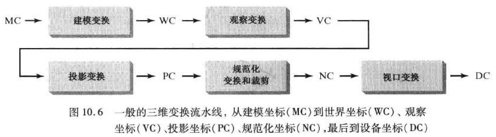
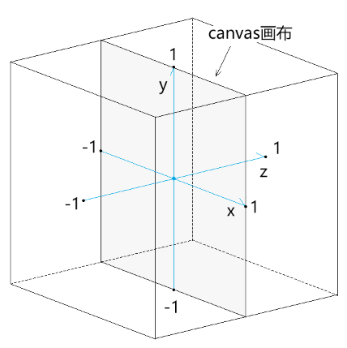
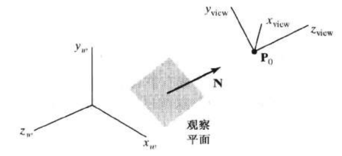
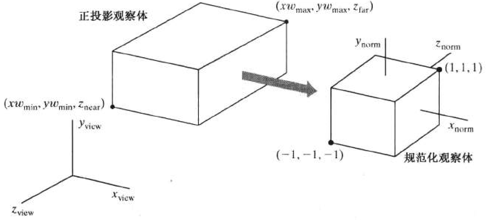
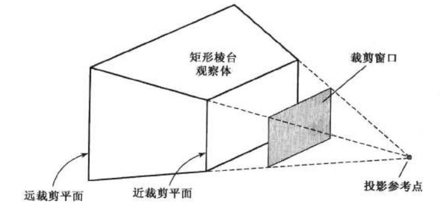

# 三维观察

## 裁剪空间

裁剪空间是用于显示webgl图形的空间，此空间是一个宽、高、深皆为2 的盒子。其坐标系的原点在canvas画布的中心，如下图：

裁剪空间中：

- x轴上-1的位置对应canvas画布的左边界，1的位置对应canvas 画布的右边界
- y轴上-1的位置对应canvas画布的下边界，1的位置对应canvas 画布的上边界
- z轴上-1的位置朝向屏幕外部，1的位置朝向屏幕内部

## 观察平面

观察原点

$$
\mathbf{P}_{0}=\left(x_{0}, y_{0}, z_{0}\right)
$$

- 观察向上向量对应  $y_{\text{view}}$ ,记为 $\mathbf{V}$
- 观察平面法向量对应  $z_{\text{view}}$ ,记为 $\mathbf{N}$

uvn 观察坐标系

$$
\mathbf{n}=\frac{\mathbf{N}}{|\mathbf{N}|}=\left(n_{x}, n_{y}, n_{z}\right)
$$

$$
\mathbf{u}=\frac{\mathbf{V} \times \mathbf{n}}{|\mathbf{V} \times \mathbf{n}|}=\left(u_{x}, u_{y}, u_{z}\right)
$$

$$
\mathbf{v}=\mathbf{n} \times \mathbf{u}=\left(v_{x}, v_{y}, v_{z}\right)
$$

## 世界坐标系到观察坐标系的变换

平移观察坐标系原点到世界坐标系原点

$$
\mathbf{T}=\left[\begin{array}{cccc}
1 & 0 & 0 & -x_{0} \\
0 & 1 & 0 & -y_{0} \\
0 & 0 & 1 & -z_{0} \\
0 & 0 & 0 & 1
\end{array}\right]
$$

进行旋转, 分别让  $x_{\text {view }} 、 y_{\text {viev }}$  和  $z_{\text {view }}$  轴对应到世界坐标系的  $x_{w} 、 y_{w} 、 z_{w}$  轴

$$
\mathbf{R}=\left[\begin{array}{cccc}
u_{x} & u_{y} & u_{z} & 0 \\
v_{x} & v_{y} & v_{z} & 0 \\
n_{x} & n_{y} & n_{z} & 0 \\
0 & 0 & 0 & 1
\end{array}\right]
$$

$$
\mathbf{M}_{W C, v C}=\mathbf{R} \cdot \mathbf{T}=\left[\begin{array}{cccc}
u_{x} & u_{y} & u_{z} & -\mathbf{u} \cdot \mathbf{P}_{0} \\
v_{x} & v_{y} & v_{z} & -\mathbf{v} \cdot \mathbf{P}_{0} \\
n_{x} & n_{y} & n_{z} & -\mathbf{n} \cdot \mathbf{P}_{0} \\
0 & 0 & 0 & 1
\end{array}\right]
$$

## 投影变换

对象描述变换到观察坐标后，下一阶段是将其变换到裁剪空间（规范化观察体）

### 正投影

$$
\mathbf{M}_{\text {ortho,norm }}=\left[\begin{array}{cccc}
\frac{2}{x w_{\max }-x w_{\min }} & 0 & 0 & -\frac{x w_{\max }+x w_{\min }}{x w_{\max }-x w_{\min }} \\
0 & \frac{2}{y w_{\max }-y w_{\min }} & 0 & -\frac{y w_{\max }+y w_{\min }}{y w_{\max }-y w_{\min }} \\
0 & 0 & \frac{-2}{z_{\text {near }}-z_{\mathrm{far}}} & \frac{z_{\text {near }}+z_{\mathrm{far}}}{z_{\text {near }}-z_{\mathrm{far}}} \\
0 & 0 & 0 & 1
\end{array}\right]
$$

### 透视投影

$$
\mathbf{M}_{\text {pers }}=\left[\begin{array}{cccc}
z_{p r p}-z_{v p} & 0 & -x_{p r p} & x_{p r p} z_{p r p} \\
0 & z_{p r p}-z_{v p} & -y_{p r p} & y_{p r p} z_{p r p} \\
0 & 0 & s_{z} & t_{z} \\
0 & 0 & -1 & z_{p r p}
\end{array}\right]
$$

## 参考资料

- 李伟博客, http://yxyy.name/blog/
- 计算机图形学 第4版 电子工业出版社