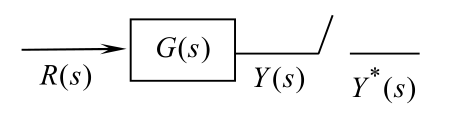
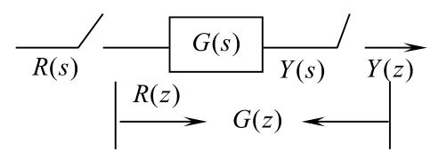
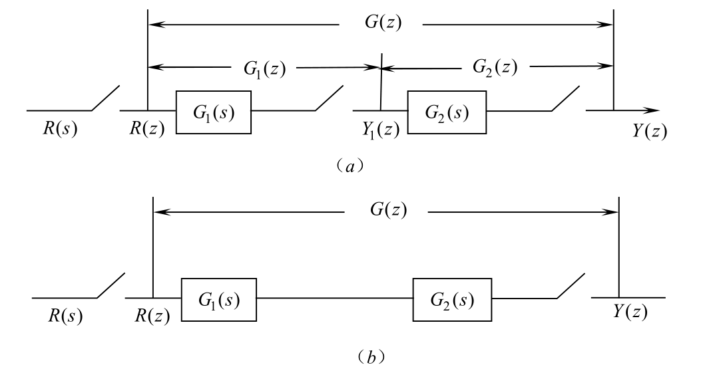
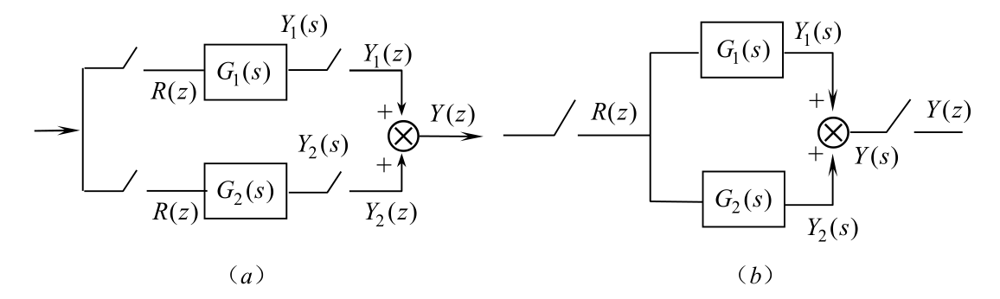
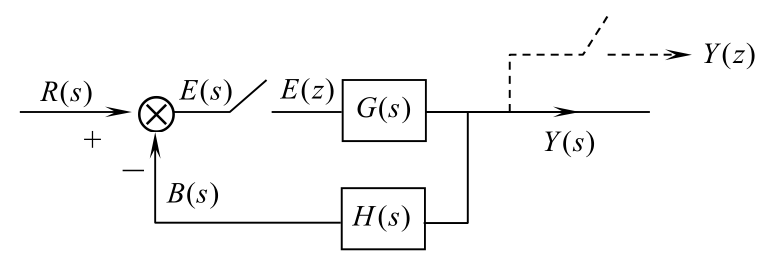
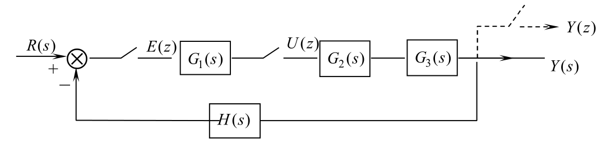

## Z 变换

连续信号 $f(t)$ 通过采样周期为 $T$ 的理想采样开关后，成为采样信号 $f^*(t)$

$$
f^*(t) = \sum_{k=0}^{\infty} f(kt)\delta(t-kT)
$$

连续函数的拉氏变换定义为：

$$
F(s) = \int_0^{\infty} f(t)e^{-st} \, \mathrm{d}t
$$

$$
F^{*}(s)=L[f^{*}(t)]=\sum_{k=0}^{\infty} f(kT)e^{-ksT}
$$

上式中，$F^*(s)$ 是 $s$ 的超越函数。为了使表示简化，令

$$
Z = \mathrm{e}^{sT}
$$

$$
F(z) = F^*(s)\big|_{s=\frac{1}{T}\ln Z} = \sum_{k=0}^{\infty} f(kT)z^{-k}
$$

Z变换本身不包含采样，但它是对已经采样后的离散序列进行变换。Z变换可以看作是采样信号拉普拉斯变换在 $z = e^{sT}$ 映射下的结果。

## 脉冲传递函数

$$
Y^*(s) = [R(s)G(s)]^*
$$

简写为

$$
Y(z) = GR(z) = RG(z)
$$

这里 $R^*(s)$ 写成 $R(z)$，$Y^*(s)$ 写成 $Y(z)$。

理想、同步、单速率采样下，有

$$
Y^*(s) = \left[ R(z)G(s) \right]^* = R(z)G^*(s)
$$

$$
Y(z) = R(z)G(z)
$$

**串联环节的脉冲传递函数**

(a)

$$
Y(z) = G_1(z)G_2(z)R(z)
$$

(b)

$$
Y(z) = R(z)G_1G_2(z)
$$

**并联环节的脉冲传递函数**

(a) (b) 相同，都是

$$
Y(z) = R(z)\left[G_1(z) + G_2(z)\right]
$$

**闭环系统的脉冲传递函数**

$$
E(s)=R(s)-B(s) \Rightarrow E(z)=R(z)-B(z)
$$

$$
B(s)=E^*(s)G(s)H(s) \Rightarrow B(z)=E(z)GH(z)
$$

$$
Y(s)=E^*(s)G(s) \Rightarrow Y(z)=E(z)G(z)
$$

得：

$$
K(z) = \frac{Y(z)}{R(z)} = \frac{G(z)}{1 + GH(z)}
$$

$$
K(z) = \frac{Y(z)}{R(z)} = \frac{G_1(z)G_2G_3(z)}{1 + G_1(z)G_2G_3H(z)}
$$

## 离散状态方程

线性离散控制系统最一般的状态方程和输出方程可表示为

$$
\mathbf{x}(k+1) = \mathbf{G}(k)\mathbf{x}(k) + \mathbf{H}(k)\mathbf{u}(k)
$$

$$
\mathbf{y}(k) = \mathbf{C}(k)\mathbf{x}(k) + \mathbf{D
}(k)\mathbf{u}(k)
$$

$$
\mathcal{Z} \left\{ \mathcal{L}^{-1} \left[ \frac{1 - e^{-sT}}{s} G_p(s) \right]_{t=kT} \right\} = (1 - z^{-1}) \cdot \mathcal{Z} \left\{ \mathcal{L}^{-1} \left[ \frac{G_p(s)}{s} \right]_{t=kT} \right\}
$$

